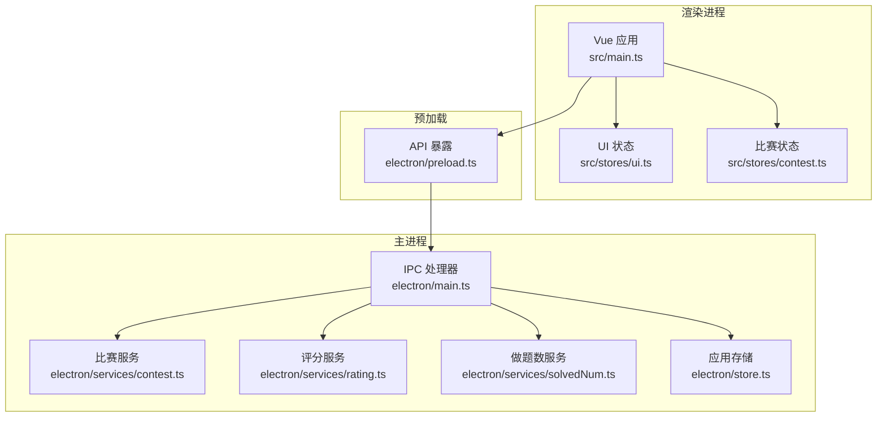
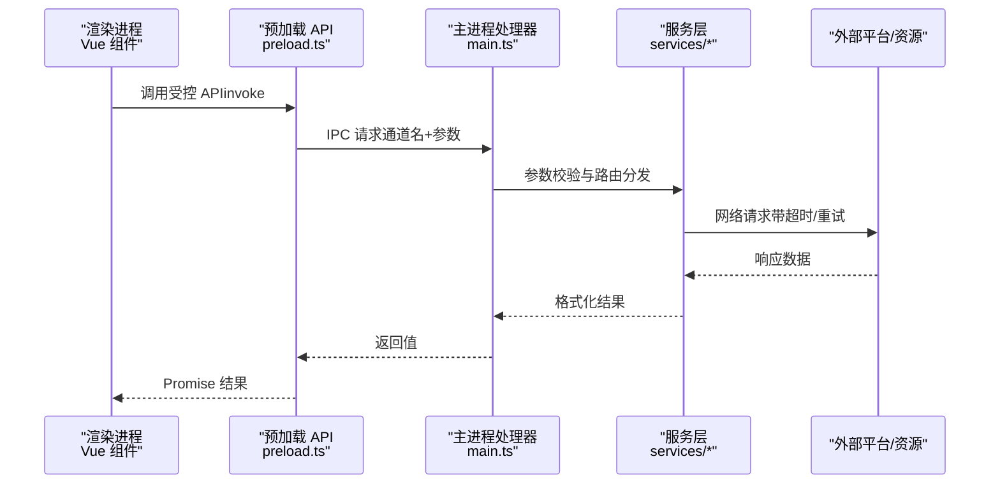
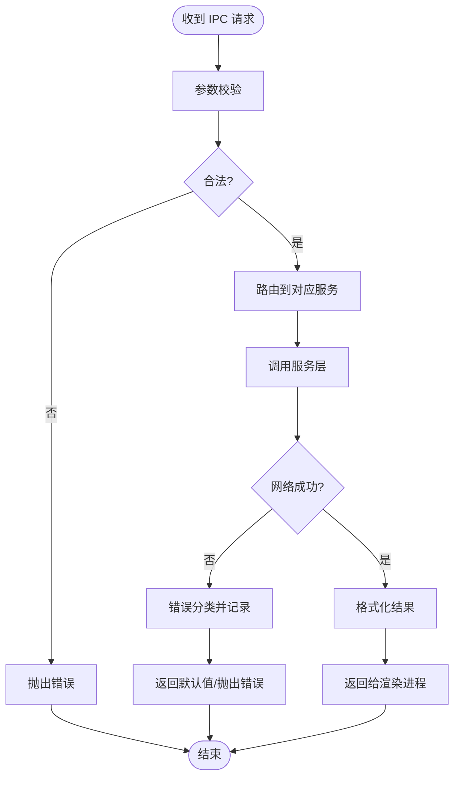
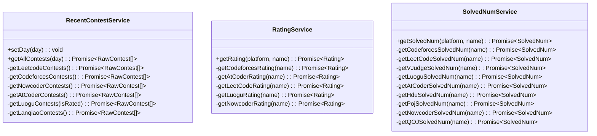
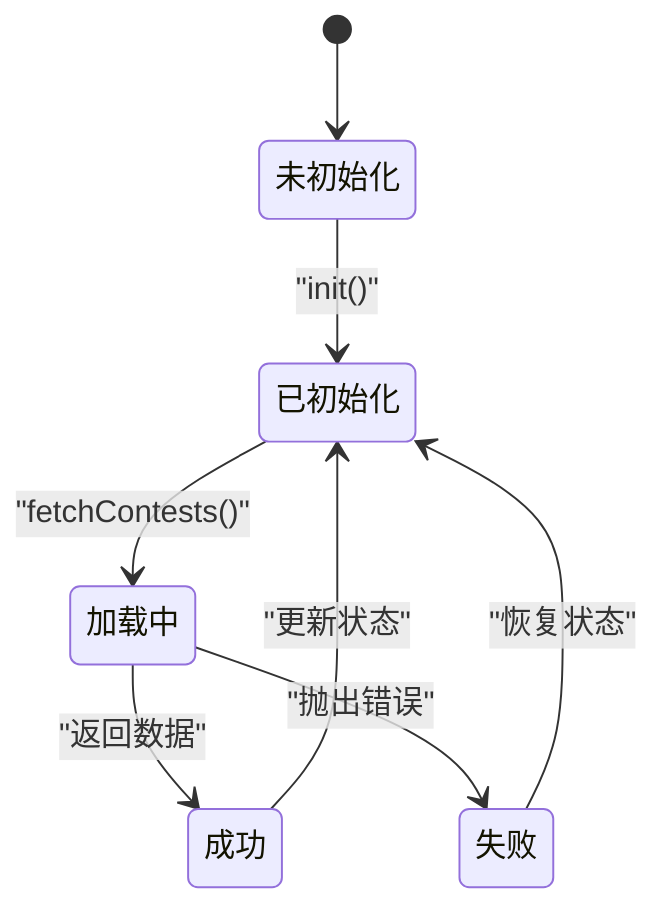
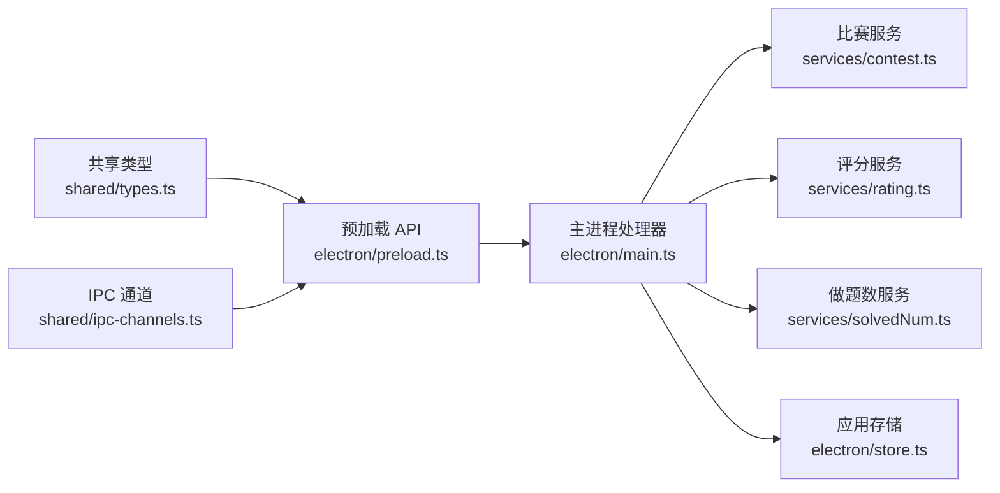

# API参考

<cite>
**本文引用的文件**
- [shared/ipc-channels.ts](file://shared/ipc-channels.ts)
- [shared/types.ts](file://shared/types.ts)
- [electron/preload.ts](file://electron/preload.ts)
- [electron/main.ts](file://electron/main.ts)
- [electron/services/contest.ts](file://electron/services/contest.ts)
- [electron/services/rating.ts](file://electron/services/rating.ts)
- [electron/services/solvedNum.ts](file://electron/services/solvedNum.ts)
- [electron/store.ts](file://electron/store.ts)
- [src/stores/contest.ts](file://src/stores/contest.ts)
- [src/stores/ui.ts](file://src/stores/ui.ts)
- [src/main.ts](file://src/main.ts)
- [package.json](file://package.json)
- [README.md](file://README.md)
- [RELEASE_GUIDE.md](file://RELEASE_GUIDE.md)
</cite>

## 目录
1. [简介](#简介)
2. [项目结构](#项目结构)
3. [核心组件](#核心组件)
4. [架构总览](#架构总览)
5. [详细组件分析](#详细组件分析)
6. [依赖关系分析](#依赖关系分析)
7. [性能考量](#性能考量)
8. [故障排查指南](#故障排查指南)
9. [结论](#结论)
10. [附录](#附录)

## 简介
本文件为 OJFlow 的完整 API 参考文档，覆盖 IPC 通信 API、服务层 API 与前端组件/状态 API。内容面向第三方开发者，提供接口定义、参数与返回值说明、调用约定、错误处理、安全考虑、性能特性、版本兼容与迁移指引，以及集成与最佳实践建议。

## 项目结构
OJFlow 采用 Electron + Vue 3 架构，前后端职责清晰分离：
- 主进程（Electron 主线程）负责系统级能力与外部服务交互（IPC 处理器、定时任务、更新器、存储）。
- 预加载脚本（Preload）通过 contextBridge 暴露受控 API 至渲染进程。
- 渲染进程（Vue 应用）通过 Pinia 状态管理与服务层交互，实现 UI 逻辑与数据持久化。

图表来源
- [src/main.ts:1-26](file://src/main.ts#L1-L26)
- [src/stores/ui.ts:1-91](file://src/stores/ui.ts#L1-L91)
- [src/stores/contest.ts:1-304](file://src/stores/contest.ts#L1-L304)
- [electron/preload.ts:1-38](file://electron/preload.ts#L1-L38)
- [electron/main.ts:396-486](file://electron/main.ts#L396-L486)
- [electron/services/contest.ts:1-270](file://electron/services/contest.ts#L1-L270)
- [electron/services/rating.ts:1-175](file://electron/services/rating.ts#L1-L175)
- [electron/services/solvedNum.ts:1-198](file://electron/services/solvedNum.ts#L1-L198)
- [electron/store.ts:1-31](file://electron/store.ts#L1-L31)

章节来源
- [src/main.ts:1-26](file://src/main.ts#L1-L26)
- [electron/preload.ts:1-38](file://electron/preload.ts#L1-L38)
- [electron/main.ts:396-486](file://electron/main.ts#L396-L486)

## 核心组件
- IPC 通道与类型映射：集中定义于共享模块，确保主进程与渲染进程契约一致。
- 预加载 API：仅暴露白名单方法，封装 ipcRenderer.invoke，统一参数与返回类型。
- 主进程 IPC 处理器：实现业务逻辑，包含参数校验、超时与重试、错误分类与降级。
- 服务层：封装外部平台数据抓取与解析，按平台分发。
- 存储：基于 electron-store 的用户配置与缓存持久化。
- 前端状态：Pinia 管理 UI 主题、比赛列表、收藏与偏好设置。

章节来源
- [shared/ipc-channels.ts:1-53](file://shared/ipc-channels.ts#L1-L53)
- [electron/preload.ts:1-38](file://electron/preload.ts#L1-L38)
- [electron/main.ts:396-486](file://electron/main.ts#L396-L486)
- [electron/services/contest.ts:1-270](file://electron/services/contest.ts#L1-L270)
- [electron/services/rating.ts:1-175](file://electron/services/rating.ts#L1-L175)
- [electron/services/solvedNum.ts:1-198](file://electron/services/solvedNum.ts#L1-L198)
- [electron/store.ts:1-31](file://electron/store.ts#L1-L31)
- [src/stores/contest.ts:1-304](file://src/stores/contest.ts#L1-L304)
- [src/stores/ui.ts:1-91](file://src/stores/ui.ts#L1-L91)

## 架构总览
下图展示 IPC 调用链路与数据流：

图表来源
- [electron/preload.ts:1-38](file://electron/preload.ts#L1-L38)
- [electron/main.ts:396-486](file://electron/main.ts#L396-L486)
- [electron/services/contest.ts:1-270](file://electron/services/contest.ts#L1-L270)
- [electron/services/rating.ts:1-175](file://electron/services/rating.ts#L1-L175)
- [electron/services/solvedNum.ts:1-198](file://electron/services/solvedNum.ts#L1-L198)

## 详细组件分析

### IPC 通信 API（渲染进程侧）
预加载脚本对外暴露受控 API，统一通过 ipcRenderer.invoke 调用主进程 IPC 处理器。仅开放白名单方法，避免直接暴露 ipcRenderer。

- API 列表
  - getRecentContests(day: number): Promise<RawContest[]>
  - getRating(platform: string, name: string): Promise<Rating>
  - getSolvedNum(platform: string, name: string): Promise<SolvedNum>
  - openUrl(url: string): Promise<void>
  - installUpdate(url: string): Promise<boolean>
  - store.get(key: string): Promise<unknown>
  - store.set(key: string, value: unknown): Promise<void>
  - store.getAll(): Promise<Record<string, unknown>>

- 调用约定
  - 使用 window.api 与 window.store 访问。
  - 所有调用返回 Promise；错误通过 Promise 拒绝抛出，需在调用方捕获。
  - 参数类型由共享类型约束，渲染侧以 unknown 形式传递，主进程严格校验。

- 错误处理
  - 主进程对参数长度、协议、平台枚举进行校验，非法参数抛出错误。
  - 网络请求失败按超时/网络/未知分类，主进程统一记录日志并返回可识别的错误类型。

章节来源
- [electron/preload.ts:1-38](file://electron/preload.ts#L1-L38)
- [shared/ipc-channels.ts:18-52](file://shared/ipc-channels.ts#L18-L52)

### 主进程 IPC 处理器（服务编排）
主进程注册 IPC 处理器，负责参数校验、路由分发、错误处理与返回值。

- 通道与处理器
  - GET_CONTESTS: day -> RawContest[]
  - GET_RATING: { platform, name } -> Rating
  - GET_SOLVED_NUM: { platform, name } -> SolvedNum
  - OPEN_URL: url -> void（仅允许 http/https）
  - UPDATER_INSTALL: { url } -> boolean
  - STORE_GET/SET/GET_ALL: 读写应用配置与缓存

- 关键行为
  - 参数校验：字符串长度限制、协议白名单、平台枚举匹配。
  - 超时与重试：网络请求统一包装超时与指数退避重试。
  - 错误分类：TimeoutError、AbortError、网络错误、未知错误。
  - 降级策略：异常时返回空数组或默认值，保证 UI 不崩溃。

图表来源
- [electron/main.ts:396-486](file://electron/main.ts#L396-L486)
- [electron/main.ts:111-225](file://electron/main.ts#L111-L225)

章节来源
- [electron/main.ts:396-486](file://electron/main.ts#L396-L486)
- [electron/main.ts:111-225](file://electron/main.ts#L111-L225)

### 服务层 API（平台数据抓取）
服务层封装不同平台的数据获取与解析逻辑，统一输出标准化数据模型。

- 比赛服务（RecentContestService）
  - 平台：Codeforces、AtCoder、力扣、洛谷、蓝桥云课、牛客。
  - 行为：并发抓取各平台数据，过滤时间范围，合并去重。
  - 输出：RawContest[]（未格式化，含平台标识与链接）。

- 评分服务（RatingService）
  - 平台：Codeforces、AtCoder、力扣、洛谷、牛客。
  - 行为：按平台调用官方 API 或站点解析，提取当前与最大 Rating。
  - 输出：Rating（含名称、当前分、最大分、排名、时间）。

- 做题数服务（SolvedNumService）
  - 平台：Codeforces、力扣、VJudge、洛谷、AtCoder、HDU、POJ、牛客、QOJ。
  - 行为：调用第三方聚合或站点解析，提取 AC 数量。
  - 输出：SolvedNum（名称与做题数）。

图表来源
- [electron/services/contest.ts:12-269](file://electron/services/contest.ts#L12-L269)
- [electron/services/rating.ts:5-174](file://electron/services/rating.ts#L5-L174)
- [electron/services/solvedNum.ts:5-197](file://electron/services/solvedNum.ts#L5-L197)

章节来源
- [electron/services/contest.ts:12-269](file://electron/services/contest.ts#L12-L269)
- [electron/services/rating.ts:5-174](file://electron/services/rating.ts#L5-L174)
- [electron/services/solvedNum.ts:5-197](file://electron/services/solvedNum.ts#L5-L197)

### 数据模型与类型接口
- RawContest：原始比赛数据（名称、开始时间戳、持续秒、平台、可选链接）
- Contest：渲染侧格式化后的比赛数据（含字符串化时间、时长、起止小时分钟、格式化显示等）
- Rating：评分数据（名称、当前分、最大分、可选排名与时间）
- SolvedNum：做题数（名称、做题数）
- 平台枚举类型：ContestPlatform、RatingPlatform、SolvedPlatform

章节来源
- [shared/types.ts:1-67](file://shared/types.ts#L1-L67)

### 前端组件与状态 API（Pinia Store）
- UI 状态（useUiStore）
  - 初始化：优先从 electron-store 读取，否则回退 localStorage。
  - 主题方案与颜色模式持久化，DOM 属性同步。
  - 方法：init()、setThemeScheme()、setColorMode()。

- 比赛状态（useContestStore）
  - 初始化：合并 electron-store 与 localStorage 的配置与收藏。
  - 数据获取：fetchContests() 通过服务层获取 RawContest 并缓存。
  - 收藏管理：toggleFavorite()/removeFavorites()，支持本地与存储双写。
  - 偏好设置：setMaxCrawlDays()/togglePlatform()/toggleHideDate()。
  - 计算属性：timeContests（按天分组并排序）。

图表来源
- [src/stores/ui.ts:21-89](file://src/stores/ui.ts#L21-L89)
- [src/stores/contest.ts:101-243](file://src/stores/contest.ts#L101-L243)

章节来源
- [src/stores/ui.ts:1-91](file://src/stores/ui.ts#L1-L91)
- [src/stores/contest.ts:1-304](file://src/stores/contest.ts#L1-L304)

### 存储 API（electron-store）
- 默认配置：主题方案、颜色模式、语言、最大爬取天数、隐藏日期、平台选择、收藏、用户名、缓存。
- 访问方式：store.get()/store.set()/store.store（读取全部）。
- 作用域：主进程与预加载共享，渲染进程通过 window.store 访问。

章节来源
- [electron/store.ts:4-31](file://electron/store.ts#L4-L31)
- [electron/main.ts:468-479](file://electron/main.ts#L468-L479)
- [electron/preload.ts:22-31](file://electron/preload.ts#L22-L31)

## 依赖关系分析
- 共享类型与通道：渲染进程与主进程通过 shared/ipc-channels.ts 与 shared/types.ts 对齐契约。
- 预加载桥接：preload.ts 仅转发白名单方法，避免直接暴露底层 API。
- 服务层依赖：services/* 依赖 axios/cheerio 等库，负责网络与解析。
- 状态依赖：stores/* 依赖 electron-store 与 localStorage，实现跨会话持久化。

图表来源
- [shared/types.ts:1-67](file://shared/types.ts#L1-L67)
- [shared/ipc-channels.ts:1-53](file://shared/ipc-channels.ts#L1-L53)
- [electron/preload.ts:1-38](file://electron/preload.ts#L1-L38)
- [electron/main.ts:396-486](file://electron/main.ts#L396-L486)
- [electron/services/contest.ts:1-270](file://electron/services/contest.ts#L1-L270)
- [electron/services/rating.ts:1-175](file://electron/services/rating.ts#L1-L175)
- [electron/services/solvedNum.ts:1-198](file://electron/services/solvedNum.ts#L1-L198)
- [electron/store.ts:1-31](file://electron/store.ts#L1-L31)

章节来源
- [shared/ipc-channels.ts:1-53](file://shared/ipc-channels.ts#L1-L53)
- [shared/types.ts:1-67](file://shared/types.ts#L1-L67)
- [electron/preload.ts:1-38](file://electron/preload.ts#L1-L38)
- [electron/main.ts:396-486](file://electron/main.ts#L396-L486)
- [electron/services/contest.ts:1-270](file://electron/services/contest.ts#L1-L270)
- [electron/services/rating.ts:1-175](file://electron/services/rating.ts#L1-L175)
- [electron/services/solvedNum.ts:1-198](file://electron/services/solvedNum.ts#L1-L198)
- [electron/store.ts:1-31](file://electron/store.ts#L1-L31)

## 性能考量
- 网络请求优化
  - 超时与重试：统一包装 fetchWithTimeout 与 fetchJsonWithRetry，支持指数退避。
  - 并发抓取：比赛服务对多个平台使用 Promise.all 并发拉取，显著降低总耗时。
- 数据格式化
  - RawContest -> Contest：在渲染侧进行格式化，避免主进程重复计算。
- 存储与缓存
  - electron-store 用于持久化用户偏好与缓存，减少重复网络请求。
- UI 响应
  - Pinia 状态变更触发响应式更新，避免不必要的重渲染。

章节来源
- [electron/main.ts:111-225](file://electron/main.ts#L111-L225)
- [electron/services/contest.ts:255-266](file://electron/services/contest.ts#L255-L266)
- [electron/store.ts:1-31](file://electron/store.ts#L1-L31)
- [src/stores/contest.ts:77-100](file://src/stores/contest.ts#L77-L100)

## 故障排查指南
- 常见错误类型
  - 参数错误：平台枚举不匹配、字符串过长、URL 协议非法。
  - 网络错误：超时、DNS、连接复位、ETIMEDOUT 等。
  - 未知错误：其他异常，统一分类为 unknown。
- 日志与诊断
  - 主进程记录 fetch 失败与下载失败的详细信息，包含错误类型与状态码。
  - 建议在渲染侧捕获 Promise 拒绝，并向用户反馈可理解的提示。
- 更新器相关
  - 下载失败或非 2xx 状态码时，抛出明确错误；支持重试与回退。
- 存储访问
  - store.get/set/getAll 在主进程注册，渲染侧通过 window.store 访问；若不可用，回退至 localStorage（UI 状态）。

章节来源
- [electron/main.ts:146-167](file://electron/main.ts#L146-L167)
- [electron/main.ts:292-352](file://electron/main.ts#L292-L352)
- [electron/preload.ts:22-31](file://electron/preload.ts#L22-L31)
- [src/stores/ui.ts:25-44](file://src/stores/ui.ts#L25-L44)

## 结论
OJFlow 的 API 设计遵循“预加载桥接 + 主进程编排 + 服务层抓取”的分层架构，通过共享类型与通道实现强契约，保障了扩展性与稳定性。渲染侧通过 Pinia 实现状态与 UI 的解耦，存储层兼顾持久化与性能。建议第三方集成时严格遵循 IPC 约定与参数校验，合理处理网络异常与超时场景。

## 附录

### API 一览表（渲染进程侧）
- getRecentContests(day: number): Promise<RawContest[]>
- getRating(platform: string, name: string): Promise<Rating>
- getSolvedNum(platform: string, name: string): Promise<SolvedNum>
- openUrl(url: string): Promise<void>
- installUpdate(url: string): Promise<boolean>
- store.get(key: string): Promise<unknown>
- store.set(key: string, value: unknown): Promise<void>
- store.getAll(): Promise<Record<string, unknown>>

章节来源
- [electron/preload.ts:1-38](file://electron/preload.ts#L1-L38)
- [shared/ipc-channels.ts:18-52](file://shared/ipc-channels.ts#L18-L52)

### 数据模型定义
- RawContest
  - 字段：name, startTime(number: 秒), duration(number: 秒), platform, link?(string)
- Contest
  - 字段：name, startTime(string), endTime(string), duration(string), platform, link?, startDateTimeDay?, startHourMinute, endHourMinute, startTimeSeconds(number), durationSeconds(number), formattedStartTime, formattedEndTime, formattedDuration
- Rating
  - 字段：name, curRating(number), maxRating(number), ranking?(number), time?(string)
- SolvedNum
  - 字段：name, solvedNum(number)
- 平台枚举
  - ContestPlatform: 'Codeforces' | 'AtCoder' | '洛谷' | '蓝桥云课' | '力扣' | '牛客'
  - RatingPlatform: 'Codeforces' | 'AtCoder' | '力扣' | '洛谷' | '牛客'
  - SolvedPlatform: 'Codeforces' | '力扣' | 'VJudge' | '洛谷' | 'AtCoder' | 'HDU' | 'POJ' | '牛客' | 'QOJ'

章节来源
- [shared/types.ts:1-67](file://shared/types.ts#L1-L67)

### 版本兼容与迁移
- 版本号与发布
  - 当前版本：参见 package.json 的 version 字段。
  - 发布流程：通过 Git Tag（v*）触发 CI 自动构建与发布。
- 迁移建议
  - 若从旧版本升级，应用会在启动后自动迁移 localStorage 数据至 electron-store。
  - 如需手动迁移，可读取 window.store.get('...') 并写回新键空间。

章节来源
- [package.json:3-4](file://package.json#L3-L4)
- [RELEASE_GUIDE.md:12-37](file://RELEASE_GUIDE.md#L12-L37)
- [src/stores/contest.ts:102-140](file://src/stores/contest.ts#L102-L140)
- [src/stores/ui.ts:22-47](file://src/stores/ui.ts#L22-L47)

### 安全考虑
- URL 打开：仅允许 http/https 协议，防止恶意协议执行。
- 参数校验：对平台枚举、字符串长度进行严格限制，避免注入与越界。
- 网络安全：统一超时与重试策略，避免长时间阻塞；对网络错误进行分类与降级。
- 存储安全：electron-store 默认加密敏感配置，建议不在存储中保存明文凭据。

章节来源
- [electron/main.ts:452-458](file://electron/main.ts#L452-L458)
- [electron/main.ts:414-450](file://electron/main.ts#L414-L450)
- [electron/store.ts:1-31](file://electron/store.ts#L1-L31)

### 集成与最佳实践
- 调用约定
  - 使用 window.api.* 与 window.store.*，所有调用返回 Promise，务必 try/catch。
  - 参数必须满足类型与长度限制，避免被主进程拒绝。
- 错误处理
  - 捕获 Promise 拒绝，区分超时、网络、未知错误，给出用户可理解的提示。
- 性能优化
  - 合理设置最大爬取天数，避免一次性请求过多数据。
  - 利用缓存与持久化，减少重复网络请求。
- 安全建议
  - 仅调用白名单 API，避免自行拼装 IPC 请求。
  - 不在存储中保存敏感信息，必要时使用加密存储。

章节来源
- [electron/preload.ts:1-38](file://electron/preload.ts#L1-L38)
- [electron/main.ts:111-225](file://electron/main.ts#L111-L225)
- [src/stores/contest.ts:188-243](file://src/stores/contest.ts#L188-L243)