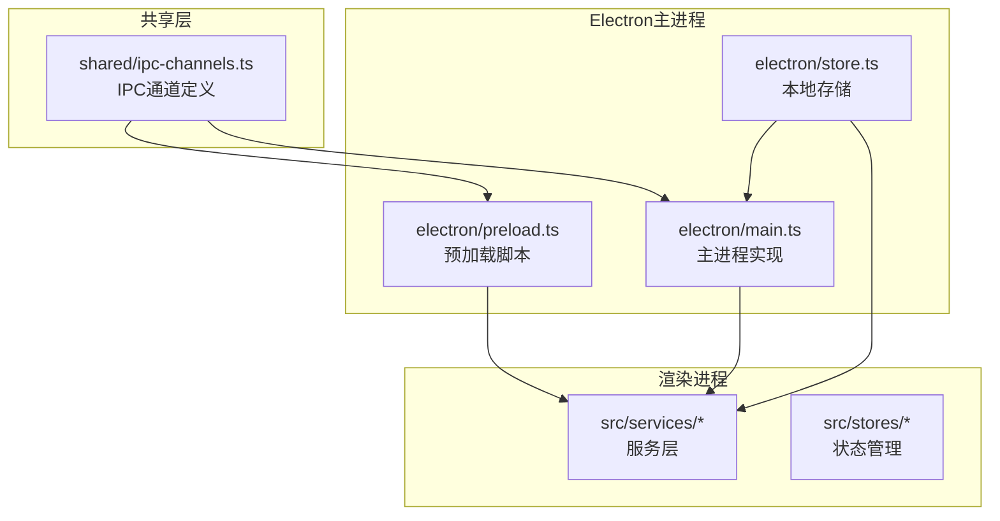
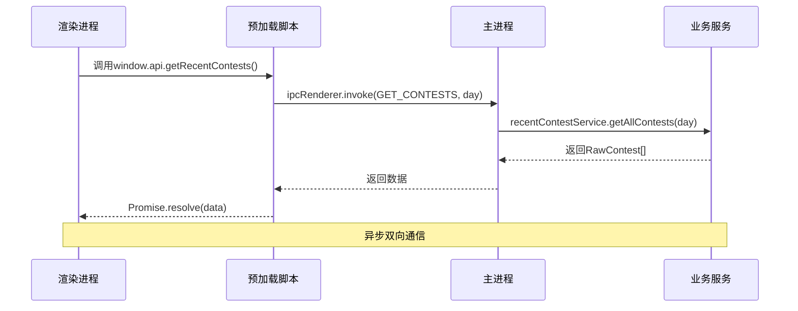
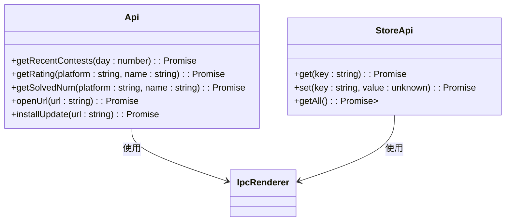
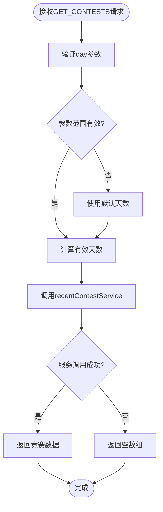
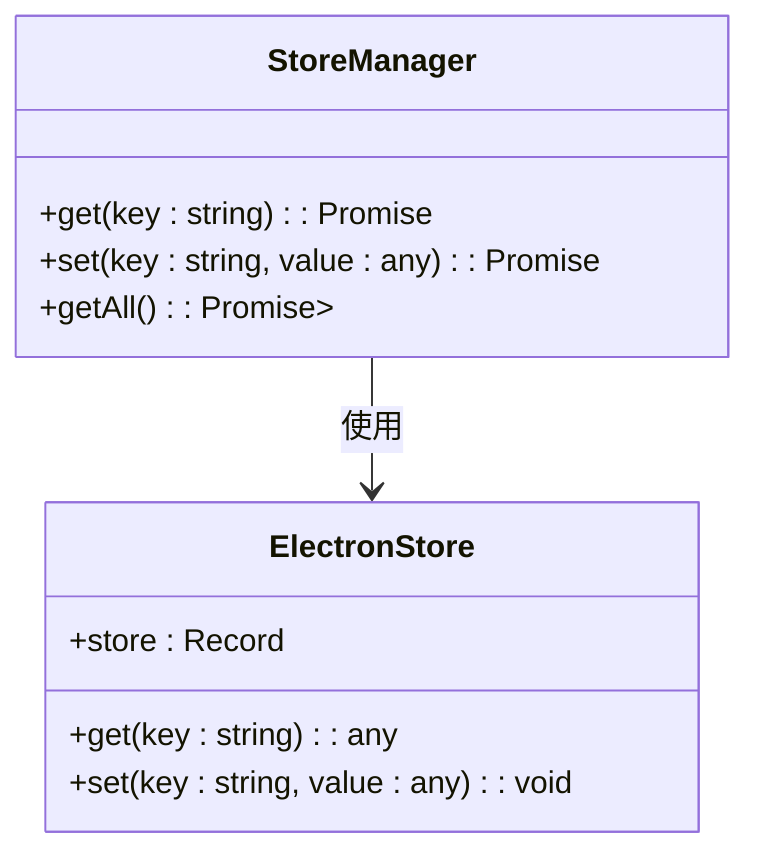
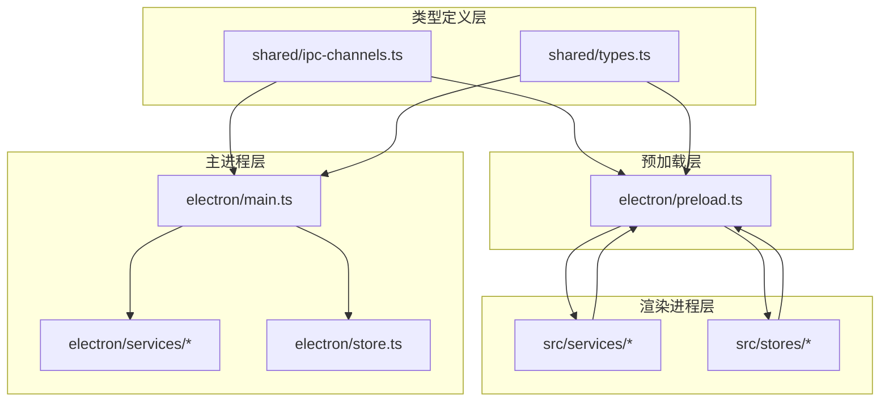

# IPC通信API

<cite>
**本文档引用的文件**
- [ipc-channels.ts](file://shared/ipc-channels.ts)
- [preload.ts](file://electron/preload.ts)
- [main.ts](file://electron/main.ts)
- [store.ts](file://electron/store.ts)
- [contest.ts](file://src/services/contest.ts)
- [rating.ts](file://src/services/rating.ts)
- [solved.ts](file://src/services/solved.ts)
- [contest-store.ts](file://src/stores/contest.ts)
- [ui-store.ts](file://src/stores/ui.ts)
</cite>

## 目录
1. [简介](#简介)
2. [项目结构](#项目结构)
3. [核心组件](#核心组件)
4. [架构概览](#架构概览)
5. [详细组件分析](#详细组件分析)
6. [依赖关系分析](#依赖关系分析)
7. [性能考虑](#性能考虑)
8. [故障排除指南](#故障排除指南)
9. [结论](#结论)

## 简介

IPC（进程间通信）是Electron应用中主进程与渲染进程之间通信的关键机制。本项目实现了完整的IPC通信API，包括竞赛信息获取、用户评分查询、题目解决数量统计、URL打开、更新安装以及本地存储管理等功能。

该IPC系统采用安全的上下文隔离模式，通过预加载脚本暴露受限制的API接口，确保渲染进程只能通过明确定义的通道与主进程通信。

## 项目结构

项目采用模块化架构，IPC相关的代码分布在以下位置：



**图表来源**
- [ipc-channels.ts:1-53](file://shared/ipc-channels.ts#L1-L53)
- [main.ts:19-26](file://electron/main.ts#L19-L26)
- [preload.ts:1-38](file://electron/preload.ts#L1-L38)

**章节来源**
- [ipc-channels.ts:1-53](file://shared/ipc-channels.ts#L1-L53)
- [main.ts:19-26](file://electron/main.ts#L19-L26)
- [preload.ts:1-38](file://electron/preload.ts#L1-L38)

## 核心组件

### IPC通道常量定义

项目定义了8个主要的IPC通道常量，所有通道名称均在共享模块中统一定义：

| 通道名称 | 类型 | 描述 |
|---------|------|------|
| GET_CONTESTS | String | 获取最近的编程竞赛信息 |
| GET_RATING | String | 查询用户的平台评分 |
| GET_SOLVED_NUM | String | 获取用户的解题数量 |
| OPEN_URL | String | 在外部浏览器中打开URL链接 |
| UPDATER_INSTALL | String | 安装应用程序更新 |
| STORE_GET | String | 从本地存储获取单个键值 |
| STORE_SET | String | 设置本地存储的键值对 |
| STORE_GET_ALL | String | 获取所有本地存储数据 |

### 类型安全的IPC处理器映射

系统提供了完整的类型定义，确保IPC通信的类型安全：

```mermaid
classDiagram
class IpcHandlerMap {
+GET_CONTESTS : Handler
+GET_RATING : Handler
+GET_SOLVED_NUM : Handler
+OPEN_URL : Handler
+UPDATER_INSTALL : Handler
+STORE_GET : Handler
+STORE_SET : Handler
+STORE_GET_ALL : Handler
}
class Handler {
+args : Array
+return : any
}
class GetContestsHandler {
+args : [day : number]
+return : RawContest[]
}
class GetRatingHandler {
+args : [{platform : string, name : string}]
+return : Rating
}
IpcHandlerMap --> Handler
Handler <|-- GetContestsHandler
Handler <|-- GetRatingHandler
```

**图表来源**
- [ipc-channels.ts:18-52](file://shared/ipc-channels.ts#L18-L52)

**章节来源**
- [ipc-channels.ts:3-14](file://shared/ipc-channels.ts#L3-L14)
- [ipc-channels.ts:18-52](file://shared/ipc-channels.ts#L18-L52)

## 架构概览

IPC通信采用Electron的标准架构模式，通过上下文隔离确保安全性：



**图表来源**
- [preload.ts:6-20](file://electron/preload.ts#L6-L20)
- [main.ts:397-412](file://electron/main.ts#L397-L412)

## 详细组件分析

### 预加载脚本中的IPC处理函数

预加载脚本通过`contextBridge` API暴露安全的IPC接口：

#### 外部API接口


**图表来源**
- [preload.ts:5-31](file://electron/preload.ts#L5-L31)

#### 参数验证和类型转换
预加载脚本对传入参数进行基本验证：
- 数字参数范围检查
- 字符串长度限制
- URL协议验证
- 类型强制转换

**章节来源**
- [preload.ts:6-31](file://electron/preload.ts#L6-L31)

### 主进程IPC处理器实现

主进程注册了8个IPC处理器，每个处理器都包含完整的错误处理：

#### 竞赛信息处理器


**图表来源**
- [main.ts:397-412](file://electron/main.ts#L397-L412)

#### 用户评分处理器
处理器包含严格的参数验证：
- 平台名称长度限制（≤50字符）
- 用户名长度限制（≤100字符）
- 类型检查和错误处理

**章节来源**
- [main.ts:414-431](file://electron/main.ts#L414-L431)

### 存储管理IPC通道

存储系统提供了完整的键值对管理功能：

#### 存储API设计


**图表来源**
- [preload.ts:22-31](file://electron/preload.ts#L22-L31)
- [main.ts:469-479](file://electron/main.ts#L469-L479)

**章节来源**
- [preload.ts:22-31](file://electron/preload.ts#L22-L31)
- [main.ts:469-479](file://electron/main.ts#L469-L479)

## 依赖关系分析

IPC系统的依赖关系清晰明确：



**图表来源**
- [ipc-channels.ts:1-53](file://shared/ipc-channels.ts#L1-L53)
- [main.ts:19-26](file://electron/main.ts#L19-L26)
- [preload.ts:1-38](file://electron/preload.ts#L1-L38)

**章节来源**
- [ipc-channels.ts:1-53](file://shared/ipc-channels.ts#L1-L53)
- [main.ts:19-26](file://electron/main.ts#L19-L26)
- [preload.ts:1-38](file://electron/preload.ts#L1-L38)

## 性能考虑

### 异步调用优化

1. **Promise链式调用**：所有IPC操作都返回Promise，支持链式调用和并发执行
2. **超时控制**：网络请求包含超时机制，避免长时间阻塞
3. **重试策略**：网络错误自动重试，提高可靠性

### 内存管理

1. **参数序列化**：传输的数据会被序列化，避免循环引用问题
2. **资源清理**：及时清理定时器和事件监听器
3. **缓存策略**：合理使用localStorage和electron-store进行数据缓存

### 安全最佳实践

1. **上下文隔离**：启用`contextIsolation: true`防止DOM污染
2. **白名单API**：只暴露必要的API方法，不直接暴露ipcRenderer
3. **参数验证**：严格验证所有输入参数，防止注入攻击
4. **协议限制**：URL打开仅允许http/https协议

## 故障排除指南

### 常见错误类型

#### 网络请求错误
系统定义了完整的错误分类机制：

| 错误类型 | 描述 | 处理方式 |
|---------|------|----------|
| timeout | 请求超时 | 自动重试，增加超时时间 |
| network | 网络连接失败 | 检查网络连接，使用备用服务器 |
| unknown | 未知错误 | 记录详细日志，提供用户反馈 |

#### 参数验证错误
- 参数类型不匹配：抛出`Invalid parameters`错误
- 参数长度超限：抛出`Parameter too long`错误
- URL协议无效：抛出`Invalid URL protocol`错误

#### 存储访问错误
- 键不存在：返回`undefined`或默认值
- 序列化失败：捕获异常并记录错误日志
- 权限不足：检查electron-store配置

**章节来源**
- [main.ts:146-167](file://electron/main.ts#L146-L167)
- [main.ts:417-422](file://electron/main.ts#L417-L422)
- [main.ts:453-456](file://electron/main.ts#L453-L456)

### 调试技巧

1. **开发工具**：启用Electron DevTools进行调试
2. **日志记录**：使用console.warn记录IPC通信过程
3. **错误边界**：在渲染进程中捕获IPC调用异常
4. **状态监控**：监控存储数据的变化情况

## 结论

本项目的IPC通信API设计完整、类型安全且具有良好的扩展性。通过预加载脚本的白名单机制，确保了渲染进程只能通过受控的方式与主进程通信。系统包含了完善的错误处理、参数验证和安全防护措施。

主要优势包括：
- **类型安全**：完整的TypeScript类型定义
- **安全可靠**：上下文隔离和参数验证
- **易于使用**：简洁的API接口设计
- **性能优化**：异步处理和错误重试机制

未来可以考虑的改进方向：
- 添加更详细的错误码和错误消息
- 实现IPC通信的统计和监控
- 支持批量操作和事务处理
- 增加更多的安全审计功能