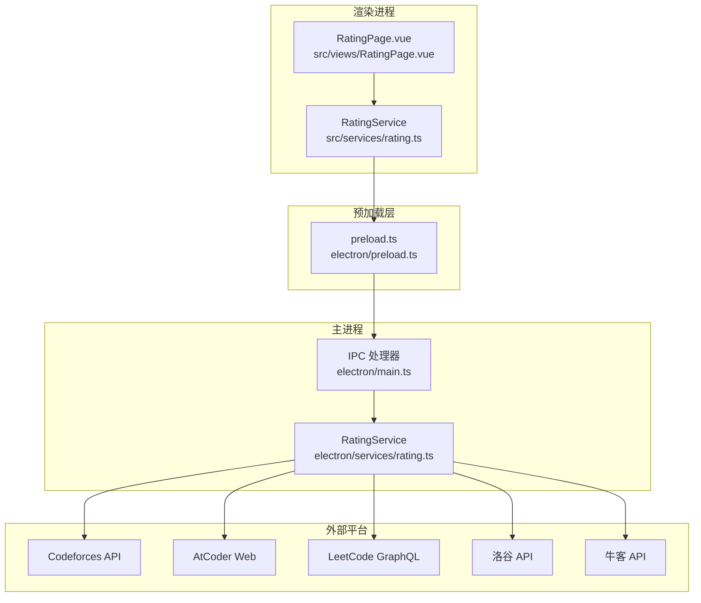
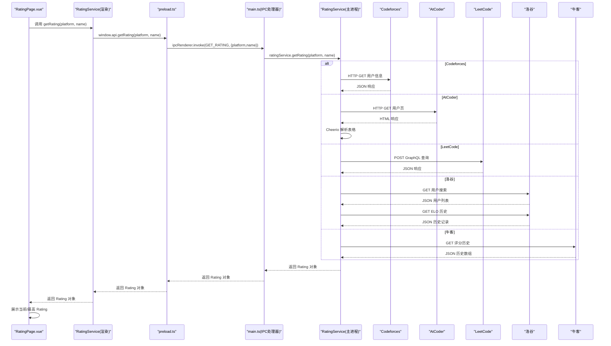
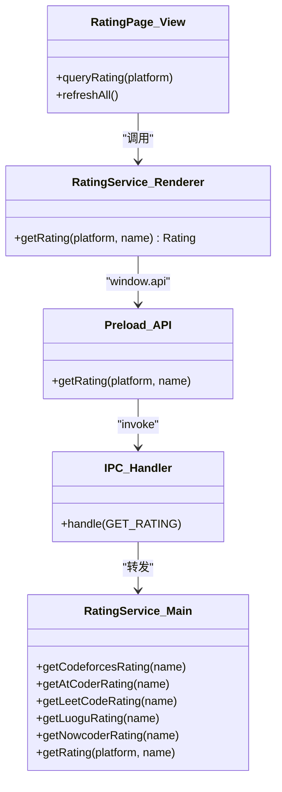

# Rating服务API

<cite>
**本文档引用的文件**
- [electron/services/rating.ts](file://electron/services/rating.ts)
- [src/services/rating.ts](file://src/services/rating.ts)
- [shared/types.ts](file://shared/types.ts)
- [src/views/RatingPage.vue](file://src/views/RatingPage.vue)
- [electron/main.ts](file://electron/main.ts)
- [electron/preload.ts](file://electron/preload.ts)
- [shared/ipc-channels.ts](file://shared/ipc-channels.ts)
</cite>

## 目录
1. [简介](#简介)
2. [项目结构](#项目结构)
3. [核心组件](#核心组件)
4. [架构总览](#架构总览)
5. [详细组件分析](#详细组件分析)
6. [依赖关系分析](#依赖关系分析)
7. [性能考虑](#性能考虑)
8. [故障排查指南](#故障排查指南)
9. [结论](#结论)
10. [附录](#附录)

## 简介
本文件面向开发者与使用者，系统性梳理 Rating 服务的 API 定义与实现机制，覆盖以下关键点：
- RatingService 类的公共方法与接口定义
- 多平台 Rating 查询的实现机制（Codeforces、AtCoder、LeetCode、洛谷、牛客）
- 参数校验规则、数据格式转换与错误处理策略
- Rating 历史数据的获取与使用说明
- 服务调用的实际示例路径与性能优化建议
- 与外部平台 API 的集成方式与数据同步机制

## 项目结构
本项目采用 Electron + Vue 3 架构，Rating 服务位于渲染进程通过 IPC 调用主进程的服务实现，核心文件分布如下：
- 渲染进程服务封装：src/services/rating.ts
- 主进程服务实现：electron/services/rating.ts
- IPC 通道与类型定义：shared/ipc-channels.ts
- 预加载脚本暴露 API：electron/preload.ts
- 主进程注册 IPC 处理器：electron/main.ts
- 类型定义：shared/types.ts
- 视图页面：src/views/RatingPage.vue

图表来源
- [src/services/rating.ts:1-8](file://src/services/rating.ts#L1-L8)
- [electron/preload.ts:1-38](file://electron/preload.ts#L1-L38)
- [electron/main.ts:414-431](file://electron/main.ts#L414-L431)
- [electron/services/rating.ts:5-175](file://electron/services/rating.ts#L5-L175)

章节来源
- [src/services/rating.ts:1-8](file://src/services/rating.ts#L1-L8)
- [electron/preload.ts:1-38](file://electron/preload.ts#L1-L38)
- [electron/main.ts:414-431](file://electron/main.ts#L414-L431)
- [electron/services/rating.ts:5-175](file://electron/services/rating.ts#L5-L175)

## 核心组件
- RatingService（主进程实现）：提供多平台 Rating 查询的具体实现，返回统一的 Rating 数据模型。
- RatingService（渲染进程封装）：对外暴露静态方法，通过 window.api.getRating 调用主进程服务。
- RatingPage.vue：用户界面，负责输入用户名、发起查询、展示结果与错误提示。
- IPC 通道：GET_RATING 定义了参数与返回类型，确保类型安全。
- 类型定义：Rating 接口定义了 name、curRating、maxRating、ranking、time 等字段。

章节来源
- [shared/types.ts:28-34](file://shared/types.ts#L28-L34)
- [shared/ipc-channels.ts:24-27](file://shared/ipc-channels.ts#L24-L27)
- [src/services/rating.ts:3-7](file://src/services/rating.ts#L3-L7)
- [src/views/RatingPage.vue:112-129](file://src/views/RatingPage.vue#L112-L129)

## 架构总览
下图展示了从视图到主进程服务再到外部平台的整体调用链路与数据流向。

图表来源
- [src/views/RatingPage.vue:112-129](file://src/views/RatingPage.vue#L112-L129)
- [src/services/rating.ts:4-6](file://src/services/rating.ts#L4-L6)
- [electron/preload.ts:9-10](file://electron/preload.ts#L9-L10)
- [electron/main.ts:414-431](file://electron/main.ts#L414-L431)
- [electron/services/rating.ts:12-101](file://electron/services/rating.ts#L12-L101)

## 详细组件分析

### RatingService（主进程实现）
- 类名：RatingService
- 作用：封装多平台 Rating 查询逻辑，统一返回 Rating 数据模型
- 关键方法：
  - getCodeforcesRating(name: string): Promise<Rating>
  - getAtCoderRating(name: string): Promise<Rating>
  - getLeetCodeRating(name: string): Promise<Rating>
  - getLuoguRating(name: string): Promise<Rating>
  - getNowcoderRating(name: string): Promise<Rating>
  - getRating(platform: string, name: string): Promise<Rating>

实现要点：
- Codeforces：调用官方 API 获取用户信息，解析返回的 rating 与 maxRating 字段。
- AtCoder：通过 HTTP 请求访问用户主页，使用 Cheerio 解析表格中的当前与最高 Rating。
- LeetCode：通过 GraphQL 查询用户竞赛历史，取最近一次 attended 的 rating 作为当前 Rating，最高 Rating 为 attended 记录中的最大值。
- 洛谷：先通过搜索接口获取用户 ID，再请求 ELO 历史接口，取第一条记录为当前 Rating，历史中的最大值为最高 Rating。
- 牛客：直接请求评分历史接口，取最后一条记录为当前 Rating，历史中的最大值为最高 Rating。
- getRating：根据 platform 分发到具体平台方法，未知平台抛出异常。

错误处理与回退：
- 所有平台方法在请求失败或解析失败时会记录错误并返回默认 Rating 对象（当前与最高 Rating 为 0）。

章节来源
- [electron/services/rating.ts:5-175](file://electron/services/rating.ts#L5-L175)

### RatingService（渲染进程封装）
- 类名：RatingService
- 方法：static async getRating(platform: string, name: string): Promise<Rating>
- 实现：通过 window.api.getRating 调用主进程 IPC 处理器 GET_RATING，并将结果类型断言为 Rating。

章节来源
- [src/services/rating.ts:3-7](file://src/services/rating.ts#L3-L7)

### RatingPage.vue（视图层）
- 功能：提供多平台输入框、查询按钮、刷新全部、加载状态与错误提示。
- 输入校验：在发起查询前检查用户名是否存在；平台提示信息区分“用户名”和“用户ID”。
- 结果展示：成功时显示“当前 Rating”和“最高 Rating”，失败时显示错误消息并标记错误状态。
- 本地存储：用户名保存在 localStorage 中，页面挂载时读取并恢复。

章节来源
- [src/views/RatingPage.vue:71-137](file://src/views/RatingPage.vue#L71-L137)

### IPC 通道与类型安全
- 通道名称：GET_RATING
- 参数类型：{ platform: string; name: string }
- 返回类型：Rating
- 主进程处理器：对参数进行类型与长度校验，调用主进程 RatingService 并返回结果或抛出错误。

章节来源
- [shared/ipc-channels.ts:5,24-27](file://shared/ipc-channels.ts#L5,L24-L27)
- [electron/main.ts:414-431](file://electron/main.ts#L414-L431)

### 预加载脚本与 API 暴露
- 暴露 window.api.getRating，供渲染进程调用。
- 通过 ipcRenderer.invoke 发起 IPC 调用，参数与返回值与 IPC 处理器保持一致。

章节来源
- [electron/preload.ts:9-10](file://electron/preload.ts#L9-L10)

### 类型定义（Rating）
- 字段：name、curRating、maxRating、ranking（可选）、time（可选）
- 用途：统一多平台返回数据结构，便于 UI 展示与后续扩展。

章节来源
- [shared/types.ts:28-34](file://shared/types.ts#L28-L34)

### 多平台实现机制与数据流

#### Codeforces
- 请求方式：HTTP GET
- 数据来源：官方 API 返回的用户信息
- 数据转换：提取 rating 与 maxRating 字段
- 错误处理：请求失败或非 200 状态码时返回默认值

章节来源
- [electron/services/rating.ts:12-29](file://electron/services/rating.ts#L12-L29)

#### AtCoder
- 请求方式：HTTP GET
- 数据来源：用户主页 HTML
- 数据转换：使用 Cheerio 解析表格，取第二、三行中的数值作为当前与最高 Rating
- 错误处理：解析失败或数值非法时返回默认值

章节来源
- [electron/services/rating.ts:31-53](file://electron/services/rating.ts#L31-L53)

#### LeetCode
- 请求方式：HTTP POST（GraphQL）
- 数据来源：GraphQL 查询 userContestRankingHistory
- 数据转换：取 attended 为 true 的记录，当前 Rating 为最新记录的 rating，最高 Rating 为 attended 记录中的最大值
- 错误处理：无记录或请求失败时返回默认值

章节来源
- [electron/services/rating.ts:55-101](file://electron/services/rating.ts#L55-L101)

#### 洛谷
- 请求方式：两次 HTTP GET
- 数据来源：用户搜索接口获取 uid，再请求 ELO 历史接口获取 records
- 数据转换：当前 Rating 为第一条记录的 rating，最高 Rating 为所有记录中的最大值
- 错误处理：未找到用户或请求失败时返回默认值

章节来源
- [electron/services/rating.ts:103-133](file://electron/services/rating.ts#L103-L133)

#### 牛客
- 请求方式：HTTP GET
- 数据来源：评分历史接口
- 数据转换：当前 Rating 为最后一条记录的 rating，最高 Rating 为所有记录中的最大值
- 错误处理：无记录或请求失败时返回默认值

章节来源
- [electron/services/rating.ts:135-154](file://electron/services/rating.ts#L135-L154)

### 参数验证规则
- 类型校验：platform 与 name 必须为字符串
- 长度限制：name 不超过 100，platform 不超过 50
- 未知平台：抛出错误，防止无效调用

章节来源
- [electron/main.ts:417-422](file://electron/main.ts#L417-L422)

### 数据格式转换与错误处理策略
- 统一返回 Rating 对象，字段包含 name、curRating、maxRating
- 数值转换：AtCoder 与 LeetCode 中对解析到的字符串进行整数转换，非法时回退为 0
- 四舍五入：LeetCode 当前 Rating 在返回前进行四舍五入
- 默认回退：所有平台在异常情况下返回 { name, curRating: 0, maxRating: 0 }

章节来源
- [electron/services/rating.ts:39-44](file://electron/services/rating.ts#L39-L44)
- [electron/services/rating.ts:90-94](file://electron/services/rating.ts#L90-L94)
- [electron/services/rating.ts:28](file://electron/services/rating.ts#L28)
- [electron/services/rating.ts:52](file://electron/services/rating.ts#L52)
- [electron/services/rating.ts:100](file://electron/services/rating.ts#L100)
- [electron/services/rating.ts:132](file://electron/services/rating.ts#L132)
- [electron/services/rating.ts:153](file://electron/services/rating.ts#L153)

### Rating 历史数据的存储与查询
- 历史数据获取：LeetCode、洛谷、牛客平台均能获取历史记录；AtCoder 与 Codeforces 未实现历史记录解析
- 存储策略：当前代码未实现历史数据的本地持久化；建议结合 electron-store 或 IndexedDB 实现离线缓存
- 查询接口：当前仅提供单次查询接口，未提供历史查询接口；如需历史查询，可在主进程服务中新增方法并通过 IPC 暴露

章节来源
- [electron/services/rating.ts:78-88](file://electron/services/rating.ts#L78-L88)
- [electron/services/rating.ts:118-124](file://electron/services/rating.ts#L118-L124)
- [electron/services/rating.ts:140-147](file://electron/services/rating.ts#L140-L147)

### 服务调用实际示例（代码片段路径）
- 渲染进程调用：[src/services/rating.ts:4-6](file://src/services/rating.ts#L4-L6)
- 主进程 IPC 处理器：[electron/main.ts:414-431](file://electron/main.ts#L414-L431)
- 预加载脚本暴露 API：[electron/preload.ts:9-10](file://electron/preload.ts#L9-L10)
- 视图层发起查询：[src/views/RatingPage.vue:112-129](file://src/views/RatingPage.vue#L112-L129)

## 依赖关系分析

图表来源
- [electron/services/rating.ts:5-175](file://electron/services/rating.ts#L5-L175)
- [src/services/rating.ts:3-7](file://src/services/rating.ts#L3-L7)
- [electron/preload.ts:9-10](file://electron/preload.ts#L9-L10)
- [electron/main.ts:414-431](file://electron/main.ts#L414-L431)
- [src/views/RatingPage.vue:112-129](file://src/views/RatingPage.vue#L112-L129)

章节来源
- [electron/services/rating.ts:5-175](file://electron/services/rating.ts#L5-L175)
- [src/services/rating.ts:3-7](file://src/services/rating.ts#L3-L7)
- [electron/preload.ts:9-10](file://electron/preload.ts#L9-L10)
- [electron/main.ts:414-431](file://electron/main.ts#L414-L431)
- [src/views/RatingPage.vue:112-129](file://src/views/RatingPage.vue#L112-L129)

## 性能考虑
- 请求并发：当前实现逐个平台查询，建议在视图层增加并发控制与去重，避免重复请求相同平台/用户名组合
- 缓存策略：建议引入本地缓存（如 electron-store）与过期策略，降低重复查询成本
- 超时与重试：主进程已具备通用的超时与重试机制，可在平台查询处复用或扩展
- UI 交互：加载状态与错误提示已在视图层实现，建议进一步细化错误分类与用户引导
- 网络优化：针对 LeetCode GraphQL 查询，可考虑合并请求或减少不必要的字段

[本节为通用性能建议，无需特定文件来源]

## 故障排查指南
常见问题与定位思路：
- 网络错误：检查外网连通性与代理设置；确认平台 API 是否可达
- 参数错误：platform 与 name 类型必须为字符串且长度符合限制
- 平台不支持：传入未知平台会抛出错误，确认平台标识符是否正确
- 解析失败：AtCoder 表格结构变化或 LeetCode GraphQL 字段调整会导致解析失败，需更新选择器或查询字段
- 限流与风控：频繁查询可能触发平台限流，建议增加延迟与重试策略

章节来源
- [electron/main.ts:417-422](file://electron/main.ts#L417-L422)
- [electron/services/rating.ts:48-51](file://electron/services/rating.ts#L48-L51)
- [electron/services/rating.ts:96-99](file://electron/services/rating.ts#L96-L99)

## 结论
本 Rating 服务通过清晰的职责分离与 IPC 通道实现了跨平台的统一查询能力。主进程服务负责与外部平台交互并标准化数据，渲染进程通过封装的 API 与视图层协作，提供友好的用户体验。未来可在历史数据存储、缓存策略、并发控制与错误分类等方面持续优化，以提升稳定性与性能。

[本节为总结性内容，无需特定文件来源]

## 附录

### API 定义与调用规范
- 接口：getRating(platform: string, name: string): Promise<Rating>
- 参数：
  - platform: 支持 'Codeforces'、'AtCoder'、'力扣'、'洛谷'、'牛客'
  - name: 用户名或用户ID（不同平台含义不同）
- 返回：Rating 对象，包含 name、curRating、maxRating 等字段
- 错误：参数非法或平台不支持时抛出错误；网络/解析异常时返回默认值

章节来源
- [shared/types.ts:28-34](file://shared/types.ts#L28-L34)
- [shared/ipc-channels.ts:24-27](file://shared/ipc-channels.ts#L24-L27)
- [electron/main.ts:417-422](file://electron/main.ts#L417-L422)

### 多平台支持与数据来源一览
- Codeforces：官方 API，返回用户信息
- AtCoder：用户主页 HTML，使用 Cheerio 解析
- LeetCode：GraphQL 查询，返回竞赛历史
- 洛谷：用户搜索 + ELO 历史
- 牛客：评分历史接口

章节来源
- [electron/services/rating.ts:12-154](file://electron/services/rating.ts#L12-L154)