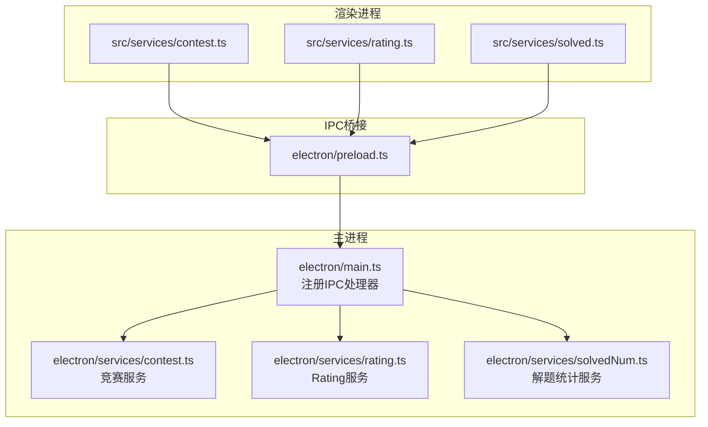
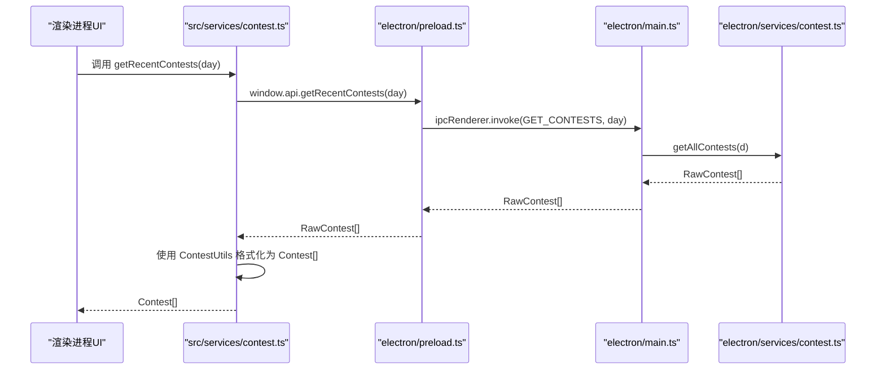
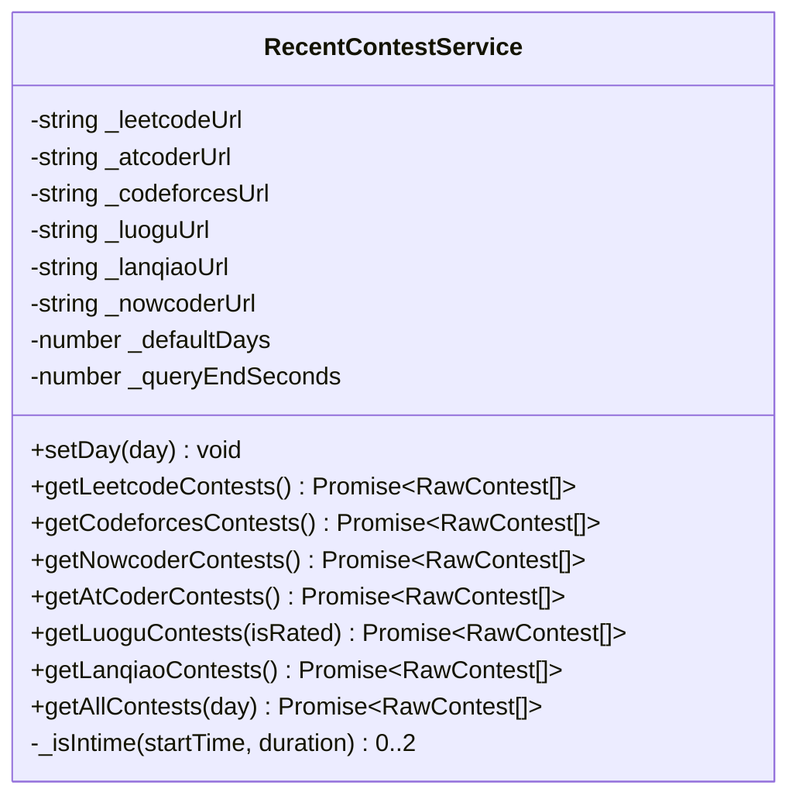
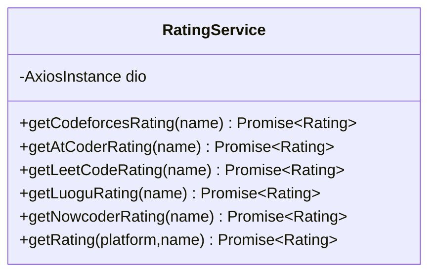
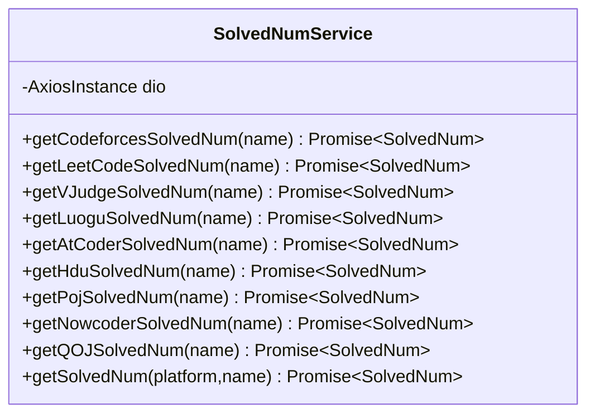
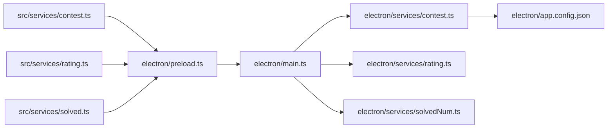
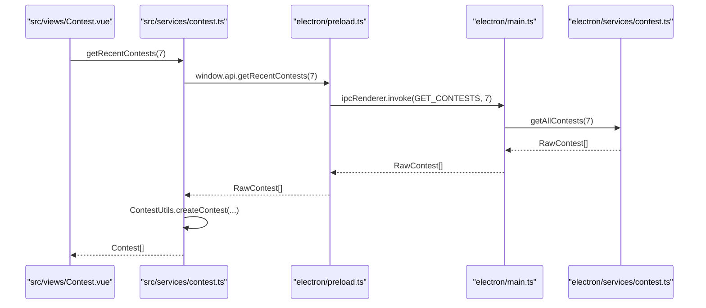

# 服务层API

<cite>
**本文引用的文件**
- [electron/services/contest.ts](file://electron/services/contest.ts)
- [electron/services/rating.ts](file://electron/services/rating.ts)
- [electron/services/solvedNum.ts](file://electron/services/solvedNum.ts)
- [src/services/contest.ts](file://src/services/contest.ts)
- [src/services/rating.ts](file://src/services/rating.ts)
- [src/services/solved.ts](file://src/services/solved.ts)
- [shared/types.ts](file://shared/types.ts)
- [shared/ipc-channels.ts](file://shared/ipc-channels.ts)
- [electron/preload.ts](file://electron/preload.ts)
- [electron/main.ts](file://electron/main.ts)
- [src/utils/contest_utils.ts](file://src/utils/contest_utils.ts)
- [electron/app.config.json](file://electron/app.config.json)
- [src/views/Contest.vue](file://src/views/Contest.vue)
</cite>

## 目录
1. [简介](#简介)
2. [项目结构](#项目结构)
3. [核心组件](#核心组件)
4. [架构总览](#架构总览)
5. [详细组件分析](#详细组件分析)
6. [依赖关系分析](#依赖关系分析)
7. [性能考量](#性能考量)
8. [故障排查指南](#故障排查指南)
9. [结论](#结论)
10. [附录](#附录)

## 简介
本文件系统性梳理服务层API，覆盖以下能力：
- 竞赛服务：从多个在线评测平台抓取近期比赛信息，并按时间窗口过滤与聚合。
- Rating服务：查询用户在各平台的当前与历史最高分。
- 解题统计服务：查询用户在各平台的已解决问题数量。

文档重点包括：
- 公共方法签名、参数与返回值说明
- 异常处理与错误分类策略
- 服务层设计模式（职责分离、IPC桥接）
- 数据获取、处理与缓存实现细节
- 服务调用示例与最佳实践
- 服务层与IPC通信的数据流转过程
- 错误处理策略与重试机制

## 项目结构
服务层由三层构成：
- 渲染进程服务封装：对IPC调用进行薄封装，便于UI层统一调用。
- IPC桥接：通过preload暴露受限API给渲染进程。
- 主进程服务：执行网络请求、数据解析与业务逻辑，提供稳定接口。

图表来源
- [src/services/contest.ts:1-35](file://src/services/contest.ts#L1-L35)
- [src/services/rating.ts:1-8](file://src/services/rating.ts#L1-L8)
- [src/services/solved.ts:1-8](file://src/services/solved.ts#L1-L8)
- [electron/preload.ts:1-38](file://electron/preload.ts#L1-L38)
- [electron/main.ts:396-486](file://electron/main.ts#L396-L486)
- [electron/services/contest.ts:1-270](file://electron/services/contest.ts#L1-L270)
- [electron/services/rating.ts:1-175](file://electron/services/rating.ts#L1-L175)
- [electron/services/solvedNum.ts:1-198](file://electron/services/solvedNum.ts#L1-L198)

章节来源
- [src/services/contest.ts:1-35](file://src/services/contest.ts#L1-L35)
- [src/services/rating.ts:1-8](file://src/services/rating.ts#L1-L8)
- [src/services/solved.ts:1-8](file://src/services/solved.ts#L1-L8)
- [electron/preload.ts:1-38](file://electron/preload.ts#L1-L38)
- [electron/main.ts:396-486](file://electron/main.ts#L396-L486)

## 核心组件
- 竞赛服务：负责从多个平台抓取近期比赛，按时间窗口过滤并聚合结果。
- Rating服务：根据平台标识与用户名查询用户评分与历史最高分。
- 解题统计服务：根据平台标识与用户名查询已解决问题数。

章节来源
- [electron/services/contest.ts:12-270](file://electron/services/contest.ts#L12-L270)
- [electron/services/rating.ts:5-175](file://electron/services/rating.ts#L5-L175)
- [electron/services/solvedNum.ts:5-198](file://electron/services/solvedNum.ts#L5-L198)

## 架构总览
服务层采用“渲染进程薄封装 + IPC桥接 + 主进程服务”的分层设计，确保：
- 渲染进程仅通过白名单API访问主进程能力
- 主进程集中处理网络请求、数据解析与安全校验
- 类型定义在共享模块中统一，保证前后端契约一致

图表来源
- [src/services/contest.ts:8-25](file://src/services/contest.ts#L8-L25)
- [electron/preload.ts:6-7](file://electron/preload.ts#L6-L7)
- [electron/main.ts:397-412](file://electron/main.ts#L397-L412)
- [electron/services/contest.ts:255-266](file://electron/services/contest.ts#L255-L266)
- [src/utils/contest_utils.ts:4-43](file://src/utils/contest_utils.ts#L4-L43)

## 详细组件分析

### 竞赛服务 API
- 服务类：RecentContestService（主进程）
- 渲染进程封装：ContestService（渲染进程）

方法清单与说明
- setDay(day: number): void
  - 设置爬取时间窗口（单位：天），内部转换为秒级截止时间
  - 参数：day 数值，超出配置范围将被裁剪到[minDays, maxDays]
  - 返回：无
  - 异常：无显式抛出；非法输入按默认值处理
- getLeetcodeContests(): Promise<RawContest[]>
  - 获取力扣近期比赛列表
  - 过滤规则：超过时间窗口或持续时间过长的比赛会被跳过；已结束的比赛会终止后续遍历
  - 返回：RawContest[]（名称、开始时间、持续时间、平台、链接）
  - 异常：网络/解析失败时记录错误并返回空数组
- getCodeforcesContests(): Promise<RawContest[]>
  - 获取Codeforces近期比赛列表（按开始时间降序）
  - 过滤规则同上
  - 返回：RawContest[]
  - 异常：网络/解析失败时记录错误并返回空数组
- getNowcoderContests(): Promise<RawContest[]>
  - 解析网页表格提取牛客网比赛信息
  - 过滤规则同上
  - 返回：RawContest[]
  - 异常：网络/解析失败时记录错误并返回空数组
- getAtCoderContests(): Promise<RawContest[]>
  - 解析AtCoder页面表格提取比赛信息
  - 过滤规则同上
  - 返回：RawContest[]
  - 异常：网络/解析失败时记录错误并返回空数组
- getLuoguContests(isRated?: boolean): Promise<RawContest[]>
  - 获取洛谷比赛列表，默认仅返回评级赛
  - 过滤规则同上
  - 返回：RawContest[]
  - 异常：网络/解析失败时记录错误并返回空数组
- getLanqiaoContests(): Promise<RawContest[]>
  - 通过API获取蓝桥云课比赛列表
  - 过滤规则同上
  - 返回：RawContest[]
  - 异常：网络/解析失败时记录错误并返回空数组
- getAllContests(day: number): Promise<RawContest[]>
  - 并发拉取所有平台数据，扁平化合并
  - 返回：RawContest[]
  - 异常：任一平台失败不影响其他平台；最终返回合并后的结果

渲染进程封装方法
- getRecentContests(day?: number): Promise<Contest[]>
  - 通过IPC调用主进程服务，随后使用工具类格式化为UI可用的Contest对象
  - 返回：Contest[]（包含格式化的时间字符串、时长文本等）
  - 异常：捕获错误并返回空数组
- openUrl(url: string): Promise<void>
  - 通过IPC打开外部链接（仅允许http/https）
  - 异常：协议不合法时抛出错误
- installUpdate(url: string): Promise<void>
  - 触发更新安装流程（主进程下载并启动）

章节来源
- [electron/services/contest.ts:24-266](file://electron/services/contest.ts#L24-L266)
- [src/services/contest.ts:8-25](file://src/services/contest.ts#L8-L25)
- [src/utils/contest_utils.ts:4-43](file://src/utils/contest_utils.ts#L4-L43)
- [electron/main.ts:397-412](file://electron/main.ts#L397-L412)
- [electron/main.ts:452-458](file://electron/main.ts#L452-L458)

#### 竞赛服务类图

图表来源
- [electron/services/contest.ts:12-270](file://electron/services/contest.ts#L12-L270)

### Rating服务 API
- 服务类：RatingService（主进程）
- 渲染进程封装：RatingService（渲染进程）

方法清单与说明
- getCodeforcesRating(name: string): Promise<Rating>
  - 通过REST API获取用户信息，返回当前分与最高分
  - 返回：Rating（name, curRating, maxRating）
  - 异常：网络/解析失败时记录错误并抛出；返回默认值用于调用方兜底
- getAtCoderRating(name: string): Promise<Rating>
  - 解析AtCoder用户页表格提取当前分与最高分
  - 返回：Rating
  - 异常：网络/解析失败时记录错误并抛出
- getLeetCodeRating(name: string): Promise<Rating>
  - GraphQL查询用户竞赛历史，计算当前分与最高分
  - 返回：Rating
  - 异常：网络/解析失败时记录错误并抛出
- getLuoguRating(name: string): Promise<Rating>
  - 两步查询：先搜索用户ID，再查询评分历史
  - 返回：Rating
  - 异常：网络/解析失败时记录错误并抛出
- getNowcoderRating(name: string): Promise<Rating>
  - 查询牛客网评分历史，取最新与最高
  - 返回：Rating
  - 异常：网络/解析失败时记录错误并抛出
- getRating(platform: string, name: string): Promise<Rating>
  - 多态路由到具体平台实现
  - 支持平台：Codeforces、AtCoder、力扣、洛谷、牛客
  - 异常：未知平台抛出错误

渲染进程封装方法
- getRating(platform: string, name: string): Promise<Rating>
  - 通过IPC调用主进程服务
  - 返回：Rating
  - 异常：透传主进程错误

章节来源
- [electron/services/rating.ts:12-171](file://electron/services/rating.ts#L12-L171)
- [src/services/rating.ts:3-6](file://src/services/rating.ts#L3-L6)
- [electron/main.ts:414-431](file://electron/main.ts#L414-L431)

#### Rating服务类图

图表来源
- [electron/services/rating.ts:5-175](file://electron/services/rating.ts#L5-L175)

### 解题统计服务 API
- 服务类：SolvedNumService（主进程）
- 渲染进程封装：SolvedNumService（渲染进程）

方法清单与说明
- getCodeforcesSolvedNum(name: string): Promise<SolvedNum>
  - 通过第三方聚合API获取已解决问题数
  - 返回：SolvedNum（name, solvedNum）
  - 异常：响应无效时抛出错误
- getLeetCodeSolvedNum(name: string): Promise<SolvedNum>
  - GraphQL查询用户问题进度，累加已接受题目计数
  - 返回：SolvedNum
  - 异常：响应无效时抛出错误
- getVJudgeSolvedNum(name: string): Promise<SolvedNum>
  - 解析VJudge页面表格提取总数
  - 返回：SolvedNum
  - 异常：未找到时返回0
- getLuoguSolvedNum(name: string): Promise<SolvedNum>
  - 两步查询：搜索用户ID，再解析用户页或JSON字段
  - 返回：SolvedNum
  - 异常：未找到时返回0
- getAtCoderSolvedNum(name: string): Promise<SolvedNum>
  - 通过AtCoder API获取AC数量
  - 返回：SolvedNum
  - 异常：无特殊处理，直接返回
- getHduSolvedNum(name: string): Promise<SolvedNum>
  - 通过第三方聚合API获取HDU已解决问题数
  - 返回：SolvedNum
  - 异常：响应无效时抛出错误
- getPojSolvedNum(name: string): Promise<SolvedNum>
  - 通过第三方聚合API获取POJ已解决问题数
  - 返回：SolvedNum
  - 异常：响应无效时抛出错误
- getNowcoderSolvedNum(name: string): Promise<SolvedNum>
  - 通过第三方聚合API获取牛客网已解决问题数
  - 返回：SolvedNum
  - 异常：响应无效时抛出错误
- getQOJSolvedNum(name: string): Promise<SolvedNum>
  - 解析QOJ用户页正则匹配
  - 返回：SolvedNum
  - 异常：未匹配时返回0
- getSolvedNum(platform: string, name: string): Promise<SolvedNum>
  - 多态路由到具体平台实现
  - 支持平台：Codeforces、力扣、VJudge、洛谷、AtCoder、HDU、POJ、牛客、QOJ
  - 异常：未知平台返回默认值；其他错误记录并抛出

渲染进程封装方法
- getSolvedNum(platform: string, name: string): Promise<SolvedNum>
  - 通过IPC调用主进程服务
  - 返回：SolvedNum
  - 异常：透传主进程错误

章节来源
- [electron/services/solvedNum.ts:14-194](file://electron/services/solvedNum.ts#L14-L194)
- [src/services/solved.ts:3-6](file://src/services/solved.ts#L3-L6)
- [electron/main.ts:433-450](file://electron/main.ts#L433-L450)

#### 解题统计服务类图

图表来源
- [electron/services/solvedNum.ts:5-198](file://electron/services/solvedNum.ts#L5-L198)

### 数据模型与类型
- RawContest：原始竞赛数据（名称、开始时间、持续时间、平台、链接）
- Contest：UI侧格式化竞赛数据（包含多种格式化字段）
- Rating：用户评分数据（当前分、最高分、可选排名与时点）
- SolvedNum：用户解题统计（已解决问题数）

章节来源
- [shared/types.ts:1-67](file://shared/types.ts#L1-L67)

## 依赖关系分析
- 渲染进程服务依赖IPC通道与预加载桥接
- 主进程服务依赖第三方HTTP客户端与HTML解析库
- 配置文件控制爬取时间窗口与主题等参数
- UI视图通过服务层获取数据并展示

图表来源
- [src/services/contest.ts:1-35](file://src/services/contest.ts#L1-L35)
- [src/services/rating.ts:1-8](file://src/services/rating.ts#L1-L8)
- [src/services/solved.ts:1-8](file://src/services/solved.ts#L1-L8)
- [electron/preload.ts:1-38](file://electron/preload.ts#L1-L38)
- [electron/main.ts:396-486](file://electron/main.ts#L396-L486)
- [electron/services/contest.ts:1-270](file://electron/services/contest.ts#L1-L270)
- [electron/services/rating.ts:1-175](file://electron/services/rating.ts#L1-L175)
- [electron/services/solvedNum.ts:1-198](file://electron/services/solvedNum.ts#L1-L198)
- [electron/app.config.json:1-62](file://electron/app.config.json#L1-L62)

章节来源
- [electron/main.ts:396-486](file://electron/main.ts#L396-L486)
- [electron/preload.ts:1-38](file://electron/preload.ts#L1-L38)
- [electron/app.config.json:1-62](file://electron/app.config.json#L1-L62)

## 性能考量
- 并发抓取：竞赛服务在聚合阶段使用并发请求，缩短整体等待时间
- 时间窗口裁剪：通过配置限制最大爬取范围，避免无界请求
- 响应解析优化：针对不同平台采用合适的解析策略（GraphQL、HTML选择器、正则）
- 缓存策略：当前实现未见显式缓存逻辑；建议在主进程层引入短期缓存以降低重复请求成本

## 故障排查指南
常见错误与处理
- 参数校验失败
  - 竞赛服务：day不在[minDays, maxDays]范围内时按默认值处理
  - Rating/解题统计服务：platform或name类型不符或长度超限将抛出错误
- 网络/超时错误
  - 主进程内置超时与重试机制（见更新器相关逻辑），可借鉴到服务层
  - 建议在服务层增加统一的超时与重试包装
- 平台解析失败
  - HTML结构变化导致选择器失效；建议增加健壮性检查与降级策略
- 未知平台
  - Rating与SolvedNum多态路由遇到未知平台时抛出错误；调用方需做好兜底

章节来源
- [electron/main.ts:417-422](file://electron/main.ts#L417-L422)
- [electron/main.ts:436-441](file://electron/main.ts#L436-L441)
- [electron/main.ts:176-225](file://electron/main.ts#L176-L225)

## 结论
服务层通过清晰的职责分离与IPC桥接，实现了稳定的跨平台数据获取能力。建议后续增强：
- 统一的超时与重试策略
- 主进程层的短期缓存
- 更强的解析健壮性与错误恢复
- 对外暴露更细粒度的错误码与诊断信息

## 附录

### IPC通道与类型映射
- GET_CONTESTS：参数[day:number]，返回RawContest[]
- GET_RATING：参数{platform:string, name:string}，返回Rating
- GET_SOLVED_NUM：参数{platform:string, name:string}，返回SolvedNum
- OPEN_URL：参数[url:string]，返回void
- UPDATER_INSTALL：参数{url:string}，返回boolean

章节来源
- [shared/ipc-channels.ts:3-52](file://shared/ipc-channels.ts#L3-L52)

### 服务调用示例与最佳实践
- 竞赛服务
  - 推荐：在渲染层调用ContestService.getRecentContests(day)，并在UI层显示格式化后的Contest列表
  - 最佳实践：对day参数做边界检查；对返回空数组时提供友好提示
- Rating服务
  - 推荐：在渲染层调用RatingService.getRating(platform, name)
  - 最佳实践：对未知平台提前校验；对异常进行用户可见的错误提示
- 解题统计服务
  - 推荐：在渲染层调用SolvedNumService.getSolvedNum(platform, name)
  - 最佳实践：对第三方API响应进行严格校验；对解析失败场景提供默认值

章节来源
- [src/services/contest.ts:8-25](file://src/services/contest.ts#L8-L25)
- [src/services/rating.ts:3-6](file://src/services/rating.ts#L3-L6)
- [src/services/solved.ts:3-6](file://src/services/solved.ts#L3-L6)

### 服务层与IPC通信的数据流转

图表来源
- [src/views/Contest.vue:1-200](file://src/views/Contest.vue#L1-L200)
- [src/services/contest.ts:8-25](file://src/services/contest.ts#L8-L25)
- [electron/preload.ts:6-7](file://electron/preload.ts#L6-L7)
- [electron/main.ts:397-412](file://electron/main.ts#L397-L412)
- [electron/services/contest.ts:255-266](file://electron/services/contest.ts#L255-L266)
- [src/utils/contest_utils.ts:4-43](file://src/utils/contest_utils.ts#L4-L43)