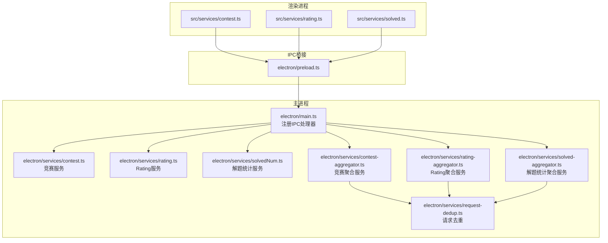
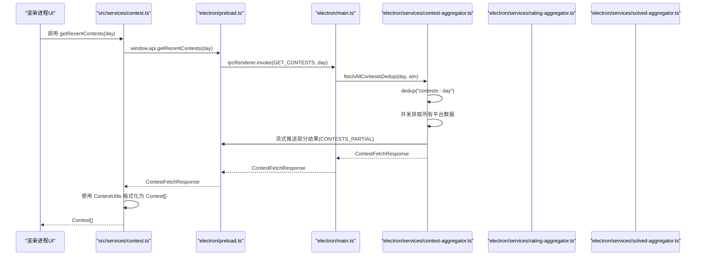
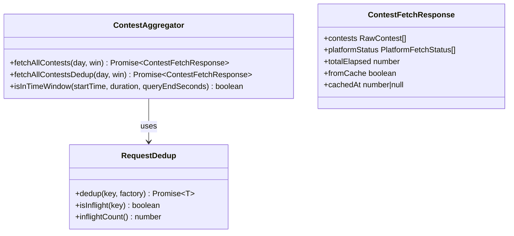
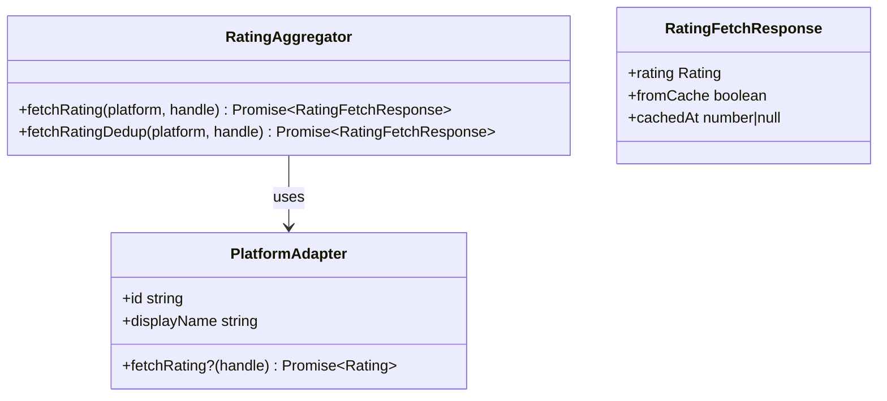
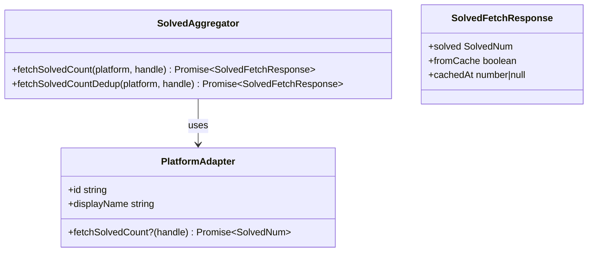
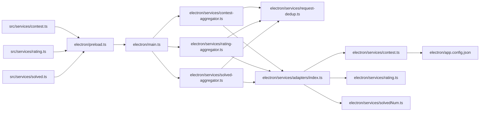
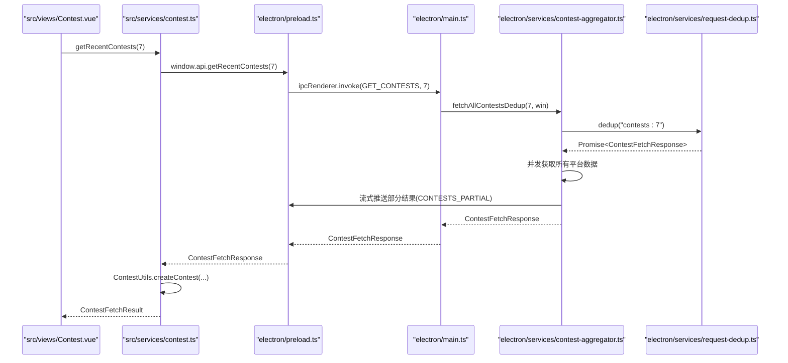

# 服务层API

<cite>
**本文引用的文件**
- [electron/services/contest-aggregator.ts](file://electron/services/contest-aggregator.ts)
- [electron/services/rating-aggregator.ts](file://electron/services/rating-aggregator.ts)
- [electron/services/solved-aggregator.ts](file://electron/services/solved-aggregator.ts)
- [electron/services/request-dedup.ts](file://electron/services/request-dedup.ts)
- [electron/services/adapters/index.ts](file://electron/services/adapters/index.ts)
- [electron/services/contest.ts](file://electron/services/contest.ts)
- [electron/services/rating.ts](file://electron/services/rating.ts)
- [electron/services/solvedNum.ts](file://electron/services/solvedNum.ts)
- [src/services/contest.ts](file://src/services/contest.ts)
- [src/services/rating.ts](file://src/services/rating.ts)
- [src/services/solved.ts](file://src/services/solved.ts)
- [shared/types.ts](file://shared/types.ts)
- [shared/ipc-channels.ts](file://shared/ipc-channels.ts)
- [electron/preload.ts](file://electron/preload.ts)
- [electron/main.ts](file://electron/main.ts)
- [src/utils/contest_utils.ts](file://src/utils/contest_utils.ts)
- [electron/app.config.json](file://electron/app.config.json)
- [src/views/Contest.vue](file://src/views/Contest.vue)
</cite>

## 更新摘要
**变更内容**
- 新增竞赛聚合服务API：fetchAllContests、fetchAllContestsDedup
- 新增Rating聚合服务API：fetchRating、fetchRatingDedup  
- 新增解题统计聚合服务API：fetchSolvedCount、fetchSolvedCountDedup
- 新增请求去重机制：dedup函数，防止并发重复请求
- 新增流式部分结果推送：CONTESTS_PARTIAL IPC通道
- 更新IPC通道映射，支持新的聚合服务和流式推送
- 增强数据模型：新增ContestFetchResponse、RatingFetchResponse、SolvedFetchResponse

## 目录
1. [简介](#简介)
2. [项目结构](#项目结构)
3. [核心组件](#核心组件)
4. [架构总览](#架构总览)
5. [详细组件分析](#详细组件分析)
6. [依赖关系分析](#依赖关系分析)
7. [性能考量](#性能考量)
8. [故障排查指南](#故障排查指南)
9. [结论](#结论)
10. [附录](#附录)

## 简介
本文件系统性梳理服务层API，覆盖以下能力：
- 竞赛服务：从多个在线评测平台抓取近期比赛信息，并按时间窗口过滤与聚合。
- Rating服务：查询用户在各平台的当前与历史最高分。
- 解题统计服务：查询用户在各平台的已解决问题数量。
- **新增**：聚合服务提供并发获取和去重功能，提升性能和用户体验。

文档重点包括：
- 公共方法签名、参数与返回值说明
- 异常处理与错误分类策略
- 服务层设计模式（职责分离、IPC桥接、请求去重）
- 数据获取、处理与缓存实现细节
- 服务调用示例与最佳实践
- 服务层与IPC通信的数据流转过程
- 错误处理策略与重试机制

## 项目结构
服务层由四层构成：
- 渲染进程服务封装：对IPC调用进行薄封装，便于UI层统一调用。
- IPC桥接：通过preload暴露受限API给渲染进程。
- 主进程服务：执行网络请求、数据解析与业务逻辑，提供稳定接口。
- **新增**：聚合服务层：提供并发获取、去重和流式推送功能。

**图表来源**
- [src/services/contest.ts:1-61](file://src/services/contest.ts#L1-L61)
- [src/services/rating.ts:1-8](file://src/services/rating.ts#L1-L8)
- [src/services/solved.ts:1-8](file://src/services/solved.ts#L1-L8)
- [electron/preload.ts:1-61](file://electron/preload.ts#L1-L61)
- [electron/main.ts:414-557](file://electron/main.ts#L414-L557)
- [electron/services/contest-aggregator.ts:1-144](file://electron/services/contest-aggregator.ts#L1-L144)
- [electron/services/rating-aggregator.ts:1-61](file://electron/services/rating-aggregator.ts#L1-L61)
- [electron/services/solved-aggregator.ts:1-67](file://electron/services/solved-aggregator.ts#L1-L67)
- [electron/services/request-dedup.ts:1-33](file://electron/services/request-dedup.ts#L1-L33)

**章节来源**
- [src/services/contest.ts:1-61](file://src/services/contest.ts#L1-L61)
- [src/services/rating.ts:1-8](file://src/services/rating.ts#L1-L8)
- [src/services/solved.ts:1-8](file://src/services/solved.ts#L1-L8)
- [electron/preload.ts:1-61](file://electron/preload.ts#L1-L61)
- [electron/main.ts:414-557](file://electron/main.ts#L414-L557)

## 核心组件
- 竞赛聚合服务：负责从多个平台适配器并发抓取近期比赛，支持去重和流式推送。
- Rating聚合服务：根据平台标识与用户名查询用户评分，支持去重和验证。
- 解题统计聚合服务：根据平台标识与用户名查询已解决问题数，支持去重和验证。
- 请求去重服务：防止并发重复请求，提升资源利用率。
- 适配器服务：统一管理各平台的数据获取逻辑。

**章节来源**
- [electron/services/contest-aggregator.ts:43-143](file://electron/services/contest-aggregator.ts#L43-L143)
- [electron/services/rating-aggregator.ts:19-60](file://electron/services/rating-aggregator.ts#L19-L60)
- [electron/services/solved-aggregator.ts:23-66](file://electron/services/solved-aggregator.ts#L23-L66)
- [electron/services/request-dedup.ts:12-22](file://electron/services/request-dedup.ts#L12-L22)
- [electron/services/adapters/index.ts:13-55](file://electron/services/adapters/index.ts#L13-L55)

## 架构总览
服务层采用"渲染进程薄封装 + IPC桥接 + 主进程服务 + 聚合服务"的分层设计，确保：
- 渲染进程仅通过白名单API访问主进程能力
- 主进程集中处理网络请求、数据解析与安全校验
- **新增**：聚合服务层提供并发优化和去重功能
- **新增**：流式推送机制提升用户体验
- 类型定义在共享模块中统一，保证前后端契约一致

**图表来源**
- [src/services/contest.ts:17-51](file://src/services/contest.ts#L17-L51)
- [electron/preload.ts:6-7](file://electron/preload.ts#L6-L7)
- [electron/main.ts:415-439](file://electron/main.ts#L415-L439)
- [electron/services/contest-aggregator.ts:138-143](file://electron/services/contest-aggregator.ts#L138-L143)
- [electron/services/contest-aggregator.ts:80-86](file://electron/services/contest-aggregator.ts#L80-L86)
- [src/utils/contest_utils.ts:4-43](file://src/utils/contest_utils.ts#L4-L43)

## 详细组件分析

### 竞赛聚合服务 API
- 服务类：contest-aggregator（主进程）
- 渲染进程封装：ContestService（渲染进程）

**新增** 并发获取方法
- fetchAllContests(day: number, win?: BrowserWindow | null): Promise<ContestFetchResponse>
  - 并发拉取所有平台适配器数据，支持流式推送部分结果
  - 过滤规则：基于时间窗口和有效性验证
  - 返回：ContestFetchResponse（包含竞赛列表、平台状态、耗时信息）
  - 异常：适配器失败时记录错误但不影响其他平台
- fetchAllContestsDedup(day: number, win?: BrowserWindow | null): Promise<ContestFetchResponse>
  - 去重版本：防止并发相同参数的重复请求
  - 去重键：`contests:${day}`
  - 返回：同上

**新增** 流式推送机制
- CONTESTS_PARTIAL IPC通道：实时推送各平台获取的部分结果
- 流式回调：onContestsPartial(callback)订阅部分结果推送

渲染进程封装方法
- getRecentContests(day?: number): Promise<ContestFetchResult>
  - 支持新旧两种返回格式：ContestFetchResponse和Legacy RawContest[]
  - 返回：ContestFetchResult（包含格式化竞赛列表、平台状态、缓存信息）
  - 异常：捕获错误并返回空数组

**章节来源**
- [electron/services/contest-aggregator.ts:43-143](file://electron/services/contest-aggregator.ts#L43-L143)
- [electron/services/request-dedup.ts:12-22](file://electron/services/request-dedup.ts#L12-L22)
- [electron/preload.ts:21-31](file://electron/preload.ts#L21-L31)
- [src/services/contest.ts:16-51](file://src/services/contest.ts#L16-L51)

#### 竞赛聚合服务类图

**图表来源**
- [electron/services/contest-aggregator.ts:43-143](file://electron/services/contest-aggregator.ts#L43-L143)
- [electron/services/request-dedup.ts:12-22](file://electron/services/request-dedup.ts#L12-L22)
- [shared/types.ts:80-86](file://shared/types.ts#L80-L86)

### Rating聚合服务 API
- 服务类：rating-aggregator（主进程）
- 渲染进程封装：RatingService（渲染进程）

**新增** 聚合获取方法
- fetchRating(platform: string, handle: string): Promise<RatingFetchResponse>
  - 根据平台显示名映射到适配器ID，调用对应适配器获取评分
  - 支持平台：Codeforces、AtCoder、力扣、洛谷、牛客
  - 返回：RatingFetchResponse（包含评分数据、缓存信息）
  - 异常：未知平台或适配器不支持时抛出错误
- fetchRatingDedup(platform: string, handle: string): Promise<RatingFetchResponse>
  - 去重版本：防止并发相同参数的重复请求
  - 去重键：`rating:${platform}:${handle}`

**新增** 平台映射机制
- platformIdMap：平台显示名到适配器ID的映射表
- 自动验证：对获取的评分进行有效性验证

渲染进程封装方法
- getRating(platform: string, name: string): Promise<Rating>
  - 通过IPC调用主进程聚合服务
  - 返回：Rating
  - 异常：透传主进程错误

**章节来源**
- [electron/services/rating-aggregator.ts:19-60](file://electron/services/rating-aggregator.ts#L19-L60)
- [electron/services/request-dedup.ts:12-22](file://electron/services/request-dedup.ts#L12-L22)
- [src/services/rating.ts:3-6](file://src/services/rating.ts#L3-L6)

#### Rating聚合服务类图

**图表来源**
- [electron/services/rating-aggregator.ts:19-60](file://electron/services/rating-aggregator.ts#L19-L60)
- [shared/types.ts:89-93](file://shared/types.ts#L89-L93)

### 解题统计聚合服务 API
- 服务类：solved-aggregator（主进程）
- 渲染进程封装：SolvedNumService（渲染进程）

**新增** 聚合获取方法
- fetchSolvedCount(platform: string, handle: string): Promise<SolvedFetchResponse>
  - 根据平台显示名映射到适配器ID，调用对应适配器获取解题数
  - 支持平台：Codeforces、力扣、VJudge、洛谷、AtCoder、HDU、POJ、牛客、QOJ
  - 返回：SolvedFetchResponse（包含解题统计、缓存信息）
  - 异常：未知平台或适配器不支持时抛出错误
- fetchSolvedCountDedup(platform: string, handle: string): Promise<SolvedFetchResponse>
  - 去重版本：防止并发相同参数的重复请求
  - 去重键：`solved:${platform}:${handle}`

**新增** 平台映射机制
- platformIdMap：平台显示名到适配器ID的映射表
- 自动验证：对获取的解题数进行有效性验证

渲染进程封装方法
- getSolvedNum(platform: string, name: string): Promise<SolvedNum>
  - 通过IPC调用主进程聚合服务
  - 返回：SolvedNum
  - 异常：透传主进程错误

**章节来源**
- [electron/services/solved-aggregator.ts:23-66](file://electron/services/solved-aggregator.ts#L23-L66)
- [electron/services/request-dedup.ts:12-22](file://electron/services/request-dedup.ts#L12-L22)
- [src/services/solved.ts:3-6](file://src/services/solved.ts#L3-L6)

#### 解题统计聚合服务类图

**图表来源**
- [electron/services/solved-aggregator.ts:23-66](file://electron/services/solved-aggregator.ts#L23-L66)
- [shared/types.ts:96-100](file://shared/types.ts#L96-L100)

### 请求去重服务 API
- 服务类：request-dedup（主进程）
- 功能：防止并发重复请求，提升资源利用率

方法清单与说明
- dedup<T>(key: string, factory: () => Promise<T>): Promise<T>
  - 根据去重键检查是否存在进行中的请求
  - 如果存在：返回相同的Promise
  - 如果不存在：执行工厂函数并存储Promise直到解决
  - 返回：去重后的Promise结果
- isInflight(key: string): boolean
  - 检查指定键的请求是否正在处理中
- inflightCount(): number
  - 获取当前进行中的请求数量（主要用于测试）

**章节来源**
- [electron/services/request-dedup.ts:12-33](file://electron/services/request-dedup.ts#L12-L33)

### 适配器服务 API
- 服务类：adapters/index（主进程）
- 功能：统一管理各平台的数据获取逻辑

方法清单与说明
- getAllAdapters(): PlatformAdapter[]
  - 获取所有已注册的适配器实例
- getAdapter(id: string): PlatformAdapter | undefined
  - 根据适配器ID获取特定适配器
- getContestAdapters(): PlatformAdapter[]
  - 获取支持竞赛获取的适配器集合
- getSolvedAdapters(): PlatformAdapter[]
  - 获取支持解题统计查询的适配器集合

**章节来源**
- [electron/services/adapters/index.ts:33-55](file://electron/services/adapters/index.ts#L33-L55)

### 数据模型与类型
- RawContest：原始竞赛数据（名称、开始时间、持续时间、平台、链接）
- Contest：UI侧格式化竞赛数据（包含多种格式化字段）
- Rating：用户评分数据（当前分、最高分、可选排名与时点）
- SolvedNum：用户解题统计（已解决问题数）
- **新增** ContestFetchResponse：竞赛聚合响应（包含竞赛列表、平台状态、耗时信息）
- **新增** RatingFetchResponse：Rating聚合响应（包含评分数据、缓存信息）
- **新增** SolvedFetchResponse：解题统计聚合响应（包含统计数据、缓存信息）
- **新增** PlatformFetchStatus：平台获取状态（包含平台名、成功标志、错误信息、耗时）

**章节来源**
- [shared/types.ts:1-101](file://shared/types.ts#L1-L101)

## 依赖关系分析
- 渲染进程服务依赖IPC通道与预加载桥接
- 主进程服务依赖聚合服务、适配器服务与请求去重服务
- 聚合服务依赖适配器服务和请求去重服务
- 适配器服务统一管理各平台的数据获取逻辑
- 配置文件控制爬取时间窗口与主题等参数
- UI视图通过服务层获取数据并展示

**图表来源**
- [src/services/contest.ts:1-61](file://src/services/contest.ts#L1-L61)
- [src/services/rating.ts:1-8](file://src/services/rating.ts#L1-L8)
- [src/services/solved.ts:1-8](file://src/services/solved.ts#L1-L8)
- [electron/preload.ts:1-61](file://electron/preload.ts#L1-L61)
- [electron/main.ts:414-557](file://electron/main.ts#L414-L557)
- [electron/services/contest-aggregator.ts:1-144](file://electron/services/contest-aggregator.ts#L1-L144)
- [electron/services/rating-aggregator.ts:1-61](file://electron/services/rating-aggregator.ts#L1-L61)
- [electron/services/solved-aggregator.ts:1-67](file://electron/services/solved-aggregator.ts#L1-L67)
- [electron/services/request-dedup.ts:1-33](file://electron/services/request-dedup.ts#L1-L33)
- [electron/services/adapters/index.ts:1-71](file://electron/services/adapters/index.ts#L1-L71)
- [electron/services/contest.ts:1-292](file://electron/services/contest.ts#L1-L292)
- [electron/services/rating.ts:1-181](file://electron/services/rating.ts#L1-L181)
- [electron/services/solvedNum.ts:1-205](file://electron/services/solvedNum.ts#L1-L205)
- [electron/app.config.json:1-62](file://electron/app.config.json#L1-L62)

**章节来源**
- [electron/main.ts:414-557](file://electron/main.ts#L414-L557)
- [electron/preload.ts:1-61](file://electron/preload.ts#L1-L61)
- [electron/app.config.json:1-62](file://electron/app.config.json#L1-L62)

## 性能考量
- **新增** 并发抓取：聚合服务在获取阶段使用Promise.allSettled并发请求，显著缩短整体等待时间
- **新增** 请求去重：通过dedup函数防止并发重复请求，减少服务器压力和网络开销
- **新增** 流式推送：支持实时推送部分获取结果，提升用户体验
- **新增** 缓存优先：主进程采用缓存优先策略，先返回缓存数据再异步刷新
- 时间窗口裁剪：通过配置限制最大爬取范围，避免无界请求
- 响应解析优化：针对不同平台采用合适的解析策略（GraphQL、HTML选择器、正则）
- **新增** 平台状态监控：记录每个平台的获取状态、错误类型和耗时信息

## 故障排查指南
常见错误与处理
- **新增** 平台不支持
  - 聚合服务：未知平台或适配器不支持时抛出错误
  - 解决方案：检查platformIdMap映射或适配器功能支持
- **新增** 请求去重冲突
  - 现象：并发相同参数的请求被合并
  - 解决方案：合理设置去重键或等待现有请求完成
- **新增** 流式推送异常
  - 现象：部分结果推送失败
  - 解决方案：检查BrowserWindow状态和IPC通道连接
- 参数校验失败
  - 竞赛服务：day不在[minDays, maxDays]范围内时按默认值处理
  - Rating/解题统计服务：platform或name类型不符或长度超限将抛出错误
- 网络/超时错误
  - 主进程内置超时与重试机制（见更新器相关逻辑），可借鉴到服务层
  - 建议在服务层增加统一的超时与重试包装
- 平台解析失败
  - HTML结构变化导致选择器失效；建议增加健壮性检查与降级策略
- 未知平台
  - Rating与SolvedNum多态路由遇到未知平台时抛出错误；调用方需做好兜底

**章节来源**
- [electron/services/rating-aggregator.ts:24-31](file://electron/services/rating-aggregator.ts#L24-L31)
- [electron/services/solved-aggregator.ts:28-35](file://electron/services/solved-aggregator.ts#L28-L35)
- [electron/services/request-dedup.ts:12-22](file://electron/services/request-dedup.ts#L12-L22)
- [electron/main.ts:444-449](file://electron/main.ts#L444-L449)
- [electron/main.ts:473-478](file://electron/main.ts#L473-L478)

## 结论
服务层通过清晰的职责分离与IPC桥接，实现了稳定的跨平台数据获取能力。**新增的聚合服务进一步提升了性能和用户体验**。建议后续增强：
- 统一的超时与重试策略
- 主进程层的短期缓存
- 更强的解析健壮性与错误恢复
- 对外暴露更细粒度的错误码与诊断信息
- **新增**：监控和日志记录机制，跟踪聚合服务的性能指标

## 附录

### IPC通道与类型映射
- GET_CONTESTS：参数[day:number]，返回ContestFetchResponse
- GET_RATING：参数{platform:string, name:string}，返回Rating
- GET_SOLVED_NUM：参数{platform:string, name:string}，返回SolvedNum
- OPEN_URL：参数[url:string]，返回void
- UPDATER_INSTALL：参数{url:string}，返回boolean
- **新增** CONTESTS_PARTIAL：参数{platform:string, contests:unknown[]}，推送部分结果

**章节来源**
- [shared/ipc-channels.ts:3-68](file://shared/ipc-channels.ts#L3-L68)

### 服务调用示例与最佳实践
- **新增** 竞赛聚合服务
  - 推荐：在渲染层调用ContestService.getRecentContests(day)，并订阅onContestsPartial获取实时进度
  - 最佳实践：对day参数做边界检查；利用平台状态信息监控各平台获取情况
- **新增** Rating聚合服务
  - 推荐：在渲染层调用RatingService.getRating(platform, name)
  - 最佳实践：对未知平台提前校验；利用去重机制避免重复请求
- **新增** 解题统计聚合服务
  - 推荐：在渲染层调用SolvedNumService.getSolvedNum(platform, name)
  - 最佳实践：对第三方API响应进行严格校验；利用去重机制提升并发性能

**章节来源**
- [src/services/contest.ts:17-51](file://src/services/contest.ts#L17-L51)
- [src/services/rating.ts:3-6](file://src/services/rating.ts#L3-L6)
- [src/services/solved.ts:3-6](file://src/services/solved.ts#L3-L6)

### 服务层与IPC通信的数据流转

**图表来源**
- [src/views/Contest.vue:1-200](file://src/views/Contest.vue#L1-L200)
- [src/services/contest.ts:17-51](file://src/services/contest.ts#L17-L51)
- [electron/preload.ts:6-7](file://electron/preload.ts#L6-L7)
- [electron/main.ts:415-439](file://electron/main.ts#L415-L439)
- [electron/services/contest-aggregator.ts:138-143](file://electron/services/contest-aggregator.ts#L138-L143)
- [electron/services/request-dedup.ts:12-22](file://electron/services/request-dedup.ts#L12-L22)
- [electron/preload.ts:21-31](file://electron/preload.ts#L21-L31)

### TypeScript类型系统增强
服务层现在具备完整的TypeScript类型定义，包括：

- **数据模型类型**：RawContest、Contest、Rating、SolvedNum接口定义
- **聚合响应类型**：ContestFetchResponse、RatingFetchResponse、SolvedFetchResponse接口定义
- **平台枚举类型**：ContestPlatform、RatingPlatform、SolvedPlatform联合类型
- **IPC类型映射**：IpcHandlerMap接口确保IPC参数和返回值的类型安全
- **参数验证**：主进程对平台标识和用户名进行严格的类型和长度检查
- **新增** **平台状态类型**：PlatformFetchStatus接口定义平台获取状态信息

**章节来源**
- [shared/types.ts:1-101](file://shared/types.ts#L1-L101)
- [shared/ipc-channels.ts:25-68](file://shared/ipc-channels.ts#L25-L68)
- [electron/main.ts:444-496](file://electron/main.ts#L444-L496)