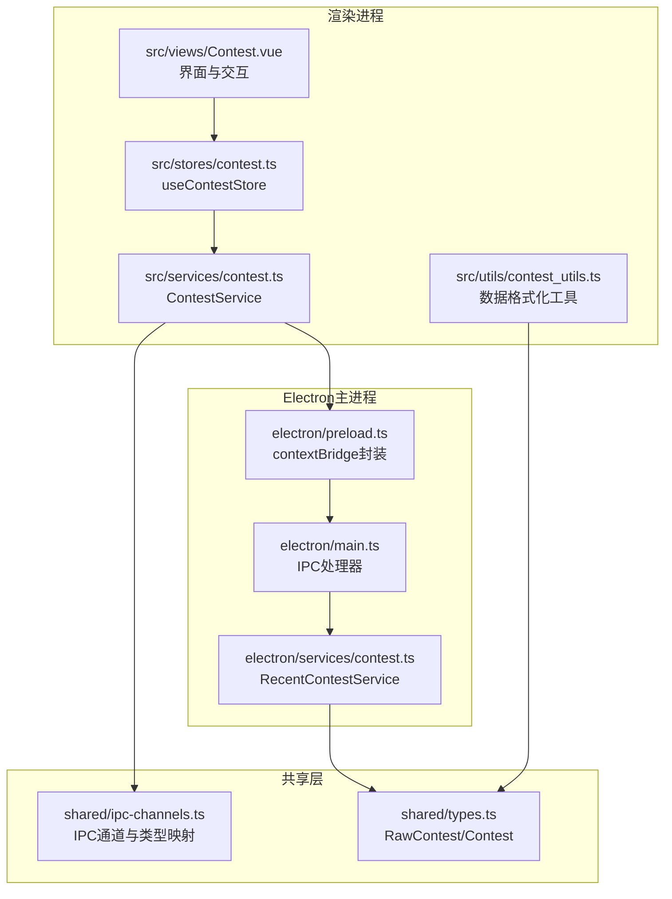
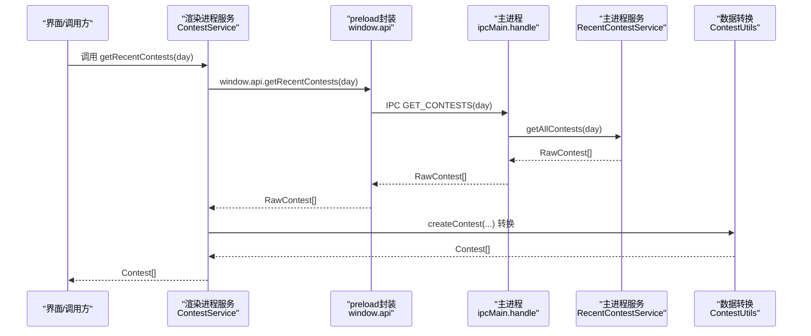
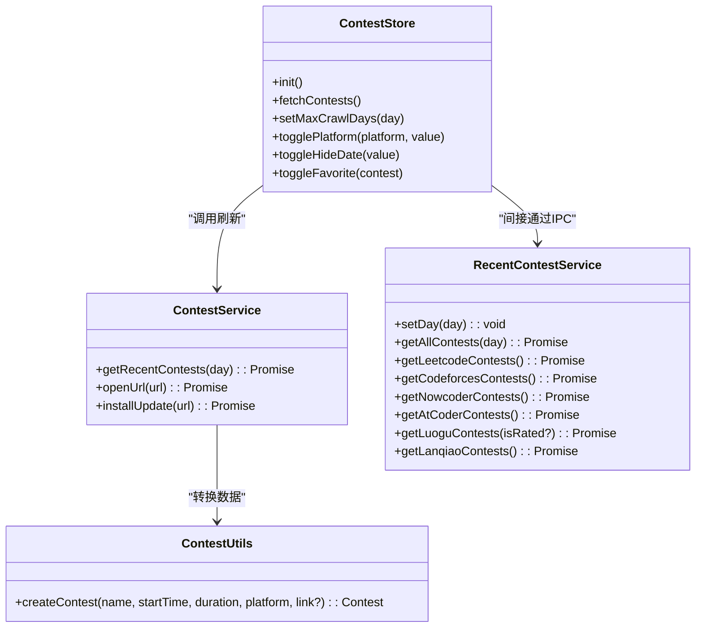

# 竞赛服务API

<cite>
**本文档引用的文件**
- [electron/services/contest.ts](file://electron/services/contest.ts)
- [src/services/contest.ts](file://src/services/contest.ts)
- [shared/ipc-channels.ts](file://shared/ipc-channels.ts)
- [electron/main.ts](file://electron/main.ts)
- [electron/preload.ts](file://electron/preload.ts)
- [src/stores/contest.ts](file://src/stores/contest.ts)
- [shared/types.ts](file://shared/types.ts)
- [src/utils/contest_utils.ts](file://src/utils/contest_utils.ts)
- [src/views/Contest.vue](file://src/views/Contest.vue)
- [tests/unit/contest_utils.test.ts](file://tests/unit/contest_utils.test.ts)
- [electron/app.config.json](file://electron/app.config.json)
- [docs/CONTEST_TAB_DESIGN.md](file://docs/CONTEST_TAB_DESIGN.md)
- [docs/CONTEST_TAB_IMPLEMENTATION_SUMMARY.md](file://docs/CONTEST_TAB_IMPLEMENTATION_SUMMARY.md)
</cite>

## 目录
1. [简介](#简介)
2. [项目结构](#项目结构)
3. [核心组件](#核心组件)
4. [架构总览](#架构总览)
5. [详细组件分析](#详细组件分析)
6. [依赖关系分析](#依赖关系分析)
7. [性能考量](#性能考量)
8. [故障排查指南](#故障排查指南)
9. [结论](#结论)
10. [附录](#附录)

## 简介
本文件面向竞赛服务API，聚焦于ContestService类及其相关模块，系统性阐述以下内容：
- ContestService类的公共方法：getRecentContests()、openUrl()、installUpdate()
- 方法参数、返回值类型与异常处理机制
- 竞赛数据获取流程、数据转换过程与缓存策略
- IPC通信实现与数据格式
- 与Electron主进程交互方式与数据同步机制
- 实际调用示例与错误处理最佳实践

## 项目结构
围绕竞赛服务API的关键目录与文件如下：
- Electron主进程服务：负责抓取多平台竞赛数据、IPC处理与更新下载
- 渲染进程服务：封装对外API，提供统一入口
- 类型与IPC通道：定义数据模型与IPC接口契约
- 状态管理与视图：消费服务结果，提供UI展示与交互

图表来源
- [src/services/contest.ts:1-35](file://src/services/contest.ts#L1-L35)
- [src/stores/contest.ts:1-307](file://src/stores/contest.ts#L1-L307)
- [src/views/Contest.vue:1-800](file://src/views/Contest.vue#L1-L800)
- [src/utils/contest_utils.ts:1-68](file://src/utils/contest_utils.ts#L1-L68)
- [shared/types.ts:1-67](file://shared/types.ts#L1-L67)
- [shared/ipc-channels.ts:1-53](file://shared/ipc-channels.ts#L1-L53)
- [electron/main.ts:1-493](file://electron/main.ts#L1-L493)
- [electron/preload.ts:1-38](file://electron/preload.ts#L1-L38)
- [electron/services/contest.ts:1-270](file://electron/services/contest.ts#L1-L270)

章节来源
- [src/services/contest.ts:1-35](file://src/services/contest.ts#L1-L35)
- [electron/services/contest.ts:1-270](file://electron/services/contest.ts#L1-L270)
- [shared/ipc-channels.ts:1-53](file://shared/ipc-channels.ts#L1-L53)
- [electron/main.ts:1-493](file://electron/main.ts#L1-L493)
- [electron/preload.ts:1-38](file://electron/preload.ts#L1-L38)
- [src/stores/contest.ts:1-307](file://src/stores/contest.ts#L1-L307)
- [shared/types.ts:1-67](file://shared/types.ts#L1-L67)
- [src/utils/contest_utils.ts:1-68](file://src/utils/contest_utils.ts#L1-L68)
- [src/views/Contest.vue:1-800](file://src/views/Contest.vue#L1-L800)

## 核心组件
- ContestService（渲染进程）：对外暴露静态方法，封装IPC调用与数据转换
- RecentContestService（Electron主进程）：抓取各平台竞赛数据，聚合与过滤
- IPC通道与类型映射：定义GET_CONTESTS、OPEN_URL、UPDATER_INSTALL等通道及参数/返回类型
- ContestStore（Pinia）：管理竞赛数据、筛选、收藏、缓存与持久化
- ContestUtils：将原始竞赛数据转换为渲染所需格式

章节来源
- [src/services/contest.ts:7-34](file://src/services/contest.ts#L7-L34)
- [electron/services/contest.ts:12-269](file://electron/services/contest.ts#L12-L269)
- [shared/ipc-channels.ts:3-52](file://shared/ipc-channels.ts#L3-L52)
- [src/stores/contest.ts:63-307](file://src/stores/contest.ts#L63-L307)
- [src/utils/contest_utils.ts:4-43](file://src/utils/contest_utils.ts#L4-L43)

## 架构总览
渲染进程通过preload暴露的window.api调用IPC；主进程在ipcMain.handle中注册处理器，调用RecentContestService执行抓取与聚合，并返回RawContest数组；渲染进程再通过ContestUtils转换为Contest对象供UI使用。

图表来源
- [src/services/contest.ts:8-25](file://src/services/contest.ts#L8-L25)
- [electron/preload.ts:6-7](file://electron/preload.ts#L6-L7)
- [electron/main.ts:397-412](file://electron/main.ts#L397-L412)
- [electron/services/contest.ts:255-266](file://electron/services/contest.ts#L255-L266)
- [src/utils/contest_utils.ts:5-43](file://src/utils/contest_utils.ts#L5-L43)

## 详细组件分析

### ContestService 类（渲染进程）
- 作用：对外提供统一API，封装IPC调用与数据转换
- 方法：
  - getRecentContests(day: number = 默认天数): Promise<Contest[]>
    - 参数：day为查询天数，默认来自app.config.json
    - 返回：Promise<Contest[]>，渲染可用的竞赛对象数组
    - 异常处理：捕获错误并返回空数组，避免崩溃
    - 数据转换：调用ContestUtils.createContest将RawContest转换为Contest
  - openUrl(url: string): Promise<void>
    - 参数：url为字符串
    - 返回：Promise<void>
    - 异常处理：直接调用window.api.openUrl，错误由主进程处理
  - installUpdate(url: string): Promise<void>
    - 参数：url为字符串
    - 返回：Promise<void>
    - 异常处理：直接调用window.api.installUpdate，错误由主进程处理

章节来源
- [src/services/contest.ts:7-34](file://src/services/contest.ts#L7-L34)
- [src/utils/contest_utils.ts:4-43](file://src/utils/contest_utils.ts#L4-L43)
- [shared/types.ts:1-26](file://shared/types.ts#L1-L26)

### IPC通道与类型映射
- IPC_CHANNELS定义了通道名称与类型映射，包括：
  - GET_CONTESTS(args: [day: number], return: RawContest[])
  - OPEN_URL(args: [url: string], return: void)
  - UPDATER_INSTALL(args: [{ url: string }], return: boolean)
- 主进程ipcMain.handle实现：
  - GET_CONTESTS：校验day范围，调用RecentContestService.getAllContests
  - OPEN_URL：校验协议为http/https，调用shell.openExternal
  - UPDATER_INSTALL：下载并启动更新包

章节来源
- [shared/ipc-channels.ts:3-52](file://shared/ipc-channels.ts#L3-L52)
- [electron/main.ts:397-466](file://electron/main.ts#L397-L466)

### RecentContestService（Electron主进程）
- 作用：抓取多个平台的竞赛数据，统一格式化与过滤
- 方法：
  - setDay(day: number): void：设置查询天数（秒级）
  - getLeetcodeContests(): Promise<RawContest[]>
  - getCodeforcesContests(): Promise<RawContest[]>
  - getNowcoderContests(): Promise<RawContest[]>
  - getAtCoderContests(): Promise<RawContest[]>
  - getLuoguContests(isRated?: boolean): Promise<RawContest[]>
  - getLanqiaoContests(): Promise<RawContest[]>
  - getAllContests(day: number): Promise<RawContest[]>：并发抓取并扁平化
- 过滤逻辑：_isIntime(startTime, duration)判断是否过期或已结束
- 异常处理：各平台方法内部捕获错误并返回空数组

章节来源
- [electron/services/contest.ts:12-269](file://electron/services/contest.ts#L12-L269)

### 数据模型与转换
- RawContest：原始竞赛数据，字段包含name、startTime（秒）、duration（秒）、platform、link
- Contest：渲染用竞赛数据，包含格式化的时间字符串、时长字符串、时间戳等
- ContestUtils.createContest：将RawContest转换为Contest，包含格式化与派生字段

章节来源
- [shared/types.ts:1-26](file://shared/types.ts#L1-L26)
- [src/utils/contest_utils.ts:4-43](file://src/utils/contest_utils.ts#L4-L43)

### 与Electron主进程交互与数据同步
- preload封装：contextBridge.exposeInMainWorld('api', ...)，仅暴露白名单方法
- 主进程ipcMain.handle：注册GET_CONTESTS、OPEN_URL、UPDATER_INSTALL等处理器
- 数据同步：渲染进程通过ContestStore管理本地状态，初始化时从主进程拉取配置与收藏，后续通过ContestService.getRecentContests刷新

章节来源
- [electron/preload.ts:1-38](file://electron/preload.ts#L1-L38)
- [electron/main.ts:397-485](file://electron/main.ts#L397-L485)
- [src/stores/contest.ts:102-140](file://src/stores/contest.ts#L102-L140)

### 缓存策略
- 本地缓存：Pinia store在内存中维护contests数组，避免重复网络请求
- 本地持久化：localStorage与electron-store双写，支持跨会话恢复
- 配置缓存：maxCrawlDays、hideDate、selectedPlatforms等配置持久化
- 无远程缓存：数据抓取来自各平台API，未实现主进程侧缓存

章节来源
- [src/stores/contest.ts:190-201](file://src/stores/contest.ts#L190-L201)
- [src/stores/contest.ts:141-157](file://src/stores/contest.ts#L141-L157)
- [src/stores/contest.ts:158-189](file://src/stores/contest.ts#L158-L189)

### 错误处理最佳实践
- 渲染进程：ContestService.getRecentContests捕获异常并返回空数组，保证UI稳定
- 主进程：各IPC处理器对参数进行校验，网络错误分类为timeout/network/unknown，便于前端提示
- 更新安装：downloadAndLaunch对HTTP错误与超时进行分类处理，失败时抛出异常

章节来源
- [src/services/contest.ts:21-24](file://src/services/contest.ts#L21-L24)
- [electron/main.ts:146-167](file://electron/main.ts#L146-L167)
- [electron/main.ts:227-290](file://electron/main.ts#L227-L290)

## 依赖关系分析

图表来源
- [src/services/contest.ts:7-34](file://src/services/contest.ts#L7-L34)
- [electron/services/contest.ts:12-269](file://electron/services/contest.ts#L12-L269)
- [src/stores/contest.ts:63-307](file://src/stores/contest.ts#L63-L307)
- [src/utils/contest_utils.ts:4-43](file://src/utils/contest_utils.ts#L4-L43)

章节来源
- [src/services/contest.ts:7-34](file://src/services/contest.ts#L7-L34)
- [electron/services/contest.ts:12-269](file://electron/services/contest.ts#L12-L269)
- [src/stores/contest.ts:63-307](file://src/stores/contest.ts#L63-L307)
- [src/utils/contest_utils.ts:4-43](file://src/utils/contest_utils.ts#L4-L43)

## 性能考量
- 并发抓取：RecentContestService.getAllContests使用Promise.all并发抓取各平台数据，减少总等待时间
- 本地计算：渲染进程的UI过滤与统计均基于本地数据，响应迅速
- 本地持久化：避免重复请求，提升冷启动体验
- 无远程缓存：主进程未实现缓存，建议未来引入短期缓存以降低外部API压力

章节来源
- [electron/services/contest.ts:255-266](file://electron/services/contest.ts#L255-L266)
- [src/stores/contest.ts:190-201](file://src/stores/contest.ts#L190-L201)
- [docs/CONTEST_TAB_DESIGN.md:282-298](file://docs/CONTEST_TAB_DESIGN.md#L282-L298)

## 故障排查指南
- 网络超时/连接错误
  - 现象：getRecentContests返回空数组或UI无数据
  - 处理：检查网络连通性；主进程对timeout/network错误进行分类，可在前端提示“请求超时”或“网络错误”
- URL协议限制
  - 现象：openUrl抛出错误
  - 处理：确保传入http/https协议，主进程会拒绝非安全协议
- 更新安装失败
  - 现象：installUpdate抛错或无法下载
  - 处理：检查manifest与packageUrl，确认HTTP状态码与超时配置；主进程对HTTP错误与超时分别处理
- 数据为空或不完整
  - 现象：部分平台数据缺失
  - 处理：检查各平台API可达性与反爬策略；RecentContestService对异常捕获并返回空数组，不影响其他平台

章节来源
- [electron/main.ts:146-167](file://electron/main.ts#L146-L167)
- [electron/main.ts:452-458](file://electron/main.ts#L452-L458)
- [electron/main.ts:227-290](file://electron/main.ts#L227-L290)
- [electron/services/contest.ts:81-84](file://electron/services/contest.ts#L81-L84)

## 结论
本API通过清晰的分层设计与严格的IPC契约，实现了从多平台抓取到渲染层的完整闭环。渲染进程提供简洁的API入口，主进程负责数据聚合与安全控制，Pinia store保障本地状态与持久化。建议后续增强主进程缓存与错误重试策略，进一步提升稳定性与性能。

## 附录

### API定义与调用示例

- getRecentContests(day?: number)
  - 参数：day为查询天数，默认来自app.config.json
  - 返回：Promise<Contest[]>
  - 示例路径：[src/services/contest.ts:8-25](file://src/services/contest.ts#L8-L25)
  - UI调用：[src/views/Contest.vue:623-625](file://src/views/Contest.vue#L623-L625)

- openUrl(url: string)
  - 参数：url为字符串，必须为http/https
  - 返回：Promise<void>
  - 示例路径：[src/services/contest.ts:27-29](file://src/services/contest.ts#L27-L29)
  - UI调用：[src/views/Contest.vue:627-639](file://src/views/Contest.vue#L627-L639)

- installUpdate(url: string)
  - 参数：url为字符串
  - 返回：Promise<void>
  - 示例路径：[src/services/contest.ts:31-33](file://src/services/contest.ts#L31-L33)

### 数据模型与转换

- RawContest
  - 字段：name, startTime(seconds), duration(seconds), platform, link?
  - 定义路径：[shared/types.ts:2-8](file://shared/types.ts#L2-L8)

- Contest
  - 字段：startTime/endTime/duration字符串、startTimeSeconds/durationSeconds、格式化时间等
  - 定义路径：[shared/types.ts:11-26](file://shared/types.ts#L11-L26)

- 转换工具
  - 方法：ContestUtils.createContest(...)
  - 定义路径：[src/utils/contest_utils.ts:5-43](file://src/utils/contest_utils.ts#L5-L43)

### IPC通道与处理器

- 通道定义
  - GET_CONTESTS: [shared/ipc-channels.ts:4](file://shared/ipc-channels.ts#L4)
  - OPEN_URL: [shared/ipc-channels.ts:7](file://shared/ipc-channels.ts#L7)
  - UPDATER_INSTALL: [shared/ipc-channels.ts:8](file://shared/ipc-channels.ts#L8)

- 主进程处理器
  - GET_CONTESTS: [electron/main.ts:397-412](file://electron/main.ts#L397-L412)
  - OPEN_URL: [electron/main.ts:452-458](file://electron/main.ts#L452-L458)
  - UPDATER_INSTALL: [electron/main.ts:460-466](file://electron/main.ts#L460-L466)

### 配置与默认值

- app.config.json
  - crawl.defaultDays/min/maxDays：影响默认查询天数与边界
  - 定义路径：[electron/app.config.json:2-6](file://electron/app.config.json#L2-L6)
  - 使用路径：[src/services/contest.ts:5](file://src/services/contest.ts#L5)、[electron/main.ts:399-406](file://electron/main.ts#L399-L406)

### 测试参考

- ContestUtils单元测试
  - 路径：[tests/unit/contest_utils.test.ts:1-35](file://tests/unit/contest_utils.test.ts#L1-L35)