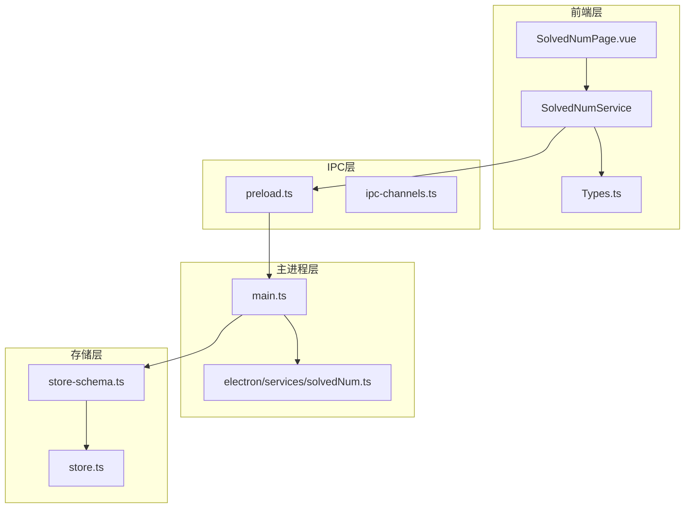
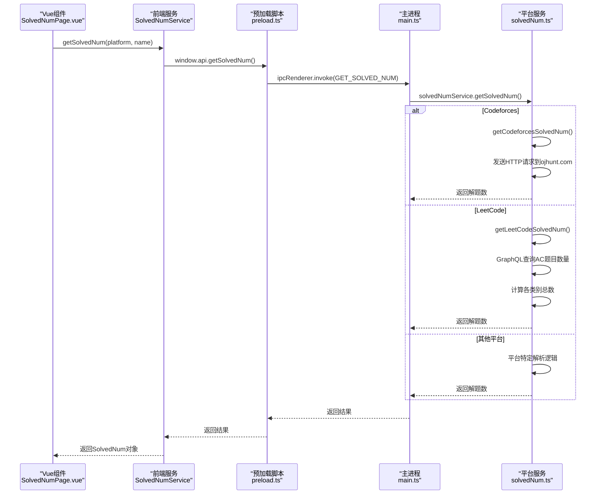
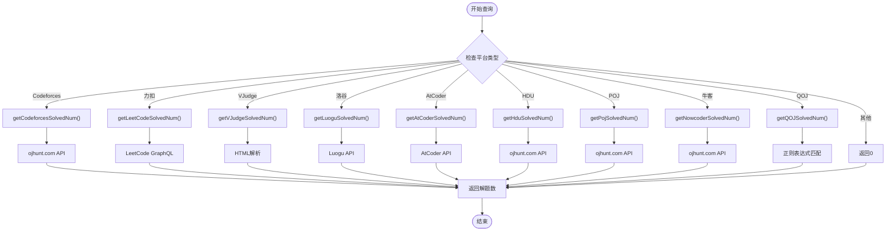
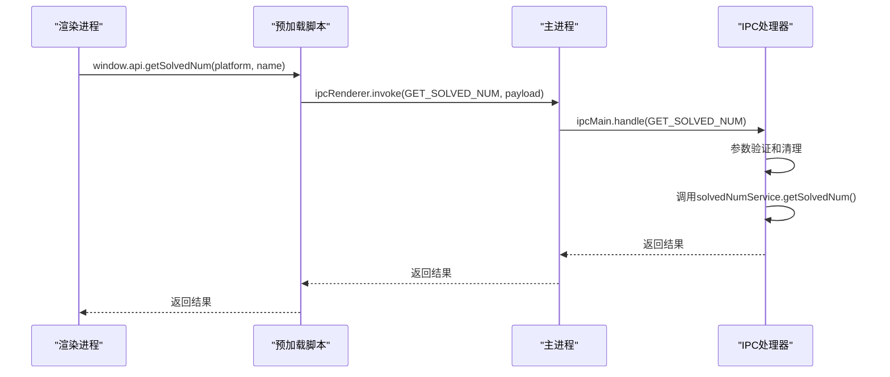
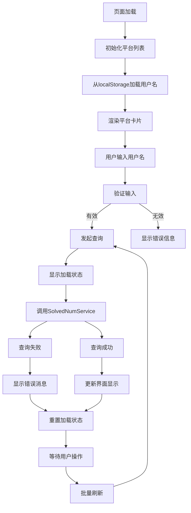
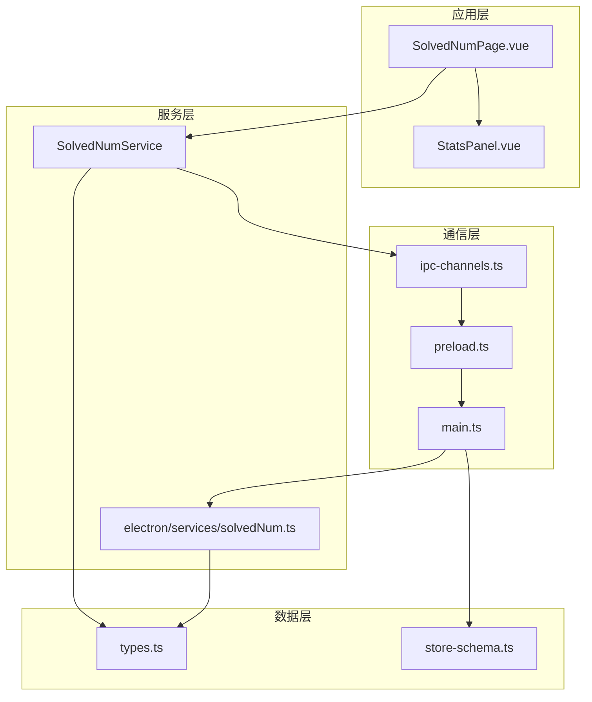
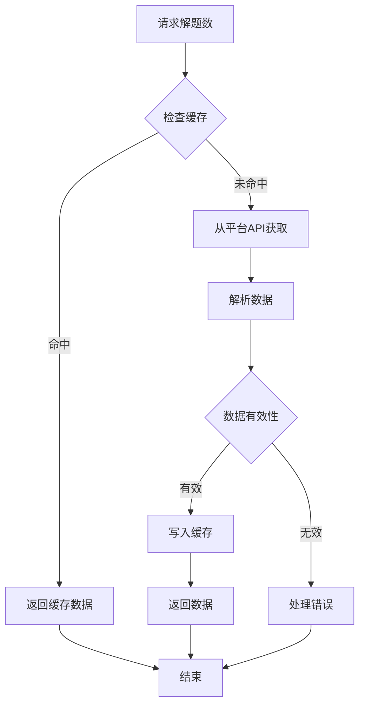
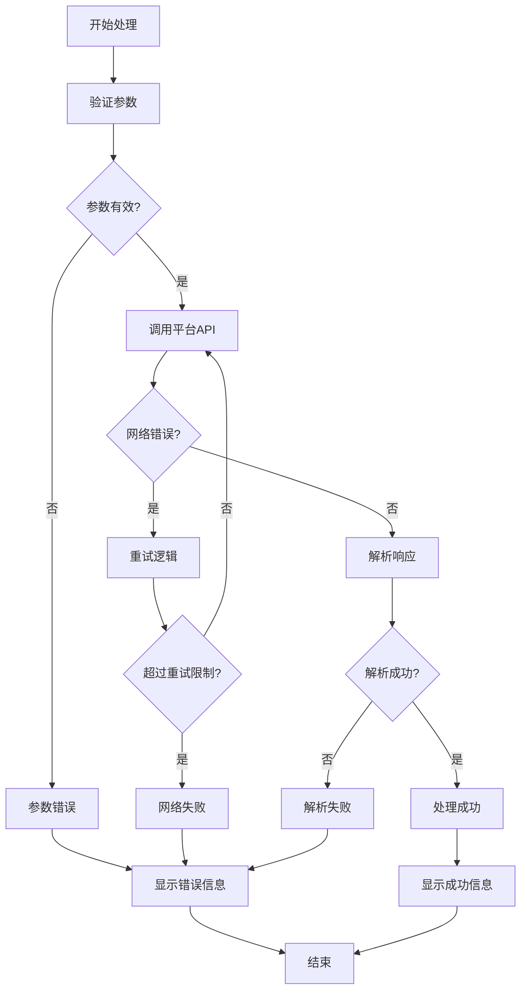

# 解题统计服务API

<cite>
**本文档引用的文件**
- [solved.ts](file://src/services/solved.ts)
- [solvedNum.ts](file://electron/services/solvedNum.ts)
- [SolvedNumPage.vue](file://src/views/SolvedNumPage.vue)
- [types.ts](file://shared/types.ts)
- [ipc-channels.ts](file://shared/ipc-channels.ts)
- [main.ts](file://electron/main.ts)
- [preload.ts](file://electron/preload.ts)
- [store-schema.ts](file://shared/store-schema.ts)
- [store.ts](file://electron/store.ts)
- [StatsPanel.vue](file://src/components/StatsPanel.vue)
</cite>

## 目录
1. [简介](#简介)
2. [项目结构](#项目结构)
3. [核心组件](#核心组件)
4. [架构概览](#架构概览)
5. [详细组件分析](#详细组件分析)
6. [依赖关系分析](#依赖关系分析)
7. [性能考虑](#性能考虑)
8. [故障排除指南](#故障排除指南)
9. [结论](#结论)
10. [附录](#附录)

## 简介
本文件详细记录了OJFlow项目中的解题统计服务API，重点分析SolvedService类及其相关组件的实现原理。该服务提供了跨多个在线判题平台的解题数量统计功能，包括AC题目数量的获取和计算方法。文档涵盖了数据持久化接口、缓存策略、更新机制、聚合算法以及服务调用示例和错误处理方案，并解释了与用户数据存储的交互方式和数据一致性保证机制。

## 项目结构
解题统计服务采用分层架构设计，主要涉及以下模块：
- 前端服务层：提供统一的API接口，封装IPC通信细节
- 主进程服务层：实现具体平台的数据抓取逻辑
- 数据模型层：定义统一的数据结构和平台枚举
- IPC通信层：建立渲染进程与主进程之间的安全通信通道
- 存储层：管理用户配置、缓存和持久化数据



**图表来源**
- [SolvedNumPage.vue:1-345](file://src/views/SolvedNumPage.vue#L1-L345)
- [solved.ts:1-8](file://src/services/solved.ts#L1-L8)
- [preload.ts:1-38](file://electron/preload.ts#L1-L38)
- [main.ts:1-493](file://electron/main.ts#L1-L493)
- [solvedNum.ts:1-198](file://electron/services/solvedNum.ts#L1-L198)
- [types.ts:1-67](file://shared/types.ts#L1-L67)
- [store-schema.ts:1-55](file://shared/store-schema.ts#L1-L55)
- [store.ts:1-31](file://electron/store.ts#L1-L31)

**章节来源**
- [SolvedNumPage.vue:1-345](file://src/views/SolvedNumPage.vue#L1-L345)
- [solved.ts:1-8](file://src/services/solved.ts#L1-L8)
- [main.ts:1-493](file://electron/main.ts#L1-L493)

## 核心组件
本节详细介绍解题统计服务的核心组件及其职责分工。

### 数据模型定义
系统使用统一的数据模型来表示解题统计结果：

```mermaid
classDiagram
class SolvedNum {
+string name
+number solvedNum
}
class SolvedPlatform {
<<enumeration>>
"Codeforces"
"力扣"
"VJudge"
"洛谷"
"AtCoder"
"HDU"
"POJ"
"牛客"
"QOJ"
}
class SolvedNumService {
+getSolvedNum(platform, name) Promise~SolvedNum~
}
SolvedNumService --> SolvedNum : "返回"
SolvedNum --> SolvedPlatform : "平台标识"
```

**图表来源**
- [types.ts:36-67](file://shared/types.ts#L36-L67)
- [solved.ts:3-7](file://src/services/solved.ts#L3-L7)

### 平台支持列表
系统当前支持以下在线判题平台：
- Codeforces（Codeforces）
- 力扣（LeetCode）
- VJudge（VJudge）
- 洛谷（Luogu）
- AtCoder（AtCoder）
- HDU（HDU）
- POJ（POJ）
- 牛客（Nowcoder）
- QOJ（QOJ）

**章节来源**
- [types.ts:57-67](file://shared/types.ts#L57-L67)
- [solvedNum.ts:166-194](file://electron/services/solvedNum.ts#L166-L194)

## 架构概览
解题统计服务采用客户端-服务器架构，通过IPC机制实现跨进程通信。整体架构遵循安全隔离原则，确保渲染进程只能通过白名单API访问主进程功能。



**图表来源**
- [SolvedNumPage.vue:192-211](file://src/views/SolvedNumPage.vue#L192-L211)
- [solved.ts:4-6](file://src/services/solved.ts#L4-L6)
- [preload.ts:12-13](file://electron/preload.ts#L12-L13)
- [main.ts:433-450](file://electron/main.ts#L433-L450)
- [solvedNum.ts:14-194](file://electron/services/solvedNum.ts#L14-L194)

## 详细组件分析

### SolvedNumService类分析
SolvedNumService是前端服务层的核心类，提供统一的解题统计API接口。

#### 公共方法
- `getSolvedNum(platform: string, name: string): Promise<SolvedNum>`
  - 接收平台名称和用户标识
  - 通过IPC机制调用主进程服务
  - 返回标准化的解题统计结果

#### 实现特点
- 单例模式设计，避免重复实例化
- 异步操作，支持并发查询
- 类型安全，返回值强制转换为SolvedNum类型

**章节来源**
- [solved.ts:3-7](file://src/services/solved.ts#L3-L7)

### 主进程服务实现
主进程中的solvedNumService类实现了具体的平台数据抓取逻辑。

#### 平台特定实现
每个平台都有专门的解析函数：



**图表来源**
- [solvedNum.ts:14-194](file://electron/services/solvedNum.ts#L14-L194)

#### AC题目数量计算方法
不同平台的AC题目数量获取方式：

1. **Codeforces**: 直接从ojhunt.com API获取已解决题目数
2. **力扣**: 使用GraphQL查询`numAcceptedQuestions`字段，对各类别count进行累加
3. **VJudge**: 通过HTML解析表格中的"Overall"行，提取第一个链接的文本作为解题数
4. **洛谷**: 先搜索用户ID，再获取用户页面的`passedProblemCount`
5. **AtCoder**: 直接从API获取`ac_rank`中的count
6. **HDU/POJ/牛客**: 从ojhunt.com API获取`solved`字段
7. **QOJ**: 使用正则表达式匹配"Accepted problems"后的数字

**章节来源**
- [solvedNum.ts:14-164](file://electron/services/solvedNum.ts#L14-L164)

### IPC通信机制
系统通过严格的IPC通道实现安全通信：



**图表来源**
- [preload.ts:12-13](file://electron/preload.ts#L12-L13)
- [main.ts:433-450](file://electron/main.ts#L433-L450)
- [ipc-channels.ts:6-31](file://shared/ipc-channels.ts#L6-L31)

**章节来源**
- [preload.ts:1-38](file://electron/preload.ts#L1-L38)
- [main.ts:433-450](file://electron/main.ts#L433-L450)
- [ipc-channels.ts:1-52](file://shared/ipc-channels.ts#L1-L52)

### 用户界面集成
解题统计页面提供了直观的用户交互体验：



**图表来源**
- [SolvedNumPage.vue:169-219](file://src/views/SolvedNumPage.vue#L169-L219)

**章节来源**
- [SolvedNumPage.vue:1-345](file://src/views/SolvedNumPage.vue#L1-L345)

## 依赖关系分析
解题统计服务的依赖关系体现了清晰的分层架构：



**图表来源**
- [SolvedNumPage.vue:92-94](file://src/views/SolvedNumPage.vue#L92-L94)
- [solved.ts:1](file://src/services/solved.ts#L1)
- [solvedNum.ts:1-3](file://electron/services/solvedNum.ts#L1-L3)
- [types.ts:1-67](file://shared/types.ts#L1-L67)
- [ipc-channels.ts:1-52](file://shared/ipc-channels.ts#L1-L52)
- [preload.ts:1-38](file://electron/preload.ts#L1-L38)
- [main.ts:19-26](file://electron/main.ts#L19-L26)

### 组件耦合度分析
- **低耦合**: 前端服务与平台实现分离，通过统一接口调用
- **高内聚**: 每个平台的解析逻辑独立封装，便于维护和扩展
- **单向依赖**: 渲染进程只能通过IPC调用主进程，确保安全性

**章节来源**
- [solvedNum.ts:166-194](file://electron/services/solvedNum.ts#L166-L194)
- [main.ts:433-450](file://electron/main.ts#L433-L450)

## 性能考虑
解题统计服务在设计时充分考虑了性能优化：

### 并发查询优化
- 支持多平台同时查询，提升用户体验
- 使用异步操作避免阻塞UI线程
- 合理的错误处理机制，单个平台失败不影响其他查询

### 缓存策略
虽然当前版本未实现完整的缓存机制，但系统具备良好的扩展基础：



**图表来源**
- [store-schema.ts:43-49](file://shared/store-schema.ts#L43-L49)

### 错误恢复机制
- 网络超时自动重试
- 参数验证和清理
- 友好的错误提示和降级处理

## 故障排除指南
解题统计服务提供了完善的错误处理机制：

### 常见错误类型
1. **网络连接错误**: 超时、DNS解析失败、连接被拒绝
2. **平台API变更**: 返回格式不符合预期
3. **用户输入错误**: 用户名为空或格式不正确
4. **权限问题**: IPC通道访问被拒绝

### 错误处理流程


**图表来源**
- [solvedNum.ts:190-194](file://electron/services/solvedNum.ts#L190-L194)
- [SolvedNumPage.vue:204-210](file://src/views/SolvedNumPage.vue#L204-L210)

### 调试建议
1. **检查网络连接**: 确保能够访问目标平台API
2. **验证用户输入**: 确认用户名格式正确
3. **查看控制台日志**: 分析IPC通信过程中的错误信息
4. **测试平台API**: 直接访问平台API确认可用性

**章节来源**
- [SolvedNumPage.vue:204-210](file://src/views/SolvedNumPage.vue#L204-L210)
- [solvedNum.ts:190-194](file://electron/services/solvedNum.ts#L190-L194)

## 结论
OJFlow的解题统计服务API展现了优秀的架构设计和实现质量。通过清晰的分层架构、严格的安全隔离和灵活的扩展机制，该服务能够稳定地为用户提供跨平台的解题统计功能。当前实现已经具备良好的基础，未来可以在缓存机制、错误恢复和性能优化方面进一步完善，以提供更加流畅和可靠的用户体验。

## 附录

### API参考文档
- **方法**: `getSolvedNum(platform: string, name: string)`
- **参数**:
  - `platform`: 平台标识符（支持: Codeforces, 力扣, VJudge, 洛谷, AtCoder, HDU, POJ, 牛客, QOJ）
  - `name`: 用户标识符（用户名或用户ID）
- **返回值**: `Promise<SolvedNum>`
- **异常**: 网络错误、平台API错误、参数验证错误

### 数据持久化接口
系统支持两种持久化方式：
1. **localStorage**: 用于浏览器环境的简单数据存储
2. **electron-store**: 用于桌面应用的配置和缓存数据存储

### 缓存策略建议
基于现有架构，建议实现以下缓存策略：
1. **短期缓存**: 5-10分钟内缓存API响应
2. **离线支持**: 在网络不可用时返回最近缓存数据
3. **失效机制**: 实现缓存数据的过期管理和手动刷新
4. **增量更新**: 支持部分数据的增量更新和同步

### 服务调用示例
```typescript
// 基本使用
const result = await SolvedNumService.getSolvedNum('Codeforces', 'tourist');

// 批量查询
const platforms = ['Codeforces', '力扣', '洛谷'];
const results = await Promise.all(
  platforms.map(p => SolvedNumService.getSolvedNum(p, usernames[p]))
);

// 错误处理
try {
  const result = await SolvedNumService.getSolvedNum('AtCoder', 'user123');
  console.log(`解题数: ${result.solvedNum}`);
} catch (error) {
  console.error('查询失败:', error.message);
}
```