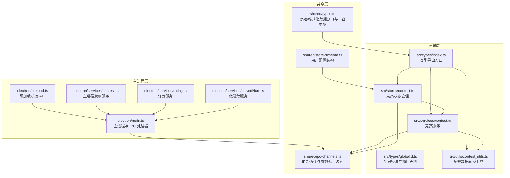
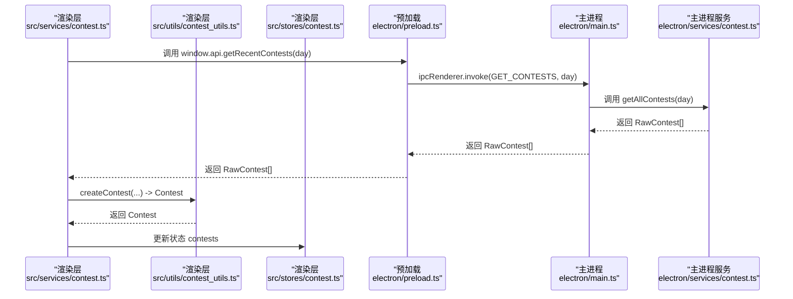
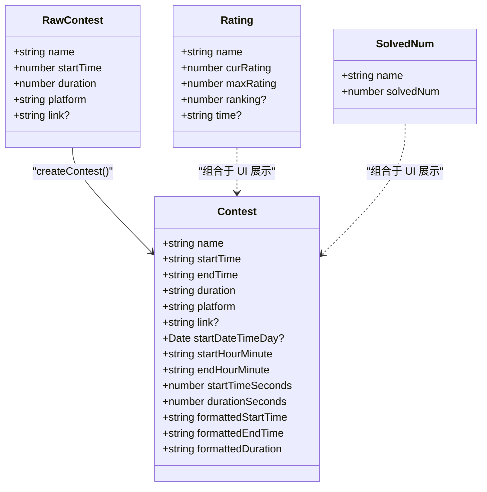
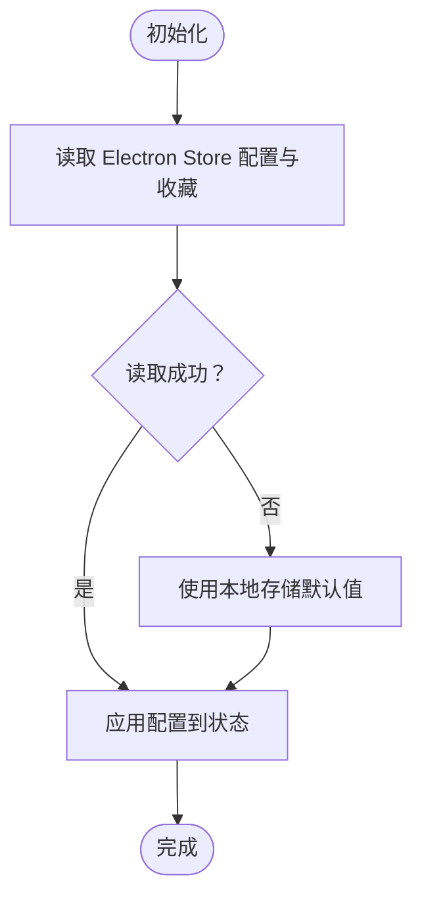
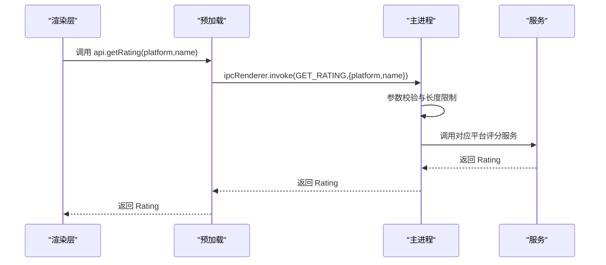
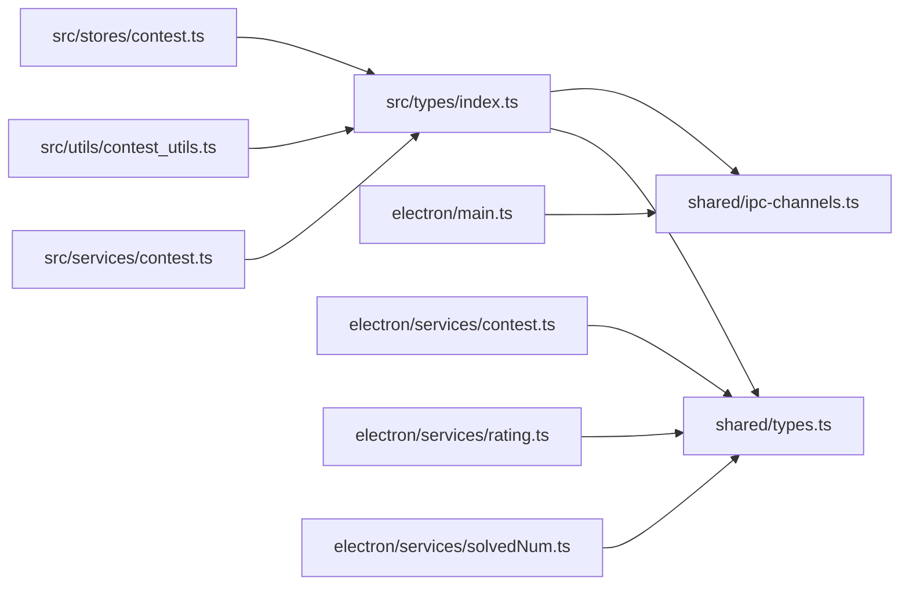

# 类型定义

<cite>
**本文引用的文件**
- [shared/types.ts](file://shared/types.ts)
- [src/types/global.d.ts](file://src/types/global.d.ts)
- [src/types/index.ts](file://src/types/index.ts)
- [shared/store-schema.ts](file://shared/store-schema.ts)
- [src/stores/contest.ts](file://src/stores/contest.ts)
- [src/services/contest.ts](file://src/services/contest.ts)
- [src/utils/contest_utils.ts](file://src/utils/contest_utils.ts)
- [shared/ipc-channels.ts](file://shared/ipc-channels.ts)
- [electron/main.ts](file://electron/main.ts)
- [electron/preload.ts](file://electron/preload.ts)
- [electron/services/contest.ts](file://electron/services/contest.ts)
- [electron/services/rating.ts](file://electron/services/rating.ts)
- [electron/services/solvedNum.ts](file://electron/services/solvedNum.ts)
- [tsconfig.json](file://tsconfig.json)
</cite>

## 目录
1. [简介](#简介)
2. [项目结构](#项目结构)
3. [核心组件](#核心组件)
4. [架构总览](#架构总览)
5. [详细组件分析](#详细组件分析)
6. [依赖分析](#依赖分析)
7. [性能考虑](#性能考虑)
8. [故障排查指南](#故障排查指南)
9. [结论](#结论)
10. [附录](#附录)

## 简介
本文件系统性梳理并解释该仓库中的 TypeScript 类型定义，覆盖接口、类型别名、枚举与泛型，明确字段语义、约束条件与使用场景，并结合数据模型设计思路与业务含义进行说明。文档同时涵盖类型继承关系与组合模式、全局类型声明与模块声明的作用域、类型推断与类型守卫的实践技巧，以及类型安全编程指导与常见错误的解决方案。

## 项目结构
本项目的类型定义主要分布在以下位置：
- 共享层：共享的原始数据与平台标识类型位于 shared/types.ts；用户配置结构位于 shared/store-schema.ts；IPC 通道与参数返回映射位于 shared/ipc-channels.ts。
- 渲染层：全局声明（如 *.vue 模块声明）位于 src/types/global.d.ts；类型导出入口位于 src/types/index.ts；业务状态与服务位于 src/stores、src/services、src/utils。
- 主进程层：Electron 主进程、预加载脚本、服务实现分别位于 electron/main.ts、electron/preload.ts、electron/services/*。

图表来源
- [shared/types.ts:1-67](file://shared/types.ts#L1-L67)
- [shared/store-schema.ts:1-55](file://shared/store-schema.ts#L1-L55)
- [shared/ipc-channels.ts:1-53](file://shared/ipc-channels.ts#L1-L53)
- [src/types/global.d.ts:1-26](file://src/types/global.d.ts#L1-L26)
- [src/types/index.ts:1-10](file://src/types/index.ts#L1-L10)
- [src/stores/contest.ts:1-307](file://src/stores/contest.ts#L1-L307)
- [src/services/contest.ts:1-35](file://src/services/contest.ts#L1-L35)
- [src/utils/contest_utils.ts:1-68](file://src/utils/contest_utils.ts#L1-L68)
- [electron/main.ts:1-493](file://electron/main.ts#L1-L493)
- [electron/preload.ts:1-38](file://electron/preload.ts#L1-L38)
- [electron/services/contest.ts:1-270](file://electron/services/contest.ts#L1-L270)
- [electron/services/rating.ts:1-175](file://electron/services/rating.ts#L1-L175)
- [electron/services/solvedNum.ts:1-198](file://electron/services/solvedNum.ts#L1-L198)

章节来源
- [shared/types.ts:1-67](file://shared/types.ts#L1-L67)
- [shared/store-schema.ts:1-55](file://shared/store-schema.ts#L1-L55)
- [shared/ipc-channels.ts:1-53](file://shared/ipc-channels.ts#L1-L53)
- [src/types/global.d.ts:1-26](file://src/types/global.d.ts#L1-L26)
- [src/types/index.ts:1-10](file://src/types/index.ts#L1-L10)
- [src/stores/contest.ts:1-307](file://src/stores/contest.ts#L1-L307)
- [src/services/contest.ts:1-35](file://src/services/contest.ts#L1-L35)
- [src/utils/contest_utils.ts:1-68](file://src/utils/contest_utils.ts#L1-L68)
- [electron/main.ts:1-493](file://electron/main.ts#L1-L493)
- [electron/preload.ts:1-38](file://electron/preload.ts#L1-L38)
- [electron/services/contest.ts:1-270](file://electron/services/contest.ts#L1-L270)
- [electron/services/rating.ts:1-175](file://electron/services/rating.ts#L1-L175)
- [electron/services/solvedNum.ts:1-198](file://electron/services/solvedNum.ts#L1-L198)

## 核心组件
本节对关键类型进行逐项解析，包括接口、类型别名、平台枚举与泛型。

- 原始竞赛数据 RawContest
  - 字段与约束
    - name: 字符串，竞赛名称
    - startTime: 数字，Unix 时间戳（秒）
    - duration: 数字，秒
    - platform: 字符串，平台标识
    - link?: 可选链接
  - 业务含义
    - 表示从主进程爬取到的原始未格式化竞赛数据，供渲染层进一步格式化展示。
  - 使用示例路径
    - [原始数据接口定义:1-8](file://shared/types.ts#L1-L8)
    - [主进程爬取服务返回 RawContest[]](file://electron/services/contest.ts#L255-L266)

- 格式化竞赛数据 Contest
  - 字段与约束
    - name、startTime、endTime、duration、platform、link?: 同上
    - startDateTimeDay?: Date，起始日期的结束时刻
    - startHourMinute、endHourMinute: 字符串，HH:mm
    - startTimeSeconds、durationSeconds: 数字，秒
    - formattedStartTime、formattedEndTime、formattedDuration: 字符串，用于展示
  - 设计思路
    - 将原始秒级时间转换为可读字符串与日期对象，便于 UI 展示与排序。
  - 使用示例路径
    - [格式化接口定义:10-26](file://shared/types.ts#L10-L26)
    - [格式化工具函数 createContest:4-43](file://src/utils/contest_utils.ts#L4-L43)

- 评分数据 Rating
  - 字段与约束
    - name: 用户名
    - curRating、maxRating: 当前与历史最大分
    - ranking?: 排名（可选）
    - time?: 时间戳（可选）
  - 使用示例路径
    - [评分接口定义:28-34](file://shared/types.ts#L28-L34)
    - [主进程评分服务实现:156-171](file://electron/services/rating.ts#L156-L171)

- 做题数数据 SolvedNum
  - 字段与约束
    - name: 用户名
    - solvedNum: 整数，已解决题目数量
  - 使用示例路径
    - [做题数接口定义:36-39](file://shared/types.ts#L36-L39)
    - [主进程做题数服务实现:166-194](file://electron/services/solvedNum.ts#L166-L194)

- 平台类型别名
  - ContestPlatform
    - 取值范围：'Codeforces' | 'AtCoder' | '力扣' | '洛谷' | '牛客' | '蓝桥云课'
    - 用途：筛选与过滤竞赛来源
    - 使用示例路径：[平台类型定义:42-48](file://shared/types.ts#L42-L48)
  - RatingPlatform
    - 取值范围：'Codeforces' | 'AtCoder' | '力扣' | '洛谷' | '牛客'
    - 使用示例路径：[评分平台类型定义:50-55](file://shared/types.ts#L50-L55)
  - SolvedPlatform
    - 取值范围：'Codeforces' | '力扣' | 'VJudge' | '洛谷' | 'AtCoder' | 'HDU' | 'POJ' | '牛客' | 'QOJ'
    - 使用示例路径：[做题数平台类型定义:57-66](file://shared/types.ts#L57-L66)

- 用户配置 UserConfig
  - 结构要点
    - ui.themeScheme: 'ocean' | 'violet'
    - ui.colorMode: 'auto' | 'light' | 'dark'
    - ui.locale: 'zh-CN' | 'en-US'
    - contest.maxCrawlDays: 数字
    - contest.hideDate: 布尔
    - contest.selectedPlatforms: 记录型平台选择
    - favorites: 竞赛收藏数组，含可选时间与链接
    - usernames: 记录型平台-用户名映射
    - cache: 缓存结构，包含 contests、ratings、solvedNums 及 fetchedAt
    - _migrated?: 内部迁移标记
  - 使用示例路径
    - [用户配置接口定义:1-54](file://shared/store-schema.ts#L1-L54)

- 全局类型声明与模块声明
  - *.vue 模块声明
    - 作用：允许在 TS 中导入 .vue 文件并获得组件类型推断
    - 使用示例路径：[全局模块声明:1-6](file://src/types/global.d.ts#L1-L6)
  - 窗口扩展 Window
    - 包含 api（ElectronApi）与 store（StoreApi），用于渲染进程访问主进程能力
    - 使用示例路径：[窗口扩展声明:22-25](file://src/types/global.d.ts#L22-L25)

- IPC 通道与参数返回映射
  - IPC_CHANNELS：常量集合，包含 GET_CONTESTS、GET_RATING、GET_SOLVED_NUM、OPEN_URL、UPDATER_INSTALL、STORE_* 等
  - IpcHandlerMap：将通道映射到参数与返回类型，确保主进程处理器签名与渲染层调用一致
  - 使用示例路径：
    - [IPC 通道常量:3-14](file://shared/ipc-channels.ts#L3-L14)
    - [IpcHandlerMap 映射:18-52](file://shared/ipc-channels.ts#L18-L52)

章节来源
- [shared/types.ts:1-67](file://shared/types.ts#L1-L67)
- [shared/store-schema.ts:1-55](file://shared/store-schema.ts#L1-L55)
- [src/types/global.d.ts:1-26](file://src/types/global.d.ts#L1-L26)
- [shared/ipc-channels.ts:1-53](file://shared/ipc-channels.ts#L1-L53)

## 架构总览
下图展示了类型在渲染层与主进程之间的流转关系，强调 IPC 通道、服务层与状态层的类型一致性。

图表来源
- [src/services/contest.ts:7-25](file://src/services/contest.ts#L7-L25)
- [src/utils/contest_utils.ts:4-43](file://src/utils/contest_utils.ts#L4-L43)
- [src/stores/contest.ts:63-201](file://src/stores/contest.ts#L63-L201)
- [electron/preload.ts:5-20](file://electron/preload.ts#L5-L20)
- [electron/main.ts:396-412](file://electron/main.ts#L396-L412)
- [electron/services/contest.ts:255-266](file://electron/services/contest.ts#L255-L266)

## 详细组件分析

### 数据模型与组合模式
- 组合关系
  - RawContest 由主进程服务采集，经渲染层服务转换为 Contest，供 Pinia 状态管理使用。
  - Rating 与 SolvedNum 通过主进程服务按平台聚合，供 UI 展示。
- 设计要点
  - 将“原始数据”与“展示数据”分离，提升可维护性与可测试性。
  - 平台类型别名统一约束输入范围，避免魔法字符串。

图表来源
- [shared/types.ts:1-8](file://shared/types.ts#L1-L8)
- [shared/types.ts:10-26](file://shared/types.ts#L10-L26)
- [shared/types.ts:28-39](file://shared/types.ts#L28-L39)
- [src/utils/contest_utils.ts:4-43](file://src/utils/contest_utils.ts#L4-L43)

章节来源
- [shared/types.ts:1-67](file://shared/types.ts#L1-L67)
- [src/utils/contest_utils.ts:1-68](file://src/utils/contest_utils.ts#L1-L68)

### 状态管理与持久化（Pinia Store）
- 状态结构
  - ContestState：包含 contests、loading、day、showEmptyDay、selectedPlatforms、favorites、hideDate、initialized。
- 关键逻辑
  - timeContests：按天分组并按开始时间排序。
  - init：从 Electron Store 或本地存储加载配置与收藏。
  - 持久化：setMaxCrawlDays、toggleHideDate、persistFavorites 等均同步到本地存储与 Electron Store。
- 类型约束
  - selectedPlatforms 使用 Record<string, boolean>，平台键来自固定数组。
  - favorites 使用 Contest[]，保证收藏列表元素类型一致。

图表来源
- [src/stores/contest.ts:63-140](file://src/stores/contest.ts#L63-L140)

章节来源
- [src/stores/contest.ts:1-307](file://src/stores/contest.ts#L1-L307)

### IPC 通道与类型安全
- 渲染层调用
  - 通过 window.api.* 发起 IPC 请求，参数与返回类型由 IpcHandlerMap 约束。
- 主进程处理器
  - 对参数进行严格校验（类型、长度、协议等），异常时抛出错误。
- 预加载桥接
  - 仅暴露白名单 API，避免直接暴露 ipcRenderer。

图表来源
- [shared/ipc-channels.ts:18-52](file://shared/ipc-channels.ts#L18-L52)
- [electron/preload.ts:5-20](file://electron/preload.ts#L5-L20)
- [electron/main.ts:414-431](file://electron/main.ts#L414-L431)
- [electron/services/rating.ts:156-171](file://electron/services/rating.ts#L156-L171)

章节来源
- [shared/ipc-channels.ts:1-53](file://shared/ipc-channels.ts#L1-L53)
- [electron/preload.ts:1-38](file://electron/preload.ts#L1-L38)
- [electron/main.ts:396-466](file://electron/main.ts#L396-L466)
- [electron/services/rating.ts:1-175](file://electron/services/rating.ts#L1-L175)

### 类型守卫与类型推断
- 类型守卫
  - isThemeScheme、isColorMode：用于验证主题方案与颜色模式是否属于受支持的联合类型。
  - 使用示例路径：[类型守卫定义:7-13](file://src/stores/ui.ts#L7-L13)
- 类型推断
  - 在 Electron Store 读取配置时，通过类型断言与守卫确保赋值安全。
  - 使用示例路径：[UI Store 初始化与守卫:26-48](file://src/stores/ui.ts#L26-L48)

章节来源
- [src/stores/ui.ts:1-96](file://src/stores/ui.ts#L1-L96)

## 依赖分析
- 模块依赖
  - 渲染层通过 src/types/index.ts 导出共享类型，避免重复导入。
  - 主进程服务依赖 shared/types.ts 的 RawContest 与 shared/ipc-channels.ts 的通道映射。
- 类型耦合
  - Contest 与 RawContest 的转换由 utils/contest_utils.ts 单一职责负责，降低耦合度。
- 循环依赖
  - 未发现循环依赖迹象；各层职责清晰，类型边界明确。

图表来源
- [src/types/index.ts:1-9](file://src/types/index.ts#L1-L9)
- [shared/types.ts:1-67](file://shared/types.ts#L1-L67)
- [shared/ipc-channels.ts:1-53](file://shared/ipc-channels.ts#L1-L53)
- [src/services/contest.ts:1-35](file://src/services/contest.ts#L1-L35)
- [src/utils/contest_utils.ts:1-68](file://src/utils/contest_utils.ts#L1-L68)
- [src/stores/contest.ts:1-307](file://src/stores/contest.ts#L1-L307)
- [electron/main.ts:1-493](file://electron/main.ts#L1-L493)
- [electron/services/contest.ts:1-270](file://electron/services/contest.ts#L1-L270)
- [electron/services/rating.ts:1-175](file://electron/services/rating.ts#L1-L175)
- [electron/services/solvedNum.ts:1-198](file://electron/services/solvedNum.ts#L1-L198)

章节来源
- [src/types/index.ts:1-10](file://src/types/index.ts#L1-L10)
- [shared/types.ts:1-67](file://shared/types.ts#L1-L67)
- [shared/ipc-channels.ts:1-53](file://shared/ipc-channels.ts#L1-L53)
- [src/services/contest.ts:1-35](file://src/services/contest.ts#L1-L35)
- [src/utils/contest_utils.ts:1-68](file://src/utils/contest_utils.ts#L1-L68)
- [src/stores/contest.ts:1-307](file://src/stores/contest.ts#L1-L307)
- [electron/main.ts:1-493](file://electron/main.ts#L1-L493)
- [electron/services/contest.ts:1-270](file://electron/services/contest.ts#L1-L270)
- [electron/services/rating.ts:1-175](file://electron/services/rating.ts#L1-L175)
- [electron/services/solvedNum.ts:1-198](file://electron/services/solvedNum.ts#L1-L198)

## 性能考虑
- 类型层面的性能优化建议
  - 使用只读类型（如 readonly 字段）减少不必要的状态变更。
  - 对高频计算（如时间格式化）采用缓存策略，避免重复计算。
  - 在服务层对网络请求结果进行结构化缓存，结合 fetchedAt 控制过期策略。
- 运行时性能
  - IPC 调用应批量处理，减少往返次数。
  - 对大列表渲染采用虚拟滚动或分页策略。

## 故障排查指南
- 常见类型错误
  - 未正确导入共享类型：检查 src/types/index.ts 是否导出所需类型。
  - IPC 参数类型不匹配：核对 shared/ipc-channels.ts 的 IpcHandlerMap 与主进程处理器签名。
  - 平台字符串不合法：确认平台类型别名取值范围，避免运行时错误。
- 错误定位
  - Electron Store 读取失败：查看 src/stores/contest.ts 与 src/stores/ui.ts 的初始化流程。
  - 网络请求异常：检查 electron/main.ts 中的参数校验与错误分类逻辑。
- 解决方案
  - 引入类型守卫与运行时校验，确保数据在进入业务逻辑前符合预期。
  - 对未知字段使用 unknown 并进行显式断言与防御性编程。

章节来源
- [src/stores/contest.ts:102-140](file://src/stores/contest.ts#L102-L140)
- [src/stores/ui.ts:26-48](file://src/stores/ui.ts#L26-L48)
- [electron/main.ts:414-458](file://electron/main.ts#L414-L458)

## 结论
本项目通过清晰的类型分层与严格的 IPC 类型映射，实现了前后端类型安全的协作。共享层定义了稳定的接口与平台枚举，渲染层通过工具类完成数据转换，主进程服务负责外部数据聚合与校验。配合类型守卫与运行时校验，整体具备良好的可维护性与可扩展性。

## 附录
- 全局类型声明与模块声明的作用域
  - *.vue 模块声明仅影响当前项目编译环境，不影响运行时行为。
  - Window 扩展声明使渲染进程能够访问主进程提供的 API，需与预加载桥接配合使用。
- 类型推断与类型守卫的使用技巧
  - 利用联合类型与字面量类型限定输入范围，结合类型守卫进行运行时校验。
  - 在复杂对象中优先使用索引签名与 Record 类型，保持键值对结构的一致性。

章节来源
- [src/types/global.d.ts:1-26](file://src/types/global.d.ts#L1-L26)
- [tsconfig.json:1-26](file://tsconfig.json#L1-L26)