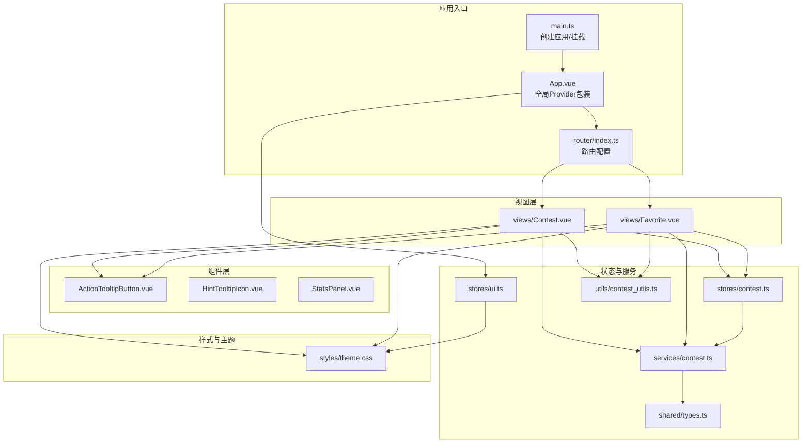
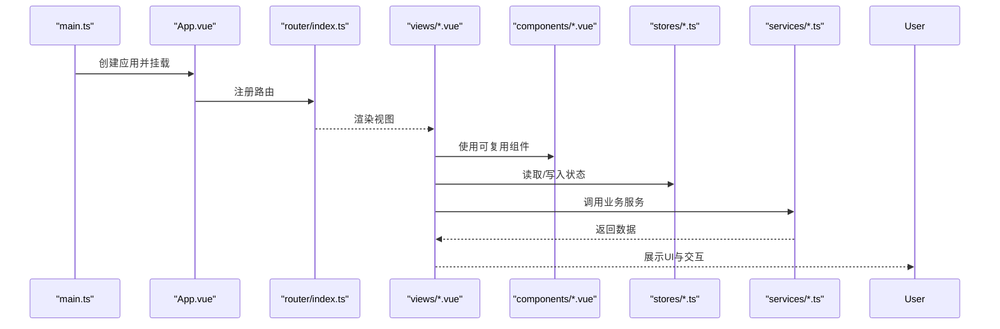
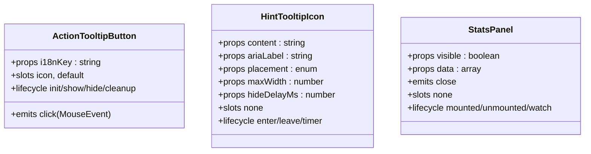
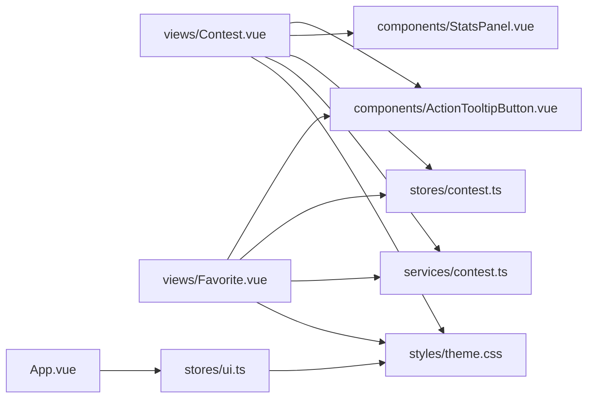

# 组件API

<cite>
**本文引用的文件**
- [ActionTooltipButton.vue](file://src/components/ActionTooltipButton.vue)
- [HintTooltipIcon.vue](file://src/components/HintTooltipIcon.vue)
- [StatsPanel.vue](file://src/components/StatsPanel.vue)
- [App.vue](file://src/App.vue)
- [main.ts](file://src/main.ts)
- [ui.ts](file://src/stores/ui.ts)
- [contest.ts](file://src/stores/contest.ts)
- [theme.css](file://src/styles/theme.css)
- [index.ts](file://src/router/index.ts)
- [Contest.vue](file://src/views/Contest.vue)
- [Favorite.vue](file://src/views/Favorite.vue)
- [contest.ts](file://src/services/contest.ts)
- [contest_utils.ts](file://src/utils/contest_utils.ts)
- [types.ts](file://shared/types.ts)
- [package.json](file://package.json)
</cite>

## 目录
1. [简介](#简介)
2. [项目结构](#项目结构)
3. [核心组件](#核心组件)
4. [架构总览](#架构总览)
5. [组件详细分析](#组件详细分析)
6. [依赖关系分析](#依赖关系分析)
7. [性能考量](#性能考量)
8. [故障排查指南](#故障排查指南)
9. [结论](#结论)
10. [附录](#附录)

## 简介
本文件系统性梳理项目中的可复用Vue组件，面向开发者与产品/设计人员，提供组件API规范、属性与事件、插槽与方法、生命周期与状态管理、组件间通信与数据流、样式覆盖与主题适配、响应式与无障碍支持，以及性能优化与最佳实践建议。目标是帮助读者快速理解并正确使用组件，同时在保持一致性的前提下进行定制化扩展。

## 项目结构
项目采用基于功能域的组织方式，核心组件位于 src/components，页面视图位于 src/views，状态管理位于 src/stores，样式主题位于 src/styles，路由位于 src/router，类型定义位于 shared/types 与 src/types。

**图表来源**
- [main.ts:1-26](file://src/main.ts#L1-L26)
- [App.vue:1-23](file://src/App.vue#L1-L23)
- [index.ts:1-48](file://src/router/index.ts#L1-L48)
- [Contest.vue:1-800](file://src/views/Contest.vue#L1-L800)
- [Favorite.vue:1-689](file://src/views/Favorite.vue#L1-L689)
- [ActionTooltipButton.vue:1-135](file://src/components/ActionTooltipButton.vue#L1-L135)
- [HintTooltipIcon.vue:1-114](file://src/components/HintTooltipIcon.vue#L1-L114)
- [StatsPanel.vue:1-293](file://src/components/StatsPanel.vue#L1-L293)
- [ui.ts:1-96](file://src/stores/ui.ts#L1-L96)
- [contest.ts:1-307](file://src/stores/contest.ts#L1-L307)
- [contest.ts:1-35](file://src/services/contest.ts#L1-L35)
- [contest_utils.ts:1-68](file://src/utils/contest_utils.ts#L1-L68)
- [theme.css:1-315](file://src/styles/theme.css#L1-L315)
- [types.ts:1-67](file://shared/types.ts#L1-L67)

**章节来源**
- [main.ts:1-26](file://src/main.ts#L1-L26)
- [App.vue:1-23](file://src/App.vue#L1-L23)
- [index.ts:1-48](file://src/router/index.ts#L1-L48)

## 核心组件
本节对三个可复用组件进行API级说明：ActionTooltipButton、HintTooltipIcon、StatsPanel。每个组件均提供属性、事件、插槽、方法（若有）、生命周期要点、状态管理交互、无障碍与响应式特性，以及样式覆盖与主题适配建议。

**章节来源**
- [ActionTooltipButton.vue:1-135](file://src/components/ActionTooltipButton.vue#L1-L135)
- [HintTooltipIcon.vue:1-114](file://src/components/HintTooltipIcon.vue#L1-L114)
- [StatsPanel.vue:1-293](file://src/components/StatsPanel.vue#L1-L293)

## 架构总览
应用启动流程与组件间数据流如下：

**图表来源**
- [main.ts:1-26](file://src/main.ts#L1-L26)
- [App.vue:1-23](file://src/App.vue#L1-L23)
- [index.ts:1-48](file://src/router/index.ts#L1-L48)
- [Contest.vue:1-800](file://src/views/Contest.vue#L1-L800)
- [Favorite.vue:1-689](file://src/views/Favorite.vue#L1-L689)
- [contest.ts:1-307](file://src/stores/contest.ts#L1-L307)
- [contest.ts:1-35](file://src/services/contest.ts#L1-L35)

## 组件详细分析

### ActionTooltipButton 组件
- 组件定位：带延迟显示/隐藏与长按提示的按钮封装，统一处理鼠标/指针/键盘事件，自动国际化标签。
- 属性
  - i18nKey: string（必填）；用于生成按钮的 aria-label 与 Tooltip 文案。
- 事件
  - click(MouseEvent)：透传原生点击事件；若发生长按则阻止默认与冒泡。
- 插槽
  - icon：图标内容插槽；默认插槽承载按钮文本。
- 方法
  - 无公开实例方法；内部通过组合式API管理显示状态与计时器。
- 生命周期与状态
  - 初始化：从应用配置读取延迟与长按阈值；计算国际化标签；收集除自身事件外的原生属性透传给底层按钮。
  - 显示控制：mouseenter/focus 触发延时显示；mouseleave/blur 触发延时隐藏；pointerdown 设置长按标志；pointerup/pointerleave 在长按时触发隐藏。
  - 销毁清理：组件卸载或取消交互时清除计时器，避免内存泄漏。
- 无障碍与响应式
  - 自动设置 aria-label；支持键盘焦点；在移动端通过指针事件模拟长按。
- 样式与主题
  - 通过透传原生属性与Naive UI按钮能力，结合全局CSS变量实现主题一致性。
- 使用示例
  - 在视图中以具名插槽注入图标与文案，并绑定点击事件。

**章节来源**
- [ActionTooltipButton.vue:1-135](file://src/components/ActionTooltipButton.vue#L1-L135)
- [Contest.vue:10-20](file://src/views/Contest.vue#L10-L20)
- [Favorite.vue:16-36](file://src/views/Favorite.vue#L16-L36)

### HintTooltipIcon 组件
- 组件定位：信息提示图标，手动控制显示/隐藏，支持自定义放置位置、最大宽度与隐藏延迟。
- 属性
  - content: string（必填）；提示内容。
  - ariaLabel: string（必填）；无障碍标签。
  - placement?: 'top' | ...（可选，默认 bottom）
  - maxWidth?: number（可选，默认 240）
  - hideDelayMs?: number（可选，默认 200）
- 事件
  - 无公开事件。
- 插槽
  - 无插槽。
- 方法
  - 无公开实例方法。
- 生命周期与状态
  - 初始化：设置初始隐藏状态；在鼠标进入时立即显示，在离开时按配置延迟隐藏。
- 无障碍与响应式
  - 内部容器具备 role="button" 与 tabindex=0，支持键盘激活；SVG 图标语义化。
- 样式与主题
  - 内置基础样式与聚焦态高亮；颜色与尺寸由CSS变量控制，便于主题切换。
- 使用示例
  - 在表单或卡片中作为辅助信息入口，配合 placement 与 maxWidth 调整布局。

**章节来源**
- [HintTooltipIcon.vue:1-114](file://src/components/HintTooltipIcon.vue#L1-L114)

### StatsPanel 组件
- 组件定位：数据统计面板，支持饼图/柱状图切换、移动端自适应、总解题数展示与关闭事件。
- 属性
  - visible: boolean（必填）；控制面板显隐与图表初始化时机。
  - data: { platform: string; count: number }[]（必填）；用于渲染图表的数据源。
- 事件
  - close：无参数；当用户点击右上角关闭按钮时触发。
- 插槽
  - 无插槽。
- 方法
  - 无公开实例方法。
- 生命周期与状态
  - 初始化：检查是否移动端；在可见且DOM就绪后初始化 ECharts 实例并更新图表。
  - 更新：监听 data 与 visible 的变化，必要时重绘图表。
  - 销毁：移除窗口 resize 监听并释放 ECharts 实例。
- 无障碍与响应式
  - 面板绝对定位，移动端转为相对布局并移除阴影；图表容器自适应。
- 样式与主题
  - 使用 CSS 变量获取主题色与边框色；图表颜色来自 CSS 变量数组；支持浅/深色与方案切换。
- 使用示例
  - 在视图中根据数据源动态渲染，并在关闭时回调处理。

**章节来源**
- [StatsPanel.vue:1-293](file://src/components/StatsPanel.vue#L1-L293)

### 组件类关系图（代码级）

**图表来源**
- [ActionTooltipButton.vue:1-135](file://src/components/ActionTooltipButton.vue#L1-L135)
- [HintTooltipIcon.vue:1-114](file://src/components/HintTooltipIcon.vue#L1-L114)
- [StatsPanel.vue:1-293](file://src/components/StatsPanel.vue#L1-L293)

## 依赖关系分析
- 组件依赖
  - ActionTooltipButton 依赖 Naive UI Tooltip/Button 与国际化工具；通过 app.config.json 提供延迟与长按阈值。
  - HintTooltipIcon 依赖 Naive UI Tooltip；样式内联 SVG。
  - StatsPanel 依赖 ECharts；使用 CSS 变量与窗口 resize 事件。
- 视图与组件
  - Contest.vue 与 Favorite.vue 均使用 ActionTooltipButton；Contest.vue 使用 StatsPanel。
- 状态与服务
  - Contest.vue 与 Favorite.vue 通过 Pinia Store 访问全局状态；调用服务层接口获取数据与打开链接。
- 主题与样式
  - App.vue 在根节点包裹 Provider；ui.ts 将主题方案与颜色模式写入 documentElement 的 dataset；theme.css 定义 CSS 变量与媒体查询。

**图表来源**
- [Contest.vue:1-800](file://src/views/Contest.vue#L1-L800)
- [Favorite.vue:1-689](file://src/views/Favorite.vue#L1-L689)
- [ActionTooltipButton.vue:1-135](file://src/components/ActionTooltipButton.vue#L1-L135)
- [StatsPanel.vue:1-293](file://src/components/StatsPanel.vue#L1-L293)
- [ui.ts:1-96](file://src/stores/ui.ts#L1-L96)
- [contest.ts:1-307](file://src/stores/contest.ts#L1-L307)
- [contest.ts:1-35](file://src/services/contest.ts#L1-L35)
- [theme.css:1-315](file://src/styles/theme.css#L1-L315)

**章节来源**
- [ui.ts:1-96](file://src/stores/ui.ts#L1-L96)
- [theme.css:1-315](file://src/styles/theme.css#L1-L315)

## 性能考量
- 组件性能
  - ActionTooltipButton：使用计时器控制显示/隐藏，避免频繁重绘；长按逻辑仅在指针按下后短时间判断，降低不必要渲染。
  - HintTooltipIcon：仅在鼠标进入时设置显示，离开时延时隐藏，减少不必要的DOM操作。
  - StatsPanel：在可见且数据存在时才初始化 ECharts；监听数据变化时使用深比较；窗口 resize 时按需重绘。
- 应用性能
  - main.ts 中应用挂载后异步迁移本地存储并初始化 Store，避免阻塞首屏渲染。
  - 路由采用哈希历史，减少服务器端配置开销。
- 最佳实践
  - 对于高频交互组件（如按钮、提示），优先使用组合式API与细粒度状态，避免不必要的响应式对象。
  - 图表类组件应延迟初始化并在不可见时释放资源，减少内存占用。
  - 使用 CSS 变量与媒体查询实现主题与响应式，避免重复计算与样式抖动。

[本节为通用指导，无需特定文件引用]

## 故障排查指南
- Tooltip 不显示或闪烁
  - 检查 i18nKey 是否正确；确认 app.config.json 中 tooltip 配置是否存在；验证鼠标/指针事件是否被其他元素拦截。
- 长按无效
  - 确认 pointerdown/pointerup/pointerleave 事件链路是否完整；检查长按阈值是否过短导致误判。
- 图表不渲染或空白
  - 确认 data 非空且结构正确；检查 visible 为 true 且 DOM 已就绪；查看 ECharts 初始化是否成功。
- 主题不生效
  - 检查 ui.ts 是否正确将主题方案与颜色模式写入 documentElement 的 dataset；确认 theme.css 是否加载。
- 路由跳转异常
  - 检查 router/index.ts 中路由映射与导航路径；确认父路由与子路由层级关系。

**章节来源**
- [ActionTooltipButton.vue:62-133](file://src/components/ActionTooltipButton.vue#L62-L133)
- [StatsPanel.vue:64-214](file://src/components/StatsPanel.vue#L64-L214)
- [ui.ts:53-59](file://src/stores/ui.ts#L53-L59)
- [index.ts:16-40](file://src/router/index.ts#L16-L40)

## 结论
本项目通过可复用组件与清晰的状态/服务分层，实现了良好的可维护性与可扩展性。ActionTooltipButton、HintTooltipIcon、StatsPanel 三者分别覆盖了交互提示、信息提示与数据可视化场景，配合 Pinia Store 与服务层，形成从数据到视图的稳定闭环。遵循本文档的API规范、样式覆盖与主题适配建议，可在保证一致性的同时灵活满足定制需求。

[本节为总结，无需特定文件引用]

## 附录

### 组件API速查表
- ActionTooltipButton
  - 属性: i18nKey
  - 事件: click
  - 插槽: icon, 默认
  - 生命周期: 初始化/显示/隐藏/清理
- HintTooltipIcon
  - 属性: content, ariaLabel, placement, maxWidth, hideDelayMs
  - 事件: 无
  - 插槽: 无
  - 生命周期: 进入/离开/定时器
- StatsPanel
  - 属性: visible, data
  - 事件: close
  - 插槽: 无
  - 生命周期: 挂载/卸载/监听

**章节来源**
- [ActionTooltipButton.vue:35-41](file://src/components/ActionTooltipButton.vue#L35-L41)
- [HintTooltipIcon.vue:35-48](file://src/components/HintTooltipIcon.vue#L35-L48)
- [StatsPanel.vue:36-41](file://src/components/StatsPanel.vue#L36-L41)

### 主题与样式覆盖指南
- 主题变量
  - 通过 CSS 变量集中管理颜色、阴影、圆角、字体与间距等；在不同颜色模式与主题方案下切换。
- 覆盖策略
  - 在组件样式中优先使用 CSS 变量，避免硬编码颜色与尺寸。
  - 通过 documentElement 的 dataset 控制主题方案与颜色模式，确保全局一致性。
- 响应式与无障碍
  - 使用媒体查询适配移动端；为交互元素提供键盘可达性与焦点样式；为图标与按钮提供语义化标签。

**章节来源**
- [theme.css:1-315](file://src/styles/theme.css#L1-L315)
- [ui.ts:53-59](file://src/stores/ui.ts#L53-L59)

### 组件间通信与数据流
- 视图到组件
  - 通过属性传递数据与行为；通过事件回传用户操作。
- 视图到状态
  - 通过 Pinia Store 管理全局状态；视图在挂载时初始化 Store 并在交互中更新。
- 视图到服务
  - 通过服务层封装网络请求与系统交互；返回 Promise 以便视图处理加载与错误。
- 类型安全
  - 使用共享类型定义确保前后端数据结构一致。

**章节来源**
- [Contest.vue:344-653](file://src/views/Contest.vue#L344-L653)
- [Favorite.vue:147-353](file://src/views/Favorite.vue#L147-L353)
- [contest.ts:1-307](file://src/stores/contest.ts#L1-L307)
- [contest.ts:1-35](file://src/services/contest.ts#L1-L35)
- [types.ts:1-67](file://shared/types.ts#L1-L67)

### 开发与构建信息
- 包管理与脚本
  - 使用 Bun 作为运行时与包管理；Vite 提供开发与构建；Electron 打包桌面应用。
- 依赖
  - Vue 3、Naive UI、ECharts、Pinia、Vue Router 等。

**章节来源**
- [package.json:1-127](file://package.json#L1-L127)