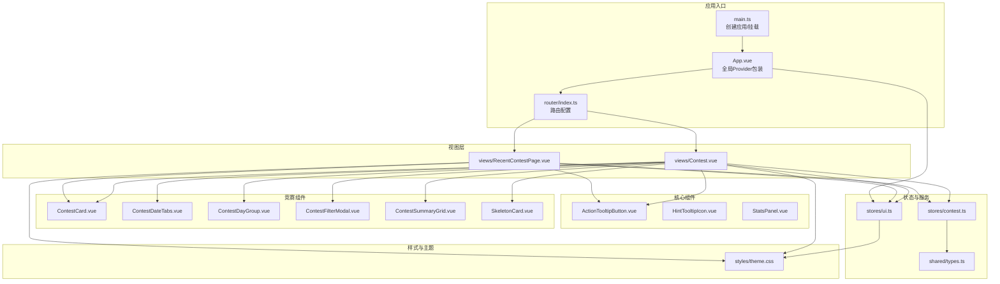
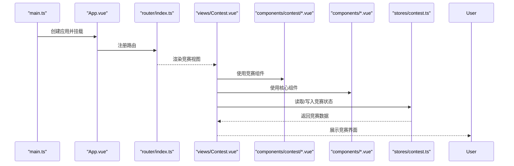
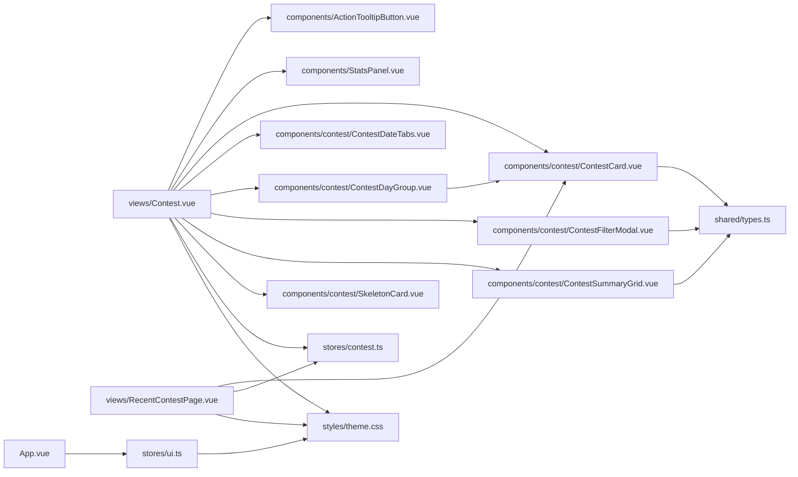

# 组件API

<cite>
**本文引用的文件**
- [ActionTooltipButton.vue](file://src/components/ActionTooltipButton.vue)
- [HintTooltipIcon.vue](file://src/components/HintTooltipIcon.vue)
- [StatsPanel.vue](file://src/components/StatsPanel.vue)
- [ContestCard.vue](file://src/components/contest/ContestCard.vue)
- [ContestDateTabs.vue](file://src/components/contest/ContestDateTabs.vue)
- [ContestDayGroup.vue](file://src/components/contest/ContestDayGroup.vue)
- [ContestFilterModal.vue](file://src/components/contest/ContestFilterModal.vue)
- [ContestSummaryGrid.vue](file://src/components/contest/ContestSummaryGrid.vue)
- [SkeletonCard.vue](file://src/components/contest/SkeletonCard.vue)
- [Contest.vue](file://src/views/Contest.vue)
- [RecentContestPage.vue](file://src/views/RecentContestPage.vue)
- [contest.ts](file://src/stores/contest.ts)
- [types.ts](file://shared/types.ts)
- [main.ts](file://src/main.ts)
- [App.vue](file://src/App.vue)
- [ui.ts](file://src/stores/ui.ts)
- [index.ts](file://src/router/index.ts)
- [theme.css](file://src/styles/theme.css)
- [package.json](file://package.json)
</cite>

## 更新摘要
**所做更改**
- 新增竞赛相关组件API文档：ContestCard、ContestDateTabs、ContestDayGroup、ContestFilterModal、ContestSummaryGrid、SkeletonCard
- 更新核心组件分析以包含竞赛组件的使用场景
- 增强组件间通信与数据流说明，涵盖竞赛组件的集成模式
- 扩展样式覆盖与主题适配指南，包含竞赛组件的定制化方案
- 更新架构总览图，反映竞赛组件在整体架构中的位置

## 目录
1. [简介](#简介)
2. [项目结构](#项目结构)
3. [核心组件](#核心组件)
4. [竞赛组件](#竞赛组件)
5. [架构总览](#架构总览)
6. [组件详细分析](#组件详细分析)
7. [依赖关系分析](#依赖关系分析)
8. [性能考量](#性能考量)
9. [故障排查指南](#故障排查指南)
10. [结论](#结论)
11. [附录](#附录)

## 简介
本文件系统性梳理项目中的可复用Vue组件，面向开发者与产品/设计人员，提供组件API规范、属性与事件、插槽与方法、生命周期与状态管理、组件间通信与数据流、样式覆盖与主题适配、响应式与无障碍支持，以及性能优化与最佳实践建议。目标是帮助读者快速理解并正确使用组件，同时在保持一致性的前提下进行定制化扩展。

**更新** 新增竞赛相关组件的详细API文档，涵盖现代UI设计模式和完整的功能实现。

## 项目结构
项目采用基于功能域的组织方式，核心组件位于 src/components，竞赛专用组件位于 src/components/contest，页面视图位于 src/views，状态管理位于 src/stores，样式主题位于 src/styles，路由位于 src/router，类型定义位于 shared/types 与 src/types。

**图表来源**
- [main.ts:1-26](file://src/main.ts#L1-L26)
- [App.vue:1-23](file://src/App.vue#L1-L23)
- [index.ts:1-48](file://src/router/index.ts#L1-L48)
- [Contest.vue:1-412](file://src/views/Contest.vue#L1-L412)
- [RecentContestPage.vue:1-324](file://src/views/RecentContestPage.vue#L1-L324)
- [ActionTooltipButton.vue:1-135](file://src/components/ActionTooltipButton.vue#L1-L135)
- [ContestCard.vue:1-173](file://src/components/contest/ContestCard.vue#L1-L173)
- [ContestDateTabs.vue:1-124](file://src/components/contest/ContestDateTabs.vue#L1-L124)
- [ContestDayGroup.vue:1-214](file://src/components/contest/ContestDayGroup.vue#L1-L214)
- [ContestFilterModal.vue:1-99](file://src/components/contest/ContestFilterModal.vue#L1-L99)
- [ContestSummaryGrid.vue:1-297](file://src/components/contest/ContestSummaryGrid.vue#L1-L297)
- [SkeletonCard.vue:1-88](file://src/components/contest/SkeletonCard.vue#L1-L88)
- [ui.ts:1-96](file://src/stores/ui.ts#L1-L96)
- [contest.ts:1-337](file://src/stores/contest.ts#L1-L337)
- [theme.css:1-315](file://src/styles/theme.css#L1-L315)

**章节来源**
- [main.ts:1-26](file://src/main.ts#L1-L26)
- [App.vue:1-23](file://src/App.vue#L1-L23)
- [index.ts:1-48](file://src/router/index.ts#L1-L48)

## 核心组件
本节对三个可复用组件进行API级说明：ActionTooltipButton、HintTooltipIcon、StatsPanel。每个组件均提供属性、事件、插槽、方法（若有）、生命周期要点、状态管理交互、无障碍与响应式特性，以及样式覆盖与主题适配建议。

**章节来源**
- [ActionTooltipButton.vue:1-135](file://src/components/ActionTooltipButton.vue#L1-L135)
- [HintTooltipIcon.vue:1-114](file://src/components/HintTooltipIcon.vue#L1-L114)
- [StatsPanel.vue:1-293](file://src/components/StatsPanel.vue#L1-L293)

## 竞赛组件
本节详细介绍新增的竞赛相关组件，这些组件构成了现代化的竞赛管理系统UI框架，提供完整的竞赛信息展示、筛选、分组和交互功能。

### ContestCard 组件
- 组件定位：竞赛卡片组件，展示单个竞赛的详细信息，包含平台图标、名称、时间、状态标签和操作按钮。
- 属性
  - contest: Contest（必填）；竞赛数据对象，包含名称、开始时间、持续时间、平台等信息。
  - now: number（必填）；当前时间戳，用于计算竞赛状态和倒计时。
  - isFavorite: boolean（必填）；是否为收藏状态。
  - platformImage: string（必填）；平台对应图片URL。
- 事件
  - open(contest: Contest)：点击卡片或按钮时触发，用于打开竞赛详情或链接。
  - toggle-favorite(contest: Contest)：点击收藏按钮时触发，用于切换收藏状态。
- 插槽
  - 无插槽。
- 方法
  - 无公开实例方法。
- 生命周期与状态
  - 状态计算：根据当前时间与竞赛开始/结束时间计算竞赛状态（upcoming/running/ended）。
  - 倒计时计算：计算距离竞赛开始的剩余时间，超过24小时或已开始时不显示倒计时。
  - 样式动态：根据竞赛状态动态应用不同的样式类和颜色。
- 无障碍与响应式
  - 支持键盘操作（Enter/Space键触发open事件）。
  - 使用role="button"和tabindex确保键盘可达性。
  - 移动端自适应布局。
- 样式与主题
  - 使用CSS变量实现主题一致性。
  - 不同状态使用不同颜色标识：即将到来（蓝色）、进行中（绿色）、已结束（灰色）。
  - 支持动画效果和悬停状态。

**章节来源**
- [ContestCard.vue:1-173](file://src/components/contest/ContestCard.vue#L1-L173)

### ContestDateTabs 组件
- 组件定位：日期筛选标签组件，提供今日、明日、本周、全部四个筛选选项。
- 属性
  - modelValue: string（必填）；当前选中的筛选值。
- 事件
  - update:modelValue(value: string)：当用户选择不同日期标签时触发，更新筛选条件。
- 插槽
  - 无插槽。
- 方法
  - 无公开实例方法。
- 生命周期与状态
  - 固定标签集：包含预定义的四个标签（today、tomorrow、thisWeek、all）。
  - 悬停效果：鼠标悬停时显示高亮背景和颜色。
  - 激活状态：当前选中标签显示特殊样式和动画效果。
- 无障碍与响应式
  - 支持键盘导航和屏幕阅读器。
  - 移动端标签自动换行。
  - 减少运动偏好支持，提供简化动画。
- 样式与主题
  - 使用CSS变量控制颜色和过渡效果。
  - 支持悬停、激活状态的不同视觉表现。
  - 响应式字体大小调整。

**章节来源**
- [ContestDateTabs.vue:1-124](file://src/components/contest/ContestDateTabs.vue#L1-L124)

### ContestDayGroup 组件
- 组件定位：日期分组容器组件，用于组织和展示特定日期范围内的竞赛列表，支持折叠展开功能。
- 属性
  - title: string（必填）；分组标题。
  - contests: Contest[]（必填）；该分组内的竞赛数组。
  - now: number（必填）；当前时间戳。
  - selectedPlatforms: Record<string, boolean>（必填）；平台筛选状态。
  - isFavorite: (name: string) => boolean（必填）；收藏状态判断函数。
  - getPlatformImage: (platform: string) => string（必填）；平台图片获取函数。
  - variant?: 'today' | 'tomorrow' | 'future' | 'history'（可选）；分组变体类型。
  - collapsible?: boolean（可选）；是否支持折叠。
  - expanded?: boolean（可选）；默认展开状态。
- 事件
  - toggle：当用户点击折叠头时触发。
  - open-contest(contest: Contest)：当用户选择某个竞赛时触发。
  - toggle-favorite(contest: Contest)：当用户切换竞赛收藏状态时触发。
- 插槽
  - 无插槽。
- 方法
  - 无公开实例方法。
- 生命周期与状态
  - 可折叠设计：未来日期和历史记录支持折叠展开。
  - 可见性计算：根据平台筛选状态动态计算可见竞赛数量。
  - 响应式布局：根据设备类型调整显示方式。
- 无障碍与响应式
  - 折叠头支持键盘操作。
  - 展开/收起动画提供视觉反馈。
  - 移动端优化的触摸交互。
- 样式与主题
  - 卡片式设计，支持渐变边框和阴影效果。
  - 历史记录分组使用淡色调。
  - 悬停时的提升效果和阴影变化。

**章节来源**
- [ContestDayGroup.vue:1-214](file://src/components/contest/ContestDayGroup.vue#L1-L214)

### ContestFilterModal 组件
- 组件定位：竞赛筛选模态框，提供平台筛选和显示设置功能。
- 属性
  - show: boolean（必填）；模态框显示状态。
  - showEmptyDay: boolean（必填）；是否显示无赛程日。
  - selectedPlatforms: Record<string, boolean>（必填）；平台筛选状态。
  - platforms: string[]（必填）；可用平台列表。
- 事件
  - update:show(value: boolean)：模态框显示状态变化时触发。
  - update:showEmptyDay(value: boolean)：显示无赛程日设置变化时触发。
  - toggle-platform(platform: string, value: boolean)：平台筛选状态变化时触发。
- 插槽
  - 无插槽。
- 方法
  - 无公开实例方法。
- 生命周期与状态
  - 双向绑定：使用computed getter/setter实现v-model功能。
  - 动态内容：根据平台列表动态生成筛选项。
  - 状态同步：与父组件的筛选状态保持同步。
- 无障碍与响应式
  - 模态框具有适当的焦点管理和键盘导航。
  - 分割线提供视觉分隔。
  - 响应式布局适配不同屏幕尺寸。
- 样式与主题
  - 使用Naive UI对话框样式。
  - 复选框和开关按钮的主题色统一。
  - 深色模式下的对比度优化。

**章节来源**
- [ContestFilterModal.vue:1-99](file://src/components/contest/ContestFilterModal.vue#L1-L99)

### ContestSummaryGrid 组件
- 组件定位：竞赛概览网格组件，展示竞赛统计信息、下一场竞赛和平台覆盖情况。
- 属性
  - visibleCount: number（必填）；可见竞赛数量。
  - favoriteCount: number（必填）；收藏竞赛数量。
  - runningCount: number（必填）；进行中竞赛数量。
  - nextContest: Contest | null（必填）；下一场竞赛信息。
  - platformsWithCount: { name: string; count: number }[]（必填）；平台及其竞赛数量。
- 事件
  - 无公开事件。
- 插槽
  - 无插槽。
- 方法
  - 无公开实例方法。
- 生命周期与状态
  - 响应式网格：使用CSS Grid实现自适应布局。
  - 数字翻转动画：统计数据变化时的动画效果。
  - 滚动区域：平台覆盖列表支持滚动和遮罩效果。
- 无障碍与响应式
  - 平台滚动区域提供ARIA标签。
  - 移动端单列布局。
  - 减少运动偏好支持。
- 样式与主题
  - 渐变背景和边框效果。
  - 统一的卡片设计语言。
  - 响应式字体大小和间距。

**章节来源**
- [ContestSummaryGrid.vue:1-297](file://src/components/contest/ContestSummaryGrid.vue#L1-L297)

### SkeletonCard 组件
- 组件定位：骨架屏卡片组件，用于数据加载时的占位显示。
- 属性
  - rows?: number（可选）；行数，默认为3。
- 事件
  - 无公开事件。
- 插槽
  - 无插槽。
- 方法
  - 无公开实例方法。
- 生命周期与状态
  - 动态行数：根据rows属性动态生成骨架行。
  - 脉冲动画：使用CSS动画实现加载效果。
  - 响应式设计：支持不同屏幕尺寸。
- 无障碍与响应式
  - 减少运动偏好支持，提供简化版本。
  - 语义化HTML结构。
- 样式与主题
  - 使用表面色变量实现主题一致性。
  - 圆角和边框符合整体设计语言。
  - 动画性能优化。

**章节来源**
- [SkeletonCard.vue:1-88](file://src/components/contest/SkeletonCard.vue#L1-L88)

## 架构总览
应用启动流程与组件间数据流如下：

**图表来源**
- [main.ts:1-26](file://src/main.ts#L1-L26)
- [App.vue:1-23](file://src/App.vue#L1-L23)
- [index.ts:1-48](file://src/router/index.ts#L1-L48)
- [Contest.vue:1-412](file://src/views/Contest.vue#L1-L412)
- [ContestCard.vue:1-173](file://src/components/contest/ContestCard.vue#L1-L173)
- [ContestDayGroup.vue:1-214](file://src/components/contest/ContestDayGroup.vue#L1-L214)
- [contest.ts:1-337](file://src/stores/contest.ts#L1-L337)

## 组件详细分析

### ActionTooltipButton 组件
- 组件定位：带延迟显示/隐藏与长按提示的按钮封装，统一处理鼠标/指针/键盘事件，自动国际化标签。
- 属性
  - i18nKey: string（必填）；用于生成按钮的 aria-label 与 Tooltip 文案。
- 事件
  - click(MouseEvent)：透传原生点击事件；若发生长按则阻止默认与冒泡。
- 插槽
  - icon：图标内容插槽；默认插槽承载按钮文本。
- 方法
  - 无公开实例方法；内部通过组合式API管理显示状态与计时器。
- 生命周期与状态
  - 初始化：从应用配置读取延迟与长按阈值；计算国际化标签；收集除自身事件外的原生属性透传给底层按钮。
  - 显示控制：mouseenter/focus 触发延时显示；mouseleave/blur 触发延时隐藏；pointerdown 设置长按标志；pointerup/pointerleave 在长按时触发隐藏。
  - 销毁清理：组件卸载或取消交互时清除计时器，避免内存泄漏。
- 无障碍与响应式
  - 自动设置 aria-label；支持键盘焦点；在移动端通过指针事件模拟长按。
- 样式与主题
  - 通过透传原生属性与Naive UI按钮能力，结合全局CSS变量实现主题一致性。
- 使用示例
  - 在视图中以具名插槽注入图标与文案，并绑定点击事件。

**章节来源**
- [ActionTooltipButton.vue:1-135](file://src/components/ActionTooltipButton.vue#L1-L135)

### HintTooltipIcon 组件
- 组件定位：信息提示图标，手动控制显示/隐藏，支持自定义放置位置、最大宽度与隐藏延迟。
- 属性
  - content: string（必填）；提示内容。
  - ariaLabel: string（必填）；无障碍标签。
  - placement?: 'top' | ...（可选，默认 bottom）
  - maxWidth?: number（可选，默认 240）
  - hideDelayMs?: number（可选，默认 200）
- 事件
  - 无公开事件。
- 插槽
  - 无插槽。
- 方法
  - 无公开实例方法。
- 生命周期与状态
  - 初始化：设置初始隐藏状态；在鼠标进入时立即显示，在离开时按配置延迟隐藏。
- 无障碍与响应式
  - 内部容器具备 role="button" 与 tabindex=0，支持键盘激活；SVG 图语义化。
- 样式与主题
  - 内置基础样式与聚焦态高亮；颜色与尺寸由CSS变量控制，便于主题切换。
- 使用示例
  - 在表单或卡片中作为辅助信息入口，配合 placement 与 maxWidth 调整布局。

**章节来源**
- [HintTooltipIcon.vue:1-114](file://src/components/HintTooltipIcon.vue#L1-L114)

### StatsPanel 组件
- 组件定位：数据统计面板，支持饼图/柱状图切换、移动端自适应、总解题数展示与关闭事件。
- 属性
  - visible: boolean（必填）；控制面板显隐与图表初始化时机。
  - data: { platform: string; count: number }[]（必填）；用于渲染图表的数据源。
- 事件
  - close：无参数；当用户点击右上角关闭按钮时触发。
- 插槽
  - 无插槽。
- 方法
  - 无公开实例方法。
- 生命周期与状态
  - 初始化：检查是否移动端；在可见且DOM就绪后初始化 ECharts 实例并更新图表。
  - 更新：监听 data 与 visible 的变化，必要时重绘图表。
  - 销毁：移除窗口 resize 监听并释放 ECharts 实例。
- 无障碍与响应式
  - 面板绝对定位，移动端转为相对布局并移除阴影；图表容器自适应。
- 样式与主题
  - 使用 CSS 变量获取主题色与边框色；图表颜色来自 CSS 变量数组；支持浅/深色与方案切换。
- 使用示例
  - 在视图中根据数据源动态渲染，并在关闭时回调处理。

**章节来源**
- [StatsPanel.vue:1-293](file://src/components/StatsPanel.vue#L1-L293)

### 组件类关系图（代码级）

```mermaid
classDiagram
class ActionTooltipButton {
+props i18nKey : string
+emits click(MouseEvent)
+slots icon, default
+lifecycle init/show/hide/cleanup
}
class HintTooltipIcon {
+props content : string
+props ariaLabel : string
+props placement : enum
+props maxWidth : number
+props hideDelayMs : number
+slots none
+lifecycle enter/leave/timer
}
class StatsPanel {
+props visible : boolean
+props data : array
+emits close
+slots none
+lifecycle mounted/unmounted/watch
}
class ContestCard {
+props contest : Contest
+props now : number
+props isFavorite : boolean
+props platformImage : string
+emits open, toggle-favorite
+slots none
+lifecycle computed state/countdown
}
class ContestDateTabs {
+props modelValue : string
+emits update : modelValue
+slots none
+lifecycle tab management
}
class ContestDayGroup {
+props title : string
+props contests : array
+props now : number
+props selectedPlatforms : object
+props isFavorite : function
+props getPlatformImage : function
+emits toggle, open-contest, toggle-favorite
+slots none
+lifecycle grouping/collapsing
}
class ContestFilterModal {
+props show : boolean
+props showEmptyDay : boolean
+props selectedPlatforms : object
+props platforms : array
+emits update : show, update : showEmptyDay, toggle-platform
+slots none
+lifecycle modal management
}
class ContestSummaryGrid {
+props visibleCount : number
+props favoriteCount : number
+props runningCount : number
+props nextContest : object
+props platformsWithCount : array
+slots none
+lifecycle grid layout
}
class SkeletonCard {
+props rows : number
+slots none
+lifecycle skeleton animation
}
```

**图表来源**
- [ActionTooltipButton.vue:1-135](file://src/components/ActionTooltipButton.vue#L1-L135)
- [HintTooltipIcon.vue:1-114](file://src/components/HintTooltipIcon.vue#L1-L114)
- [StatsPanel.vue:1-293](file://src/components/StatsPanel.vue#L1-L293)
- [ContestCard.vue:1-173](file://src/components/contest/ContestCard.vue#L1-L173)
- [ContestDateTabs.vue:1-124](file://src/components/contest/ContestDateTabs.vue#L1-L124)
- [ContestDayGroup.vue:1-214](file://src/components/contest/ContestDayGroup.vue#L1-L214)
- [ContestFilterModal.vue:1-99](file://src/components/contest/ContestFilterModal.vue#L1-L99)
- [ContestSummaryGrid.vue:1-297](file://src/components/contest/ContestSummaryGrid.vue#L1-L297)
- [SkeletonCard.vue:1-88](file://src/components/contest/SkeletonCard.vue#L1-L88)

## 依赖关系分析
- 组件依赖
  - ActionTooltipButton 依赖 Naive UI Tooltip/Button 与国际化工具；通过 app.config.json 提供延迟与长按阈值。
  - HintTooltipIcon 依赖 Naive UI Tooltip；样式内联 SVG。
  - StatsPanel 依赖 ECharts；使用 CSS 变量与窗口 resize 事件。
  - 竞赛组件依赖 Naive UI 组件库（NCard、NButton、NIcon、NTag、NModal、NSwitch、NCheckbox等）。
  - ContestCard 依赖平台图标和竞赛类型定义。
  - ContestDayGroup 依赖 ContestCard 和 Naive UI 卡片组件。
  - ContestFilterModal 依赖 Naive UI 对话框、开关和复选框组件。
- 视图与组件
  - Contest.vue 使用所有竞赛组件，包括日期标签、分组容器、卡片、筛选模态框和概览网格。
  - RecentContestPage.vue 使用简化版的竞赛卡片组件。
  - 两个视图都使用 ActionTooltipButton 和 StatsPanel。
- 状态与服务
  - Contest.vue 通过 Pinia Store 访问竞赛状态；调用服务层接口获取竞赛数据。
  - 竞赛组件与Store之间通过props和events进行数据传递。
- 主题与样式
  - App.vue 在根节点包裹 Provider；ui.ts 将主题方案与颜色模式写入 documentElement 的 dataset；theme.css 定义 CSS 变量与媒体查询。
  - 竞赛组件大量使用CSS变量实现主题一致性。

**图表来源**
- [Contest.vue:1-412](file://src/views/Contest.vue#L1-L412)
- [RecentContestPage.vue:1-324](file://src/views/RecentContestPage.vue#L1-L324)
- [ActionTooltipButton.vue:1-135](file://src/components/ActionTooltipButton.vue#L1-L135)
- [StatsPanel.vue:1-293](file://src/components/StatsPanel.vue#L1-L293)
- [ContestCard.vue:1-173](file://src/components/contest/ContestCard.vue#L1-L173)
- [ContestDayGroup.vue:1-214](file://src/components/contest/ContestDayGroup.vue#L1-L214)
- [ContestFilterModal.vue:1-99](file://src/components/contest/ContestFilterModal.vue#L1-L99)
- [ContestSummaryGrid.vue:1-297](file://src/components/contest/ContestSummaryGrid.vue#L1-L297)
- [SkeletonCard.vue:1-88](file://src/components/contest/SkeletonCard.vue#L1-L88)
- [ui.ts:1-96](file://src/stores/ui.ts#L1-L96)
- [contest.ts:1-337](file://src/stores/contest.ts#L1-L337)
- [types.ts:1-101](file://shared/types.ts#L1-L101)
- [theme.css:1-315](file://src/styles/theme.css#L1-L315)

**章节来源**
- [ui.ts:1-96](file://src/stores/ui.ts#L1-L96)
- [theme.css:1-315](file://src/styles/theme.css#L1-L315)

## 性能考量
- 组件性能
  - ActionTooltipButton：使用计时器控制显示/隐藏，避免频繁重绘；长按逻辑仅在指针按下后短时间判断，降低不必要渲染。
  - HintTooltipIcon：仅在鼠标进入时设置显示，离开时延时隐藏，减少不必要的DOM操作。
  - StatsPanel：在可见且数据存在时才初始化 ECharts；监听数据变化时使用深比较；窗口 resize 时按需重绘。
  - 竞赛组件：使用computed属性进行状态计算，避免重复计算；ContestCard使用懒加载和条件渲染。
  - SkeletonCard：使用CSS动画而非JavaScript动画，减少重排重绘。
- 应用性能
  - main.ts 中应用挂载后异步迁移本地存储并初始化 Store，避免阻塞首屏渲染。
  - 路由采用哈希历史，减少服务器端配置开销。
  - 竞赛数据使用分页和虚拟滚动优化大数据集渲染。
- 最佳实践
  - 对于高频交互组件（如按钮、提示），优先使用组合式API与细粒度状态，避免不必要的响应式对象。
  - 图表类组件应延迟初始化并在不可见时释放资源，减少内存占用。
  - 使用 CSS 变量与媒体查询实现主题与响应式，避免重复计算与样式抖动。
  - 竞赛组件使用key属性确保正确更新，避免不必要的重新渲染。

## 故障排查指南
- Tooltip 不显示或闪烁
  - 检查 i18nKey 是否正确；确认 app.config.json 中 tooltip 配置是否存在；验证鼠标/指针事件是否被其他元素拦截。
- 长按无效
  - 确认 pointerdown/pointerup/pointerleave 事件链路是否完整；检查长按阈值是否过短导致误判。
- 图表不渲染或空白
  - 确认 data 非空且结构正确；检查 visible 为 true 且 DOM 已就绪；查看 ECharts 初始化是否成功。
- 竞赛组件显示异常
  - 检查Contest类型定义是否正确；确认平台图标URL是否有效；验证时间戳转换是否准确。
  - 确认Store中的selectedPlatforms配置是否正确；检查isFavorite函数实现。
- 筛选功能失效
  - 检查v-model绑定是否正确；确认事件监听器是否正常工作；验证平台列表数据。
- 主题不生效
  - 检查 ui.ts 是否正确将主题方案与颜色模式写入 documentElement 的 dataset；确认 theme.css 是否加载。
- 路由跳转异常
  - 检查 router/index.ts 中路由映射与导航路径；确认父路由与子路由层级关系。

**章节来源**
- [ActionTooltipButton.vue:62-133](file://src/components/ActionTooltipButton.vue#L62-L133)
- [StatsPanel.vue:64-214](file://src/components/StatsPanel.vue#L64-L214)
- [ContestCard.vue:55-84](file://src/components/contest/ContestCard.vue#L55-L84)
- [ContestFilterModal.vue:38-41](file://src/components/contest/ContestFilterModal.vue#L38-L41)
- [ui.ts:53-59](file://src/stores/ui.ts#L53-L59)
- [index.ts:16-40](file://src/router/index.ts#L16-L40)

## 结论
本项目通过可复用组件与清晰的状态/服务分层，实现了良好的可维护性与可扩展性。新增的竞赛组件群组提供了完整的竞赛管理UI解决方案，涵盖了从数据展示、筛选、分组到交互的全流程。ActionTooltipButton、HintTooltipIcon、StatsPanel 以及六个竞赛组件分别覆盖了交互提示、信息展示、数据可视化和竞赛管理场景，配合 Pinia Store 与服务层，形成从数据到视图的稳定闭环。遵循本文档的API规范、样式覆盖与主题适配建议，可在保证一致性的同时灵活满足定制需求。

## 附录

### 组件API速查表
- ActionTooltipButton
  - 属性: i18nKey
  - 事件: click
  - 插槽: icon, 默认
  - 生命周期: 初始化/显示/隐藏/清理
- HintTooltipIcon
  - 属性: content, ariaLabel, placement, maxWidth, hideDelayMs
  - 事件: 无
  - 插槽: 无
  - 生命周期: 进入/离开/定时器
- StatsPanel
  - 属性: visible, data
  - 事件: close
  - 插槽: 无
  - 生命周期: 挂载/卸载/监听
- **新增竞赛组件**
- ContestCard
  - 属性: contest, now, isFavorite, platformImage
  - 事件: open, toggle-favorite
  - 插槽: 无
  - 生命周期: 状态计算/倒计时/样式动态
- ContestDateTabs
  - 属性: modelValue
  - 事件: update:modelValue
  - 插槽: 无
  - 生命周期: 标签管理/状态切换
- ContestDayGroup
  - 属性: title, contests, now, selectedPlatforms, isFavorite, getPlatformImage, variant, collapsible, expanded
  - 事件: toggle, open-contest, toggle-favorite
  - 插槽: 无
  - 生命周期: 分组/折叠/可见性计算
- ContestFilterModal
  - 属性: show, showEmptyDay, selectedPlatforms, platforms
  - 事件: update:show, update:showEmptyDay, toggle-platform
  - 插槽: 无
  - 生命周期: 模态框管理/状态同步
- ContestSummaryGrid
  - 属性: visibleCount, favoriteCount, runningCount, nextContest, platformsWithCount
  - 事件: 无
  - 插槽: 无
  - 生命周期: 网格布局/动画效果
- SkeletonCard
  - 属性: rows
  - 事件: 无
  - 插槽: 无
  - 生命周期: 骨架动画/脉冲效果

**章节来源**
- [ActionTooltipButton.vue:35-41](file://src/components/ActionTooltipButton.vue#L35-L41)
- [HintTooltipIcon.vue:35-48](file://src/components/HintTooltipIcon.vue#L35-L48)
- [StatsPanel.vue:36-41](file://src/components/StatsPanel.vue#L36-L41)
- [ContestCard.vue:43-53](file://src/components/contest/ContestCard.vue#L43-L53)
- [ContestDateTabs.vue:25-31](file://src/components/contest/ContestDateTabs.vue#L25-L31)
- [ContestDayGroup.vue:57-73](file://src/components/contest/ContestDayGroup.vue#L57-L73)
- [ContestFilterModal.vue:25-36](file://src/components/contest/ContestFilterModal.vue#L25-L36)
- [ContestSummaryGrid.vue:63-69](file://src/components/contest/ContestSummaryGrid.vue#L63-L69)
- [SkeletonCard.vue:19-22](file://src/components/contest/SkeletonCard.vue#L19-L22)

### 主题与样式覆盖指南
- 主题变量
  - 通过 CSS 变量集中管理颜色、阴影、圆角、字体与间距等；在不同颜色模式与主题方案下切换。
  - 竞赛组件大量使用CSS变量实现主题一致性，包括颜色变量、间距变量、圆角变量等。
- 覆盖策略
  - 在组件样式中优先使用 CSS 变量，避免硬编码颜色与尺寸。
  - 通过 documentElement 的 dataset 控制主题方案与颜色模式，确保全局一致性。
  - 竞赛组件支持状态样式覆盖，如不同竞赛状态的颜色区分。
- 响应式与无障碍
  - 使用媒体查询适配移动端；为交互元素提供键盘可达性与焦点样式；为图标与按钮提供语义化标签。
  - 竞赛组件支持减少运动偏好，提供简化动画版本。
- 竞赛组件特殊样式
  - 使用CSS Grid实现响应式布局。
  - 支持渐变背景和边框效果。
  - 提供悬停和激活状态的视觉反馈。

**章节来源**
- [theme.css:1-315](file://src/styles/theme.css#L1-L315)
- [ui.ts:53-59](file://src/stores/ui.ts#L53-L59)
- [ContestCard.vue:87-172](file://src/components/contest/ContestCard.vue#L87-L172)
- [ContestSummaryGrid.vue:72-296](file://src/components/contest/ContestSummaryGrid.vue#L72-L296)

### 组件间通信与数据流
- 视图到组件
  - 通过属性传递数据与行为；通过事件回传用户操作。
  - 竞赛组件通过props接收Store状态和函数，通过events与父组件通信。
- 视图到状态
  - 通过 Pinia Store 管理全局状态；视图在挂载时初始化 Store 并在交互中更新。
  - 竞赛组件与Store之间的双向数据绑定通过v-model和事件实现。
- 视图到服务
  - 通过服务层封装网络请求与系统交互；返回 Promise 以便视图处理加载与错误。
- 类型安全
  - 使用共享类型定义确保前后端数据结构一致。
  - 竞赛组件严格使用Contest类型定义，确保数据完整性。
- 竞赛组件通信模式
  - 父子组件通信：ContestDayGroup -> ContestCard（通过props传递数据，通过events传递用户操作）。
  - 兄弟组件通信：ContestDateTabs -> Contest.vue（通过v-model更新筛选状态）。
  - 事件冒泡：ContestCard -> Contest.vue（通过open-contest和toggle-favorite事件）。

**章节来源**
- [Contest.vue:121-133](file://src/views/Contest.vue#L121-L133)
- [ContestCard.vue:43-53](file://src/components/contest/ContestCard.vue#L43-L53)
- [ContestDayGroup.vue:57-73](file://src/components/contest/ContestDayGroup.vue#L57-L73)
- [ContestDateTabs.vue:25-31](file://src/components/contest/ContestDateTabs.vue#L25-L31)
- [contest.ts:1-337](file://src/stores/contest.ts#L1-L337)
- [types.ts:1-101](file://shared/types.ts#L1-L101)

### 开发与构建信息
- 包管理与脚本
  - 使用 Bun 作为运行时与包管理；Vite 提供开发与构建；Electron 打包桌面应用。
  - 竞赛组件使用Naive UI作为UI库依赖。
- 依赖
  - Vue 3、Naive UI、ECharts、Pinia、Vue Router 等。
  - 竞赛组件额外依赖：@vicons/material（用于图标）、Naive UI组件库。
- 竞赛组件特殊依赖
  - 图标库：StarOutlined、StarFilled、FilterAltOutlined、SearchOutlined等。
  - UI组件：NCard、NButton、NIcon、NTag、NModal、NSwitch、NCheckbox、NDivider等。

**章节来源**
- [package.json:1-127](file://package.json#L1-L127)
- [Contest.vue:126-133](file://src/views/Contest.vue#L126-L133)
- [ContestCard.vue:39-40](file://src/components/contest/ContestCard.vue#L39-L40)
- [ContestFilterModal.vue:23](file://src/components/contest/ContestFilterModal.vue#L23)