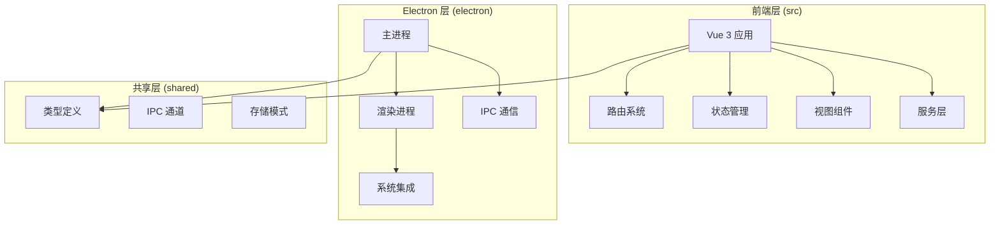
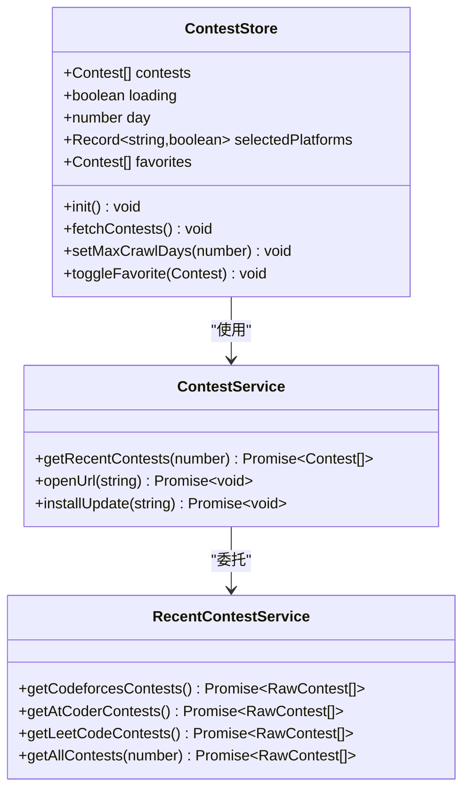
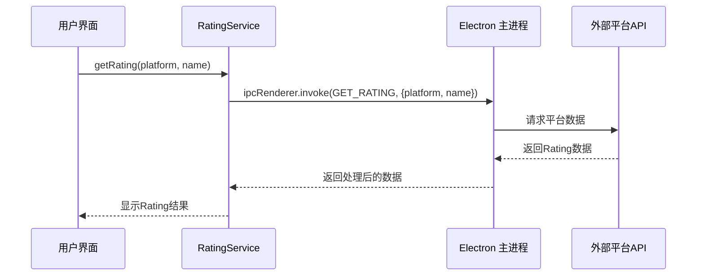
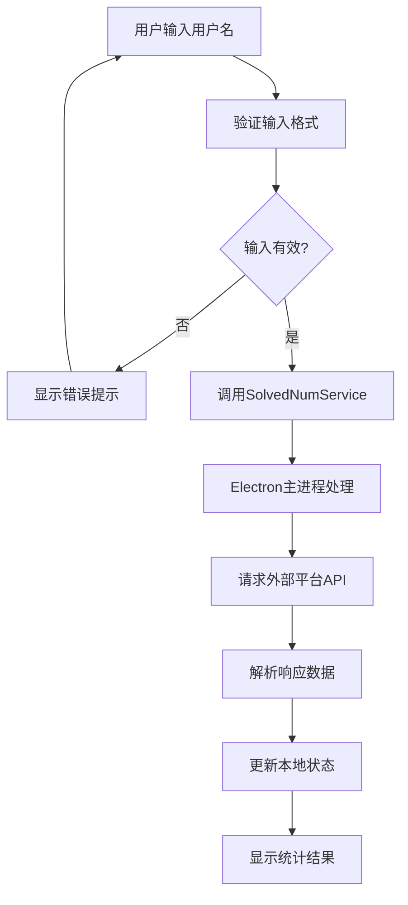
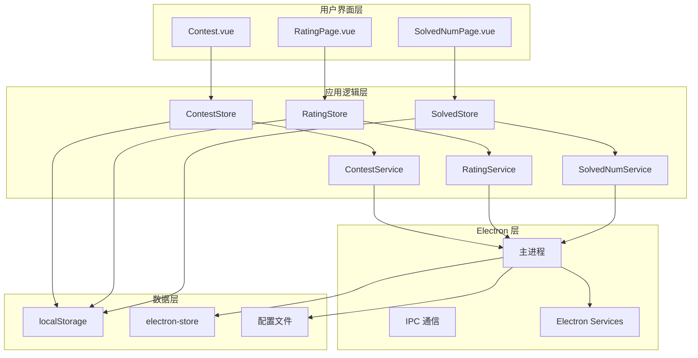
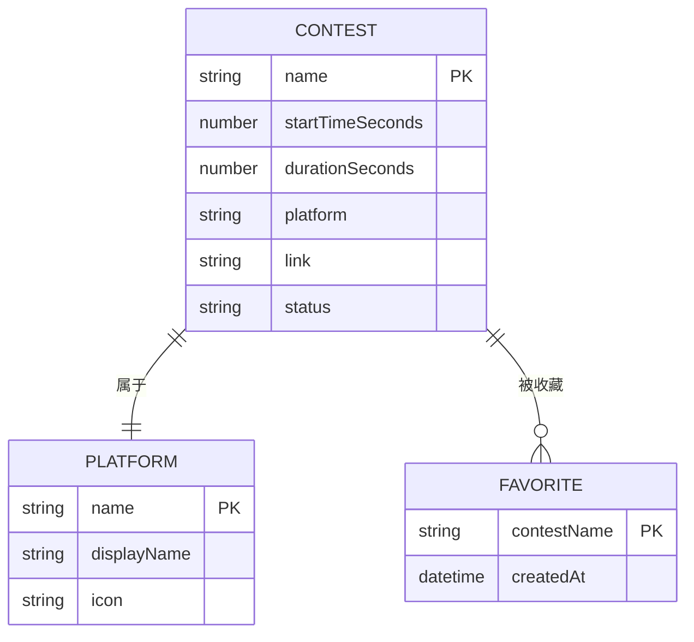
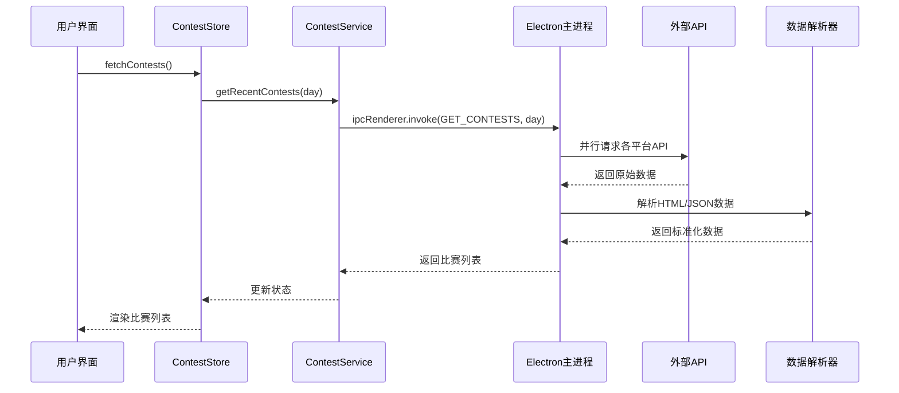
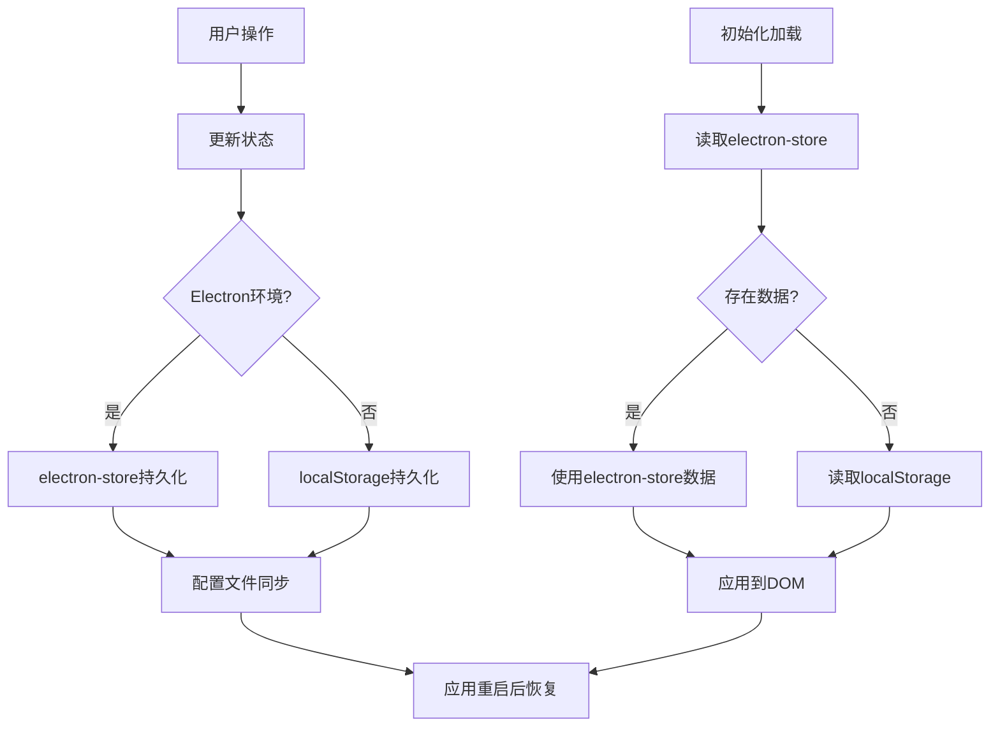

# 项目概述

<cite>
**本文档引用的文件**
- [README.md](file://README.md)
- [package.json](file://package.json)
- [main.ts](file://src/main.ts)
- [electron/main.ts](file://electron/main.ts)
- [App.vue](file://src/App.vue)
- [router/index.ts](file://src/router/index.ts)
- [stores/ui.ts](file://src/stores/ui.ts)
- [stores/contest.ts](file://src/stores/contest.ts)
- [services/contest.ts](file://src/services/contest.ts)
- [services/rating.ts](file://src/services/rating.ts)
- [views/Contest.vue](file://src/views/Contest.vue)
- [views/RatingPage.vue](file://src/views/RatingPage.vue)
- [views/SolvedNumPage.vue](file://src/views/SolvedNumPage.vue)
- [electron/services/contest.ts](file://electron/services/contest.ts)
</cite>

## 目录
1. [项目简介](#项目简介)
2. [技术架构](#技术架构)
3. [核心功能模块](#核心功能模块)
4. [系统架构图](#系统架构图)
5. [详细功能分析](#详细功能分析)
6. [数据流分析](#数据流分析)
7. [性能优化策略](#性能优化策略)
8. [总结](#总结)

## 项目简介

OJFlow 是一个专为算法竞赛（ACM/ICPC, OI）选手打造的跨平台桌面应用。该项目致力于解决多平台账号管理混乱、比赛信息分散、数据查看不便等痛点，通过现代化的技术栈构建了一个功能丰富的竞赛辅助工具。

### 主要特性

- **一站式管理**：聚合 Codeforces, AtCoder, LeetCode 等主流 OJ 平台
- **比赛日历**：实时同步各大 OJ 近期比赛信息，支持添加提醒
- **Rating 追踪**：可视化展示各平台积分变化曲线
- **刷题统计**：自动统计各平台 AC 题目数量，生成能力雷达图
- **快捷导航**：内置常用 OJ 平台入口，支持自定义添加
- **现代化 UI**：基于 Naive UI 设计，支持深色模式

## 技术架构

### 技术栈概览

项目采用现代化的前端技术栈，确保了高性能与良好的开发体验：

| 模块 | 技术选型 | 说明 |
| :--- | :--- | :--- |
| **Core** | Electron 30.x | 跨平台桌面应用容器 |
| **Framework** | Vue 3 | 渐进式 JavaScript 框架 |
| **Language** | TypeScript 5.x | 强类型的 JavaScript 超集 |
| **Build Tool** | Vite 5.x + Bun 1.x | 极速的构建工具与运行时 |
| **UI Library** | Naive UI 2.x | Vue 3 组件库，极简风格 |
| **State** | Pinia | 直观、类型安全的状态管理 |
| **Utils** | Cheerio | 服务端 HTML 解析与爬虫 |
| **Charts** | ECharts | 强大的数据可视化库 |

### 项目结构

**图表来源**
- [main.ts:1-26](file://src/main.ts#L1-L26)
- [electron/main.ts:1-502](file://electron/main.ts#L1-L502)

## 核心功能模块

### 1. 比赛管理系统

比赛管理系统是项目的核心功能之一，负责从多个 OJ 平台抓取比赛信息并进行统一管理。

**图表来源**
- [stores/contest.ts:63-307](file://src/stores/contest.ts#L63-L307)
- [services/contest.ts:7-35](file://src/services/contest.ts#L7-L35)
- [electron/services/contest.ts:12-292](file://electron/services/contest.ts#L12-L292)

### 2. Rating 查询系统

Rating 查询系统允许用户查询各平台的积分信息，并提供历史趋势分析。

**图表来源**
- [services/rating.ts:3-7](file://src/services/rating.ts#L3-L7)
- [electron/main.ts:423-440](file://electron/main.ts#L423-L440)

### 3. 刷题统计系统

刷题统计系统提供各平台解题数量的查询和统计功能。

**图表来源**
- [views/SolvedNumPage.vue:192-211](file://src/views/SolvedNumPage.vue#L192-L211)

## 系统架构图

**图表来源**
- [App.vue:1-23](file://src/App.vue#L1-L23)
- [router/index.ts:16-48](file://src/router/index.ts#L16-L48)
- [stores/ui.ts:19-96](file://src/stores/ui.ts#L19-L96)

## 详细功能分析

### 1. 比赛日历功能

比赛日历功能提供了完整的比赛信息展示和管理能力：

#### 核心特性
- **多平台支持**：Codeforces, AtCoder, LeetCode, 洛谷, 牛客, 蓝桥云课
- **智能分类**：按日期、状态（即将开始/进行中/已结束）自动分组
- **收藏管理**：支持用户收藏感兴趣的赛事
- **筛选功能**：可按平台和日期范围筛选比赛
- **实时更新**：每分钟自动刷新比赛状态

#### 数据结构设计

**图表来源**
- [stores/contest.ts:6-15](file://src/stores/contest.ts#L6-L15)
- [electron/services/contest.ts:12-292](file://electron/services/contest.ts#L12-L292)

### 2. Rating 追踪功能

Rating 追踪功能为用户提供各平台积分的可视化展示：

#### 支持平台
- Codeforces
- AtCoder  
- LeetCode
- 洛谷
- 牛客

#### 功能特点
- **实时查询**：支持查询当前和最高 Rating
- **历史记录**：保存用户输入的用户名
- **批量刷新**：支持一键刷新所有平台数据
- **错误处理**：完善的网络异常和参数验证

### 3. 刷题统计功能

刷题统计功能提供各平台解题数量的查询和统计分析：

#### 支持平台
- Codeforces, AtCoder, VJudge, HDU, POJ, 蓝桥, 洛谷, 牛客, 力扣

#### 统计维度
- **累计解题数**：各平台总解题数量
- **平台分布**：按平台统计解题数量
- **能力雷达图**：可视化展示用户技能分布

## 数据流分析

### 1. 比赛数据获取流程

**图表来源**
- [stores/contest.ts:190-201](file://src/stores/contest.ts#L190-L201)
- [services/contest.ts:8-25](file://src/services/contest.ts#L8-L25)
- [electron/main.ts:406-421](file://electron/main.ts#L406-L421)

### 2. 用户偏好持久化

**图表来源**
- [stores/ui.ts:26-52](file://src/stores/ui.ts#L26-L52)
- [stores/contest.ts:102-140](file://src/stores/contest.ts#L102-L140)

## 性能优化策略

### 1. 并行数据获取

系统采用并行方式从多个平台获取数据，显著提升响应速度：

- **并发请求**：同时向6个不同平台发起请求
- **超时控制**：每个请求设置独立的超时机制
- **重试策略**：网络异常时自动重试，最多3次
- **背压算法**：指数退避避免过度请求

### 2. 内存管理优化

- **懒加载**：非活跃页面组件按需加载
- **状态压缩**：只存储必要的数据字段
- **缓存策略**：合理利用浏览器缓存机制
- **定时清理**：定期清理过期数据和临时变量

### 3. 网络请求优化

- **请求合并**：相同时间段内的多次请求合并
- **CDN加速**：静态资源使用 CDN 分发
- **连接复用**：HTTP/2 连接复用减少握手开销
- **压缩传输**：启用 Gzip 压缩减少带宽占用

## 总结

OJFlow 项目通过现代化的技术架构和精心设计的功能模块，为算法竞赛选手提供了一个功能完整、性能优异的桌面应用解决方案。项目的主要优势包括：

### 技术优势
- **全栈 TypeScript**：提供强类型安全保障
- **现代化构建工具**：Vite + Bun 实现极速开发体验
- **跨平台兼容**：支持 Windows、macOS、Linux 三大平台
- **模块化设计**：清晰的分层架构便于维护和扩展

### 功能特色
- **一站式管理**：整合多个 OJ 平台的数据
- **智能化处理**：自动解析和标准化不同平台的数据格式
- **用户体验优化**：流畅的动画效果和响应式设计
- **数据持久化**：完善的本地存储和配置管理

### 发展前景
项目已经具备了成为优秀竞赛辅助工具的基础，未来可以在以下方面进一步完善：
- 增加更多 OJ 平台支持
- 优化数据解析算法
- 扩展更多统计分析功能
- 提升离线使用能力