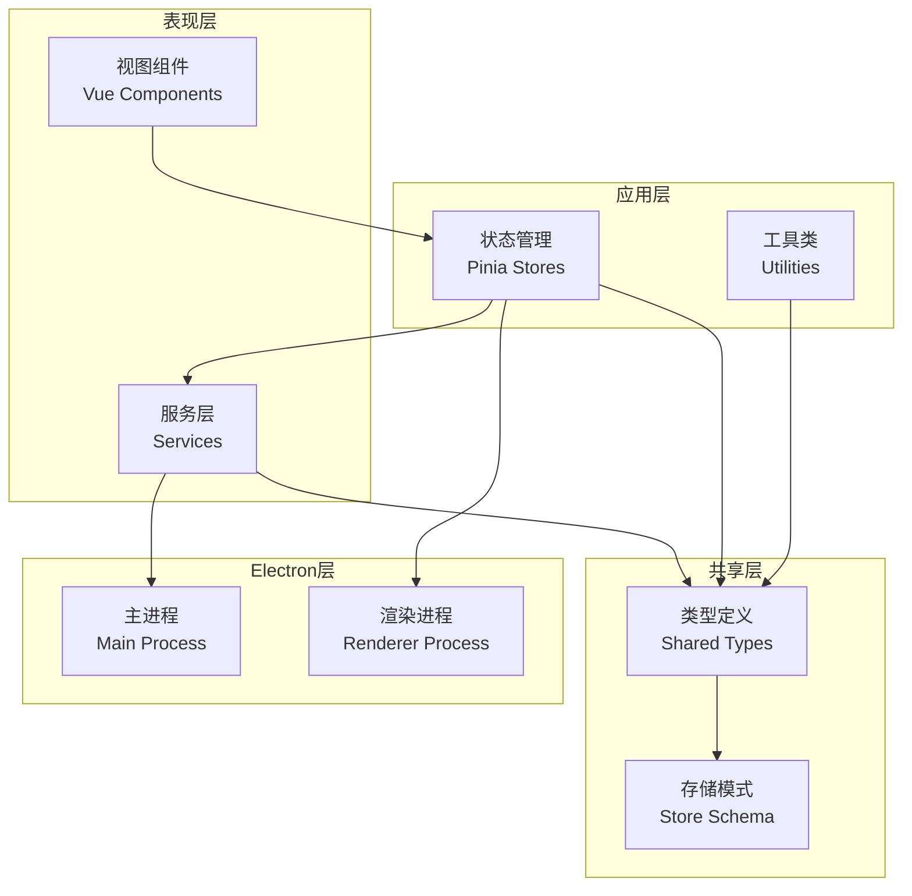
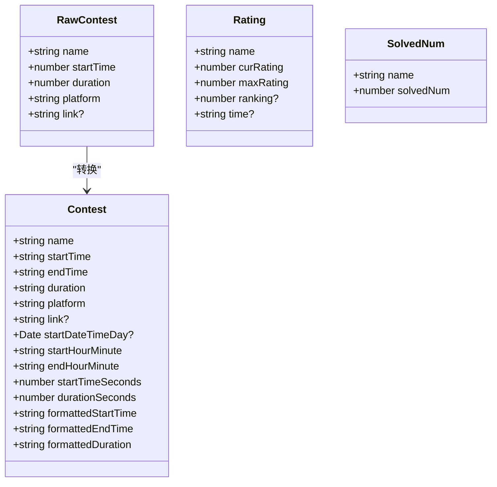
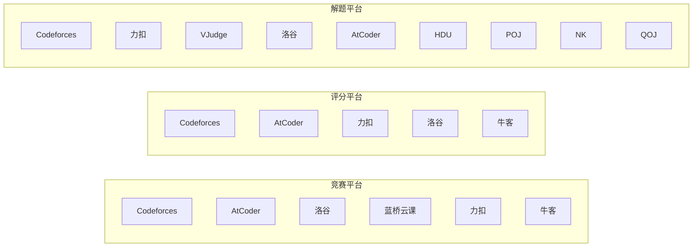
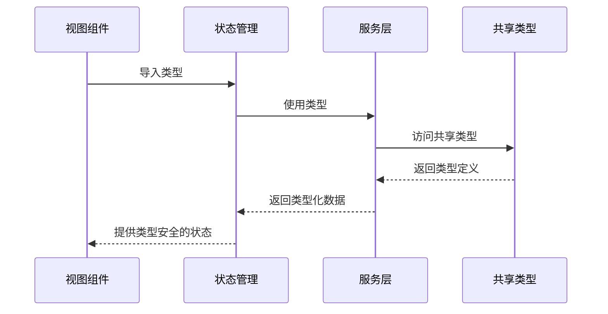
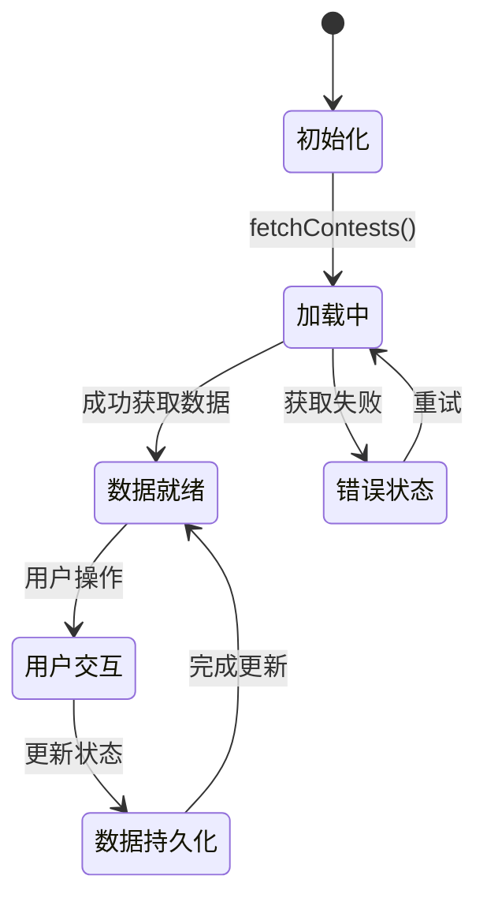
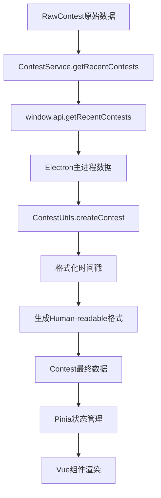
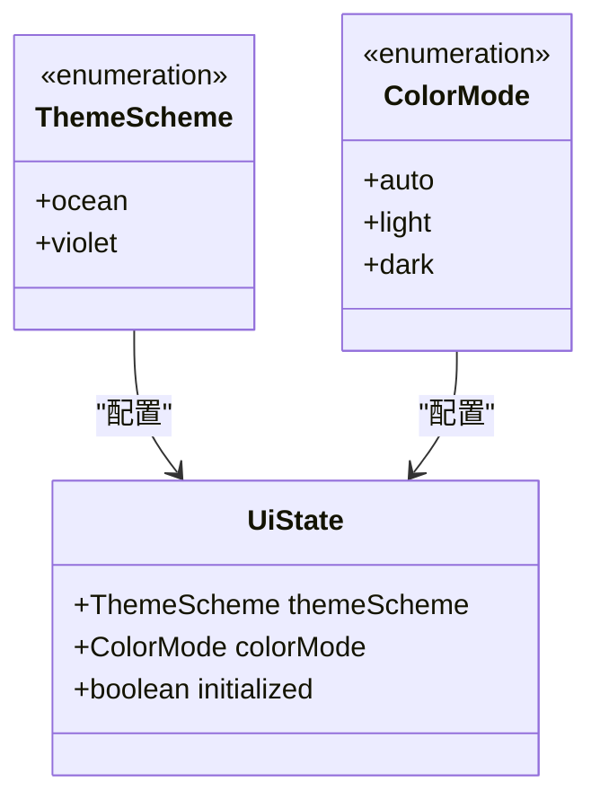
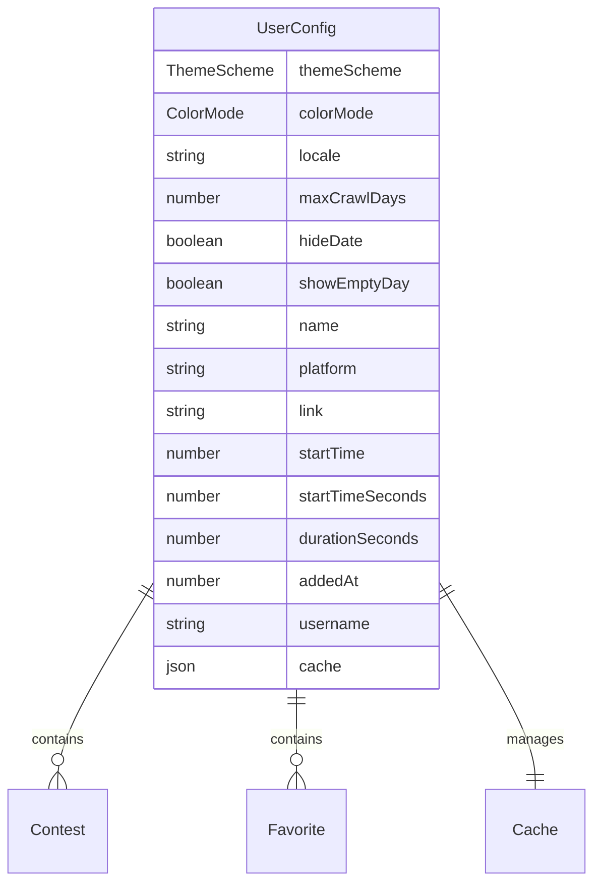
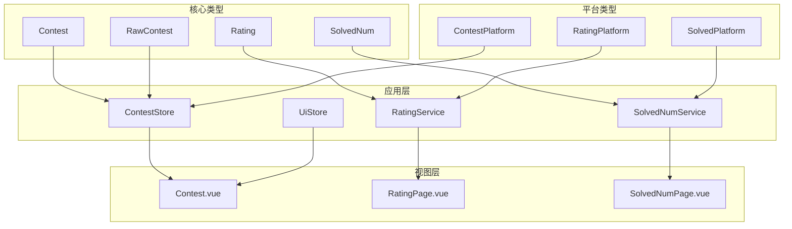
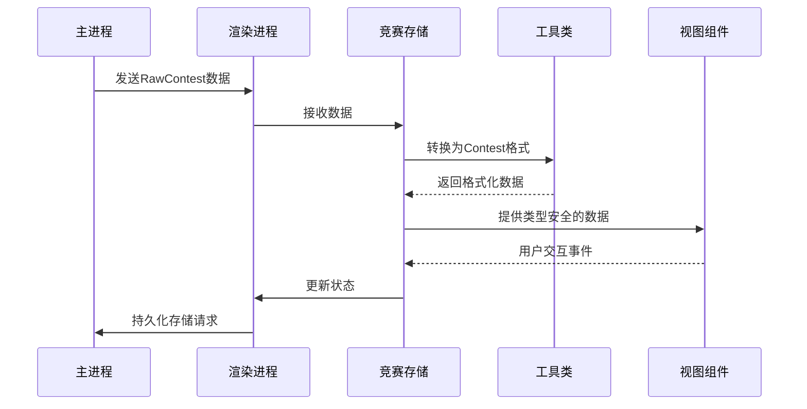

# 类型定义

<cite>
**本文档引用的文件**
- [shared/types.ts](file://shared/types.ts)
- [src/types/index.ts](file://src/types/index.ts)
- [src/types/global.d.ts](file://src/types/global.d.ts)
- [src/stores/contest.ts](file://src/stores/contest.ts)
- [src/stores/ui.ts](file://src/stores/ui.ts)
- [src/services/contest.ts](file://src/services/contest.ts)
- [src/services/rating.ts](file://src/services/rating.ts)
- [src/services/solved.ts](file://src/services/solved.ts)
- [src/utils/contest_utils.ts](file://src/utils/contest_utils.ts)
- [shared/store-schema.ts](file://shared/store-schema.ts)
- [src/views/Contest.vue](file://src/views/Contest.vue)
- [src/views/RatingPage.vue](file://src/views/RatingPage.vue)
- [src/views/SolvedNumPage.vue](file://src/views/SolvedNumPage.vue)
</cite>

## 目录
1. [简介](#简介)
2. [项目结构](#项目结构)
3. [核心类型系统](#核心类型系统)
4. [架构概览](#架构概览)
5. [详细类型分析](#详细类型分析)
6. [依赖关系分析](#依赖关系分析)
7. [性能考虑](#性能考虑)
8. [故障排除指南](#故障排除指南)
9. [结论](#结论)

## 简介

OJFlow项目采用严格的TypeScript类型系统来确保代码质量和开发体验。该项目通过共享类型定义、模块化设计和清晰的类型约束，构建了一个类型安全的应用程序架构。

## 项目结构

项目采用分层架构设计，主要包含以下层次：



**图表来源**
- [src/views/Contest.vue:1-50](file://src/views/Contest.vue#L1-L50)
- [src/stores/contest.ts:1-30](file://src/stores/contest.ts#L1-L30)
- [shared/types.ts:1-20](file://shared/types.ts#L1-L20)

## 核心类型系统

### 共享类型定义

项目的核心类型定义位于`shared/types.ts`文件中，提供了统一的数据模型：



**图表来源**
- [shared/types.ts:1-67](file://shared/types.ts#L1-L67)

### 平台标识符类型

项目定义了严格约束的平台标识符类型，确保平台名称的一致性和安全性：



**图表来源**
- [shared/types.ts:41-66](file://shared/types.ts#L41-L66)

**章节来源**
- [shared/types.ts:1-67](file://shared/types.ts#L1-L67)

## 架构概览

### 类型导入导出机制

项目采用集中式类型管理策略，通过`src/types/index.ts`统一导出所有类型：



**图表来源**
- [src/types/index.ts:1-10](file://src/types/index.ts#L1-L10)
- [src/stores/contest.ts:1-10](file://src/stores/contest.ts#L1-L10)

### 状态管理模式

应用使用Pinia进行状态管理，类型系统确保状态的完整性和一致性：



**图表来源**
- [src/stores/contest.ts:63-140](file://src/stores/contest.ts#L63-L140)

**章节来源**
- [src/types/index.ts:1-10](file://src/types/index.ts#L1-L10)
- [src/stores/contest.ts:1-307](file://src/stores/contest.ts#L1-L307)

## 详细类型分析

### 竞赛数据类型系统

#### RawContest与Contest的转换流程



**图表来源**
- [src/services/contest.ts:8-25](file://src/services/contest.ts#L8-L25)
- [src/utils/contest_utils.ts:5-43](file://src/utils/contest_utils.ts#L5-L43)

#### 竞赛状态类型

项目定义了竞赛的三种状态类型：

| 状态类型 | 时间条件 | 描述 |
|---------|---------|------|
| upcoming | 当前时间 < 开始时间 | 即将开始 |
| running | 开始时间 ≤ 当前时间 ≤ 结束时间 | 进行中 |
| ended | 当前时间 > 结束时间 | 已结束 |

**章节来源**
- [src/utils/contest_utils.ts:1-68](file://src/utils/contest_utils.ts#L1-L68)
- [src/views/Contest.vue:552-585](file://src/views/Contest.vue#L552-L585)

### UI主题类型系统

#### 主题方案类型



**图表来源**
- [src/stores/ui.ts:4-24](file://src/stores/ui.ts#L4-L24)

**章节来源**
- [src/stores/ui.ts:1-96](file://src/stores/ui.ts#L1-L96)

### 存储模式类型系统

#### 用户配置存储结构



**图表来源**
- [shared/store-schema.ts:1-55](file://shared/store-schema.ts#L1-L55)

**章节来源**
- [shared/store-schema.ts:1-55](file://shared/store-schema.ts#L1-L55)

## 依赖关系分析

### 类型依赖图



**图表来源**
- [shared/types.ts:1-67](file://shared/types.ts#L1-L67)
- [src/stores/contest.ts:1-30](file://src/stores/contest.ts#L1-L30)
- [src/views/Contest.vue:344-352](file://src/views/Contest.vue#L344-L352)

### 组件间类型传递



**图表来源**
- [src/services/contest.ts:8-25](file://src/services/contest.ts#L8-L25)
- [src/utils/contest_utils.ts:5-43](file://src/utils/contest_utils.ts#L5-L43)

**章节来源**
- [src/stores/contest.ts:1-307](file://src/stores/contest.ts#L1-L307)
- [src/services/contest.ts:1-35](file://src/services/contest.ts#L1-L35)

## 性能考虑

### 类型系统的性能优势

1. **编译时优化**: TypeScript在编译时进行类型检查，避免运行时类型验证开销
2. **智能代码补全**: 类型信息提供精确的IDE支持和代码补全
3. **错误预防**: 在开发阶段捕获类型错误，减少运行时异常
4. **内存效率**: 类型安全的数据结构减少不必要的数据转换

### 优化建议

1. **延迟加载**: 对于大型类型定义，考虑使用动态导入
2. **类型缓存**: 利用TypeScript的类型缓存机制提高编译速度
3. **模块拆分**: 将复杂的类型定义拆分为更小的模块
4. **泛型使用**: 在需要的地方使用泛型提高类型复用性

## 故障排除指南

### 常见类型错误

#### 类型不匹配错误

当遇到类型不匹配错误时，检查以下方面：

1. **接口实现**: 确保对象完全实现接口定义的所有属性
2. **可选属性**: 正确处理可选属性的访问
3. **联合类型**: 验证联合类型的分支处理
4. **泛型参数**: 确保泛型参数正确传递

#### 类型导入问题

```typescript
// 错误示例
import { Contest } from '../types';

// 正确示例
import { Contest } from '../../shared/types';
```

**章节来源**
- [src/types/global.d.ts:1-26](file://src/types/global.d.ts#L1-L26)
- [src/views/Contest.vue:344-352](file://src/views/Contest.vue#L344-L352)

### 调试技巧

1. **类型断言**: 使用`as`关键字进行类型断言，但要谨慎使用
2. **类型守卫**: 实现自定义类型守卫函数进行运行时类型检查
3. **编译器选项**: 配置`strict`模式获得更严格的类型检查
4. **类型定义**: 为第三方库添加适当的类型定义文件

## 结论

OJFlow项目的类型定义系统展现了现代前端开发的最佳实践。通过共享类型定义、严格的类型约束和清晰的架构分离，项目实现了高度的类型安全性和可维护性。

### 主要成就

1. **统一的类型管理**: 通过共享类型文件确保整个应用的类型一致性
2. **严格的平台约束**: 使用字面量类型确保平台名称的准确性和安全性
3. **完整的状态管理**: Pinia与TypeScript的结合提供了类型安全的状态管理
4. **清晰的架构分离**: 不同层次的类型职责明确，便于维护和扩展

### 未来改进方向

1. **类型文档**: 为复杂类型添加详细的TypeDoc注释
2. **类型测试**: 编写类型级别的单元测试
3. **性能监控**: 监控类型系统的性能影响
4. **团队规范**: 制定更详细的类型使用规范和最佳实践