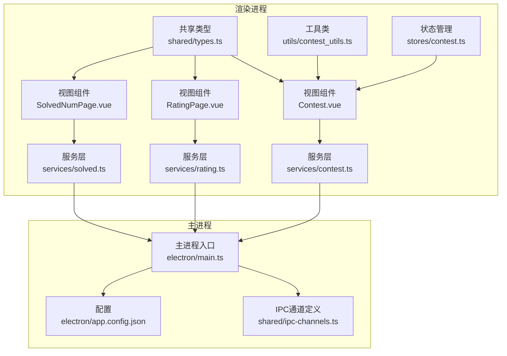
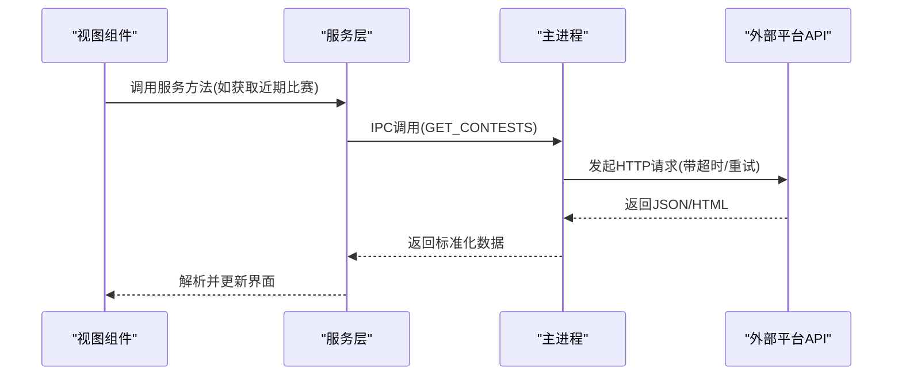
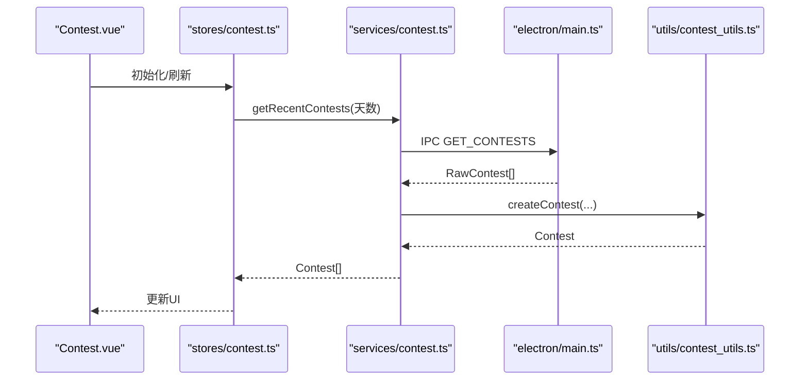
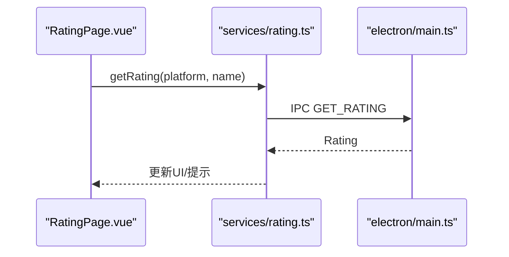
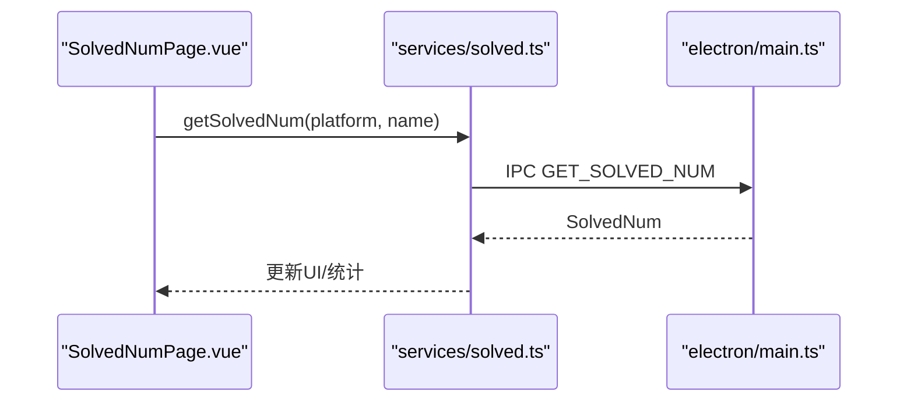
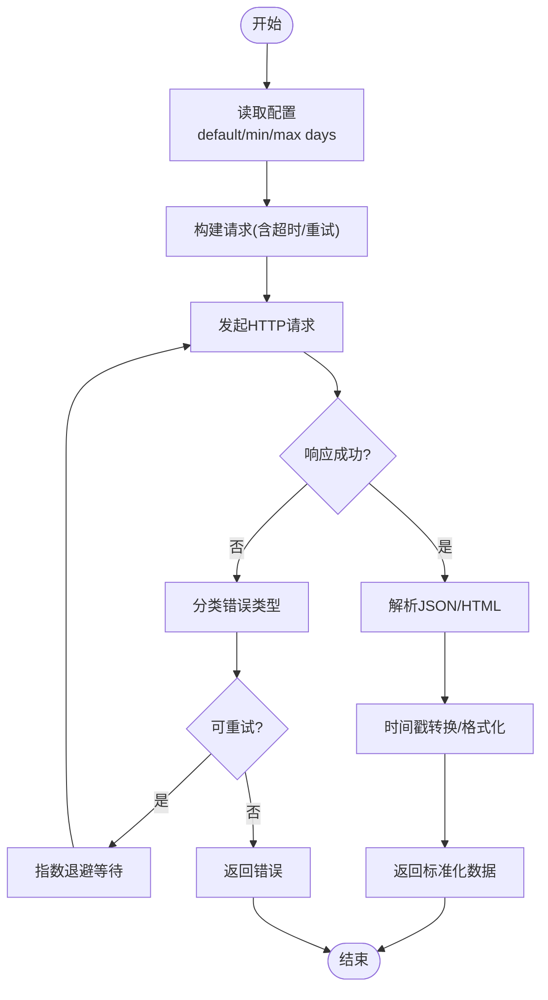
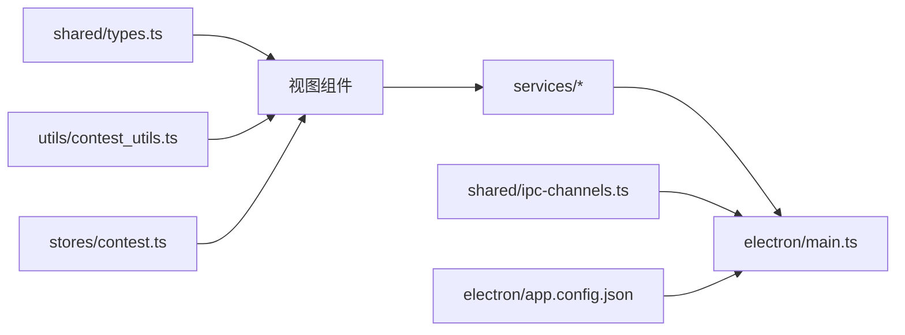

# 外部平台集成

<cite>
**本文引用的文件**
- [src/services/contest.ts](file://src/services/contest.ts)
- [src/services/rating.ts](file://src/services/rating.ts)
- [src/services/solved.ts](file://src/services/solved.ts)
- [shared/types.ts](file://shared/types.ts)
- [src/utils/contest_utils.ts](file://src/utils/contest_utils.ts)
- [electron/main.ts](file://electron/main.ts)
- [electron/app.config.json](file://electron/app.config.json)
- [shared/ipc-channels.ts](file://shared/ipc-channels.ts)
- [src/stores/contest.ts](file://src/stores/contest.ts)
- [src/views/Contest.vue](file://src/views/Contest.vue)
- [src/views/RatingPage.vue](file://src/views/RatingPage.vue)
- [src/views/SolvedNumPage.vue](file://src/views/SolvedNumPage.vue)
</cite>

## 目录
1. [简介](#简介)
2. [项目结构](#项目结构)
3. [核心组件](#核心组件)
4. [架构总览](#架构总览)
5. [详细组件分析](#详细组件分析)
6. [依赖关系分析](#依赖关系分析)
7. [性能考量](#性能考量)
8. [故障排查指南](#故障排查指南)
9. [结论](#结论)
10. [附录](#附录)

## 简介
本文件面向OJFlow的外部平台集成，聚焦于与各大在线判题平台（如Codeforces、AtCoder、LeetCode、洛谷、蓝桥云课、牛客等）的数据对接与展示。文档从系统架构、数据抓取策略、反爬虫与错误处理、认证与API限制、扩展指南、调试技巧与常见问题、以及数据同步与缓存机制等方面进行深入说明，并提供可操作的实践建议。

## 项目结构
OJFlow采用Electron + Vue的桌面应用架构，渲染进程通过IPC与主进程交互，主进程负责调用外部平台API并返回标准化数据。平台支持在共享类型定义中集中声明，前端视图与服务层通过统一接口消费数据。

**图表来源**
- [src/views/Contest.vue](file://src/views/Contest.vue)
- [src/views/RatingPage.vue](file://src/views/RatingPage.vue)
- [src/views/SolvedNumPage.vue](file://src/views/SolvedNumPage.vue)
- [src/services/contest.ts](file://src/services/contest.ts)
- [src/services/rating.ts](file://src/services/rating.ts)
- [src/services/solved.ts](file://src/services/solved.ts)
- [shared/types.ts](file://shared/types.ts)
- [src/utils/contest_utils.ts](file://src/utils/contest_utils.ts)
- [src/stores/contest.ts](file://src/stores/contest.ts)
- [electron/main.ts](file://electron/main.ts)
- [electron/app.config.json](file://electron/app.config.json)
- [shared/ipc-channels.ts](file://shared/ipc-channels.ts)

**章节来源**
- [src/views/Contest.vue](file://src/views/Contest.vue)
- [src/views/RatingPage.vue](file://src/views/RatingPage.vue)
- [src/views/SolvedNumPage.vue](file://src/views/SolvedNumPage.vue)
- [src/services/contest.ts](file://src/services/contest.ts)
- [src/services/rating.ts](file://src/services/rating.ts)
- [src/services/solved.ts](file://src/services/solved.ts)
- [shared/types.ts](file://shared/types.ts)
- [src/utils/contest_utils.ts](file://src/utils/contest_utils.ts)
- [src/stores/contest.ts](file://src/stores/contest.ts)
- [electron/main.ts](file://electron/main.ts)
- [electron/app.config.json](file://electron/app.config.json)
- [shared/ipc-channels.ts](file://shared/ipc-channels.ts)

## 核心组件
- 渲染进程服务层：封装对主进程IPC调用，提供统一方法获取近期比赛、评分、解题数等。
- 主进程服务层：在主进程中实现对外部平台API的请求、重试、超时控制与错误分类。
- 共享类型与工具：定义平台枚举、数据模型与时间格式化工具。
- 视图与状态：提供UI交互、筛选、收藏、分页与响应式布局；状态持久化到localStorage与electron-store。

**章节来源**
- [src/services/contest.ts](file://src/services/contest.ts)
- [src/services/rating.ts](file://src/services/rating.ts)
- [src/services/solved.ts](file://src/services/solved.ts)
- [shared/types.ts](file://shared/types.ts)
- [src/utils/contest_utils.ts](file://src/utils/contest_utils.ts)
- [src/stores/contest.ts](file://src/stores/contest.ts)

## 架构总览
渲染进程通过IPC通道向主进程请求数据，主进程根据配置执行HTTP请求，返回标准化数据给渲染进程。错误被分类并记录，便于前端展示与用户感知。

**图表来源**
- [src/services/contest.ts](file://src/services/contest.ts)
- [electron/main.ts](file://electron/main.ts)
- [shared/ipc-channels.ts](file://shared/ipc-channels.ts)

## 详细组件分析

### 组件A：近期比赛数据流
- 渲染进程：视图组件调用服务层获取近期比赛，按日期分组与筛选平台，支持收藏与跳转链接。
- 服务层：封装IPC调用，接收原始数据并交由工具类转换为可展示格式。
- 工具类：将Unix秒时间戳转换为本地时间字符串、计算持续时间、生成“今天/明天/周X”标签。
- 主进程：根据配置限制请求天数，发起HTTP请求，分类错误类型，返回标准化数组。

**图表来源**
- [src/views/Contest.vue](file://src/views/Contest.vue)
- [src/stores/contest.ts](file://src/stores/contest.ts)
- [src/services/contest.ts](file://src/services/contest.ts)
- [electron/main.ts](file://electron/main.ts)
- [src/utils/contest_utils.ts](file://src/utils/contest_utils.ts)

**章节来源**
- [src/views/Contest.vue](file://src/views/Contest.vue)
- [src/stores/contest.ts](file://src/stores/contest.ts)
- [src/services/contest.ts](file://src/services/contest.ts)
- [src/utils/contest_utils.ts](file://src/utils/contest_utils.ts)
- [electron/main.ts](file://electron/main.ts)

### 组件B：评分查询流程
- 渲染进程：页面收集用户输入的平台用户名，调用服务层发起查询，展示进度与结果。
- 服务层：封装IPC调用，传入平台与用户名。
- 主进程：校验参数长度与协议，调用对应平台服务，返回评分对象。

**图表来源**
- [src/views/RatingPage.vue](file://src/views/RatingPage.vue)
- [src/services/rating.ts](file://src/services/rating.ts)
- [electron/main.ts](file://electron/main.ts)

**章节来源**
- [src/views/RatingPage.vue](file://src/views/RatingPage.vue)
- [src/services/rating.ts](file://src/services/rating.ts)
- [electron/main.ts](file://electron/main.ts)

### 组件C：解题数量查询流程
- 渲染进程：页面收集用户输入，调用服务层查询解题数，支持统计面板与响应式布局。
- 服务层：封装IPC调用，传入平台与用户名。
- 主进程：校验参数长度与协议，调用对应平台服务，返回解题数对象。

**图表来源**
- [src/views/SolvedNumPage.vue](file://src/views/SolvedNumPage.vue)
- [src/services/solved.ts](file://src/services/solved.ts)
- [electron/main.ts](file://electron/main.ts)

**章节来源**
- [src/views/SolvedNumPage.vue](file://src/views/SolvedNumPage.vue)
- [src/services/solved.ts](file://src/services/solved.ts)
- [electron/main.ts](file://electron/main.ts)

### 组件D：数据抓取策略与解析机制
- 抓取策略
  - 请求超时与重试：主进程提供带超时与指数退避的重试逻辑，针对网络/超时错误自动重试。
  - 参数校验：对平台名与用户名长度进行限制，避免过大负载。
  - 配置约束：默认/最小/最大抓取天数由配置文件控制，防止过度请求。
- 反爬虫处理
  - 使用标准fetch与no-store缓存策略，避免浏览器缓存干扰。
  - 对部分错误进行分类（超时/网络），便于前端提示与用户感知。
- 数据解析
  - 时间戳转换：工具类将秒级时间戳转换为本地时间字符串与“时:分”标签。
  - 结构化输出：RawContest映射为Contest，包含格式化时间、持续时间、起止时刻等。

**图表来源**
- [electron/main.ts](file://electron/main.ts)
- [src/utils/contest_utils.ts](file://src/utils/contest_utils.ts)
- [electron/app.config.json](file://electron/app.config.json)

**章节来源**
- [electron/main.ts](file://electron/main.ts)
- [src/utils/contest_utils.ts](file://src/utils/contest_utils.ts)
- [electron/app.config.json](file://electron/app.config.json)

### 组件E：认证方式、API限制与使用条款
- 认证方式
  - 当前实现未显式处理Cookie/JWT等认证头，直接发起HTTP请求。若目标平台需要登录态，应在主进程侧增加鉴权逻辑（例如注入Cookie或携带Authorization头）。
- API限制
  - 通过超时与重试策略降低限流影响；建议在主进程侧引入速率限制器与随机延时，避免触发平台风控。
- 使用条款
  - 应遵循各平台的robots.txt与服务条款，避免高频抓取导致封禁。

**章节来源**
- [electron/main.ts](file://electron/main.ts)

### 组件F：平台扩展指南
- 步骤
  - 在共享类型中新增平台标识（ContestPlatform/RatingPlatform/SolvedPlatform）。
  - 在视图组件中添加平台图标与占位符提示。
  - 在主进程服务层新增对应平台的抓取逻辑（建议以工厂/策略模式组织）。
  - 在IPC通道中注册新通道（如需要），并在渲染进程服务层补充调用。
- 注意事项
  - 保持数据模型一致（RawContest/Contest/Rating/SolvedNum）。
  - 为新平台编写错误分类与降级策略。
  - 提供默认图片资源与国际化文案。

**章节来源**
- [shared/types.ts](file://shared/types.ts)
- [src/views/Contest.vue](file://src/views/Contest.vue)
- [src/views/RatingPage.vue](file://src/views/RatingPage.vue)
- [src/views/SolvedNumPage.vue](file://src/views/SolvedNumPage.vue)
- [shared/ipc-channels.ts](file://shared/ipc-channels.ts)

## 依赖关系分析
- 渲染进程依赖共享类型与工具类，通过服务层间接依赖主进程IPC。
- 主进程依赖配置文件与错误分类函数，对外部平台API进行统一调度。
- 视图组件依赖状态管理与服务层，实现筛选、收藏与响应式布局。

**图表来源**
- [shared/types.ts](file://shared/types.ts)
- [src/utils/contest_utils.ts](file://src/utils/contest_utils.ts)
- [src/services/contest.ts](file://src/services/contest.ts)
- [src/services/rating.ts](file://src/services/rating.ts)
- [src/services/solved.ts](file://src/services/solved.ts)
- [electron/main.ts](file://electron/main.ts)
- [shared/ipc-channels.ts](file://shared/ipc-channels.ts)
- [electron/app.config.json](file://electron/app.config.json)
- [src/stores/contest.ts](file://src/stores/contest.ts)
- [src/views/Contest.vue](file://src/views/Contest.vue)

**章节来源**
- [shared/types.ts](file://shared/types.ts)
- [src/utils/contest_utils.ts](file://src/utils/contest_utils.ts)
- [src/services/contest.ts](file://src/services/contest.ts)
- [src/services/rating.ts](file://src/services/rating.ts)
- [src/services/solved.ts](file://src/services/solved.ts)
- [electron/main.ts](file://electron/main.ts)
- [shared/ipc-channels.ts](file://shared/ipc-channels.ts)
- [electron/app.config.json](file://electron/app.config.json)
- [src/stores/contest.ts](file://src/stores/contest.ts)
- [src/views/Contest.vue](file://src/views/Contest.vue)

## 性能考量
- 请求优化
  - 合理设置超时与重试次数，避免阻塞UI线程。
  - 对高频查询场景引入节流/去抖，减少不必要的请求。
- 内存与渲染
  - 对大型列表使用虚拟滚动（现有实现已具备折叠与分段渲染）。
  - 仅在必要时重新计算分组与排序。
- 缓存策略
  - 建议在主进程侧对热点数据进行短期缓存（如最近一次查询结果），并设置TTL。
  - 对不可变数据（如平台图标）进行静态缓存与预加载。

[本节为通用指导，无需列出具体文件来源]

## 故障排查指南
- 常见错误分类
  - 超时/网络错误：检查网络连通性与代理设置，适当增大超时阈值。
  - 参数非法：确保平台名与用户名长度符合限制。
  - 外链协议限制：仅允许http/https协议，避免本地路径。
- 调试技巧
  - 开启开发者工具查看IPC调用与错误日志。
  - 在主进程打印请求URL与状态码，定位失败节点。
  - 对特定平台增加日志级别，区分不同错误类型。
- 常见问题
  - 查询失败：检查用户名是否公开、是否触发限流。
  - 数据为空：确认平台是否在支持列表、是否启用该平台筛选。

**章节来源**
- [electron/main.ts](file://electron/main.ts)
- [src/services/contest.ts](file://src/services/contest.ts)
- [src/services/rating.ts](file://src/services/rating.ts)
- [src/services/solved.ts](file://src/services/solved.ts)

## 结论
OJFlow通过清晰的IPC分层与共享类型设计，实现了对多平台数据的统一接入与展示。当前实现具备基础的超时/重试与错误分类能力，建议在主进程侧进一步完善认证、限流与缓存策略，以提升稳定性与用户体验。扩展新平台时，遵循统一的数据模型与错误处理规范，可快速完成集成。

[本节为总结性内容，无需列出具体文件来源]

## 附录

### 数据模型与平台枚举
- 平台枚举
  - 比赛平台：Codeforces、AtCoder、洛谷、蓝桥云课、力扣、牛客
  - 评分平台：Codeforces、AtCoder、力扣、洛谷、牛客
  - 解题数平台：Codeforces、AtCoder、VJudge、HDU、POJ、蓝桥、洛谷、牛客、力扣
- 数据模型
  - RawContest：原始未格式化数据（名称、开始时间、持续秒、平台、链接）
  - Contest：渲染用格式化数据（含本地时间字符串、时长文本、起止时刻等）

**章节来源**
- [shared/types.ts](file://shared/types.ts)

### IPC通道与参数约定
- GET_CONTESTS：参数为天数；返回RawContest数组
- GET_RATING：参数为{platform, name}；返回Rating
- GET_SOLVED_NUM：参数为{platform, name}；返回SolvedNum
- OPEN_URL：参数为URL；无返回
- STORE_*：键值存储读写

**章节来源**
- [shared/ipc-channels.ts](file://shared/ipc-channels.ts)
- [electron/main.ts](file://electron/main.ts)