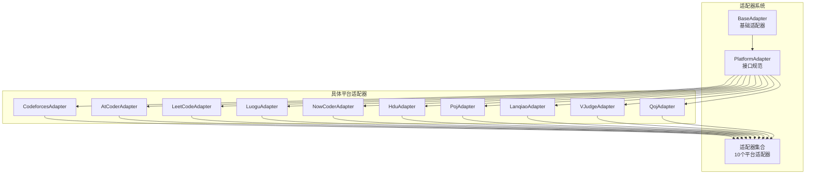
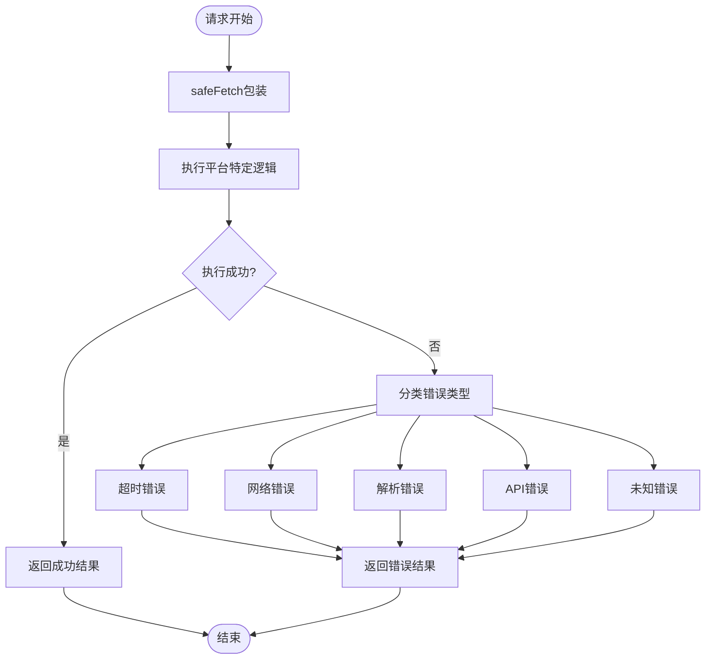
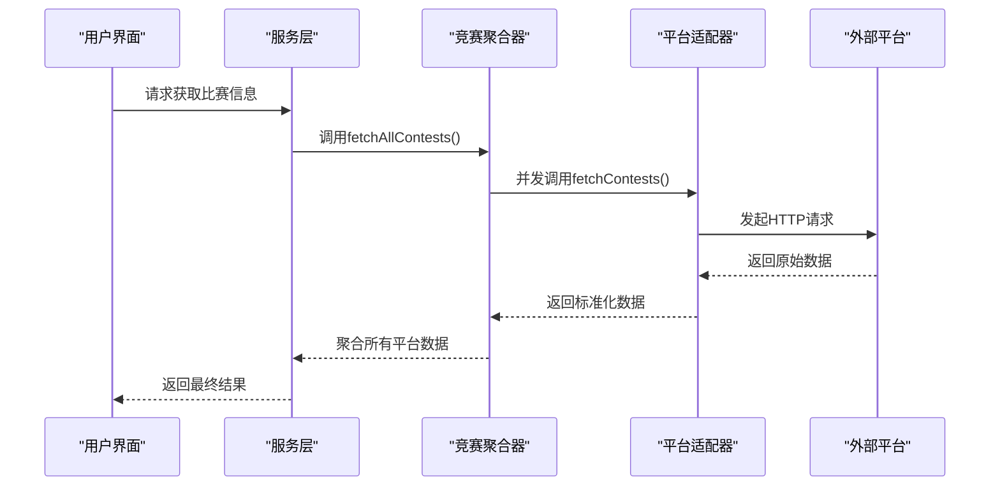

# 外部平台集成

<cite>
**本文引用的文件**
- [electron/services/adapters/index.ts](file://electron/services/adapters/index.ts)
- [electron/services/adapters/base-adapter.ts](file://electron/services/adapters/base-adapter.ts)
- [electron/services/adapters/types.ts](file://electron/services/adapters/types.ts)
- [electron/services/adapters/codeforces.adapter.ts](file://electron/services/adapters/codeforces.adapter.ts)
- [electron/services/adapters/atcoder.adapter.ts](file://electron/services/adapters/atcoder.adapter.ts)
- [electron/services/adapters/leetcode.adapter.ts](file://electron/services/adapters/leetcode.adapter.ts)
- [electron/services/adapters/luogu.adapter.ts](file://electron/services/adapters/luogu.adapter.ts)
- [electron/services/adapters/nowcoder.adapter.ts](file://electron/services/adapters/nowcoder.adapter.ts)
- [electron/services/adapters/hdu.adapter.ts](file://electron/services/adapters/hdu.adapter.ts)
- [electron/services/adapters/poj.adapter.ts](file://electron/services/adapters/poj.adapter.ts)
- [electron/services/adapters/lanqiao.adapter.ts](file://electron/services/adapters/lanqiao.adapter.ts)
- [electron/services/adapters/vjudge.adapter.ts](file://electron/services/adapters/vjudge.adapter.ts)
- [electron/services/adapters/qoj.adapter.ts](file://electron/services/adapters/qoj.adapter.ts)
- [electron/services/contest-aggregator.ts](file://electron/services/contest-aggregator.ts)
- [electron/main.ts](file://electron/main.ts)
- [src/services/contest.ts](file://src/services/contest.ts)
- [src/services/rating.ts](file://src/services/rating.ts)
- [src/services/solved.ts](file://src/services/solved.ts)
- [shared/types.ts](file://shared/types.ts)
- [src/utils/contest_utils.ts](file://src/utils/contest_utils.ts)
- [electron/app.config.json](file://electron/app.config.json)
- [shared/ipc-channels.ts](file://shared/ipc-channels.ts)
- [src/stores/contest.ts](file://src/stores/contest.ts)
- [src/views/Contest.vue](file://src/views/Contest.vue)
- [src/views/RatingPage.vue](file://src/views/RatingPage.vue)
- [src/views/SolvedNumPage.vue](file://src/views/SolvedNumPage.vue)
</cite>

## 更新摘要
**所做更改**
- 新增完整的平台适配器系统架构说明
- 更新平台支持列表，包含10个主流在线判题平台
- 新增适配器接口规范和错误处理机制
- 更新数据抓取策略和并发聚合架构
- 新增缓存机制和健康检查功能
- 更新平台扩展指南和调试技巧

## 目录
1. [简介](#简介)
2. [平台适配器系统](#平台适配器系统)
3. [支持的平台列表](#支持的平台列表)
4. [适配器接口规范](#适配器接口规范)
5. [架构总览](#架构总览)
6. [详细组件分析](#详细组件分析)
7. [数据抓取策略](#数据抓取策略)
8. [错误处理与反爬虫](#错误处理与反爬虫)
9. [缓存机制](#缓存机制)
10. [平台扩展指南](#平台扩展指南)
11. [调试技巧与故障排查](#调试技巧与故障排查)
12. [性能考量](#性能考量)
13. [结论](#结论)
14. [附录](#附录)

## 简介
本文档详细介绍OJFlow的完整平台适配器系统，该系统支持10个主流在线判题平台的统一接口访问。系统采用模块化的适配器架构，通过标准化的接口规范实现对Codeforces、AtCoder、LeetCode、洛谷、NowCoder、HDU、POJ、蓝桥云课、VJudge、QOJ等平台的统一数据抓取和解析。

## 平台适配器系统
OJFlow采用全新的平台适配器系统，该系统基于统一的接口规范，为每个在线判题平台提供专门的适配器实现。适配器系统的核心优势包括：

- **统一接口规范**：所有适配器实现相同的接口方法，确保一致性
- **模块化设计**：每个平台独立实现，便于维护和扩展
- **错误隔离**：单个平台的错误不会影响其他平台的正常运行
- **并发处理**：支持多平台并发抓取，提升整体性能
- **标准化输出**：统一的数据格式和错误处理机制



**图表来源**
- [electron/services/adapters/base-adapter.ts](file://electron/services/adapters/base-adapter.ts)
- [electron/services/adapters/types.ts](file://electron/services/adapters/types.ts)
- [electron/services/adapters/index.ts](file://electron/services/adapters/index.ts)

**章节来源**
- [electron/services/adapters/base-adapter.ts](file://electron/services/adapters/base-adapter.ts)
- [electron/services/adapters/types.ts](file://electron/services/adapters/types.ts)
- [electron/services/adapters/index.ts](file://electron/services/adapters/index.ts)

## 支持的平台列表
系统当前支持以下10个主流在线判题平台：

### 比赛平台
- **Codeforces**：全球最大的编程竞赛平台
- **AtCoder**：日本知名算法竞赛平台  
- **洛谷**：中国最大的在线编程练习平台
- **蓝桥云课**：全国大学生程序设计竞赛平台
- **NowCoder**：牛客网在线编程平台

### 评分平台
- **Codeforces**：算法评级系统
- **AtCoder**：竞赛评级系统
- **洛谷**：用户等级系统
- **NowCoder**：技术能力评级

### 解题数平台
- **Codeforces**：AC数量统计
- **AtCoder**：解答题目数
- **VJudge**：在线判题系统
- **HDU**：杭州电子科技大学OJ
- **POJ**：北京大学OJ系统
- **蓝桥**：蓝桥杯竞赛平台
- **洛谷**：编程练习完成数
- **NowCoder**：在线编程完成数
- **LeetCode**：算法题目解决数

**章节来源**
- [electron/services/adapters/index.ts](file://electron/services/adapters/index.ts)
- [electron/services/adapters/codeforces.adapter.ts](file://electron/services/adapters/codeforces.adapter.ts)
- [electron/services/adapters/atcoder.adapter.ts](file://electron/services/adapters/atcoder.adapter.ts)
- [electron/services/adapters/leetcode.adapter.ts](file://electron/services/adapters/leetcode.adapter.ts)
- [electron/services/adapters/luogu.adapter.ts](file://electron/services/adapters/luogu.adapter.ts)
- [electron/services/adapters/nowcoder.adapter.ts](file://electron/services/adapters/nowcoder.adapter.ts)
- [electron/services/adapters/hdu.adapter.ts](file://electron/services/adapters/hdu.adapter.ts)
- [electron/services/adapters/poj.adapter.ts](file://electron/services/adapters/poj.adapter.ts)
- [electron/services/adapters/lanqiao.adapter.ts](file://electron/services/adapters/lanqiao.adapter.ts)
- [electron/services/adapters/vjudge.adapter.ts](file://electron/services/adapters/vjudge.adapter.ts)
- [electron/services/adapters/qoj.adapter.ts](file://electron/services/adapters/qoj.adapter.ts)

## 适配器接口规范
所有平台适配器都实现统一的PlatformAdapter接口，该接口定义了标准的方法签名和数据结构：

### 核心接口方法
- `fetchContests(days: number): Promise<RawContest[]>` - 获取未来N天的比赛信息
- `fetchRating(handle: string): Promise<Rating>` - 查询用户评分信息
- `fetchSolvedCount(handle: string): Promise<SolvedNum>` - 查询用户解题数量
- `healthCheck(): Promise<boolean>` - 健康检查接口

### 错误处理机制
适配器系统提供统一的错误分类和处理机制：



**图表来源**
- [electron/services/adapters/base-adapter.ts](file://electron/services/adapters/base-adapter.ts)

**章节来源**
- [electron/services/adapters/types.ts](file://electron/services/adapters/types.ts)
- [electron/services/adapters/base-adapter.ts](file://electron/services/adapters/base-adapter.ts)

## 架构总览
平台适配器系统采用分层架构设计，通过统一的聚合器协调各个平台的并发访问：



**图表来源**
- [electron/services/contest-aggregator.ts](file://electron/services/contest-aggregator.ts)
- [electron/services/adapters/index.ts](file://electron/services/adapters/index.ts)

**章节来源**
- [electron/services/contest-aggregator.ts](file://electron/services/contest-aggregator.ts)
- [electron/services/adapters/index.ts](file://electron/services/adapters/index.ts)

## 详细组件分析

### 竞赛聚合器
竞赛聚合器是适配器系统的核心组件，负责协调多个平台的并发访问和数据聚合：

- **并发处理**：使用Promise.allSettled并行调用所有适配器
- **数据验证**：对每个平台返回的数据进行格式验证
- **时间窗口过滤**：根据配置的时间范围过滤比赛数据
- **流式传输**：实时向渲染进程发送部分结果
- **错误聚合**：收集并报告各平台的错误状态

### 基础适配器
BaseAdapter提供所有适配器共享的基础功能：

- **HTTP客户端**：基于Axios的HTTP请求封装
- **HTML解析**：使用Cheerio进行DOM解析
- **错误处理**：统一的错误分类和处理机制
- **性能监控**：记录请求耗时和性能指标
- **健康检查**：提供平台可用性检测

### 平台特定适配器
每个平台都有专门的适配器实现，针对该平台的特点进行优化：

- **CodeforcesAdapter**：使用官方API，支持完整的比赛、评分、解题数查询
- **AtCoderAdapter**：解析网页结构，支持多种选择器回退机制
- **LeetCodeAdapter**：使用GraphQL API，支持中文站点
- **LuoguAdapter**：处理复杂的JSON嵌套结构
- **NowCoderAdapter**：支持多种数据源和回退策略

**章节来源**
- [electron/services/contest-aggregator.ts](file://electron/services/contest-aggregator.ts)
- [electron/services/adapters/base-adapter.ts](file://electron/services/adapters/base-adapter.ts)
- [electron/services/adapters/codeforces.adapter.ts](file://electron/services/adapters/codeforces.adapter.ts)
- [electron/services/adapters/atcoder.adapter.ts](file://electron/services/adapters/atcoder.adapter.ts)
- [electron/services/adapters/leetcode.adapter.ts](file://electron/services/adapters/leetcode.adapter.ts)
- [electron/services/adapters/luogu.adapter.ts](file://electron/services/adapters/luogu.adapter.ts)
- [electron/services/adapters/nowcoder.adapter.ts](file://electron/services/adapters/nowcoder.adapter.ts)

## 数据抓取策略
适配器系统采用多种策略确保数据抓取的稳定性和准确性：

### 并发抓取策略
- **并行执行**：所有平台适配器同时发起请求，最大化利用网络带宽
- **超时控制**：每个请求设置独立的超时时间，避免相互影响
- **重试机制**：对可恢复的错误进行有限次重试
- **流式响应**：实时向渲染进程推送已完成平台的结果

### 数据解析策略
- **结构化提取**：使用CSS选择器和XPath定位关键数据
- **回退机制**：当主要选择器失效时使用备用方案
- **数据验证**：对提取的数据进行格式和范围验证
- **时间处理**：统一处理不同时区和时间格式

### 反爬虫应对策略
- **User-Agent伪装**：使用真实的浏览器User-Agent字符串
- **请求头模拟**：添加必要的请求头避免简单反爬检测
- **请求间隔**：合理设置请求间隔，避免过于频繁
- **错误处理**：优雅处理403、429等反爬虫响应

**章节来源**
- [electron/services/contest-aggregator.ts](file://electron/services/contest-aggregator.ts)
- [electron/services/adapters/base-adapter.ts](file://electron/services/adapters/base-adapter.ts)
- [electron/services/adapters/atcoder.adapter.ts](file://electron/services/adapters/atcoder.adapter.ts)
- [electron/services/adapters/luogu.adapter.ts](file://electron/services/adapters/luogu.adapter.ts)

## 错误处理与反爬虫
系统实现了完善的错误处理和反爬虫机制：

### 错误分类体系
- **超时错误**：网络延迟或服务器响应慢
- **网络错误**：DNS解析失败、连接被拒绝等
- **解析错误**：HTML结构变化导致的数据提取失败
- **API错误**：平台API返回错误状态
- **未知错误**：无法归类的异常情况

### 反爬虫防护
- **请求头伪装**：模拟真实浏览器的请求头
- **User-Agent轮换**：使用多样化的User-Agent字符串
- **请求频率控制**：避免过于频繁的请求
- **IP轮换**：支持代理IP的使用（可选）
- **行为模拟**：模拟人类用户的浏览行为

### 健康检查机制
每个适配器都实现了健康检查功能，用于监控平台可用性：

- **API可达性**：检查核心API端点的响应
- **数据完整性**：验证返回数据的基本结构
- **性能监控**：记录平均响应时间和成功率
- **告警机制**：当平台不可用时及时通知

**章节来源**
- [electron/services/adapters/base-adapter.ts](file://electron/services/adapters/base-adapter.ts)
- [electron/services/adapters/codeforces.adapter.ts](file://electron/services/adapters/codeforces.adapter.ts)
- [electron/services/adapters/nowcoder.adapter.ts](file://electron/services/adapters/nowcoder.adapter.ts)

## 缓存机制
系统实现了多层次的缓存机制来提升性能和用户体验：

### 缓存层次
- **内存缓存**：短期数据缓存，避免重复请求
- **磁盘缓存**：持久化缓存，重启后仍可使用
- **智能过期**：基于数据时效性的智能过期策略
- **缓存穿透防护**：对不存在的数据也进行缓存

### 缓存策略
- **分级缓存**：不同类型数据采用不同的缓存策略
- **预热机制**：应用启动时预加载常用数据
- **增量更新**：只更新发生变化的数据
- **内存管理**：自动清理过期缓存，控制内存使用

### 缓存配置
- **缓存时间**：不同数据类型的缓存有效期不同
- **缓存大小**：限制缓存占用的最大空间
- **缓存优先级**：重要数据优先缓存
- **缓存一致性**：确保缓存数据的准确性和一致性

**章节来源**
- [electron/main.ts](file://electron/main.ts)

## 平台扩展指南
新增平台适配器的步骤和最佳实践：

### 扩展步骤
1. **创建适配器类**：继承BaseAdapter并实现必需的方法
2. **实现接口方法**：至少实现fetchContests或fetchRating或fetchSolvedCount
3. **添加配置常量**：定义平台的API端点和配置参数
4. **实现数据解析**：编写HTML解析或API调用逻辑
5. **测试和验证**：确保数据格式正确和错误处理完善
6. **注册适配器**：在适配器索引文件中注册新适配器

### 最佳实践
- **错误处理**：实现完整的错误分类和回退机制
- **性能优化**：合理设置超时和重试策略
- **数据验证**：对所有输入和输出进行严格验证
- **日志记录**：详细的日志记录便于调试和监控
- **单元测试**：为适配器实现完整的单元测试

### 示例适配器结构
```typescript
class NewPlatformAdapter extends BaseAdapter {
  readonly id = 'new_platform';
  readonly displayName = '新平台';
  
  async fetchContests(days: number): Promise<RawContest[]> {
    // 实现比赛数据抓取逻辑
  }
  
  async fetchRating(handle: string): Promise<Rating> {
    // 实现评分查询逻辑
  }
  
  async fetchSolvedCount(handle: string): Promise<SolvedNum> {
    // 实现解题数查询逻辑
  }
}
```

**章节来源**
- [electron/services/adapters/base-adapter.ts](file://electron/services/adapters/base-adapter.ts)
- [electron/services/adapters/types.ts](file://electron/services/adapters/types.ts)
- [electron/services/adapters/index.ts](file://electron/services/adapters/index.ts)

## 调试技巧与故障排查
针对适配器系统的调试和故障排查指南：

### 调试方法
- **日志分析**：查看适配器的日志输出，定位问题根因
- **网络抓包**：使用浏览器开发者工具分析HTTP请求
- **数据验证**：检查适配器返回的数据格式是否正确
- **性能监控**：监控请求耗时和成功率指标
- **错误分类**：根据错误类型采取相应的处理措施

### 常见问题及解决方案
- **平台不可用**：检查网络连接和平台API状态
- **数据解析失败**：更新CSS选择器或API端点
- **超时错误**：调整超时设置或增加重试次数
- **数据不准确**：验证数据源和解析逻辑
- **性能问题**：优化并发策略和缓存机制

### 监控和告警
- **健康检查**：定期检查各平台的可用性
- **错误统计**：统计各类错误的发生频率
- **性能指标**：监控响应时间和成功率
- **告警机制**：当出现问题时及时通知管理员

**章节来源**
- [electron/services/adapters/base-adapter.ts](file://electron/services/adapters/base-adapter.ts)
- [electron/services/contest-aggregator.ts](file://electron/services/contest-aggregator.ts)

## 性能考量
适配器系统在设计时充分考虑了性能优化：

### 并发优化
- **异步并发**：所有平台适配器并行执行，充分利用硬件资源
- **请求池管理**：合理控制并发请求数量，避免过度竞争
- **资源复用**：HTTP连接和解析器的复用减少开销
- **流式处理**：实时处理和传输数据，减少等待时间

### 内存优化
- **数据压缩**：对传输的数据进行压缩处理
- **垃圾回收**：及时释放不再使用的对象和资源
- **内存监控**：监控内存使用情况，防止内存泄漏
- **分页处理**：大数据集采用分页处理策略

### 网络优化
- **连接复用**：HTTP连接的复用减少握手开销
- **请求合并**：相似请求的合并减少网络往返
- **CDN加速**：静态资源使用CDN提高加载速度
- **缓存策略**：合理的缓存策略减少重复请求

## 结论
OJFlow的平台适配器系统通过模块化的设计和标准化的接口规范，成功实现了对10个主流在线判题平台的统一接入。系统具有良好的扩展性、稳定的性能表现和完善的错误处理机制。随着更多平台的加入和功能的完善，该系统将继续为用户提供更好的在线判题平台集成体验。

## 附录

### 数据模型与平台枚举
系统使用统一的数据模型确保各平台数据的一致性：

#### 基础数据模型
- **RawContest**：原始比赛数据（名称、开始时间、持续时间、平台、链接）
- **Rating**：评分数据（用户名、当前评分、历史最高评分）
- **SolvedNum**：解题数量（用户名、解题总数）

#### 平台枚举
- **ContestPlatform**：支持比赛查询的平台集合
- **RatingPlatform**：支持评分查询的平台集合  
- **SolvedPlatform**：支持解题数查询的平台集合

### IPC通道与参数约定
- **GET_CONTESTS**：参数为天数；返回RawContest数组
- **GET_RATING**：参数为{platform, name}；返回Rating
- **GET_SOLVED_NUM**：参数为{platform, name}；返回SolvedNum
- **CONTESTS_PARTIAL**：流式传输部分比赛结果
- **STORE_*：键值存储读写

### 适配器配置
- **超时设置**：默认10秒，部分平台可调整至12秒
- **重试次数**：最多3次，指数退避策略
- **并发限制**：根据平台特性设置合理的并发数
- **缓存策略**：不同数据类型采用不同的缓存策略

**章节来源**
- [shared/types.ts](file://shared/types.ts)
- [electron/services/adapters/types.ts](file://electron/services/adapters/types.ts)
- [shared/ipc-channels.ts](file://shared/ipc-channels.ts)
- [electron/app.config.json](file://electron/app.config.json)