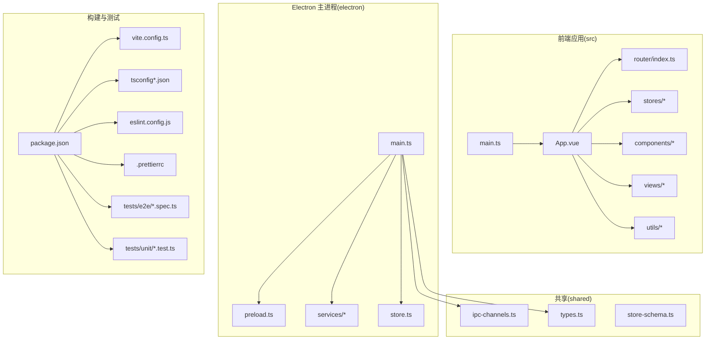
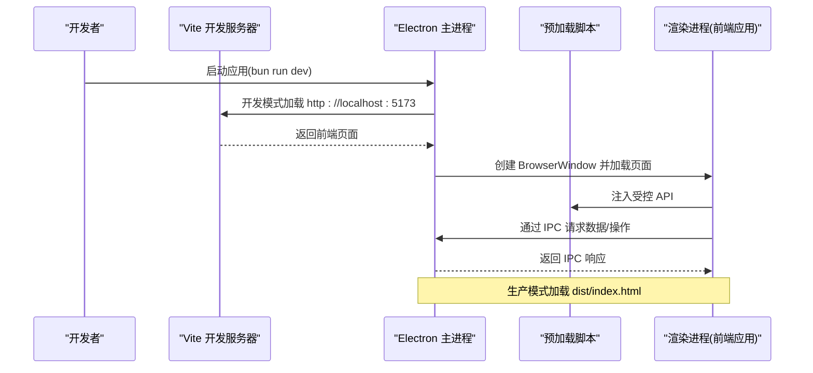
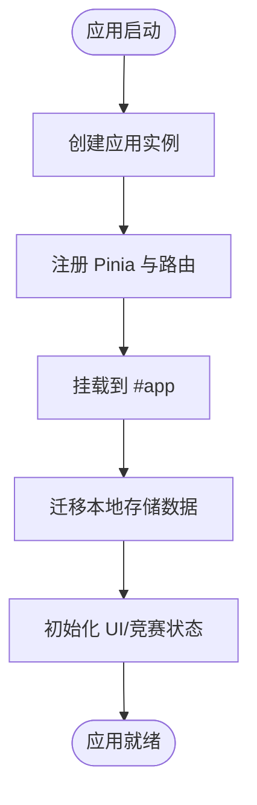
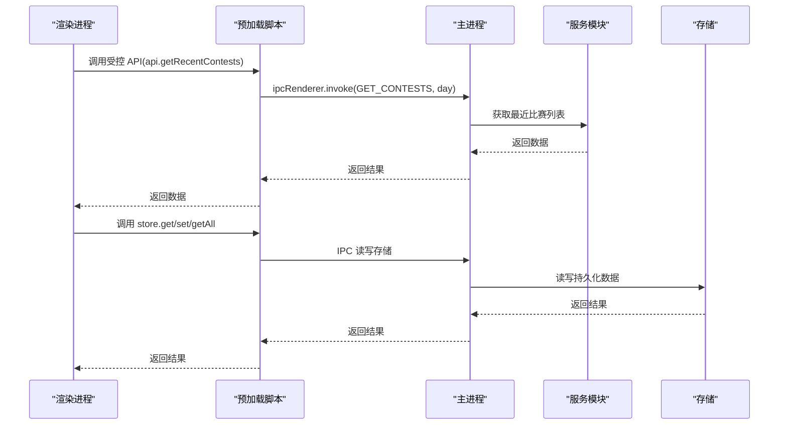
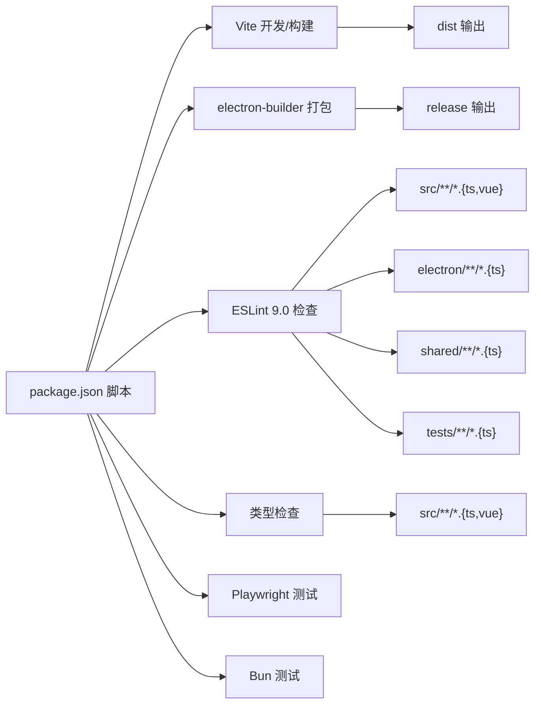

# 开发指南

<cite>
**本文引用的文件**
- [package.json](file://package.json)
- [README.md](file://README.md)
- [vite.config.ts](file://vite.config.ts)
- [tsconfig.json](file://tsconfig.json)
- [tsconfig.node.json](file://tsconfig.node.json)
- [tsconfig.electron.json](file://tsconfig.electron.json)
- [.bunfig.toml](file://.bunfig.toml)
- [.prettierrc](file://.prettierrc)
- [eslint.config.js](file://eslint.config.js)
- [src/main.ts](file://src/main.ts)
- [src/App.vue](file://src/App.vue)
- [electron/main.ts](file://electron/main.ts)
- [electron/preload.ts](file://electron/preload.ts)
- [tests/e2e/app.spec.ts](file://tests/e2e/app.spec.ts)
- [tests/unit/layout.test.ts](file://tests/unit/layout.test.ts)
</cite>

## 目录
1. [引言](#引言)
2. [项目结构](#项目结构)
3. [核心组件](#核心组件)
4. [架构总览](#架构总览)
5. [详细组件分析](#详细组件分析)
6. [依赖分析](#依赖分析)
7. [性能考虑](#性能考虑)
8. [故障排查指南](#故障排查指南)
9. [结论](#结论)
10. [附录](#附录)

## 引言
本开发指南面向新加入的开发者，提供从环境搭建到日常开发、测试、调试与质量保障的完整流程说明。项目采用 Electron + Vue 3 + TypeScript + Vite + Bun 的现代化技术栈，结合 Playwright 进行端到端测试，配合 ESLint 9.0 与 Prettier 以及完整的 TypeScript 类型检查保障代码质量。

**更新** 本版本反映了开发工具链现代化升级：引入了全新的 ESLint 9.0 平面配置文件、完整的 TypeScript 支持配置体系，以及现代化的代码质量保障流程。

## 项目结构
项目采用"前端应用 + Electron 主进程 + 共享类型/通道"的分层组织方式：
- 前端应用位于 src，包含路由、状态、视图、组件、样式与工具模块
- Electron 主进程位于 electron，包含主进程、预加载脚本与服务模块
- 共享模块位于 shared，包含 IPC 通道常量与通用类型
- 测试位于 tests，包含单元测试与端到端测试
- 构建与脚本由 package.json 管理，Vite 作为开发服务器与打包器

**图表来源**
- [src/main.ts:1-26](file://src/main.ts#L1-L26)
- [src/App.vue:1-23](file://src/App.vue#L1-L23)
- [electron/main.ts:1-493](file://electron/main.ts#L1-L493)
- [electron/preload.ts:1-38](file://electron/preload.ts#L1-L38)
- [package.json:1-127](file://package.json#L1-L127)
- [vite.config.ts:1-15](file://vite.config.ts#L1-L15)
- [tsconfig.json:1-26](file://tsconfig.json#L1-L26)
- [tsconfig.node.json:1-10](file://tsconfig.node.json#L1-L10)
- [tsconfig.electron.json:1-26](file://tsconfig.electron.json#L1-L26)
- [eslint.config.js:1-40](file://eslint.config.js#L1-L40)
- [.prettierrc:1-11](file://.prettierrc#L1-L11)
- [tests/e2e/app.spec.ts:1-190](file://tests/e2e/app.spec.ts#L1-L190)
- [tests/unit/layout.test.ts:1-107](file://tests/unit/layout.test.ts#L1-L107)

**章节来源**
- [package.json:1-127](file://package.json#L1-L127)
- [vite.config.ts:1-15](file://vite.config.ts#L1-L15)
- [tsconfig.json:1-26](file://tsconfig.json#L1-L26)
- [tsconfig.node.json:1-10](file://tsconfig.node.json#L1-L10)
- [tsconfig.electron.json:1-26](file://tsconfig.electron.json#L1-L26)

## 核心组件
- 应用入口与初始化
  - 前端入口：在应用挂载后执行数据迁移与状态初始化，确保 UI 与竞赛数据存储在应用启动后可用
  - 参考路径：[src/main.ts:1-26](file://src/main.ts#L1-L26)
- 应用根组件
  - 根组件负责全局 Provider 包裹与主题注入，确保 UI 组件与消息/对话框上下文可用
  - 参考路径：[src/App.vue:1-23](file://src/App.vue#L1-L23)
- Electron 主进程
  - 负责窗口创建、开发/生产加载策略、IPC 处理、更新检测与下载、外部链接处理、存储访问等
  - 参考路径：[electron/main.ts:1-493](file://electron/main.ts#L1-L493)
- 预加载脚本
  - 通过 contextBridge 暴露受控 API 至渲染进程，避免直接暴露 ipcRenderer
  - 参考路径：[electron/preload.ts:1-38](file://electron/preload.ts#L1-L38)

**章节来源**
- [src/main.ts:1-26](file://src/main.ts#L1-L26)
- [src/App.vue:1-23](file://src/App.vue#L1-L23)
- [electron/main.ts:1-493](file://electron/main.ts#L1-L493)
- [electron/preload.ts:1-38](file://electron/preload.ts#L1-L38)

## 架构总览
下图展示了开发与运行时的关键交互：Vite 开发服务器与 Electron 主进程协同启动；渲染进程通过预加载脚本调用主进程提供的 IPC 能力；构建阶段分别编译前端与 Electron 源码并打包。

**图表来源**
- [package.json:34-54](file://package.json#L34-L54)
- [vite.config.ts:7-10](file://vite.config.ts#L7-L10)
- [electron/main.ts:354-385](file://electron/main.ts#L354-L385)
- [electron/preload.ts:1-38](file://electron/preload.ts#L1-L38)

## 详细组件分析

### 前端应用初始化流程
- 初始化顺序：创建应用实例 → 注册 Pinia 与路由 → 挂载应用 → 数据迁移与状态初始化
- 关键点：迁移逻辑与状态初始化在挂载后异步执行，确保 UI 可用且数据已就绪

**图表来源**
- [src/main.ts:10-26](file://src/main.ts#L10-L26)

**章节来源**
- [src/main.ts:1-26](file://src/main.ts#L1-L26)

### Electron 主进程与 IPC 通道
- 窗口创建：开发模式加载本地 Vite 页面，生产模式加载打包后的页面；启用开发者工具
- IPC 处理：提供获取比赛、获取 Rating、获取解题数、打开外部链接、安装更新、读写存储等接口
- 更新机制：启动时拉取更新清单，比较版本，弹窗提示并下载安装包
- 预加载：通过 contextBridge 暴露受控 API，避免直接暴露 ipcRenderer

**图表来源**
- [electron/preload.ts:5-31](file://electron/preload.ts#L5-L31)
- [electron/main.ts:396-485](file://electron/main.ts#L396-L485)
- [shared/ipc-channels.ts:1-200](file://shared/ipc-channels.ts#L1-L200)

**章节来源**
- [electron/main.ts:1-493](file://electron/main.ts#L1-L493)
- [electron/preload.ts:1-38](file://electron/preload.ts#L1-L38)

### 测试策略与用例
- 端到端测试（Playwright）
  - 启动 Electron 应用，等待主窗口加载，断言页面标题与交互行为
  - 断言收藏页面的批量选择、分页与删除流程
  - 参考路径：[tests/e2e/app.spec.ts:1-190](file://tests/e2e/app.spec.ts#L1-L190)
- 单元测试（Bun + Vue Test Utils）
  - 挂载组件，使用 Stubs 替换第三方组件，断言布局与响应式行为
  - 示例：SolvedNumPage 响应式栅格列数、StatsPanel 在不同宽度下的类名
  - 参考路径：[tests/unit/layout.test.ts:1-107](file://tests/unit/layout.test.ts#L1-L107)

**章节来源**
- [tests/e2e/app.spec.ts:1-190](file://tests/e2e/app.spec.ts#L1-L190)
- [tests/unit/layout.test.ts:1-107](file://tests/unit/layout.test.ts#L1-L107)

## 依赖分析
- 构建与运行
  - Vite 作为开发服务器与打包器，严格端口与相对路径配置确保打包后不出现白屏
  - Bun 作为包管理与运行时，可选镜像源加速
- 类型系统
  - tsconfig.json 配置严格模式与 ESNext 模块解析，包含 src 与 shared 下的 TS/TSX/Vue 文件
  - tsconfig.node.json 用于 Vite 配置类型检查
  - tsconfig.electron.json 用于 Electron 源码编译，输出至 electron-dist
- 代码质量
  - eslint.config.js 采用 ESLint 9.0 平面配置，支持 JavaScript/TypeScript/Vue 全栈检查
  - .prettierrc 提供统一的代码格式化规则
  - package.json 中定义了开发、构建、打包、测试、格式化与类型检查脚本
  - electron-builder 支持多平台打包，配置产物目录与图标

**图表来源**
- [package.json:34-54](file://package.json#L34-L54)
- [vite.config.ts:1-15](file://vite.config.ts#L1-L15)
- [tsconfig.json:17-24](file://tsconfig.json#L17-L24)
- [tsconfig.node.json:1-10](file://tsconfig.node.json#L1-L10)
- [tsconfig.electron.json:16-24](file://tsconfig.electron.json#L16-L24)
- [eslint.config.js:1-40](file://eslint.config.js#L1-L40)
- [.prettierrc:1-11](file://.prettierrc#L1-L11)

**章节来源**
- [package.json:1-127](file://package.json#L1-L127)
- [vite.config.ts:1-15](file://vite.config.ts#L1-L15)
- [tsconfig.json:1-26](file://tsconfig.json#L1-L26)
- [tsconfig.node.json:1-10](file://tsconfig.node.json#L1-L10)
- [tsconfig.electron.json:1-26](file://tsconfig.electron.json#L1-L26)
- [.bunfig.toml:1-2](file://.bunfig.toml#L1-L2)
- [.prettierrc:1-11](file://.prettierrc#L1-L11)
- [eslint.config.js:1-40](file://eslint.config.js#L1-L40)

## 性能考虑
- 开发体验
  - Vite 严格端口与相对路径配置，避免打包后资源路径问题导致白屏
  - 开发模式自动打开开发者工具，便于前端与主进程联调
- 构建优化
  - 分离前端与 Electron 源码的编译配置，减少不必要的类型检查范围
  - 使用 electron-builder 的多目标打包，按平台优化产物体积与格式
- 运行时优化
  - 预加载脚本仅暴露必要 API，降低安全风险与上下文污染
  - IPC 参数校验与超时控制，提升稳定性

**章节来源**
- [vite.config.ts:6-14](file://vite.config.ts#L6-L14)
- [electron/main.ts:354-385](file://electron/main.ts#L354-L385)
- [electron/preload.ts:1-38](file://electron/preload.ts#L1-L38)

## 故障排查指南
- 开发服务器端口冲突
  - Vite 配置严格端口，若被占用会直接报错，需释放或调整端口
  - 参考路径：[vite.config.ts:9-10](file://vite.config.ts#L9-L10)
- 打包后页面空白
  - 确认 base 设置为相对路径，避免绝对路径导致静态资源无法加载
  - 参考路径：[vite.config.ts:6](file://vite.config.ts#L6)
- Electron 开发/生产加载异常
  - 开发模式确认 Vite 已启动并监听 5173 端口；生产模式确认 dist/index.html 存在
  - 参考路径：[electron/main.ts:371-376](file://electron/main.ts#L371-L376)
- IPC 参数校验失败
  - 主进程对参数长度与协议进行校验，确保输入合法
  - 参考路径：[electron/main.ts:414-458](file://electron/main.ts#L414-L458)
- 更新检查失败
  - 检查更新清单 URL、网络超时与重试配置，确认版本号规范化
  - 参考路径：[electron/main.ts:292-352](file://electron/main.ts#L292-L352)

**章节来源**
- [vite.config.ts:6-14](file://vite.config.ts#L6-L14)
- [electron/main.ts:354-385](file://electron/main.ts#L354-L385)
- [electron/main.ts:292-352](file://electron/main.ts#L292-L352)

## 结论
本指南提供了从环境搭建到开发、测试、调试与质量保障的全流程说明。建议新开发者优先完成环境准备与基础脚本运行，再逐步深入前端应用与 Electron 主进程的职责边界，配合现代化的 ESLint 9.0 配置、完整的 TypeScript 类型检查与测试套件持续提升代码质量与稳定性。

**更新** 本版本特别强调了现代化开发工具链的使用，包括 ESLint 9.0 的平面配置、完整的 TypeScript 支持体系，以及统一的代码质量保障流程。

## 附录

### 开发环境搭建
- 环境要求
  - Node.js 版本要求与 Bun 运行时
  - 参考路径：[README.md:72-76](file://README.md#L72-L76)
- 安装与启动
  - 安装依赖后运行开发脚本，同时启动 Vite 与 Electron
  - 参考路径：[README.md:86-102](file://README.md#L86-L102), [package.json:34-36](file://package.json#L34-L36)
- 构建与打包
  - 生产构建与多平台打包命令
  - 参考路径：[README.md:104-114](file://README.md#L104-L114), [package.json:41-45](file://package.json#L41-L45)

**章节来源**
- [README.md:72-114](file://README.md#L72-L114)
- [package.json:34-45](file://package.json#L34-L45)

### 代码规范与最佳实践
- TypeScript 编码标准
  - 严格模式、ESNext 模块解析、DOM/ESNext 库、跳过库检查、类型声明
  - 参考路径：[tsconfig.json:2-16](file://tsconfig.json#L2-L16)
- Vue 组件开发规范
  - 使用 <script setup> 语法，合理拆分组件与复用 Provider
  - 参考路径：[src/App.vue:12-19](file://src/App.vue#L12-L19)
- ESLint 9.0 与 Prettier
  - eslint.config.js 采用平面配置，支持 JavaScript/TypeScript/Vue 全栈检查
  - Prettier 统一格式，配置于 .prettierrc
  - 参考路径：[eslint.config.js:1-40](file://eslint.config.js#L1-L40), [.prettierrc:1-11](file://.prettierrc#L1-L11)

**更新** 新增了 ESLint 9.0 平面配置与完整的 TypeScript 支持说明

**章节来源**
- [tsconfig.json:1-26](file://tsconfig.json#L1-L26)
- [src/App.vue:1-23](file://src/App.vue#L1-L23)
- [eslint.config.js:1-40](file://eslint.config.js#L1-L40)
- [.prettierrc:1-11](file://.prettierrc#L1-L11)

### Git 工作流程与分支管理
- 建议流程
  - Fork 仓库 → 新建特性分支 → 提交更改 → 推送分支 → 发起 Pull Request
  - 参考路径：[README.md:136-145](file://README.md#L136-L145)
- 提交前检查
  - 运行类型检查与代码检查脚本
  - 参考路径：[README.md:146-151](file://README.md#L146-L151), [package.json:50-53](file://package.json#L50-L53)

**章节来源**
- [README.md:136-151](file://README.md#L136-L151)
- [package.json:50-53](file://package.json#L50-L53)

### 调试技巧与性能分析
- 前端调试
  - 开发模式自动打开开发者工具，定位组件渲染与状态变更
  - 参考路径：[electron/main.ts:372-373](file://electron/main.ts#L372-L373)
- Electron 主进程调试
  - 使用 Electron DevTools 与日志输出定位 IPC 与服务调用问题
  - 参考路径：[electron/main.ts:354-356](file://electron/main.ts#L354-L356)
- 性能分析
  - 利用 Vite 的热重载与源码映射，结合浏览器性能面板定位瓶颈
  - 参考路径：[vite.config.ts:7-10](file://vite.config.ts#L7-L10)

**章节来源**
- [electron/main.ts:354-385](file://electron/main.ts#L354-L385)
- [vite.config.ts:7-10](file://vite.config.ts#L7-L10)

### 代码审查清单与质量保证
- 代码审查清单
  - 是否通过 ESLint 9.0 平面配置格式化与检查
  - 是否通过类型检查与单元/端到端测试
  - 是否新增必要的 IPC 参数校验与错误分类
  - 是否更新相关文档与变更说明
  - 参考路径：[eslint.config.js:1-40](file://eslint.config.js#L1-L40), [tests/e2e/app.spec.ts:1-190](file://tests/e2e/app.spec.ts#L1-L190), [tests/unit/layout.test.ts:1-107](file://tests/unit/layout.test.ts#L1-L107)
- 质量保证流程
  - 提交前本地执行 lint/format/type-check/test
  - CI/PR 自动化检查（如存在）

**更新** 代码审查清单现在包含了 ESLint 9.0 平面配置的检查要求

**章节来源**
- [eslint.config.js:1-40](file://eslint.config.js#L1-L40)
- [tests/e2e/app.spec.ts:1-190](file://tests/e2e/app.spec.ts#L1-L190)
- [tests/unit/layout.test.ts:1-107](file://tests/unit/layout.test.ts#L1-L107)

### 开发工具链使用
- 热重载与源码映射
  - Vite 提供快速热重载与 Source Map，便于断点调试
  - 参考路径：[vite.config.ts:7-10](file://vite.config.ts#L7-L10)
- 远程调试
  - Electron DevTools 与浏览器开发者工具联动，支持断点与网络监控
  - 参考路径：[electron/main.ts:372-373](file://electron/main.ts#L372-L373)
- 测试工具
  - Playwright 用于端到端测试，Bun 测试用于单元测试
  - 参考路径：[tests/e2e/app.spec.ts:1-190](file://tests/e2e/app.spec.ts#L1-L190), [tests/unit/layout.test.ts:1-107](file://tests/unit/layout.test.ts#L1-L107)

**章节来源**
- [vite.config.ts:7-10](file://vite.config.ts#L7-L10)
- [electron/main.ts:372-373](file://electron/main.ts#L372-L373)
- [tests/e2e/app.spec.ts:1-190](file://tests/e2e/app.spec.ts#L1-L190)
- [tests/unit/layout.test.ts:1-107](file://tests/unit/layout.test.ts#L1-L107)

### 新人融入指南
- 快速上手步骤
  - 克隆仓库 → 安装依赖 → 运行开发脚本 → 修改前端或 Electron 代码 → 观察热重载
  - 参考路径：[README.md:79-102](file://README.md#L79-L102)
- 常见任务
  - 新增页面：在 views 下创建组件并在路由中注册
  - 新增状态：在 stores 下新增 Pinia Store 并在入口初始化
  - 新增 IPC：在 shared 定义通道，在 main.ts 注册 handle，在 preload 暴露 API
  - 参考路径：[src/App.vue:12-19](file://src/App.vue#L12-L19), [src/main.ts:10-26](file://src/main.ts#L10-L26), [electron/main.ts:396-485](file://electron/main.ts#L396-L485), [electron/preload.ts:1-38](file://electron/preload.ts#L1-L38)

**章节来源**
- [README.md:79-102](file://README.md#L79-L102)
- [src/App.vue:12-19](file://src/App.vue#L12-L19)
- [src/main.ts:10-26](file://src/main.ts#L10-L26)
- [electron/main.ts:396-485](file://electron/main.ts#L396-L485)
- [electron/preload.ts:1-38](file://electron/preload.ts#L1-L38)