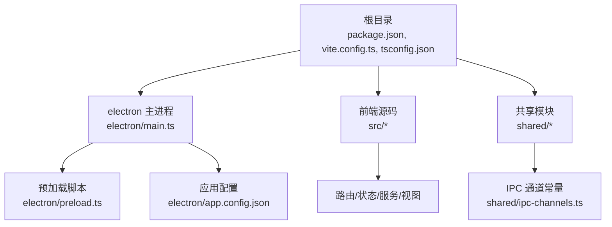
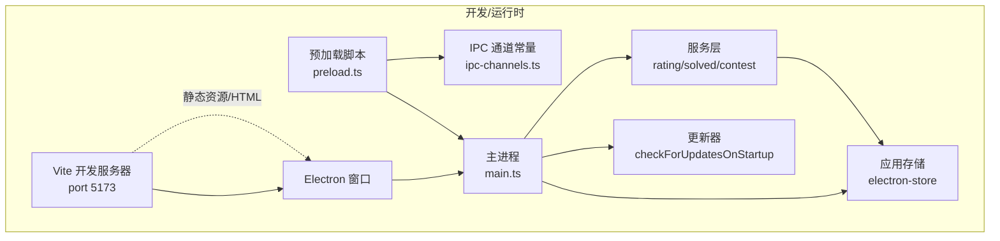
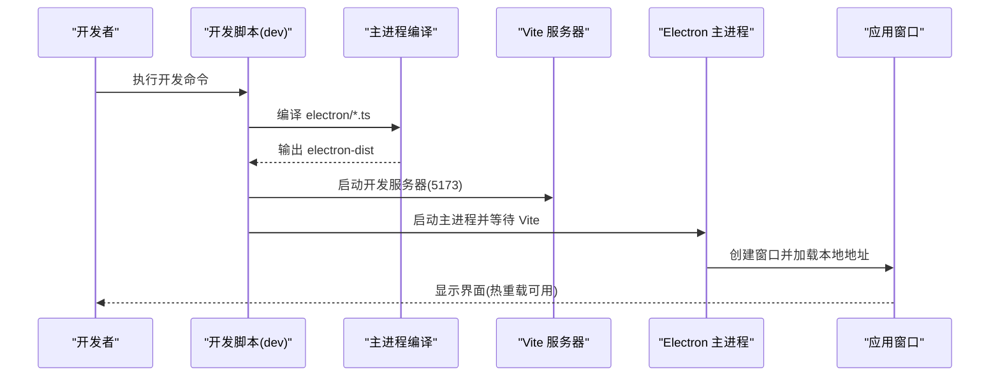
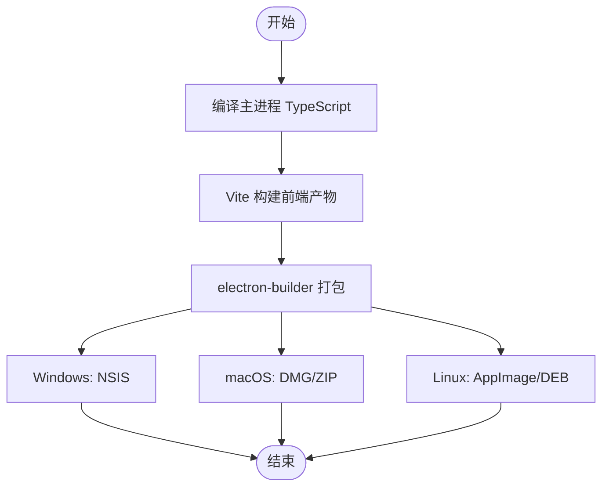
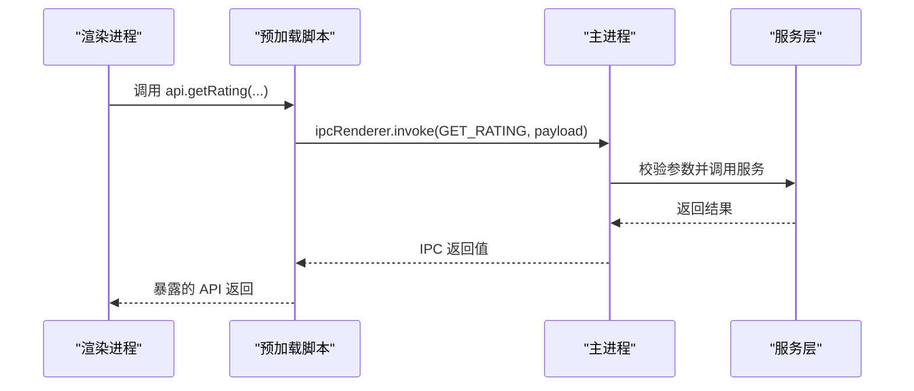
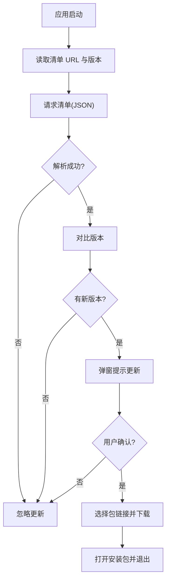
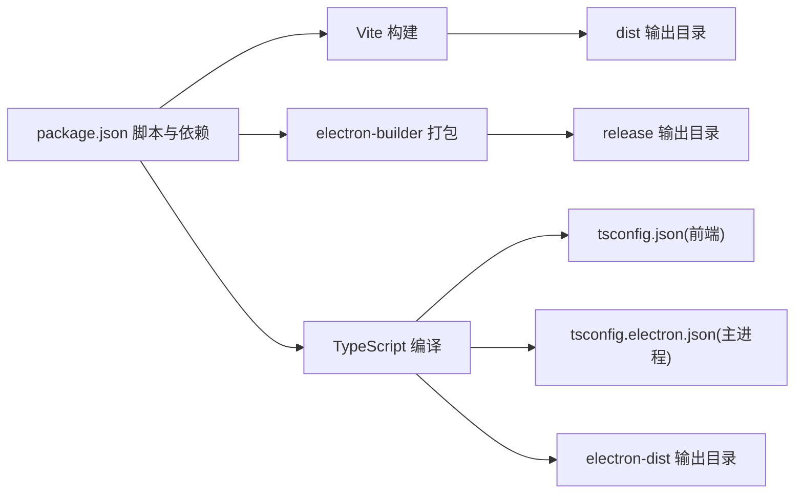

# 快速开始

<cite>
**本文引用的文件**
- [README.md](file://README.md)
- [package.json](file://package.json)
- [vite.config.ts](file://vite.config.ts)
- [.bunfig.toml](file://.bunfig.toml)
- [tsconfig.json](file://tsconfig.json)
- [tsconfig.electron.json](file://tsconfig.electron.json)
- [electron/main.ts](file://electron/main.ts)
- [electron/preload.ts](file://electron/preload.ts)
- [electron/app.config.json](file://electron/app.config.json)
- [shared/ipc-channels.ts](file://shared/ipc-channels.ts)
- [RELEASE_GUIDE.md](file://RELEASE_GUIDE.md)
- [tests/e2e/app.spec.ts](file://tests/e2e/app.spec.ts)
</cite>

## 目录
1. [简介](#简介)
2. [项目结构](#项目结构)
3. [核心组件](#核心组件)
4. [架构总览](#架构总览)
5. [详细组件分析](#详细组件分析)
6. [依赖关系分析](#依赖关系分析)
7. [性能考虑](#性能考虑)
8. [故障排除指南](#故障排除指南)
9. [结论](#结论)
10. [附录](#附录)

## 简介
本指南面向希望快速上手 OJFlow 项目的开发者，覆盖环境要求、安装步骤、开发与生产构建流程、以及常见问题排查。OJFlow 是一个基于 Electron + Vue 3 的现代化算法竞赛辅助工具，使用 Vite + Bun 作为构建与运行时，TypeScript 提供类型安全。

## 项目结构
- 根目录包含项目元信息与脚本配置，如包管理、构建与打包脚本、构建产物输出目录等。
- electron 子目录存放主进程、预加载脚本与配置，负责应用窗口、IPC 通信、更新机制与存储。
- src 子目录为前端源码，包含路由、状态、服务、视图与国际化等模块。
- shared 子目录包含共享常量与类型定义，如 IPC 通道名。
- docs 与 tests 子目录分别存放文档与单元/端到端测试。

图表来源
- [package.json:1-127](file://package.json#L1-L127)
- [vite.config.ts:1-15](file://vite.config.ts#L1-L15)
- [electron/main.ts:1-493](file://electron/main.ts#L1-L493)
- [electron/preload.ts:1-38](file://electron/preload.ts#L1-L38)
- [electron/app.config.json:1-62](file://electron/app.config.json#L1-L62)
- [shared/ipc-channels.ts:1-53](file://shared/ipc-channels.ts#L1-L53)

章节来源
- [README.md:70-115](file://README.md#L70-L115)
- [package.json:34-54](file://package.json#L34-L54)
- [vite.config.ts:4-15](file://vite.config.ts#L4-L15)

## 核心组件
- 开发服务器与 Electron 启动：通过开发脚本同时启动 Vite 开发服务器与 Electron 应用窗口，实现热重载与原生应用体验的结合。
- 构建与打包：前端构建由 Vite 完成，主进程 TypeScript 由独立 tsconfig 编译；最终通过 electron-builder 多平台打包。
- IPC 通信：通过预加载脚本暴露受控 API 至渲染进程，并在主进程中注册对应处理函数。
- 更新机制：启动时根据配置拉取更新清单，判断版本并引导下载安装包或外部链接。

章节来源
- [package.json:34-54](file://package.json#L34-L54)
- [electron/main.ts:354-493](file://electron/main.ts#L354-L493)
- [electron/preload.ts:1-38](file://electron/preload.ts#L1-L38)
- [shared/ipc-channels.ts:1-53](file://shared/ipc-channels.ts#L1-L53)

## 架构总览
下图展示了开发与运行时的整体交互：Vite 开发服务器提供前端资源，Electron 主进程创建窗口并加载前端页面；预加载脚本通过 IPC 与主进程通信，实现数据获取、打开链接与更新安装等功能。

图表来源
- [vite.config.ts:7-10](file://vite.config.ts#L7-L10)
- [electron/main.ts:354-493](file://electron/main.ts#L354-L493)
- [electron/preload.ts:1-38](file://electron/preload.ts#L1-L38)
- [shared/ipc-channels.ts:1-53](file://shared/ipc-channels.ts#L1-L53)

## 详细组件分析

### 开发环境启动机制
- 开发脚本会先编译主进程 TypeScript，再并发启动 Vite 与 Electron。Vite 在本地端口提供开发资源，Electron 在开发模式下加载本地地址并开启调试工具。
- 若端口被占用，严格端口策略可避免自动换端导致的连接异常。

图表来源
- [package.json:36](file://package.json#L36)
- [vite.config.ts:7-10](file://vite.config.ts#L7-L10)
- [electron/main.ts:371-384](file://electron/main.ts#L371-L384)

章节来源
- [README.md:94-102](file://README.md#L94-L102)
- [package.json:34-54](file://package.json#L34-L54)
- [vite.config.ts:4-15](file://vite.config.ts#L4-L15)

### 生产构建与多平台打包
- 构建顺序：先编译主进程，再构建前端，最后调用 electron-builder 执行打包。
- 多平台目标：
  - Windows：NSIS 安装包
  - macOS：DMG 与 ZIP
  - Linux：AppImage 与 DEB
- 构建脚本与产物输出目录由 package.json 与构建配置共同决定。

图表来源
- [package.json:41-45](file://package.json#L41-L45)
- [package.json:94-125](file://package.json#L94-L125)

章节来源
- [README.md:104-114](file://README.md#L104-L114)
- [package.json:34-54](file://package.json#L34-L54)

### IPC 通道与预加载桥接
- 预加载脚本通过 contextBridge 暴露受限 API 至渲染进程，包括获取比赛、评分、解题数、打开外部链接与安装更新等。
- 主进程在 ipcMain 中注册对应处理函数，统一参数校验与错误处理。

图表来源
- [electron/preload.ts:1-38](file://electron/preload.ts#L1-L38)
- [shared/ipc-channels.ts:1-53](file://shared/ipc-channels.ts#L1-L53)
- [electron/main.ts:396-466](file://electron/main.ts#L396-L466)

章节来源
- [electron/preload.ts:1-38](file://electron/preload.ts#L1-L38)
- [shared/ipc-channels.ts:1-53](file://shared/ipc-channels.ts#L1-L53)
- [electron/main.ts:396-466](file://electron/main.ts#L396-L466)

### 更新机制与启动检查
- 启动时根据清单 URL 拉取最新版本信息，比较版本号后弹窗提示更新。
- 支持按平台选择包链接或回退到主页链接；下载完成后自动打开并退出应用。

图表来源
- [electron/main.ts:292-352](file://electron/main.ts#L292-L352)
- [electron/main.ts:227-290](file://electron/main.ts#L227-L290)

章节来源
- [electron/main.ts:292-352](file://electron/main.ts#L292-L352)
- [electron/main.ts:227-290](file://electron/main.ts#L227-L290)

## 依赖关系分析
- 包管理与镜像：默认使用国内 npm 镜像源，提升安装速度。
- TypeScript 配置：前端与主进程分别使用独立 tsconfig，确保类型检查与输出目录分离。
- 构建工具链：Vite 负责前端开发与构建，electron-builder 负责多平台打包，主进程使用独立编译输出目录。

图表来源
- [package.json:34-54](file://package.json#L34-L54)
- [tsconfig.json:1-26](file://tsconfig.json#L1-L26)
- [tsconfig.electron.json:1-26](file://tsconfig.electron.json#L1-L26)
- [vite.config.ts:11-14](file://vite.config.ts#L11-L14)

章节来源
- [.bunfig.toml:1-2](file://.bunfig.toml#L1-L2)
- [tsconfig.json:1-26](file://tsconfig.json#L1-L26)
- [tsconfig.electron.json:1-26](file://tsconfig.electron.json#L1-L26)
- [vite.config.ts:11-14](file://vite.config.ts#L11-L14)

## 性能考虑
- 资源路径：Vite 配置使用相对路径，避免打包后资源加载异常。
- 端口策略：严格端口避免端口冲突带来的反复尝试与失败。
- 构建优化：合理拆分前端与主进程编译，缩短二次构建时间。
- 更新重试：下载与清单请求具备超时与指数退避策略，提升网络不稳定场景下的成功率。

章节来源
- [vite.config.ts:6](file://vite.config.ts#L6)
- [vite.config.ts:9](file://vite.config.ts#L9)
- [electron/main.ts:176-225](file://electron/main.ts#L176-L225)

## 故障排除指南
- 端口占用导致开发失败
  - 现象：开发脚本启动时报端口冲突。
  - 处理：释放端口或关闭占用进程；严格端口策略可帮助快速定位问题。
  - 参考：[vite.config.ts:9](file://vite.config.ts#L9)
- 依赖安装缓慢或失败
  - 现象：安装阶段耗时长或失败。
  - 处理：使用 Bun 并启用国内镜像源；必要时切换 npm/pnpm。
  - 参考：[README.md:72-76](file://README.md#L72-L76)，[.bunfig.toml:1-2](file://.bunfig.toml#L1-L2)
- 构建产物路径异常导致白屏
  - 现象：打包后页面空白。
  - 处理：确保 Vite 基础路径为相对路径。
  - 参考：[vite.config.ts:6](file://vite.config.ts#L6)
- 更新下载失败或超时
  - 现象：更新弹窗后下载中断或失败。
  - 处理：检查网络与代理；适当调整超时与重试参数；确认清单 URL 与包链接有效。
  - 参考：[electron/main.ts:227-290](file://electron/main.ts#L227-L290)
- 测试与端到端验证
  - 使用 Playwright 进行端到端测试，验证窗口加载、页面元素与交互行为。
  - 参考：[tests/e2e/app.spec.ts:1-190](file://tests/e2e/app.spec.ts#L1-L190)

章节来源
- [vite.config.ts:6-10](file://vite.config.ts#L6-L10)
- [README.md:72-76](file://README.md#L72-L76)
- [.bunfig.toml:1-2](file://.bunfig.toml#L1-L2)
- [electron/main.ts:227-290](file://electron/main.ts#L227-L290)
- [tests/e2e/app.spec.ts:1-190](file://tests/e2e/app.spec.ts#L1-L190)

## 结论
通过本指南，您可以基于 Node.js 与 Bun 环境快速搭建并运行 OJFlow 开发环境，理解开发服务器与 Electron 的协同机制，并掌握多平台生产构建流程。遇到问题时，可依据故障排除章节快速定位与修复。建议在开发过程中配合测试用例与类型检查，确保代码质量与稳定性。

## 附录
- 快速开始步骤
  - 克隆仓库、安装依赖、启动开发、构建与打包、运行测试。
  - 参考：[README.md:77-114](file://README.md#L77-L114)
- 版本发布流程（自动化）
  - 通过 Git Tag 触发 GitHub Actions，自动多平台构建并创建 Release。
  - 参考：[RELEASE_GUIDE.md:1-98](file://RELEASE_GUIDE.md#L1-L98)