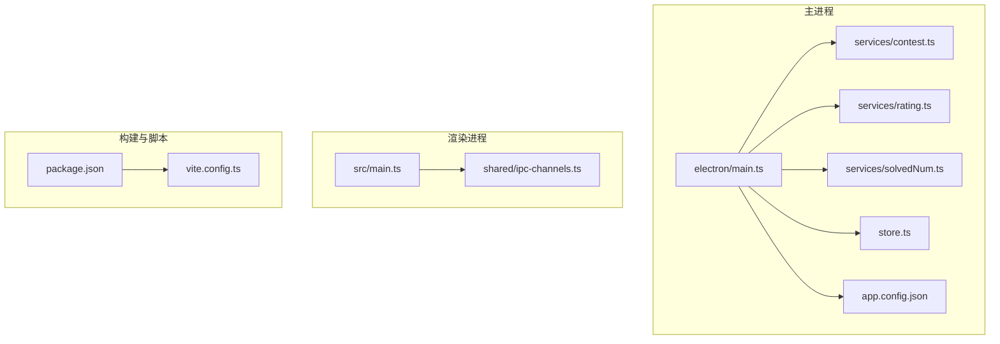
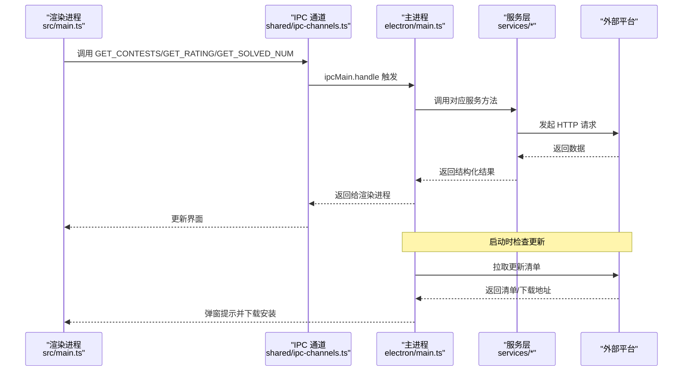
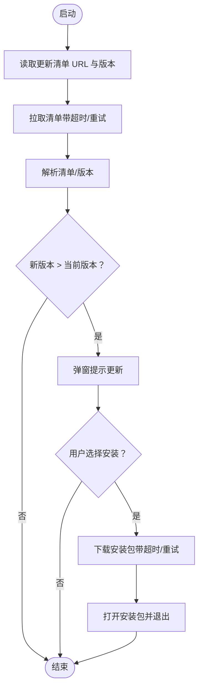
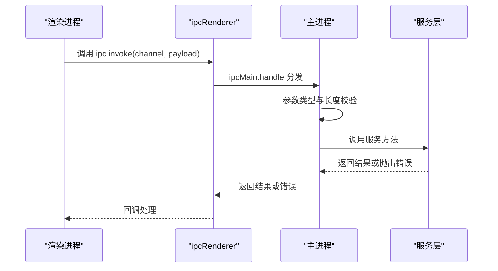
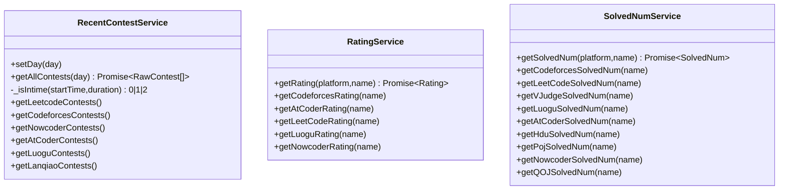
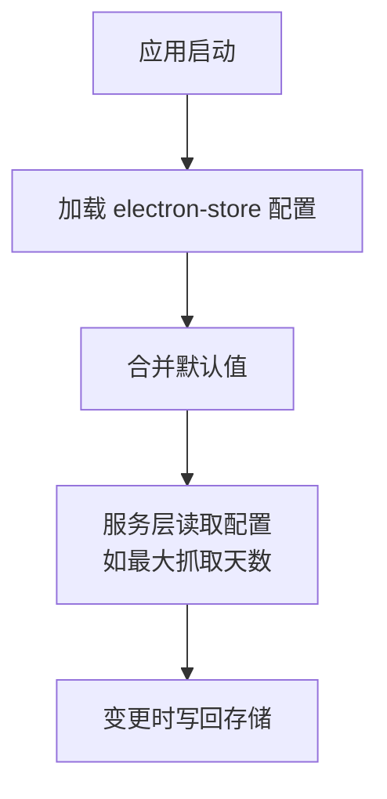
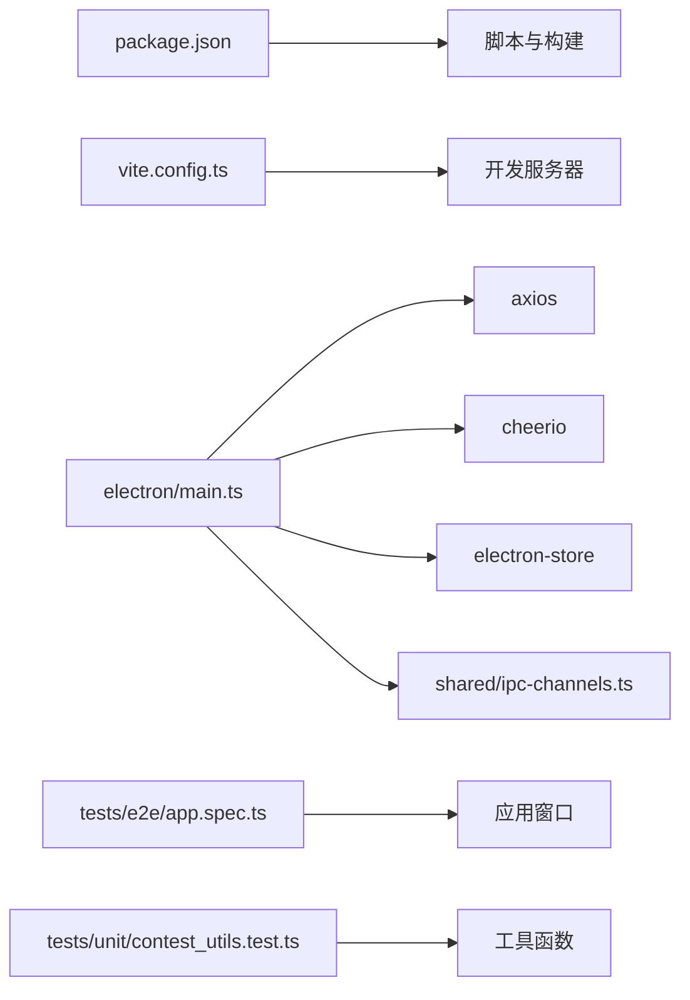

# 故障排除

<cite>
**本文引用的文件**
- [README.md](file://README.md)
- [package.json](file://package.json)
- [vite.config.ts](file://vite.config.ts)
- [electron/main.ts](file://electron/main.ts)
- [electron/app.config.json](file://electron/app.config.json)
- [electron/services/contest.ts](file://electron/services/contest.ts)
- [electron/services/rating.ts](file://electron/services/rating.ts)
- [electron/services/solvedNum.ts](file://electron/services/solvedNum.ts)
- [shared/ipc-channels.ts](file://shared/ipc-channels.ts)
- [electron/store.ts](file://electron/store.ts)
- [src/main.ts](file://src/main.ts)
- [tests/e2e/app.spec.ts](file://tests/e2e/app.spec.ts)
- [tests/unit/contest_utils.test.ts](file://tests/unit/contest_utils.test.ts)
</cite>

## 目录
1. [简介](#简介)
2. [项目结构](#项目结构)
3. [核心组件](#核心组件)
4. [架构总览](#架构总览)
5. [详细组件分析](#详细组件分析)
6. [依赖关系分析](#依赖关系分析)
7. [性能考虑](#性能考虑)
8. [故障排除指南](#故障排除指南)
9. [结论](#结论)
10. [附录](#附录)

## 简介
本指南面向 OJFlow 用户与维护者，提供系统化的故障排除方法，覆盖安装、运行时错误、网络与性能问题，并给出日志分析、错误信息解读、跨平台差异处理、性能优化与资源监控建议，以及自助排查工具与问题反馈流程。

## 项目结构
OJFlow 采用 Electron + Vue 3 前后端分离架构：
- 主进程负责应用生命周期、更新器、IPC 通道、存储与外部链接打开。
- 渲染进程负责 UI、路由、状态管理与视图。
- 服务层封装各 OJ 平台的数据抓取与解析逻辑。
- 构建与脚本由 Vite + Bun 管理，打包目标包含 Windows/macOS/Linux 多平台。

**图表来源**
- [electron/main.ts:1-493](file://electron/main.ts#L1-L493)
- [electron/services/contest.ts:1-270](file://electron/services/contest.ts#L1-L270)
- [electron/services/rating.ts:1-175](file://electron/services/rating.ts#L1-L175)
- [electron/services/solvedNum.ts:1-198](file://electron/services/solvedNum.ts#L1-L198)
- [electron/store.ts:1-31](file://electron/store.ts#L1-L31)
- [electron/app.config.json:1-62](file://electron/app.config.json#L1-L62)
- [src/main.ts:1-26](file://src/main.ts#L1-L26)
- [shared/ipc-channels.ts:1-53](file://shared/ipc-channels.ts#L1-L53)
- [package.json:1-127](file://package.json#L1-L127)
- [vite.config.ts:1-15](file://vite.config.ts#L1-L15)

**章节来源**
- [README.md:1-162](file://README.md#L1-L162)
- [package.json:1-127](file://package.json#L1-L127)
- [vite.config.ts:1-15](file://vite.config.ts#L1-L15)
- [src/main.ts:1-26](file://src/main.ts#L1-L26)
- [electron/main.ts:1-493](file://electron/main.ts#L1-L493)

## 核心组件
- 主进程与 IPC
  - 主进程注册 IPC 通道，处理“近期比赛”“评分”“解题数”“打开链接”“更新安装”“存储读写”等请求。
  - 参数校验与超时重试策略贯穿网络请求，错误分类用于区分超时与网络异常。
- 服务层
  - 比赛服务：统一抓取多个平台的近期比赛，按时间窗口过滤。
  - 评分服务：按平台解析用户 Rating 与历史最大值。
  - 解题数服务：按平台解析已解决问题数量。
- 存储与配置
  - electron-store 管理用户配置、收藏、缓存等；默认配置包含主题、语言、平台选择、最大抓取天数等。
  - app.config.json 提供爬取天数范围、提示延迟、主题设计令牌与国际化默认值。
- 构建与运行
  - Vite 开发服务器端口固定，避免端口冲突；生产构建输出 dist。
  - 包管理脚本支持开发、打包与多平台发布。

**章节来源**
- [shared/ipc-channels.ts:1-53](file://shared/ipc-channels.ts#L1-L53)
- [electron/main.ts:396-486](file://electron/main.ts#L396-L486)
- [electron/services/contest.ts:1-270](file://electron/services/contest.ts#L1-L270)
- [electron/services/rating.ts:1-175](file://electron/services/rating.ts#L1-L175)
- [electron/services/solvedNum.ts:1-198](file://electron/services/solvedNum.ts#L1-L198)
- [electron/store.ts:1-31](file://electron/store.ts#L1-L31)
- [electron/app.config.json:1-62](file://electron/app.config.json#L1-L62)
- [vite.config.ts:1-15](file://vite.config.ts#L1-L15)
- [package.json:34-54](file://package.json#L34-L54)

## 架构总览
下图展示从渲染进程发起请求到主进程调用服务与平台接口的整体流程，以及更新器在启动时的检查流程。

**图表来源**
- [src/main.ts:1-26](file://src/main.ts#L1-L26)
- [shared/ipc-channels.ts:1-53](file://shared/ipc-channels.ts#L1-L53)
- [electron/main.ts:396-486](file://electron/main.ts#L396-L486)
- [electron/services/contest.ts:255-266](file://electron/services/contest.ts#L255-L266)
- [electron/services/rating.ts:156-171](file://electron/services/rating.ts#L156-L171)
- [electron/services/solvedNum.ts:166-194](file://electron/services/solvedNum.ts#L166-L194)

## 详细组件分析

### 组件A：更新器与网络请求
- 超时与重试
  - 支持可配置超时、重试次数与指数退避。
  - 对 HTTP 错误与网络异常进行分类，区分超时与网络不可达。
- 下载与安装
  - 支持按平台选择包或回退到主页链接；下载完成后自动打开并退出应用。
- 启动检查
  - 应用启动后延时触发更新检查，比较版本号决定是否提示更新。

**图表来源**
- [electron/main.ts:292-352](file://electron/main.ts#L292-L352)
- [electron/main.ts:176-225](file://electron/main.ts#L176-L225)
- [electron/main.ts:227-290](file://electron/main.ts#L227-L290)

**章节来源**
- [electron/main.ts:115-167](file://electron/main.ts#L115-L167)
- [electron/main.ts:176-225](file://electron/main.ts#L176-L225)
- [electron/main.ts:227-290](file://electron/main.ts#L227-L290)
- [electron/main.ts:292-352](file://electron/main.ts#L292-L352)

### 组件B：IPC 通道与参数校验
- 通道定义
  - GET_CONTESTS、GET_RATING、GET_SOLVED_NUM、OPEN_URL、UPDATER_INSTALL、STORE_* 等。
- 参数校验
  - 平台与用户名长度限制，URL 协议白名单仅允许 http/https。
- 错误传播
  - 服务层抛出的错误会透传至渲染进程，便于统一处理与提示。

**图表来源**
- [shared/ipc-channels.ts:1-53](file://shared/ipc-channels.ts#L1-L53)
- [electron/main.ts:396-486](file://electron/main.ts#L396-L486)

**章节来源**
- [shared/ipc-channels.ts:1-53](file://shared/ipc-channels.ts#L1-L53)
- [electron/main.ts:396-486](file://electron/main.ts#L396-L486)

### 组件C：服务层（比赛/评分/解题数）
- 比赛服务
  - 统一抓取多个平台的近期比赛，按默认/指定天数计算查询截止时间，过滤未开始/已结束的比赛。
- 评分服务
  - 按平台解析当前与历史最大 Rating。
- 解题数服务
  - 按平台解析已解决问题数量，部分平台使用 GraphQL 或 HTML 解析。

**图表来源**
- [electron/services/contest.ts:12-267](file://electron/services/contest.ts#L12-L267)
- [electron/services/rating.ts:5-172](file://electron/services/rating.ts#L5-L172)
- [electron/services/solvedNum.ts:5-195](file://electron/services/solvedNum.ts#L5-L195)

**章节来源**
- [electron/services/contest.ts:29-46](file://electron/services/contest.ts#L29-L46)
- [electron/services/contest.ts:255-266](file://electron/services/contest.ts#L255-L266)
- [electron/services/rating.ts:156-171](file://electron/services/rating.ts#L156-L171)
- [electron/services/solvedNum.ts:166-194](file://electron/services/solvedNum.ts#L166-L194)

### 组件D：存储与配置
- 默认配置
  - 主题方案、颜色模式、语言、平台选择、最大抓取天数、收藏列表、用户名映射、缓存等。
- 配置来源
  - electron-store 读写持久化配置；app.config.json 提供运行时参数默认值。

**图表来源**
- [electron/store.ts:1-31](file://electron/store.ts#L1-L31)
- [electron/app.config.json:1-62](file://electron/app.config.json#L1-L62)
- [electron/services/contest.ts:24-27](file://electron/services/contest.ts#L24-L27)

**章节来源**
- [electron/store.ts:1-31](file://electron/store.ts#L1-L31)
- [electron/app.config.json:1-62](file://electron/app.config.json#L1-L62)

## 依赖关系分析
- 构建与脚本
  - package.json 定义开发、构建、打包与测试脚本；Vite 配置确保资源相对路径与严格端口。
- 主进程依赖
  - axios、cheerio、electron-store、electron 等；IPC 通道集中定义于共享模块。
- 测试
  - E2E 与单元测试分别验证应用启动、设置页交互与工具函数行为。

**图表来源**
- [package.json:34-54](file://package.json#L34-L54)
- [vite.config.ts:1-15](file://vite.config.ts#L1-L15)
- [electron/main.ts:19-26](file://electron/main.ts#L19-L26)
- [shared/ipc-channels.ts:1-53](file://shared/ipc-channels.ts#L1-L53)
- [tests/e2e/app.spec.ts:1-190](file://tests/e2e/app.spec.ts#L1-L190)
- [tests/unit/contest_utils.test.ts:1-35](file://tests/unit/contest_utils.test.ts#L1-L35)

**章节来源**
- [package.json:34-54](file://package.json#L34-L54)
- [vite.config.ts:1-15](file://vite.config.ts#L1-L15)
- [tests/e2e/app.spec.ts:1-190](file://tests/e2e/app.spec.ts#L1-L190)
- [tests/unit/contest_utils.test.ts:1-35](file://tests/unit/contest_utils.test.ts#L1-L35)

## 性能考虑
- 网络请求
  - 使用超时与重试策略降低偶发失败影响；对 5xx 错误进行指数退避。
  - 对外部平台接口采用并发请求以缩短等待时间（比赛服务内部使用 Promise.all）。
- 资源路径
  - Vite 基础路径设为相对路径，避免打包后静态资源加载失败。
- 端口与热重载
  - 开发端口严格固定，避免端口冲突导致的反复重启。
- 存储与缓存
  - electron-store 作为持久化存储，建议合理使用缓存字段减少重复抓取。

**章节来源**
- [electron/services/contest.ts:257-266](file://electron/services/contest.ts#L257-L266)
- [electron/main.ts:176-225](file://electron/main.ts#L176-L225)
- [vite.config.ts:6-10](file://vite.config.ts#L6-L10)
- [electron/store.ts:1-31](file://electron/store.ts#L1-L31)

## 故障排除指南

### 一、安装与环境问题
- 环境要求
  - Node.js 版本需满足最低要求；推荐使用 Bun 以获得更快的安装与运行速度。
- 依赖安装失败
  - 清理缓存后重试；确认网络可达性；必要时切换 npm/pnpm。
- 构建失败
  - 确认 Vite 严格端口配置未被占用；检查基础路径设置是否正确。
- 多平台构建
  - 使用脚本分别针对 Windows/macOS/Linux 执行构建；确保平台依赖与签名配置就绪。

**章节来源**
- [README.md:72-114](file://README.md#L72-L114)
- [package.json:34-54](file://package.json#L34-L54)
- [vite.config.ts:6-10](file://vite.config.ts#L6-L10)

### 二、运行时错误与崩溃
- 应用无法启动
  - 检查主进程窗口加载路径：开发模式加载本地地址，生产模式加载 dist 文件。
  - 若 DevTools 自动打开导致卡顿，可在主进程中调整调试开关。
- 外部链接无法打开
  - 主进程仅允许 http/https 协议；非协议输入会被拒绝。
- IPC 调用失败
  - 检查通道名称与参数类型；渲染进程与主进程的通道定义需保持一致。
- 存储读写异常
  - 确认 electron-store 初始化与默认配置；避免在未初始化前访问存储。

**章节来源**
- [electron/main.ts:357-385](file://electron/main.ts#L357-L385)
- [electron/main.ts:452-458](file://electron/main.ts#L452-L458)
- [shared/ipc-channels.ts:1-53](file://shared/ipc-channels.ts#L1-L53)
- [electron/store.ts:1-31](file://electron/store.ts#L1-L31)

### 三、网络与平台接口问题
- 超时与网络错误
  - 更新器与服务层均对超时与网络错误进行分类；遇到频繁超时建议检查代理/防火墙。
- 平台接口返回异常
  - 服务层对各平台返回结构进行健壮性判断；若返回为空或格式不符，会记录错误并抛出异常。
- 数据不一致或缺失
  - 检查 app.config.json 中的最大抓取天数与平台选择；确认用户输入的平台与用户名有效。

**章节来源**
- [electron/main.ts:115-167](file://electron/main.ts#L115-L167)
- [electron/main.ts:176-225](file://electron/main.ts#L176-L225)
- [electron/services/rating.ts:14-29](file://electron/services/rating.ts#L14-L29)
- [electron/services/solvedNum.ts:14-21](file://electron/services/solvedNum.ts#L14-L21)
- [electron/app.config.json:2-6](file://electron/app.config.json#L2-L6)

### 四、日志分析与错误信息解读
- 日志位置
  - 主进程控制台输出；开发模式下可通过 DevTools 查看。
- 常见错误类型
  - 超时：请求超时或 AbortController 中止。
  - 网络：DNS 解析失败、连接重置、超时等系统级错误码。
  - 未知：其他未识别的异常。
- 建议排查步骤
  - 记录错误类型与消息；核对网络连通性与平台可用性；检查代理与防火墙规则。

**章节来源**
- [electron/main.ts:146-167](file://electron/main.ts#L146-L167)
- [electron/main.ts:205-224](file://electron/main.ts#L205-L224)

### 五、跨平台特殊问题与解决方案
- Windows
  - NSIS 安装包目标；注意杀毒软件误报与数字签名。
- macOS
  - DMG/ZIP 目标；注意沙箱与权限配置；确保 Notarization 通过。
- Linux
  - AppImage/DEB 目标；注意依赖库与桌面集成。

**章节来源**
- [package.json:94-125](file://package.json#L94-L125)

### 六、性能问题与资源监控
- 网络请求优化
  - 合理设置超时与重试；对并发请求进行节流；利用缓存减少重复抓取。
- UI 渲染优化
  - 控制一次性渲染大量条目；使用虚拟滚动与分页。
- 资源路径
  - 确保相对路径与静态资源部署一致性，避免二次请求失败。
- 监控建议
  - 使用浏览器 DevTools 的性能面板与网络面板；记录关键指标（首屏时间、接口耗时、内存占用）。

**章节来源**
- [vite.config.ts:6-10](file://vite.config.ts#L6-L10)
- [tests/e2e/app.spec.ts:60-125](file://tests/e2e/app.spec.ts#L60-L125)

### 七、自助排查工具与方法
- 单元测试
  - 验证工具函数与业务逻辑；例如比赛时长格式化与相对日期。
- 端到端测试
  - 验证应用启动、设置页交互、收藏批量操作等关键流程。
- 本地化验证
  - 在不同分辨率与交互状态下检查 UI 行为。

**章节来源**
- [tests/unit/contest_utils.test.ts:1-35](file://tests/unit/contest_utils.test.ts#L1-L35)
- [tests/e2e/app.spec.ts:1-190](file://tests/e2e/app.spec.ts#L1-L190)

### 八、问题反馈与报告机制
- 仓库与问题跟踪
  - 通过 GitHub Issues 提交问题；提供环境信息、复现步骤与日志片段。
- 参考信息
  - 项目版本、Node/Bun/Vite/Electron 版本、平台与构建脚本。

**章节来源**
- [package.json:14-16](file://package.json#L14-L16)

## 结论
通过理解 OJFlow 的主进程-渲染进程架构、IPC 通道、服务层与存储配置，结合超时/重试策略与日志分析方法，可以系统化地定位与解决安装、运行时与性能问题。建议在开发与生产环境中分别关注端口、资源路径与平台构建目标，并利用测试用例与监控工具持续验证稳定性。

## 附录
- 快速检查清单
  - 环境满足最低要求；依赖安装成功；Vite 端口未被占用；资源路径相对正确。
  - 主进程窗口加载正常；IPC 通道定义一致；参数校验通过。
  - 网络连通；平台接口可用；超时/重试策略生效。
  - 存储初始化完成；缓存策略合理；日志可追溯。