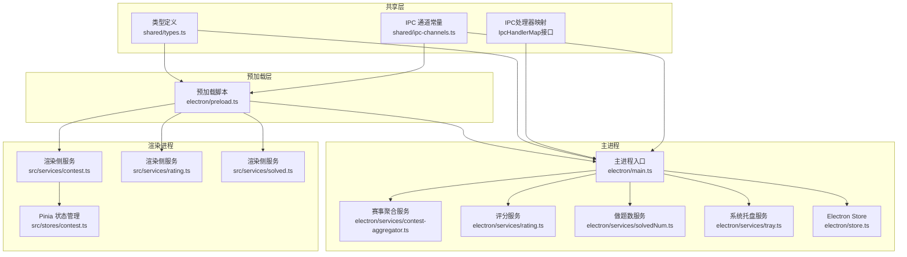
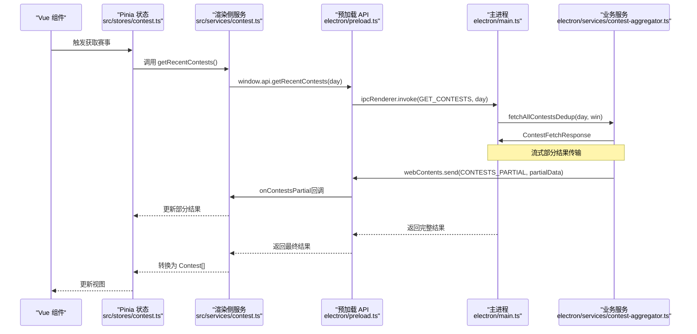
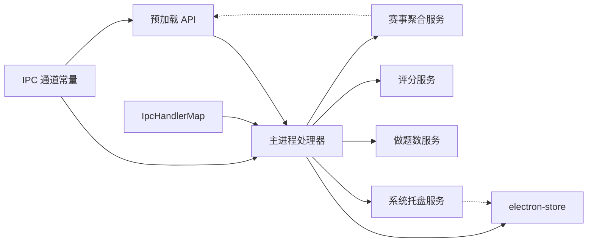

# IPC通信机制

<cite>
**本文引用的文件**
- [electron/main.ts](file://electron/main.ts)
- [electron/preload.ts](file://electron/preload.ts)
- [shared/ipc-channels.ts](file://shared/ipc-channels.ts)
- [shared/types.ts](file://shared/types.ts)
- [electron/services/contest-aggregator.ts](file://electron/services/contest-aggregator.ts)
- [electron/services/rating.ts](file://electron/services/rating.ts)
- [electron/services/solvedNum.ts](file://electron/services/solvedNum.ts)
- [electron/services/tray.ts](file://electron/services/tray.ts)
- [src/services/contest.ts](file://src/services/contest.ts)
- [src/services/rating.ts](file://src/services/rating.ts)
- [src/services/solved.ts](file://src/services/solved.ts)
- [src/stores/contest.ts](file://src/stores/contest.ts)
- [electron/store.ts](file://electron/store.ts)
</cite>

## 更新摘要
**变更内容**
- 新增完整的IPC类型安全增强，包括IpcHandlerMap接口和严格的数据类型映射
- 新增流式部分结果传输功能(CONTESTS_PARTIAL)，支持实时进度反馈
- 新增通知管理系统(NOTIFICATION_SET, NOTIFICATION_GET)，支持比赛提醒配置
- 新增ContestFetchResponse等新的数据类型定义
- 扩展预加载API，支持新的IPC通道和回调机制

## 目录
1. [引言](#引言)
2. [项目结构](#项目结构)
3. [核心组件](#核心组件)
4. [架构总览](#架构总览)
5. [详细组件分析](#详细组件分析)
6. [依赖关系分析](#依赖关系分析)
7. [性能考量](#性能考量)
8. [故障排查指南](#故障排查指南)
9. [结论](#结论)
10. [附录](#附录)

## 引言
本文件系统性梳理 OJFlow 的 IPC（跨进程）通信机制，聚焦 Electron 主进程与渲染进程之间的消息传递架构。重点覆盖以下方面：
- 使用模式：ipcMain.handle 与 ipcRenderer.invoke 的配对使用
- IPC 通道定义与命名规范：GET_CONTESTS、GET_RATING、GET_SOLVED_NUM 等
- **新增**：完整的IPC类型安全增强，包括IpcHandlerMap接口和严格的数据类型映射
- **新增**：流式部分结果传输(CONTESTS_PARTIAL)，支持实时进度反馈
- **新增**：通知管理系统(NOTIFICATION_SET, NOTIFICATION_GET)，支持比赛提醒配置
- 预加载脚本的安全隔离：contextIsolation 与 nodeIntegration 的配置原理
- 完整消息协议：请求参数校验、错误分类与处理、响应格式标准化
- 实际调用示例：在 Vue 组件中如何通过 window.api 调用 IPC 接口，主进程如何处理与响应
- 安全考虑：URL 协议验证、参数长度限制等

## 项目结构
OJFlow 的 IPC 通信围绕"共享通道常量 + 预加载白名单 API + 主进程处理器"的三层设计展开：
- 共享层：统一定义 IPC 通道名称与类型映射，提供完整的类型安全
- 预加载层：通过 contextBridge 将受控 API 暴露给渲染进程，支持新的流式和通知功能
- 主进程层：注册 ipcMain.handle 处理器，执行业务逻辑并返回结果

**图表来源**
- [shared/ipc-channels.ts:1-68](file://shared/ipc-channels.ts#L1-L68)
- [electron/preload.ts:1-61](file://electron/preload.ts#L1-L61)
- [electron/main.ts:414-539](file://electron/main.ts#L414-L539)
- [electron/services/contest-aggregator.ts:1-144](file://electron/services/contest-aggregator.ts#L1-L144)
- [electron/services/rating.ts:1-174](file://electron/services/rating.ts#L1-L174)
- [electron/services/solvedNum.ts:1-197](file://electron/services/solvedNum.ts#L1-L197)
- [electron/services/tray.ts:1-133](file://electron/services/tray.ts#L1-L133)
- [electron/store.ts:1-31](file://electron/store.ts#L1-L31)
- [src/services/contest.ts:1-40](file://src/services/contest.ts#L1-L40)
- [src/services/rating.ts:1-7](file://src/services/rating.ts#L1-L7)
- [src/services/solved.ts:1-7](file://src/services/solved.ts#L1-L7)
- [src/stores/contest.ts:68-286](file://src/stores/contest.ts#L68-L286)

**章节来源**
- [shared/ipc-channels.ts:1-68](file://shared/ipc-channels.ts#L1-L68)
- [electron/preload.ts:1-61](file://electron/preload.ts#L1-L61)
- [electron/main.ts:414-539](file://electron/main.ts#L414-L539)

## 核心组件
- **新增**：IpcHandlerMap接口：提供完整的IPC处理器参数和返回值类型映射，确保主进程与渲染进程间的类型安全
- IPC 通道常量与类型映射：集中定义所有通道名及参数/返回值类型，确保主进程与渲染进程契约一致
- 预加载白名单 API：仅暴露受控方法，避免直接暴露 ipcRenderer 或 Node 能力
- 主进程处理器：注册 ipcMain.handle，执行参数校验、业务调用与错误分类
- **新增**：流式部分结果传输：支持实时推送平台抓取进度，提升用户体验
- **新增**：通知管理系统：支持比赛提醒配置和状态查询
- 渲染侧服务封装：在 Vue 组件中以 window.api.xxx() 形式调用，内部通过 ipcRenderer.invoke 发送请求
- 类型系统：RawContest/ContestFetchResponse/Rating/SolvedNum 等类型在共享层定义，保证前后端数据结构一致性

**章节来源**
- [shared/ipc-channels.ts:25-67](file://shared/ipc-channels.ts#L25-L67)
- [electron/preload.ts:21-43](file://electron/preload.ts#L21-L43)
- [electron/main.ts:414-539](file://electron/main.ts#L414-L539)
- [shared/types.ts:79-101](file://shared/types.ts#L79-L101)

## 架构总览
下面的序列图展示了从渲染进程到主进程的关键调用链路，以"获取近期赛事"为例，包括新增的流式部分结果传输功能。

**图表来源**
- [src/stores/contest.ts:114-243](file://src/stores/contest.ts#L114-L243)
- [src/services/contest.ts:16-40](file://src/services/contest.ts#L16-L40)
- [electron/preload.ts:6-43](file://electron/preload.ts#L6-L43)
- [electron/main.ts:414-439](file://electron/main.ts#L414-L439)
- [electron/services/contest-aggregator.ts:43-144](file://electron/services/contest-aggregator.ts#L43-L144)

## 详细组件分析

### 通道定义与命名规范
- 通道名采用小写短横线风格，语义清晰且稳定
- **新增**：IpcHandlerMap接口提供完整的类型映射，确保编译时类型安全
- 核心通道
  - GET_CONTESTS：获取近期赛事，返回ContestFetchResponse
  - GET_RATING：按平台查询用户评分
  - GET_SOLVED_NUM：按平台查询做题数
  - OPEN_URL：打开外部链接（带协议校验）
  - UPDATER_INSTALL：触发更新安装
  - STORE_GET/STORE_SET/STORE_GET_ALL：读取/设置/读取全部应用配置（通过 electron-store）
  - **新增**：CONTESTS_PARTIAL：流式部分结果传输通道
  - **新增**：NOTIFICATION_SET/NOTIFICATION_GET：通知管理通道

**章节来源**
- [shared/ipc-channels.ts:3-21](file://shared/ipc-channels.ts#L3-L21)
- [shared/ipc-channels.ts:25-67](file://shared/ipc-channels.ts#L25-L67)

### 预加载脚本与安全隔离
- contextBridge 暴露受控 API：仅导出白名单方法，不直接暴露 ipcRenderer
- 配置项
  - nodeIntegration: false
  - contextIsolation: true
  - preload: 指向预加载脚本
  - sandbox: false（为 electron-store 访问 Node 能力而设，但通过预加载隔离）
- **新增**：onContestsPartial回调机制，支持流式部分结果监听
- **新增**：setNotification/getNotification方法，支持通知配置管理
- 预加载 API 包含：
  - getRecentContests、getRating、getSolvedNum、openUrl、installUpdate
  - **新增**：onContestsPartial、setNotification、getNotification
  - store.get/set/getAll

**章节来源**
- [electron/preload.ts:1-61](file://electron/preload.ts#L1-L61)
- [electron/main.ts:396-403](file://electron/main.ts#L396-L403)

### 主进程处理器与消息协议
- GET_CONTESTS
  - 参数：day:number
  - 行为：限定范围[min,max]，默认 fallback；调用服务层聚合多平台赛事
  - **更新**：返回ContestFetchResponse，包含平台状态和缓存信息
  - 错误：异常时返回空数组
- GET_RATING
  - 参数：{ platform:string, name:string }
  - 行为：参数类型校验、长度限制；根据平台路由到对应服务
  - 返回：Rating
  - 错误：未知平台或网络异常向上抛出
- GET_SOLVED_NUM
  - 参数：{ platform:string, name:string }
  - 行为：参数类型校验、长度限制；根据平台路由到对应服务
  - 返回：SolvedNum
  - 错误：上游接口无效或网络异常向上抛出
- OPEN_URL
  - 参数：url:string
  - 行为：仅允许 http/https 协议，否则抛错
  - 返回：void
- UPDATER_INSTALL
  - 参数：{ url:string }
  - 行为：下载并启动更新包
  - 返回：boolean
- STORE_*（electron-store）
  - STORE_GET/SET/GET_ALL：键值读取/设置/读取全部
- **新增**：NOTIFICATION_SET
  - 参数：{ enabled:boolean, reminderMinutes:number }
  - 行为：存储通知配置到electron-store
  - 返回：void
- **新增**：NOTIFICATION_GET
  - 参数：[]
  - 行为：从electron-store读取通知配置
  - 返回：{ enabled:boolean, reminderMinutes:number }

**章节来源**
- [electron/main.ts:414-539](file://electron/main.ts#L414-L539)
- [electron/services/rating.ts:156-171](file://electron/services/rating.ts#L156-L171)
- [electron/services/solvedNum.ts:166-194](file://electron/services/solvedNum.ts#L166-L194)
- [electron/store.ts:1-31](file://electron/store.ts#L1-L31)

### 业务服务与数据模型
- **更新**：赛事聚合服务：聚合 LeetCode、Codeforces、Nowcoder、AtCoder、洛谷、蓝桥云课 等平台的近期赛事，支持流式部分结果传输
- 评分服务：按平台返回当前/历史最高分
- 做题数服务：按平台返回做题数量
- **新增**：系统托盘服务：支持比赛提醒通知调度
- 数据模型：RawContest、ContestFetchResponse、Rating、SolvedNum

**章节来源**
- [electron/services/contest-aggregator.ts:1-144](file://electron/services/contest-aggregator.ts#L1-L144)
- [electron/services/rating.ts:1-174](file://electron/services/rating.ts#L1-L174)
- [electron/services/solvedNum.ts:1-197](file://electron/services/solvedNum.ts#L1-L197)
- [electron/services/tray.ts:1-133](file://electron/services/tray.ts#L1-L133)
- [shared/types.ts:79-101](file://shared/types.ts#L79-L101)

### 流式部分结果传输机制
- **新增**：CONTESTS_PARTIAL通道用于实时推送平台抓取进度
- **新增**：onContestsPartial回调机制，支持渲染进程订阅部分结果
- 工作流程：
  1. 主进程聚合多个平台数据时，逐个平台推送部分结果
  2. 渲染进程通过onContestsPartial订阅，实时更新UI
  3. 最终返回完整聚合结果
- 优势：提升用户体验，避免长时间等待

**章节来源**
- [electron/services/contest-aggregator.ts:80-86](file://electron/services/contest-aggregator.ts#L80-L86)
- [electron/preload.ts:21-31](file://electron/preload.ts#L21-L31)
- [electron/main.ts:414-439](file://electron/main.ts#L414-L439)

### 通知管理系统
- **新增**：NOTIFICATION_SET/NOTIFICATION_GET通道
- **新增**：setNotification/getNotification预加载API
- 功能：配置比赛提醒通知的启用状态和提醒时间间隔
- 应用场景：系统托盘自动调度比赛提醒通知

**章节来源**
- [shared/ipc-channels.ts:59-66](file://shared/ipc-channels.ts#L59-L66)
- [electron/preload.ts:33-43](file://electron/preload.ts#L33-L43)
- [electron/main.ts:528-538](file://electron/main.ts#L528-L538)
- [electron/services/tray.ts:80-114](file://electron/services/tray.ts#L80-L114)

### 渲染侧调用流程与示例路径
- 在 Vue 组件中，通过 Pinia 状态管理触发获取赛事
- 渲染侧服务封装 window.api 调用
- **新增**：支持流式部分结果监听和通知配置管理
- 示例调用路径（不含代码片段）：
  - [src/stores/contest.ts:114-243](file://src/stores/contest.ts#L114-L243)
  - [src/services/contest.ts:16-40](file://src/services/contest.ts#L16-L40)
  - [src/services/rating.ts:1-7](file://src/services/rating.ts#L1-L7)
  - [src/services/solved.ts:1-7](file://src/services/solved.ts#L1-L7)

**章节来源**
- [src/stores/contest.ts:114-243](file://src/stores/contest.ts#L114-L243)
- [src/services/contest.ts:16-40](file://src/services/contest.ts#L16-L40)
- [src/services/rating.ts:1-7](file://src/services/rating.ts#L1-L7)
- [src/services/solved.ts:1-7](file://src/services/solved.ts#L1-L7)

### 错误处理与响应格式
- 错误分类与处理
  - 超时/网络类错误：统一分类为 timeout/network，便于 UI 层提示
  - 未知错误：归类为 unknown
- 响应格式
  - GET_CONTESTS：**更新**为ContestFetchResponse（包含平台状态、缓存信息）
  - GET_RATING/GET_SOLVED_NUM：对应领域对象（失败时抛出异常）
  - OPEN_URL/UPDATER_INSTALL：void/boolean
  - **新增**：NOTIFICATION_SET/GET：void/{ enabled:boolean, reminderMinutes:number }
- 参数校验
  - GET_RATING/GET_SOLVED_NUM：字符串长度限制
  - OPEN_URL：协议白名单 http/https

**章节来源**
- [electron/main.ts:441-496](file://electron/main.ts#L441-L496)
- [electron/main.ts:499-513](file://electron/main.ts#L499-L513)
- [electron/main.ts:528-538](file://electron/main.ts#L528-L538)

## 依赖关系分析
- 低耦合高内聚
  - 通道常量与类型映射集中于共享层，避免重复与不一致
  - **新增**：IpcHandlerMap接口提供编译时类型安全保障
  - 预加载层仅承担"门面"职责，隔离主进程能力
  - 主进程处理器专注业务与错误处理
- 关键依赖链
  - 渲染侧服务 -> 预加载 API -> 主进程处理器 -> 业务服务
  - **新增**：流式部分结果 -> 渲染进程回调 -> UI更新
  - **新增**：通知配置 -> electron-store -> 系统托盘服务
  - 主进程处理器 -> electron-store（配置持久化）

**图表来源**
- [shared/ipc-channels.ts:3-21](file://shared/ipc-channels.ts#L3-L21)
- [shared/ipc-channels.ts:25-67](file://shared/ipc-channels.ts#L25-L67)
- [electron/preload.ts:1-61](file://electron/preload.ts#L1-L61)
- [electron/main.ts:414-539](file://electron/main.ts#L414-L539)
- [electron/services/contest-aggregator.ts:1-144](file://electron/services/contest-aggregator.ts#L1-L144)
- [electron/services/tray.ts:1-133](file://electron/services/tray.ts#L1-L133)
- [electron/store.ts:1-31](file://electron/store.ts#L1-L31)

## 性能考量
- 并发抓取：主进程聚合多平台赛事时使用并发请求，缩短等待时间
- **新增**：流式部分结果传输：避免长时间等待，提升用户体验
- 缓存策略：electron-store 提供本地持久化，减少重复请求
- 超时与重试：网络请求具备超时控制与指数退避重试，提升稳定性
- 参数裁剪：day 参数在主进程侧进行边界裁剪，避免过长窗口导致资源消耗
- **新增**：通知调度优化：仅调度未来24小时内的比赛提醒，避免过多定时器

**章节来源**
- [electron/services/contest-aggregator.ts:43-144](file://electron/services/contest-aggregator.ts#L43-L144)
- [electron/main.ts:414-439](file://electron/main.ts#L414-L439)
- [electron/services/tray.ts:96-114](file://electron/services/tray.ts#L96-L114)
- [electron/store.ts:1-31](file://electron/store.ts#L1-L31)

## 故障排查指南
- 常见问题定位
  - 通道名不匹配：检查 shared/ipc-channels.ts 与预加载/主进程是否一致
  - **新增**：类型安全问题：利用IpcHandlerMap接口检查参数和返回值类型
  - 参数类型错误：主进程对 GET_RATING/GET_SOLVED_NUM 进行类型与长度校验
  - 协议非法：OPEN_URL 仅允许 http/https
  - 网络超时/失败：查看错误分类（timeout/network/unknown），结合日志定位
  - **新增**：流式传输问题：检查CONTESTS_PARTIAL通道是否正确订阅
  - **新增**：通知配置问题：验证NOTIFICATION_SET/GET通道的参数格式
- 日志与调试
  - 主进程打印错误信息，便于定位上游服务异常
  - 开发模式下可开启 DevTools 辅助调试 IPC 调用
  - **新增**：监控流式部分结果传输的回调执行情况

**章节来源**
- [shared/ipc-channels.ts:3-21](file://shared/ipc-channels.ts#L3-L21)
- [shared/ipc-channels.ts:25-67](file://shared/ipc-channels.ts#L25-L67)
- [electron/main.ts:499-513](file://electron/main.ts#L499-L513)
- [electron/main.ts:441-496](file://electron/main.ts#L441-L496)

## 结论
OJFlow 的 IPC 通信以"共享通道 + 预加载白名单 + 主进程处理器"为核心，实现了安全、清晰且可扩展的跨进程交互。**新增的类型安全增强**确保了编译时的类型检查，**流式部分结果传输**提升了用户体验，**通知管理系统**增强了应用的实用性。通过严格的参数校验、错误分类与响应格式标准化，配合并发抓取与缓存策略，既保障了用户体验，也提升了系统的健壮性与可维护性。

## 附录

### IPC 通道与类型映射速览
- GET_CONTESTS：args=[day:number] → return=ContestFetchResponse
- GET_RATING：args=[{platform:string,name:string}] → return=Rating
- GET_SOLVED_NUM：args=[{platform:string,name:string}] → return=SolvedNum
- OPEN_URL：args=[url:string] → return=void
- UPDATER_INSTALL：args=[{url:string}] → return=boolean
- STORE_GET/SET/GET_ALL：键值读取/设置/读取全部
- **新增**：CONTESTS_PARTIAL：args=[] → return=流式部分结果
- **新增**：NOTIFICATION_SET：args=[{enabled:boolean,reminderMinutes:number}] → return=void
- **新增**：NOTIFICATION_GET：args=[] → return={enabled:boolean,reminderMinutes:number}

### 新增数据类型定义
- **新增**：ContestFetchResponse：包含竞赛列表、平台状态、总耗时、缓存信息
- **新增**：PlatformFetchStatus：平台抓取状态报告
- **新增**：IpcHandlerMap接口：完整的IPC处理器类型映射

**章节来源**
- [shared/ipc-channels.ts:25-67](file://shared/ipc-channels.ts#L25-L67)
- [shared/types.ts:79-101](file://shared/types.ts#L79-L101)