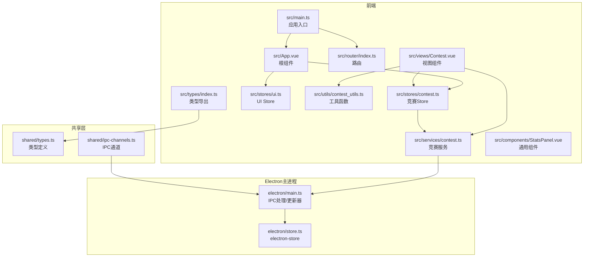
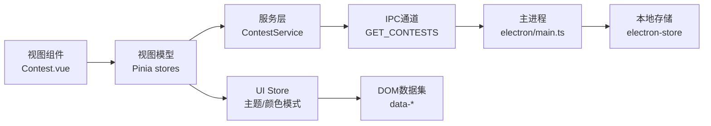
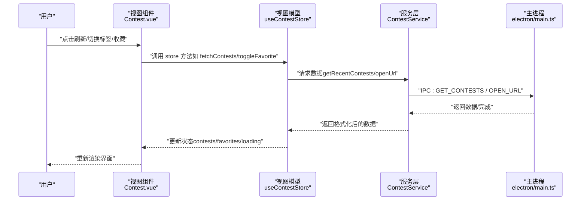
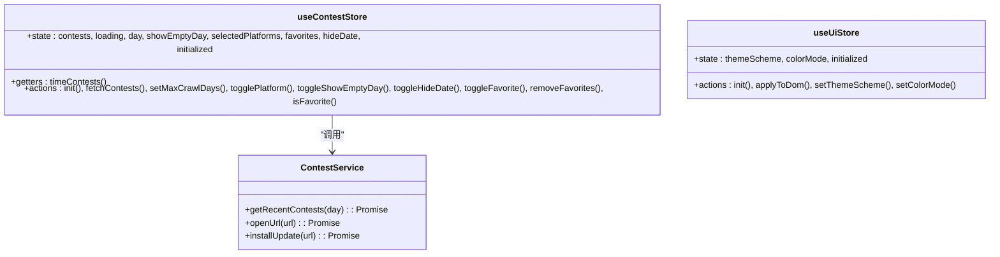
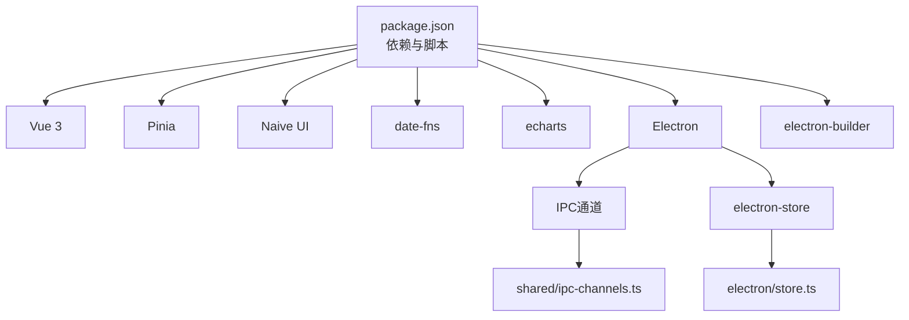

# MVVM架构模式

<cite>
**本文引用的文件**
- [src/main.ts](file://src/main.ts)
- [src/App.vue](file://src/App.vue)
- [src/stores/contest.ts](file://src/stores/contest.ts)
- [src/stores/ui.ts](file://src/stores/ui.ts)
- [src/services/contest.ts](file://src/services/contest.ts)
- [src/views/Contest.vue](file://src/views/Contest.vue)
- [src/router/index.ts](file://src/router/index.ts)
- [src/components/StatsPanel.vue](file://src/components/StatsPanel.vue)
- [src/utils/contest_utils.ts](file://src/utils/contest_utils.ts)
- [src/types/index.ts](file://src/types/index.ts)
- [shared/types.ts](file://shared/types.ts)
- [shared/ipc-channels.ts](file://shared/ipc-channels.ts)
- [electron/main.ts](file://electron/main.ts)
- [electron/store.ts](file://electron/store.ts)
- [package.json](file://package.json)
</cite>

## 目录
1. [引言](#引言)
2. [项目结构](#项目结构)
3. [核心组件](#核心组件)
4. [架构总览](#架构总览)
5. [详细组件分析](#详细组件分析)
6. [依赖分析](#依赖分析)
7. [性能考虑](#性能考虑)
8. [故障排查指南](#故障排查指南)
9. [结论](#结论)
10. [附录](#附录)

## 引言
本文件系统性阐述 OJFlow 的 MVVM 架构设计与实现，重点说明：
- 视图层（View）：Vue 组件负责渲染与用户交互
- 视图模型层（ViewModel）：Pinia stores 负责状态管理与业务逻辑编排
- 模型层（Model）：服务层封装数据获取与格式化
同时解释 Composition API 在状态管理与业务逻辑封装中的应用，如何通过 provide/inject 实现跨组件状态共享，响应式数据绑定机制（computed、watchers、生命周期钩子）的使用场景，以及数据流向与组件关系图。

## 项目结构
OJFlow 采用前端框架 Vue 3 + Pinia + TypeScript，结合 Electron 主进程提供 IPC 通道与本地存储能力。核心目录与职责如下：
- src：前端源码
  - main.ts：应用入口，初始化 Pinia、路由与全局 store 初始化
  - App.vue：根组件，注入 UI store 并应用主题
  - stores：Pinia stores（contest、ui）
  - services：服务层（contest、rating、solved）
  - views：页面级视图组件（Contest、Favorite 等）
  - components：通用 UI 组件（StatsPanel 等）
  - utils：工具函数（contest_utils）
  - types：类型导出（index.ts 导出 shared/types 中定义）
  - router：路由配置
- shared：跨进程共享类型与常量（types.ts、ipc-channels.ts）
- electron：主进程（main.ts）、本地存储（store.ts）、配置（app.config.json）
- package.json：依赖与构建脚本

图表来源
- [src/main.ts:1-26](file://src/main.ts#L1-L26)
- [src/App.vue:1-23](file://src/App.vue#L1-L23)
- [src/router/index.ts:1-48](file://src/router/index.ts#L1-L48)
- [src/stores/contest.ts:1-307](file://src/stores/contest.ts#L1-L307)
- [src/stores/ui.ts:1-96](file://src/stores/ui.ts#L1-L96)
- [src/services/contest.ts:1-35](file://src/services/contest.ts#L1-L35)
- [src/views/Contest.vue:1-800](file://src/views/Contest.vue#L1-L800)
- [src/components/StatsPanel.vue:1-293](file://src/components/StatsPanel.vue#L1-L293)
- [src/utils/contest_utils.ts:1-68](file://src/utils/contest_utils.ts#L1-L68)
- [src/types/index.ts:1-10](file://src/types/index.ts#L1-L10)
- [shared/types.ts:1-67](file://shared/types.ts#L1-L67)
- [shared/ipc-channels.ts:1-53](file://shared/ipc-channels.ts#L1-L53)
- [electron/main.ts:1-493](file://electron/main.ts#L1-L493)
- [electron/store.ts:1-31](file://electron/store.ts#L1-L31)

章节来源
- [src/main.ts:1-26](file://src/main.ts#L1-L26)
- [src/router/index.ts:1-48](file://src/router/index.ts#L1-L48)

## 核心组件
- 应用入口与初始化
  - 创建应用实例、安装 Pinia 与路由，挂载后执行迁移与 store 初始化
  - 参考路径：[src/main.ts:1-26](file://src/main.ts#L1-L26)
- 根组件与主题应用
  - 使用 UI store 控制主题方案与颜色模式，并将其应用到 DOM
  - 参考路径：[src/App.vue:1-23](file://src/App.vue#L1-L23)，[src/stores/ui.ts:19-96](file://src/stores/ui.ts#L19-L96)
- 竞赛视图组件
  - 通过 useContestStore 获取数据与状态，调用服务打开链接等
  - 参考路径：[src/views/Contest.vue:1-800](file://src/views/Contest.vue#L1-L800)，[src/stores/contest.ts:63-307](file://src/stores/contest.ts#L63-L307)
- 竞赛服务层
  - 通过 window.api 调用主进程 IPC 接口，获取竞赛数据并格式化
  - 参考路径：[src/services/contest.ts:1-35](file://src/services/contest.ts#L1-L35)，[shared/ipc-channels.ts:1-53](file://shared/ipc-channels.ts#L1-L53)，[electron/main.ts:396-412](file://electron/main.ts#L396-L412)
- 工具函数
  - 将原始竞赛数据格式化为视图可用的结构
  - 参考路径：[src/utils/contest_utils.ts:1-68](file://src/utils/contest_utils.ts#L1-L68)，[shared/types.ts:10-26](file://shared/types.ts#L10-L26)

章节来源
- [src/main.ts:1-26](file://src/main.ts#L1-L26)
- [src/App.vue:1-23](file://src/App.vue#L1-L23)
- [src/views/Contest.vue:1-800](file://src/views/Contest.vue#L1-L800)
- [src/services/contest.ts:1-35](file://src/services/contest.ts#L1-L35)
- [src/utils/contest_utils.ts:1-68](file://src/utils/contest_utils.ts#L1-L68)

## 架构总览
MVVM 在 OJFlow 中的具体映射：
- View 层：Vue 组件（如 Contest.vue）负责渲染与事件处理
- ViewModel 层：Pinia stores（useContestStore、useUiStore）负责状态与业务逻辑
- Model 层：服务类（ContestService）封装数据获取与格式化
- 数据流：View 通过 store 访问 Model；store 调用服务层；服务层经 IPC 与主进程交互

图表来源
- [src/views/Contest.vue:1-800](file://src/views/Contest.vue#L1-L800)
- [src/stores/contest.ts:63-307](file://src/stores/contest.ts#L63-L307)
- [src/stores/ui.ts:19-96](file://src/stores/ui.ts#L19-L96)
- [src/services/contest.ts:1-35](file://src/services/contest.ts#L1-L35)
- [shared/ipc-channels.ts:1-53](file://shared/ipc-channels.ts#L1-L53)
- [electron/main.ts:396-412](file://electron/main.ts#L396-L412)
- [electron/store.ts:1-31](file://electron/store.ts#L1-L31)

## 详细组件分析

### 视图组件与Store交互流程
- 用户在视图中触发操作（切换标签、刷新、收藏、筛选），视图通过 store 方法更新状态
- store 调用服务层获取或持久化数据，服务层通过 IPC 与主进程通信
- 视图基于响应式数据自动重绘

图表来源
- [src/views/Contest.vue:623-648](file://src/views/Contest.vue#L623-L648)
- [src/stores/contest.ts:190-226](file://src/stores/contest.ts#L190-L226)
- [src/services/contest.ts:8-34](file://src/services/contest.ts#L8-L34)
- [shared/ipc-channels.ts:3-14](file://shared/ipc-channels.ts#L3-L14)
- [electron/main.ts:396-458](file://electron/main.ts#L396-L458)

章节来源
- [src/views/Contest.vue:1-800](file://src/views/Contest.vue#L1-L800)
- [src/stores/contest.ts:63-307](file://src/stores/contest.ts#L63-L307)
- [src/services/contest.ts:1-35](file://src/services/contest.ts#L1-L35)

### Store 状态管理与业务逻辑
- 竞赛 Store（useContestStore）
  - 状态：竞赛列表、加载状态、天数、平台筛选、收藏、日期显示控制、初始化标志
  - 计算属性：按天分组的时间竞赛列表
  - 动作：初始化、获取竞赛、设置最大爬取天数、切换平台、切换空日期显示、切换隐藏日期、收藏/取消收藏、批量删除收藏、查询是否收藏
  - 参考路径：[src/stores/contest.ts:6-307](file://src/stores/contest.ts#L6-L307)
- UI Store（useUiStore）
  - 状态：主题方案、颜色模式、初始化标志
  - 动作：初始化、应用到 DOM、设置主题方案、设置颜色模式
  - 参考路径：[src/stores/ui.ts:19-96](file://src/stores/ui.ts#L19-L96)

图表来源
- [src/stores/contest.ts:63-307](file://src/stores/contest.ts#L63-L307)
- [src/stores/ui.ts:19-96](file://src/stores/ui.ts#L19-L96)
- [src/services/contest.ts:7-34](file://src/services/contest.ts#L7-L34)

章节来源
- [src/stores/contest.ts:1-307](file://src/stores/contest.ts#L1-L307)
- [src/stores/ui.ts:1-96](file://src/stores/ui.ts#L1-L96)

### 响应式数据绑定与生命周期
- 视图组件使用 Composition API：
  - 响应式：ref、reactive（隐含在 store 中）
  - 计算属性：computed（如可见竞赛、平台统计、日期分组）
  - 监听器：watch（如监听 props 变化以更新图表）
  - 生命周期：onMounted/onUnmounted（定时器、事件监听）
- 示例参考路径：
  - 视图组件中的计算属性与生命周期：[src/views/Contest.vue:399-652](file://src/views/Contest.vue#L399-L652)
  - 通用组件中的计算属性与监听：[src/components/StatsPanel.vue:30-214](file://src/components/StatsPanel.vue#L30-L214)

章节来源
- [src/views/Contest.vue:1-800](file://src/views/Contest.vue#L1-L800)
- [src/components/StatsPanel.vue:1-293](file://src/components/StatsPanel.vue#L1-L293)

### 类型系统与安全
- 类型导出与复用：
  - 前端 types/index.ts 导出共享类型（Contest、Rating、SolvedNum 等）
  - 共享类型定义位于 shared/types.ts，确保前后端一致
  - 参考路径：[src/types/index.ts:1-10](file://src/types/index.ts#L1-L10)，[shared/types.ts:1-67](file://shared/types.ts#L1-L67)
- 服务层与工具函数：
  - 服务层方法参数与返回值使用强类型定义
  - 工具函数对竞赛数据进行格式化，保证视图消费的数据结构稳定
  - 参考路径：[src/services/contest.ts:7-34](file://src/services/contest.ts#L7-L34)，[src/utils/contest_utils.ts:4-43](file://src/utils/contest_utils.ts#L4-L43)

章节来源
- [src/types/index.ts:1-10](file://src/types/index.ts#L1-L10)
- [shared/types.ts:1-67](file://shared/types.ts#L1-L67)
- [src/services/contest.ts:1-35](file://src/services/contest.ts#L1-L35)
- [src/utils/contest_utils.ts:1-68](file://src/utils/contest_utils.ts#L1-L68)

### 跨组件状态共享（provide/inject）
- 当前项目主要通过 Pinia store 进行跨组件状态共享，未直接使用 provide/inject
- 若需在多层级组件间共享特定上下文，可考虑在根组件或布局组件中使用 provide 注入 store 实例，子组件通过 inject 获取，从而减少逐层传递 props 的复杂度
- 该模式适用于：
  - 主题配置、用户偏好等横切关注点
  - 复杂表单或对话框的状态管理

[本节为概念性说明，不直接分析具体文件，故不附加“章节来源”]

## 依赖分析
- 前端依赖
  - Vue 3、Pinia、Naive UI、date-fns、echarts 等
  - 参考路径：[package.json:58-72](file://package.json#L58-L72)
- 构建与打包
  - Vite、Electron Builder、TypeScript、ESLint/Prettier
  - 参考路径：[package.json:34-54](file://package.json#L34-L54)
- Electron 主进程
  - IPC 通道、更新器、electron-store
  - 参考路径：[shared/ipc-channels.ts:1-53](file://shared/ipc-channels.ts#L1-L53)，[electron/main.ts:396-485](file://electron/main.ts#L396-L485)，[electron/store.ts:1-31](file://electron/store.ts#L1-L31)

图表来源
- [package.json:58-93](file://package.json#L58-L93)
- [shared/ipc-channels.ts:1-53](file://shared/ipc-channels.ts#L1-L53)
- [electron/store.ts:1-31](file://electron/store.ts#L1-L31)

章节来源
- [package.json:1-127](file://package.json#L1-L127)
- [shared/ipc-channels.ts:1-53](file://shared/ipc-channels.ts#L1-L53)
- [electron/store.ts:1-31](file://electron/store.ts#L1-L31)

## 性能考虑
- 响应式粒度
  - 将大型列表拆分为多个 computed，避免单一计算开销过大
  - 对高频更新使用防抖/节流（如计时器每分钟更新）
- 渲染优化
  - 列表项使用 key 与 v-show/v-if 合理组合，减少不必要的重排
  - 图表组件在可见性变化时再初始化与 resize
- 网络与缓存
  - 服务层统一错误分类与重试策略，降低失败对用户体验的影响
  - 本地存储与 electron-store 双写，提升容错性
- 状态持久化
  - store 动作内提供回滚与异常抛出，保证状态一致性

[本节提供一般性指导，不直接分析具体文件，故不附加“章节来源”]

## 故障排查指南
- IPC 通道问题
  - 检查 IPC 通道名称与主进程 handle 是否匹配
  - 参考路径：[shared/ipc-channels.ts:3-14](file://shared/ipc-channels.ts#L3-L14)，[electron/main.ts:396-458](file://electron/main.ts#L396-L458)
- 服务层错误
  - 服务层捕获异常并返回空数组或抛出错误，便于上层处理
  - 参考路径：[src/services/contest.ts:21-25](file://src/services/contest.ts#L21-L25)
- store 持久化异常
  - store 动作在持久化失败时回滚并抛出错误
  - 参考路径：[src/stores/contest.ts:158-189](file://src/stores/contest.ts#L158-L189)，[src/stores/ui.ts:63-93](file://src/stores/ui.ts#L63-L93)
- 主进程更新器
  - 检查更新器超时、重试与下载流程
  - 参考路径：[electron/main.ts:122-225](file://electron/main.ts#L122-L225)，[electron/main.ts:227-290](file://electron/main.ts#L227-L290)

章节来源
- [shared/ipc-channels.ts:1-53](file://shared/ipc-channels.ts#L1-L53)
- [electron/main.ts:122-290](file://electron/main.ts#L122-L290)
- [src/services/contest.ts:1-35](file://src/services/contest.ts#L1-L35)
- [src/stores/contest.ts:158-189](file://src/stores/contest.ts#L158-L189)
- [src/stores/ui.ts:63-93](file://src/stores/ui.ts#L63-L93)

## 结论
OJFlow 的 MVVM 架构清晰地划分了职责：
- 视图层专注 UI 与交互
- 视图模型层集中处理状态与业务编排
- 模型层封装数据访问与格式化
通过 Pinia 提供的响应式与模块化能力，结合 TypeScript 的类型保障，项目在可维护性与扩展性方面具备良好基础。未来可在需要跨层级共享上下文时引入 provide/inject，进一步简化状态传递。

[本节为总结性内容，不直接分析具体文件，故不附加“章节来源”]

## 附录
- 术语
  - MVVM：Model-View-ViewModel
  - Pinia：Vue 状态管理库
  - IPC：Inter-Process Communication（进程间通信）
- 相关文件索引
  - 应用入口与初始化：[src/main.ts:1-26](file://src/main.ts#L1-L26)
  - 根组件与主题应用：[src/App.vue:1-23](file://src/App.vue#L1-L23)
  - 竞赛视图组件：[src/views/Contest.vue:1-800](file://src/views/Contest.vue#L1-L800)
  - 竞赛服务层：[src/services/contest.ts:1-35](file://src/services/contest.ts#L1-L35)
  - UI Store：[src/stores/ui.ts:1-96](file://src/stores/ui.ts#L1-L96)
  - 竞赛 Store：[src/stores/contest.ts:1-307](file://src/stores/contest.ts#L1-L307)
  - 类型定义：[shared/types.ts:1-67](file://shared/types.ts#L1-L67)
  - IPC 通道：[shared/ipc-channels.ts:1-53](file://shared/ipc-channels.ts#L1-L53)
  - 主进程：[electron/main.ts:1-493](file://electron/main.ts#L1-L493)
  - 本地存储：[electron/store.ts:1-31](file://electron/store.ts#L1-L31)
  - 依赖与脚本：[package.json:1-127](file://package.json#L1-L127)