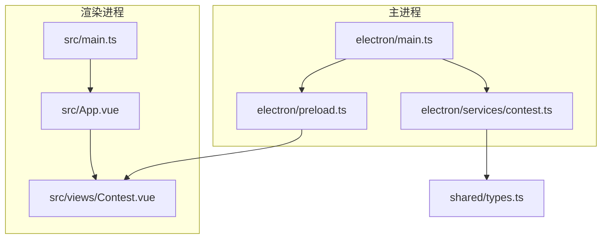
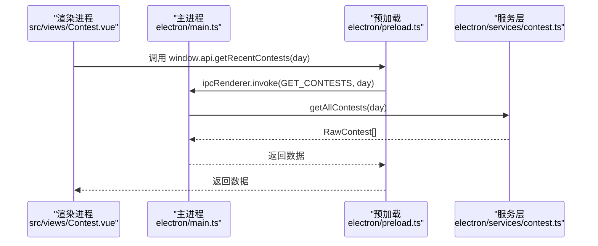
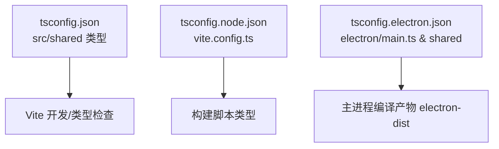
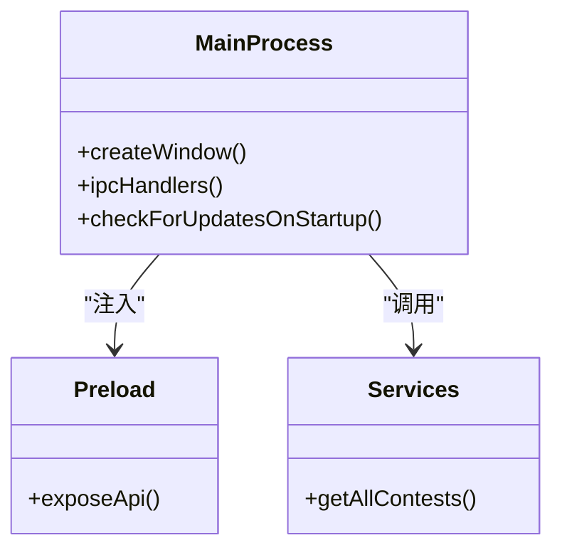
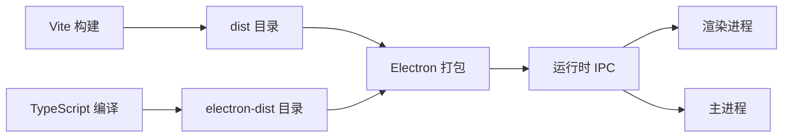

# 技术栈集成

<cite>
**本文引用的文件**
- [package.json](file://package.json)
- [vite.config.ts](file://vite.config.ts)
- [tsconfig.json](file://tsconfig.json)
- [tsconfig.node.json](file://tsconfig.node.json)
- [tsconfig.electron.json](file://tsconfig.electron.json)
- [electron/main.ts](file://electron/main.ts)
- [electron/preload.ts](file://electron/preload.ts)
- [electron/services/contest.ts](file://electron/services/contest.ts)
- [src/main.ts](file://src/main.ts)
- [src/App.vue](file://src/App.vue)
- [src/views/Contest.vue](file://src/views/Contest.vue)
- [shared/types.ts](file://shared/types.ts)
- [src/types/global.d.ts](file://src/types/global.d.ts)
- [.bunfig.toml](file://.bunfig.toml)
- [README.md](file://README.md)
</cite>

## 目录
1. [引言](#引言)
2. [项目结构](#项目结构)
3. [核心组件](#核心组件)
4. [架构总览](#架构总览)
5. [详细组件分析](#详细组件分析)
6. [依赖关系分析](#依赖关系分析)
7. [性能考量](#性能考量)
8. [故障排查指南](#故障排查指南)
9. [结论](#结论)
10. [附录](#附录)

## 引言
本文件系统性梳理 OJFlow 的技术栈集成方案，围绕 Electron 30、Vue 3 + Vite 5、TypeScript 5 的核心组合展开，解释构建工具链、TypeScript 编译器选项与模块解析策略；阐述第三方依赖（Naive UI、Cheerio、Axios、ECharts 等）的集成与使用模式；给出开发与生产环境配置、打包策略与最佳实践，并进行技术选型权衡与替代方案对比。

## 项目结构
OJFlow 采用“主进程 + 预加载 + 渲染进程”的经典 Electron 架构，结合 Vite 的快速开发体验与 TypeScript 的强类型保障，形成统一的工程化体系。前端以 Vue 3 + Pinia 为核心，配合 Naive UI 实现现代化界面；后端服务（主进程）负责数据采集、更新机制与系统交互。

**图表来源**
- [electron/main.ts:1-493](file://electron/main.ts#L1-L493)
- [electron/preload.ts:1-38](file://electron/preload.ts#L1-L38)
- [electron/services/contest.ts:1-270](file://electron/services/contest.ts#L1-L270)
- [src/main.ts:1-26](file://src/main.ts#L1-L26)
- [src/App.vue:1-23](file://src/App.vue#L1-L23)
- [src/views/Contest.vue:1-800](file://src/views/Contest.vue#L1-L800)
- [shared/types.ts:1-67](file://shared/types.ts#L1-L67)

**章节来源**
- [README.md:45-59](file://README.md#L45-L59)
- [package.json:34-54](file://package.json#L34-L54)

## 核心组件
- Electron 30：桌面应用容器，负责窗口生命周期、IPC 通信、系统级功能（如更新、打开外部链接）。
- Vue 3 + Vite 5：前端框架与构建工具，提供热更新、按需编译与生产构建。
- TypeScript 5：类型系统保障，配合 tsconfig.json、tsconfig.node.json、tsconfig.electron.json 形成三套编译配置。
- 第三方库：Naive UI（UI 组件）、Cheerio（HTML 解析）、Axios（HTTP 请求）、ECharts（图表）、Pinia（状态管理）、date-fns（时间处理）、electron-store（本地存储）等。

**章节来源**
- [README.md:45-59](file://README.md#L45-L59)
- [package.json:58-93](file://package.json#L58-L93)

## 架构总览
下图展示了从渲染进程到主进程的数据流与职责边界，以及 IPC 通道的调用关系。

**图表来源**
- [electron/preload.ts:1-38](file://electron/preload.ts#L1-L38)
- [electron/main.ts:396-450](file://electron/main.ts#L396-L450)
- [electron/services/contest.ts:255-266](file://electron/services/contest.ts#L255-L266)
- [src/views/Contest.vue:623-625](file://src/views/Contest.vue#L623-L625)

## 详细组件分析

### TypeScript 编译配置与模块解析
- 顶层 tsconfig.json：面向 src 与 shared，启用严格模式、Node 模块解析、ESNext 目标，配合 isolatedModules 与 noEmit，用于开发时类型检查与 Vue 文件识别。
- tsconfig.node.json：仅包含 vite.config.ts，设置 ESNext 模块与 Node 解析，保证构建脚本类型安全。
- tsconfig.electron.json：主进程与共享类型编译配置，目标 ES2022、CommonJS、Node 解析，输出目录 electron-dist，包含 electron 与 shared 类型。

**图表来源**
- [tsconfig.json:1-26](file://tsconfig.json#L1-L26)
- [tsconfig.node.json:1-10](file://tsconfig.node.json#L1-L10)
- [tsconfig.electron.json:1-26](file://tsconfig.electron.json#L1-L26)

**章节来源**
- [tsconfig.json:2-16](file://tsconfig.json#L2-L16)
- [tsconfig.node.json:2-7](file://tsconfig.node.json#L2-L7)
- [tsconfig.electron.json:2-14](file://tsconfig.electron.json#L2-L14)

### Vite 构建与开发服务器
- 插件：@vitejs/plugin-vue，启用 Vue SFC 支持。
- 基础路径：base: "./"，确保打包后静态资源相对路径正确，避免白屏。
- 开发端口：strictPort: true，便于联调与 CI 环境。
- 输出目录：outDir: "dist"，空目录清理。

**章节来源**
- [vite.config.ts:1-15](file://vite.config.ts#L1-L15)

### Electron 主进程与 IPC
- 窗口创建：开发模式加载 http://localhost:5173，生产模式加载 dist/index.html。
- 安全策略：禁用 nodeIntegration，启用 contextIsolation，预加载注入受限 API。
- IPC 通道：GET_CONTESTS、GET_RATING、GET_SOLVED_NUM、OPEN_URL、UPDATER_INSTALL、STORE_*。
- 更新机制：基于 fetchWithTimeout/fetchJsonWithRetry，支持超时、重试与退避；下载包后自动打开并退出应用。
- 外部链接：仅允许 http/https，防止不安全协议。

**图表来源**
- [electron/main.ts:357-385](file://electron/main.ts#L357-L385)
- [electron/main.ts:396-486](file://electron/main.ts#L396-L486)
- [electron/preload.ts:1-38](file://electron/preload.ts#L1-L38)
- [electron/services/contest.ts:255-266](file://electron/services/contest.ts#L255-L266)

**章节来源**
- [electron/main.ts:354-385](file://electron/main.ts#L354-L385)
- [electron/main.ts:396-486](file://electron/main.ts#L396-L486)
- [electron/preload.ts:1-38](file://electron/preload.ts#L1-L38)

### 渲染进程初始化与状态管理
- 应用挂载：在 src/main.ts 中创建 Vue 应用，注册 Pinia 与路由，随后执行数据迁移与 store 初始化。
- UI 根组件：App.vue 包裹全局 Provider（主题、消息、对话框），并注入 SVG 精灵。
- 视图组件：Contest.vue 展示比赛列表、筛选、标签页与倒计时逻辑，使用 Naive UI 组件与图标库。

**章节来源**
- [src/main.ts:1-26](file://src/main.ts#L1-L26)
- [src/App.vue:1-23](file://src/App.vue#L1-L23)
- [src/views/Contest.vue:1-800](file://src/views/Contest.vue#L1-L800)

### 第三方依赖集成与使用模式
- Naive UI：全局 Provider 包裹，组件按需引入；图标来自 @vicons/material 与 vfonts。
- Cheerio：在主进程服务层解析 HTML，提取比赛信息。
- Axios：用于向各平台 API 发起请求，支持超时与错误分类。
- ECharts：用于数据可视化（如 Rating 走势、解题统计）。
- Pinia：集中管理 UI 与竞赛数据状态。
- date-fns：时间格式化与计算。
- electron-store：持久化存储，通过预加载暴露受限 API。

**章节来源**
- [package.json:58-71](file://package.json#L58-L71)
- [package.json:73-93](file://package.json#L73-L93)
- [electron/services/contest.ts:1-3](file://electron/services/contest.ts#L1-L3)
- [src/views/Contest.vue:350-352](file://src/views/Contest.vue#L350-L352)

### 类型系统与共享模型
- RawContest/Contest/Rating/SolvedNum：定义原始与格式化数据结构，确保前后端一致。
- ContestPlatform/RatingPlatform/SolvedPlatform：枚举受支持的平台标识符。
- 全局声明：为 .vue 文件与 window.api/store 注入类型，提升 IDE 智能提示与类型安全保障。

**章节来源**
- [shared/types.ts:1-67](file://shared/types.ts#L1-L67)
- [src/types/global.d.ts:1-26](file://src/types/global.d.ts#L1-L26)

## 依赖关系分析
- 构建链路：Vite 负责前端构建，TypeScript 负责类型检查与主进程编译；Electron Builder 负责打包发布。
- 运行链路：渲染进程通过 window.api/store 与预加载桥接，预加载通过 ipcRenderer 与主进程通信。
- 数据链路：主进程服务层抓取平台数据，经 IPC 返回渲染进程，再由 Pinia 状态管理驱动视图更新。

**图表来源**
- [vite.config.ts:11-14](file://vite.config.ts#L11-L14)
- [tsconfig.electron.json:9-11](file://tsconfig.electron.json#L9-L11)
- [package.json:34-45](file://package.json#L34-L45)

**章节来源**
- [package.json:34-54](file://package.json#L34-L54)

## 性能考量
- 构建优化：Vite 默认启用按需编译与 HMR；生产构建可结合代码分割与资源内联策略进一步优化。
- IPC 优化：避免频繁传输大对象，必要时进行序列化与分批传输。
- 网络请求：为主进程请求设置合理超时与重试策略，避免阻塞 UI。
- 图表渲染：对 ECharts 数据量较大的场景，采用增量更新与懒加载策略。

## 故障排查指南
- 开发端口冲突：Vite 配置 strictPort=true，若端口被占用会直接报错，需释放或调整端口。
- 资源路径问题：base 设置为 "./"，确保 dist 目录部署后资源可正确加载。
- IPC 参数校验：主进程对参数长度与协议进行校验，避免非法输入导致异常。
- 更新失败：检查网络与超时/重试配置，关注分类后的错误类型（超时/网络/未知）。

**章节来源**
- [vite.config.ts:7-10](file://vite.config.ts#L7-L10)
- [vite.config.ts](file://vite.config.ts#L6)
- [electron/main.ts:417-458](file://electron/main.ts#L417-L458)
- [electron/main.ts:115-167](file://electron/main.ts#L115-L167)

## 结论
OJFlow 的技术栈集成以 Electron 30 为载体，结合 Vue 3 + Vite 5 的高效开发体验与 TypeScript 的强类型保障，辅以完善的 IPC 与服务层设计，实现了跨平台桌面应用的稳定与可维护性。通过合理的构建配置、类型系统与第三方库集成策略，项目在开发效率与运行性能之间取得了良好平衡。

## 附录

### 开发环境配置指南
- Node.js 版本：>= 18.0.0（推荐使用 Bun 1.x 作为包管理器与运行时，国内镜像已配置）。
- 包管理器：Bun（默认推荐），也可使用 npm/pnpm。
- IDE 建议：VS Code，启用 ESLint 与 Prettier 插件，保持代码风格一致。
- 启动命令：开发模式一键启动 Electron 与 Vite；生产构建支持多平台打包。

**章节来源**
- [README.md:72-114](file://README.md#L72-L114)
- [.bunfig.toml:1-2](file://.bunfig.toml#L1-L2)

### 生产环境打包策略
- Electron Builder 配置：appId、productName、输出目录、额外资源、目标平台（NSIS、DMG、ZIP、AppImage、deb）。
- 构建顺序：先编译主进程，再构建前端，最后由 Electron Builder 打包。
- 最佳实践：开启代码分割与资源压缩，合理配置图标与元数据，按平台定制安装包与签名。

**章节来源**
- [package.json:94-125](file://package.json#L94-L125)
- [package.json:41-45](file://package.json#L41-L45)

### 技术选型权衡与替代方案
- Electron 30 vs 更低版本：稳定性与新特性权衡，建议优先升级至 LTS。
- Vue 3 + Vite 5 vs React + Webpack：Vue 3 在组件生态与开发体验上更契合本项目；React 需要额外配置生态。
- TypeScript 5：相比 4.x，新增更多类型推断与编译优化，建议保持同步。
- UI 组件库：Naive UI 与 Ant Design Vue 各有优势，本项目偏向轻量与一致性。
- 数据抓取：Cheerio 适合静态页面解析；若平台改用 SPA，需考虑 Puppeteer。
- 网络请求：Axios 与 fetch 均可，本项目统一使用 Axios 并封装超时与重试。
- 图表库：ECharts 与 Chart.js 各有侧重，本项目聚焦 ECharts 的丰富配置。

**章节来源**
- [README.md:45-59](file://README.md#L45-L59)
- [package.json:58-93](file://package.json#L58-L93)