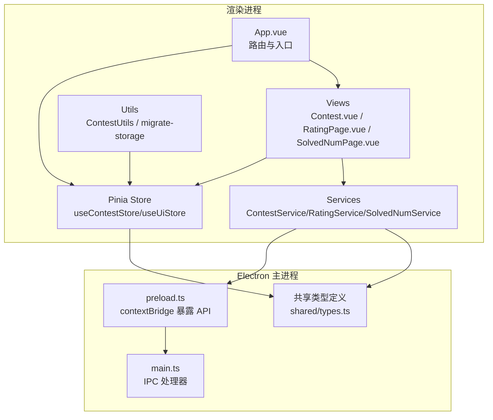
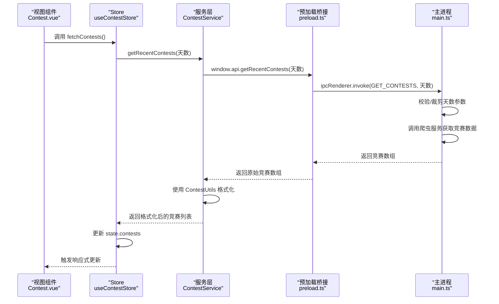
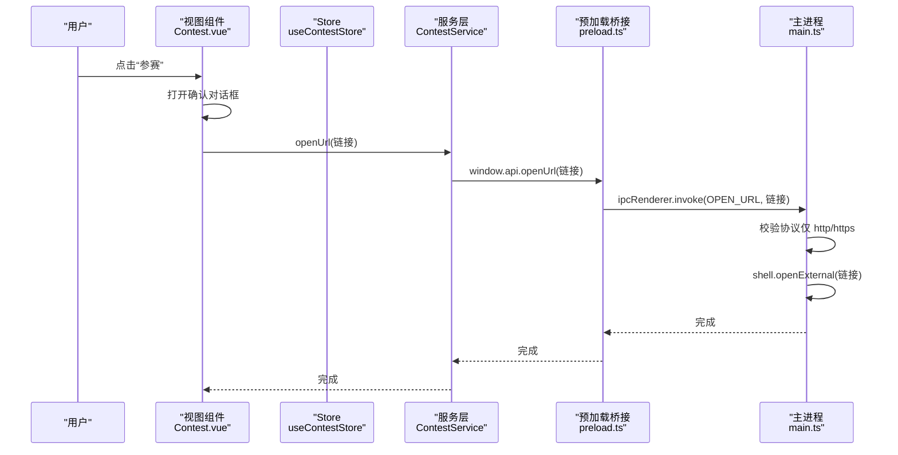
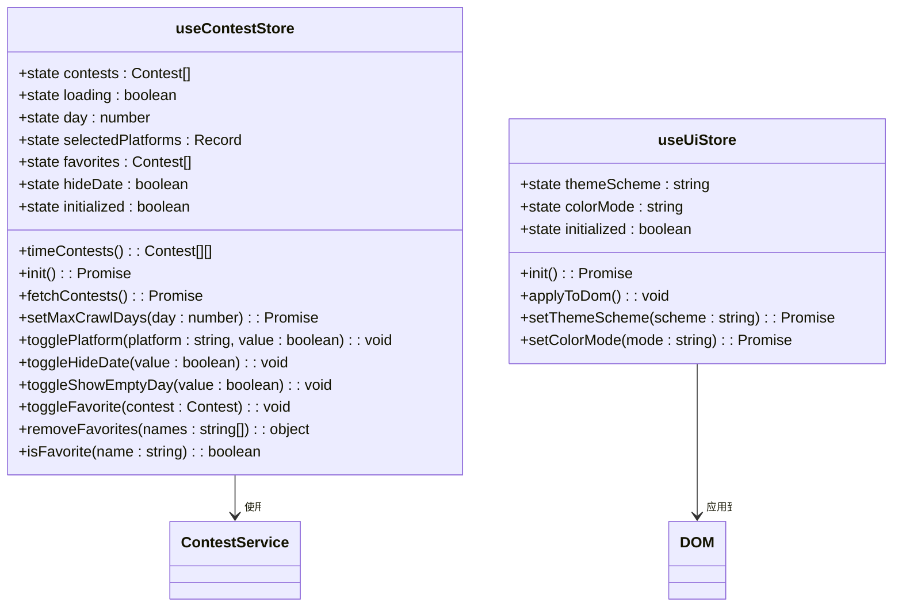
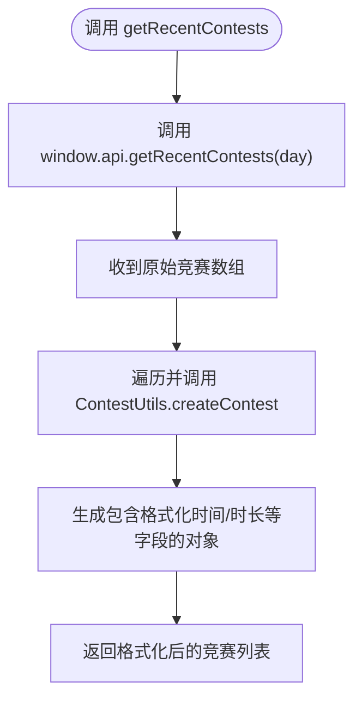
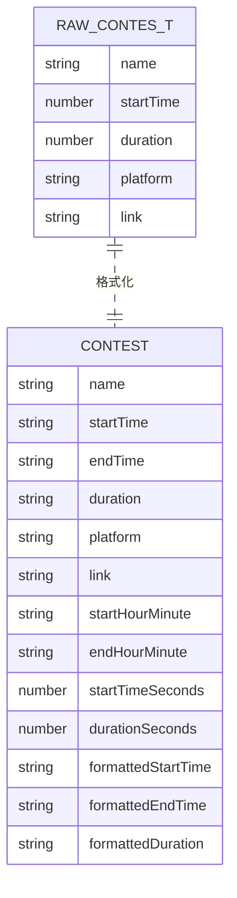
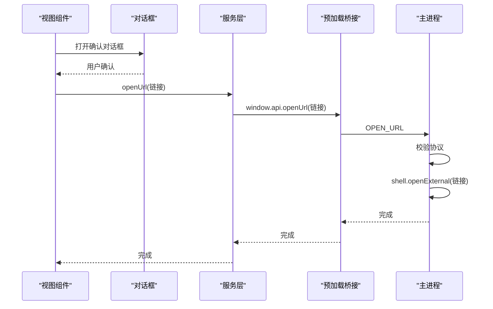
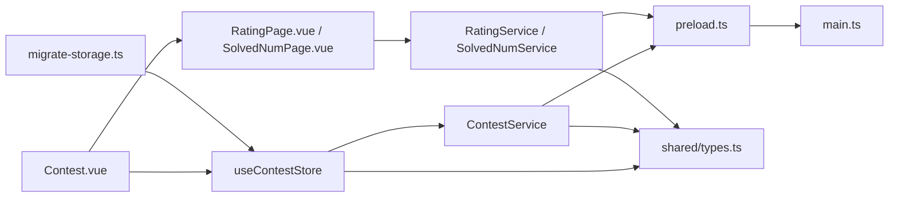

# 数据流架构

<cite>
**本文引用的文件**
- [src/stores/contest.ts](file://src/stores/contest.ts)
- [src/stores/ui.ts](file://src/stores/ui.ts)
- [src/services/contest.ts](file://src/services/contest.ts)
- [src/services/rating.ts](file://src/services/rating.ts)
- [src/services/solved.ts](file://src/services/solved.ts)
- [src/utils/contest_utils.ts](file://src/utils/contest_utils.ts)
- [src/views/Contest.vue](file://src/views/Contest.vue)
- [src/views/RatingPage.vue](file://src/views/RatingPage.vue)
- [src/views/SolvedNumPage.vue](file://src/views/SolvedNumPage.vue)
- [src/main.ts](file://src/main.ts)
- [electron/main.ts](file://electron/main.ts)
- [electron/preload.ts](file://electron/preload.ts)
- [shared/types.ts](file://shared/types.ts)
- [src/utils/migrate-storage.ts](file://src/utils/migrate-storage.ts)
</cite>

## 目录
1. [引言](#引言)
2. [项目结构](#项目结构)
3. [核心组件](#核心组件)
4. [架构总览](#架构总览)
5. [详细组件分析](#详细组件分析)
6. [依赖关系分析](#依赖关系分析)
7. [性能考量](#性能考量)
8. [故障排查指南](#故障排查指南)
9. [结论](#结论)
10. [附录](#附录)

## 引言
本文件系统性梳理 OJFlow 的数据流架构，围绕“从用户操作到界面更新”的完整生命周期展开，重点解释 Pinia store 的状态管理模式（state、getters、actions）、服务层的数据获取与处理机制、数据验证与错误处理策略，并给出典型交互的数据流向与时序图，最后总结性能优化与最佳实践。

## 项目结构
OJFlow 采用前端渲染进程（Vue + Pinia）与 Electron 主进程（IPC 通道）分离的架构。渲染进程负责视图与交互，主进程负责网络请求与系统能力调用；二者通过安全的 IPC 接口通信。

图表来源
- [src/main.ts:1-26](file://src/main.ts#L1-L26)
- [src/views/Contest.vue:344-653](file://src/views/Contest.vue#L344-L653)
- [src/stores/contest.ts:63-307](file://src/stores/contest.ts#L63-L307)
- [src/stores/ui.ts:19-96](file://src/stores/ui.ts#L19-L96)
- [src/services/contest.ts:1-35](file://src/services/contest.ts#L1-L35)
- [src/services/rating.ts:1-8](file://src/services/rating.ts#L1-L8)
- [src/services/solved.ts:1-8](file://src/services/solved.ts#L1-L8)
- [electron/main.ts:396-486](file://electron/main.ts#L396-L486)
- [electron/preload.ts:1-38](file://electron/preload.ts#L1-L38)
- [shared/types.ts:1-67](file://shared/types.ts#L1-L67)

章节来源
- [src/main.ts:1-26](file://src/main.ts#L1-L26)
- [electron/main.ts:396-486](file://electron/main.ts#L396-L486)
- [electron/preload.ts:1-38](file://electron/preload.ts#L1-L38)
- [shared/types.ts:1-67](file://shared/types.ts#L1-L67)

## 核心组件
- Pinia Store（竞赛与UI）
  - useContestStore：管理竞赛数据、筛选、收藏、配置持久化与加载状态
  - useUiStore：管理主题方案与颜色模式，初始化与DOM应用
- 服务层
  - ContestService：封装 window.api.getRecentContests 调用，返回格式化后的竞赛对象
  - RatingService / SolvedNumService：封装对应平台的查询接口
- 工具与类型
  - ContestUtils：竞赛对象格式化与日期文案生成
  - shared/types.ts：定义 RawContest、Contest、Rating、SolvedNum 等类型
  - migrate-storage.ts：localStorage 到 electron-store 的一次性迁移

章节来源
- [src/stores/contest.ts:63-307](file://src/stores/contest.ts#L63-L307)
- [src/stores/ui.ts:19-96](file://src/stores/ui.ts#L19-L96)
- [src/services/contest.ts:1-35](file://src/services/contest.ts#L1-L35)
- [src/services/rating.ts:1-8](file://src/services/rating.ts#L1-L8)
- [src/services/solved.ts:1-8](file://src/services/solved.ts#L1-L8)
- [src/utils/contest_utils.ts:1-68](file://src/utils/contest_utils.ts#L1-L68)
- [shared/types.ts:1-67](file://shared/types.ts#L1-L67)
- [src/utils/migrate-storage.ts:1-64](file://src/utils/migrate-storage.ts#L1-L64)

## 架构总览
渲染进程通过 Pinia 维护全局状态，组件通过 store 读取/写入状态；服务层通过 window.api 与主进程 IPC 通信，主进程执行实际网络请求并返回结果。类型定义在共享模块中，确保前后端一致。

图表来源
- [src/views/Contest.vue:623-625](file://src/views/Contest.vue#L623-L625)
- [src/stores/contest.ts:190-201](file://src/stores/contest.ts#L190-L201)
- [src/services/contest.ts:8-25](file://src/services/contest.ts#L8-L25)
- [electron/preload.ts:6-7](file://electron/preload.ts#L6-L7)
- [electron/main.ts:397-412](file://electron/main.ts#L397-L412)

## 详细组件分析

### 竞赛数据流（从点击到详情）
以“点击竞赛项”为例，展示从用户交互到服务调用与界面更新的完整流程。

图表来源
- [src/views/Contest.vue:627-639](file://src/views/Contest.vue#L627-L639)
- [src/services/contest.ts:27-29](file://src/services/contest.ts#L27-L29)
- [electron/preload.ts:15-16](file://electron/preload.ts#L15-L16)
- [electron/main.ts:452-458](file://electron/main.ts#L452-L458)

章节来源
- [src/views/Contest.vue:627-639](file://src/views/Contest.vue#L627-L639)
- [src/services/contest.ts:27-29](file://src/services/contest.ts#L27-L29)
- [electron/main.ts:452-458](file://electron/main.ts#L452-L458)

### Pinia Store 设计与使用
- state
  - 竞赛：contests、loading、day、showEmptyDay、selectedPlatforms、favorites、hideDate、initialized
  - UI：themeScheme、colorMode、initialized
- getters
  - timeContests：按天分组并排序，供视图按“今天/明天/本周/全部”展示
- actions
  - 初始化：init，从 electron-store 或 localStorage 读取配置，设置 initialized
  - 数据获取：fetchContests，调用服务层获取最近竞赛并写入 state
  - 配置变更：setMaxCrawlDays、togglePlatform、toggleHideDate、toggleShowEmptyDay
  - 收藏管理：toggleFavorite、removeFavorites、isFavorite
  - 持久化：persistFavorites、persistMaxCrawlDays、persistHideDate（localStorage + electron-store 双写）

图表来源
- [src/stores/contest.ts:63-307](file://src/stores/contest.ts#L63-L307)
- [src/stores/ui.ts:19-96](file://src/stores/ui.ts#L19-L96)

章节来源
- [src/stores/contest.ts:63-307](file://src/stores/contest.ts#L63-L307)
- [src/stores/ui.ts:19-96](file://src/stores/ui.ts#L19-L96)

### 服务层数据获取与处理
- ContestService
  - getRecentContests：调用 window.api.getRecentContests，接收原始竞赛数组，使用 ContestUtils.createContest 格式化为渲染可用对象
  - openUrl/installUpdate：通过 window.api 调用主进程打开外部链接或安装更新
- RatingService / SolvedNumService
  - 提供平台级查询封装，直接返回 Promise 结果

图表来源
- [src/services/contest.ts:8-25](file://src/services/contest.ts#L8-L25)
- [src/utils/contest_utils.ts:5-43](file://src/utils/contest_utils.ts#L5-L43)

章节来源
- [src/services/contest.ts:1-35](file://src/services/contest.ts#L1-L35)
- [src/utils/contest_utils.ts:1-68](file://src/utils/contest_utils.ts#L1-L68)

### 类型与数据模型
- RawContest：来自主进程的原始竞赛数据（秒级时间戳）
- Contest：渲染层使用的格式化竞赛数据（含字符串化的时间、时长、时间段等）
- Rating / SolvedNum：平台查询结果的通用结构

图表来源
- [shared/types.ts:1-67](file://shared/types.ts#L1-L67)
- [src/utils/contest_utils.ts:5-43](file://src/utils/contest_utils.ts#L5-L43)

章节来源
- [shared/types.ts:1-67](file://shared/types.ts#L1-L67)
- [src/utils/contest_utils.ts:1-68](file://src/utils/contest_utils.ts#L1-L68)

### 典型用户操作：点击竞赛项到打开链接

图表来源
- [src/views/Contest.vue:627-639](file://src/views/Contest.vue#L627-L639)
- [src/services/contest.ts:27-29](file://src/services/contest.ts#L27-L29)
- [electron/main.ts:452-458](file://electron/main.ts#L452-L458)

章节来源
- [src/views/Contest.vue:627-639](file://src/views/Contest.vue#L627-L639)
- [src/services/contest.ts:27-29](file://src/services/contest.ts#L27-L29)
- [electron/main.ts:452-458](file://electron/main.ts#L452-L458)

### 数据验证与错误处理
- 主进程参数校验
  - GET_CONTESTS：对 day 进行裁剪（min/max），默认 fallback
  - GET_RATING / GET_SOLVED_NUM：校验参数类型与长度，抛出错误
  - OPEN_URL：仅允许 http/https 协议，否则抛错
- 错误分类与重试
  - 主进程内置 fetchWithTimeout + fetchJsonWithRetry，区分超时/网络/未知错误
  - 对 5xx 与特定网络错误进行指数退避重试
- 渲染进程错误处理
  - 服务层 catch 并返回空数组或抛出错误
  - RatingPage.vue / SolvedNumPage.vue 在查询失败时设置错误消息与状态

章节来源
- [electron/main.ts:397-412](file://electron/main.ts#L397-L412)
- [electron/main.ts:414-450](file://electron/main.ts#L414-L450)
- [electron/main.ts:452-458](file://electron/main.ts#L452-L458)
- [electron/main.ts:122-225](file://electron/main.ts#L122-L225)
- [src/services/contest.ts:21-24](file://src/services/contest.ts#L21-L24)
- [src/views/RatingPage.vue:120-129](file://src/views/RatingPage.vue#L120-L129)
- [src/views/SolvedNumPage.vue:192-200](file://src/views/SolvedNumPage.vue#L192-L200)

### 性能优化策略
- 懒加载与按需刷新
  - 组件挂载时仅在无缓存时触发刷新，避免重复请求
  - 通过 store.state.loading 控制加载态，减少无效渲染
- 计算属性与分组
  - timeContests 基于 state.day 与 contests 计算，配合视图按 Tab 切换
- 本地持久化与迁移
  - localStorage/electron-store 双写，保证跨会话一致性
  - migrate-storage 一次性迁移，降低后续初始化成本
- 异步与并发
  - init 中对多个配置项并行读取（Promise.all）
  - 主进程对网络请求设置超时与重试，提升稳定性

章节来源
- [src/views/Contest.vue:641-648](file://src/views/Contest.vue#L641-L648)
- [src/stores/contest.ts:108-114](file://src/stores/contest.ts#L108-L114)
- [src/utils/migrate-storage.ts:1-64](file://src/utils/migrate-storage.ts#L1-L64)
- [electron/main.ts:122-225](file://electron/main.ts#L122-L225)

### 在组件中正确使用 Store 与服务层
- 在模板中绑定 store 状态与切换事件
  - 示例路径：[src/views/Contest.vue:8-20](file://src/views/Contest.vue#L8-L20)
- 在脚本中调用 store.action 与 service.method
  - 示例路径：[src/views/Contest.vue:623-625](file://src/views/Contest.vue#L623-L625)
- 在服务层中处理错误并返回可消费的结果
  - 示例路径：[src/services/contest.ts:21-24](file://src/services/contest.ts#L21-L24)

章节来源
- [src/views/Contest.vue:8-20](file://src/views/Contest.vue#L8-L20)
- [src/views/Contest.vue:623-625](file://src/views/Contest.vue#L623-L625)
- [src/services/contest.ts:21-24](file://src/services/contest.ts#L21-L24)

## 依赖关系分析
- 组件依赖 Store：视图通过 useContestStore/useUiStore 读取状态与触发动作
- Store 依赖服务层：actions 内部调用服务层方法
- 服务层依赖预加载桥接：通过 window.api 调用主进程 IPC
- 主进程依赖共享类型：确保 IPC 参数与返回值类型一致
- 存储迁移：migrate-storage 在启动后完成 localStorage 到 electron-store 的迁移

图表来源
- [src/views/Contest.vue:344-653](file://src/views/Contest.vue#L344-L653)
- [src/stores/contest.ts:63-307](file://src/stores/contest.ts#L63-L307)
- [src/services/contest.ts:1-35](file://src/services/contest.ts#L1-L35)
- [src/services/rating.ts:1-8](file://src/services/rating.ts#L1-L8)
- [src/services/solved.ts:1-8](file://src/services/solved.ts#L1-L8)
- [electron/preload.ts:1-38](file://electron/preload.ts#L1-L38)
- [electron/main.ts:396-486](file://electron/main.ts#L396-L486)
- [shared/types.ts:1-67](file://shared/types.ts#L1-L67)
- [src/utils/migrate-storage.ts:1-64](file://src/utils/migrate-storage.ts#L1-L64)

章节来源
- [src/views/Contest.vue:344-653](file://src/views/Contest.vue#L344-L653)
- [src/stores/contest.ts:63-307](file://src/stores/contest.ts#L63-L307)
- [src/services/contest.ts:1-35](file://src/services/contest.ts#L1-L35)
- [electron/preload.ts:1-38](file://electron/preload.ts#L1-L38)
- [electron/main.ts:396-486](file://electron/main.ts#L396-L486)
- [shared/types.ts:1-67](file://shared/types.ts#L1-L67)
- [src/utils/migrate-storage.ts:1-64](file://src/utils/migrate-storage.ts#L1-L64)

## 性能考量
- 请求节流与去抖
  - 对窗口尺寸变化等高频事件使用防抖，减少计算与渲染压力
- 本地缓存优先
  - 初始化阶段优先从 electron-store/localStorage 读取配置，避免网络请求
- 并发初始化
  - store.init 内部对多配置项并行读取，缩短首屏等待
- 主进程超时与重试
  - fetchWithTimeout + fetchJsonWithRetry 提升网络稳定性，降低失败率

章节来源
- [src/views/SolvedNumPage.vue:157-167](file://src/views/SolvedNumPage.vue#L157-L167)
- [src/stores/contest.ts:108-114](file://src/stores/contest.ts#L108-L114)
- [electron/main.ts:122-225](file://electron/main.ts#L122-L225)

## 故障排查指南
- 网络错误
  - 现象：查询失败、提示“网络或用户名错误”
  - 排查：检查网络连通性、平台接口限制、是否频繁查询导致限流
  - 参考路径：[src/views/RatingPage.vue:120-129](file://src/views/RatingPage.vue#L120-L129)、[src/views/SolvedNumPage.vue:192-200](file://src/views/SolvedNumPage.vue#L192-L200)
- 参数错误
  - 现象：主进程抛出“参数非法/过长”
  - 排查：确认传入 platform/name 长度与类型
  - 参考路径：[electron/main.ts:417-422](file://electron/main.ts#L417-L422)、[electron/main.ts:436-441](file://electron/main.ts#L436-L441)
- 协议错误
  - 现象：打开链接失败
  - 排查：确认链接协议为 http/https
  - 参考路径：[electron/main.ts:454-456](file://electron/main.ts#L454-L456)
- 超时与退避
  - 现象：请求超时
  - 排查：查看主进程日志中的分类错误类型，确认是否触发重试
  - 参考路径：[electron/main.ts:151-167](file://electron/main.ts#L151-L167)、[electron/main.ts:176-225](file://electron/main.ts#L176-L225)

章节来源
- [src/views/RatingPage.vue:120-129](file://src/views/RatingPage.vue#L120-L129)
- [src/views/SolvedNumPage.vue:192-200](file://src/views/SolvedNumPage.vue#L192-L200)
- [electron/main.ts:417-422](file://electron/main.ts#L417-L422)
- [electron/main.ts:436-441](file://electron/main.ts#L436-L441)
- [electron/main.ts:454-456](file://electron/main.ts#L454-L456)
- [electron/main.ts:151-167](file://electron/main.ts#L151-L167)
- [electron/main.ts:176-225](file://electron/main.ts#L176-L225)

## 结论
OJFlow 的数据流以 Pinia 为核心，通过服务层与主进程 IPC 实现稳定的数据获取与处理。store 的 getters/actions 明确职责，服务层封装了数据格式化与错误处理，主进程提供参数校验与网络重试保障。结合本地持久化与迁移策略，系统在性能与可靠性上取得良好平衡。建议在新增功能时遵循现有模式：组件只负责交互与展示，数据逻辑下沉至 store 与 service，错误处理与参数校验集中在主进程与服务层。

## 附录
- 启动与初始化顺序
  - 应用挂载后执行 migrateFromLocalStorage，随后初始化 useUiStore 与 useContestStore
  - 参考路径：[src/main.ts:18-25](file://src/main.ts#L18-L25)、[src/utils/migrate-storage.ts:1-64](file://src/utils/migrate-storage.ts#L1-L64)

章节来源
- [src/main.ts:18-25](file://src/main.ts#L18-L25)
- [src/utils/migrate-storage.ts:1-64](file://src/utils/migrate-storage.ts#L1-L64)