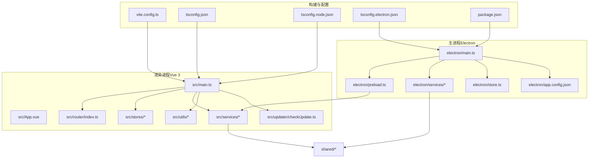
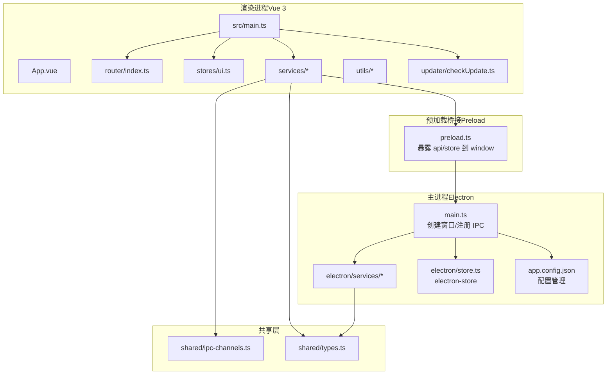
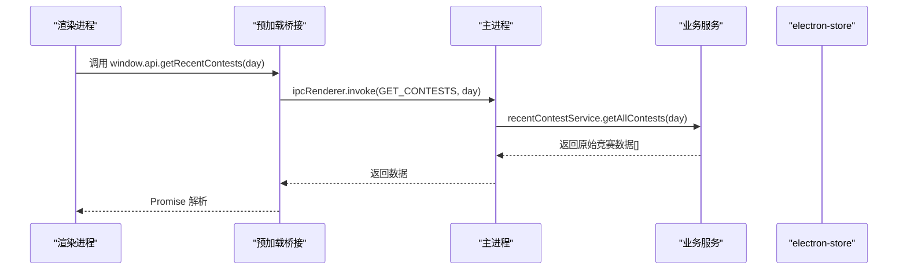
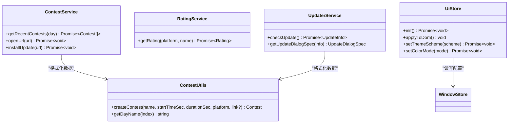
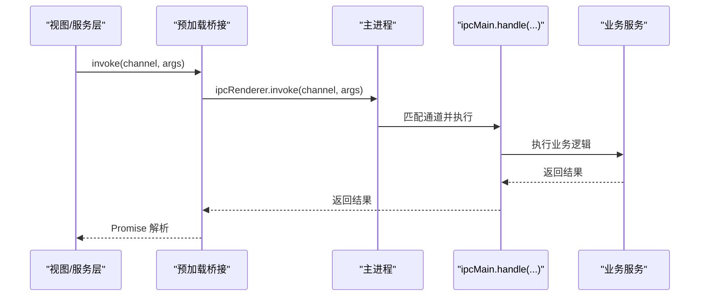
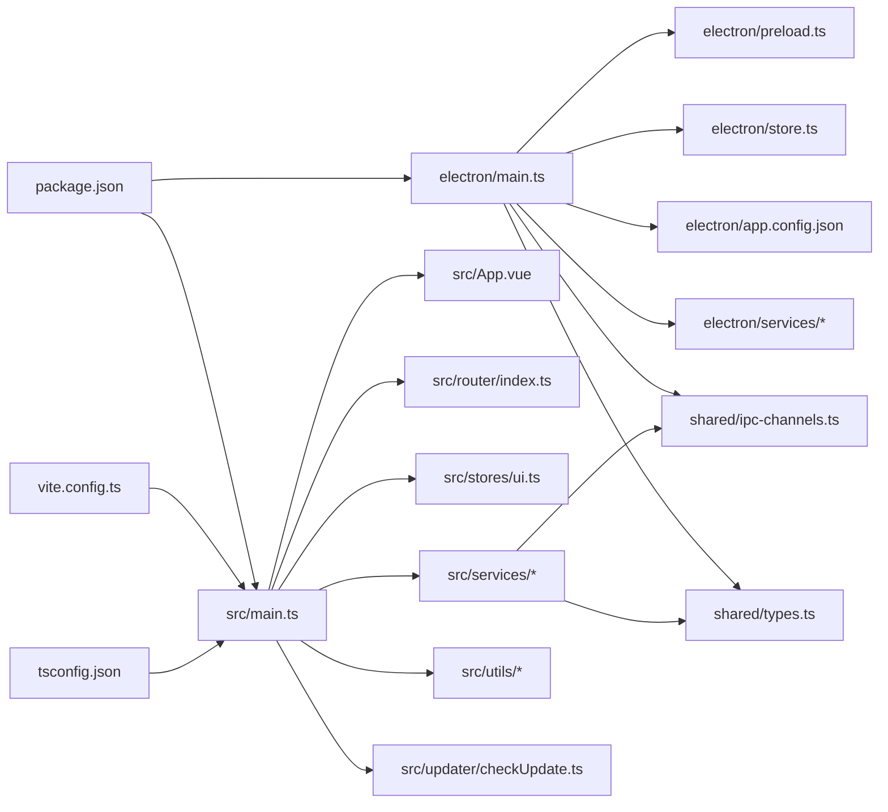

# 架构设计

<cite>
**本文引用的文件**
- [package.json](file://package.json)
- [vite.config.ts](file://vite.config.ts)
- [tsconfig.json](file://tsconfig.json)
- [tsconfig.node.json](file://tsconfig.node.json)
- [tsconfig.electron.json](file://tsconfig.electron.json)
- [electron/main.ts](file://electron/main.ts)
- [electron/preload.ts](file://electron/preload.ts)
- [electron/store.ts](file://electron/store.ts)
- [electron/app.config.json](file://electron/app.config.json)
- [electron/services/contest.ts](file://electron/services/contest.ts)
- [electron/services/rating.ts](file://electron/services/rating.ts)
- [electron/services/solvedNum.ts](file://electron/services/solvedNum.ts)
- [shared/ipc-channels.ts](file://shared/ipc-channels.ts)
- [shared/types.ts](file://shared/types.ts)
- [src/main.ts](file://src/main.ts)
- [src/App.vue](file://src/App.vue)
- [src/router/index.ts](file://src/router/index.ts)
- [src/stores/ui.ts](file://src/stores/ui.ts)
- [src/services/contest.ts](file://src/services/contest.ts)
- [src/services/rating.ts](file://src/services/rating.ts)
- [src/utils/contest_utils.ts](file://src/utils/contest_utils.ts)
- [src/updater/checkUpdate.ts](file://src/updater/checkUpdate.ts)
- [src/types/index.ts](file://src/types/index.ts)
</cite>

## 更新摘要
**变更内容**
- 主进程已完全重构为 TypeScript 版本，引入完整的类型系统和增强的错误处理机制
- 自动更新功能得到显著增强，包含超时控制、重试策略和指数回退算法
- IPC 通道管理更加完善，提供更强的类型安全保障
- 新增配置文件支持，允许动态调整爬取天数等参数
- **新增**：IpcHandlerMap 接口提供完整的 IPC 类型映射，实现端到端的类型安全

## 目录
1. [引言](#引言)
2. [项目结构](#项目结构)
3. [核心组件](#核心组件)
4. [架构总览](#架构总览)
5. [详细组件分析](#详细组件分析)
6. [依赖关系分析](#依赖关系分析)
7. [性能考虑](#性能考虑)
8. [故障排查指南](#故障排查指南)
9. [结论](#结论)
10. [附录](#附录)

## 引言
本架构设计文档面向 OJFlow 项目，系统性阐述其基于 Electron + Vue 3 的双进程架构模式，明确主进程与渲染进程的职责边界与通信机制；解析 MVVM 架构在前端的落地（视图层、服务层、数据层），并深入说明 IPC 通信协议与数据序列化策略；同时说明 TypeScript 在类型安全与代码组织方面的应用，并给出系统边界图与组件交互图，帮助开发者与维护者快速理解与扩展系统。

**更新** 主进程已完全重构为 TypeScript 版本，引入了完整的类型系统、增强的错误处理机制和更强大的自动更新功能。**新增** IpcHandlerMap 接口提供端到端的 IPC 类型安全保证。

## 项目结构
OJFlow 采用"Electron 主进程 + Vue 渲染进程"的双进程架构，源码按功能域与职责分层组织：
- electron：主进程入口、预加载脚本、配置存储与业务服务封装
- src：Vue 应用入口、路由、状态管理、服务层、工具类与视图层
- shared：跨进程共享的 IPC 常量与类型定义
- 配置：Vite 构建配置、TypeScript 编译配置（含 node 与 electron 两套）

**图表来源**
- [vite.config.ts:1-15](file://vite.config.ts#L1-L15)
- [tsconfig.json:1-26](file://tsconfig.json#L1-L26)
- [tsconfig.node.json](file://tsconfig.node.json)
- [tsconfig.electron.json:1-26](file://tsconfig.electron.json#L1-L26)
- [package.json:1-127](file://package.json#L1-L127)
- [electron/main.ts:1-502](file://electron/main.ts#L1-L502)
- [electron/preload.ts:1-38](file://electron/preload.ts#L1-L38)
- [electron/store.ts:1-31](file://electron/store.ts#L1-L31)
- [electron/app.config.json:1-62](file://electron/app.config.json#L1-L62)
- [src/main.ts:1-26](file://src/main.ts#L1-L26)
- [src/App.vue:1-23](file://src/App.vue#L1-L23)
- [src/router/index.ts:1-48](file://src/router/index.ts#L1-L48)
- [src/stores/ui.ts:1-91](file://src/stores/ui.ts#L1-L91)
- [src/services/contest.ts:1-35](file://src/services/contest.ts#L1-L35)
- [src/services/rating.ts:1-8](file://src/services/rating.ts#L1-L8)
- [src/utils/contest_utils.ts:1-68](file://src/utils/contest_utils.ts#L1-L68)
- [src/updater/checkUpdate.ts:1-311](file://src/updater/checkUpdate.ts#L1-L311)
- [shared/ipc-channels.ts:1-53](file://shared/ipc-channels.ts#L1-L53)
- [shared/types.ts:1-67](file://shared/types.ts#L1-L67)

**章节来源**
- [package.json:1-127](file://package.json#L1-L127)
- [vite.config.ts:1-15](file://vite.config.ts#L1-L15)
- [tsconfig.json:1-26](file://tsconfig.json#L1-L26)

## 核心组件
- 双进程边界与职责
  - 主进程：负责系统级能力（窗口管理、原生菜单、更新检查、网络请求、文件系统、配置持久化等）
  - 渲染进程：负责用户界面、路由导航、状态管理、业务服务调用与视图渲染
- IPC 通道与类型映射：通过共享常量与类型映射保证主/渲染两端的强一致
- MVVM 分层
  - 视图层（Vue 组件）：负责展示与用户交互
  - 服务层（src/services/*）：封装业务逻辑与 IPC 调用
  - 数据层（Pinia Store、electron-store）：统一状态与本地持久化
- 类型系统：使用 TypeScript 与共享类型定义，确保 IPC 参数与返回值的类型安全

**更新** 主进程已完全重构为 TypeScript，提供更强的类型安全保障和错误处理机制。**新增** IpcHandlerMap 接口提供完整的 IPC 类型映射。

**章节来源**
- [electron/main.ts:19-502](file://electron/main.ts#L19-L502)
- [electron/preload.ts:1-38](file://electron/preload.ts#L1-L38)
- [shared/ipc-channels.ts:1-53](file://shared/ipc-channels.ts#L1-L53)
- [shared/types.ts:1-67](file://shared/types.ts#L1-L67)
- [src/services/contest.ts:1-35](file://src/services/contest.ts#L1-L35)
- [src/stores/ui.ts:1-91](file://src/stores/ui.ts#L1-L91)

## 架构总览
下图展示了 OJFlow 的系统边界与组件交互：主进程提供 IPC 处理器与系统能力，渲染进程通过预加载桥接暴露受限 API，二者通过 IPC 通道进行消息传递；服务层封装业务调用，状态层统一管理 UI 与用户配置。

**图表来源**
- [src/App.vue:1-23](file://src/App.vue#L1-L23)
- [src/main.ts:1-26](file://src/main.ts#L1-L26)
- [src/router/index.ts:1-48](file://src/router/index.ts#L1-L48)
- [src/stores/ui.ts:1-91](file://src/stores/ui.ts#L1-L91)
- [src/services/contest.ts:1-35](file://src/services/contest.ts#L1-L35)
- [src/services/rating.ts:1-8](file://src/services/rating.ts#L1-L8)
- [src/utils/contest_utils.ts:1-68](file://src/utils/contest_utils.ts#L1-L68)
- [src/updater/checkUpdate.ts:1-311](file://src/updater/checkUpdate.ts#L1-L311)
- [electron/preload.ts:1-38](file://electron/preload.ts#L1-L38)
- [electron/main.ts:19-502](file://electron/main.ts#L19-L502)
- [electron/store.ts:1-31](file://electron/store.ts#L1-L31)
- [electron/app.config.json:1-62](file://electron/app.config.json#L1-L62)
- [shared/ipc-channels.ts:1-53](file://shared/ipc-channels.ts#L1-L53)
- [shared/types.ts:1-67](file://shared/types.ts#L1-L67)

## 详细组件分析

### 主进程（Electron）组件
- 进程启动与窗口创建
  - 创建 BrowserWindow，启用上下文隔离与预加载脚本，开发/生产环境分别加载本地或打包页面
  - 设置外部链接打开行为，避免在应用内嵌浏览器中打开不受控内容
- IPC 处理器注册
  - 提供竞赛列表、评分查询、解题数查询、打开外部链接、安装更新等处理器
  - 对参数进行校验与范围约束，异常捕获并记录日志
- 更新流程
  - 启动时拉取更新清单，对比版本，弹窗提示后下载并启动新包
  - 支持超时控制、重试与指数回退策略
- 配置存储
  - 使用 electron-store 管理用户配置，提供 get/set/getAll 接口并通过 IPC 暴露给渲染进程
- 类型安全增强
  - 完整的 TypeScript 类型系统，包括接口定义、泛型约束和错误处理
  - 配置文件支持动态参数调整

**更新** 主进程已完全重构为 TypeScript，引入了完整的类型系统和增强的错误处理机制。新增了配置文件支持，允许动态调整爬取天数等参数。

**图表来源**
- [electron/preload.ts:1-38](file://electron/preload.ts#L1-L38)
- [electron/main.ts:406-421](file://electron/main.ts#L406-L421)
- [shared/ipc-channels.ts:1-53](file://shared/ipc-channels.ts#L1-L53)

**章节来源**
- [electron/main.ts:19-502](file://electron/main.ts#L19-L502)
- [electron/store.ts:1-31](file://electron/store.ts#L1-L31)
- [electron/app.config.json:1-62](file://electron/app.config.json#L1-L62)

### 预加载桥接（Preload）
- 仅暴露白名单 API 至 window，避免直接暴露 ipcRenderer
- 封装常见 IPC 调用（获取竞赛、评分、解题数、打开链接、安装更新）
- 暴露 store API（get/set/getAll），用于读写用户配置

**章节来源**
- [electron/preload.ts:1-38](file://electron/preload.ts#L1-L38)

### 渲染进程（Vue 3）组件
- 应用入口与初始化
  - 创建 Vue 应用，挂载 Pinia 与路由
  - 应用启动后迁移旧存储、初始化 UI 与竞赛相关状态
- 视图与路由
  - 使用 Naive UI 提供的主题容器与对话框容器
  - 定义多页面路由，支持兼容旧路径
- 状态管理（Pinia）
  - UI 状态（主题方案、颜色模式）从 electron-store 或 localStorage 初始化
  - 写入时优先使用 window.store，失败则回退到 localStorage
- 服务层
  - ContestService：封装 IPC 调用与数据格式化
  - RatingService：封装评分查询
  - UpdaterService：封装更新检查逻辑
- 工具类
  - ContestUtils：将秒级时间戳转换为可读字符串、计算结束时间与持续时间、生成日期标签

**更新** 新增了更新检查服务，提供更完善的更新管理功能。

**图表来源**
- [src/services/contest.ts:1-35](file://src/services/contest.ts#L1-L35)
- [src/services/rating.ts:1-8](file://src/services/rating.ts#L1-L8)
- [src/updater/checkUpdate.ts:1-311](file://src/updater/checkUpdate.ts#L1-L311)
- [src/utils/contest_utils.ts:1-68](file://src/utils/contest_utils.ts#L1-L68)
- [src/stores/ui.ts:1-91](file://src/stores/ui.ts#L1-L91)

**章节来源**
- [src/main.ts:1-26](file://src/main.ts#L1-L26)
- [src/App.vue:1-23](file://src/App.vue#L1-L23)
- [src/router/index.ts:1-48](file://src/router/index.ts#L1-L48)
- [src/stores/ui.ts:1-91](file://src/stores/ui.ts#L1-L91)
- [src/services/contest.ts:1-35](file://src/services/contest.ts#L1-L35)
- [src/services/rating.ts:1-8](file://src/services/rating.ts#L1-L8)
- [src/utils/contest_utils.ts:1-68](file://src/utils/contest_utils.ts#L1-L68)
- [src/updater/checkUpdate.ts:1-311](file://src/updater/checkUpdate.ts#L1-L311)

### IPC 通信机制与消息协议
- 通道定义
  - 通过共享常量集中管理 IPC 通道名，避免魔法字符串
  - 明确每个通道的参数与返回值类型映射，便于静态校验
- 调用模型
  - 渲染进程通过 ipcRenderer.invoke 发送请求
  - 主进程通过 ipcMain.handle 注册处理器，执行业务逻辑后返回结果
- 数据序列化
  - 通过 Electron 的内置序列化机制传输对象；注意不传输不可序列化对象（如函数、循环引用）
- 错误处理
  - 主进程对参数进行合法性校验与范围约束
  - 对网络/超时错误进行分类，便于 UI 层反馈
- **新增**：IpcHandlerMap 接口提供完整的类型映射
  - 端到端的类型安全保障，编译期检查 IPC 调用的参数和返回值
  - 支持所有 IPC 通道的参数类型定义和返回值类型约束
  - 与 TypeScript 类型系统深度集成，提供智能提示和重构支持

**更新** TypeScript 类型系统确保了 IPC 通道的类型安全，提供更好的开发体验和运行时保护。**新增** IpcHandlerMap 接口提供完整的 IPC 类型映射，实现端到端的类型安全。

**图表来源**
- [shared/ipc-channels.ts:1-53](file://shared/ipc-channels.ts#L1-L53)
- [electron/preload.ts:1-38](file://electron/preload.ts#L1-L38)
- [electron/main.ts:406-493](file://electron/main.ts#L406-L493)

**章节来源**
- [shared/ipc-channels.ts:1-53](file://shared/ipc-channels.ts#L1-L53)
- [electron/preload.ts:1-38](file://electron/preload.ts#L1-L38)
- [electron/main.ts:406-493](file://electron/main.ts#L406-L493)

### MVVM 架构在前端的应用
- 视图层（App.vue、各页面组件）
  - 使用 Naive UI 提供的 Provider 容器组织全局样式与对话框
  - 通过路由切换页面，保持单一入口
- 服务层（src/services/*）
  - 将 IPC 调用与数据格式化封装为领域服务，降低组件耦合
- 数据层（Pinia Store、electron-store）
  - UI 状态与用户配置统一由 Store 管理，支持持久化与回退策略

**章节来源**
- [src/App.vue:1-23](file://src/App.vue#L1-L23)
- [src/router/index.ts:1-48](file://src/router/index.ts#L1-L48)
- [src/stores/ui.ts:1-91](file://src/stores/ui.ts#L1-L91)
- [src/services/contest.ts:1-35](file://src/services/contest.ts#L1-L35)
- [src/services/rating.ts:1-8](file://src/services/rating.ts#L1-L8)

### TypeScript 在架构中的作用
- 类型安全
  - 共享类型定义 RawContest、Contest、Rating、SolvedNum 等，确保主/渲染两端数据契约一致
  - IPC 通道的参数与返回值通过 IpcHandlerMap 映射，编译期约束调用方
  - 主进程引入完整的接口定义和类型约束
- 代码组织
  - 分离 tsconfig.node.json 与 tsconfig.electron.json，分别服务于 Vite 与 Electron 编译
  - 严格模式与 lib 配置提升整体健壮性
- 构建与校验
  - package.json 中提供 type-check 脚本，结合 vue-tsc 与 tsc 实现前端与主进程的类型检查
- **新增**：IpcHandlerMap 接口的类型映射
  - 为每个 IPC 通道提供精确的参数类型和返回值类型定义
  - 支持复杂对象类型的嵌套结构和联合类型的约束
  - 与 TypeScript 的条件类型和映射类型特性深度结合

**更新** 主进程已完全重构为 TypeScript，提供更强的类型安全保障和开发体验。**新增** IpcHandlerMap 接口提供完整的 IPC 类型映射。

**章节来源**
- [shared/types.ts:1-67](file://shared/types.ts#L1-L67)
- [shared/ipc-channels.ts:18-52](file://shared/ipc-channels.ts#L18-L52)
- [tsconfig.json:1-26](file://tsconfig.json#L1-L26)
- [tsconfig.node.json](file://tsconfig.node.json)
- [tsconfig.electron.json:1-26](file://tsconfig.electron.json#L1-L26)
- [package.json:53](file://package.json#L53)

### 自动更新系统增强
- 版本比较与检测
  - 支持语义化版本号解析和比较
  - 动态检测更新清单格式（支持 GitHub Releases 格式）
- 超时与重试机制
  - 可配置的超时时间、重试次数和指数回退策略
  - 网络错误和超时错误的智能分类处理
- 平台适配
  - 支持多平台包选择和下载
  - 自动处理下载进度和文件保存

**更新** 自动更新功能得到显著增强，包含超时控制、重试策略和指数回退算法。

**章节来源**
- [electron/main.ts:80-352](file://electron/main.ts#L80-L352)
- [src/updater/checkUpdate.ts:1-311](file://src/updater/checkUpdate.ts#L1-L311)

## 依赖关系分析
- 运行时依赖
  - Vue 3、Pinia、Naive UI、Vue Router、Axios、Cheerio、date-fns、ECharts、electron-store 等
- 构建与打包
  - Vite、electron、electron-builder、concurrently、wait-on 等
- 开发与质量保障
  - ESLint、Prettier、Playwright、TypeScript、vue-tsc 等

**图表来源**
- [package.json:1-127](file://package.json#L1-L127)
- [vite.config.ts:1-15](file://vite.config.ts#L1-L15)
- [tsconfig.json:1-26](file://tsconfig.json#L1-L26)
- [electron/main.ts:19-502](file://electron/main.ts#L19-L502)
- [electron/preload.ts:1-38](file://electron/preload.ts#L1-L38)
- [electron/store.ts:1-31](file://electron/store.ts#L1-L31)
- [electron/app.config.json:1-62](file://electron/app.config.json#L1-L62)
- [electron/services/contest.ts:1-292](file://electron/services/contest.ts#L1-L292)
- [electron/services/rating.ts:1-181](file://electron/services/rating.ts#L1-L181)
- [electron/services/solvedNum.ts:1-205](file://electron/services/solvedNum.ts#L1-L205)
- [shared/ipc-channels.ts:1-53](file://shared/ipc-channels.ts#L1-L53)
- [shared/types.ts:1-67](file://shared/types.ts#L1-L67)
- [src/main.ts:1-26](file://src/main.ts#L1-L26)
- [src/App.vue:1-23](file://src/App.vue#L1-L23)
- [src/router/index.ts:1-48](file://src/router/index.ts#L1-L48)
- [src/stores/ui.ts:1-91](file://src/stores/ui.ts#L1-L91)
- [src/services/contest.ts:1-35](file://src/services/contest.ts#L1-L35)
- [src/services/rating.ts:1-8](file://src/services/rating.ts#L1-L8)
- [src/utils/contest_utils.ts:1-68](file://src/utils/contest_utils.ts#L1-L68)
- [src/updater/checkUpdate.ts:1-311](file://src/updater/checkUpdate.ts#L1-L311)

**章节来源**
- [package.json:1-127](file://package.json#L1-L127)

## 性能考虑
- 构建与资源路径
  - Vite 配置使用相对 base，避免打包后资源路径问题
- 窗口与渲染
  - 上下文隔离开启，减少 XSS 风险；预加载脚本仅暴露必要 API
- 网络与更新
  - 更新检查与下载支持超时、重试与回退策略，降低失败率
- 数据处理
  - 时间格式化与持续时间计算在渲染进程完成，避免主进程阻塞
- 存储
  - 优先使用 electron-store，失败回退 localStorage，兼顾可靠性与性能
- 类型系统优化
  - TypeScript 编译器优化，减少运行时开销
- **新增**：IpcHandlerMap 类型映射的性能优势
  - 编译期类型检查，运行时零开销
  - 减少运行时参数验证逻辑，提升 IPC 调用性能

**更新** TypeScript 编译器优化和类型系统检查提升了整体性能和开发效率。**新增** IpcHandlerMap 类型映射提供编译期优化。

**章节来源**
- [vite.config.ts:4-15](file://vite.config.ts#L4-L15)
- [electron/main.ts:357-385](file://electron/main.ts#L357-L385)
- [electron/main.ts:292-352](file://electron/main.ts#L292-L352)
- [src/stores/ui.ts:25-47](file://src/stores/ui.ts#L25-L47)

## 故障排查指南
- IPC 通道调用失败
  - 检查通道名是否与共享常量一致
  - 确认参数类型与长度限制（如平台名、用户名）
  - **新增**：检查 IpcHandlerMap 中的类型定义是否匹配
- 网络请求与更新
  - 查看超时与重试配置，确认代理与 DNS 设置
  - 检查更新清单 URL 与平台包选择逻辑
- 存储读写异常
  - 确认 electron-store 初始化与权限
  - 回退到 localStorage 校验配置是否可用
- 构建与运行
  - 确认 Vite 端口未被占用，严格端口模式有助于定位冲突
  - 检查 TypeScript 类型检查与 ESLint 报错
- 主进程错误处理
  - 查看控制台日志中的错误分类（网络、超时、未知）
  - 检查配置文件格式和参数有效性
- **新增**：TypeScript 类型错误排查
  - 检查 IpcHandlerMap 接口的类型定义是否正确
  - 确认共享类型定义的一致性
  - 验证编译配置中的模块解析设置

**更新** 新增了主进程错误处理和配置文件相关的故障排查指导。**新增** TypeScript 类型错误排查指南。

**章节来源**
- [shared/ipc-channels.ts:1-53](file://shared/ipc-channels.ts#L1-L53)
- [electron/main.ts:414-450](file://electron/main.ts#L414-L450)
- [electron/main.ts:176-225](file://electron/main.ts#L176-L225)
- [electron/store.ts:1-31](file://electron/store.ts#L1-L31)
- [vite.config.ts:7-10](file://vite.config.ts#L7-L10)
- [package.json:50-53](file://package.json#L50-L53)

## 结论
OJFlow 采用清晰的双进程架构与 MVVM 分层，借助 TypeScript 与共享类型定义实现了跨进程的类型安全，通过预加载桥接与 IPC 通道建立了稳定的通信机制。**更新后的主进程重构**进一步增强了系统的类型安全性和错误处理能力，自动更新功能也得到了显著改善。**新增的 IpcHandlerMap 接口**提供了端到端的 IPC 类型安全保障，使得整个架构在编译期就能发现类型错误，大大提升了开发效率和系统稳定性。该架构在保证安全性与可维护性的同时，提供了良好的扩展空间与性能表现。

## 附录
- 关键配置要点
  - Vite：相对 base、严格端口、输出目录
  - TypeScript：严格模式、模块解析、库声明
  - Electron：上下文隔离、预加载脚本、窗口行为
  - 配置文件：支持动态参数调整和多平台配置
  - **新增**：IpcHandlerMap：提供完整的 IPC 类型映射和编译期检查
- 第三方依赖建议
  - 保持 axios、cheerio、date-fns、echarts、naive-ui、pinia、vue、vue-router 的版本兼容
  - 使用 overrides 控制特定依赖版本（如 entities）
- **新增**：TypeScript 类型系统最佳实践
  - 使用 as const 确保 IPC 通道名的字面量类型
  - 通过泛型约束实现参数和返回值的精确类型定义
  - 利用 TypeScript 的条件类型和映射类型特性优化类型推导

**更新** 新增了配置文件支持和 TypeScript 编译配置的相关要点。**新增** IpcHandlerMap 接口和 TypeScript 类型系统最佳实践。

**章节来源**
- [vite.config.ts:1-15](file://vite.config.ts#L1-L15)
- [tsconfig.json:1-26](file://tsconfig.json#L1-L26)
- [package.json:55-93](file://package.json#L55-L93)
- [electron/main.ts:357-385](file://electron/main.ts#L357-L385)
- [tsconfig.electron.json:1-26](file://tsconfig.electron.json#L1-L26)
- [electron/app.config.json:1-62](file://electron/app.config.json#L1-L62)
- [shared/ipc-channels.ts:18-52](file://shared/ipc-channels.ts#L18-L52)