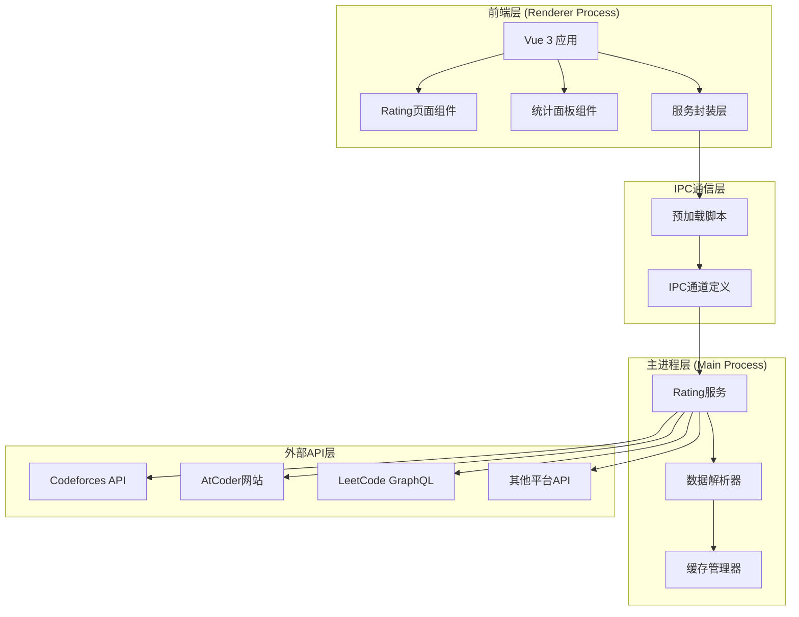
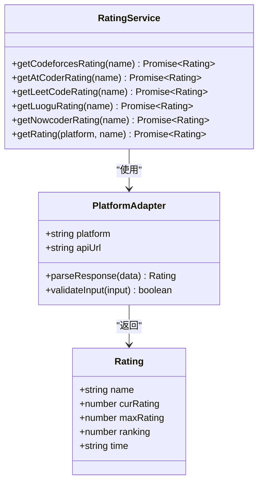
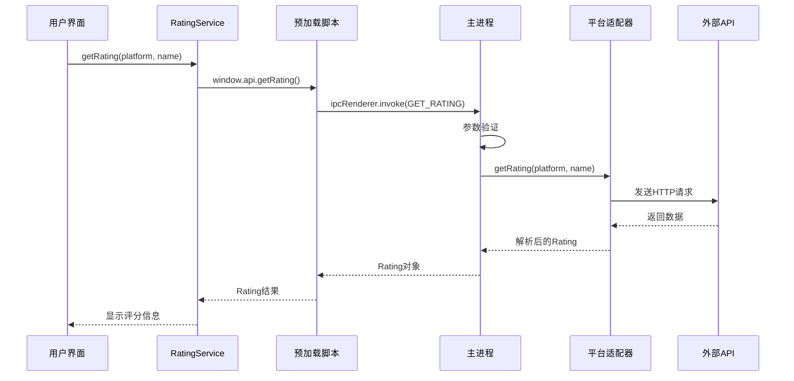
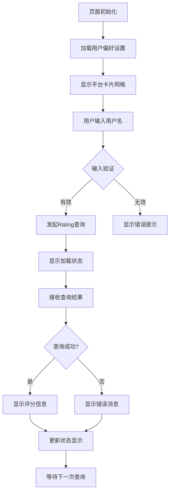
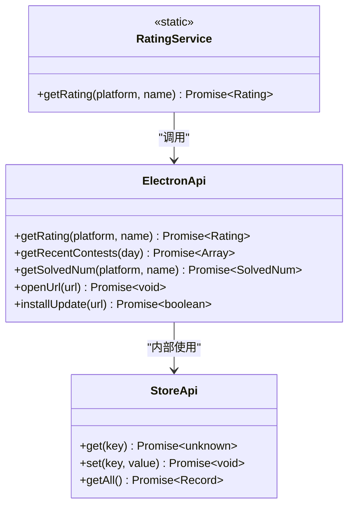
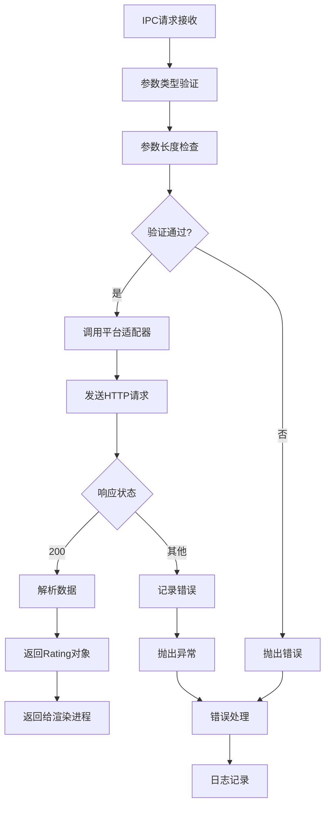
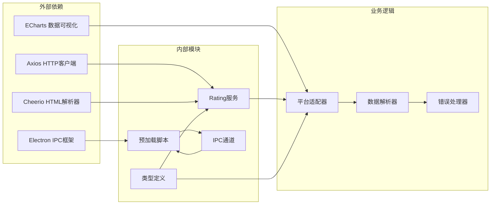
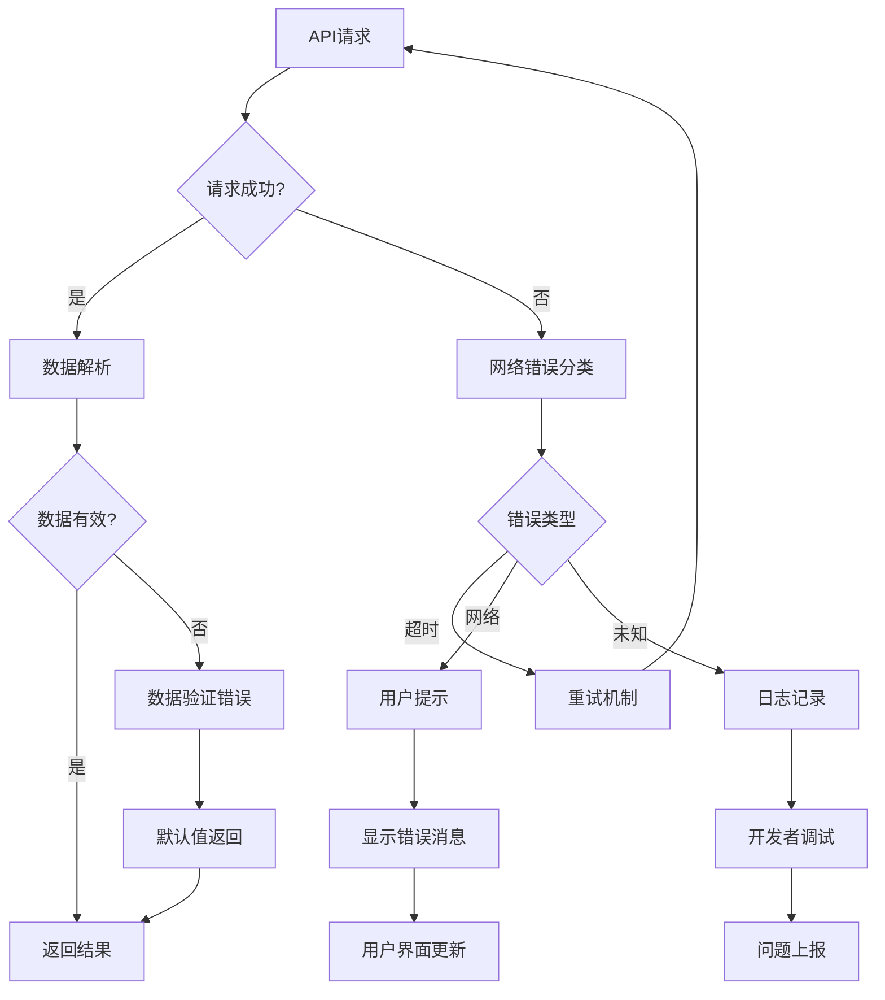

# Rating追踪系统

<cite>
**本文档引用的文件**
- [electron/services/rating.ts](file://electron/services/rating.ts)
- [src/services/rating.ts](file://src/services/rating.ts)
- [electron/main.ts](file://electron/main.ts)
- [electron/preload.ts](file://electron/preload.ts)
- [shared/types.ts](file://shared/types.ts)
- [shared/ipc-channels.ts](file://shared/ipc-channels.ts)
- [src/views/RatingPage.vue](file://src/views/RatingPage.vue)
- [src/components/StatsPanel.vue](file://src/components/StatsPanel.vue)
- [src/utils/migrate-storage.ts](file://src/utils/migrate-storage.ts)
- [README.md](file://README.md)
</cite>

## 目录
1. [简介](#简介)
2. [项目结构](#项目结构)
3. [核心组件](#核心组件)
4. [架构概览](#架构概览)
5. [详细组件分析](#详细组件分析)
6. [依赖关系分析](#依赖关系分析)
7. [性能考虑](#性能考虑)
8. [故障排除指南](#故障排除指南)
9. [结论](#结论)
10. [附录](#附录)

## 简介

Rating追踪系统是OJFlow项目中的一个核心功能模块，专门用于跟踪和展示算法竞赛选手在各个在线判题平台（Online Judge）上的评分变化。该系统支持多平台集成，包括Codeforces、AtCoder、LeetCode、洛谷、牛客等主流竞赛平台。

系统采用Electron + Vue 3的技术栈构建，实现了跨平台桌面应用的Rating数据查询、解析、缓存和可视化展示功能。通过统一的API接口，用户可以方便地查看自己在不同平台上的Rating历史和当前状态。

## 项目结构

OJFlow项目采用现代化的前后端分离架构，主要分为以下几个层次：

**图表来源**
- [src/views/RatingPage.vue:1-226](file://src/views/RatingPage.vue#L1-L226)
- [electron/preload.ts:1-38](file://electron/preload.ts#L1-L38)
- [electron/services/rating.ts:1-175](file://electron/services/rating.ts#L1-L175)

**章节来源**
- [README.md:35-69](file://README.md#L35-L69)
- [src/views/RatingPage.vue:64-138](file://src/views/RatingPage.vue#L64-L138)

## 核心组件

### 数据模型设计

系统的核心数据模型基于统一的Rating接口，定义了标准化的评分数据结构：

**图表来源**
- [shared/types.ts:28-34](file://shared/types.ts#L28-L34)
- [electron/services/rating.ts:5-175](file://electron/services/rating.ts#L5-L175)

### 平台适配器架构

系统采用适配器模式设计，为每个支持的平台提供专门的数据获取和解析逻辑：

| 平台名称 | API类型 | 数据解析方式 | 特殊处理 |
|---------|---------|-------------|----------|
| Codeforces | REST API | JSON解析 | 直接API调用 |
| AtCoder | 网页抓取 | Cheerio HTML解析 | DOM选择器提取 |
| LeetCode | GraphQL | JSON响应解析 | 历史记录聚合 |
| 洛谷 | REST API | JSON解析 | 用户搜索+详情页 |
| 牛客 | REST API | JSON解析 | 历史记录数组 |

**章节来源**
- [shared/types.ts:42-55](file://shared/types.ts#L42-L55)
- [electron/services/rating.ts:12-154](file://electron/services/rating.ts#L12-L154)

## 架构概览

系统采用三层架构设计，实现了清晰的职责分离和良好的可扩展性：

**图表来源**
- [src/services/rating.ts:3-7](file://src/services/rating.ts#L3-L7)
- [electron/preload.ts:9-10](file://electron/preload.ts#L9-L10)
- [electron/main.ts:414-431](file://electron/main.ts#L414-L431)

**章节来源**
- [electron/main.ts:396-431](file://electron/main.ts#L396-L431)
- [shared/ipc-channels.ts:3-16](file://shared/ipc-channels.ts#L3-L16)

## 详细组件分析

### Rating页面组件

Rating页面是用户交互的核心界面，提供了直观的多平台评分查询功能：

**图表来源**
- [src/views/RatingPage.vue:92-137](file://src/views/RatingPage.vue#L92-L137)

#### 用户界面特性

- **响应式布局**：支持不同屏幕尺寸的自适应显示
- **平台图标**：为每个支持的平台提供专用图标
- **输入验证**：实时验证用户输入的有效性
- **状态反馈**：提供详细的加载和错误状态指示
- **本地存储**：自动保存用户的平台偏好设置

**章节来源**
- [src/views/RatingPage.vue:14-61](file://src/views/RatingPage.vue#L14-L61)
- [src/views/RatingPage.vue:112-137](file://src/views/RatingPage.vue#L112-L137)

### 服务封装层

服务封装层提供了统一的API接口，隐藏了底层的IPC通信细节：

**图表来源**
- [src/services/rating.ts:3-7](file://src/services/rating.ts#L3-L7)
- [electron/preload.ts:5-31](file://electron/preload.ts#L5-L31)

**章节来源**
- [src/services/rating.ts:1-8](file://src/services/rating.ts#L1-L8)
- [electron/preload.ts:1-38](file://electron/preload.ts#L1-L38)

### 主进程数据处理

主进程负责实际的API调用和数据处理，实现了严格的安全控制和错误处理：

**图表来源**
- [electron/main.ts:414-431](file://electron/main.ts#L414-L431)
- [electron/services/rating.ts:156-171](file://electron/services/rating.ts#L156-L171)

**章节来源**
- [electron/main.ts:414-431](file://electron/main.ts#L414-L431)
- [electron/services/rating.ts:156-171](file://electron/services/rating.ts#L156-L171)

## 依赖关系分析

系统的关键依赖关系如下：

**图表来源**
- [electron/services/rating.ts:1-3](file://electron/services/rating.ts#L1-L3)
- [electron/preload.ts:1-2](file://electron/preload.ts#L1-L2)
- [shared/types.ts:1-67](file://shared/types.ts#L1-L67)

**章节来源**
- [shared/types.ts:1-67](file://shared/types.ts#L1-L67)
- [electron/services/rating.ts:1-10](file://electron/services/rating.ts#L1-L10)

## 性能考虑

### API调用策略

系统在设计时充分考虑了性能优化：

- **并发请求**：支持多个平台的并行查询，提高整体响应速度
- **超时控制**：为每个API请求设置合理的超时时间，避免长时间阻塞
- **重试机制**：对临时性错误实施指数退避重试策略
- **缓存策略**：虽然当前版本未实现持久化缓存，但已为未来扩展预留接口

### 内存管理

- **DOM元素清理**：及时销毁ECharts实例，防止内存泄漏
- **事件监听器**：在组件卸载时移除所有事件监听器
- **图片资源**：使用URL.createObjectURL创建临时URL，避免内存占用

### 网络优化

- **请求头设置**：为某些平台设置合适的User-Agent，提高成功率
- **请求合并**：对于需要多次API调用的平台，尽量减少请求次数
- **数据压缩**：利用HTTP压缩减少传输数据量

## 故障排除指南

### 常见问题及解决方案

| 问题类型 | 症状描述 | 可能原因 | 解决方案 |
|---------|---------|---------|---------|
| 网络连接失败 | 查询超时或连接错误 | 网络不稳定或API不可用 | 检查网络连接，稍后重试 |
| 用户名无效 | 返回空数据或错误信息 | 用户名拼写错误或账号不公开 | 确认用户名正确性和平台公开性 |
| API限制 | 频繁查询被拒绝 | 触发平台限流机制 | 降低查询频率，使用缓存策略 |
| 数据解析错误 | 评分显示异常 | API格式变更或数据结构变化 | 更新解析逻辑，检查API兼容性 |

### 错误处理机制

系统实现了多层次的错误处理：

**图表来源**
- [electron/main.ts:151-167](file://electron/main.ts#L151-L167)
- [electron/services/rating.ts:24-28](file://electron/services/rating.ts#L24-L28)

**章节来源**
- [electron/main.ts:151-167](file://electron/main.ts#L151-L167)
- [electron/services/rating.ts:24-28](file://electron/services/rating.ts#L24-L28)

### 调试建议

1. **网络层面调试**
   - 使用浏览器开发者工具监控网络请求
   - 检查API响应状态码和数据格式
   - 验证跨域请求是否正常

2. **数据层面调试**
   - 在预加载脚本中添加详细的日志输出
   - 检查IPC通信的数据传递
   - 验证数据序列化和反序列化过程

3. **性能层面调试**
   - 监控内存使用情况，避免内存泄漏
   - 分析API响应时间，识别性能瓶颈
   - 评估组件渲染性能，优化重绘操作

## 结论

Rating追踪系统是一个设计合理、实现完善的多平台评分查询解决方案。系统采用了现代化的技术架构，具有良好的可扩展性和维护性。

### 主要优势

- **模块化设计**：清晰的职责分离，便于功能扩展和维护
- **跨平台支持**：统一的接口设计，支持多个主流竞赛平台
- **用户体验**：直观的界面设计和友好的交互体验
- **错误处理**：完善的异常处理机制，提高系统稳定性

### 改进建议

1. **缓存机制**：实现本地缓存策略，减少重复API调用
2. **数据持久化**：保存历史Rating数据，支持趋势分析
3. **性能优化**：引入请求去重和智能缓存
4. **监控告警**：建立API可用性监控和异常告警机制

该系统为算法竞赛选手提供了便捷的Rating追踪工具，有助于选手更好地了解自己的竞技水平和发展轨迹。

## 附录

### API接口规范

系统通过IPC通道提供统一的API接口：

| 接口名称 | 参数 | 返回值 | 描述 |
|---------|------|--------|------|
| GET_RATING | `{platform: string, name: string}` | `Rating` | 获取指定平台的评分信息 |
| GET_CONTESTS | `day: number` | `RawContest[]` | 获取近期比赛信息 |
| GET_SOLVED_NUM | `{platform: string, name: string}` | `SolvedNum` | 获取解题数量统计 |
| OPEN_URL | `url: string` | `void` | 打开外部链接 |
| STORE_GET | `key: string` | `unknown` | 获取存储值 |
| STORE_SET | `key: string, value: unknown` | `void` | 设置存储值 |

### 支持的平台列表

系统当前支持以下平台的Rating查询：

- Codeforces (CF)
- AtCoder (AC)
- LeetCode (LC)
- 洛谷 (LG)
- 牛客 (NC)

### 配置选项

系统提供了灵活的配置选项：

- **最大爬取天数**：控制比赛数据的查询范围
- **主题设置**：支持多种主题方案和颜色模式
- **语言本地化**：支持多语言界面切换
- **用户偏好**：保存用户的平台偏好设置