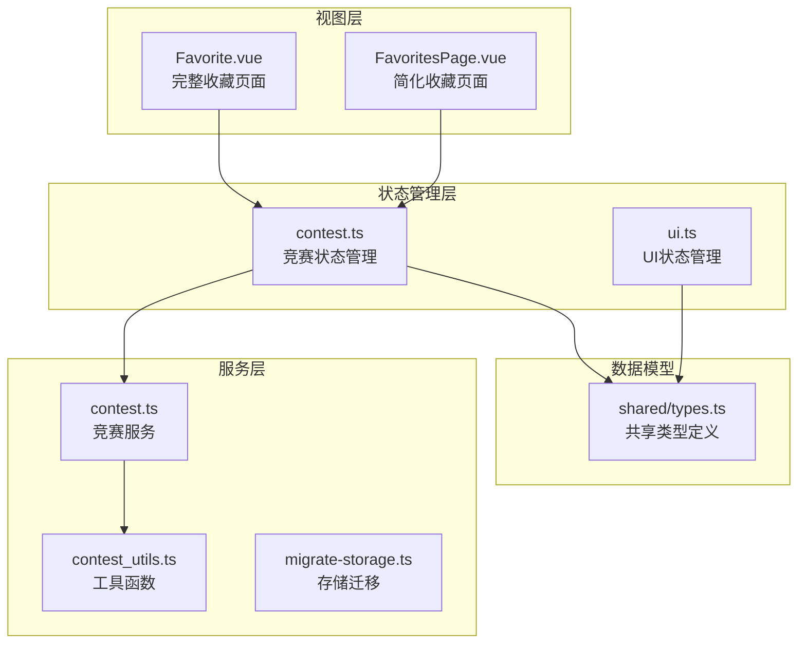
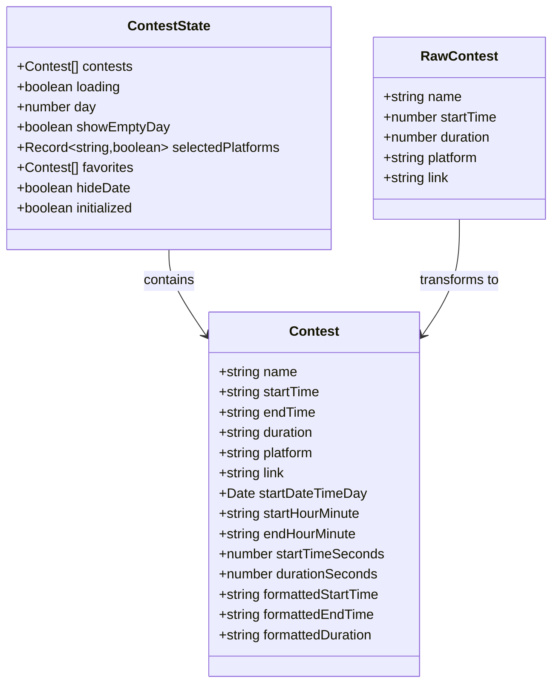
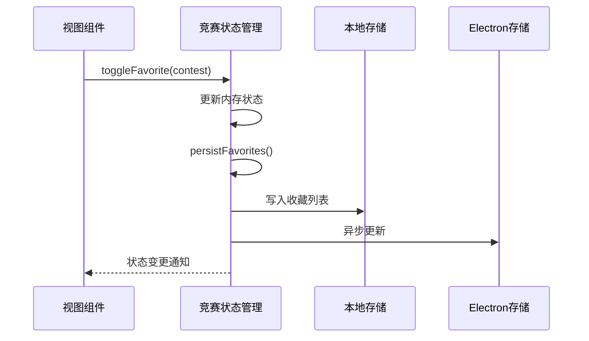
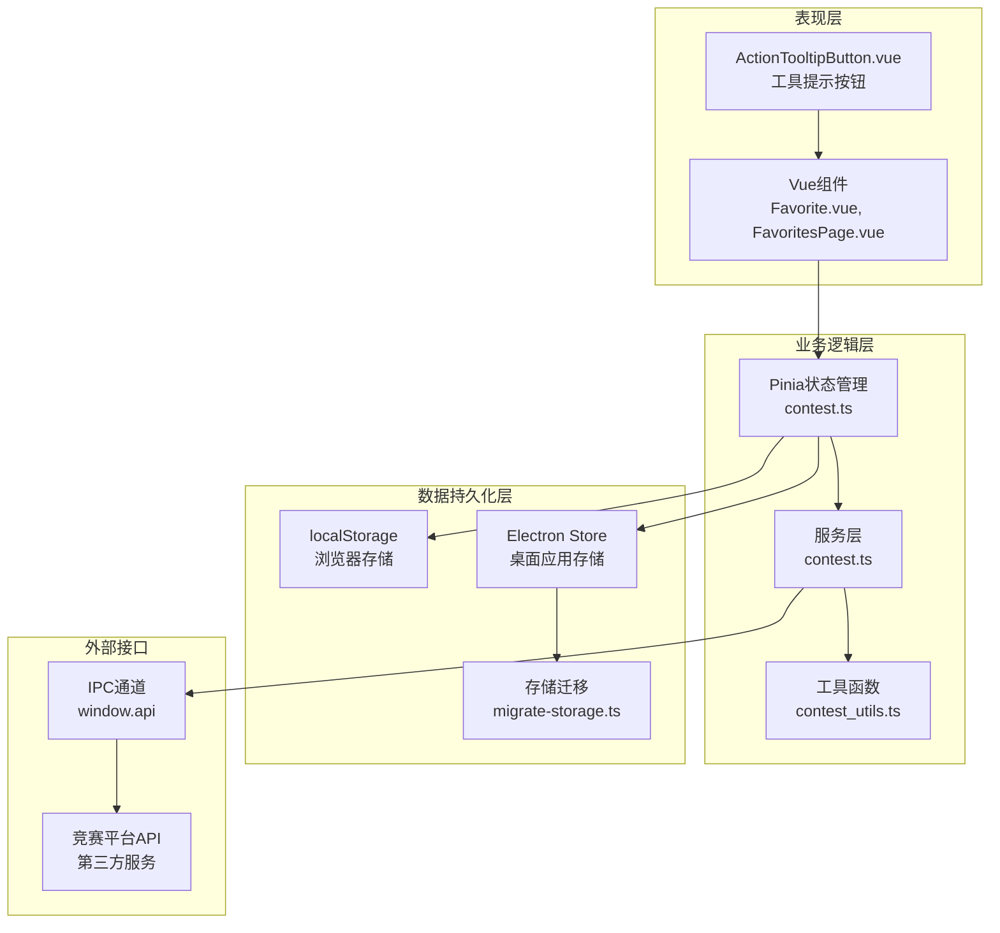
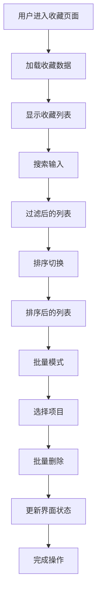
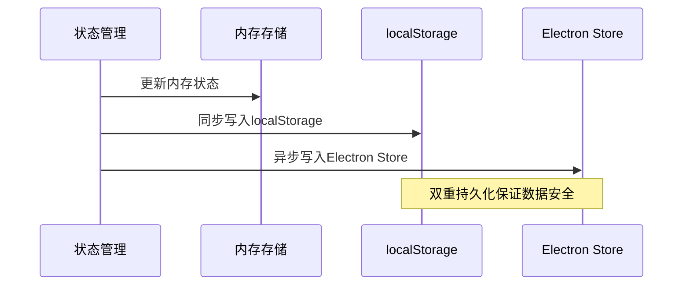
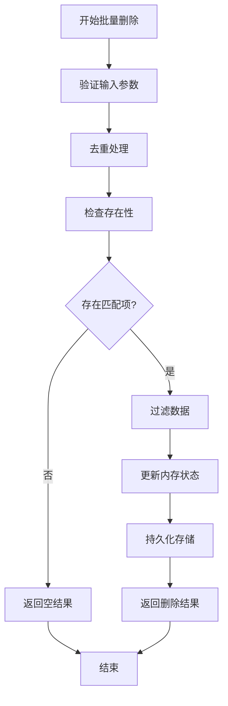
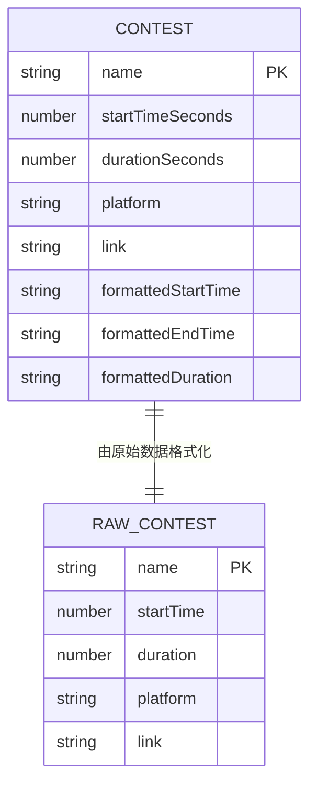
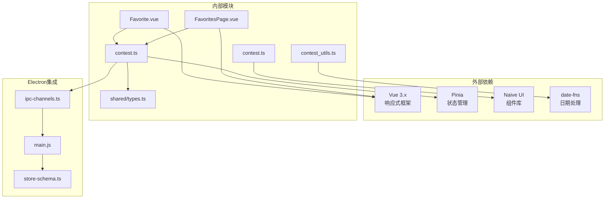
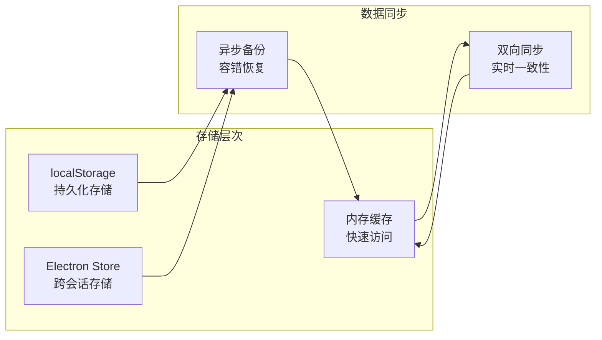

# 收藏管理功能

<cite>
**本文档引用的文件**
- [Favorite.vue](file://src/views/Favorite.vue)
- [FavoritesPage.vue](file://src/views/FavoritesPage.vue)
- [contest.ts](file://src/stores/contest.ts)
- [types.ts](file://shared/types.ts)
- [contest_utils.ts](file://src/utils/contest_utils.ts)
- [contest.ts](file://src/services/contest.ts)
- [migrate-storage.ts](file://src/utils/migrate-storage.ts)
- [favorites_batch_delete.test.ts](file://tests/unit/favorites_batch_delete.test.ts)
- [app.spec.ts](file://tests/e2e/app.spec.ts)
- [ActionTooltipButton.vue](file://src/components/ActionTooltipButton.vue)
</cite>

## 目录
1. [简介](#简介)
2. [项目结构](#项目结构)
3. [核心组件](#核心组件)
4. [架构概览](#架构概览)
5. [详细组件分析](#详细组件分析)
6. [依赖关系分析](#依赖关系分析)
7. [性能考虑](#性能考虑)
8. [故障排除指南](#故障排除指南)
9. [结论](#结论)
10. [附录](#附录)

## 简介

收藏管理功能是 OJFlow 应用程序的核心特性之一，为用户提供竞赛收藏、管理和组织能力。该功能实现了完整的收藏生命周期管理，包括收藏数据的添加、删除、排序和批量操作功能。

本功能采用现代化的前端架构，结合 Pinia 状态管理、Vue 组合式 API 和 Electron 主进程通信，提供了高性能、可扩展的收藏管理解决方案。系统支持本地存储和 Electron Store 的双重持久化策略，确保数据的安全性和可靠性。

## 项目结构

收藏管理功能在项目中的组织结构如下：

**图表来源**
- [Favorite.vue:1-689](file://src/views/Favorite.vue#L1-L689)
- [FavoritesPage.vue:1-184](file://src/views/FavoritesPage.vue#L1-L184)
- [contest.ts:1-307](file://src/stores/contest.ts#L1-L307)

**章节来源**
- [Favorite.vue:1-689](file://src/views/Favorite.vue#L1-L689)
- [FavoritesPage.vue:1-184](file://src/views/FavoritesPage.vue#L1-L184)
- [contest.ts:1-307](file://src/stores/contest.ts#L1-L307)

## 核心组件

### 数据模型设计

收藏功能基于统一的数据模型设计，所有竞赛信息通过标准化的数据结构进行管理：

**图表来源**
- [types.ts:1-67](file://shared/types.ts#L1-L67)
- [contest.ts:6-15](file://src/stores/contest.ts#L6-L15)

### 状态管理架构

收藏功能采用 Pinia 状态管理，实现了响应式的数据绑定和持久化存储：

**图表来源**
- [contest.ts:247-261](file://src/stores/contest.ts#L247-L261)
- [contest.ts:141-157](file://src/stores/contest.ts#L141-L157)

**章节来源**
- [types.ts:1-67](file://shared/types.ts#L1-L67)
- [contest.ts:1-307](file://src/stores/contest.ts#L1-L307)

## 架构概览

收藏管理功能的整体架构采用分层设计，确保了功能的模块化和可维护性：

**图表来源**
- [Favorite.vue:147-353](file://src/views/Favorite.vue#L147-L353)
- [contest.ts:63-307](file://src/stores/contest.ts#L63-L307)
- [contest.ts:1-35](file://src/services/contest.ts#L1-L35)

## 详细组件分析

### 收藏视图组件

收藏视图组件提供了丰富的用户交互功能，包括搜索、排序、分页和批量操作：

#### 主要功能特性

| 功能 | 实现方式 | 用户体验 |
|------|----------|----------|
| 收藏列表展示 | Vue组合式API + 计算属性 | 响应式数据绑定，自动更新 |
| 搜索过滤 | 本地搜索算法 | 实时搜索，支持模糊匹配 |
| 排序控制 | 时间戳排序 + 切换标志 | 升序/降序切换 |
| 分页导航 | 数组切片 + 分页组件 | 大数据集分页加载 |
| 批量操作 | 复选框状态管理 + 键盘快捷键 | Ctrl+A全选，Delete批量删除 |

#### 用户界面设计

**图表来源**
- [Favorite.vue:182-257](file://src/views/Favorite.vue#L182-L257)
- [Favorite.vue:271-310](file://src/views/Favorite.vue#L271-L310)

**章节来源**
- [Favorite.vue:1-689](file://src/views/Favorite.vue#L1-L689)

### 状态管理实现

收藏状态管理采用 Pinia 进行集中式状态控制，实现了完整的 CRUD 操作：

#### 核心状态属性

| 属性名 | 类型 | 描述 | 默认值 |
|--------|------|------|--------|
| favorites | Contest[] | 收藏的竞赛列表 | [] |
| loading | boolean | 加载状态标志 | false |
| day | number | 爬取天数范围 | 7 |
| selectedPlatforms | Record<string,boolean> | 平台筛选状态 | 全部启用 |
| hideDate | boolean | 是否隐藏日期显示 | false |
| initialized | boolean | 初始化完成标志 | false |

#### 数据持久化策略

**图表来源**
- [contest.ts:141-157](file://src/stores/contest.ts#L141-L157)
- [migrate-storage.ts:1-38](file://src/utils/migrate-storage.ts#L1-L38)

**章节来源**
- [contest.ts:1-307](file://src/stores/contest.ts#L1-L307)

### 批量操作功能

批量操作功能提供了高效的收藏管理能力，支持大规模数据的快速处理：

#### 批量删除算法

**图表来源**
- [contest.ts:265-301](file://src/stores/contest.ts#L265-L301)

#### 性能优化措施

批量删除操作针对大数据集进行了专门优化：

| 优化点 | 实现方式 | 性能提升 |
|--------|----------|----------|
| 去重处理 | Set数据结构 | O(n)时间复杂度 |
| 存在性检查 | Set查找 | O(1)平均查找时间 |
| 过滤操作 | 单次遍历 | 线性时间复杂度 |
| 内存管理 | 原地修改 | 减少内存分配 |

**章节来源**
- [contest.ts:265-301](file://src/stores/contest.ts#L265-L301)
- [favorites_batch_delete.test.ts:105-127](file://tests/unit/favorites_batch_delete.test.ts#L105-L127)

### 数据模型与类型定义

收藏功能使用统一的数据模型确保类型安全和代码可维护性：

#### 竞赛数据模型

**图表来源**
- [types.ts:1-67](file://shared/types.ts#L1-L67)

#### 平台枚举类型

系统支持多个竞赛平台，通过类型安全的方式管理平台标识：

| 平台名称 | 类型标识 | 中文显示 |
|----------|----------|----------|
| Codeforces | 'Codeforces' | Codeforces |
| AtCoder | 'AtCoder' | AtCoder |
| 洛谷 | '洛谷' | 洛谷 |
| 蓝桥云课 | '蓝桥云课' | 蓝桥云课 |
| 力扣 | '力扣' | 力扣 |
| 牛客 | '牛客' | 牛客 |

**章节来源**
- [types.ts:42-48](file://shared/types.ts#L42-L48)

## 依赖关系分析

收藏管理功能的依赖关系体现了清晰的分层架构：

**图表来源**
- [Favorite.vue:152-154](file://src/views/Favorite.vue#L152-L154)
- [contest.ts:1-307](file://src/stores/contest.ts#L1-L307)

**章节来源**
- [ActionTooltipButton.vue:1-135](file://src/components/ActionTooltipButton.vue#L1-L135)

## 性能考虑

收藏管理功能在设计时充分考虑了性能优化，特别是在处理大量数据时的表现：

### 时间复杂度分析

| 操作类型 | 算法复杂度 | 优化策略 |
|----------|------------|----------|
| 添加收藏 | O(1) | 直接数组追加 |
| 删除收藏 | O(n) | 线性查找 + 数组过滤 |
| 搜索过滤 | O(n*m) | n为列表长度，m为搜索字符串长度 |
| 排序操作 | O(n log n) | 基于时间戳的快速排序 |
| 批量删除 | O(n + m) | Set去重 + 单次遍历过滤 |

### 内存优化策略

1. **懒加载机制**：收藏列表按需渲染，避免一次性加载所有数据
2. **虚拟滚动**：对于大量数据采用虚拟滚动技术
3. **状态压缩**：只存储必要的字段，避免冗余数据
4. **缓存策略**：对计算结果进行缓存，避免重复计算

### 存储优化

## 故障排除指南

### 常见问题及解决方案

#### 收藏数据丢失

**问题描述**：用户发现收藏数据在重启后消失

**可能原因**：
1. 浏览器存储空间不足
2. 浏览器清理缓存
3. Electron Store初始化失败

**解决步骤**：
1. 检查浏览器存储配额限制
2. 验证localStorage可用性
3. 查看Electron Store同步状态
4. 执行存储迁移流程

#### 批量操作异常

**问题描述**：批量删除或添加收藏时出现错误

**诊断方法**：
1. 检查网络连接状态
2. 验证数据格式正确性
3. 查看控制台错误日志
4. 确认权限设置

**恢复措施**：
1. 回滚到上一个稳定版本
2. 清理损坏的存储数据
3. 重新初始化状态管理
4. 重新登录认证

#### 性能问题

**问题描述**：收藏列表加载缓慢或操作卡顿

**优化建议**：
1. 减少同时渲染的项目数量
2. 实施数据分页加载
3. 优化CSS动画效果
4. 启用浏览器缓存

**章节来源**
- [favorites_batch_delete.test.ts:83-103](file://tests/unit/favorites_batch_delete.test.ts#L83-L103)

## 结论

收藏管理功能通过精心设计的架构和实现，为用户提供了高效、可靠的竞赛收藏体验。系统具备以下核心优势：

### 技术优势

1. **模块化设计**：清晰的分层架构便于维护和扩展
2. **类型安全**：完整的 TypeScript 类型定义确保代码质量
3. **性能优化**：针对大数据集的专门优化措施
4. **可靠性保障**：双重持久化策略确保数据安全

### 用户体验

1. **直观界面**：简洁明了的操作界面
2. **响应式交互**：流畅的用户交互体验
3. **批量操作**：高效的批量管理能力
4. **实时同步**：多设备间的数据同步

### 扩展性设计

系统为未来的功能扩展预留了充足的空间，包括自定义分组、高级搜索、导入导出等功能的实现都具备良好的基础。

## 附录

### 开发最佳实践

1. **状态管理**：遵循单一数据源原则
2. **错误处理**：实现完善的异常捕获机制
3. **性能监控**：定期进行性能基准测试
4. **用户体验**：持续优化交互细节

### 未来发展方向

1. **自定义分组**：实现收藏分组管理功能
2. **智能推荐**：基于用户行为的竞赛推荐
3. **云端同步**：实现跨设备数据同步
4. **高级搜索**：支持复杂的筛选条件