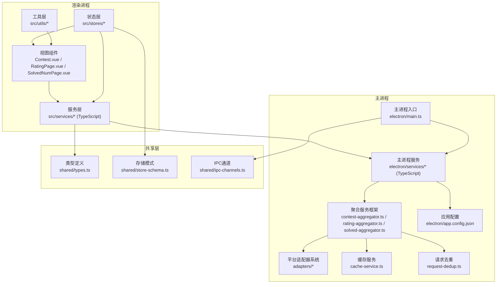
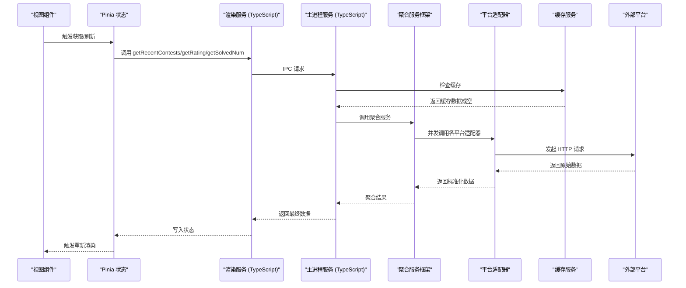
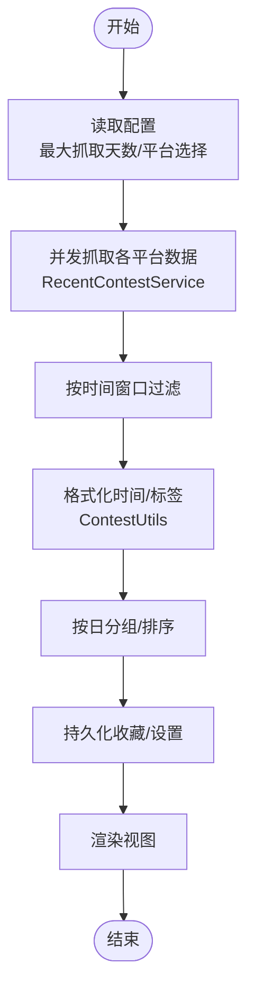
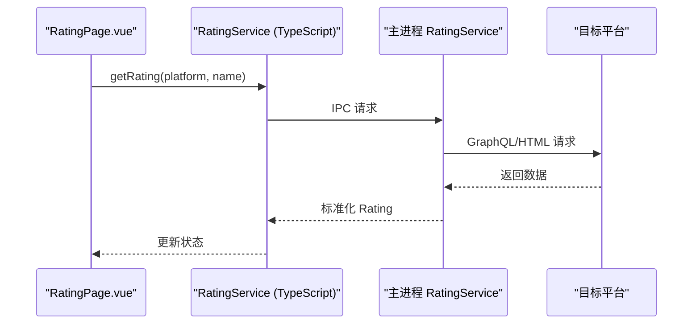
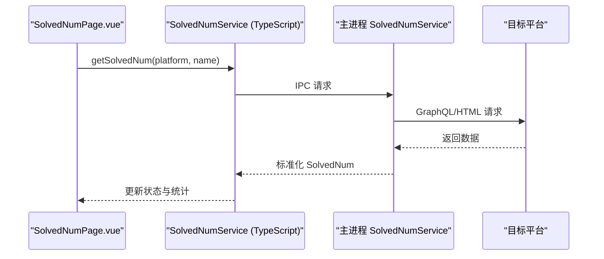
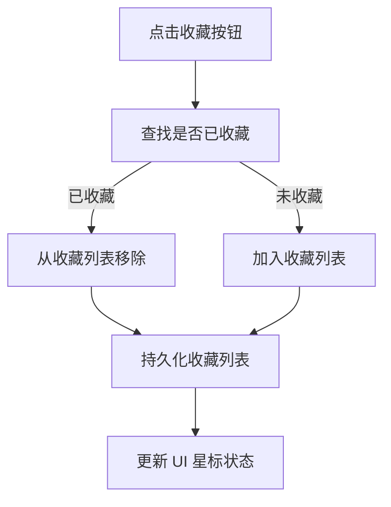
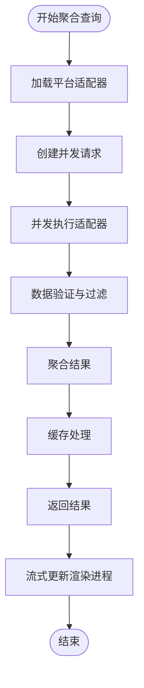
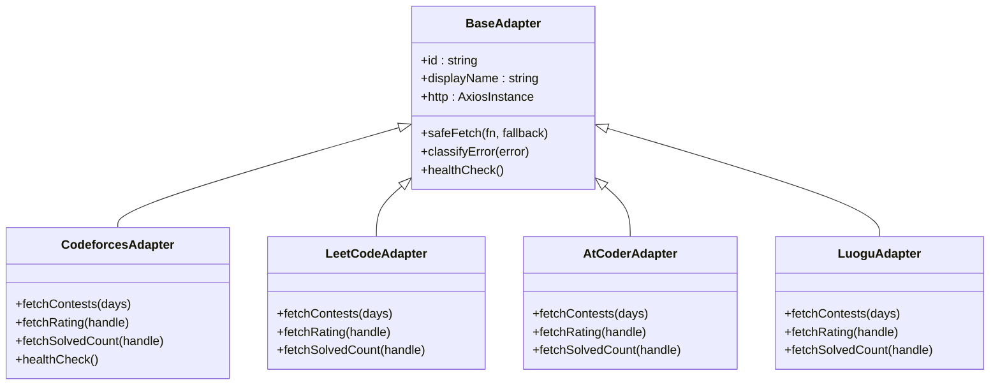
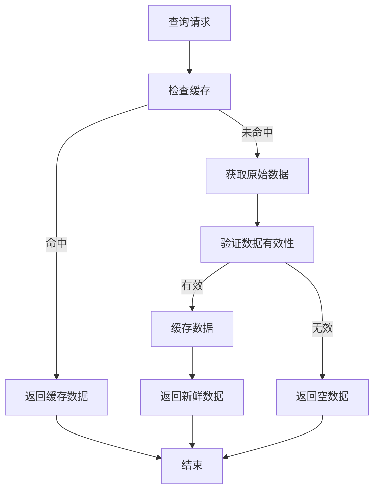
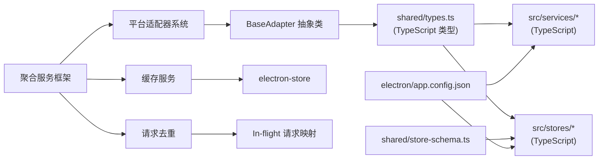

# 核心功能模块

<cite>
**本文引用的文件**
- [README.md](file://README.md)
- [app.config.json](file://electron/app.config.json)
- [types.ts](file://shared/types.ts)
- [store-schema.ts](file://shared/store-schema.ts)
- [contest.ts](file://src/services/contest.ts)
- [rating.ts](file://src/services/rating.ts)
- [solved.ts](file://src/services/solved.ts)
- [contest.ts](file://electron/services/contest.ts)
- [rating.ts](file://electron/services/rating.ts)
- [solvedNum.ts](file://electron/services/solvedNum.ts)
- [contest_aggregator.ts](file://electron/services/contest-aggregator.ts)
- [rating_aggregator.ts](file://electron/services/rating-aggregator.ts)
- [solved_aggregator.ts](file://electron/services/solved-aggregator.ts)
- [cache_service.ts](file://electron/services/cache-service.ts)
- [request_dedup.ts](file://electron/services/request-dedup.ts)
- [base_adapter.ts](file://electron/services/adapters/base-adapter.ts)
- [adapters_index.ts](file://electron/services/adapters/index.ts)
- [adapter_types.ts](file://electron/services/adapters/types.ts)
- [codeforces_adapter.ts](file://electron/services/adapters/codeforces.adapter.ts)
- [leetcode_adapter.ts](file://electron/services/adapters/leetcode.adapter.ts)
- [luogu_adapter.ts](file://electron/services/adapters/luogu.adapter.ts)
- [atcoder_adapter.ts](file://electron/services/adapters/atcoder.adapter.ts)
- [contest_utils.ts](file://src/utils/contest_utils.ts)
- [contest.ts](file://src/stores/contest.ts)
- [ui.ts](file://src/stores/ui.ts)
- [Contest.vue](file://src/views/Contest.vue)
- [RatingPage.vue](file://src/views/RatingPage.vue)
- [SolvedNumPage.vue](file://src/views/SolvedNumPage.vue)
- [main.ts](file://electron/main.ts)
</cite>

## 更新摘要
**所做更改**
- 新增竞赛聚合服务框架，包括缓存服务、请求去重和平台适配器系统
- 更新服务层架构描述，反映主进程服务已完全迁移到 TypeScript
- 新增平台适配器系统，支持统一的平台抽象和错误处理
- 增强缓存机制，提供多维度数据缓存和TTL管理
- 新增请求去重功能，避免重复并发请求
- 更新架构图和数据流图以反映新的聚合服务框架

## 目录
1. [引言](#引言)
2. [项目结构](#项目结构)
3. [核心组件](#核心组件)
4. [架构总览](#架构总览)
5. [详细组件分析](#详细组件分析)
6. [依赖分析](#依赖分析)
7. [性能考虑](#性能考虑)
8. [故障排查指南](#故障排查指南)
9. [结论](#结论)
10. [附录](#附录)

## 引言
本文件面向开发者与高级用户，系统性梳理 OJFlow 的四大核心功能：竞赛日历管理、Rating 追踪、解题统计与收藏管理。文档从架构、数据流、用户交互到配置与扩展进行全面解读，并提供最佳实践与故障排查建议。

**更新** 新增竞赛聚合服务框架，包括缓存服务、请求去重和平台适配器系统，提供更强大的数据获取能力和更好的性能表现。

## 项目结构
OJFlow 采用 Electron + Vue 3 + TypeScript 的现代桌面应用架构。前端通过 Pinia 管理状态，通过服务层调用 Electron 主进程提供的 IPC 接口；主进程使用 TypeScript 编写的专用服务类处理网络抓取与数据处理，渲染进程负责 UI 展示与用户交互。新增的竞赛聚合服务框架提供统一的平台适配器系统和缓存机制。

**图表来源**
- [main.ts:19-26](file://electron/main.ts#L19-L26)
- [contest.ts:1-35](file://src/services/contest.ts#L1-L35)
- [rating.ts:1-8](file://src/services/rating.ts#L1-L8)
- [solved.ts:1-8](file://src/services/solved.ts#L1-L8)
- [contest_aggregator.ts:1-144](file://electron/services/contest-aggregator.ts#L1-L144)
- [rating_aggregator.ts:1-61](file://electron/services/rating-aggregator.ts#L1-L61)
- [solved_aggregator.ts:1-67](file://electron/services/solved-aggregator.ts#L1-L67)
- [cache_service.ts:1-140](file://electron/services/cache-service.ts#L1-L140)
- [request_dedup.ts:1-33](file://electron/services/request-dedup.ts#L1-L33)
- [adapters_index.ts:1-71](file://electron/services/adapters/index.ts#L1-L71)
- [types.ts:1-67](file://shared/types.ts#L1-L67)
- [store-schema.ts:1-55](file://shared/store-schema.ts#L1-L55)

**章节来源**
- [README.md:1-162](file://README.md#L1-L162)
- [app.config.json:1-62](file://electron/app.config.json#L1-L62)
- [types.ts:1-67](file://shared/types.ts#L1-L67)
- [store-schema.ts:1-55](file://shared/store-schema.ts#L1-L55)

## 核心组件
- **竞赛日历管理**：使用 RecentContestService 类封装，负责拉取、格式化、分组与展示近期比赛，支持收藏、筛选与刷新。
- **Rating 追踪**：使用 RatingService 类封装，按平台查询用户当前与最高 Rating，提供批量刷新与输入校验。
- **解题统计**：使用 SolvedNumService 类封装，按平台统计累计 AC 数量，支持响应式面板与统计展示。
- **收藏管理**：在竞赛日历中收藏/移除比赛，持久化至本地存储与主进程存储。
- **竞赛聚合服务**：全新的聚合框架，提供统一的平台适配器系统、缓存管理和请求去重功能。
- **平台适配器系统**：基于 BaseAdapter 抽象类，支持多种在线判题平台的统一接口。
- **缓存服务**：提供多维度数据缓存，支持竞赛、Rating 和解题统计的缓存管理。
- **请求去重**：防止重复并发请求，提高系统性能和资源利用率。

**更新** 新增竞赛聚合服务框架，提供更强大的数据获取能力和更好的性能表现。

**章节来源**
- [Contest.vue:1-800](file://src/views/Contest.vue#L1-L800)
- [RatingPage.vue:1-226](file://src/views/RatingPage.vue#L1-L226)
- [SolvedNumPage.vue:1-345](file://src/views/SolvedNumPage.vue#L1-L345)
- [contest.ts:1-298](file://src/stores/contest.ts#L1-L298)
- [contest_aggregator.ts:1-144](file://electron/services/contest-aggregator.ts#L1-L144)
- [cache_service.ts:1-140](file://electron/services/cache-service.ts#L1-L140)
- [request_dedup.ts:1-33](file://electron/services/request-dedup.ts#L1-L33)
- [base_adapter.ts:1-91](file://electron/services/adapters/base-adapter.ts#L1-L91)

## 架构总览
渲染进程通过 TypeScript 服务层调用主进程 IPC 接口，主进程使用 TypeScript 编写的专用服务类，使用 axios + cheerio 抓取各平台数据，返回统一格式供前端展示。新增的竞赛聚合服务框架提供统一的平台适配器系统和缓存机制，支持并发抓取、请求去重和智能缓存。

**图表来源**
- [contest.ts:7-25](file://src/services/contest.ts#L7-L25)
- [rating.ts:3-6](file://src/services/rating.ts#L3-L6)
- [solved.ts:3-6](file://src/services/solved.ts#L3-L6)
- [contest_aggregator.ts:43-135](file://electron/services/contest-aggregator.ts#L43-L135)
- [rating_aggregator.ts:19-50](file://electron/services/rating-aggregator.ts#L19-L50)
- [solved_aggregator.ts:23-56](file://electron/services/solved-aggregator.ts#L23-L56)
- [cache_service.ts:25-47](file://electron/services/cache-service.ts#L25-L47)
- [base_adapter.ts:27-53](file://electron/services/adapters/base-adapter.ts#L27-L53)

## 详细组件分析

### 竞赛日历管理
- **业务逻辑**
  - 获取近期比赛：渲染服务调用主进程服务，主进程使用 RecentContestService 类并发抓取多个平台数据，按时间窗口过滤与去重。
  - 数据格式化：ContestUtils 工具类将 Unix 时间戳转换为可读字符串、计算持续时间与标签样式。
  - 分组与展示：按"今日/明日/本周/全部"分组，支持折叠展开与历史记录。
  - 收藏与筛选：支持平台筛选、空日显示开关、收藏增删与持久化。
- **数据流程**
  - 输入：最大抓取天数（localStorage/electron-store）、平台选择、收藏列表。
  - 处理：主进程按天数计算截止时间，过滤过期/超长赛事；工具类格式化时间与标签。
  - 输出：按天分组的竞赛列表，支持 UI 计算属性二次过滤。
- **用户交互**
  - 刷新按钮触发重新抓取；点击比赛项弹出确认对话框再打开链接；收藏按钮切换星标。
- **配置与个性化**
  - 最大抓取天数：默认 7 天，最小 1 天，最大 30 天，读取自主进程配置。
  - 隐藏日期：控制是否显示日期标题。
  - 平台筛选：默认全选，支持逐个关闭。
  - 收藏持久化：同时写入 localStorage 与主进程存储。
- **扩展点**
  - 新增平台：在 RecentContestService 类中新增抓取方法并在渲染服务中注册。
  - 自定义时间窗口：调整配置中的 min/max/default。
  - UI 增强：增加提醒、重复订阅、导出等功能。

**图表来源**
- [contest.ts:277-288](file://electron/services/contest.ts#L277-L288)
- [contest_utils.ts:4-43](file://src/utils/contest_utils.ts#L4-L43)
- [contest.ts:77-100](file://src/stores/contest.ts#L77-L100)
- [Contest.vue:398-550](file://src/views/Contest.vue#L398-L550)

**章节来源**
- [contest.ts:12-292](file://electron/services/contest.ts#L12-L292)
- [contest_utils.ts:1-68](file://src/utils/contest_utils.ts#L1-L68)
- [contest.ts:1-307](file://src/stores/contest.ts#L1-L307)
- [Contest.vue:1-800](file://src/views/Contest.vue#L1-L800)
- [app.config.json:2-6](file://electron/app.config.json#L2-L6)

### Rating 追踪
- **业务逻辑**
  - 按平台查询用户当前与最高 Rating，支持批量刷新。
  - 输入校验：区分用户名与用户 ID，提供占位提示与错误消息。
  - 错误处理：使用 TypeScript 类型和错误分类机制，提供详细的错误信息。
- **数据流程**
  - 输入：平台标识与用户名/ID。
  - 处理：主进程使用 RatingService 类根据平台路由到对应解析器，解析 HTML/GraphQL 结果。
  - 输出：标准化 Rating 对象（当前/最高）。
- **用户交互**
  - 单平台查询与全局刷新；查询中显示进度条；错误时高亮提示。
- **配置与个性化**
  - 用户名持久化：按平台保存到 localStorage。
  - 提示信息：针对不同平台给出字段说明与示例。
- **扩展点**
  - 新增平台：在 RatingService 类中实现解析器并在渲染服务中注册。
  - 缓存策略：结合共享缓存结构扩展离线回退。

**图表来源**
- [rating.ts:3-6](file://src/services/rating.ts#L3-L6)
- [rating.ts:162-177](file://electron/services/rating.ts#L162-L177)
- [RatingPage.vue:112-137](file://src/views/RatingPage.vue#L112-L137)

**章节来源**
- [rating.ts:1-8](file://src/services/rating.ts#L1-L8)
- [rating.ts:1-181](file://electron/services/rating.ts#L1-L181)
- [RatingPage.vue:1-226](file://src/views/RatingPage.vue#L1-L226)
- [store-schema.ts:31-50](file://shared/store-schema.ts#L31-L50)

### 解题统计
- **业务逻辑**
  - 按平台统计累计 AC 数量，支持批量刷新与统计面板。
  - 响应式布局：根据屏幕宽度动态列数。
  - 错误处理：使用 TypeScript 类型和错误分类机制，提供详细的错误信息。
- **数据流程**
  - 输入：平台标识与用户名/ID。
  - 处理：主进程使用 SolvedNumService 类解析 GraphQL/HTML，汇总统计结果。
  - 输出：标准化 SolvedNum 对象（累计数量）。
- **用户交互**
  - 单平台查询与全局刷新；查询中显示进度条；错误时清零并提示。
  - 统计面板：将非零平台数据转为统计图所需结构。
- **配置与个性化**
  - 用户名持久化：按平台保存到 localStorage。
  - 提示信息：针对不同平台给出字段说明与示例。
- **扩展点**
  - 新增平台：在 SolvedNumService 类中实现解析器并在渲染服务中注册。
  - 统计增强：扩展统计面板以支持雷达图/柱状图等。

**图表来源**
- [solved.ts:3-6](file://src/services/solved.ts#L3-L6)
- [solvedNum.ts:173-201](file://electron/services/solvedNum.ts#L173-L201)
- [SolvedNumPage.vue:192-219](file://src/views/SolvedNumPage.vue#L192-L219)

**章节来源**
- [solved.ts:1-8](file://src/services/solved.ts#L1-L8)
- [solvedNum.ts:1-205](file://electron/services/solvedNum.ts#L1-L205)
- [SolvedNumPage.vue:1-345](file://src/views/SolvedNumPage.vue#L1-L345)
- [store-schema.ts:31-50](file://shared/store-schema.ts#L31-L50)

### 收藏管理
- **业务逻辑**
  - 在竞赛日历中收藏/移除比赛，支持批量删除与存在性判断。
  - 持久化：同时写入 localStorage 与主进程存储，保证跨会话一致性。
  - 类型安全：使用 TypeScript 定义的 Contest 接口确保数据结构一致性。
- **数据流程**
  - 输入：竞赛对象（名称、平台、链接、时间等）。
  - 处理：Pinia 动作维护收藏数组，提供去重与唯一性保障。
  - 输出：更新后的收藏列表，驱动 UI 切换星标状态。
- **用户交互**
  - 点击收藏按钮切换星标颜色；支持批量删除与确认提示。
- **配置与个性化**
  - 收藏列表持久化键：favourite_contests_list。
  - 与 UI 主题解耦，独立于主题方案与颜色模式。
- **扩展点**
  - 导出/导入收藏；按平台/时间范围筛选收藏；收藏分组与标签。

**图表来源**
- [contest.ts:247-261](file://src/stores/contest.ts#L247-L261)
- [Contest.vue:154-161](file://src/views/Contest.vue#L154-L161)

**章节来源**
- [contest.ts:1-307](file://src/stores/contest.ts#L1-L307)
- [Contest.vue:1-800](file://src/views/Contest.vue#L1-L800)

### 竞赛聚合服务框架
- **业务逻辑**
  - 统一平台适配器接口：所有平台通过统一的 PlatformAdapter 接口实现，支持竞赛、Rating 和解题统计查询。
  - 并发抓取：使用 Promise.allSettled 并发调用多个平台适配器，显著提升数据获取效率。
  - 缓存管理：提供多维度缓存机制，支持竞赛、Rating 和解题统计的缓存管理。
  - 请求去重：防止重复并发请求，避免资源浪费和平台限流问题。
  - 错误处理：统一的错误分类和处理机制，提供详细的错误信息和恢复策略。
- **数据流程**
  - 输入：平台配置、查询参数、缓存状态。
  - 处理：适配器工厂创建适配器实例，执行并发抓取和数据验证。
  - 输出：标准化的竞赛列表、平台状态报告和性能指标。
- **用户交互**
  - 自动缓存：首次查询后自动缓存结果，后续查询直接返回缓存数据。
  - 流式更新：支持向渲染进程发送部分结果，实现实时进度显示。
  - 错误恢复：单个平台失败不影响整体查询结果。
- **配置与个性化**
  - 平台映射：支持平台显示名称与适配器 ID 的映射关系。
  - 超时控制：可配置的请求超时时间和重试机制。
  - 缓存策略：不同的数据类型有不同的缓存过期时间。
- **扩展点**
  - 新增平台：实现 PlatformAdapter 接口即可无缝集成。
  - 自定义适配器：继承 BaseAdapter 基类，复用统一的错误处理和健康检查功能。

**图表来源**
- [contest_aggregator.ts:43-135](file://electron/services/contest-aggregator.ts#L43-L135)
- [adapters_index.ts:13-25](file://electron/services/adapters/index.ts#L13-L25)
- [cache_service.ts:25-47](file://electron/services/cache-service.ts#L25-L47)
- [request_dedup.ts:12-22](file://electron/services/request-dedup.ts#L12-L22)

**章节来源**
- [contest_aggregator.ts:1-144](file://electron/services/contest-aggregator.ts#L1-L144)
- [rating_aggregator.ts:1-61](file://electron/services/rating-aggregator.ts#L1-L61)
- [solved_aggregator.ts:1-67](file://electron/services/solved-aggregator.ts#L1-L67)
- [cache_service.ts:1-140](file://electron/services/cache-service.ts#L1-L140)
- [request_dedup.ts:1-33](file://electron/services/request-dedup.ts#L1-L33)
- [base_adapter.ts:1-91](file://electron/services/adapters/base-adapter.ts#L1-L91)
- [adapters_index.ts:1-71](file://electron/services/adapters/index.ts#L1-L71)

### 平台适配器系统
- **业务逻辑**
  - 统一接口：所有平台适配器实现相同的 PlatformAdapter 接口，提供一致的编程体验。
  - 健康检查：内置健康检查机制，定期验证平台 API 可用性。
  - 错误分类：统一的错误分类和处理机制，支持超时、网络、解析和 API 错误。
  - 超时控制：可配置的请求超时时间，避免长时间阻塞。
- **数据流程**
  - 输入：平台配置、查询参数。
  - 处理：适配器内部实现具体的抓取逻辑，使用 cheerio 解析 HTML。
  - 输出：标准化的数据结构，包含成功标志、耗时和错误信息。
- **用户交互**
  - 自动重试：支持可配置的重试机制，提高成功率。
  - 进度反馈：提供详细的执行时间和错误信息。
  - 兼容性：支持多种数据源格式，包括 JSON 和嵌入式 JSON。
- **配置与个性化**
  - 超时配置：不同平台可设置不同的超时时间。
  - 选择器配置：针对不同平台的 HTML 结构定制解析规则。
  - 缓存策略：支持平台特定的缓存和验证逻辑。
- **扩展点**
  - 新增平台：实现 PlatformAdapter 接口，注册到适配器工厂。
  - 自定义解析：继承 BaseAdapter，复用统一的工具函数和错误处理。

**图表来源**
- [base_adapter.ts:6-90](file://electron/services/adapters/base-adapter.ts#L6-L90)
- [codeforces_adapter.ts:4-87](file://electron/services/adapters/codeforces.adapter.ts#L4-L87)
- [leetcode_adapter.ts:4-125](file://electron/services/adapters/leetcode.adapter.ts#L4-L125)
- [atcoder_adapter.ts:4-107](file://electron/services/adapters/atcoder.adapter.ts#L4-L107)
- [luogu_adapter.ts:4-146](file://electron/services/adapters/luogu.adapter.ts#L4-L146)

**章节来源**
- [base_adapter.ts:1-91](file://electron/services/adapters/base-adapter.ts#L1-L91)
- [adapters_index.ts:1-71](file://electron/services/adapters/index.ts#L1-L71)
- [adapter_types.ts:1-41](file://electron/services/adapters/types.ts#L1-L41)
- [codeforces_adapter.ts:1-87](file://electron/services/adapters/codeforces.adapter.ts#L1-L87)
- [leetcode_adapter.ts:1-125](file://electron/services/adapters/leetcode.adapter.ts#L1-L125)
- [atcoder_adapter.ts:1-107](file://electron/services/adapters/atcoder.adapter.ts#L1-L107)
- [luogu_adapter.ts:1-146](file://electron/services/adapters/luogu.adapter.ts#L1-L146)

### 缓存服务
- **业务逻辑**
  - 多维度缓存：分别缓存竞赛、Rating 和解题统计数据，支持不同的过期时间。
  - TTL 管理：竞赛缓存 2 小时，Rating 缓存 6 小时，解题统计缓存 12 小时。
  - 键空间管理：使用平台 ID 和用户名组合生成缓存键，避免冲突。
  - 缓存失效：提供手动清除缓存的功能，支持按类型和全量清除。
- **数据流程**
  - 输入：原始数据、平台标识、用户名。
  - 处理：序列化数据和时间戳，存储到 electron-store 中。
  - 输出：缓存命中时返回缓存数据，未命中时返回 null。
- **用户交互**
  - 自动缓存：查询成功后自动缓存结果。
  - 缓存优先：优先返回缓存数据，后台异步刷新。
  - 缓存状态：提供缓存状态指示，帮助用户了解数据新鲜度。
- **配置与个性化**
  - 过期时间：可配置的不同类型的缓存过期时间。
  - 存储位置：使用 electron-store 提供的持久化存储。
  - 清理策略：支持定时清理和手动清理两种方式。
- **扩展点**
  - 新增缓存类型：添加新的缓存键和过期时间配置。
  - 自定义序列化：支持复杂数据结构的自定义序列化。
  - 缓存监控：添加缓存命中率统计和性能监控。

**图表来源**
- [cache_service.ts:25-47](file://electron/services/cache-service.ts#L25-L47)
- [cache_service.ts:55-72](file://electron/services/cache-service.ts#L55-L72)
- [cache_service.ts:92-109](file://electron/services/cache-service.ts#L92-L109)

**章节来源**
- [cache_service.ts:1-140](file://electron/services/cache-service.ts#L1-L140)

### 请求去重
- **业务逻辑**
  - 去重机制：使用 Map 存储进行中的请求，相同键的请求共享同一个 Promise。
  - 键生成：使用平台 ID、用户名和操作类型生成唯一键。
  - 生命周期管理：请求完成后自动清理 Map 中的条目。
  - 状态查询：提供 in-flight 请求数量查询功能，用于调试和监控。
- **数据流程**
  - 输入：去重键、工厂函数。
  - 处理：检查是否存在相同的 in-flight 请求，返回现有 Promise 或创建新请求。
  - 输出：统一的 Promise，避免重复执行。
- **用户交互**
  - 透明去重：对调用方透明，无需关心去重逻辑。
  - 性能提升：显著减少重复请求，提高系统吞吐量。
  - 资源保护：避免对平台 API 的过度请求，减少被限流的风险。
- **配置与个性化**
  - 键空间：支持自定义键生成策略，适应不同的业务场景。
  - 超时处理：可配置的去重超时时间，避免内存泄漏。
  - 监控指标：提供去重命中率和 in-flight 请求统计。
- **扩展点**
  - 自定义去重策略：支持不同的去重算法和存储机制。
  - 条件去重：支持基于条件的去重，如只对特定参数去重。
  - 去重链：支持多级去重，形成去重链路。

**章节来源**
- [request_dedup.ts:1-33](file://electron/services/request-dedup.ts#L1-L33)

## 依赖分析
- **类型契约**
  - RawContest/Contest/Rating/SolvedNum 定义在共享类型文件，确保前后端一致的数据结构。
  - TypeScript 类型提供编译时类型检查，防止运行时类型错误。
- **状态与存储**
  - 共享存储模式定义了 UI 偏好、竞赛设置、收藏、用户名与缓存结构，便于迁移与扩展。
- **配置中心**
  - 主进程配置集中管理抓取天数范围、主题方案与国际化默认值，渲染进程读取并应用。
- **错误处理**
  - 主进程使用分类错误机制，提供详细的错误类型和消息。
  - TypeScript 类型系统帮助捕获潜在的运行时错误。
- **聚合服务依赖**
  - 平台适配器系统提供统一的平台抽象，支持扩展和维护。
  - 缓存服务提供多维度数据缓存，提升系统性能。
  - 请求去重避免重复并发请求，保护平台 API。

**图表来源**
- [types.ts:1-67](file://shared/types.ts#L1-L67)
- [store-schema.ts:1-55](file://shared/store-schema.ts#L1-L55)
- [app.config.json:1-62](file://electron/app.config.json#L1-L62)
- [adapters_index.ts:13-25](file://electron/services/adapters/index.ts#L13-L25)
- [cache_service.ts:1-140](file://electron/services/cache-service.ts#L1-L140)
- [request_dedup.ts:5](file://electron/services/request-dedup.ts#L5)

**章节来源**
- [types.ts:1-67](file://shared/types.ts#L1-L67)
- [store-schema.ts:1-55](file://shared/store-schema.ts#L1-L55)
- [app.config.json:1-62](file://electron/app.config.json#L1-L62)

## 性能考虑
- **并发抓取**：主进程服务对多个平台使用 Promise.all 并发请求，显著降低总等待时间。
- **本地缓存**：共享存储模式提供 cache 字段，可用于离线回退与减少重复请求。
- **UI 渲染优化**：视图组件使用计算属性与懒加载，避免不必要的重渲染。
- **网络限流**：平台接口可能有限流策略，建议合理控制查询频率与批量刷新时机。
- **类型优化**：TypeScript 编译时类型检查减少运行时错误，提高整体性能稳定性。
- **聚合服务优化**：新的聚合服务框架通过请求去重和缓存机制进一步提升性能。
- **平台适配器优化**：统一的适配器接口和错误处理机制，减少重复代码和提高维护效率。

**更新** 新增聚合服务框架带来的性能提升，包括并发抓取、缓存管理和请求去重等优化措施。

## 故障排查指南
- **网络异常**
  - 症状：查询失败、进度条卡住。
  - 排查：检查网络连通性、平台接口可用性；确认用户名/ID 是否正确。
- **平台接口变更**
  - 症状：解析失败、数据为空。
  - 排查：更新主进程服务中的解析逻辑（HTML 选择器/GraphQL 查询）。
- **存储异常**
  - 症状：收藏丢失、设置不生效。
  - 排查：检查 localStorage 与主进程存储权限；必要时清理无效数据。
- **性能问题**
  - 症状：页面卡顿、并发请求超时。
  - 排查：减少并发数量、启用缓存、限制最大抓取天数。
- **TypeScript 错误**
  - 症状：编译错误、类型不匹配。
  - 排查：检查类型定义、接口实现与参数类型。
- **聚合服务问题**
  - 症状：平台适配器失败、缓存异常、请求去重失效。
  - 排查：检查适配器实现、缓存配置和去重键生成逻辑。
- **平台适配器问题**
  - 症状：特定平台数据获取失败、解析错误。
  - 排查：检查适配器实现、HTML 结构变化和超时配置。

**更新** 新增聚合服务相关的故障排查指南，包括平台适配器、缓存服务和请求去重等问题的排查方法。

**章节来源**
- [rating.ts:24-28](file://electron/services/rating.ts#L24-L28)
- [solvedNum.ts:190-194](file://electron/services/solvedNum.ts#L190-L194)
- [contest.ts:255-266](file://electron/services/contest.ts#L255-L266)
- [contest_aggregator.ts:89-103](file://electron/services/contest-aggregator.ts#L89-L103)
- [base_adapter.ts:56-84](file://electron/services/adapters/base-adapter.ts#L56-L84)

## 结论
OJFlow 的四大核心功能围绕"数据获取—格式化—展示—持久化"的闭环构建，具备清晰的职责分离与可扩展性。通过统一的类型契约与配置中心，开发者可以稳定地扩展新平台与增强功能；通过 Pinia 与共享存储，实现跨会话的一致体验。

**更新** 新增的竞赛聚合服务框架进一步增强了系统的性能和可扩展性，提供统一的平台适配器系统、智能缓存机制和请求去重功能，为未来的功能扩展和技术演进奠定了坚实基础。

## 附录
- **配置项一览**
  - 抓取天数：defaultDays/minDays/maxDays（默认 7/1/30）
  - 主题方案：ocean/violet
  - 颜色模式：auto/light/dark
  - 国际化：zh-CN/en-US
  - 缓存过期时间：竞赛 2 小时、Rating 6 小时、解题统计 12 小时
- **最佳实践**
  - 新增平台时，先在主进程服务中实现抓取与解析，再在渲染服务中注册调用。
  - 对频繁查询的平台设置合理的刷新间隔，避免触发限流。
  - 使用共享缓存结构提升离线可用性与用户体验。
  - 利用 TypeScript 类型系统进行编译时错误检测。
  - 实现适当的错误处理和用户友好的错误提示。
  - 利用聚合服务框架的并发抓取和缓存机制提升性能。
  - 通过平台适配器系统实现统一的平台抽象和扩展机制。

**更新** 新增聚合服务框架相关的配置项和最佳实践指导。

**章节来源**
- [app.config.json:1-62](file://electron/app.config.json#L1-L62)
- [store-schema.ts:1-55](file://shared/store-schema.ts#L1-L55)
- [ui.ts:1-91](file://src/stores/ui.ts#L1-L91)
- [main.ts:115-167](file://electron/main.ts#L115-L167)
- [cache_service.ts:13-17](file://electron/services/cache-service.ts#L13-L17)