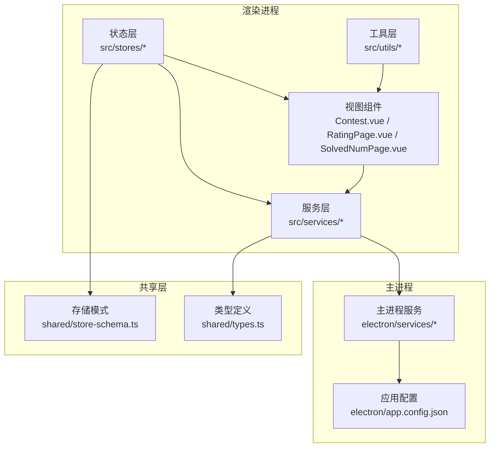
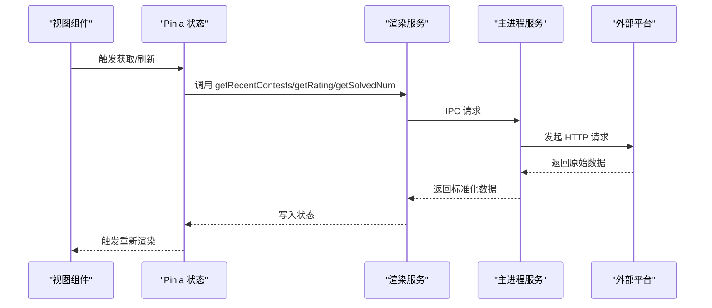
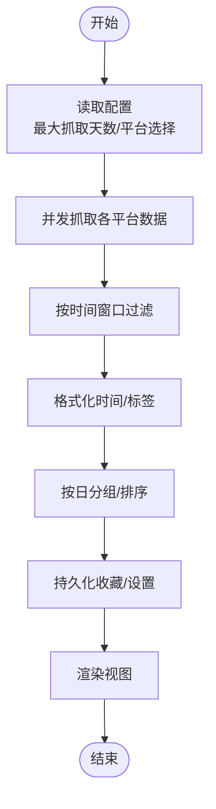
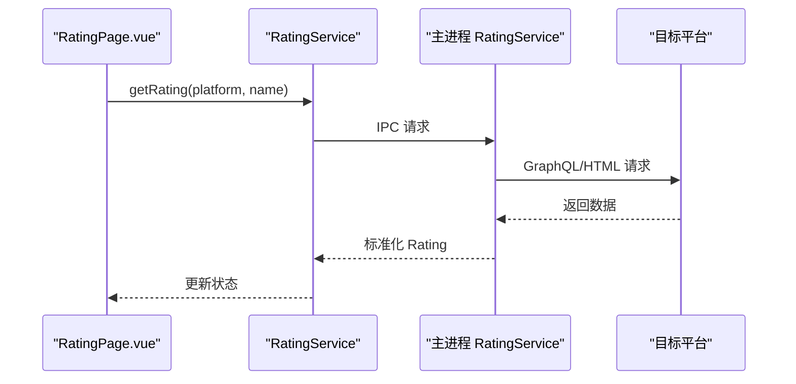
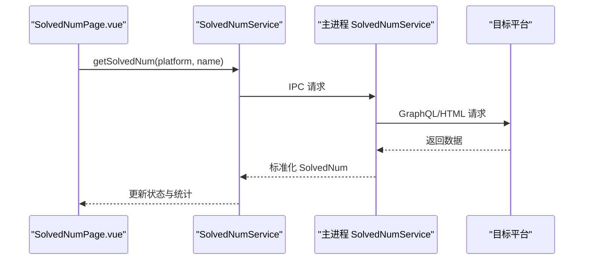
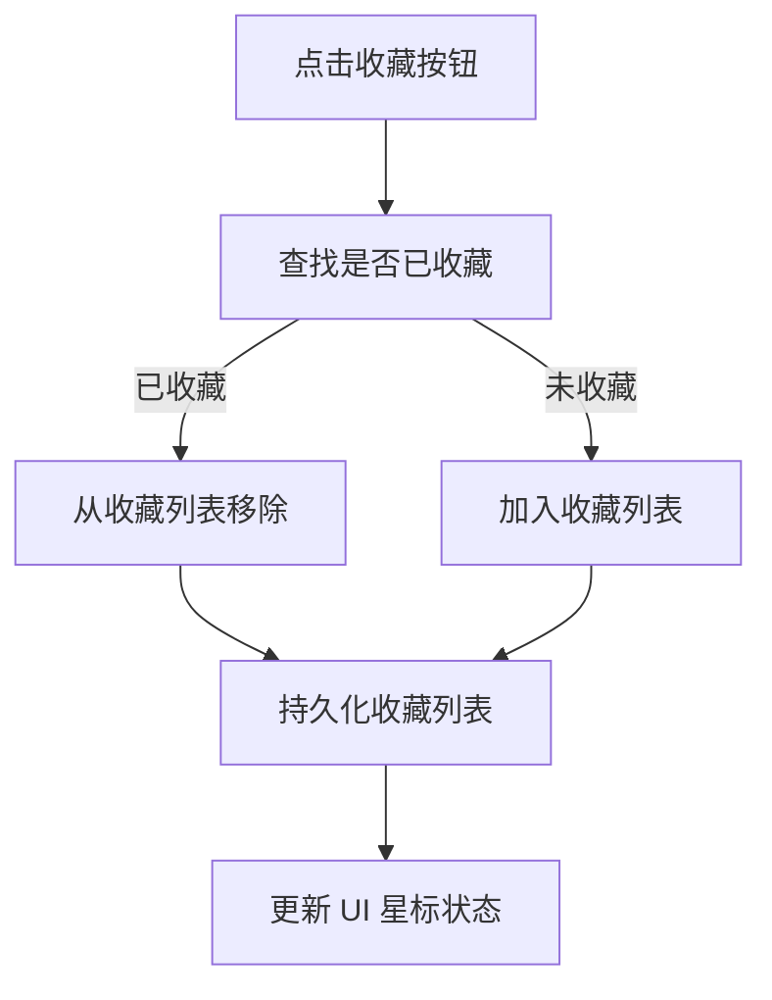
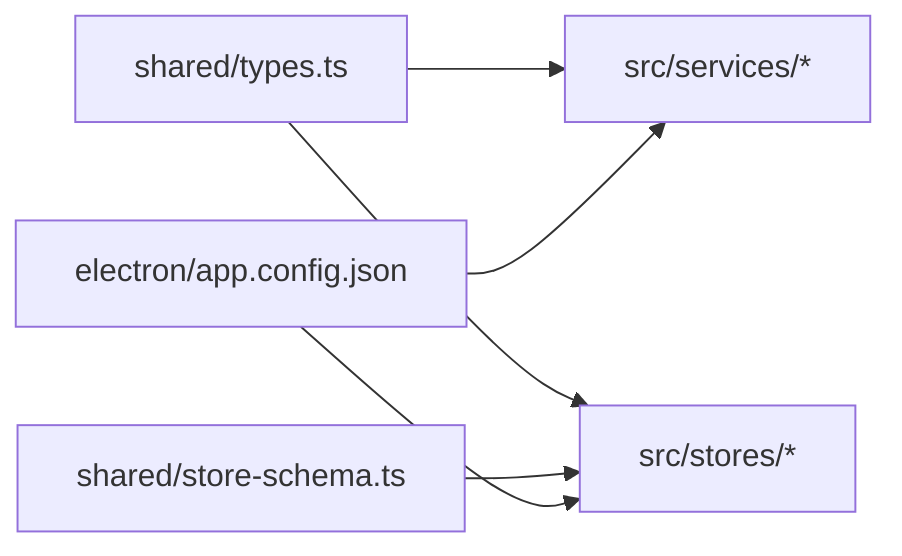

# 核心功能模块

<cite>
**本文引用的文件**
- [README.md](file://README.md)
- [app.config.json](file://electron/app.config.json)
- [types.ts](file://shared/types.ts)
- [store-schema.ts](file://shared/store-schema.ts)
- [contest.ts](file://src/services/contest.ts)
- [rating.ts](file://src/services/rating.ts)
- [solved.ts](file://src/services/solved.ts)
- [contest.ts](file://electron/services/contest.ts)
- [rating.ts](file://electron/services/rating.ts)
- [solvedNum.ts](file://electron/services/solvedNum.ts)
- [contest_utils.ts](file://src/utils/contest_utils.ts)
- [contest.ts](file://src/stores/contest.ts)
- [ui.ts](file://src/stores/ui.ts)
- [Contest.vue](file://src/views/Contest.vue)
- [RatingPage.vue](file://src/views/RatingPage.vue)
- [SolvedNumPage.vue](file://src/views/SolvedNumPage.vue)
</cite>

## 目录
1. [引言](#引言)
2. [项目结构](#项目结构)
3. [核心组件](#核心组件)
4. [架构总览](#架构总览)
5. [详细组件分析](#详细组件分析)
6. [依赖分析](#依赖分析)
7. [性能考虑](#性能考虑)
8. [故障排查指南](#故障排查指南)
9. [结论](#结论)
10. [附录](#附录)

## 引言
本文件面向开发者与高级用户，系统性梳理 OJFlow 的四大核心功能：竞赛日历管理、Rating 追踪、解题统计与收藏管理。文档从架构、数据流、用户交互到配置与扩展进行全面解读，并提供最佳实践与故障排查建议。

## 项目结构
OJFlow 采用 Electron + Vue 3 + TypeScript 的现代桌面应用架构。前端通过 Pinia 管理状态，通过服务层调用 Electron 主进程提供的 IPC 接口；主进程负责网络抓取与数据处理，渲染进程负责 UI 展示与用户交互。

图表来源
- [Contest.vue](file://src/views/Contest.vue)
- [RatingPage.vue](file://src/views/RatingPage.vue)
- [SolvedNumPage.vue](file://src/views/SolvedNumPage.vue)
- [contest.ts](file://src/services/contest.ts)
- [rating.ts](file://src/services/rating.ts)
- [solved.ts](file://src/services/solved.ts)
- [contest.ts](file://electron/services/contest.ts)
- [rating.ts](file://electron/services/rating.ts)
- [solvedNum.ts](file://electron/services/solvedNum.ts)
- [types.ts](file://shared/types.ts)
- [store-schema.ts](file://shared/store-schema.ts)
- [app.config.json](file://electron/app.config.json)

章节来源
- [README.md:1-162](file://README.md#L1-L162)
- [app.config.json:1-62](file://electron/app.config.json#L1-L62)
- [types.ts:1-67](file://shared/types.ts#L1-L67)
- [store-schema.ts:1-55](file://shared/store-schema.ts#L1-L55)

## 核心组件
- 竞赛日历管理：负责拉取、格式化、分组与展示近期比赛，支持收藏、筛选与刷新。
- Rating 追踪：按平台查询用户当前与最高 Rating，提供批量刷新与输入校验。
- 解题统计：按平台统计累计 AC 数量，支持响应式面板与统计展示。
- 收藏管理：在竞赛日历中收藏/移除比赛，持久化至本地存储与主进程存储。

章节来源
- [Contest.vue:1-800](file://src/views/Contest.vue#L1-L800)
- [RatingPage.vue:1-226](file://src/views/RatingPage.vue#L1-L226)
- [SolvedNumPage.vue:1-345](file://src/views/SolvedNumPage.vue#L1-L345)
- [contest.ts:1-298](file://src/stores/contest.ts#L1-L298)

## 架构总览
渲染进程通过服务层调用主进程 IPC 接口，主进程使用 axios + cheerio 抓取各平台数据，返回统一格式供前端展示。Pinia 状态层负责缓存与持久化，共享类型定义保证前后端契约一致。

图表来源
- [contest.ts:1-35](file://src/services/contest.ts#L1-L35)
- [rating.ts:1-8](file://src/services/rating.ts#L1-L8)
- [solved.ts:1-8](file://src/services/solved.ts#L1-L8)
- [contest.ts:1-270](file://electron/services/contest.ts#L1-L270)
- [rating.ts:1-175](file://electron/services/rating.ts#L1-L175)
- [solvedNum.ts:1-198](file://electron/services/solvedNum.ts#L1-L198)

## 详细组件分析

### 竞赛日历管理
- 业务逻辑
  - 获取近期比赛：渲染服务调用主进程服务，主进程并发抓取多个平台数据，按时间窗口过滤与去重。
  - 数据格式化：工具类将 Unix 时间戳转换为可读字符串、计算持续时间与标签样式。
  - 分组与展示：按“今日/明日/本周/全部”分组，支持折叠展开与历史记录。
  - 收藏与筛选：支持平台筛选、空日显示开关、收藏增删与持久化。
- 数据流程
  - 输入：最大抓取天数（localStorage/electron-store）、平台选择、收藏列表。
  - 处理：主进程按天数计算截止时间，过滤过期/超长赛事；工具类格式化时间与标签。
  - 输出：按天分组的竞赛列表，支持 UI 计算属性二次过滤。
- 用户交互
  - 刷新按钮触发重新抓取；点击比赛项弹出确认对话框再打开链接；收藏按钮切换星标。
- 配置与个性化
  - 最大抓取天数：默认 7 天，最小 1 天，最大 30 天，读取自主进程配置。
  - 隐藏日期：控制是否显示日期标题。
  - 平台筛选：默认全选，支持逐个关闭。
  - 收藏持久化：同时写入 localStorage 与主进程存储。
- 扩展点
  - 新增平台：在主进程服务中新增抓取方法并在渲染服务中注册。
  - 自定义时间窗口：调整配置中的 min/max/default。
  - UI 增强：增加提醒、重复订阅、导出等功能。

图表来源
- [contest.ts:255-266](file://electron/services/contest.ts#L255-L266)
- [contest_utils.ts:1-68](file://src/utils/contest_utils.ts#L1-L68)
- [contest.ts:97-298](file://src/stores/contest.ts#L97-L298)
- [Contest.vue:398-550](file://src/views/Contest.vue#L398-L550)

章节来源
- [contest.ts:1-270](file://electron/services/contest.ts#L1-L270)
- [contest_utils.ts:1-68](file://src/utils/contest_utils.ts#L1-L68)
- [contest.ts:1-298](file://src/stores/contest.ts#L1-L298)
- [Contest.vue:1-800](file://src/views/Contest.vue#L1-L800)
- [app.config.json:2-6](file://electron/app.config.json#L2-L6)

### Rating 追踪
- 业务逻辑
  - 按平台查询用户当前与最高 Rating，支持批量刷新。
  - 输入校验：区分用户名与用户 ID，提供占位提示与错误消息。
- 数据流程
  - 输入：平台标识与用户名/ID。
  - 处理：主进程根据平台路由到对应解析器，解析 HTML/GraphQL 结果。
  - 输出：标准化 Rating 对象（当前/最高）。
- 用户交互
  - 单平台查询与全局刷新；查询中显示进度条；错误时高亮提示。
- 配置与个性化
  - 用户名持久化：按平台保存到 localStorage。
  - 提示信息：针对不同平台给出字段说明与示例。
- 扩展点
  - 新增平台：在主进程服务中实现解析器并在渲染服务中注册。
  - 缓存策略：结合共享缓存结构扩展离线回退。

图表来源
- [rating.ts:1-8](file://src/services/rating.ts#L1-L8)
- [rating.ts:156-171](file://electron/services/rating.ts#L156-L171)
- [RatingPage.vue:112-137](file://src/views/RatingPage.vue#L112-L137)

章节来源
- [rating.ts:1-8](file://src/services/rating.ts#L1-L8)
- [rating.ts:1-175](file://electron/services/rating.ts#L1-L175)
- [RatingPage.vue:1-226](file://src/views/RatingPage.vue#L1-L226)
- [store-schema.ts:31-50](file://shared/store-schema.ts#L31-L50)

### 解题统计
- 业务逻辑
  - 按平台统计累计 AC 数量，支持批量刷新与统计面板。
  - 响应式布局：根据屏幕宽度动态列数。
- 数据流程
  - 输入：平台标识与用户名/ID。
  - 处理：主进程解析 GraphQL/HTML，汇总统计结果。
  - 输出：标准化 SolvedNum 对象（累计数量）。
- 用户交互
  - 单平台查询与全局刷新；查询中显示进度条；错误时清零并提示。
  - 统计面板：将非零平台数据转为统计图所需结构。
- 配置与个性化
  - 用户名持久化：按平台保存到 localStorage。
  - 提示信息：针对不同平台给出字段说明与示例。
- 扩展点
  - 新增平台：在主进程服务中实现解析器并在渲染服务中注册。
  - 统计增强：扩展统计面板以支持雷达图/柱状图等。

图表来源
- [solved.ts:1-8](file://src/services/solved.ts#L1-L8)
- [solvedNum.ts:166-194](file://electron/services/solvedNum.ts#L166-L194)
- [SolvedNumPage.vue:192-219](file://src/views/SolvedNumPage.vue#L192-L219)

章节来源
- [solved.ts:1-8](file://src/services/solved.ts#L1-L8)
- [solvedNum.ts:1-198](file://electron/services/solvedNum.ts#L1-L198)
- [SolvedNumPage.vue:1-345](file://src/views/SolvedNumPage.vue#L1-L345)
- [store-schema.ts:31-50](file://shared/store-schema.ts#L31-L50)

### 收藏管理
- 业务逻辑
  - 在竞赛日历中收藏/移除比赛，支持批量删除与存在性判断。
  - 持久化：同时写入 localStorage 与主进程存储，保证跨会话一致性。
- 数据流程
  - 输入：竞赛对象（名称、平台、链接、时间等）。
  - 处理：Pinia 动作维护收藏数组，提供去重与唯一性保障。
  - 输出：更新后的收藏列表，驱动 UI 切换星标状态。
- 用户交互
  - 点击收藏按钮切换星标颜色；支持批量删除与确认提示。
- 配置与个性化
  - 收藏列表持久化键：favourite_contests_list。
  - 与 UI 主题解耦，独立于主题方案与颜色模式。
- 扩展点
  - 导出/导入收藏；按平台/时间范围筛选收藏；收藏分组与标签。

图表来源
- [contest.ts:238-295](file://src/stores/contest.ts#L238-L295)
- [Contest.vue:154-161](file://src/views/Contest.vue#L154-L161)

章节来源
- [contest.ts:1-298](file://src/stores/contest.ts#L1-L298)
- [Contest.vue:1-800](file://src/views/Contest.vue#L1-L800)

## 依赖分析
- 类型契约
  - RawContest/Contest/Rating/SolvedNum 定义在共享类型文件，确保前后端一致的数据结构。
- 状态与存储
  - 共享存储模式定义了 UI 偏好、竞赛设置、收藏、用户名与缓存结构，便于迁移与扩展。
- 配置中心
  - 主进程配置集中管理抓取天数范围、主题方案与国际化默认值，渲染进程读取并应用。

图表来源
- [types.ts:1-67](file://shared/types.ts#L1-L67)
- [store-schema.ts:1-55](file://shared/store-schema.ts#L1-L55)
- [app.config.json:1-62](file://electron/app.config.json#L1-L62)

章节来源
- [types.ts:1-67](file://shared/types.ts#L1-L67)
- [store-schema.ts:1-55](file://shared/store-schema.ts#L1-L55)
- [app.config.json:1-62](file://electron/app.config.json#L1-L62)

## 性能考虑
- 并发抓取：主进程服务对多个平台使用 Promise.all 并发请求，显著降低总等待时间。
- 本地缓存：共享存储模式提供 cache 字段，可用于离线回退与减少重复请求。
- UI 渲染优化：视图组件使用计算属性与懒加载，避免不必要的重渲染。
- 网络限流：平台接口可能有限流策略，建议合理控制查询频率与批量刷新时机。

## 故障排查指南
- 网络异常
  - 症状：查询失败、进度条卡住。
  - 排查：检查网络连通性、平台接口可用性；确认用户名/ID 是否正确。
- 平台接口变更
  - 症状：解析失败、数据为空。
  - 排查：更新主进程服务中的解析逻辑（HTML 选择器/GraphQL 查询）。
- 存储异常
  - 症状：收藏丢失、设置不生效。
  - 排查：检查 localStorage 与主进程存储权限；必要时清理无效数据。
- 性能问题
  - 症状：页面卡顿、并发请求超时。
  - 排查：减少并发数量、启用缓存、限制最大抓取天数。

章节来源
- [rating.ts:24-28](file://electron/services/rating.ts#L24-L28)
- [solvedNum.ts:190-194](file://electron/services/solvedNum.ts#L190-L194)
- [contest.ts:255-266](file://electron/services/contest.ts#L255-L266)

## 结论
OJFlow 的四大核心功能围绕“数据获取—格式化—展示—持久化”的闭环构建，具备清晰的职责分离与可扩展性。通过统一的类型契约与配置中心，开发者可以稳定地扩展新平台与增强功能；通过 Pinia 与共享存储，实现跨会话的一致体验。

## 附录
- 配置项一览
  - 抓取天数：defaultDays/minDays/maxDays（默认 7/1/30）
  - 主题方案：ocean/violet
  - 颜色模式：auto/light/dark
  - 国际化：zh-CN/en-US
- 最佳实践
  - 新增平台时，先在主进程服务中实现抓取与解析，再在渲染服务中注册调用。
  - 对频繁查询的平台设置合理的刷新间隔，避免触发限流。
  - 使用共享缓存结构提升离线可用性与用户体验。

章节来源
- [app.config.json:1-62](file://electron/app.config.json#L1-L62)
- [store-schema.ts:1-55](file://shared/store-schema.ts#L1-L55)
- [ui.ts:1-91](file://src/stores/ui.ts#L1-L91)