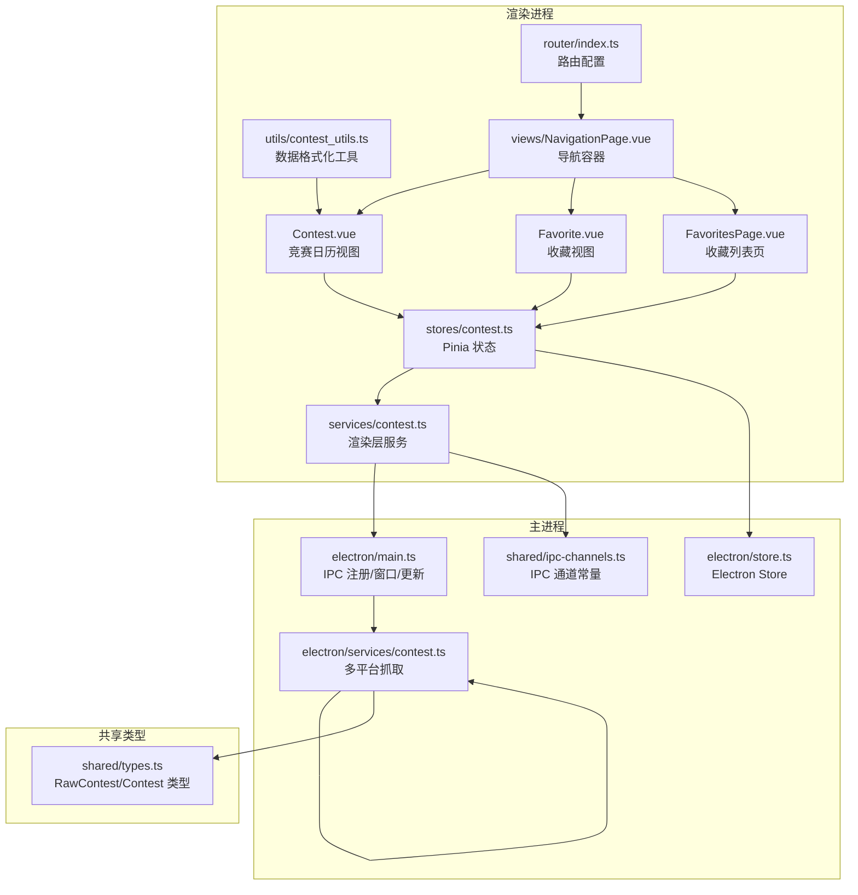
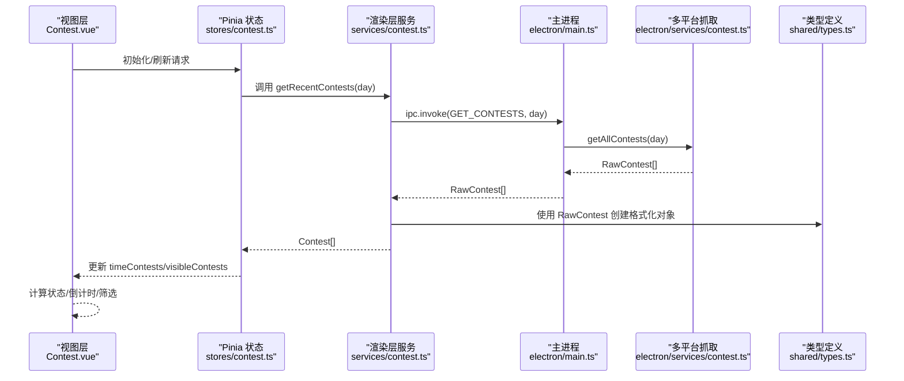
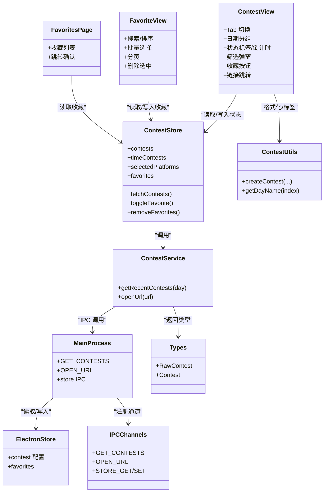

# 竞赛日历管理

<cite>
**本文引用的文件**
- [Contest.vue](file://src/views/Contest.vue)
- [contest.ts（视图）](file://src/views/Favorite.vue)
- [FavoritesPage.vue](file://src/views/FavoritesPage.vue)
- [contest.ts（存储）](file://src/stores/contest.ts)
- [contest.ts（服务）](file://src/services/contest.ts)
- [contest_utils.ts](file://src/utils/contest_utils.ts)
- [types.ts](file://shared/types.ts)
- [contest.ts（主进程服务）](file://electron/services/contest.ts)
- [main.ts（主进程）](file://electron/main.ts)
- [store.ts（Electron 存储）](file://electron/store.ts)
- [ipc-channels.ts](file://shared/ipc-channels.ts)
- [router/index.ts](file://src/router/index.ts)
- [NavigationPage.vue](file://src/views/NavigationPage.vue)
- [ActionTooltipButton.vue](file://src/components/ActionTooltipButton.vue)
</cite>

## 目录
1. [简介](#简介)
2. [项目结构](#项目结构)
3. [核心组件](#核心组件)
4. [架构总览](#架构总览)
5. [详细组件分析](#详细组件分析)
6. [依赖关系分析](#依赖关系分析)
7. [性能考量](#性能考量)
8. [故障排查指南](#故障排查指南)
9. [结论](#结论)
10. [附录](#附录)

## 简介
本文件面向“竞赛日历管理”功能，系统性梳理从数据采集、处理、状态判断、筛选与展示到用户交互的完整链路。重点涵盖：
- 多平台竞赛信息整合（Codeforces、AtCoder、洛谷、蓝桥云课、力扣、牛客）
- 实时数据刷新与定时更新机制
- 竞赛状态智能判断（即将开始/进行中/已结束）
- 筛选功能（按平台、时间范围、竞赛状态）
- 用户交互（详情查看、收藏管理、链接跳转）
- 数据模型与状态管理、UI 组件设计及性能优化策略

## 项目结构
该功能横跨渲染进程与主进程，采用“渲染层视图 + Pinia 状态 + 服务封装 + 主进程抓取 + IPC 通信”的分层架构。路由通过 Vue Router 管理页面导航，侧边栏/底部导航统一入口。

图表来源
- [Contest.vue:1-1328](file://src/views/Contest.vue#L1-L1328)
- [Favorite.vue:1-689](file://src/views/Favorite.vue#L1-L689)
- [FavoritesPage.vue:1-184](file://src/views/FavoritesPage.vue#L1-L184)
- [contest.ts（存储）:1-307](file://src/stores/contest.ts#L1-L307)
- [contest.ts（服务）:1-35](file://src/services/contest.ts#L1-L35)
- [contest_utils.ts:1-68](file://src/utils/contest_utils.ts#L1-L68)
- [router/index.ts:1-48](file://src/router/index.ts#L1-L48)
- [NavigationPage.vue:1-263](file://src/views/NavigationPage.vue#L1-L263)
- [main.ts（主进程）:396-486](file://electron/main.ts#L396-L486)
- [contest.ts（主进程服务）:1-270](file://electron/services/contest.ts#L1-L270)
- [store.ts（Electron 存储）:1-31](file://electron/store.ts#L1-L31)
- [ipc-channels.ts:1-53](file://shared/ipc-channels.ts#L1-L53)
- [types.ts:1-67](file://shared/types.ts#L1-L67)

章节来源
- [router/index.ts:16-40](file://src/router/index.ts#L16-L40)
- [NavigationPage.vue:1-138](file://src/views/NavigationPage.vue#L1-L138)

## 核心组件
- 视图层
  - 竞赛日历视图：负责 Tab 切换、日期分组、状态标签、倒计时、筛选弹窗、收藏按钮、链接跳转等。
  - 收藏视图：支持搜索、排序、批量选择、分页、删除选中等。
  - 收藏列表页：简洁展示收藏列表，支持点击跳转。
- 状态层（Pinia）
  - 管理竞赛列表、加载状态、时间分组、平台筛选、收藏、日期隐藏、爬取天数等。
- 服务层（渲染）
  - 渲染层服务封装 IPC 调用，统一返回格式化后的竞赛对象。
- 工具层
  - 数据格式化工具：将原始竞赛数据转换为 UI 友好的字段（含时间字符串、时长、起止小时分钟等）。
- 主进程服务
  - 多平台并发抓取，统一过滤策略（时间窗口、时长限制、是否已结束），输出原始竞赛数据。
- IPC 与存储
  - IPC 通道定义与注册；Electron Store 提供持久化配置与收藏。

章节来源
- [Contest.vue:344-653](file://src/views/Contest.vue#L344-L653)
- [Favorite.vue:147-353](file://src/views/Favorite.vue#L147-L353)
- [FavoritesPage.vue:1-184](file://src/views/FavoritesPage.vue#L1-L184)
- [contest.ts（存储）:63-307](file://src/stores/contest.ts#L63-L307)
- [contest.ts（服务）:7-35](file://src/services/contest.ts#L7-L35)
- [contest_utils.ts:4-68](file://src/utils/contest_utils.ts#L4-L68)
- [contest.ts（主进程服务）:12-270](file://electron/services/contest.ts#L12-L270)
- [ipc-channels.ts:3-14](file://shared/ipc-channels.ts#L3-L14)
- [store.ts（Electron 存储）:4-31](file://electron/store.ts#L4-L31)

## 架构总览
渲染层通过服务层调用主进程接口，主进程使用多平台服务抓取数据，最终以统一的数据模型返回给渲染层。Pinia 管理全局状态，包括时间分组、筛选条件、收藏等。

图表来源
- [contest.ts（服务）:8-25](file://src/services/contest.ts#L8-L25)
- [main.ts（主进程）:396-412](file://electron/main.ts#L396-L412)
- [contest.ts（主进程服务）:255-266](file://electron/services/contest.ts#L255-L266)
- [types.ts:1-26](file://shared/types.ts#L1-L26)

## 详细组件分析

### 数据模型与状态管理
- 数据模型
  - 原始竞赛：包含名称、开始时间（秒）、持续时间（秒）、平台、可选链接。
  - 格式化竞赛：在原始基础上增加格式化时间字符串、起止小时分钟、时长文本、时间戳等字段，便于 UI 展示。
- 状态管理
  - 竞赛列表、加载状态、时间分组（按天）、平台筛选开关、收藏列表、日期隐藏、初始化标志。
  - 时间分组：将所有竞赛按“距离今日的天数”归类到 day 个子数组，每个子数组内按开始时间升序排列。
  - 收藏管理：本地持久化（localStorage/Electron Store），支持单条/批量删除，去重与一致性保障。

章节来源
- [types.ts:1-26](file://shared/types.ts#L1-L26)
- [contest_utils.ts:4-43](file://src/utils/contest_utils.ts#L4-L43)
- [contest.ts（存储）:6-15](file://src/stores/contest.ts#L6-L15)
- [contest.ts（存储）:77-100](file://src/stores/contest.ts#L77-L100)
- [contest.ts（存储）:247-304](file://src/stores/contest.ts#L247-L304)

### 多平台竞赛信息整合
- 并发抓取：主进程服务对六个平台发起并发请求，统一过滤策略（时间窗口、时长限制、是否已结束）。
- 过滤策略
  - 时间窗口：根据 day 参数计算查询截止时间，超过范围或过长的竞赛会被丢弃。
  - 已结束：若结束时间早于当前时间，则停止后续遍历。
- 输出：统一为 RawContest 数组，交由渲染层服务进一步格式化。

章节来源
- [contest.ts（主进程服务）:29-46](file://electron/services/contest.ts#L29-L46)
- [contest.ts（主进程服务）:48-85](file://electron/services/contest.ts#L48-L85)
- [contest.ts（主进程服务）:87-120](file://electron/services/contest.ts#L87-L120)
- [contest.ts（主进程服务）:122-156](file://electron/services/contest.ts#L122-L156)
- [contest.ts（主进程服务）:158-196](file://electron/services/contest.ts#L158-L196)
- [contest.ts（主进程服务）:198-227](file://electron/services/contest.ts#L198-L227)
- [contest.ts（主进程服务）:229-253](file://electron/services/contest.ts#L229-L253)
- [contest.ts（主进程服务）:255-266](file://electron/services/contest.ts#L255-L266)

### 实时数据刷新机制
- 触发方式：视图顶部“刷新”按钮调用 store.fetchContests。
- 数据流：store.fetchContests -> 服务层 -> 主进程 IPC -> 多平台抓取 -> 返回格式化数据。
- 定时更新：视图内部每分钟更新当前时间，驱动状态标签与倒计时刷新。

章节来源
- [Contest.vue:623-625](file://src/views/Contest.vue#L623-L625)
- [Contest.vue:641-648](file://src/views/Contest.vue#L641-L648)
- [contest.ts（存储）:190-201](file://src/stores/contest.ts#L190-L201)
- [contest.ts（服务）:8-25](file://src/services/contest.ts#L8-L25)

### 竞赛状态智能判断
- 判断逻辑：基于当前时间与竞赛起止时间，分为“即将开始/进行中/已结束”三态。
- 倒计时：当距离开始时间小于等于 24 小时时显示“X 小时 Y 分后”。

章节来源
- [Contest.vue:552-585](file://src/views/Contest.vue#L552-L585)

### 筛选功能实现原理
- 平台筛选：视图层提供筛选弹窗，切换 store 中 selectedPlatforms 对应平台的布尔值。
- 时间范围筛选：Tab 切换（今天/明天/本周/全部）与“显示无赛程日”开关共同影响可见列表。
- 历史记录：历史记录区域默认折叠，可展开查看。

章节来源
- [Contest.vue:322-339](file://src/views/Contest.vue#L322-L339)
- [Contest.vue:372-384](file://src/views/Contest.vue#L372-L384)
- [Contest.vue:398-437](file://src/views/Contest.vue#L398-L437)
- [Contest.vue:266-314](file://src/views/Contest.vue#L266-L314)
- [contest.ts（存储）:234-236](file://src/stores/contest.ts#L234-L236)

### 用户交互设计
- 详情查看与链接跳转：点击竞赛项或“参赛”按钮，弹出二次确认对话框，确认后通过 IPC 打开外部链接。
- 收藏管理：点击星标按钮切换收藏状态，支持收藏页查看与批量删除。
- 键盘与无障碍：导航菜单支持键盘激活，竞赛项支持 Enter/Space 跳转。

章节来源
- [Contest.vue:627-639](file://src/views/Contest.vue#L627-L639)
- [FavoritesPage.vue:68-80](file://src/views/FavoritesPage.vue#L68-L80)
- [Favorite.vue:312-329](file://src/views/Favorite.vue#L312-L329)
- [NavigationPage.vue:42-58](file://src/views/NavigationPage.vue#L42-L58)

### UI 组件设计
- 竞赛日历视图：Tab 标签 + 三卡概览（可见/收藏/进行中）、日期分组（今天/明天/未来若干天/历史）、平台覆盖统计。
- 收藏视图：搜索/排序/批量/分页，支持键盘快捷键（Ctrl+A 全选、Delete 删除）。
- 导航容器：桌面端侧边栏 + 移动端底部导航，统一路由跳转。

章节来源
- [Contest.vue:3-342](file://src/views/Contest.vue#L3-L342)
- [Favorite.vue:1-353](file://src/views/Favorite.vue#L1-L353)
- [FavoritesPage.vue:1-184](file://src/views/FavoritesPage.vue#L1-L184)
- [NavigationPage.vue:1-263](file://src/views/NavigationPage.vue#L1-L263)

### 性能优化策略
- 渲染层
  - 计算属性缓存：visibleContests、filteredContestsByTab、timeContests 等均基于 computed，避免重复计算。
  - 按需渲染：未来日期分组与历史记录区域默认折叠，减少 DOM 节点数量。
  - 图片懒加载：平台图标通过资源 URL 引入，配合浏览器缓存。
- 主进程
  - 并发抓取：Promise.all 并行请求六个平台，缩短整体等待时间。
  - 过滤前置：在主进程侧完成时间窗口与结束状态过滤，降低渲染层负担。
- 状态与存储
  - Pinia 动作持久化：收藏、日期隐藏、爬取天数变更均同步写入 localStorage 与 Electron Store，保证重启后状态一致。
  - 配置边界：爬取天数在最小/最大范围内钳制，防止异常输入导致性能问题。

章节来源
- [contest.ts（存储）:141-157](file://src/stores/contest.ts#L141-L157)
- [contest.ts（存储）:158-189](file://src/stores/contest.ts#L158-L189)
- [contest.ts（存储）:202-226](file://src/stores/contest.ts#L202-L226)
- [contest.ts（主进程服务）:255-266](file://electron/services/contest.ts#L255-L266)

## 依赖关系分析

图表来源
- [Contest.vue:344-653](file://src/views/Contest.vue#L344-L653)
- [Favorite.vue:147-353](file://src/views/Favorite.vue#L147-L353)
- [FavoritesPage.vue:1-184](file://src/views/FavoritesPage.vue#L1-L184)
- [contest.ts（存储）:63-307](file://src/stores/contest.ts#L63-L307)
- [contest.ts（服务）:7-35](file://src/services/contest.ts#L7-L35)
- [contest_utils.ts:4-68](file://src/utils/contest_utils.ts#L4-L68)
- [main.ts（主进程）:396-486](file://electron/main.ts#L396-L486)
- [store.ts（Electron 存储）:4-31](file://electron/store.ts#L4-L31)
- [ipc-channels.ts:3-14](file://shared/ipc-channels.ts#L3-L14)
- [types.ts:1-26](file://shared/types.ts#L1-L26)

## 性能考量
- 并发抓取与过滤前置：主进程一次性抓取并过滤，渲染层仅做展示，显著降低前端压力。
- 计算属性与懒渲染：通过 computed 与折叠区域减少不必要的重排与重绘。
- 爬取天数边界控制：防止极端参数导致长时间抓取与内存占用。
- 事件节流：定时器每分钟更新一次当前时间，避免高频重渲染。

章节来源
- [contest.ts（主进程服务）:255-266](file://electron/services/contest.ts#L255-L266)
- [Contest.vue:641-648](file://src/views/Contest.vue#L641-L648)
- [contest.ts（存储）:24-33](file://src/stores/contest.ts#L24-L33)

## 故障排查指南
- 无法获取竞赛数据
  - 检查网络与代理设置；确认主进程 IPC 通道已注册且返回非空数组。
  - 查看主进程错误日志与超时处理。
- 链接无法打开
  - 确认 URL 协议为 http/https；检查主进程安全校验逻辑。
- 收藏无法保存/删除
  - 检查 localStorage/Electron Store 写入权限；确认动作持久化函数未抛错。
- 页面空白或加载缓慢
  - 检查 computed 缓存是否生效；确认未开启过多平台筛选；适当减少爬取天数。

章节来源
- [main.ts（主进程）:452-458](file://electron/main.ts#L452-L458)
- [contest.ts（存储）:141-157](file://src/stores/contest.ts#L141-L157)
- [contest.ts（存储）:262-301](file://src/stores/contest.ts#L262-L301)

## 结论
该功能通过清晰的分层架构与完善的 IPC 通信，实现了多平台竞赛数据的高效聚合与实时展示。Pinia 状态管理确保了筛选、收藏、日期隐藏等用户偏好的一致性；渲染层以 Tab + 日期分组 + 状态标签的方式提供了直观的日历视图；主进程侧的并发抓取与过滤策略有效提升了性能与稳定性。建议在后续迭代中引入缓存策略与增量更新，进一步降低网络与 CPU 开销。

## 附录
- 最佳实践
  - 在渲染层尽量使用 computed 缓存复杂计算；对大列表启用虚拟滚动（如后续扩展）。
  - 主进程抓取失败时提供降级策略（回退到上次缓存数据）。
  - 对收藏操作增加幂等性与冲突检测，避免重复写入。
  - 为链接跳转增加白名单校验，提升安全性。
- 代码示例路径
  - 数据格式化：[createContest:5-43](file://src/utils/contest_utils.ts#L5-L43)
  - 状态判断与倒计时：[getContestState/getCountdown:554-585](file://src/views/Contest.vue#L554-L585)
  - 平台筛选弹窗：[showFilter:322-339](file://src/views/Contest.vue#L322-L339)
  - 收藏批量删除：[removeFavorites:262-301](file://src/stores/contest.ts#L262-L301)
  - IPC 通道定义：[IPC_CHANNELS:3-14](file://shared/ipc-channels.ts#L3-L14)
  - 主进程抓取入口：[GET_CONTESTS 处理器:396-412](file://electron/main.ts#L396-L412)