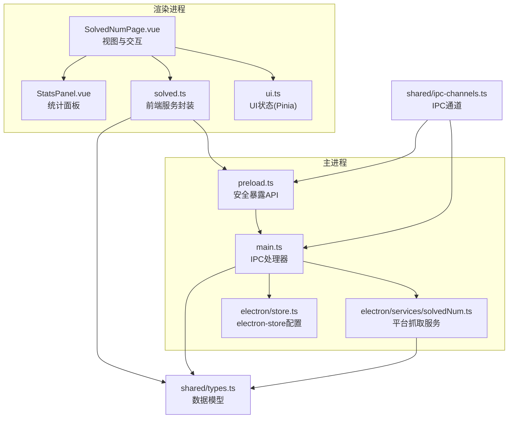
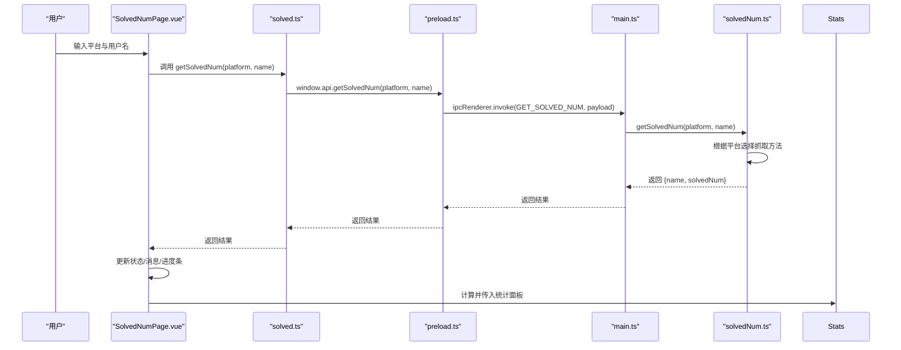
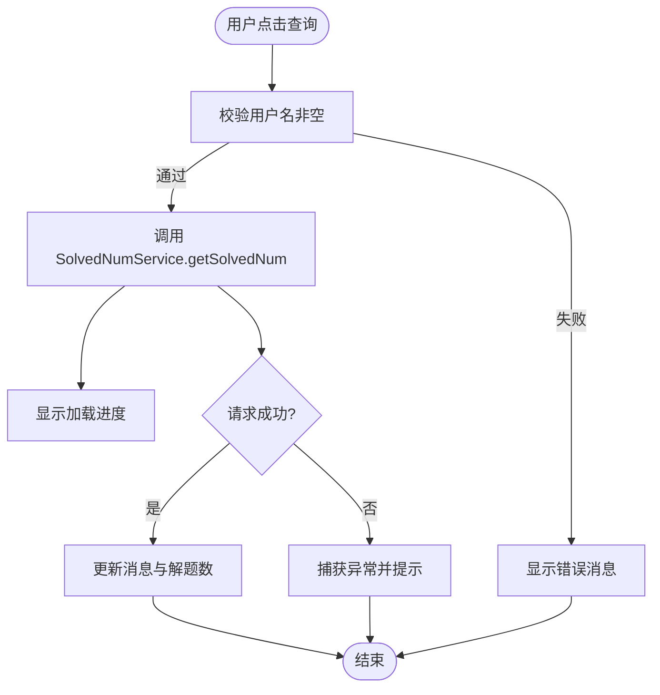
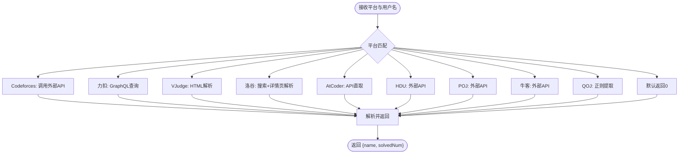
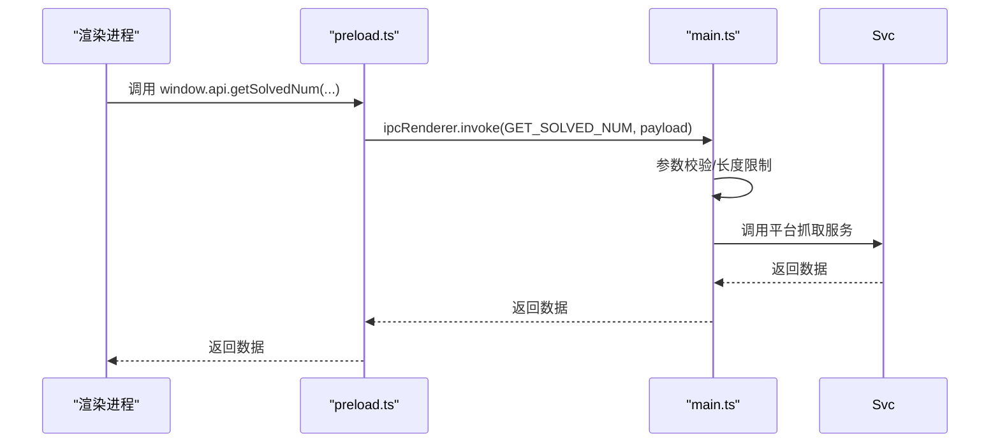
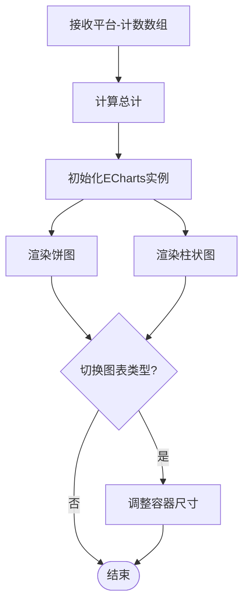
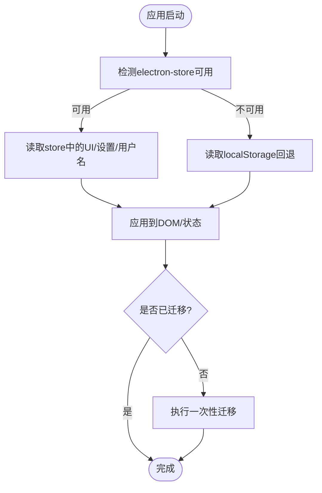
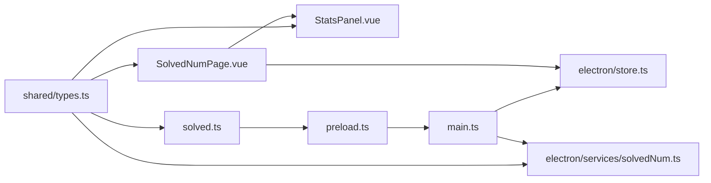

# 解题统计系统

<cite>
**本文引用的文件**
- [solved.ts](file://src/services/solved.ts)
- [solvedNum.ts](file://electron/services/solvedNum.ts)
- [SolvedNumPage.vue](file://src/views/SolvedNumPage.vue)
- [StatsPanel.vue](file://src/components/StatsPanel.vue)
- [types.ts](file://shared/types.ts)
- [main.ts](file://electron/main.ts)
- [preload.ts](file://electron/preload.ts)
- [ipc-channels.ts](file://shared/ipc-channels.ts)
- [store.ts](file://electron/store.ts)
- [store-schema.ts](file://shared/store-schema.ts)
- [migrate-storage.ts](file://src/utils/migrate-storage.ts)
- [ui.ts](file://src/stores/ui.ts)
- [README.md](file://README.md)
</cite>

## 目录
1. [引言](#引言)
2. [项目结构](#项目结构)
3. [核心组件](#核心组件)
4. [架构总览](#架构总览)
5. [详细组件分析](#详细组件分析)
6. [依赖关系分析](#依赖关系分析)
7. [性能考量](#性能考量)
8. [故障排查指南](#故障排查指南)
9. [结论](#结论)
10. [附录](#附录)

## 引言
本文件面向“解题统计系统”的实现与使用，围绕以下目标展开：
- 平台AC题目数量统计的实现机制：数据抓取策略、用户认证处理、数据聚合算法
- 可视化展示方案：图表类型选择、数据维度分析、趋势预测能力
- 统计数据的持久化存储策略、增量更新机制与数据一致性保障
- 数据模型设计、统计算法实现、前端展示组件与性能优化技巧
- 提供具体代码实现路径与使用示例

## 项目结构
系统采用 Electron + Vue 3 前后端分离架构：
- 前端渲染进程负责用户界面、交互与可视化
- 主进程负责网络请求、平台适配、IPC通信与持久化
- 共享模块提供类型定义与IPC通道常量



**图表来源**
- [SolvedNumPage.vue:1-345](file://src/views/SolvedNumPage.vue#L1-L345)
- [StatsPanel.vue:1-293](file://src/components/StatsPanel.vue#L1-L293)
- [solved.ts:1-8](file://src/services/solved.ts#L1-L8)
- [main.ts:396-450](file://electron/main.ts#L396-L450)
- [preload.ts:1-37](file://electron/preload.ts#L1-L37)
- [solvedNum.ts:1-198](file://electron/services/solvedNum.ts#L1-L198)
- [store.ts:1-31](file://electron/store.ts#L1-L31)
- [types.ts:1-67](file://shared/types.ts#L1-L67)
- [ipc-channels.ts:1-52](file://shared/ipc-channels.ts#L1-L52)

**章节来源**
- [README.md:35-69](file://README.md#L35-L69)

## 核心组件
- 数据模型：SolvedNum 描述平台名与解题数
- 前端服务：SolvedNumService 封装调用 window.api.getSolvedNum
- 主进程服务：SolvedNumService 实现各平台抓取逻辑
- 视图组件：SolvedNumPage 展示输入、状态与批量刷新；StatsPanel 展示统计图
- IPC与预加载：统一通道定义与安全暴露
- 存储：electron-store 用户名与缓存，localStorage 作为回退与迁移

**章节来源**
- [types.ts:36-39](file://shared/types.ts#L36-L39)
- [solved.ts:1-8](file://src/services/solved.ts#L1-L8)
- [solvedNum.ts:1-198](file://electron/services/solvedNum.ts#L1-L198)
- [SolvedNumPage.vue:88-220](file://src/views/SolvedNumPage.vue#L88-L220)
- [StatsPanel.vue:1-293](file://src/components/StatsPanel.vue#L1-L293)
- [ipc-channels.ts:1-52](file://shared/ipc-channels.ts#L1-L52)
- [preload.ts:1-37](file://electron/preload.ts#L1-L37)
- [main.ts:433-450](file://electron/main.ts#L433-L450)
- [store.ts:1-31](file://electron/store.ts#L1-L31)
- [store-schema.ts:1-55](file://shared/store-schema.ts#L1-L55)
- [migrate-storage.ts:1-64](file://src/utils/migrate-storage.ts#L1-L64)

## 架构总览
系统通过IPC通道完成前后端协作，主进程承担平台数据抓取与错误分类，渲染进程负责用户交互与可视化。



**图表来源**
- [solved.ts:1-8](file://src/services/solved.ts#L1-L8)
- [preload.ts:12-13](file://electron/preload.ts#L12-L13)
- [main.ts:433-450](file://electron/main.ts#L433-L450)
- [solvedNum.ts:166-194](file://electron/services/solvedNum.ts#L166-L194)
- [SolvedNumPage.vue:192-211](file://src/views/SolvedNumPage.vue#L192-L211)

## 详细组件分析

### 数据模型与类型
- SolvedNum：包含平台名与解题数
- 平台枚举：SolvedPlatform 覆盖主要OJ平台
- IPC通道：GET_SOLVED_NUM 明确参数与返回类型

```mermaid
classDiagram
class SolvedNum {
+string name
+number solvedNum
}
class SolvedPlatform {
<<enumeration>>
"Codeforces"
"力扣"
"VJudge"
"洛谷"
"AtCoder"
"HDU"
"POJ"
"牛客"
"QOJ"
}
class IPC_CHANNELS {
+string GET_SOLVED_NUM
}
SolvedNum --> SolvedPlatform : "平台标识"
```

**图表来源**
- [types.ts:36-67](file://shared/types.ts#L36-L67)
- [ipc-channels.ts:6-31](file://shared/ipc-channels.ts#L6-L31)

**章节来源**
- [types.ts:36-67](file://shared/types.ts#L36-L67)
- [ipc-channels.ts:1-52](file://shared/ipc-channels.ts#L1-L52)

### 前端服务与视图交互
- SolvedNumService：封装 window.api 调用
- SolvedNumPage：维护用户名、加载状态、消息与解题数；支持批量刷新与响应式网格
- StatsPanel：根据数据切换饼图/柱状图，展示总解题数



**图表来源**
- [SolvedNumPage.vue:192-211](file://src/views/SolvedNumPage.vue#L192-L211)

**章节来源**
- [solved.ts:1-8](file://src/services/solved.ts#L1-L8)
- [SolvedNumPage.vue:88-220](file://src/views/SolvedNumPage.vue#L88-L220)
- [StatsPanel.vue:1-293](file://src/components/StatsPanel.vue#L1-L293)

### 主进程抓取与聚合
- 统一入口：getSolvedNum(platform, name)，内部switch分派
- 平台适配：针对不同平台构造请求、解析响应
- 错误处理：统一抛出异常，由前端捕获并提示
- 超时与重试：主进程通用的超时与错误分类（用于其他模块，抓取服务可复用）



**图表来源**
- [solvedNum.ts:166-194](file://electron/services/solvedNum.ts#L166-L194)
- [solvedNum.ts:14-164](file://electron/services/solvedNum.ts#L14-L164)

**章节来源**
- [solvedNum.ts:1-198](file://electron/services/solvedNum.ts#L1-L198)
- [main.ts:433-450](file://electron/main.ts#L433-L450)

### IPC与安全暴露
- 预加载：仅暴露白名单API，避免直接暴露ipcRenderer
- 主进程：注册ipcMain.handle，参数校验与错误转发
- 通道常量：统一管理通道名称，提升类型安全



**图表来源**
- [preload.ts:12-13](file://electron/preload.ts#L12-L13)
- [main.ts:433-450](file://electron/main.ts#L433-L450)
- [ipc-channels.ts:6-31](file://shared/ipc-channels.ts#L6-L31)

**章节来源**
- [preload.ts:1-37](file://electron/preload.ts#L1-L37)
- [main.ts:396-450](file://electron/main.ts#L396-L450)
- [ipc-channels.ts:1-52](file://shared/ipc-channels.ts#L1-L52)

### 可视化与统计面板
- 图表类型：饼图（占比）、柱状图（数量）
- 数据维度：平台维度，支持动态切换
- 总计：按平台计数求和
- 响应式：移动端适配与容器自适应



**图表来源**
- [StatsPanel.vue:43-171](file://src/components/StatsPanel.vue#L43-L171)

**章节来源**
- [StatsPanel.vue:1-293](file://src/components/StatsPanel.vue#L1-L293)

### 持久化存储与一致性
- electron-store：集中存储UI、偏好、收藏、用户名、缓存
- localStorage：非Electron环境回退与迁移
- 迁移：一次性从localStorage迁移到electron-store
- 一致性：读取优先级与回退策略，异常时保持默认



**图表来源**
- [ui.ts:26-52](file://src/stores/ui.ts#L26-L52)
- [migrate-storage.ts:1-64](file://src/utils/migrate-storage.ts#L1-L64)
- [store.ts:1-31](file://electron/store.ts#L1-L31)
- [store-schema.ts:1-55](file://shared/store-schema.ts#L1-L55)

**章节来源**
- [store.ts:1-31](file://electron/store.ts#L1-L31)
- [store-schema.ts:1-55](file://shared/store-schema.ts#L1-L55)
- [ui.ts:1-96](file://src/stores/ui.ts#L1-L96)
- [migrate-storage.ts:1-64](file://src/utils/migrate-storage.ts#L1-L64)

## 依赖关系分析
- 组件耦合
  - 视图组件依赖前端服务与共享类型
  - 前端服务依赖预加载暴露的API
  - 主进程服务独立于视图，仅通过IPC交互
- 外部依赖
  - axios/cheerio：HTTP与HTML解析
  - echarts：可视化
  - electron-store：持久化
- 循环依赖
  - 无直接循环；IPC通道与类型为共享依赖



**图表来源**
- [types.ts:1-67](file://shared/types.ts#L1-L67)
- [SolvedNumPage.vue:1-345](file://src/views/SolvedNumPage.vue#L1-L345)
- [StatsPanel.vue:1-293](file://src/components/StatsPanel.vue#L1-L293)
- [solved.ts:1-8](file://src/services/solved.ts#L1-L8)
- [solvedNum.ts:1-198](file://electron/services/solvedNum.ts#L1-L198)
- [preload.ts:1-37](file://electron/preload.ts#L1-L37)
- [main.ts:396-450](file://electron/main.ts#L396-L450)
- [store.ts:1-31](file://electron/store.ts#L1-L31)

**章节来源**
- [types.ts:1-67](file://shared/types.ts#L1-L67)
- [ipc-channels.ts:1-52](file://shared/ipc-channels.ts#L1-L52)

## 性能考量
- 请求超时与重试
  - 主进程提供通用超时控制与错误分类，抓取服务可借鉴该模式以增强稳定性
- 响应式布局
  - 视图组件使用防抖与媒体查询，减少重绘与布局抖动
- 图表渲染
  - ECharts按需初始化与resize，避免重复创建实例
- 存储访问
  - 优先使用electron-store，失败回退localStorage，降低IO开销

**章节来源**
- [main.ts:122-167](file://electron/main.ts#L122-L167)
- [SolvedNumPage.vue:157-167](file://src/views/SolvedNumPage.vue#L157-L167)
- [StatsPanel.vue:181-213](file://src/components/StatsPanel.vue#L181-L213)
- [ui.ts:26-52](file://src/stores/ui.ts#L26-L52)

## 故障排查指南
- 网络/超时
  - 主进程提供超时与错误分类，前端捕获并提示
- 平台响应异常
  - 抓取服务对各平台返回进行校验，无效时抛出错误
- IPC参数校验
  - 主进程严格校验平台与用户名长度，防止异常参数
- 缓存与离线
  - electron-store提供cache字段，可用于离线降级（当前未在解题统计中启用，但结构已预留）

**章节来源**
- [main.ts:151-167](file://electron/main.ts#L151-L167)
- [solvedNum.ts:190-194](file://electron/services/solvedNum.ts#L190-L194)
- [main.ts:433-450](file://electron/main.ts#L433-L450)
- [store-schema.ts:43-49](file://shared/store-schema.ts#L43-L49)

## 结论
本系统通过清晰的前后端职责划分与IPC协作，实现了多平台AC题数的稳定抓取与可视化展示。前端提供友好的交互与响应式布局，主进程负责健壮的数据抓取与错误处理，electron-store提供持久化能力。未来可在现有基础上扩展缓存与趋势预测能力，进一步提升用户体验与数据价值。

## 附录
- 使用示例（路径指引）
  - 查询单个平台：调用 [SolvedNumPage.vue:192-211](file://src/views/SolvedNumPage.vue#L192-L211) 中的 querySolved
  - 批量刷新：调用 [SolvedNumPage.vue:213-219](file://src/views/SolvedNumPage.vue#L213-L219) 中的 refreshAll
  - 切换图表：在 [StatsPanel.vue:173-179](file://src/components/StatsPanel.vue#L173-L179) 中切换饼图/柱状图
  - 获取数据流：参考 [solved.ts:1-8](file://src/services/solved.ts#L1-L8) → [preload.ts:12-13](file://electron/preload.ts#L12-L13) → [main.ts:433-450](file://electron/main.ts#L433-L450) → [solvedNum.ts:166-194](file://electron/services/solvedNum.ts#L166-L194)
- 数据模型与类型：参考 [types.ts:36-67](file://shared/types.ts#L36-L67)
- IPC通道：参考 [ipc-channels.ts:1-52](file://shared/ipc-channels.ts#L1-L52)
- 存储与迁移：参考 [store.ts:1-31](file://electron/store.ts#L1-L31)、[store-schema.ts:1-55](file://shared/store-schema.ts#L1-L55)、[migrate-storage.ts:1-64](file://src/utils/migrate-storage.ts#L1-L64)