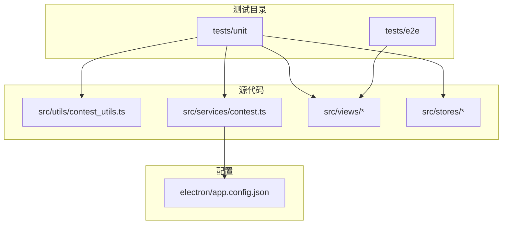
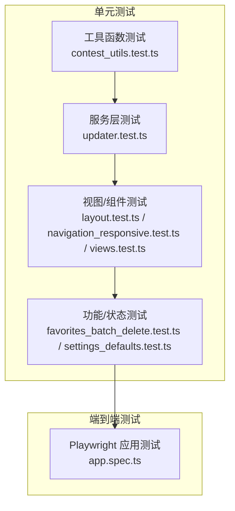
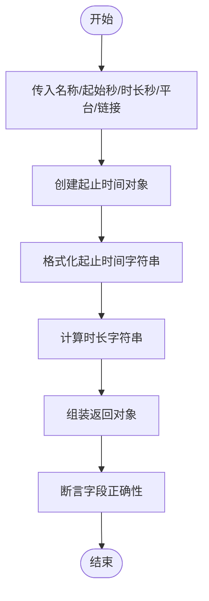
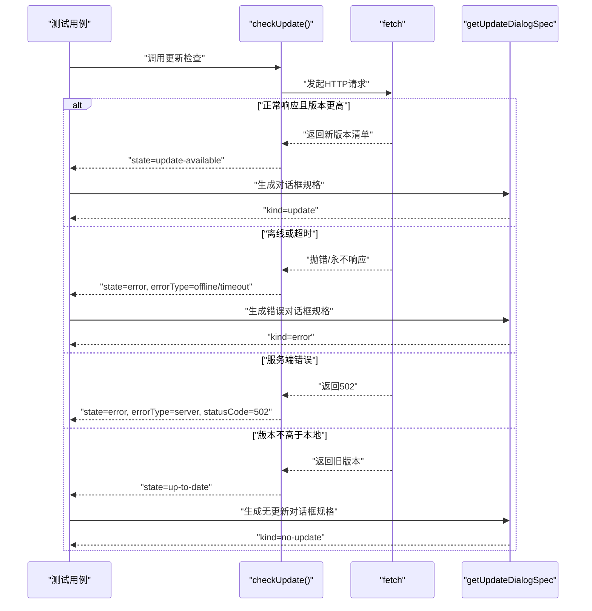
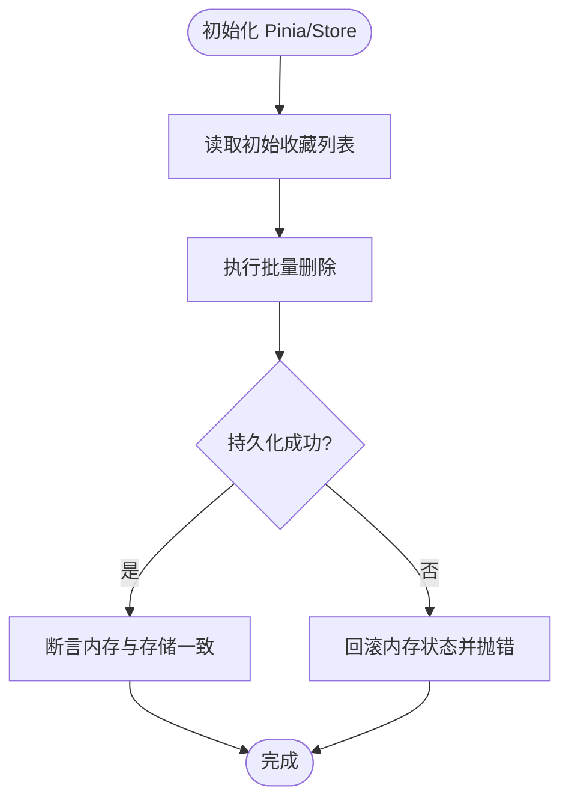
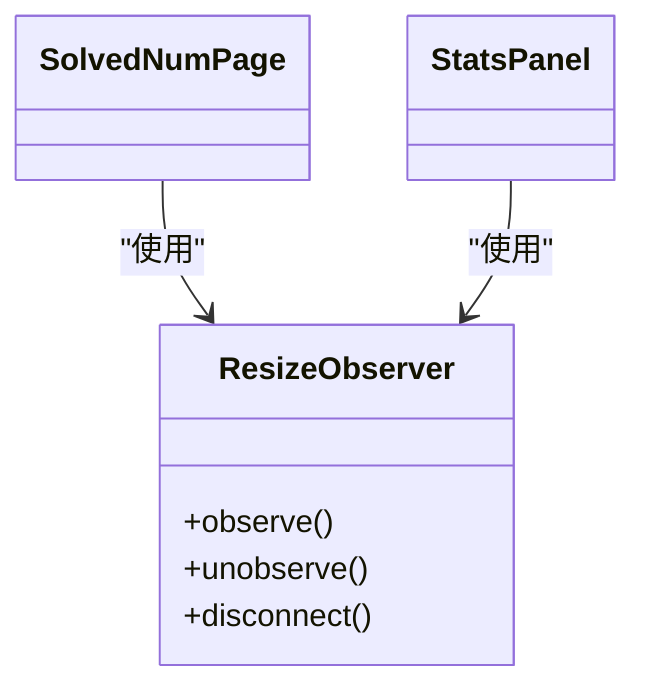
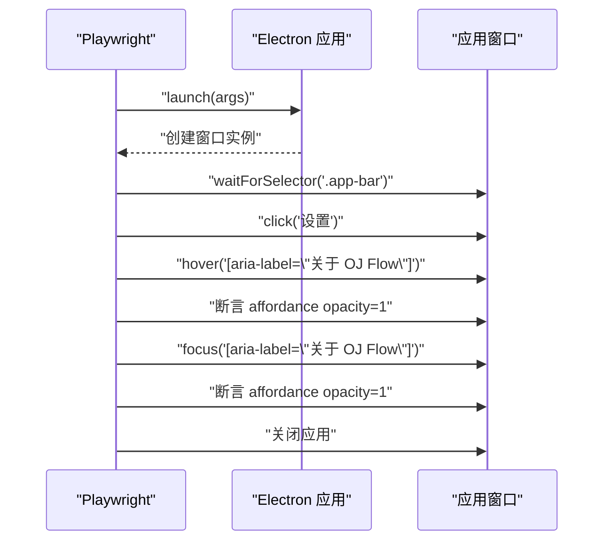
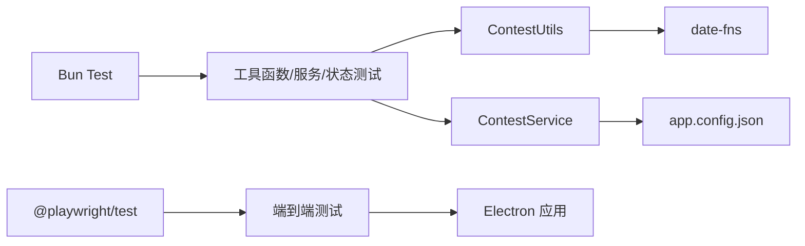

# 测试策略

<cite>
**本文引用的文件**
- [package.json](file://package.json)
- [app.config.json](file://electron/app.config.json)
- [contest_utils.ts](file://src/utils/contest_utils.ts)
- [contest.ts](file://src/services/contest.ts)
- [contest_utils.test.ts](file://tests/unit/contest_utils.test.ts)
- [favorites_batch_delete.test.ts](file://tests/unit/favorites_batch_delete.test.ts)
- [layout.test.ts](file://tests/unit/layout.test.ts)
- [navigation_responsive.test.ts](file://tests/unit/navigation_responsive.test.ts)
- [settings_defaults.test.ts](file://tests/unit/settings_defaults.test.ts)
- [updater.test.ts](file://tests/unit/updater.test.ts)
- [views.test.ts](file://tests/unit/views.test.ts)
- [app.spec.ts](file://tests/e2e/app.spec.ts)
- [eslint.config.js](file://eslint.config.js)
</cite>

## 目录
1. [引言](#引言)
2. [项目结构](#项目结构)
3. [核心组件](#核心组件)
4. [架构总览](#架构总览)
5. [详细组件分析](#详细组件分析)
6. [依赖分析](#依赖分析)
7. [性能考虑](#性能考虑)
8. [故障排查指南](#故障排查指南)
9. [结论](#结论)
10. [附录](#附录)

## 引言
本文件面向OJFlow项目的测试策略，系统化阐述单元测试与端到端测试的实施方法，覆盖测试框架选择（Bun Test、Playwright）、测试工具配置、测试用例设计原则与覆盖率目标、组件测试/服务测试/工具函数测试方法论、测试数据准备与Mock策略、测试自动化与持续集成建议、测试报告与质量门禁建议，以及为开发者提供的高质量测试用例编写指导。

## 项目结构
- 测试目录组织清晰：tests/unit 用于单元测试，tests/e2e 用于端到端测试。
- 单元测试采用Bun Test运行器，端到端测试采用Playwright。
- 包管理脚本中定义了测试命令：test:unit 与 test:e2e。
- 配置文件 app.config.json 提供应用默认行为（如回溯天数），影响服务层逻辑。

图表来源
- [package.json:47-48](file://package.json#L47-L48)
- [contest_utils.ts:1-68](file://src/utils/contest_utils.ts#L1-L68)
- [contest.ts:1-35](file://src/services/contest.ts#L1-L35)
- [app.config.json:1-62](file://electron/app.config.json#L1-L62)

章节来源
- [package.json:47-48](file://package.json#L47-L48)
- [app.config.json:1-62](file://electron/app.config.json#L1-L62)

## 核心组件
- 工具函数层：ContestUtils 提供竞赛时间格式化与相对日期计算。
- 服务层：ContestService 封装最近竞赛获取、URL打开、更新安装等业务调用。
- 状态层：Pinia Store（如 contest、ui）承载应用状态与持久化交互。
- 视图层：Vue组件负责UI与交互，配合路由与响应式布局。
- 端到端层：Playwright驱动Electron应用，验证真实窗口与交互。

章节来源
- [contest_utils.ts:1-68](file://src/utils/contest_utils.ts#L1-L68)
- [contest.ts:1-35](file://src/services/contest.ts#L1-L35)

## 架构总览
测试体系围绕“工具函数 → 服务层 → 视图/状态 → 端到端”逐层验证，确保从纯函数正确性到用户交互完整性的闭环。

图表来源
- [contest_utils.test.ts:1-35](file://tests/unit/contest_utils.test.ts#L1-L35)
- [updater.test.ts:1-140](file://tests/unit/updater.test.ts#L1-L140)
- [layout.test.ts:1-107](file://tests/unit/layout.test.ts#L1-L107)
- [navigation_responsive.test.ts:1-45](file://tests/unit/navigation_responsive.test.ts#L1-L45)
- [settings_defaults.test.ts:1-48](file://tests/unit/settings_defaults.test.ts#L1-L48)
- [favorites_batch_delete.test.ts:1-129](file://tests/unit/favorites_batch_delete.test.ts#L1-L129)
- [views.test.ts:1-24](file://tests/unit/views.test.ts#L1-L24)
- [app.spec.ts:1-190](file://tests/e2e/app.spec.ts#L1-L190)

## 详细组件分析

### 工具函数测试：ContestUtils
- 测试要点
  - 时间构造：校验 createContest 输出字段（名称、平台、起止时间、时长字符串等）。
  - 相对日期：校验 getDayName 返回包含“今天/明天/后天/周X”的文本片段。
- 设计原则
  - 使用确定性输入（秒级时间戳与固定时长）避免时区差异导致的断言波动。
  - 对时长字符串断言不依赖本地时区，降低环境敏感性。
- 复杂度与性能
  - 工具函数为纯函数，无外部依赖，测试开销低，适合高覆盖率。

图表来源
- [contest_utils.ts:4-43](file://src/utils/contest_utils.ts#L4-L43)
- [contest_utils.test.ts:5-23](file://tests/unit/contest_utils.test.ts#L5-L23)

章节来源
- [contest_utils.ts:1-68](file://src/utils/contest_utils.ts#L1-L68)
- [contest_utils.test.ts:1-35](file://tests/unit/contest_utils.test.ts#L1-L35)

### 服务层测试：Updater（更新检查）
- 测试要点
  - 远端版本高于本地：返回“可更新”，并生成更新对话框规格。
  - 远端版本不高于本地：返回“已是最新”，生成无更新对话框规格。
  - 离线场景：返回网络错误类型，包含重试能力。
  - 服务端错误（如502）：返回服务端错误类型并携带状态码。
  - 超时场景：返回网络错误类型。
  - 未知异常：统一归类为“检查更新失败”。
  - 版本清单格式错误：返回“无效清单”。
  - 重试机制：基于环境变量配置重试次数与退避时间，最终成功。
- Mock策略
  - 替换全局 fetch 与 navigator.onLine，注入不同响应与状态。
  - 通过 process.env 注入 VITE_* 更新相关配置。
- 断言维度
  - 状态枚举（up-to-date/update-available/error）。
  - 错误类型（offline/server/timeout/invalid-manifest/unknown）。
  - 对话框规格（标题、按钮文案、kind）。
  - 超时/重试次数验证。

图表来源
- [updater.test.ts:26-128](file://tests/unit/updater.test.ts#L26-L128)

章节来源
- [updater.test.ts:1-140](file://tests/unit/updater.test.ts#L1-L140)

### 功能/状态测试：收藏批量删除与设置默认值
- 收藏批量删除
  - 场景覆盖：数组参数批量删除、空选择、不存在项（部分删除）、持久化失败回滚。
  - 数据规模：500+条数据线性复杂度路径验证。
  - 持久化：localStorage 内存替身模拟，断言存储一致性。
- 设置默认值
  - 首次初始化：默认回溯周期为7天。
  - 暗色模式：切换后写入 data-theme=dark 到 documentElement.dataset。

图表来源
- [favorites_batch_delete.test.ts:43-103](file://tests/unit/favorites_batch_delete.test.ts#L43-L103)

章节来源
- [favorites_batch_delete.test.ts:1-129](file://tests/unit/favorites_batch_delete.test.ts#L1-L129)
- [settings_defaults.test.ts:24-46](file://tests/unit/settings_defaults.test.ts#L24-L46)

### 组件测试：布局与响应式
- 布局网格列数
  - 使用 @vue/test-utils 挂载组件，通过全局 stubs 简化第三方UI库渲染。
  - 断言 n-grid 的 cols 属性满足移动端/桌面端断点规则。
- 响应式与移动端样式
  - 通过修改 innerWidth 模拟断点，断言 mobile-mode 类是否按预期添加/移除。
- 导航页响应式
  - 在小屏宽度下断言底部导航与移动底部栏可见性。

图表来源
- [layout.test.ts:6-11](file://tests/unit/layout.test.ts#L6-L11)

章节来源
- [layout.test.ts:1-107](file://tests/unit/layout.test.ts#L1-L107)
- [navigation_responsive.test.ts:1-45](file://tests/unit/navigation_responsive.test.ts#L1-L45)

### 端到端测试：应用启动与关键交互
- 启动验证
  - 启动 Electron 应用，等待主窗口加载，断言应用栏标题为“近期比赛”。
- 设置页交互
  - 设置页 hover/focus 时右侧图标显隐，断言 CSS opacity 变化。
- 收藏页交互
  - 全选/快捷键（Ctrl+A）/底部栏高度/批量删除确认弹窗。
  - 跨页多选并批量删除，断言剩余条目数量与名称集合。
- 数据注入
  - 通过 window.evaluate 注入大量收藏数据（200条/25条）以验证性能与交互稳定性。

图表来源
- [app.spec.ts:16-58](file://tests/e2e/app.spec.ts#L16-L58)

章节来源
- [app.spec.ts:1-190](file://tests/e2e/app.spec.ts#L1-L190)

### 视图组件结构测试
- 目标：验证各视图组件可被导入，保证构建期模块依赖正确。
- 方法：对每个视图组件进行导入断言，确保无语法/导出错误。

章节来源
- [views.test.ts:1-24](file://tests/unit/views.test.ts#L1-L24)

## 依赖分析
- 测试框架与工具
  - 单元测试：Bun Test（内置测试运行器）。
  - 端到端测试：Playwright。
  - 代码质量：ESLint + Prettier，Flat 配置。
- 关键依赖关系
  - ContestService 依赖 window.api（Electron IPC）与 app.config.json。
  - ContestUtils 依赖 date-fns。
  - 组件测试依赖 @vue/test-utils 与 stubs。
  - 端到端测试依赖 @playwright/test 与 Electron 主进程入口。

图表来源
- [package.json:73-93](file://package.json#L73-L93)
- [contest.ts:1-35](file://src/services/contest.ts#L1-L35)
- [contest_utils.ts:1-68](file://src/utils/contest_utils.ts#L1-L68)
- [app.config.json:1-62](file://electron/app.config.json#L1-L62)

章节来源
- [package.json:73-93](file://package.json#L73-L93)
- [eslint.config.js:1-40](file://eslint.config.js#L1-L40)

## 性能考虑
- 单元测试
  - 工具函数与纯函数测试无需真实DOM或网络，执行速度快，适合高频运行。
  - 对于大规模数据（如批量删除600条），应关注线性复杂度路径，避免不必要的排序/查找。
- 端到端测试
  - 使用 window.evaluate 注入数据前需控制数据规模，避免过长等待与内存占用。
  - 合理设置 test.setTimeout，平衡稳定性与执行时长。
- Mock与替身
  - fetch/navigator/onLine 替换与 localStorage 内存替身可显著提升稳定性与速度。
  - DOM 适配（ResizeObserver、window.innerWidth）减少真实浏览器环境依赖。

## 故障排查指南
- 时区与时长断言不稳定
  - 原因：相对日期与本地时区相关。
  - 解决：仅断言包含“今天/明天/后天”等文本片段；对时长字符串断言不依赖具体时区。
- 网络请求失败
  - 原因：离线或超时。
  - 解决：在测试中替换 fetch 并注入 navigator.onLine=false 或永不响应的 Promise。
- 持久化异常
  - 原因：localStorage 抛出 QuotaExceededError。
  - 解决：使用内存替身并断言异常抛出，同时验证内存状态未被污染。
- 响应式断言失败
  - 原因：未正确模拟断点或未触发组件内部逻辑。
  - 解决：设置 innerWidth 并等待微任务/重渲染；必要时手动触发 resize 逻辑。

章节来源
- [contest_utils.test.ts:20-23](file://tests/unit/contest_utils.test.ts#L20-L23)
- [updater.test.ts:59-73](file://tests/unit/updater.test.ts#L59-L73)
- [favorites_batch_delete.test.ts:93-103](file://tests/unit/favorites_batch_delete.test.ts#L93-L103)
- [layout.test.ts:58-82](file://tests/unit/layout.test.ts#L58-L82)

## 结论
本测试策略以Bun Test与Playwright为核心，覆盖工具函数、服务层、状态与视图组件，并通过端到端测试验证真实应用交互。通过合理的Mock与替身、稳定的断言策略与性能优化，能够在保证质量的同时提升测试效率。建议在CI中分层运行单元测试与端到端测试，并结合代码质量规则与覆盖率门槛，形成可靠的持续交付保障。

## 附录

### 测试框架与配置
- 单元测试
  - 运行器：Bun Test（tests/unit）
  - 推荐：为每个工具函数/服务/组件建立独立测试文件，命名与源文件一一对应。
- 端到端测试
  - 运行器：Playwright（tests/e2e）
  - 启动参数：指向 Electron 主进程入口。
- 代码质量
  - ESLint Flat 配置已启用，建议在CI中强制执行 lint 与格式化检查。

章节来源
- [package.json:47-48](file://package.json#L47-L48)
- [eslint.config.js:1-40](file://eslint.config.js#L1-L40)

### 测试用例设计原则与覆盖率目标
- 原则
  - 每个分支/异常路径至少一条用例。
  - 输入边界与异常输入（空值、非法格式、超大数组）必须覆盖。
  - 交互与状态变更需断言最终一致性（内存与持久化）。
- 覆盖率
  - 建议：语句/分支/函数/行覆盖率均不低于80%，关键路径不低于90%。
  - 工具：可在CI中集成覆盖率收集与阈值检查（例如使用Bun Test的覆盖率选项或第三方工具）。

### 测试数据准备与Mock策略
- 工具函数
  - 使用确定性时间戳与固定时长，避免时区影响。
- 服务层
  - 替换 fetch/navigator.onLine，注入不同响应与状态。
  - 通过 process.env 注入更新相关配置。
- 状态层
  - 使用内存版 localStorage 替身，断言持久化前后一致性。
  - Pinia Store 初始化前设置 active pinia 与内存存储。
- 组件层
  - 使用 @vue/test-utils 的 global.stubs 简化第三方UI渲染。
  - 通过修改 window.innerWidth 模拟断点。

### 测试自动化与持续集成建议
- 建议流水线阶段
  - 代码检查：lint/format/type-check
  - 单元测试：test:unit（优先快速通过）
  - 端到端测试：test:e2e（在具备GUI的环境中运行）
- 质量门禁
  - 通过率100%，覆盖率阈值达标，ESLint/Prettier无违规。
- 缓慢或易失败用例
  - 可标记为慢速或条件执行，在PR中可选择性跳过，合并后再全量运行。

### 测试报告与质量门禁
- 报告生成
  - 单元测试：Bun Test内置报告；可在CI中导出JUnit XML以便集成。
  - 端到端测试：Playwright默认HTML报告；可配置截图/视频/日志输出。
- 质量门禁
  - 必须通过所有单元测试与关键端到端用例。
  - 覆盖率未达标时阻断合并。