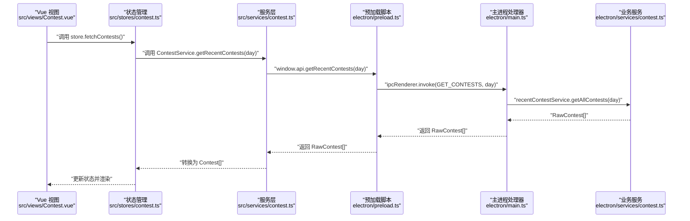
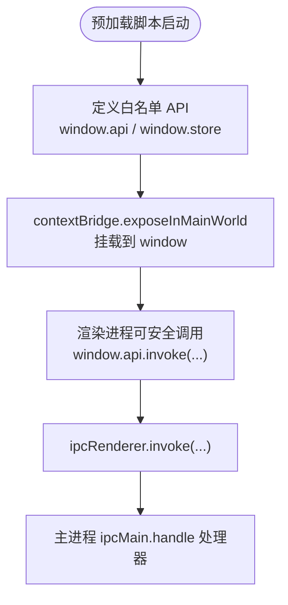
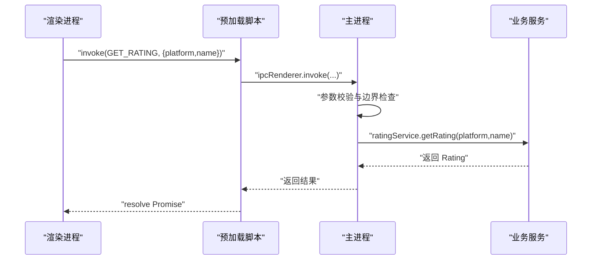
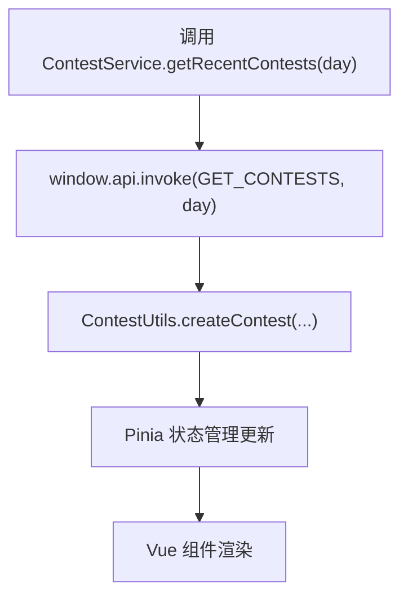
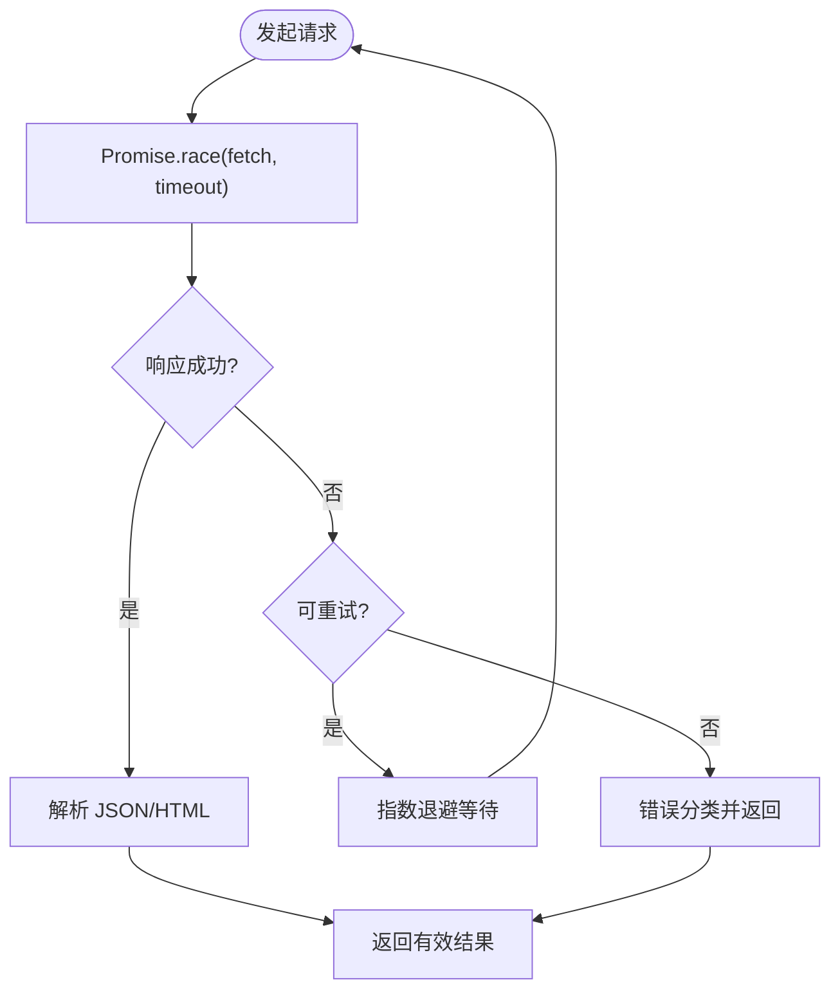
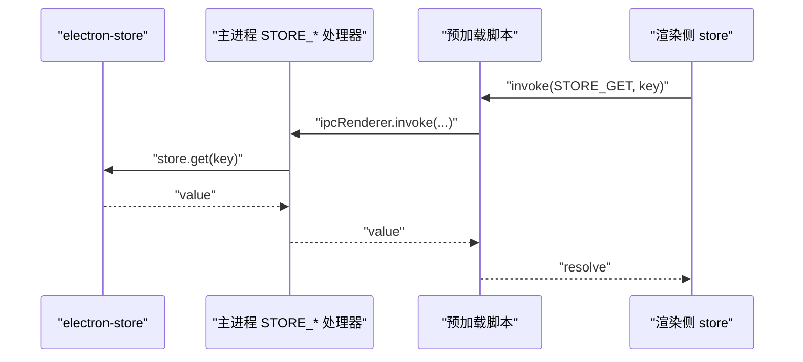
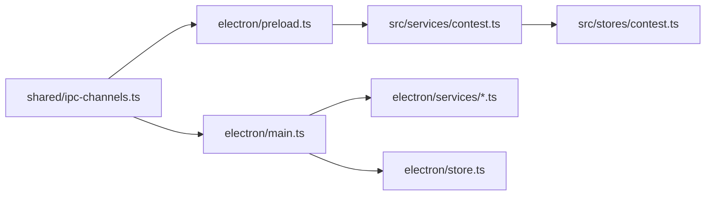

# IPC通信机制

<cite>
**本文引用的文件**   
- [electron/main.ts](file://electron/main.ts)
- [electron/preload.ts](file://electron/preload.ts)
- [shared/ipc-channels.ts](file://shared/ipc-channels.ts)
- [electron/services/contest.ts](file://electron/services/contest.ts)
- [electron/services/rating.ts](file://electron/services/rating.ts)
- [electron/services/solvedNum.ts](file://electron/services/solvedNum.ts)
- [electron/store.ts](file://electron/store.ts)
- [shared/types.ts](file://shared/types.ts)
- [src/main.ts](file://src/main.ts)
- [src/services/contest.ts](file://src/services/contest.ts)
- [src/stores/contest.ts](file://src/stores/contest.ts)
- [src/utils/contest_utils.ts](file://src/utils/contest_utils.ts)
- [src/views/Contest.vue](file://src/views/Contest.vue)
</cite>

## 目录
1. [简介](#简介)
2. [项目结构](#项目结构)
3. [核心组件](#核心组件)
4. [架构总览](#架构总览)
5. [详细组件分析](#详细组件分析)
6. [依赖关系分析](#依赖关系分析)
7. [性能考量](#性能考量)
8. [故障排查指南](#故障排查指南)
9. [结论](#结论)
10. [附录](#附录)

## 简介
本文件系统性梳理本项目基于 Electron 的 IPC（进程间通信）机制，重点覆盖以下方面：
- 主进程与渲染进程之间的通信原理与通道设计
- IPC 通道的定义、消息格式与类型安全机制
- IpcChannel 接口与 IpcHandlerMap 的设计思路
- 参数传递规则、返回值处理与错误传播
- 预加载脚本的安全作用与上下文隔离机制
- 最佳实践：错误处理策略、超时管理、性能优化
- 在 Vue 组件中调用 IPC 接口的实际示例路径

## 项目结构
本项目采用典型的 Electron + Vue 架构，IPC 通信贯穿于主进程、预加载脚本与渲染进程之间：
- 主进程负责业务逻辑与系统能力（如网络请求、外部链接打开、应用更新）
- 预加载脚本通过 contextBridge 暴露受控 API 到渲染进程
- 渲染进程（Vue 应用）通过 window.api/window.store 调用 IPC

```mermaid
graph TB
subgraph "渲染进程Vue"
RUI["Vue 组件<br/>src/views/*.vue"]
RS["服务层<br/>src/services/*.ts"]
RStore["状态管理<br/>src/stores/*.ts"]
RPreload["window.api/window.store<br/>由预加载注入"]
end
subgraph "预加载脚本"
Preload["electron/preload.ts<br/>contextBridge 暴露 API"]
end
subgraph "主进程"
Main["electron/main.ts<br/>ipcMain.handle 注册处理器"]
Services["业务服务<br/>electron/services/*.ts"]
Store["electron-store<br/>electron/store.ts"]
end
RUI --> RS --> RPreload
RS --> Preload
RPreload <- --> Main
Preload <- --> Main
Main --> Services
Main --> Store
```

图表来源
- [electron/main.ts:357-486](file://electron/main.ts#L357-L486)
- [electron/preload.ts:1-38](file://electron/preload.ts#L1-L38)
- [src/services/contest.ts:1-35](file://src/services/contest.ts#L1-L35)
- [src/stores/contest.ts:1-307](file://src/stores/contest.ts#L1-L307)
- [electron/store.ts:1-31](file://electron/store.ts#L1-L31)

章节来源
- [electron/main.ts:357-486](file://electron/main.ts#L357-L486)
- [electron/preload.ts:1-38](file://electron/preload.ts#L1-L38)
- [src/main.ts:1-26](file://src/main.ts#L1-L26)

## 核心组件
- IPC 通道定义与类型映射：集中于共享模块，确保主/渲染两端一致
- 预加载脚本：仅暴露白名单 API，避免直接暴露 ipcRenderer
- 主进程处理器：注册 ipcMain.handle，执行业务逻辑并返回结果
- 业务服务：封装第三方 API 请求与数据清洗
- 渲染侧服务与状态：封装 IPC 调用，统一错误处理与数据转换

章节来源
- [shared/ipc-channels.ts:1-53](file://shared/ipc-channels.ts#L1-L53)
- [electron/preload.ts:1-38](file://electron/preload.ts#L1-L38)
- [electron/main.ts:396-486](file://electron/main.ts#L396-L486)
- [electron/services/contest.ts:1-270](file://electron/services/contest.ts#L1-L270)
- [electron/services/rating.ts:1-175](file://electron/services/rating.ts#L1-L175)
- [electron/services/solvedNum.ts:1-198](file://electron/services/solvedNum.ts#L1-L198)
- [src/services/contest.ts:1-35](file://src/services/contest.ts#L1-L35)
- [src/stores/contest.ts:1-307](file://src/stores/contest.ts#L1-L307)

## 架构总览
下面以“获取近期比赛”为例，展示从 Vue 组件到主进程处理器的完整调用链路。



图表来源
- [src/views/Contest.vue:623-625](file://src/views/Contest.vue#L623-L625)
- [src/stores/contest.ts:190-201](file://src/stores/contest.ts#L190-L201)
- [src/services/contest.ts:8-25](file://src/services/contest.ts#L8-L25)
- [electron/preload.ts:6-10](file://electron/preload.ts#L6-L10)
- [electron/main.ts:396-412](file://electron/main.ts#L396-L412)
- [electron/services/contest.ts:255-266](file://electron/services/contest.ts#L255-L266)

## 详细组件分析

### IPC 通道与类型安全
- 通道常量集中定义于共享模块，保证主/渲染两端一致性
- IpcChannel 与 IpcHandlerMap 提供强类型约束，明确每个通道的参数与返回值类型
- 类型映射覆盖所有业务通道：获取比赛、获取评分、获取做题数、打开链接、安装更新、存储读写等

```mermaid
classDiagram
class IpcHandlerMap {
+GET_CONTESTS(args : [day : number], return : RawContest[])
+GET_RATING(args : [{platform : string, name : string}], return : Rating)
+GET_SOLVED_NUM(args : [{platform : string, name : string}], return : SolvedNum)
+OPEN_URL(args : [url : string], return : void)
+UPDATER_INSTALL(args : [{url : string}], return : boolean)
+STORE_GET(args : [key : string], return : unknown)
+STORE_SET(args : [key : string, value : unknown], return : void)
+STORE_GET_ALL(args : [], return : Record<string, unknown>)
}
class IPC_CHANNELS {
+GET_CONTESTS
+GET_RATING
+GET_SOLVED_NUM
+OPEN_URL
+UPDATER_INSTALL
+STORE_GET
+STORE_SET
+STORE_GET_ALL
}
IpcHandlerMap --> IPC_CHANNELS : "键名来自通道常量"
```

图表来源
- [shared/ipc-channels.ts:18-52](file://shared/ipc-channels.ts#L18-L52)

章节来源
- [shared/ipc-channels.ts:1-53](file://shared/ipc-channels.ts#L1-L53)
- [shared/types.ts:1-67](file://shared/types.ts#L1-L67)

### 预加载脚本与上下文隔离
- 仅暴露白名单 API，不直接暴露 ipcRenderer，降低安全风险
- 通过 contextBridge.exposeInMainWorld 将受限 API 挂载到 window 对象
- 渲染进程通过 window.api 与 window.store 调用 IPC



图表来源
- [electron/preload.ts:4-38](file://electron/preload.ts#L4-L38)

章节来源
- [electron/preload.ts:1-38](file://electron/preload.ts#L1-L38)

### 主进程处理器与业务服务
- 主进程注册多个 ipcMain.handle 处理器，分别对应不同业务场景
- 处理器内进行参数校验、异常捕获与错误分类
- 业务服务封装第三方 API 请求与数据清洗，保证主进程职责清晰



图表来源
- [electron/main.ts:414-431](file://electron/main.ts#L414-L431)
- [electron/services/rating.ts:156-171](file://electron/services/rating.ts#L156-L171)

章节来源
- [electron/main.ts:396-486](file://electron/main.ts#L396-L486)
- [electron/services/contest.ts:1-270](file://electron/services/contest.ts#L1-L270)
- [electron/services/rating.ts:1-175](file://electron/services/rating.ts#L1-L175)
- [electron/services/solvedNum.ts:1-198](file://electron/services/solvedNum.ts#L1-L198)

### 渲染侧服务与状态管理
- 渲染侧服务封装 window.api 调用，统一错误处理
- Pinia 状态管理负责持久化配置与数据流控制
- 工具类负责将原始数据转换为视图友好的格式



图表来源
- [src/services/contest.ts:8-25](file://src/services/contest.ts#L8-L25)
- [src/utils/contest_utils.ts:5-43](file://src/utils/contest_utils.ts#L5-L43)
- [src/stores/contest.ts:190-201](file://src/stores/contest.ts#L190-L201)

章节来源
- [src/services/contest.ts:1-35](file://src/services/contest.ts#L1-L35)
- [src/stores/contest.ts:1-307](file://src/stores/contest.ts#L1-L307)
- [src/utils/contest_utils.ts:1-68](file://src/utils/contest_utils.ts#L1-L68)

### 错误处理与超时管理
- 主进程对网络请求与外部调用进行超时控制与重试策略
- 使用 AbortController 实现可取消的 fetch 调用
- 对错误进行分类（超时、网络、未知），便于上层处理



图表来源
- [electron/main.ts:122-144](file://electron/main.ts#L122-L144)
- [electron/main.ts:176-225](file://electron/main.ts#L176-L225)

章节来源
- [electron/main.ts:115-225](file://electron/main.ts#L115-L225)

### 存储与配置
- 主进程使用 electron-store 管理用户配置与缓存
- 通过 STORE_GET/SET/GET_ALL 通道实现跨进程读写
- 渲染侧通过 window.store 访问，实现配置与收藏的持久化



图表来源
- [electron/main.ts:468-479](file://electron/main.ts#L468-L479)
- [electron/store.ts:1-31](file://electron/store.ts#L1-L31)
- [electron/preload.ts:22-31](file://electron/preload.ts#L22-L31)

章节来源
- [electron/main.ts:468-479](file://electron/main.ts#L468-L479)
- [electron/store.ts:1-31](file://electron/store.ts#L1-L31)
- [electron/preload.ts:22-31](file://electron/preload.ts#L22-L31)

## 依赖关系分析
- 共享模块（IPC 通道与类型）被主进程与渲染进程共同依赖
- 预加载脚本依赖共享通道常量，向渲染进程暴露白名单 API
- 主进程处理器依赖业务服务与 electron-store
- 渲染侧服务与状态管理依赖预加载脚本提供的 API



图表来源
- [shared/ipc-channels.ts:1-53](file://shared/ipc-channels.ts#L1-L53)
- [electron/main.ts:19-26](file://electron/main.ts#L19-L26)
- [electron/preload.ts:1-3](file://electron/preload.ts#L1-L3)
- [src/services/contest.ts:1-35](file://src/services/contest.ts#L1-L35)
- [src/stores/contest.ts:1-307](file://src/stores/contest.ts#L1-L307)
- [electron/services/contest.ts:1-270](file://electron/services/contest.ts#L1-L270)
- [electron/store.ts:1-31](file://electron/store.ts#L1-L31)

章节来源
- [shared/ipc-channels.ts:1-53](file://shared/ipc-channels.ts#L1-L53)
- [electron/main.ts:19-26](file://electron/main.ts#L19-L26)
- [electron/preload.ts:1-3](file://electron/preload.ts#L1-L3)
- [src/services/contest.ts:1-35](file://src/services/contest.ts#L1-L35)
- [src/stores/contest.ts:1-307](file://src/stores/contest.ts#L1-L307)

## 性能考量
- 批量请求与并发控制：业务服务中使用 Promise.all 并发拉取多平台数据，减少总耗时
- 缓存与去重：electron-store 提供本地缓存，避免重复请求
- UI 层节流：状态管理中对用户操作进行防抖/节流，减少频繁刷新
- 资源释放：在组件卸载时清理定时器与事件监听，防止内存泄漏

章节来源
- [electron/services/contest.ts:257-266](file://electron/services/contest.ts#L257-L266)
- [src/stores/contest.ts:63-140](file://src/stores/contest.ts#L63-L140)
- [src/views/Contest.vue:641-652](file://src/views/Contest.vue#L641-L652)

## 故障排查指南
- 通道名称不一致：检查 shared/ipc-channels.ts 中的常量是否与主/渲染两端一致
- 参数类型不符：核对 IpcHandlerMap 的 args/return 定义，确保调用方传参与返回值类型匹配
- 预加载未注入：确认 preload.ts 是否正确暴露 API 并通过 webPreferences.preload 指定
- 超时与网络错误：查看主进程中的 fetchWithTimeout 与 classifyFetchError，定位超时或网络问题
- 权限与协议限制：主进程对外部链接仅允许 http/https，避免协议漏洞

章节来源
- [shared/ipc-channels.ts:18-52](file://shared/ipc-channels.ts#L18-L52)
- [electron/preload.ts:1-38](file://electron/preload.ts#L1-L38)
- [electron/main.ts:452-458](file://electron/main.ts#L452-L458)
- [electron/main.ts:122-167](file://electron/main.ts#L122-L167)

## 结论
本项目通过“共享通道 + 预加载白名单 + 主进程处理器 + 业务服务”的分层设计，实现了安全、类型安全且高性能的 IPC 通信。建议在扩展新功能时遵循现有模式：先在共享模块定义通道与类型，再在预加载脚本暴露 API，最后在主进程注册处理器并调用业务服务，确保错误处理与性能优化贯穿始终。

## 附录

### 在 Vue 组件中调用 IPC 接口的最佳实践
- 通过服务层封装 window.api 调用，集中处理错误与默认值
- 在状态管理中统一触发数据拉取与持久化
- 使用工具类将原始数据转换为视图友好格式
- 示例路径（不含具体代码内容）：
  - [调用获取近期比赛:8-25](file://src/services/contest.ts#L8-L25)
  - [在组件中触发刷新:623-625](file://src/views/Contest.vue#L623-L625)
  - [状态管理中拉取与更新:190-201](file://src/stores/contest.ts#L190-L201)
  - [数据格式转换:5-43](file://src/utils/contest_utils.ts#L5-L43)

章节来源
- [src/services/contest.ts:1-35](file://src/services/contest.ts#L1-L35)
- [src/views/Contest.vue:623-625](file://src/views/Contest.vue#L623-L625)
- [src/stores/contest.ts:190-201](file://src/stores/contest.ts#L190-L201)
- [src/utils/contest_utils.ts:1-68](file://src/utils/contest_utils.ts#L1-L68)