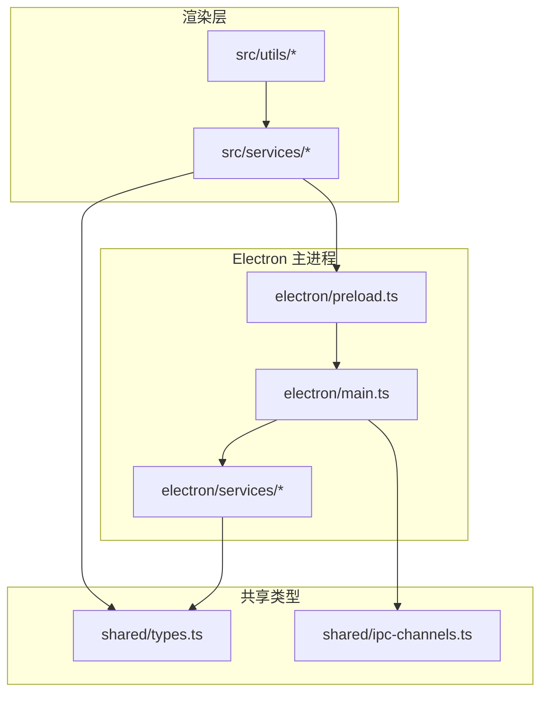
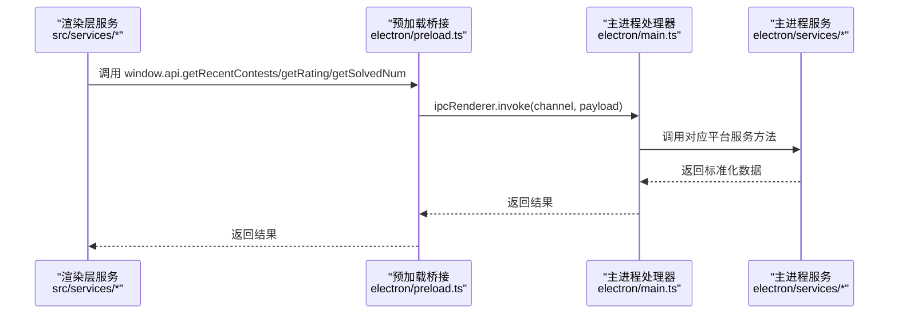
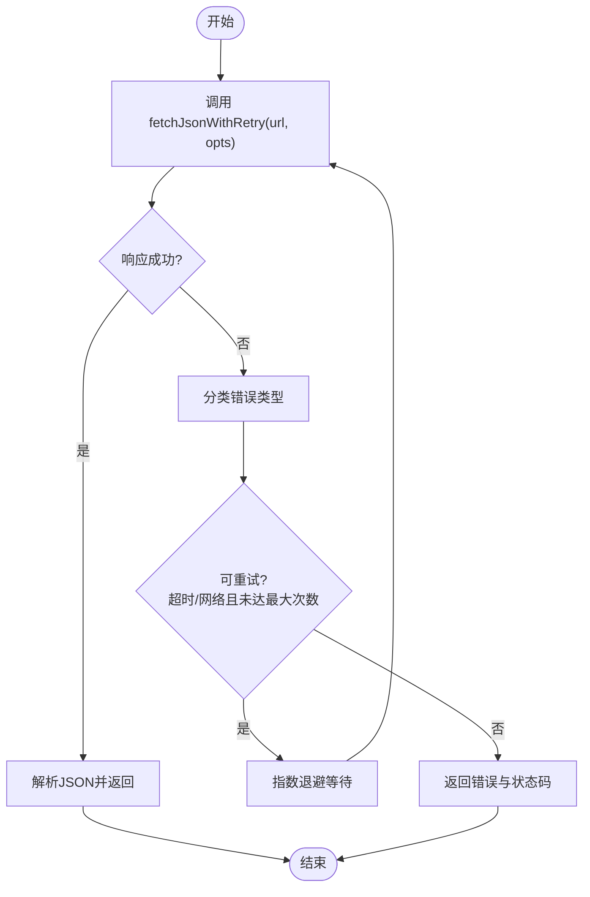
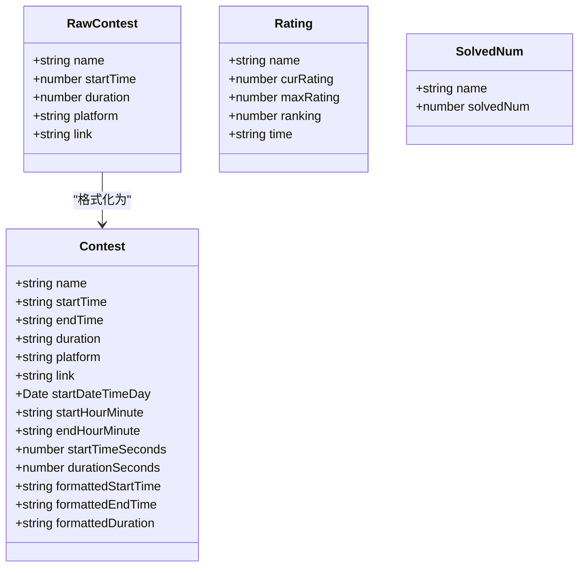
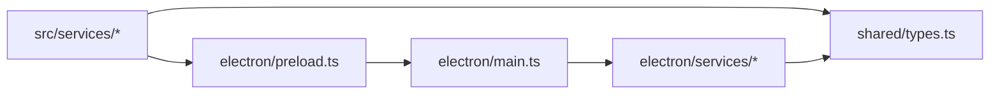

# 外部API集成

<cite>
**本文引用的文件**
- [src/services/contest.ts](file://src/services/contest.ts)
- [src/services/rating.ts](file://src/services/rating.ts)
- [src/services/solved.ts](file://src/services/solved.ts)
- [electron/services/contest.ts](file://electron/services/contest.ts)
- [electron/services/rating.ts](file://electron/services/rating.ts)
- [electron/services/solvedNum.ts](file://electron/services/solvedNum.ts)
- [electron/main.ts](file://electron/main.ts)
- [electron/preload.ts](file://electron/preload.ts)
- [shared/types.ts](file://shared/types.ts)
- [shared/ipc-channels.ts](file://shared/ipc-channels.ts)
- [electron/app.config.json](file://electron/app.config.json)
- [src/utils/contest_utils.ts](file://src/utils/contest_utils.ts)
</cite>

## 目录
1. [简介](#简介)
2. [项目结构](#项目结构)
3. [核心组件](#核心组件)
4. [架构总览](#架构总览)
5. [详细组件分析](#详细组件分析)
6. [依赖关系分析](#依赖关系分析)
7. [性能考量](#性能考量)
8. [故障排查指南](#故障排查指南)
9. [结论](#结论)
10. [附录](#附录)

## 简介
本文件系统性梳理本项目的外部API集成方案，覆盖主流算法竞赛平台（Codeforces、AtCoder、LeetCode、洛谷、蓝桥云课、牛客等）的数据获取策略与封装机制；解释请求头设置、认证方式、速率限制与错误重试策略；阐述数据缓存机制（策略、过期时间与失效处理）；提供调试工具与监控方案（请求日志、性能分析与异常告警）；并给出第三方服务适配指南与扩展新平台的方法。

## 项目结构
项目采用前端渲染层 + Electron 主进程 + IPC 通信的架构。渲染层通过服务类调用 window.api，主进程通过 IPC 暴露接口，实际网络请求在主进程侧完成，并使用 axios/cheerio 等库解析数据。

**图表来源**
- [electron/main.ts:396-466](file://electron/main.ts#L396-L466)
- [electron/preload.ts:1-38](file://electron/preload.ts#L1-L38)
- [shared/types.ts:1-67](file://shared/types.ts#L1-L67)
- [shared/ipc-channels.ts:1-53](file://shared/ipc-channels.ts#L1-L53)

**章节来源**
- [electron/main.ts:357-385](file://electron/main.ts#L357-L385)
- [electron/preload.ts:1-38](file://electron/preload.ts#L1-L38)
- [shared/ipc-channels.ts:1-53](file://shared/ipc-channels.ts#L1-L53)

## 核心组件
- 渲染层服务：封装对 window.api 的调用，负责参数校验与错误捕获，返回统一格式的数据。
- 主进程服务：实现各平台 API 的具体抓取逻辑，包含请求头设置、HTML 解析、GraphQL 查询等。
- IPC 桥接：通过 preload 暴露受控 API，main.ts 注册 IPC 处理器，完成跨进程调用。
- 类型定义：统一 RawContest、Contest、Rating、SolvedNum 等数据模型与平台枚举。
- 配置中心：app.config.json 提供爬取天数等运行参数。

**章节来源**
- [src/services/contest.ts:1-35](file://src/services/contest.ts#L1-L35)
- [src/services/rating.ts:1-8](file://src/services/rating.ts#L1-L8)
- [src/services/solved.ts:1-8](file://src/services/solved.ts#L1-L8)
- [electron/services/contest.ts:1-270](file://electron/services/contest.ts#L1-L270)
- [electron/services/rating.ts:1-175](file://electron/services/rating.ts#L1-L175)
- [electron/services/solvedNum.ts:1-198](file://electron/services/solvedNum.ts#L1-L198)
- [shared/types.ts:1-67](file://shared/types.ts#L1-L67)
- [electron/app.config.json:1-62](file://electron/app.config.json#L1-L62)

## 架构总览
渲染层通过服务类发起请求，经由 preload 的 contextBridge 暴露的 window.api 调用 IPC；主进程在 ipcMain.handle 中执行业务逻辑，调用对应的服务模块抓取数据并返回给渲染层。

**图表来源**
- [electron/preload.ts:5-20](file://electron/preload.ts#L5-L20)
- [electron/main.ts:396-466](file://electron/main.ts#L396-L466)
- [electron/services/contest.ts:255-266](file://electron/services/contest.ts#L255-L266)
- [electron/services/rating.ts:156-171](file://electron/services/rating.ts#L156-L171)
- [electron/services/solvedNum.ts:166-194](file://electron/services/solvedNum.ts#L166-L194)

## 详细组件分析

### 平台数据获取策略与封装
- Codeforces
  - 比赛列表：调用官方 API 获取未包含“Gym”比赛，按结束时间排序，筛选有效区间。
  - 实力值/题数：通过第三方聚合或官方 API 获取用户信息。
- AtCoder
  - 比赛列表：解析 HTML 表格，提取时间、标题、链接与持续时间。
  - 实力值：解析用户页表格中的当前/最高分。
- LeetCode
  - 比赛列表：GraphQL 查询 upcoming contests，构造链接。
  - 实力值：GraphQL 查询用户历史评分，取最新与最大值。
- 洛谷
  - 比赛列表：请求列表页 JSON，过滤是否 rated，构造链接。
  - 实力值/题数：搜索用户 ID 后查询评分记录或用户主页统计。
- 蓝桥云课
  - 比赛列表：调用其公开 API，解析 open/end 时间计算持续时间。
- 牛客
  - 比赛列表：解析首页列表页，提取时间与链接。
  - 实力值/题数：调用其公开接口或解析页面统计。

上述流程均在主进程服务中实现，渲染层仅负责调用与展示。

**章节来源**
- [electron/services/contest.ts:48-120](file://electron/services/contest.ts#L48-L120)
- [electron/services/contest.ts:122-196](file://electron/services/contest.ts#L122-L196)
- [electron/services/contest.ts:198-253](file://electron/services/contest.ts#L198-L253)
- [electron/services/rating.ts:12-29](file://electron/services/rating.ts#L12-L29)
- [electron/services/rating.ts:31-53](file://electron/services/rating.ts#L31-L53)
- [electron/services/rating.ts:55-101](file://electron/services/rating.ts#L55-L101)
- [electron/services/rating.ts:103-133](file://electron/services/rating.ts#L103-L133)
- [electron/services/rating.ts:135-154](file://electron/services/rating.ts#L135-L154)
- [electron/services/solvedNum.ts:14-21](file://electron/services/solvedNum.ts#L14-L21)
- [electron/services/solvedNum.ts:23-53](file://electron/services/solvedNum.ts#L23-L53)
- [electron/services/solvedNum.ts:55-85](file://electron/services/solvedNum.ts#L55-L85)
- [electron/services/solvedNum.ts:87-120](file://electron/services/solvedNum.ts#L87-L120)
- [electron/services/solvedNum.ts:122-126](file://electron/services/solvedNum.ts#L122-L126)
- [electron/services/solvedNum.ts:128-144](file://electron/services/solvedNum.ts#L128-L144)
- [electron/services/solvedNum.ts:146-153](file://electron/services/solvedNum.ts#L146-L153)
- [electron/services/solvedNum.ts:155-164](file://electron/services/solvedNum.ts#L155-L164)

### 请求头设置与认证方式
- 通用请求头
  - axios 默认实例设置了通用 User-Agent，用于规避部分站点的简单 UA 校验。
  - 对需要 AJAX 的站点（如洛谷），显式添加了 X-Requested-With: XMLHttpRequest。
- 认证与鉴权
  - 当前实现未见显式的 Cookie、Token 或 OAuth 认证流程，主要依赖公开 API 与 HTML 解析。
  - 若未来接入需鉴权的平台，可在 axios 实例中统一注入 Authorization 或 Cookie。

**章节来源**
- [electron/services/solvedNum.ts:8-12](file://electron/services/solvedNum.ts#L8-L12)
- [electron/services/contest.ts:200-202](file://electron/services/contest.ts#L200-L202)
- [electron/services/rating.ts:106-115](file://electron/services/rating.ts#L106-L115)

### 速率限制与并发控制
- 并发策略
  - 获取所有平台的比赛列表时，使用 Promise.all 并行抓取，提升整体吞吐。
- 速率限制
  - 代码中未实现显式的速率限制（如每秒请求数、队列限流）。
  - 建议在新增平台或高 QPS 场景下引入节流/令牌桶或平台级限速配置。

**章节来源**
- [electron/services/contest.ts:255-266](file://electron/services/contest.ts#L255-L266)

### 错误重试与超时策略
- 超时与重试
  - 主进程内置 fetchWithTimeout 与 fetchJsonWithRetry，支持超时、网络/超时错误自动重试、指数退避。
  - 更新检查与下载流程复用该机制，具备分类错误类型（超时/网络/未知）与日志输出。
- 平台服务错误处理
  - 各平台服务在请求失败时记录错误并返回默认值或抛出异常，便于上层统一处理。

**图表来源**
- [electron/main.ts:176-225](file://electron/main.ts#L176-L225)
- [electron/main.ts:122-144](file://electron/main.ts#L122-L144)
- [electron/main.ts:146-167](file://electron/main.ts#L146-L167)

**章节来源**
- [electron/main.ts:176-225](file://electron/main.ts#L176-L225)
- [electron/main.ts:122-144](file://electron/main.ts#L122-L144)
- [electron/main.ts:146-167](file://electron/main.ts#L146-L167)
- [electron/services/contest.ts:81-84](file://electron/services/contest.ts#L81-L84)
- [electron/services/rating.ts:24-28](file://electron/services/rating.ts#L24-L28)
- [electron/services/solvedNum.ts:20-21](file://electron/services/solvedNum.ts#L20-L21)

### 数据缓存机制
- 缓存策略
  - 代码中未发现显式缓存实现（内存/磁盘/数据库）。
- 过期时间与失效
  - 未设置 TTL 或失效策略。
- 建议
  - 可基于平台与数据类型设计 LRU/Redis 缓存，结合 app.config.json 的缓存开关与 TTL 参数。
  - 对高频读取的用户信息（如 rating/solvedNum）建议短期缓存（如 5-10 分钟）。

**章节来源**
- [electron/app.config.json:1-62](file://electron/app.config.json#L1-L62)

### 数据模型与格式化
- RawContest/Contest：统一原始与格式化后的比赛数据结构，包含时间戳、持续时间、平台标识与链接。
- Rating/SolvedNum：统一用户实力值与做题数量的数据结构。
- 时间格式化：使用日期工具函数进行本地化格式化与显示。

**图表来源**
- [shared/types.ts:1-67](file://shared/types.ts#L1-L67)
- [src/utils/contest_utils.ts:4-43](file://src/utils/contest_utils.ts#L4-L43)

**章节来源**
- [shared/types.ts:1-67](file://shared/types.ts#L1-L67)
- [src/utils/contest_utils.ts:4-43](file://src/utils/contest_utils.ts#L4-L43)

### IPC 通道与安全
- 通道定义：GET_CONTESTS、GET_RATING、GET_SOLVED_NUM、OPEN_URL、UPDATER_INSTALL 等。
- 安全校验：主进程对 URL 协议进行白名单校验（仅允许 http/https），防止任意协议执行。
- 参数校验：对平台名与用户名长度进行限制，避免异常输入。

**章节来源**
- [shared/ipc-channels.ts:1-53](file://shared/ipc-channels.ts#L1-L53)
- [electron/main.ts:452-458](file://electron/main.ts#L452-L458)
- [electron/main.ts:414-431](file://electron/main.ts#L414-L431)
- [electron/main.ts:433-450](file://electron/main.ts#L433-L450)

### 调试工具与监控方案
- 日志记录
  - 各平台服务在异常时输出平台特定错误日志。
  - 更新检查与下载流程记录分类错误类型与状态码。
- 性能分析
  - 可在服务层埋点记录请求耗时与并发数，结合 Electron DevTools 进行分析。
- 异常告警
  - 建议引入集中式日志（如 Sentry）与错误上报，结合分类错误类型进行分级告警。

**章节来源**
- [electron/services/contest.ts:81-84](file://electron/services/contest.ts#L81-L84)
- [electron/services/rating.ts:24-28](file://electron/services/rating.ts#L24-L28)
- [electron/main.ts:195-202](file://electron/main.ts#L195-L202)
- [electron/main.ts:205-222](file://electron/main.ts#L205-L222)

### 第三方服务适配指南与扩展新平台
- 适配步骤
  - 在 shared/types.ts 中补充新的平台枚举与数据模型。
  - 在 electron/services/* 新增对应服务类，实现 getXXX 方法。
  - 在 preload.ts 中暴露 window.api.xxx 接口。
  - 在 main.ts 的 ipcMain.handle 中注册对应通道处理器。
  - 在 src/services/* 中封装渲染层调用。
- 扩展要点
  - 统一错误处理与默认返回值。
  - 显式设置必要的请求头（如 X-Requested-With）。
  - 如涉及登录态，考虑在 axios 实例中注入 Cookie/Token。
  - 评估并发与限速，必要时引入队列与退避。

**章节来源**
- [shared/types.ts:41-67](file://shared/types.ts#L41-L67)
- [electron/preload.ts:5-20](file://electron/preload.ts#L5-L20)
- [electron/main.ts:396-466](file://electron/main.ts#L396-L466)
- [src/services/contest.ts:1-35](file://src/services/contest.ts#L1-L35)
- [src/services/rating.ts:1-8](file://src/services/rating.ts#L1-L8)
- [src/services/solved.ts:1-8](file://src/services/solved.ts#L1-L8)

## 依赖关系分析
- 渲染层依赖 preload 暴露的 window.api，再由主进程 ipcMain.handle 转发到具体服务。
- 主进程服务依赖 axios 与 cheerio，分别用于 HTTP 请求与 HTML 解析。
- 类型定义贯穿前后端，确保数据一致性。

**图表来源**
- [electron/preload.ts:1-38](file://electron/preload.ts#L1-L38)
- [electron/main.ts:396-466](file://electron/main.ts#L396-L466)
- [electron/services/contest.ts:1-270](file://electron/services/contest.ts#L1-L270)
- [shared/types.ts:1-67](file://shared/types.ts#L1-L67)

**章节来源**
- [electron/preload.ts:1-38](file://electron/preload.ts#L1-L38)
- [electron/main.ts:396-466](file://electron/main.ts#L396-L466)
- [electron/services/contest.ts:1-270](file://electron/services/contest.ts#L1-L270)
- [shared/types.ts:1-67](file://shared/types.ts#L1-L67)

## 性能考量
- 并发抓取：使用 Promise.all 并行拉取多平台数据，缩短总等待时间。
- 超时与重试：对不稳定网络环境提供自动重试与退避，提升成功率。
- 建议优化
  - 引入平台级限速与全局队列，避免触发目标站点的反爬策略。
  - 对热点数据增加短期缓存，降低重复请求。
  - 使用连接池与 keep-alive，减少握手开销。

[本节为通用建议，不直接分析具体文件]

## 故障排查指南
- 常见问题定位
  - 网络错误：查看分类错误类型（超时/网络/未知），确认代理与 DNS 设置。
  - 平台页面变更：HTML 结构变化导致解析失败，需更新选择器与字段映射。
  - 参数非法：平台名或用户名长度超限，检查调用方传参。
- 日志与诊断
  - 查看主进程控制台输出的平台错误日志与更新流程日志。
  - 在服务层增加请求耗时埋点，定位慢请求与失败点。
- 快速修复
  - 对于 GraphQL/REST 接口变更，优先核对请求体与字段映射。
  - 对于需要 AJAX 的站点，确保 X-Requested-With 请求头正确设置。

**章节来源**
- [electron/main.ts:146-167](file://electron/main.ts#L146-L167)
- [electron/main.ts:414-431](file://electron/main.ts#L414-L431)
- [electron/services/contest.ts:81-84](file://electron/services/contest.ts#L81-L84)
- [electron/services/rating.ts:24-28](file://electron/services/rating.ts#L24-L28)

## 结论
本项目通过清晰的 IPC 分层与平台服务抽象，实现了对多家竞赛平台的统一数据获取。现有实现具备良好的并发与错误恢复能力，但在缓存、速率限制与鉴权方面仍有优化空间。建议后续引入缓存层、限速与统一认证机制，并完善监控与告警体系，以支撑更复杂的生产场景。

[本节为总结性内容，不直接分析具体文件]

## 附录
- 关键路径参考
  - 比赛列表获取：[electron/services/contest.ts:255-266](file://electron/services/contest.ts#L255-L266)
  - 力值查询：[electron/services/rating.ts:156-171](file://electron/services/rating.ts#L156-L171)
  - 做题数查询：[electron/services/solvedNum.ts:166-194](file://electron/services/solvedNum.ts#L166-L194)
  - IPC 注册：[electron/main.ts:396-466](file://electron/main.ts#L396-L466)
  - 类型定义：[shared/types.ts:1-67](file://shared/types.ts#L1-L67)

[本节为索引性内容，不直接分析具体文件]