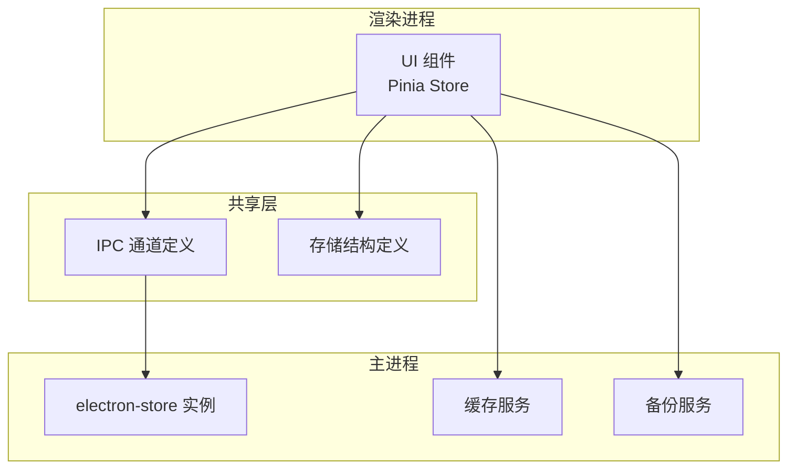
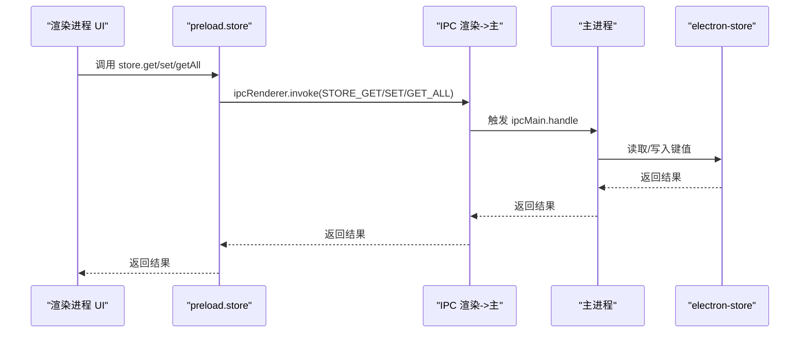
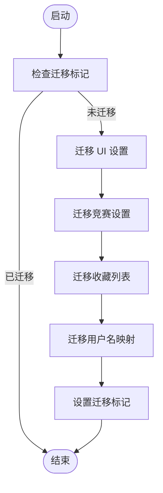
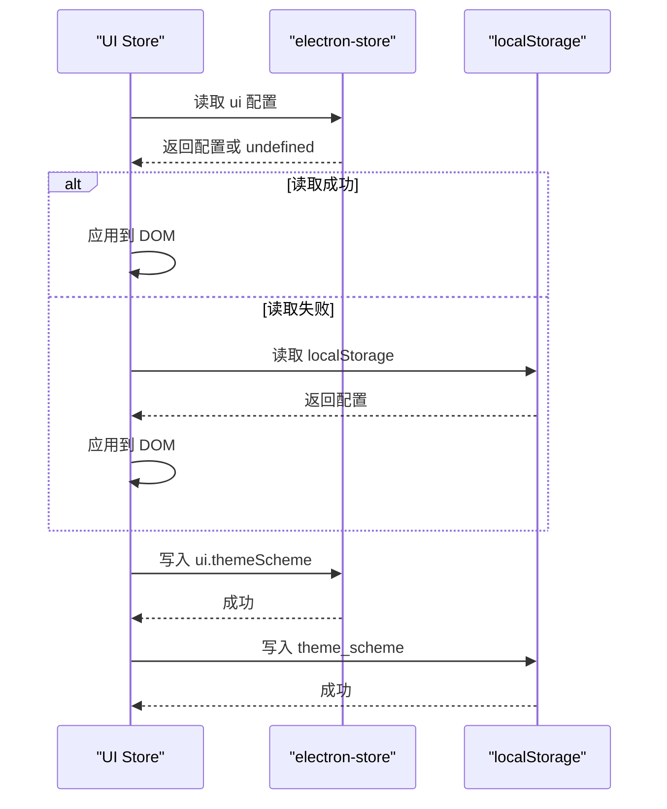
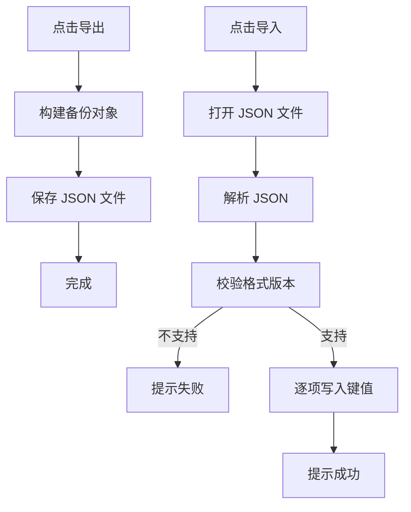
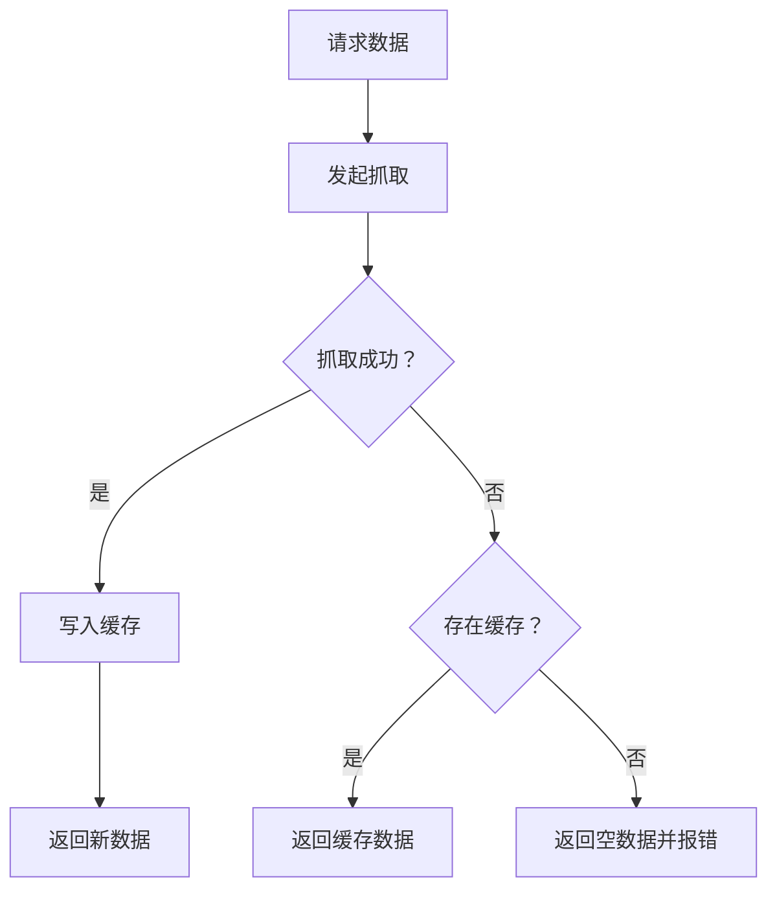
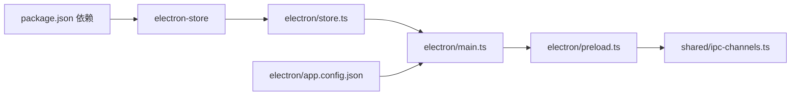

# 数据持久化

<cite>
**本文引用的文件**
- [electron/store.ts](file://electron/store.ts)
- [shared/store-schema.ts](file://shared/store-schema.ts)
- [src/utils/migrate-storage.ts](file://src/utils/migrate-storage.ts)
- [electron/main.ts](file://electron/main.ts)
- [electron/preload.ts](file://electron/preload.ts)
- [shared/ipc-channels.ts](file://shared/ipc-channels.ts)
- [src/stores/contest.ts](file://src/stores/contest.ts)
- [src/stores/ui.ts](file://src/stores/ui.ts)
- [electron/app.config.json](file://electron/app.config.json)
- [package.json](file://package.json)
- [docs/NEW_FEATURES_PLAN.md](file://docs/NEW_FEATURES_PLAN.md)
- [docs/UX_OPTIMIZATION_PLAN.md](file://docs/UX_OPTIMIZATION_PLAN.md)
</cite>

## 目录
1. [简介](#简介)
2. [项目结构](#项目结构)
3. [核心组件](#核心组件)
4. [架构总览](#架构总览)
5. [详细组件分析](#详细组件分析)
6. [依赖关系分析](#依赖关系分析)
7. [性能考量](#性能考量)
8. [故障排查指南](#故障排查指南)
9. [结论](#结论)
10. [附录](#附录)

## 简介
本文件围绕项目的“数据持久化”能力进行系统化梳理，重点涵盖以下方面：
- electron-store 的使用与配置：键值对管理、默认值与类型约束、数据结构设计
- 数据迁移机制：从 localStorage 到 electron-store 的一次性迁移、版本兼容与回滚策略
- 状态管理与本地存储同步：Pinia Store 与 electron-store 的双向绑定、变更监听与冲突处理
- 备份与恢复：手动导出/导入方案的设计思路与实现要点
- 性能优化与存储空间管理：缓存策略、TTL 设计、离线降级与存储清理

## 项目结构
项目采用“主进程 + 渲染进程 + 共享层”的三层架构，数据持久化主要由主进程中的 electron-store 提供，渲染进程通过 IPC 与主进程交互完成读写。

图表来源
- [electron/main.ts:25-25](file://electron/main.ts#L25-L25)
- [electron/preload.ts:1-38](file://electron/preload.ts#L1-L38)
- [shared/ipc-channels.ts:3-14](file://shared/ipc-channels.ts#L3-L14)
- [shared/store-schema.ts:1-55](file://shared/store-schema.ts#L1-L55)

章节来源
- [electron/main.ts:25-25](file://electron/main.ts#L25-L25)
- [electron/preload.ts:1-38](file://electron/preload.ts#L1-L38)
- [shared/ipc-channels.ts:3-14](file://shared/ipc-channels.ts#L3-L14)
- [shared/store-schema.ts:1-55](file://shared/store-schema.ts#L1-L55)

## 核心组件
- electron-store 实例：集中管理应用配置、收藏、用户名、缓存等键值数据
- 存储结构定义：通过 TypeScript 接口约束数据结构与类型，确保一致性
- 迁移工具：从旧版 localStorage 向 electron-store 的一次性迁移
- IPC 通道：提供安全的读写接口，避免直接暴露 Node API
- Pinia Store：UI 与竞赛相关状态的本地持久化与跨页面同步
- 缓存服务：基于 TTL 的离线降级与性能优化
- 备份服务：导出/导入的扩展方案（设计文档）

章节来源
- [electron/store.ts:1-31](file://electron/store.ts#L1-L31)
- [shared/store-schema.ts:1-55](file://shared/store-schema.ts#L1-L55)
- [src/utils/migrate-storage.ts:1-64](file://src/utils/migrate-storage.ts#L1-L64)
- [electron/main.ts:468-485](file://electron/main.ts#L468-L485)
- [electron/preload.ts:22-31](file://electron/preload.ts#L22-L31)
- [src/stores/contest.ts:1-307](file://src/stores/contest.ts#L1-L307)
- [src/stores/ui.ts:1-96](file://src/stores/ui.ts#L1-L96)
- [docs/UX_OPTIMIZATION_PLAN.md:667-795](file://docs/UX_OPTIMIZATION_PLAN.md#L667-L795)
- [docs/NEW_FEATURES_PLAN.md:1094-1311](file://docs/NEW_FEATURES_PLAN.md#L1094-L1311)

## 架构总览
渲染进程通过 preload 暴露的 store API 调用 IPC 通道，主进程的 electron-store 负责实际存储；Pinia Store 在渲染进程中负责状态管理，并与 electron-store 双向同步。

图表来源
- [electron/preload.ts:22-31](file://electron/preload.ts#L22-L31)
- [shared/ipc-channels.ts:10-14](file://shared/ipc-channels.ts#L10-L14)
- [electron/main.ts:468-485](file://electron/main.ts#L468-L485)

## 详细组件分析

### electron-store 使用与配置
- 默认值与命名
  - 默认配置通过 defaults 对象集中定义，键名遵循层级结构，便于按模块读取
  - 实例名称统一为固定标识，保证同一应用内唯一性
- 类型约束
  - 使用 TypeScript 接口约束存储结构，确保键值类型一致
  - 内部迁移标记键用于控制一次性迁移逻辑
- 键值管理
  - UI 偏好、竞赛设置、收藏、用户名、缓存等均以键路径形式组织
  - 支持嵌套对象与数组，便于模块化管理

章节来源
- [electron/store.ts:4-30](file://electron/store.ts#L4-L30)
- [shared/store-schema.ts:1-55](file://shared/store-schema.ts#L1-L55)

### 存储结构与数据类型约束
- 结构概览
  - ui：主题方案、颜色模式、语言
  - contest：最大抓取天数、隐藏日期、平台选择集合
  - favorites：收藏条目数组，包含平台、名称、时间戳等
  - usernames：平台到用户名的映射
  - cache：离线缓存，包含比赛、评分、做题数等
  - 内部字段：迁移标记
- 类型约束
  - 使用字面量联合类型限定枚举值
  - 数组与对象通过泛型约束元素结构
  - 时间戳与数值范围通过业务逻辑约束

章节来源
- [shared/store-schema.ts:1-55](file://shared/store-schema.ts#L1-L55)

### 数据迁移机制
- 迁移触发条件
  - 仅在首次启动时执行，通过内部迁移标记键判断是否已完成
- 迁移范围
  - UI 设置：主题方案、颜色模式、语言
  - 竞赛设置：最大抓取天数、隐藏日期
  - 收藏列表：解析并写入 favorites
  - 用户名映射：遍历平台列表，写入 usernames
- 容错与回退
  - 解析失败或网络异常不会阻断启动，失败后下次启动会重试
  - 写入失败时保持幂等，避免重复迁移

图表来源
- [src/utils/migrate-storage.ts:1-64](file://src/utils/migrate-storage.ts#L1-L64)

章节来源
- [src/utils/migrate-storage.ts:1-64](file://src/utils/migrate-storage.ts#L1-L64)

### 状态管理与本地存储同步
- UI Store 同步
  - 初始化时优先从 electron-store 读取，失败则回退到 localStorage
  - 修改主题与颜色模式时同时写入 electron-store 和 localStorage
- 竞赛 Store 同步
  - 初始化时从 electron-store 读取竞赛配置与收藏列表
  - 修改最大抓取天数、隐藏日期、平台选择时同步写入
  - 收藏增删改操作同时写入 localStorage 与 electron-store，失败时回滚内存状态
- 冲突处理
  - 写入失败时抛出异常并回滚内存状态，保证一致性
  - 异步写入失败不影响主流程，采用 fire-and-forget 方式

图表来源
- [src/stores/ui.ts:26-52](file://src/stores/ui.ts#L26-L52)
- [src/stores/ui.ts:60-93](file://src/stores/ui.ts#L60-L93)

章节来源
- [src/stores/ui.ts:1-96](file://src/stores/ui.ts#L1-L96)
- [src/stores/contest.ts:102-140](file://src/stores/contest.ts#L102-L140)
- [src/stores/contest.ts:141-190](file://src/stores/contest.ts#L141-L190)

### 备份与恢复方案
- 设计目标
  - 支持导出应用设置、收藏、用户名、题解等关键数据
  - 通过版本号保证未来兼容性
- 导出流程
  - 生成备份文件，包含格式版本、应用版本、导出时间与各模块数据
  - 询问用户保存路径并写入 JSON 文件
- 导入流程
  - 校验格式版本，逐项写入对应键
  - 成功导入后提示用户导入结果
- 扩展点
  - 当前为设计文档，后续可在主进程中实现 IPC 通道与服务类

图表来源
- [docs/NEW_FEATURES_PLAN.md:1141-1248](file://docs/NEW_FEATURES_PLAN.md#L1141-L1248)

章节来源
- [docs/NEW_FEATURES_PLAN.md:1094-1311](file://docs/NEW_FEATURES_PLAN.md#L1094-L1311)

### 缓存与离线降级
- 缓存策略
  - 比赛列表：2 小时 TTL
  - 评分：6 小时 TTL
  - 做题统计：12 小时 TTL
- 降级逻辑
  - 请求失败时返回缓存数据（带标志位 fromCache）
  - 缓存过期仍可作为降级数据返回
- IPC 集成
  - 主进程在成功抓取后写入缓存
  - 失败时尝试返回缓存，无缓存则返回空数据并提示错误

图表来源
- [docs/UX_OPTIMIZATION_PLAN.md:637-795](file://docs/UX_OPTIMIZATION_PLAN.md#L637-L795)

章节来源
- [docs/UX_OPTIMIZATION_PLAN.md:667-795](file://docs/UX_OPTIMIZATION_PLAN.md#L667-L795)

## 依赖关系分析
- electron-store 版本
  - 项目依赖 electron-store ^8.1.0，具备默认值、类型约束与自动序列化等特性
- IPC 通道
  - 渲染进程通过 preload 暴露的 store API 调用主进程的 ipcMain.handle
- 配置来源
  - 应用配置来自 app.config.json，影响默认值与 UI 行为

图表来源
- [package.json:65-65](file://package.json#L65-L65)
- [electron/store.ts:1-1](file://electron/store.ts#L1-L1)
- [electron/main.ts:25-25](file://electron/main.ts#L25-L25)
- [electron/preload.ts:1-38](file://electron/preload.ts#L1-L38)
- [shared/ipc-channels.ts:3-14](file://shared/ipc-channels.ts#L3-L14)
- [electron/app.config.json:1-62](file://electron/app.config.json#L1-L62)

章节来源
- [package.json:58-72](file://package.json#L58-L72)
- [electron/store.ts:1-31](file://electron/store.ts#L1-L31)
- [electron/main.ts:25-25](file://electron/main.ts#L25-L25)
- [electron/preload.ts:1-38](file://electron/preload.ts#L1-L38)
- [shared/ipc-channels.ts:3-14](file://shared/ipc-channels.ts#L3-L14)
- [electron/app.config.json:1-62](file://electron/app.config.json#L1-L62)

## 性能考量
- 读写分离与异步写入
  - 写入 electron-store 采用异步 fire-and-forget，避免阻塞主线程
- 缓存 TTL 与降级
  - 通过 TTL 控制缓存新鲜度，失败时快速返回缓存，提升用户体验
- 存储空间管理
  - 提供清理缓存入口，减少磁盘占用
  - 备份导出支持用户自管数据体积

章节来源
- [src/stores/contest.ts:152-156](file://src/stores/contest.ts#L152-L156)
- [src/stores/contest.ts:170-172](file://src/stores/contest.ts#L170-L172)
- [docs/UX_OPTIMIZATION_PLAN.md:685-747](file://docs/UX_OPTIMIZATION_PLAN.md#L685-L747)

## 故障排查指南
- 迁移失败
  - 现象：启动后配置未生效
  - 排查：确认迁移标记键是否存在；检查 localStorage 数据格式；查看控制台错误
  - 处理：等待下次启动重试，或手动删除迁移标记键重新迁移
- 写入失败
  - 现象：修改设置后重启丢失
  - 排查：检查 electron-store 文件权限与磁盘空间；确认 IPC 通道是否正常
  - 处理：回滚内存状态；必要时切换到 localStorage 作为临时回退
- 缓存异常
  - 现象：显示旧数据或无数据
  - 排查：检查缓存键是否存在；验证 TTL 是否过期；确认主进程缓存写入逻辑
  - 处理：清空缓存后重试；在网络恢复后自动刷新

章节来源
- [src/utils/migrate-storage.ts:59-62](file://src/utils/migrate-storage.ts#L59-L62)
- [src/stores/contest.ts:142-151](file://src/stores/contest.ts#L142-L151)
- [docs/UX_OPTIMIZATION_PLAN.md:743-747](file://docs/UX_OPTIMIZATION_PLAN.md#L743-L747)

## 结论
本项目通过 electron-store 提供稳定的数据持久化能力，结合 Pinia Store 实现状态与存储的双向同步，并辅以缓存与离线降级策略提升性能与可靠性。迁移机制确保从旧版本平滑过渡，备份与恢复方案为未来扩展预留了清晰路径。建议在后续迭代中完善备份服务的主进程实现与 IPC 通道，并持续监控存储空间与性能表现。

## 附录
- 关键配置参考
  - 应用配置：默认抓取天数、最小/最大天数、主题默认值等
  - IPC 通道：store-get、store-set、store-get-all
  - 存储结构：ui、contest、favorites、usernames、cache、内部迁移标记

章节来源
- [electron/app.config.json:1-62](file://electron/app.config.json#L1-L62)
- [shared/ipc-channels.ts:10-14](file://shared/ipc-channels.ts#L10-L14)
- [shared/store-schema.ts:1-55](file://shared/store-schema.ts#L1-L55)