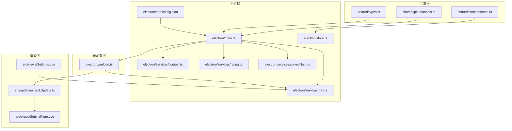
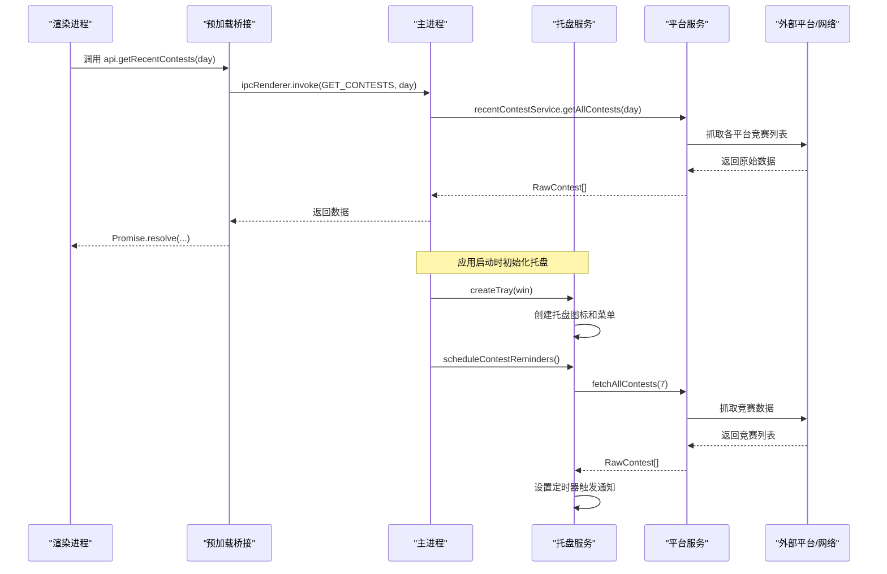
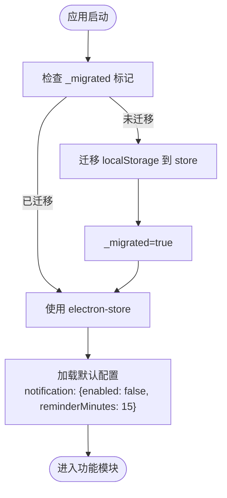
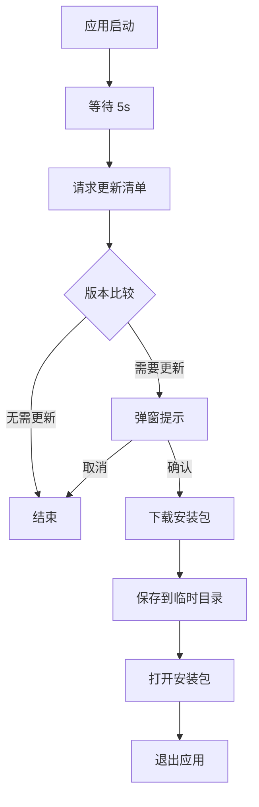
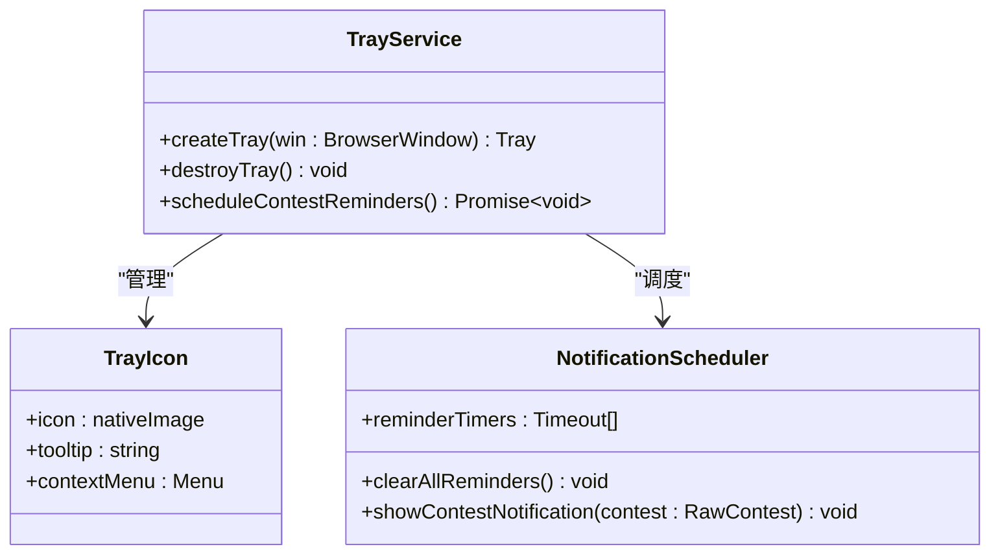
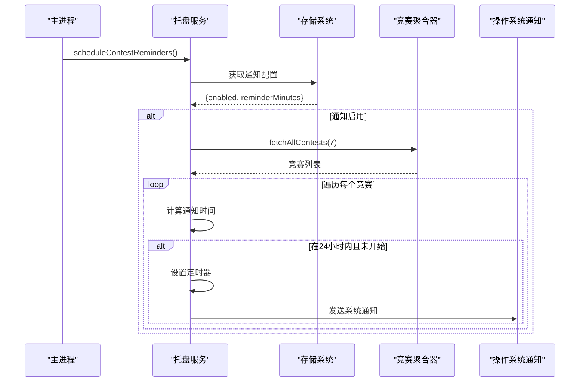
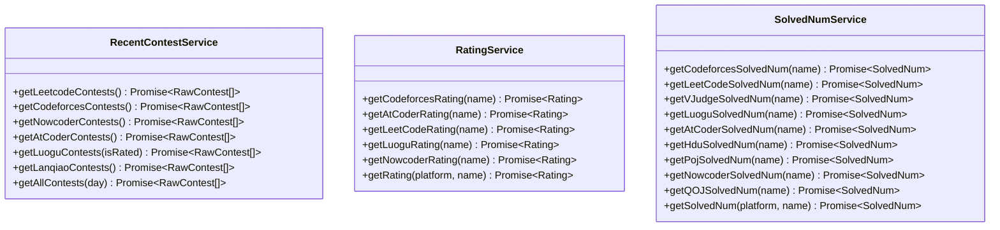
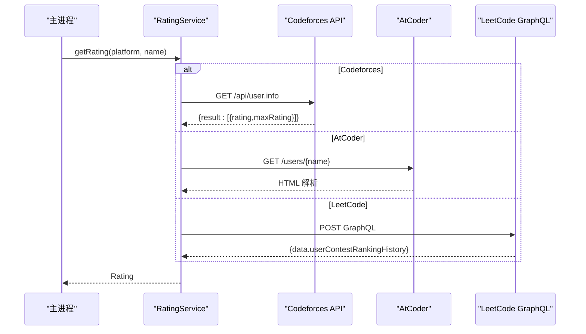
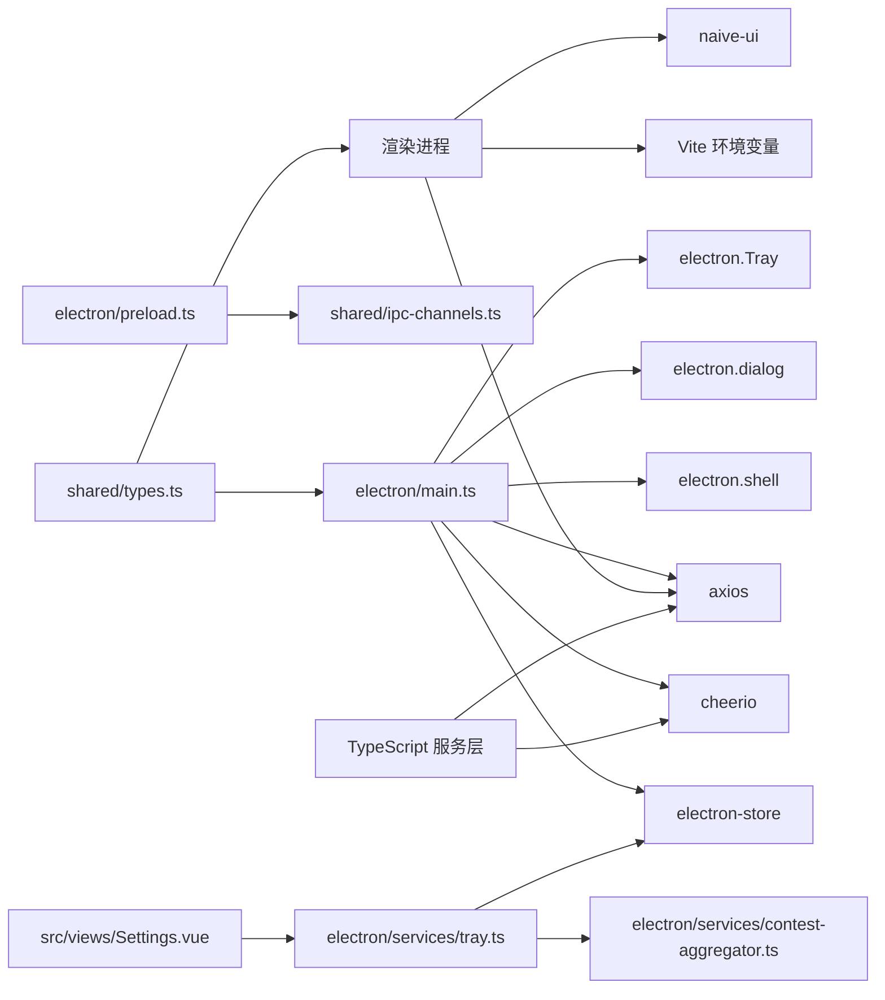

# 系统集成

<cite>
**本文引用的文件**
- [shared/ipc-channels.ts](file://shared/ipc-channels.ts)
- [electron/main.ts](file://electron/main.ts)
- [electron/preload.ts](file://electron/preload.ts)
- [electron/store.ts](file://electron/store.ts)
- [shared/store-schema.ts](file://shared/store-schema.ts)
- [src/utils/migrate-storage.ts](file://src/utils/migrate-storage.ts)
- [src/updater/checkUpdate.ts](file://src/updater/checkUpdate.ts)
- [docs/updater.md](file://docs/updater.md)
- [electron/services/contest.ts](file://electron/services/contest.ts)
- [electron/services/rating.ts](file://electron/services/rating.ts)
- [electron/services/solvedNum.ts](file://electron/services/solvedNum.ts)
- [shared/types.ts](file://shared/types.ts)
- [electron/app.config.json](file://electron/app.config.json)
- [package.json](file://package.json)
- [vite.config.ts](file://vite.config.ts)
- [src/views/SettingPage.vue](file://src/views/SettingPage.vue)
- [electron/services/tray.ts](file://electron/services/tray.ts)
- [src/views/Settings.vue](file://src/views/Settings.vue)
</cite>

## 更新摘要
**变更内容**
- 新增系统托盘集成服务：添加了完整的托盘图标管理、上下文菜单和通知调度功能
- 增强桌面通知系统：实现基于配置的竞赛提醒通知，支持可定制的提前时间
- 完善应用生命周期集成：托盘服务与主窗口生命周期、应用退出流程深度集成
- 扩展IPC通信能力：新增通知设置和获取的IPC通道，支持实时配置管理

## 目录
1. [简介](#简介)
2. [项目结构](#项目结构)
3. [核心组件](#核心组件)
4. [架构总览](#架构总览)
5. [详细组件分析](#详细组件分析)
6. [依赖关系分析](#依赖关系分析)
7. [性能考量](#性能考量)
8. [故障排查指南](#故障排查指南)
9. [结论](#结论)
10. [附录](#附录)

## 简介
本文件面向系统集成工程师与高级开发者，系统性梳理 OJFlow 的系统集成模块，重点覆盖以下方面：
- IPC 通信机制：通道定义、消息格式、参数校验与错误处理策略
- 数据持久化：electron-store 使用、默认值与模式、迁移机制与配置管理
- 自动更新：版本检查、下载策略、安装与重启流程
- 外部平台 API 集成：数据抓取、缓存策略与错误重试机制
- **新增** 系统托盘集成：托盘图标管理、上下文菜单、桌面通知调度与应用生命周期集成
- **新增** 通知管理系统：基于配置的竞赛提醒、可定制提前时间、OS 系统通知集成
- 最佳实践与性能优化建议

## 项目结构
OJFlow 采用 Electron + Vue 3 的桌面应用架构，系统集成相关的关键目录与文件如下：
- 共享层：IPC 通道与类型定义
- 主进程：IPC 处理器、服务封装、自动更新、存储初始化、托盘管理
- 预加载层：通过 contextBridge 暴露受限 API
- 渲染层：更新检查逻辑、页面交互、通知设置界面
- 工具与文档：存储迁移、更新流程文档
- **新增** 托盘服务：系统托盘集成、通知调度、生命周期管理



**图表来源**
- [shared/ipc-channels.ts:1-68](file://shared/ipc-channels.ts#L1-L68)
- [electron/main.ts:1-557](file://electron/main.ts#L1-L557)
- [electron/preload.ts:1-61](file://electron/preload.ts#L1-L61)
- [electron/store.ts:1-31](file://electron/store.ts#L1-L31)
- [shared/store-schema.ts:1-61](file://shared/store-schema.ts#L1-L61)
- [electron/app.config.json:1-62](file://electron/app.config.json#L1-L62)
- [electron/services/contest.ts:1-292](file://electron/services/contest.ts#L1-L292)
- [electron/services/rating.ts:1-181](file://electron/services/rating.ts#L1-L181)
- [electron/services/solvedNum.ts:1-205](file://electron/services/solvedNum.ts#L1-L205)
- [electron/services/tray.ts:1-133](file://electron/services/tray.ts#L1-L133)
- [src/updater/checkUpdate.ts:1-311](file://src/updater/checkUpdate.ts#L1-L311)
- [src/views/SettingPage.vue:1-116](file://src/views/SettingPage.vue#L1-L116)
- [src/views/Settings.vue:1-566](file://src/views/Settings.vue#L1-L566)

**章节来源**
- [shared/ipc-channels.ts:1-68](file://shared/ipc-channels.ts#L1-L68)
- [electron/main.ts:1-557](file://electron/main.ts#L1-L557)
- [electron/preload.ts:1-61](file://electron/preload.ts#L1-L61)
- [electron/store.ts:1-31](file://electron/store.ts#L1-L31)
- [shared/store-schema.ts:1-61](file://shared/store-schema.ts#L1-L61)
- [electron/app.config.json:1-62](file://electron/app.config.json#L1-L62)
- [electron/services/contest.ts:1-292](file://electron/services/contest.ts#L1-L292)
- [electron/services/rating.ts:1-181](file://electron/services/rating.ts#L1-L181)
- [electron/services/solvedNum.ts:1-205](file://electron/services/solvedNum.ts#L1-L205)
- [electron/services/tray.ts:1-133](file://electron/services/tray.ts#L1-L133)
- [src/updater/checkUpdate.ts:1-311](file://src/updater/checkUpdate.ts#L1-L311)
- [src/views/SettingPage.vue:1-116](file://src/views/SettingPage.vue#L1-L116)
- [src/views/Settings.vue:1-566](file://src/views/Settings.vue#L1-L566)

## 核心组件
- IPC 通道与类型映射：集中定义通道名称与参数/返回类型，保证主进程与渲染进程契约一致
- 主进程 IPC 处理器：封装服务调用、参数校验、错误分类与日志记录
- 预加载桥接：仅暴露受控 API，避免直接暴露 ipcRenderer
- 存储系统：electron-store 默认值、模式约束与一次性迁移逻辑
- **增强** TypeScript 平台服务：竞赛、评分、做题数等多平台抓取与聚合，提供完整类型定义
- 自动更新：清单检测、超时与重试、下载与安装、对话框提示
- **新增** 系统托盘服务：托盘图标管理、上下文菜单、通知调度与生命周期集成
- **新增** 通知管理系统：基于配置的竞赛提醒、可定制提前时间、OS 系统通知集成

**章节来源**
- [shared/ipc-channels.ts:1-68](file://shared/ipc-channels.ts#L1-L68)
- [electron/main.ts:396-486](file://electron/main.ts#L396-L486)
- [electron/preload.ts:1-61](file://electron/preload.ts#L1-L61)
- [electron/store.ts:1-31](file://electron/store.ts#L1-L31)
- [shared/store-schema.ts:1-61](file://shared/store-schema.ts#L1-L61)
- [electron/services/contest.ts:1-292](file://electron/services/contest.ts#L1-L292)
- [electron/services/rating.ts:1-181](file://electron/services/rating.ts#L1-L181)
- [electron/services/solvedNum.ts:1-205](file://electron/services/solvedNum.ts#L1-L205)
- [src/updater/checkUpdate.ts:1-311](file://src/updater/checkUpdate.ts#L1-L311)
- [electron/services/tray.ts:1-133](file://electron/services/tray.ts#L1-L133)

## 架构总览
系统集成围绕 IPC 与服务层展开，主进程负责与外部平台交互与系统能力（下载、打开链接、对话框），渲染进程通过受控 API 调用主进程能力。新增的托盘服务提供桌面通知和应用生命周期管理。



**图表来源**
- [electron/preload.ts:1-61](file://electron/preload.ts#L1-L61)
- [electron/main.ts:396-412](file://electron/main.ts#L396-L412)
- [electron/services/contest.ts:277-288](file://electron/services/contest.ts#L277-L288)
- [electron/services/tray.ts:18-59](file://electron/services/tray.ts#L18-L59)
- [electron/services/tray.ts:80-114](file://electron/services/tray.ts#L80-L114)

**章节来源**
- [electron/preload.ts:1-61](file://electron/preload.ts#L1-L61)
- [electron/main.ts:396-412](file://electron/main.ts#L396-L412)
- [electron/services/contest.ts:277-288](file://electron/services/contest.ts#L277-L288)
- [electron/services/tray.ts:1-133](file://electron/services/tray.ts#L1-L133)

## 详细组件分析

### IPC 通信机制
- 通道定义：集中于共享层，包含竞赛、评分、做题数查询、打开链接、安装更新、存储读写、**新增通知设置**等通道
- 类型映射：IpcHandlerMap 明确每个通道的参数与返回类型，便于静态校验与 IDE 支持
- 参数校验：主进程处理器对输入进行类型与长度校验，必要时抛出错误
- 错误处理：捕获异常并记录日志，返回空结果或抛出错误供渲染层处理
- 安全策略：打开链接仅允许 http/https 协议，防止任意协议执行
- **新增** 通知IPC：NOTIFICATION_SET 和 NOTIFICATION_GET 通道支持实时通知配置管理

```mermaid
classDiagram
class IPC_CHANNELS {
+GET_CONTESTS
+GET_RATING
+GET_SOLVED_NUM
+OPEN_URL
+UPDATER_INSTALL
+STORE_GET
+STORE_SET
+STORE_GET_ALL
+NOTIFICATION_SET
+NOTIFICATION_GET
}
class IpcHandlerMap {
+GET_CONTESTS(args : [day], return : RawContest[])
+GET_RATING(args : [{platform,name}], return : Rating)
+GET_SOLVED_NUM(args : [{platform,name}], return : SolvedNum)
+OPEN_URL(args : [url], return : void)
+UPDATER_INSTALL(args : [{url}], return : boolean)
+STORE_GET(args : [key], return : unknown)
+STORE_SET(args : [key,value], return : void)
+STORE_GET_ALL(args : [], return : Record<string,unknown>)
+NOTIFICATION_SET(args : [{enabled,reminderMinutes}], return : void)
+NOTIFICATION_GET(args : [], return : {enabled,reminderMinutes})
}
IPC_CHANNELS --> IpcHandlerMap : "键名对应"
```

**图表来源**
- [shared/ipc-channels.ts:3-21](file://shared/ipc-channels.ts#L3-L21)
- [shared/ipc-channels.ts:26-67](file://shared/ipc-channels.ts#L26-L67)

**章节来源**
- [shared/ipc-channels.ts:1-68](file://shared/ipc-channels.ts#L1-L68)
- [electron/main.ts:396-458](file://electron/main.ts#L396-L458)
- [electron/preload.ts:1-61](file://electron/preload.ts#L1-L61)

### 数据持久化与配置管理
- electron-store 初始化：定义默认配置与文件名，提供强类型接口
- 配置模式：通过 store-schema.ts 约束 UI、竞赛、收藏、用户名、缓存、**新增通知配置**等字段
- 一次性迁移：从 localStorage 迁移到 electron-store，标记迁移完成，失败不阻塞启动
- 缓存设计：cache 字段支持离线回退，包含竞赛、评分、做题数的时间戳与数据
- **新增** 通知配置：notification 字段包含 enabled 和 reminderMinutes，默认提醒时间为15分钟



**图表来源**
- [src/utils/migrate-storage.ts:1-63](file://src/utils/migrate-storage.ts#L1-L63)
- [electron/store.ts:1-31](file://electron/store.ts#L1-L31)
- [shared/store-schema.ts:1-61](file://shared/store-schema.ts#L1-L61)

**章节来源**
- [electron/store.ts:1-31](file://electron/store.ts#L1-L31)
- [shared/store-schema.ts:1-61](file://shared/store-schema.ts#L1-L61)
- [src/utils/migrate-storage.ts:1-63](file://src/utils/migrate-storage.ts#L1-L63)

### 自动更新系统
- 版本检查：启动后延迟检查远端清单，比较版本号，弹窗提示
- 清单格式：支持自定义清单与 GitHub Release API 兼容格式
- 下载策略：带超时与重试，失败分类（网络/超时/服务端），保存至临时目录并打开
- 安装与重启：交由安装器处理，主进程退出
- 渲染层检查：提供手动检查更新入口，兼容旧实现



**图表来源**
- [electron/main.ts:292-352](file://electron/main.ts#L292-L352)
- [src/updater/checkUpdate.ts:185-310](file://src/updater/checkUpdate.ts#L185-L310)
- [docs/updater.md:44-55](file://docs/updater.md#L44-L55)

**章节来源**
- [electron/main.ts:292-352](file://electron/main.ts#L292-L352)
- [src/updater/checkUpdate.ts:1-311](file://src/updater/checkUpdate.ts#L1-L311)
- [docs/updater.md:1-86](file://docs/updater.md#L1-L86)

### 系统托盘集成服务
**新增** 托盘服务提供了完整的桌面集成能力，包括托盘图标管理、上下文菜单和通知调度。

- **托盘图标管理**：动态创建托盘图标，支持开发和生产环境的不同图标路径
- **上下文菜单**：提供"打开应用"、"刷新比赛"、"退出应用"等菜单项
- **应用生命周期集成**：与主窗口显示/隐藏、应用退出流程深度集成
- **通知调度系统**：基于配置的竞赛提醒，支持可定制的提前通知时间



**图表来源**
- [electron/services/tray.ts:18-59](file://electron/services/tray.ts#L18-L59)
- [electron/services/tray.ts:80-114](file://electron/services/tray.ts#L80-L114)
- [electron/services/tray.ts:116-132](file://electron/services/tray.ts#L116-L132)

**章节来源**
- [electron/services/tray.ts:1-133](file://electron/services/tray.ts#L1-L133)

### 通知管理系统
**新增** 基于托盘服务的通知系统，实现了智能的竞赛提醒功能。

- **配置管理**：通过 IPC 通道 NOTIFICATION_SET 和 NOTIFICATION_GET 实现通知配置的设置和获取
- **智能调度**：自动计算竞赛开始时间和通知触发时间，支持1-24小时范围内的提醒
- **定时器管理**：精确的定时器调度，支持清理和重新调度
- **系统通知**：利用 Electron Notification API 发送原生系统通知
- **图标集成**：支持开发和生产环境的不同图标路径



**图表来源**
- [electron/services/tray.ts:80-114](file://electron/services/tray.ts#L80-L114)
- [electron/main.ts:528-538](file://electron/main.ts#L528-L538)
- [electron/preload.ts:33-42](file://electron/preload.ts#L33-L42)

**章节来源**
- [electron/services/tray.ts:1-133](file://electron/services/tray.ts#L1-L133)
- [electron/main.ts:528-538](file://electron/main.ts#L528-L538)
- [electron/preload.ts:33-42](file://electron/preload.ts#L33-L42)

### TypeScript 服务层实现
**更新** 服务层已完全迁移到 TypeScript，提供完整的类型安全性和开发体验增强

- **竞赛服务 (RecentContestService)**：提供竞赛数据抓取与聚合功能
  - 支持 Codeforces、AtCoder、LeetCode、洛谷、蓝桥云课、牛客网等多个平台
  - 类型安全的 RawContest 接口定义
  - 智能时间过滤与状态判断
  - 并行抓取优化性能

- **评分服务 (RatingService)**：提供用户评分查询功能
  - 支持 Codeforces、AtCoder、LeetCode、洛谷、牛客网评分查询
  - 类型安全的 Rating 接口定义
  - GraphQL 和 RESTful API 双重支持
  - 错误处理与降级策略

- **做题数服务 (SolvedNumService)**：提供用户做题统计功能
  - 支持 Codeforces、LeetCode、VJudge、洛谷、AtCoder、HDU、POJ、牛客网、QOJ
  - 类型安全的 SolvedNum 接口定义
  - 多种数据源获取策略（API、HTML 解析、GraphQL）
  - 用户代理设置优化爬取成功率



**图表来源**
- [electron/services/contest.ts:12-289](file://electron/services/contest.ts#L12-L289)
- [electron/services/rating.ts:5-178](file://electron/services/rating.ts#L5-L178)
- [electron/services/solvedNum.ts:5-202](file://electron/services/solvedNum.ts#L5-L202)

**章节来源**
- [electron/services/contest.ts:1-292](file://electron/services/contest.ts#L1-L292)
- [electron/services/rating.ts:1-181](file://electron/services/rating.ts#L1-L181)
- [electron/services/solvedNum.ts:1-205](file://electron/services/solvedNum.ts#L1-L205)
- [shared/types.ts:1-67](file://shared/types.ts#L1-L67)

### 外部平台 API 集成
- 竞赛数据：并行抓取多个平台，统一过滤与排序，返回原始竞赛数据
- 评分数据：按平台分别请求 API 或解析 HTML，返回当前与最大分数
- 做题数：部分平台直连 API，部分解析 HTML，统一返回数量
- 错误重试：主进程更新流程中对网络/超时类错误进行指数退避重试
- 参数校验：主进程对平台与用户名长度进行限制，避免异常输入



**图表来源**
- [electron/main.ts:414-431](file://electron/main.ts#L414-L431)
- [electron/services/rating.ts:162-177](file://electron/services/rating.ts#L162-L177)

**章节来源**
- [electron/services/contest.ts:1-292](file://electron/services/contest.ts#L1-L292)
- [electron/services/rating.ts:1-181](file://electron/services/rating.ts#L1-L181)
- [electron/services/solvedNum.ts:1-205](file://electron/services/solvedNum.ts#L1-L205)
- [electron/main.ts:414-450](file://electron/main.ts#L414-L450)

## 依赖关系分析
- 主进程依赖：electron-store 提供持久化；axios/cheerio 用于抓取；shell 打开链接；dialog 显示提示；**新增** electron Tray 和 Notification 提供托盘和通知功能
- 渲染进程依赖：Vite 注入的环境变量用于版本与清单地址；Naive UI 组件库；**新增** 通知设置界面
- 共享依赖：IPC 通道与类型定义在主/渲染进程间共享，确保一致性
- **新增** 托盘依赖：electron/services/tray.ts 依赖 electron-store、contest-aggregator 和共享类型定义
- **新增** TypeScript 依赖：TypeScript 编译器、类型定义文件提供类型安全



**图表来源**
- [electron/main.ts:1-557](file://electron/main.ts#L1-L557)
- [electron/preload.ts:1-61](file://electron/preload.ts#L1-L61)
- [shared/ipc-channels.ts:1-68](file://shared/ipc-channels.ts#L1-L68)
- [shared/types.ts:1-67](file://shared/types.ts#L1-L67)
- [package.json:58-93](file://package.json#L58-L93)
- [electron/services/tray.ts:1-133](file://electron/services/tray.ts#L1-L133)
- [src/views/Settings.vue:1-566](file://src/views/Settings.vue#L1-L566)

**章节来源**
- [electron/main.ts:1-557](file://electron/main.ts#L1-L557)
- [electron/preload.ts:1-61](file://electron/preload.ts#L1-L61)
- [shared/ipc-channels.ts:1-68](file://shared/ipc-channels.ts#L1-L68)
- [shared/types.ts:1-67](file://shared/types.ts#L1-L67)
- [package.json:58-93](file://package.json#L58-L93)
- [electron/services/tray.ts:1-133](file://electron/services/tray.ts#L1-L133)
- [src/views/Settings.vue:1-566](file://src/views/Settings.vue#L1-L566)

## 性能考量
- 并行抓取：竞赛数据通过 Promise.all 并行拉取，减少总耗时
- 超时与重试：网络请求设置超时与有限重试，避免长时间阻塞
- 缓存策略：store 中 cache 字段支持离线回退，降低重复抓取成本
- UI 与构建：Vite 相对路径配置避免打包后资源路径问题，提升首屏稳定性
- **新增** 托盘性能优化：定时器数组管理，支持批量清理；通知调度限制在24小时范围内
- **新增** 通知系统优化：智能时间计算，避免过早或过晚的提醒；支持动态配置调整
- **新增** TypeScript 优化：编译时类型检查减少运行时错误，提高代码质量

**章节来源**
- [electron/services/contest.ts:277-288](file://electron/services/contest.ts#L277-L288)
- [src/updater/checkUpdate.ts:147-171](file://src/updater/checkUpdate.ts#L147-L171)
- [shared/store-schema.ts:31-50](file://shared/store-schema.ts#L31-L50)
- [vite.config.ts:1-15](file://vite.config.ts#L1-L15)
- [electron/services/tray.ts:69-74](file://electron/services/tray.ts#L69-L74)
- [electron/services/tray.ts:101-107](file://electron/services/tray.ts#L101-L107)

## 故障排查指南
- IPC 调用失败
  - 检查通道名称是否匹配，参数类型是否符合 IpcHandlerMap
  - 查看主进程日志，确认是否抛出异常
- 打开链接失败
  - 确认 URL 协议为 http/https，避免任意协议执行
- 更新检查失败
  - 检查 VITE_UPDATE_MANIFEST_URL 是否配置
  - 观察网络错误类型（超时/网络/服务端），按文档策略处理
- 存储迁移失败
  - 检查 _migrated 标记，确认迁移是否幂等执行
- 平台数据为空
  - 检查平台服务日志，确认外部 API 可达性与返回格式
- **新增** 托盘功能异常
  - 检查托盘图标路径是否正确，开发和生产环境路径差异
  - 确认 Notification.isSupported() 返回 true
  - 验证定时器数组是否正确清理和重新调度
- **新增** 通知设置无效
  - 检查 NOTIFICATION_SET 和 NOTIFICATION_GET IPC 通道是否正常工作
  - 确认存储中的 notification 配置格式正确
  - 验证 reminderMinutes 配置是否在有效范围内（1-24小时）
- **新增** TypeScript 编译错误
  - 检查类型定义是否正确实现
  - 确认接口与实现的一致性
  - 查看编译器错误信息定位问题

**章节来源**
- [shared/ipc-channels.ts:1-68](file://shared/ipc-channels.ts#L1-L68)
- [electron/main.ts:452-458](file://electron/main.ts#L452-L458)
- [src/updater/checkUpdate.ts:185-310](file://src/updater/checkUpdate.ts#L185-L310)
- [src/utils/migrate-storage.ts:1-63](file://src/utils/migrate-storage.ts#L1-L63)
- [electron/services/contest.ts:1-292](file://electron/services/contest.ts#L1-L292)
- [electron/services/tray.ts:1-133](file://electron/services/tray.ts#L1-L133)

## 结论
OJFlow 的系统集成模块通过严格的 IPC 通道定义与类型映射、受控的预加载桥接、可靠的 electron-store 持久化与迁移、稳健的自动更新流程以及多平台外部 API 集成，形成了高内聚、低耦合且易于扩展的桌面应用架构。**最新的系统托盘集成服务进一步增强了用户体验，提供了智能的竞赛提醒功能**，而**TypeScript 服务层实现则进一步增强了类型安全性与开发体验**。这些新增功能与现有架构无缝集成，为系统的长期维护和发展奠定了坚实基础。遵循本文档的最佳实践与性能优化建议，可在保证用户体验的同时提升系统的稳定性与可维护性。

## 附录
- 版本号与清单地址：通过 Vite 环境变量注入，CI 在打包前动态生成
- 平台配置：通过 app.config.json 控制爬取天数、提示延迟等运行参数
- 渲染层手动检查：提供设置页入口，兼容旧版检查逻辑
- **新增** 托盘配置：notification 字段包含 enabled 和 reminderMinutes，默认提醒时间为15分钟
- **新增** TypeScript 开发：提供完整的类型定义和编译时检查，提升开发效率
- **新增** 通知设置界面：Settings.vue 提供通知开关和提醒时间配置

**章节来源**
- [docs/updater.md:61-70](file://docs/updater.md#L61-L70)
- [electron/app.config.json:1-62](file://electron/app.config.json#L1-L62)
- [src/views/SettingPage.vue:54-85](file://src/views/SettingPage.vue#L54-L85)
- [shared/store-schema.ts:52-56](file://shared/store-schema.ts#L52-L56)
- [src/views/Settings.vue:1-566](file://src/views/Settings.vue#L1-L566)