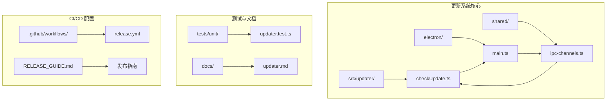
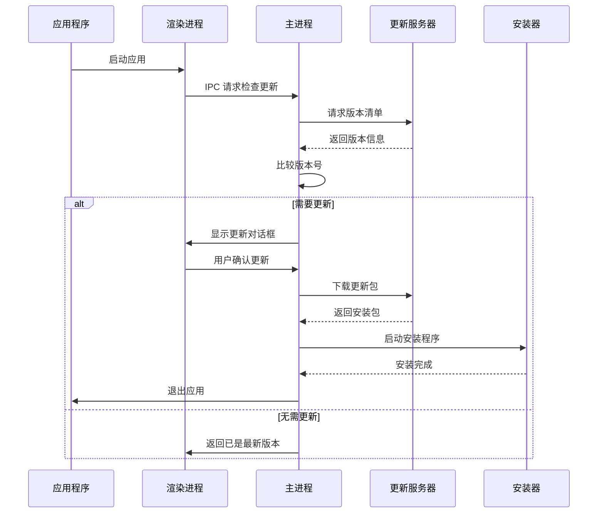
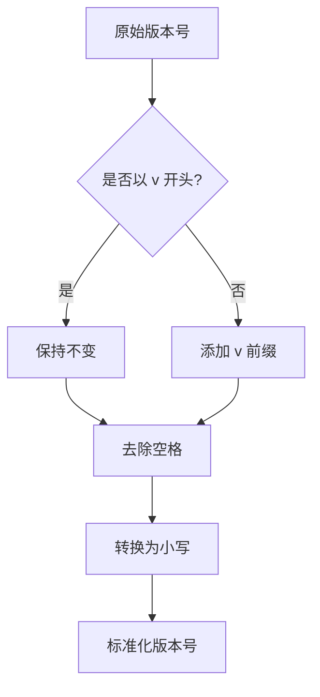
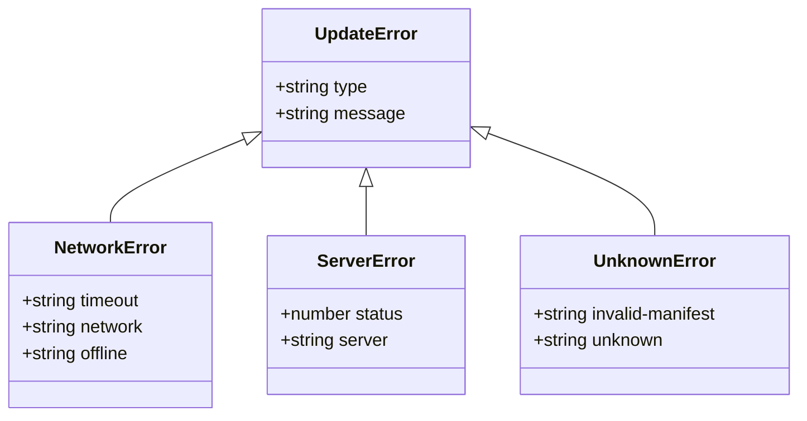
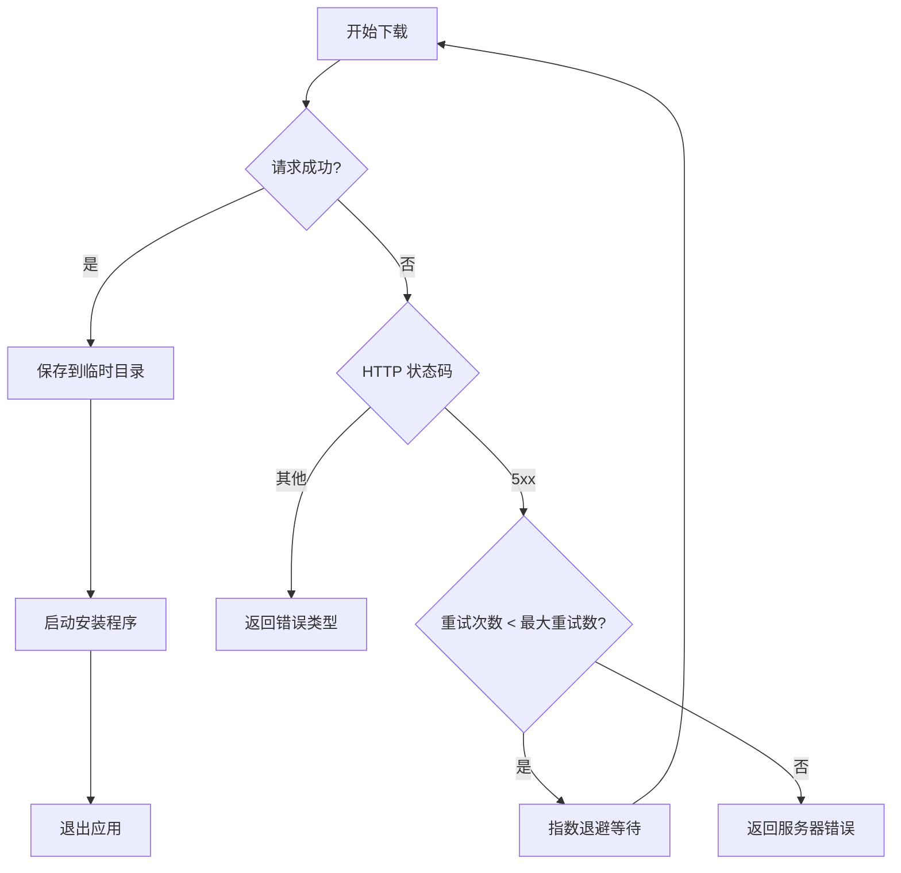

# 自动更新系统

<cite>
**本文档引用的文件**
- [checkUpdate.ts](file://src/updater/checkUpdate.ts)
- [updater.test.ts](file://tests/unit/updater.test.ts)
- [updater.md](file://docs/updater.md)
- [main.ts](file://electron/main.ts)
- [ipc-channels.ts](file://shared/ipc-channels.ts)
- [package.json](file://package.json)
- [release.yml](file://.github/workflows/release.yml)
- [RELEASE_GUIDE.md](file://RELEASE_GUIDE.md)
</cite>

## 目录
1. [简介](#简介)
2. [项目结构](#项目结构)
3. [核心组件](#核心组件)
4. [架构概览](#架构概览)
5. [详细组件分析](#详细组件分析)
6. [依赖关系分析](#依赖关系分析)
7. [性能考虑](#性能考虑)
8. [故障排除指南](#故障排除指南)
9. [结论](#结论)
10. [附录](#附录)

## 简介

OJFlow 自动更新系统是一个完整的应用程序更新解决方案，支持跨平台部署（Windows、macOS、Linux）。该系统实现了智能版本检测、增量更新策略、下载进度监控和安装回滚机制。系统采用现代化的 Electron 架构，结合 Vite 构建工具，提供了可靠的用户体验和强大的错误处理能力。

## 项目结构

自动更新系统主要分布在以下关键目录中：

**图表来源**
- [checkUpdate.ts:1-311](file://src/updater/checkUpdate.ts#L1-L311)
- [main.ts:1-493](file://electron/main.ts#L1-L493)
- [ipc-channels.ts:1-53](file://shared/ipc-channels.ts#L1-L53)

**章节来源**
- [checkUpdate.ts:1-311](file://src/updater/checkUpdate.ts#L1-L311)
- [main.ts:1-493](file://electron/main.ts#L1-L493)
- [ipc-channels.ts:1-53](file://shared/ipc-channels.ts#L1-L53)

## 核心组件

### 版本检测引擎

版本检测引擎是整个更新系统的核心，负责比较本地版本与远程版本，判断是否需要更新。

**章节来源**
- [checkUpdate.ts:185-310](file://src/updater/checkUpdate.ts#L185-L310)
- [main.ts:292-352](file://electron/main.ts#L292-L352)

### 下载与安装处理器

下载与安装处理器负责处理更新包的下载、保存和启动安装程序。

**章节来源**
- [main.ts:227-290](file://electron/main.ts#L227-L290)

### IPC 通信桥

IPC 通信桥提供渲染进程与主进程之间的通信通道，支持更新安装操作。

**章节来源**
- [ipc-channels.ts:8-8](file://shared/ipc-channels.ts#L8-L8)
- [main.ts:460-466](file://electron/main.ts#L460-L466)

## 架构概览

自动更新系统采用分层架构设计，实现了清晰的职责分离：

**图表来源**
- [main.ts:292-352](file://electron/main.ts#L292-L352)
- [main.ts:227-290](file://electron/main.ts#L227-L290)
- [ipc-channels.ts:8-8](file://shared/ipc-channels.ts#L8-L8)

## 详细组件分析

### 版本比较算法

系统实现了精确的语义化版本比较算法，支持 vMAJOR.MINOR.PATCH 格式的版本号。

#### 版本规范化处理

**图表来源**
- [checkUpdate.ts:25-29](file://src/updater/checkUpdate.ts#L25-L29)

#### 语义化版本解析

系统使用三段式解析方法，分别处理主版本号、次版本号和补丁版本号：

**章节来源**
- [checkUpdate.ts:31-48](file://src/updater/checkUpdate.ts#L31-L48)

### 更新服务器通信

#### Manifest 格式支持

系统支持两种版本清单格式：

1. **自定义 Manifest（推荐）**
2. **GitHub Release API 兼容格式**

**章节来源**
- [updater.md:5-31](file://docs/updater.md#L5-L31)

#### 错误分类与处理

系统对网络请求错误进行了详细的分类处理：

**图表来源**
- [checkUpdate.ts:3-15](file://src/updater/checkUpdate.ts#L3-L15)
- [checkUpdate.ts:173-183](file://src/updater/checkUpdate.ts#L173-L183)

**章节来源**
- [checkUpdate.ts:173-183](file://src/updater/checkUpdate.ts#L173-L183)

### 下载与安装流程

#### 下载重试机制

系统实现了智能的下载重试策略，支持指数退避算法：

**图表来源**
- [main.ts:246-281](file://electron/main.ts#L246-L281)

**章节来源**
- [main.ts:227-290](file://electron/main.ts#L227-L290)

### 对话框规格生成

系统根据更新状态动态生成用户界面规格：

**章节来源**
- [checkUpdate.ts:76-120](file://src/updater/checkUpdate.ts#L76-L120)

## 依赖关系分析

### 环境变量配置

自动更新系统通过环境变量进行灵活配置：

| 环境变量 | 默认值 | 描述 |
|---------|--------|------|
| VITE_UPDATE_MANIFEST_URL | 未设置 | 更新清单文件的 URL 地址 |
| VITE_APP_VERSION | 未设置 | 应用当前版本号 |
| VITE_UPDATE_TIMEOUT_MS | 8000 | 请求超时时间（毫秒） |
| VITE_UPDATE_RETRY_COUNT | 3 | 最大重试次数 |
| VITE_UPDATE_RETRY_BACKOFF_MS | 1000 | 指数退避基础时间 |

**章节来源**
- [checkUpdate.ts:122-128](file://src/updater/checkUpdate.ts#L122-L128)
- [main.ts:238-243](file://electron/main.ts#L238-L243)

### IPC 通信协议

系统通过 IPC 通道实现进程间通信：

**章节来源**
- [ipc-channels.ts:8-8](file://shared/ipc-channels.ts#L8-L8)
- [main.ts:460-466](file://electron/main.ts#L460-L466)

## 性能考虑

### 网络优化策略

1. **超时控制**：默认 8 秒超时，防止长时间阻塞
2. **重试机制**：最多 3 次重试，使用指数退避算法
3. **缓存策略**：使用 `cache: 'no-store'` 避免缓存影响
4. **连接复用**：合理利用 HTTP/1.1 连接池

### 内存管理

1. **流式下载**：使用 Node.js Stream API 实现流式下载
2. **临时文件清理**：下载完成后自动清理临时文件
3. **内存限制**：避免一次性加载大型更新包到内存

## 故障排除指南

### 常见问题诊断

#### 网络连接问题

**症状**：更新检查频繁失败，显示网络错误

**诊断步骤**：
1. 检查 `VITE_UPDATE_MANIFEST_URL` 环境变量配置
2. 验证网络连接稳定性
3. 检查防火墙和代理设置

**解决方案**：
- 增加 `VITE_UPDATE_TIMEOUT_MS` 值
- 配置企业代理服务器
- 使用备用更新服务器

#### 版本文件格式错误

**症状**：返回 `invalid-manifest` 错误

**诊断步骤**：
1. 验证 JSON 格式正确性
2. 检查必需字段是否存在
3. 确认版本号格式符合语义化版本规范

**解决方案**：
- 使用推荐的自定义 Manifest 格式
- 确保 `version` 字段存在且格式正确
- 添加必要的 `packages` 或 `packageUrl` 字段

#### 下载失败处理

**症状**：更新包下载中断或失败

**诊断步骤**：
1. 检查 CDN 可用性和带宽限制
2. 验证文件完整性
3. 检查磁盘空间

**解决方案**：
- 实施断点续传机制
- 添加文件完整性校验
- 提供手动下载选项

### 回滚策略

系统提供了多层回滚保护机制：

1. **安装器回滚**：依赖操作系统安装器的内置回滚功能
2. **备份文件**：保留旧版本文件作为备份
3. **原子替换**：使用两阶段提交确保更新原子性

**章节来源**
- [updater.md:72-85](file://docs/updater.md#L72-L85)

## 结论

OJFlow 自动更新系统是一个功能完整、设计合理的应用程序更新解决方案。系统采用了现代的架构设计，实现了可靠的版本检测、智能的网络通信和完善的错误处理机制。通过合理的配置选项和灵活的部署策略，系统能够适应各种使用场景和环境要求。

系统的最大优势在于其模块化设计和清晰的职责分离，使得各个组件可以独立开发和测试，同时保持良好的协作关系。完善的测试覆盖和文档支持为系统的长期维护提供了坚实的基础。

## 附录

### 发布流程最佳实践

#### 版本管理策略

1. **语义化版本控制**：严格遵循 MAJOR.MINOR.PATCH 命名规范
2. **变更日志维护**：每次发布前更新 CHANGELOG 文件
3. **标签管理**：使用 `v` 前缀的 Git 标签标识正式版本

#### CI/CD 集成

系统通过 GitHub Actions 实现自动化发布流程：

**章节来源**
- [release.yml:1-137](file://.github/workflows/release.yml#L1-L137)
- [RELEASE_GUIDE.md:1-98](file://RELEASE_GUIDE.md#L1-L98)

### 配置选项详解

#### 更新策略配置

| 配置项 | 类型 | 默认值 | 说明 |
|-------|------|--------|------|
| VITE_UPDATE_MANIFEST_URL | string | 必填 | 更新清单 URL |
| VITE_APP_VERSION | string | 必填 | 应用版本号 |
| VITE_UPDATE_TIMEOUT_MS | number | 8000 | 请求超时时间 |
| VITE_UPDATE_RETRY_COUNT | number | 3 | 重试次数 |
| VITE_UPDATE_RETRY_BACKOFF_MS | number | 1000 | 退避时间 |

#### 安全配置

1. **HTTPS 强制**：仅允许 HTTPS 协议的更新包
2. **文件完整性校验**：建议添加 SHA256 校验和
3. **数字签名验证**：确保更新包来源可信