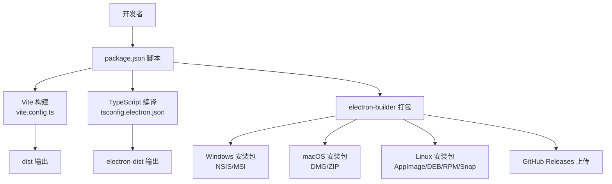
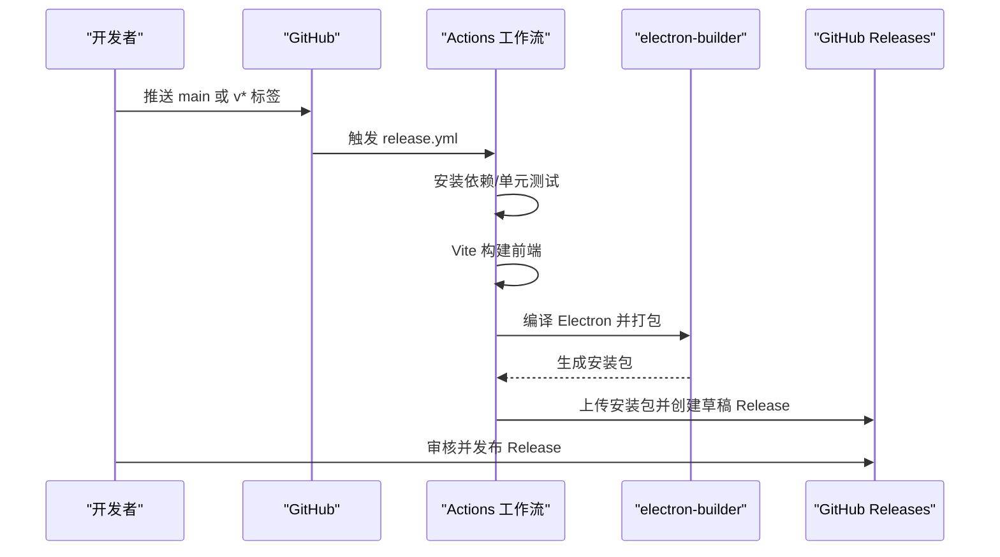
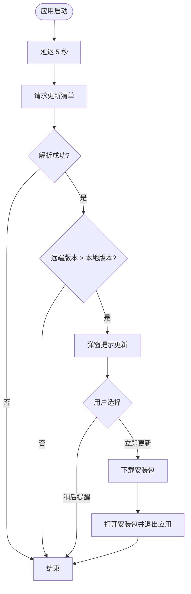
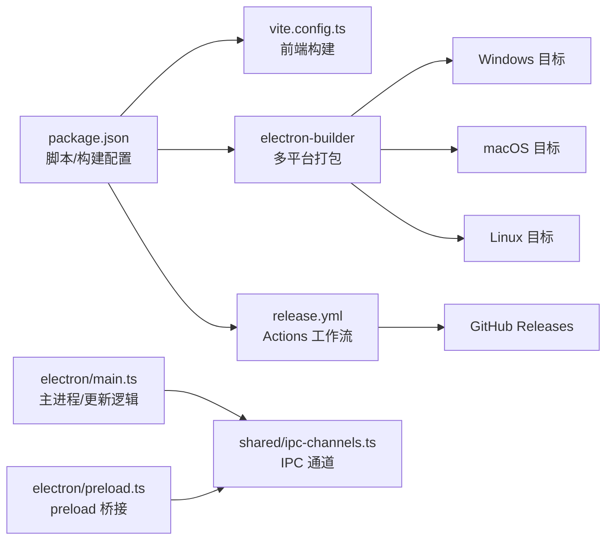

# 部署与发布

<cite>
**本文引用的文件**
- [package.json](file://package.json)
- [README.md](file://README.md)
- [RELEASE_GUIDE.md](file://RELEASE_GUIDE.md)
- [.github/workflows/release.yml](file://.github/workflows/release.yml)
- [vite.config.ts](file://vite.config.ts)
- [electron/main.ts](file://electron/main.ts)
- [electron/preload.ts](file://electron/preload.ts)
- [shared/ipc-channels.ts](file://shared/ipc-channels.ts)
- [docs/updater.md](file://docs/updater.md)
- [tests/e2e/app.spec.ts](file://tests/e2e/app.spec.ts)
- [tests/unit/updater.test.ts](file://tests/unit/updater.test.ts)
- [.bunfig.toml](file://.bunfig.toml)
</cite>

## 目录
1. [简介](#简介)
2. [项目结构](#项目结构)
3. [核心组件](#核心组件)
4. [架构总览](#架构总览)
5. [详细组件分析](#详细组件分析)
6. [依赖关系分析](#依赖关系分析)
7. [性能考虑](#性能考虑)
8. [故障排除指南](#故障排除指南)
9. [结论](#结论)
10. [附录](#附录)

## 简介
本文件面向运维与开发团队，提供 OJFlow 的部署与发布全流程文档。内容涵盖：
- 构建流程：开发构建、生产构建与多平台打包策略
- CI/CD 流水线：GitHub Actions 工作流与自动化测试
- 发布流程：版本管理、变更日志生成与发布渠道
- 平台部署：Windows、macOS、Linux 的安装包与运行指引
- 安全加固：应用签名、代码混淆与安全策略
- 更新与回滚：自动更新机制与回退策略
- 运维监控与排障：常见问题定位与处理建议

## 项目结构
OJFlow 采用 Electron + Vue 3 + Vite + Bun 的现代桌面应用架构。前端资源由 Vite 构建，打包阶段由 electron-builder 生成多平台安装包。CI 通过 GitHub Actions 实现自动化构建与发布。

图表来源
- [package.json:34-54](file://package.json#L34-L54)
- [vite.config.ts:1-15](file://vite.config.ts#L1-L15)
- [package.json:94-125](file://package.json#L94-L125)

章节来源
- [package.json:34-54](file://package.json#L34-L54)
- [vite.config.ts:1-15](file://vite.config.ts#L1-L15)
- [README.md:70-115](file://README.md#L70-L115)

## 核心组件
- 构建与打包
  - 前端构建：Vite 生成静态资源，输出至 dist 目录
  - 主进程编译：TypeScript 编译 Electron 主进程代码
  - 安装包生成：electron-builder 根据平台目标生成对应安装包
- 自动更新
  - 启动检查：应用启动后延迟检查更新
  - 版本对比：基于语义化版本比较
  - 下载与安装：下载对应平台安装包并交由系统安装器处理
- CI/CD
  - 触发条件：push 到 main 或推送 v* 标签
  - 并行矩阵：Windows/macOS/Linux 同时构建
  - 发布：自动创建 GitHub Release 并上传产物

章节来源
- [package.json:34-54](file://package.json#L34-L54)
- [package.json:94-125](file://package.json#L94-L125)
- [.github/workflows/release.yml:1-137](file://.github/workflows/release.yml#L1-L137)
- [electron/main.ts:292-352](file://electron/main.ts#L292-L352)
- [docs/updater.md:1-86](file://docs/updater.md#L1-L86)

## 架构总览
下图展示了从代码提交到发布产物的关键流程与角色：

图表来源
- [.github/workflows/release.yml:3-137](file://.github/workflows/release.yml#L3-L137)
- [package.json:41-45](file://package.json#L41-L45)

章节来源
- [.github/workflows/release.yml:1-137](file://.github/workflows/release.yml#L1-L137)
- [RELEASE_GUIDE.md:38-85](file://RELEASE_GUIDE.md#L38-L85)

## 详细组件分析

### 构建流程与脚本
- 开发构建
  - 同时启动 Electron 主进程编译与 Vite 开发服务器，便于联调
- 生产构建
  - 先编译主进程，再构建前端，最后由 electron-builder 生成安装包
- 多平台打包
  - 支持 Windows（NSIS/MSI）、macOS（DMG/ZIP）、Linux（AppImage/DEB/RPM/Snap）

章节来源
- [package.json:34-54](file://package.json#L34-L54)
- [package.json:41-45](file://package.json#L41-L45)
- [package.json:94-125](file://package.json#L94-L125)
- [README.md:104-114](file://README.md#L104-L114)

### CI/CD 流水线（GitHub Actions）
- 触发条件
  - 推送 main 分支或推送以 v* 开头的标签
- 环境准备
  - Node.js 20 与 Bun 最新版本
  - 使用 frozen-lockfile 确保依赖一致性
- 步骤概览
  - 安装依赖 → 单元测试 → 前端构建 → Electron 应用构建 → 并行上传到 GitHub Releases → 上传构建产物为 Artifacts
- 并发与签名
  - macOS/Windows 构建时读取密钥环境变量，若未配置则显式禁用签名
  - 使用专用 Action 并发上传，避免冲突

章节来源
- [.github/workflows/release.yml:3-137](file://.github/workflows/release.yml#L3-L137)
- [RELEASE_GUIDE.md:64-85](file://RELEASE_GUIDE.md#L64-L85)

### 自动更新机制
- 版本清单（Manifest）格式
  - 支持自定义清单与 GitHub Release API 兼容格式
  - 按平台映射 packages 字段，选择对应安装包 URL
- 启动检查
  - 应用启动后约 5 秒检查更新，避免阻塞首屏
  - 对比本地版本与远端版本，弹窗提示用户是否立即更新
- 下载与安装
  - 下载安装包到临时目录并交由系统安装器处理
  - 若下载失败或安装器异常，保留“前往发布页”兜底入口
- 错误分类与回退
  - 网络/超时/服务端错误分类处理，支持重试
  - 安装失败时保留手动更新通道

图表来源
- [electron/main.ts:292-352](file://electron/main.ts#L292-L352)
- [docs/updater.md:42-59](file://docs/updater.md#L42-L59)

章节来源
- [electron/main.ts:80-352](file://electron/main.ts#L80-L352)
- [docs/updater.md:1-86](file://docs/updater.md#L1-L86)

### 安全加固与签名
- 代码签名
  - macOS/Windows 构建时读取密钥环境变量，若缺失则显式禁用签名
  - 建议在 CI 中配置密钥，确保安装包具备有效签名
- 运行时安全
  - preload 使用 contextBridge 暴露受控 API
  - 主进程 IPC 严格校验参数类型与长度，限制协议为 http/https
- 网络安全
  - 更新检查与下载使用超时与重试策略
  - 对网络错误与超时进行分类处理，避免阻塞主线程

章节来源
- [.github/workflows/release.yml:70-95](file://.github/workflows/release.yml#L70-L95)
- [electron/preload.ts:1-38](file://electron/preload.ts#L1-L38)
- [electron/main.ts:452-458](file://electron/main.ts#L452-L458)
- [electron/main.ts:176-225](file://electron/main.ts#L176-L225)

### 平台部署指导
- Windows
  - 安装包类型：NSIS（exe）或 MSI
  - 建议启用代码签名，提升用户信任度
- macOS
  - 安装包类型：DMG/ZIP
  - 需要通过公证流程（如使用签名证书），避免 Gatekeeper 拦截
- Linux
  - 安装包类型：AppImage/DEB/RPM/Snap
  - 建议提供 DEB/ZIP 以便用户便捷安装与更新

章节来源
- [package.json:111-124](file://package.json#L111-L124)
- [.github/workflows/release.yml:70-95](file://.github/workflows/release.yml#L70-L95)

### 版本管理与发布渠道
- 版本号管理
  - 在 package.json 中维护版本号，遵循语义化版本
- 发布触发
  - 推送 v* 标签触发 Actions，自动生成 Release 草稿并上传产物
- 变更日志
  - 使用 GitHub 自动生成 Release Notes，可在发布前人工审核与补充

章节来源
- [RELEASE_GUIDE.md:12-37](file://RELEASE_GUIDE.md#L12-L37)
- [RELEASE_GUIDE.md:38-85](file://RELEASE_GUIDE.md#L38-L85)

### 测试与验证
- 单元测试
  - 使用 Bun 测试框架，覆盖更新检查逻辑与错误分类
- 端到端测试
  - 使用 Playwright 启动 Electron 应用，验证窗口加载、交互与页面行为

章节来源
- [tests/unit/updater.test.ts:1-140](file://tests/unit/updater.test.ts#L1-L140)
- [tests/e2e/app.spec.ts:1-190](file://tests/e2e/app.spec.ts#L1-L190)

## 依赖关系分析

图表来源
- [package.json:34-54](file://package.json#L34-L54)
- [package.json:94-125](file://package.json#L94-L125)
- [.github/workflows/release.yml:1-137](file://.github/workflows/release.yml#L1-L137)
- [electron/main.ts:19-26](file://electron/main.ts#L19-L26)
- [shared/ipc-channels.ts:3-14](file://shared/ipc-channels.ts#L3-L14)
- [electron/preload.ts:1-38](file://electron/preload.ts#L1-L38)

章节来源
- [package.json:34-54](file://package.json#L34-L54)
- [package.json:94-125](file://package.json#L94-L125)
- [.github/workflows/release.yml:1-137](file://.github/workflows/release.yml#L1-L137)
- [electron/main.ts:19-26](file://electron/main.ts#L19-L26)
- [shared/ipc-channels.ts:3-14](file://shared/ipc-channels.ts#L3-L14)
- [electron/preload.ts:1-38](file://electron/preload.ts#L1-L38)

## 性能考虑
- 构建性能
  - 使用 Bun 作为包管理与运行时，提升安装与构建速度
  - Vite 提供快速热更新与生产构建优化
- 运行性能
  - preload 仅暴露必要 API，降低上下文桥接开销
  - 更新检查采用延迟与超时控制，避免影响首屏体验
- CI 性能
  - 并行矩阵构建多平台产物，缩短整体耗时

章节来源
- [README.md:70-115](file://README.md#L70-L115)
- [.github/workflows/release.yml:16-20](file://.github/workflows/release.yml#L16-L20)
- [electron/main.ts:292-352](file://electron/main.ts#L292-L352)

## 故障排除指南
- 构建失败
  - 检查 Actions 日志中的网络与依赖安装错误
  - 确认 Node.js 与 Bun 版本满足要求
- 签名问题
  - macOS/Windows 未配置密钥时会显式禁用签名，导致安装器警告
  - 建议在 CI 中配置密钥，确保签名生效
- 更新检查失败
  - 网络错误/超时：检查清单 URL 与 CDN 可达性
  - 清单格式错误：确认清单字段与格式符合约定
  - 下载失败：检查安装包 URL 与权限
- 安装器无法启动
  - 安全软件拦截或权限不足，建议以管理员身份运行或调整防护策略
- 回滚策略
  - 优先使用安装器自带回滚机制
  - 若采用便携版替换，建议采用“先写入新文件 -> 校验 -> 原子替换”的两阶段提交，并保留旧版本备份

章节来源
- [.github/workflows/release.yml:82-91](file://.github/workflows/release.yml#L82-L91)
- [docs/updater.md:72-85](file://docs/updater.md#L72-L85)
- [electron/main.ts:176-225](file://electron/main.ts#L176-L225)

## 结论
OJFlow 的部署与发布体系以自动化为核心，结合 Electron + Vite + Bun 的技术栈与 GitHub Actions 的并行构建能力，实现了高效、稳定的跨平台发布流程。通过明确的版本管理、自动化的更新机制与完善的测试保障，能够持续为用户提供高质量的桌面应用体验。

## 附录
- 开发与构建命令参考
  - 开发：同时编译主进程与启动 Vite 开发服务器
  - 生产：分别编译主进程与前端，再由 electron-builder 生成安装包
  - 平台专属：分别针对 Windows/macOS/Linux 生成对应安装包
- 包管理镜像
  - 使用国内 npm 镜像加速依赖安装

章节来源
- [README.md:70-115](file://README.md#L70-L115)
- [package.json:34-54](file://package.json#L34-L54)
- [.bunfig.toml:1-2](file://.bunfig.toml#L1-L2)