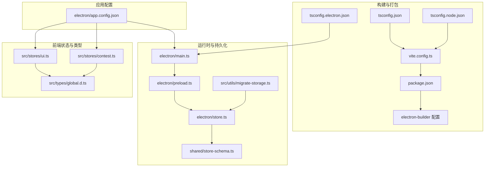
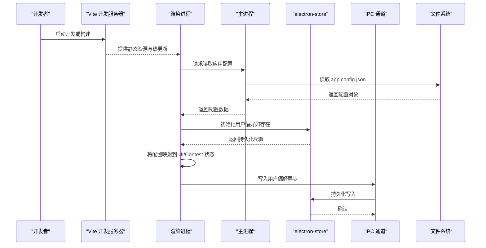
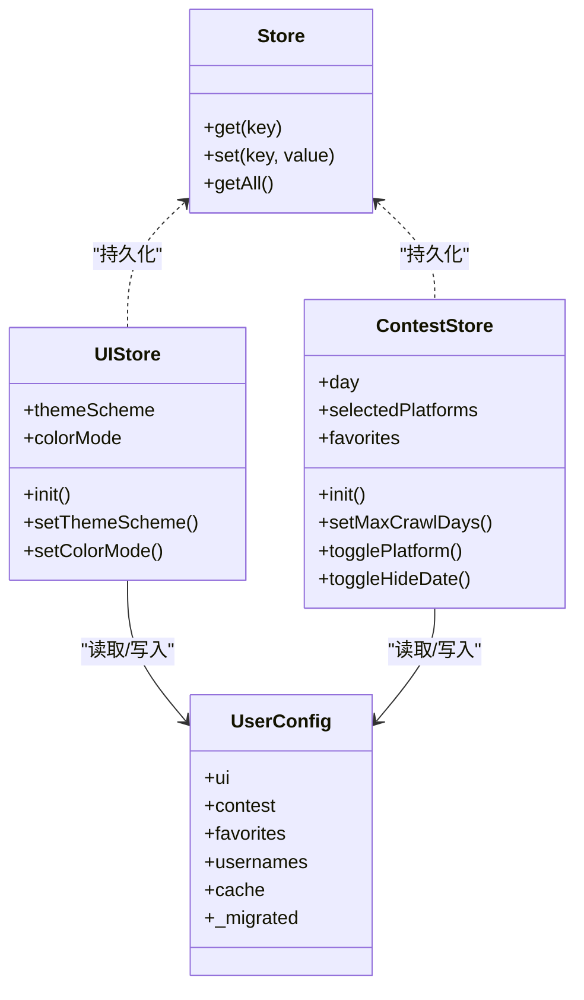
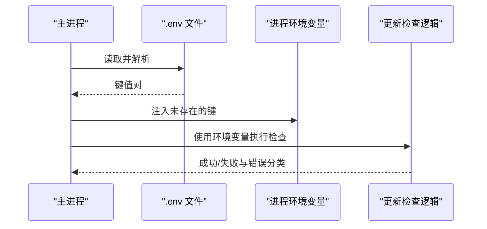
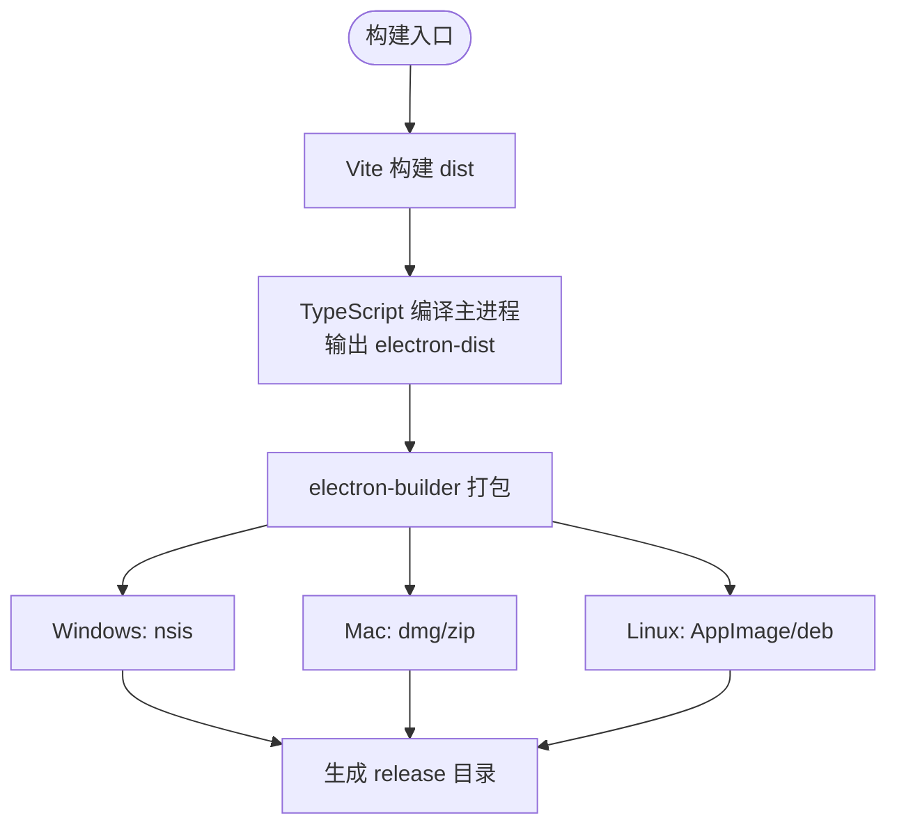
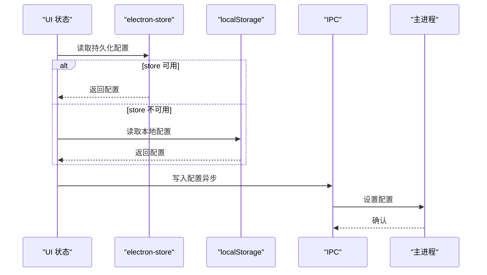
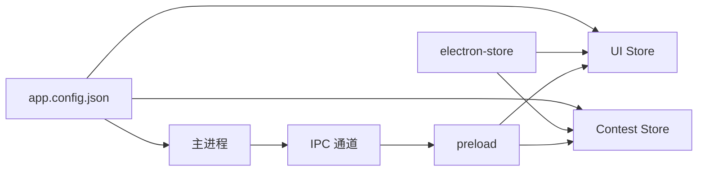

# 配置管理

<cite>
**本文引用的文件**
- [package.json](file://package.json)
- [vite.config.ts](file://vite.config.ts)
- [tsconfig.json](file://tsconfig.json)
- [tsconfig.electron.json](file://tsconfig.electron.json)
- [tsconfig.node.json](file://tsconfig.node.json)
- [.bunfig.toml](file://.bunfig.toml)
- [electron/app.config.json](file://electron/app.config.json)
- [electron/main.ts](file://electron/main.ts)
- [electron/store.ts](file://electron/store.ts)
- [electron/preload.ts](file://electron/preload.ts)
- [shared/store-schema.ts](file://shared/store-schema.ts)
- [shared/ipc-channels.ts](file://shared/ipc-channels.ts)
- [src/stores/ui.ts](file://src/stores/ui.ts)
- [src/stores/contest.ts](file://src/stores/contest.ts)
- [src/utils/migrate-storage.ts](file://src/utils/migrate-storage.ts)
- [src/types/global.d.ts](file://src/types/global.d.ts)
</cite>

## 目录
1. [简介](#简介)
2. [项目结构](#项目结构)
3. [核心组件](#核心组件)
4. [架构总览](#架构总览)
5. [详细组件分析](#详细组件分析)
6. [依赖分析](#依赖分析)
7. [性能考虑](#性能考虑)
8. [故障排查指南](#故障排查指南)
9. [结论](#结论)
10. [附录](#附录)

## 简介
本文件系统性梳理 OJFlow 的配置管理体系，覆盖应用配置文件结构与用途（运行时配置、用户偏好持久化、国际化与主题）、环境变量管理与校验、构建配置（Vite、TypeScript、Electron Builder）以及开发/生产环境差异。同时提供配置项详解、默认值参考、自定义指南与最佳实践，并解释配置热更新与动态加载机制。

## 项目结构
OJFlow 的配置涉及多层文件与模块：
- 构建与打包：Vite、TypeScript、Electron Builder
- 应用配置：electron/app.config.json（运行时配置）
- 用户偏好：electron-store（持久化存储）
- 运行时环境：.env 加载、进程环境变量
- 类型与接口：共享类型与全局声明

图表来源
- [vite.config.ts:1-15](file://vite.config.ts#L1-L15)
- [tsconfig.json:1-26](file://tsconfig.json#L1-L26)
- [tsconfig.electron.json:1-26](file://tsconfig.electron.json#L1-L26)
- [tsconfig.node.json:1-10](file://tsconfig.node.json#L1-L10)
- [package.json:94-125](file://package.json#L94-L125)
- [electron/app.config.json:1-62](file://electron/app.config.json#L1-L62)
- [electron/main.ts:1-493](file://electron/main.ts#L1-L493)
- [electron/preload.ts:1-38](file://electron/preload.ts#L1-L38)
- [electron/store.ts:1-31](file://electron/store.ts#L1-L31)
- [shared/store-schema.ts:1-55](file://shared/store-schema.ts#L1-L55)
- [src/stores/ui.ts:1-91](file://src/stores/ui.ts#L1-L91)
- [src/stores/contest.ts:1-298](file://src/stores/contest.ts#L1-L298)
- [src/utils/migrate-storage.ts:1-63](file://src/utils/migrate-storage.ts#L1-L63)
- [src/types/global.d.ts:1-26](file://src/types/global.d.ts#L1-L26)

章节来源
- [package.json:1-127](file://package.json#L1-L127)
- [vite.config.ts:1-15](file://vite.config.ts#L1-L15)
- [tsconfig.json:1-26](file://tsconfig.json#L1-L26)
- [tsconfig.electron.json:1-26](file://tsconfig.electron.json#L1-L26)
- [tsconfig.node.json:1-10](file://tsconfig.node.json#L1-L10)
- [.bunfig.toml:1-2](file://.bunfig.toml#L1-L2)

## 核心组件
- 应用运行时配置：electron/app.config.json 提供爬取天数范围、提示延迟、主题方案与设计令牌、国际化默认语言等。
- 用户偏好持久化：electron-store 作为统一存储，配合 Pinia 状态与本地存储实现跨会话配置。
- 构建与打包：Vite 用于前端开发与构建；TypeScript 编译器配置分别面向渲染进程与主进程；Electron Builder 负责打包与分发。
- 环境变量：.env 文件在启动时按需注入；主进程通过进程环境变量控制更新检查与下载行为。
- 类型与接口：共享类型定义与全局声明保证 IPC 通道与存储结构的一致性。

章节来源
- [electron/app.config.json:1-62](file://electron/app.config.json#L1-L62)
- [electron/store.ts:1-31](file://electron/store.ts#L1-L31)
- [shared/store-schema.ts:1-55](file://shared/store-schema.ts#L1-L55)
- [src/stores/ui.ts:1-91](file://src/stores/ui.ts#L1-L91)
- [src/stores/contest.ts:1-298](file://src/stores/contest.ts#L1-L298)
- [electron/main.ts:35-54](file://electron/main.ts#L35-L54)
- [package.json:94-125](file://package.json#L94-L125)

## 架构总览
下图展示配置在应用中的流向：从构建配置到运行时配置，再到用户偏好持久化与前端状态初始化。

图表来源
- [vite.config.ts:1-15](file://vite.config.ts#L1-L15)
- [electron/app.config.json:1-62](file://electron/app.config.json#L1-L62)
- [electron/main.ts:35-54](file://electron/main.ts#L35-L54)
- [electron/preload.ts:1-38](file://electron/preload.ts#L1-L38)
- [electron/store.ts:1-31](file://electron/store.ts#L1-L31)
- [src/stores/ui.ts:15-91](file://src/stores/ui.ts#L15-L91)
- [src/stores/contest.ts:59-298](file://src/stores/contest.ts#L59-L298)

## 详细组件分析

### 应用运行时配置（electron/app.config.json）
- 结构要点
  - 爬取配置：defaultDays、minDays、maxDays
  - 提示配置：showDelayMs、hideDelayMs、longPressMs
  - 主题配置：defaultScheme、defaultMode
  - 设计令牌：按主题方案提供颜色与阴影等
  - 国际化：defaultLocale
- 默认值与约束
  - 默认主题方案与模式：由前端与主进程共同使用默认值回退策略
  - 爬取天数范围：最小/最大值与默认值由前端与主进程读取并进行边界裁剪
- 作用域
  - 主进程：用于 IPC 参数校验与更新检查参数
  - 渲染进程：用于 UI 主题与国际化默认值初始化

章节来源
- [electron/app.config.json:1-62](file://electron/app.config.json#L1-L62)
- [src/stores/ui.ts:15-48](file://src/stores/ui.ts#L15-L48)
- [src/stores/contest.ts:17-33](file://src/stores/contest.ts#L17-L33)
- [electron/main.ts:397-412](file://electron/main.ts#L397-L412)

### 用户偏好持久化（electron-store 与 Pinia）
- 存储结构
  - UI 偏好：主题方案、颜色模式、语言
  - 比赛设置：最大爬取天数、隐藏日期、平台选择
  - 收藏列表、用户名映射、缓存
- 初始化与回退
  - 优先从 electron-store 读取；若不可用则回退到 localStorage
  - 启动时尝试迁移 localStorage 到 electron-store
- 写入策略
  - 异步写入，失败不阻塞 UI
  - 同步保持 localStorage 一致，作为后备

图表来源
- [shared/store-schema.ts:1-55](file://shared/store-schema.ts#L1-L55)
- [electron/store.ts:1-31](file://electron/store.ts#L1-L31)
- [src/stores/ui.ts:15-91](file://src/stores/ui.ts#L15-L91)
- [src/stores/contest.ts:59-298](file://src/stores/contest.ts#L59-L298)

章节来源
- [electron/store.ts:1-31](file://electron/store.ts#L1-L31)
- [shared/store-schema.ts:1-55](file://shared/store-schema.ts#L1-L55)
- [src/stores/ui.ts:15-91](file://src/stores/ui.ts#L15-L91)
- [src/stores/contest.ts:59-298](file://src/stores/contest.ts#L59-L298)
- [src/utils/migrate-storage.ts:1-63](file://src/utils/migrate-storage.ts#L1-L63)

### 环境变量管理与校验
- .env 加载
  - 主进程启动时尝试读取同目录下的 .env 并注入到进程环境变量
- 更新检查与下载参数
  - 通过进程环境变量控制更新清单地址、超时、重试次数与回退时间
  - 主进程对网络错误与超时进行分类处理
- IPC 通道
  - preload 暴露受限 API，避免直接暴露 ipcRenderer
  - 全局类型声明确保类型安全

图表来源
- [electron/main.ts:35-54](file://electron/main.ts#L35-L54)
- [electron/main.ts:292-352](file://electron/main.ts#L292-L352)
- [electron/preload.ts:1-38](file://electron/preload.ts#L1-L38)
- [src/types/global.d.ts:8-25](file://src/types/global.d.ts#L8-L25)

章节来源
- [electron/main.ts:35-54](file://electron/main.ts#L35-L54)
- [electron/main.ts:238-243](file://electron/main.ts#L238-L243)
- [electron/main.ts:292-352](file://electron/main.ts#L292-L352)
- [electron/preload.ts:1-38](file://electron/preload.ts#L1-L38)
- [src/types/global.d.ts:8-25](file://src/types/global.d.ts#L8-L25)

### 构建配置（Vite、TypeScript、Electron Builder）
- Vite 配置
  - 插件：Vue 插件
  - 资源基址：相对路径，避免打包后白屏
  - 开发服务器：固定端口，便于调试
  - 输出目录：dist
- TypeScript 配置
  - 渲染进程：严格模式、ESNext、Node 解析、无 emit
  - 主进程：CommonJS、ES2022、输出目录 electron-dist
  - Node 工具链：ESNext、Node 解析
- Electron Builder
  - 应用元信息：appId、productName
  - 输出目录：release
  - 包含文件：dist、electron-dist、app.config.json、package.json
  - 额外资源：图标（ico/icns/png）
  - 平台目标：Windows(nsis)、Mac(dmg/zip)、Linux(AppImage/deb)

图表来源
- [vite.config.ts:1-15](file://vite.config.ts#L1-L15)
- [tsconfig.json:1-26](file://tsconfig.json#L1-L26)
- [tsconfig.electron.json:1-26](file://tsconfig.electron.json#L1-L26)
- [package.json:94-125](file://package.json#L94-L125)

章节来源
- [vite.config.ts:1-15](file://vite.config.ts#L1-L15)
- [tsconfig.json:1-26](file://tsconfig.json#L1-L26)
- [tsconfig.electron.json:1-26](file://tsconfig.electron.json#L1-L26)
- [tsconfig.node.json:1-10](file://tsconfig.node.json#L1-L10)
- [package.json:94-125](file://package.json#L94-L125)

### 开发环境与生产环境差异
- 开发模式
  - Vite 开发服务器：端口 5173，严格端口占用
  - Electron 加载本地开发页面，打开 DevTools
- 生产模式
  - Electron 加载打包后的 dist/index.html
  - 应用图标与菜单栏配置
- 构建脚本
  - 开发：先编译主进程，再启动 Vite 与 Electron
  - 构建：先编译主进程与前端，再调用 electron-builder
  - 分平台打包：支持 Windows/Mac/Linux

章节来源
- [vite.config.ts:7-10](file://vite.config.ts#L7-L10)
- [electron/main.ts:371-376](file://electron/main.ts#L371-L376)
- [package.json:34-53](file://package.json#L34-L53)

### 配置项详解与默认值参考
- 应用运行时配置（electron/app.config.json）
  - 爬取天数：defaultDays、minDays、maxDays（前端与主进程均进行裁剪）
  - 提示延迟：showDelayMs、hideDelayMs、longPressMs
  - 主题：defaultScheme（ocean/violet）、defaultMode（auto/light/dark）
  - 设计令牌：各主题的颜色与阴影等
  - 国际化：defaultLocale（zh-CN/en-US）
- 用户偏好默认值（electron/store.ts）
  - UI：themeScheme、colorMode、locale
  - 比赛：maxCrawlDays、hideDate、selectedPlatforms（默认全选）
  - 其他：favorites、usernames、cache
- 前端状态默认值（src/stores）
  - UI：themeScheme、colorMode（以 app.config.json 为源，缺失时回退）
  - 比赛：day、selectedPlatforms、favorites、hideDate（localStorage 或 store 读取）

章节来源
- [electron/app.config.json:1-62](file://electron/app.config.json#L1-L62)
- [electron/store.ts:4-25](file://electron/store.ts#L4-L25)
- [src/stores/ui.ts:15-48](file://src/stores/ui.ts#L15-L48)
- [src/stores/contest.ts:59-135](file://src/stores/contest.ts#L59-L135)

### 配置自定义指南与最佳实践
- 自定义 app.config.json
  - 仅修改允许的键值，避免破坏键名与类型
  - 修改主题令牌时保持颜色空间一致性
- 自定义 .env
  - 仅添加未存在的键，避免覆盖已有值
  - 更新检查相关参数建议通过环境变量微调
- 最佳实践
  - 优先使用 electron-store 持久化，localStorage 仅作后备
  - 写入操作异步化，失败不阻塞 UI
  - 在初始化阶段合并 store 与 localStorage 的配置，保证兼容性
  - 对外部输入（如 IPC 参数）进行类型与长度校验

章节来源
- [electron/app.config.json:1-62](file://electron/app.config.json#L1-L62)
- [electron/main.ts:35-54](file://electron/main.ts#L35-L54)
- [electron/main.ts:414-450](file://electron/main.ts#L414-L450)
- [src/stores/ui.ts:56-88](file://src/stores/ui.ts#L56-L88)
- [src/stores/contest.ts:152-181](file://src/stores/contest.ts#L152-L181)

### 配置热更新与动态加载机制
- 动态加载 app.config.json
  - 主进程与渲染进程均 require 该文件，作为运行时配置源
- IPC 动态交互
  - preload 暴露受限 API，渲染进程通过 IPC 与主进程通信
  - 主进程根据 app.config.json 进行参数裁剪与校验
- 运行时更新
  - UI/Contest 状态在初始化时读取持久化配置并应用
  - 写入操作异步执行，失败不影响当前状态

图表来源
- [src/stores/ui.ts:22-47](file://src/stores/ui.ts#L22-L47)
- [src/stores/contest.ts:101-132](file://src/stores/contest.ts#L101-L132)
- [electron/preload.ts:22-31](file://electron/preload.ts#L22-L31)
- [electron/main.ts:468-480](file://electron/main.ts#L468-L480)

章节来源
- [electron/app.config.json:1-62](file://electron/app.config.json#L1-L62)
- [electron/preload.ts:1-38](file://electron/preload.ts#L1-L38)
- [src/stores/ui.ts:15-91](file://src/stores/ui.ts#L15-L91)
- [src/stores/contest.ts:59-298](file://src/stores/contest.ts#L59-L298)

## 依赖分析
- 组件耦合
  - 渲染进程依赖 app.config.json 与 electron-store
  - 主进程依赖 app.config.json 与 .env，负责 IPC 处理与更新检查
  - 共享类型与 IPC 通道确保前后端一致
- 外部依赖
  - electron-store：用户偏好持久化
  - electron-builder：跨平台打包
  - Vite/TypeScript：开发与构建工具链

图表来源
- [electron/app.config.json:1-62](file://electron/app.config.json#L1-L62)
- [electron/store.ts:1-31](file://electron/store.ts#L1-L31)
- [electron/preload.ts:1-38](file://electron/preload.ts#L1-L38)
- [src/stores/ui.ts:1-91](file://src/stores/ui.ts#L1-L91)
- [src/stores/contest.ts:1-298](file://src/stores/contest.ts#L1-L298)

章节来源
- [package.json:58-93](file://package.json#L58-L93)
- [electron/main.ts:19-26](file://electron/main.ts#L19-L26)

## 性能考虑
- 构建优化
  - Vite 相对基址与严格端口减少资源解析与端口冲突开销
  - TypeScript 严格模式与跳过库检查提升编译速度
- 运行时优化
  - IPC 写入异步化，避免阻塞主线程
  - 更新检查采用超时与指数回退，降低网络波动影响
- 存储优化
  - 优先使用 electron-store，localStorage 仅作后备，减少跨会话迁移成本

## 故障排查指南
- 更新检查失败
  - 检查 VITE_UPDATE_* 环境变量是否正确设置
  - 查看网络错误分类与超时日志
- IPC 通信异常
  - 确认 preload 是否正确暴露 API
  - 检查全局类型声明与 IPC 通道名称
- 配置不生效
  - 确认 app.config.json 键名与类型正确
  - 检查 electron-store 是否可写，必要时清理后重试迁移

章节来源
- [electron/main.ts:238-243](file://electron/main.ts#L238-L243)
- [electron/main.ts:292-352](file://electron/main.ts#L292-L352)
- [electron/preload.ts:1-38](file://electron/preload.ts#L1-L38)
- [src/types/global.d.ts:8-25](file://src/types/global.d.ts#L8-L25)

## 结论
OJFlow 的配置体系以 app.config.json 为核心运行时配置，结合 electron-store 实现用户偏好的持久化与跨会话同步，并通过严格的 TypeScript 与 Vite/Electron Builder 配置保障开发与构建体验。通过 IPC 与类型声明确保前后端一致，配合迁移工具与回退策略提升兼容性与稳定性。遵循本文的最佳实践与自定义指南，可在不破坏系统稳定性的前提下灵活扩展配置能力。

## 附录
- 开发与打包命令
  - 开发：先编译主进程，再启动 Vite 与 Electron
  - 构建：先编译主进程与前端，再调用 electron-builder
  - 分平台：支持 Windows/Mac/Linux
- 包管理镜像
  - 使用国内 npm 镜像加速安装

章节来源
- [package.json:34-53](file://package.json#L34-L53)
- [.bunfig.toml:1-2](file://.bunfig.toml#L1-L2)