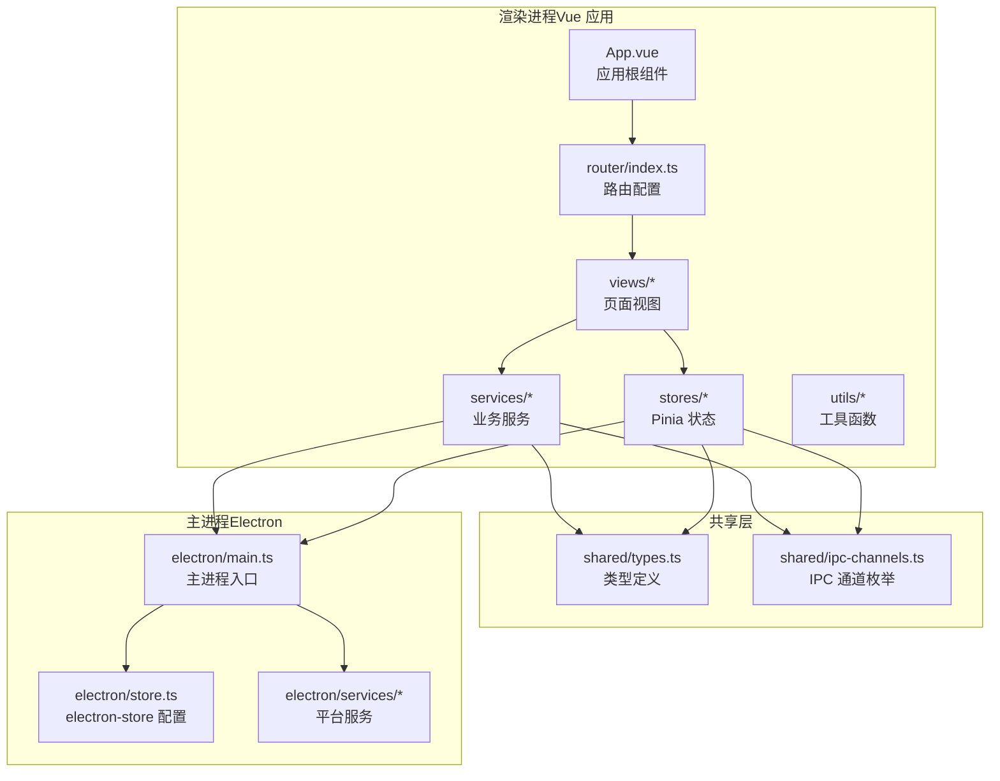
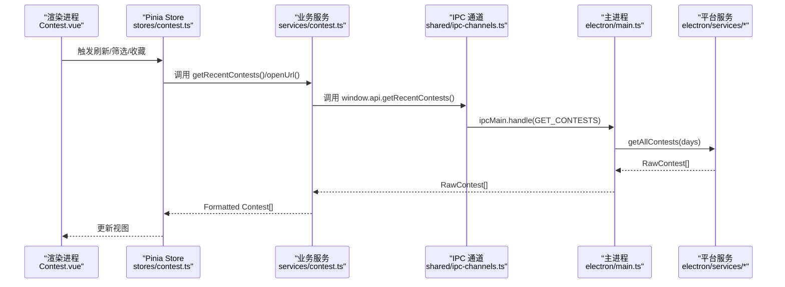
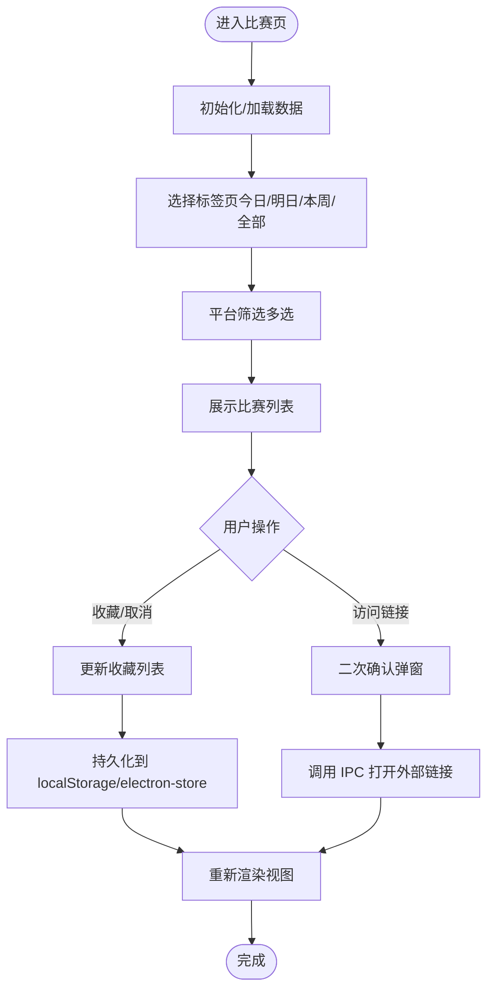
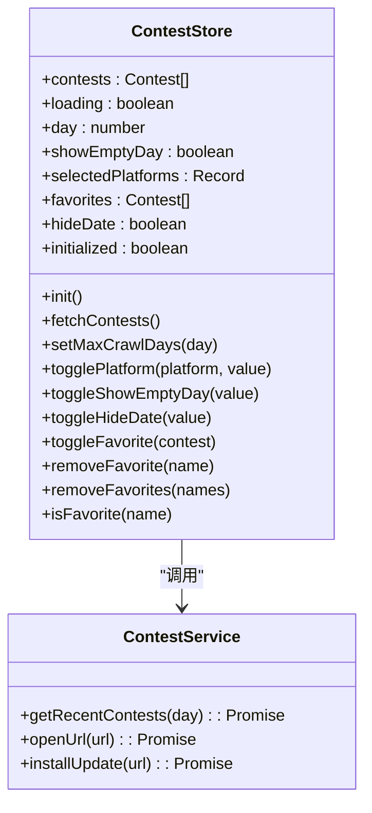
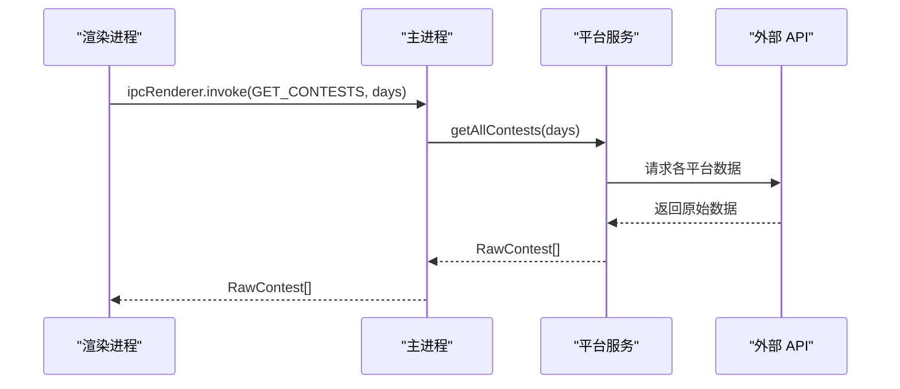
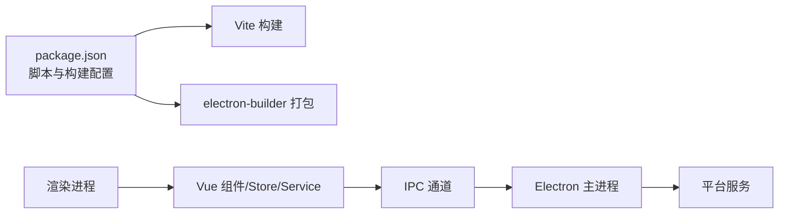

# 项目概述

<cite>
**本文档引用的文件**
- [README.md](file://README.md)
- [package.json](file://package.json)
- [docs/PRD.md](file://docs/PRD.md)
- [docs/NEW_FEATURES_PLAN.md](file://docs/NEW_FEATURES_PLAN.md)
- [src/main.ts](file://src/main.ts)
- [src/App.vue](file://src/App.vue)
- [src/router/index.ts](file://src/router/index.ts)
- [src/views/Contest.vue](file://src/views/Contest.vue)
- [src/stores/contest.ts](file://src/stores/contest.ts)
- [src/services/contest.ts](file://src/services/contest.ts)
- [shared/types.ts](file://shared/types.ts)
- [shared/ipc-channels.ts](file://shared/ipc-channels.ts)
- [electron/main.ts](file://electron/main.ts)
- [electron/store.ts](file://electron/store.ts)
</cite>

## 目录
1. [简介](#简介)
2. [项目结构](#项目结构)
3. [核心组件](#核心组件)
4. [架构总览](#架构总览)
5. [详细组件分析](#详细组件分析)
6. [依赖分析](#依赖分析)
7. [性能考虑](#性能考虑)
8. [故障排查指南](#故障排查指南)
9. [结论](#结论)
10. [附录](#附录)

## 简介
OJFlow 是一款面向算法竞赛（ACM/ICPC、OI）选手的跨平台桌面应用，旨在解决多平台账号管理混乱、比赛信息分散、数据查看不便等痛点。项目以“保持专注、跳过杂务”为核心理念，提供沉浸式刷题体验，并通过数据可视化帮助选手科学分析训练进度。

- 目标用户：算法竞赛选手、教练、训练营成员
- 核心价值主张：一站式聚合主流 OJ 平台、专注训练、数据可视化、便捷导航
- 市场差异化优势：基于现代前端技术栈的桌面应用形态、简洁一致的 UI 设计、可扩展的平台适配与数据持久化

**章节来源**
- [README.md:35-69](file://README.md#L35-L69)

## 项目结构
项目采用 Electron + Vue 3 的双进程架构，前端使用 Vite 构建，后端主进程负责数据抓取与系统交互，渲染进程负责 UI 与业务逻辑。



**图示来源**
- [src/App.vue:1-23](file://src/App.vue#L1-L23)
- [src/router/index.ts:1-48](file://src/router/index.ts#L1-L48)
- [shared/types.ts:1-67](file://shared/types.ts#L1-L67)
- [shared/ipc-channels.ts:1-53](file://shared/ipc-channels.ts#L1-L53)
- [electron/main.ts:19-493](file://electron/main.ts#L19-L493)
- [electron/store.ts:1-31](file://electron/store.ts#L1-L31)

**章节来源**
- [README.md:45-59](file://README.md#L45-L59)
- [package.json:34-54](file://package.json#L34-L54)

## 核心组件
- 渲染进程应用入口与初始化
  - 应用挂载与状态迁移：在应用挂载后执行数据迁移与 Store 初始化，保证用户配置与数据的可用性。
  - UI 主题应用：通过 UI Store 将主题与样式注入 DOM。
- 路由与页面
  - 基于 Vue Router 的嵌套路由，首页导航承载多个功能页（比赛、收藏、功能、设置等）。
- 比赛页面（Contest.vue）
  - 提供“今日/明日/本周/全部”标签切换、平台筛选、收藏管理、倒计时与状态提示、外部链接访问确认等。
- 状态管理（Pinia）
  - 比赛 Store 负责比赛数据分组、收藏管理、平台筛选、最大抓取天数等配置的持久化。
- 服务层
  - 业务服务封装 IPC 调用，统一调用主进程提供的数据接口。
- 共享类型与 IPC
  - 统一的类型定义与 IPC 通道枚举，确保前后端契约一致。

**章节来源**
- [src/main.ts:1-26](file://src/main.ts#L1-L26)
- [src/App.vue:12-19](file://src/App.vue#L12-L19)
- [src/router/index.ts:16-40](file://src/router/index.ts#L16-L40)
- [src/views/Contest.vue:1-800](file://src/views/Contest.vue#L1-L800)
- [src/stores/contest.ts:1-298](file://src/stores/contest.ts#L1-L298)
- [src/services/contest.ts:1-35](file://src/services/contest.ts#L1-L35)
- [shared/types.ts:1-67](file://shared/types.ts#L1-L67)
- [shared/ipc-channels.ts:1-53](file://shared/ipc-channels.ts#L1-L53)

## 架构总览
OJFlow 采用典型的 Electron 双进程架构：主进程负责数据抓取、系统交互与更新；渲染进程负责 UI 与业务逻辑。IPC 通道通过共享枚举与类型映射实现强类型约束，降低参数不匹配风险。



**图示来源**
- [src/views/Contest.vue:623-639](file://src/views/Contest.vue#L623-L639)
- [src/stores/contest.ts:182-193](file://src/stores/contest.ts#L182-L193)
- [src/services/contest.ts:8-25](file://src/services/contest.ts#L8-L25)
- [shared/ipc-channels.ts:3-14](file://shared/ipc-channels.ts#L3-L14)
- [electron/main.ts:396-412](file://electron/main.ts#L396-L412)

**章节来源**
- [docs/PRD.md:79-130](file://docs/PRD.md#L79-L130)
- [shared/ipc-channels.ts:18-52](file://shared/ipc-channels.ts#L18-L52)

## 详细组件分析

### 比赛页面（Contest.vue）
- 功能特性
  - 标签页切换：今日/明日/本周/全部，快速聚焦不同时间维度
  - 平台筛选：支持多平台勾选，动态过滤展示
  - 收藏管理：收藏/取消收藏，持久化至本地存储与 electron-store
  - 倒计时与状态：对即将开始的比赛显示倒计时与状态标签
  - 外部链接访问：二次确认弹窗，保障用户安全
- 数据流
  - Store 管理原始比赛数据与分组，Service 通过 IPC 调用主进程服务，返回格式化后的数据给视图渲染
- 可访问性与交互
  - 键盘可访问：点击事件支持 Enter/Space
  - 折叠面板：后续日期与历史记录支持折叠展开



**图示来源**
- [src/views/Contest.vue:372-653](file://src/views/Contest.vue#L372-L653)
- [src/stores/contest.ts:238-252](file://src/stores/contest.ts#L238-L252)
- [src/services/contest.ts:27-34](file://src/services/contest.ts#L27-L34)

**章节来源**
- [src/views/Contest.vue:1-800](file://src/views/Contest.vue#L1-L800)
- [src/stores/contest.ts:194-218](file://src/stores/contest.ts#L194-L218)

### 状态管理（Pinia Store）
- 职责边界
  - 维护比赛数据、收藏、平台筛选、最大抓取天数、是否隐藏日期等状态
  - 提供初始化、持久化与数据变更处理
- 持久化策略
  - 兼容 localStorage 与 electron-store，优先使用 window.store（主进程暴露），回退到 localStorage
- 数据分组
  - 将 N 天内的比赛按日期分组，便于视图渲染



**图示来源**
- [src/stores/contest.ts:59-298](file://src/stores/contest.ts#L59-L298)
- [src/services/contest.ts:7-34](file://src/services/contest.ts#L7-L34)

**章节来源**
- [src/stores/contest.ts:1-298](file://src/stores/contest.ts#L1-L298)

### IPC 通道与类型安全
- 通道枚举
  - 统一定义 IPC 通道常量，避免魔法字符串
- 类型映射
  - 通过 IpcHandlerMap 明确参数与返回值类型，提升类型安全
- 主进程处理
  - 对参数进行校验与异常捕获，返回结构化结果

```mermaid
classDiagram
class IPC_CHANNELS {
<<enumeration>>
+GET_CONTESTS
+GET_RATING
+GET_SOLVED_NUM
+OPEN_URL
+UPDATER_INSTALL
+STORE_GET
+STORE_SET
+STORE_GET_ALL
}
class IpcHandlerMap {
+GET_CONTESTS(args : [day], return : RawContest[])
+GET_RATING(args : [{platform,name}], return : Rating)
+GET_SOLVED_NUM(args : [{platform,name}], return : SolvedNum)
+OPEN_URL(args : [url], return : void)
+UPDATER_INSTALL(args : [{url}], return : boolean)
+STORE_GET(args : [key], return : unknown)
+STORE_SET(args : [key,value], return : void)
+STORE_GET_ALL(args : [], return : Record<string,unknown>)
}
IPC_CHANNELS --> IpcHandlerMap : "键值映射"
```

**图示来源**
- [shared/ipc-channels.ts:3-52](file://shared/ipc-channels.ts#L3-L52)

**章节来源**
- [shared/ipc-channels.ts:1-53](file://shared/ipc-channels.ts#L1-L53)
- [electron/main.ts:396-480](file://electron/main.ts#L396-L480)

### 主进程与平台服务
- 主进程职责
  - 创建窗口、处理 IPC、调用平台服务、自动更新检查与下载
- 平台服务
  - 聚合多平台数据（比赛、Rating、做题统计），提供统一接口
- 安全与健壮性
  - 使用 contextIsolation 与 preload 脚本，限制渲染进程权限
  - 对网络请求进行超时与重试控制，增强容错



**图示来源**
- [electron/main.ts:396-412](file://electron/main.ts#L396-L412)
- [electron/main.ts:176-225](file://electron/main.ts#L176-L225)

**章节来源**
- [electron/main.ts:19-493](file://electron/main.ts#L19-L493)
- [electron/store.ts:1-31](file://electron/store.ts#L1-L31)

## 依赖分析
- 技术栈与版本
  - Electron 30.x、Vue 3、TypeScript、Vite 5、Bun、Naive UI 2、Pinia、ECharts、Cheerio 等
- 构建与打包
  - 使用 Vite 与 Bun 提供极速开发体验；electron-builder 负责多平台打包
- 测试与质量
  - 单元测试与端到端测试并存；计划引入 ESLint、Prettier 与 husky/lint-staged



**图示来源**
- [package.json:34-54](file://package.json#L34-L54)
- [package.json:94-125](file://package.json#L94-L125)

**章节来源**
- [README.md:45-59](file://README.md#L45-L59)
- [package.json:1-127](file://package.json#L1-L127)

## 性能考虑
- 渲染性能
  - 大列表场景建议采用虚拟滚动与懒加载；组件拆分降低单文件体积
- 网络与缓存
  - 主进程引入超时与重试策略；结合 electron-store 实现离线缓存与降级
- 构建与开发
  - Vite + Bun 提供快速热更新；按需引入第三方库（如 ECharts）减少首屏体积

[本节为通用指导，无需特定文件引用]

## 故障排查指南
- 常见问题
  - 外部链接无法打开：确认 URL 协议为 http/https，主进程已进行协议校验
  - 比赛数据为空：检查网络连通性与平台服务可用性；查看主进程日志
  - 收藏/设置未生效：确认 window.store 是否可用；必要时回退到 localStorage
- 调试建议
  - 开发模式下启用 DevTools；在主进程捕获异常并输出详细错误信息
  - 使用 IPC 通道枚举与类型映射定位参数不匹配问题

**章节来源**
- [electron/main.ts:452-458](file://electron/main.ts#L452-L458)
- [electron/main.ts:151-167](file://electron/main.ts#L151-L167)
- [src/stores/contest.ts:136-151](file://src/stores/contest.ts#L136-L151)

## 结论
OJFlow 以 Electron + Vue 3 为基础，构建了面向算法竞赛选手的一站式桌面应用。通过清晰的双进程架构、强类型的 IPC 通道、完善的持久化策略与可扩展的平台适配层，项目在功能完整性与工程化方面具备良好基础。未来可在安全加固、离线能力、数据导出与备份、本地题解库与虚拟竞赛模式等方面持续演进，进一步提升用户体验与差异化优势。

[本节为总结性内容，无需特定文件引用]

## 附录

### 功能特性概览
- 比赛日历：实时同步各大 OJ 近期比赛信息，支持添加提醒
- Rating 追踪：可视化展示 Codeforces / AtCoder 等平台的积分变化
- 刷题统计：自动统计各平台 AC 题目数量，生成能力雷达图
- 快捷导航：内置常用 OJ 平台入口，支持自定义添加
- 本地题解（规划中）：支持 Markdown 编写与管理本地题解库
- 虚拟竞赛（规划中）：模拟真实比赛环境，支持倒计时与榜单

**章节来源**
- [README.md:60-69](file://README.md#L60-L69)

### 技术愿景与长期规划
- v1.x：安全加固（preload/contextBridge）、代码质量工具链、本地缓存与离线降级、爬虫容错增强
- v2.x：本地题解库、虚拟竞赛模式、每日训练推荐、数据导出与备份、插件系统、自动更新改进、性能优化、可选云同步与无障碍支持

**章节来源**
- [docs/PRD.md:25-76](file://docs/PRD.md#L25-L76)
- [docs/PRD.md:132-153](file://docs/PRD.md#L132-L153)
- [docs/NEW_FEATURES_PLAN.md:1-16](file://docs/NEW_FEATURES_PLAN.md#L1-L16)