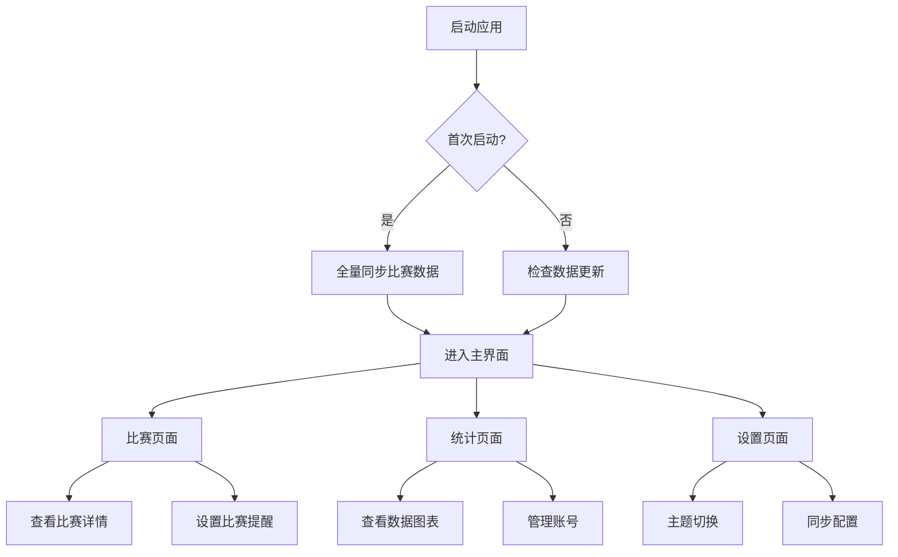

## 1. 产品概述
OJFlow是一款跨平台的在线评测（OJ）辅助工具，旨在帮助算法竞赛选手高效管理比赛信息和追踪做题进度。通过整合多个主流OJ平台数据，提供统一的比赛查询、统计分析和数据可视化功能。

目标用户为算法竞赛选手、编程爱好者和计算机科学学生，解决他们需要频繁切换不同OJ平台查看比赛信息和统计数据的痛点。

## 2. 核心功能

### 2.1 用户角色
| 角色 | 注册方式 | 核心权限 |
|------|----------|----------|
| 普通用户 | 本地使用，无需注册 | 查看比赛信息、管理个人做题统计、自定义设置 |

### 2.2 功能模块
OJFlow包含以下核心页面：
1. **比赛页面**：展示各平台比赛列表、倒计时、筛选搜索
2. **统计页面**：个人做题数据统计、可视化图表展示
3. **设置页面**：主题切换、账号管理、同步配置

### 2.3 页面详情
| 页面名称 | 模块名称 | 功能描述 |
|----------|----------|----------|
| 比赛页面 | 比赛列表 | 展示Codeforces、AtCoder、LeetCode、洛谷等平台比赛信息，包含名称、时间、时长、状态 |
| 比赛页面 | 倒计时组件 | 实时显示距离开始/结束的时间，支持时区自动转换 |
| 比赛页面 | 筛选搜索 | 按平台、时间范围、关键词筛选比赛，支持模糊搜索 |
| 比赛页面 | 缓存管理 | 本地SQLite存储，减少网络请求，支持手动刷新 |
| 统计页面 | 数据概览 | 显示总做题数、各平台做题数、近期活跃度 |
| 统计页面 | 趋势图表 | 折线图展示做题数量时间趋势，支持时间段选择 |
| 统计页面 | 难度分布 | 饼图展示题目难度分布情况 |
| 统计页面 | 平台对比 | 柱状图对比各平台做题数量 |
| 统计页面 | 技能雷达 | 雷达图展示算法标签掌握情况 |
| 统计页面 | 账号管理 | 支持多平台账号绑定与切换 |
| 设置页面 | 主题设置 | 深色/浅色主题切换，跟随系统选项 |
| 设置页面 | 同步配置 | 设置自动同步间隔、手动刷新、数据过期时间 |
| 设置页面 | 关于信息 | 显示版本号、开源协议、更新日志 |

## 3. 核心流程

### 主流程
1. 用户首次打开应用，自动同步各平台比赛信息到本地SQLite
2. 用户添加各OJ平台账号，应用抓取并统计做题数据
3. 用户可在比赛页面查看即将开始的比赛，设置提醒
4. 用户在统计页面分析自己的做题情况，制定学习计划
5. 应用定期自动同步数据，保持信息更新

## 4. 用户界面设计

### 4.1 设计风格
- **主色调**：深蓝色（#1e40af）为主，灰色（#6b7280）为辅
- **按钮样式**：圆角设计，hover效果，主要操作使用主色调
- **字体**：Inter字体，标题18-24px，正文14-16px
- **布局**：左侧导航栏（200px）+ 主内容区域，卡片式布局
- **图标**：使用Heroicons图标库，线条简洁风格

### 4.2 页面设计概览
| 页面名称 | 模块名称 | UI元素 |
|----------|----------|----------|
| 比赛页面 | 导航栏 | 左侧固定宽度，包含logo、三个主菜单项，当前选中高亮显示 |
| 比赛页面 | 比赛卡片 | 网格布局，每张卡片显示比赛信息、平台图标、倒计时，卡片hover有阴影效果 |
| 比赛页面 | 筛选栏 | 顶部横向布局，包含平台选择器、时间范围选择器、搜索框 |
| 统计页面 | 数据卡片 | 顶部四个统计卡片，显示关键指标，使用渐变色背景 |
| 统计页面 | 图表容器 | 响应式网格，每个图表独占一行或两列布局，支持全屏查看 |
| 设置页面 | 设置项 | 分组显示，每个设置项包含标题、描述、操作控件 |

### 4.3 响应式设计
- **桌面优先**：默认1440px设计，支持1280-1920px范围
- **平板适配**：768-1279px，导航栏折叠为图标模式
- **手机适配**：<768px，底部导航栏，卡片单列布局
- **触摸优化**：按钮最小44px点击区域，支持滑动手势

### 4.4 性能指标
- 应用启动时间 < 3秒
- 页面切换时间 < 500ms
- 数据查询响应时间 < 100ms
- 应用体积 < 50MB（压缩后）