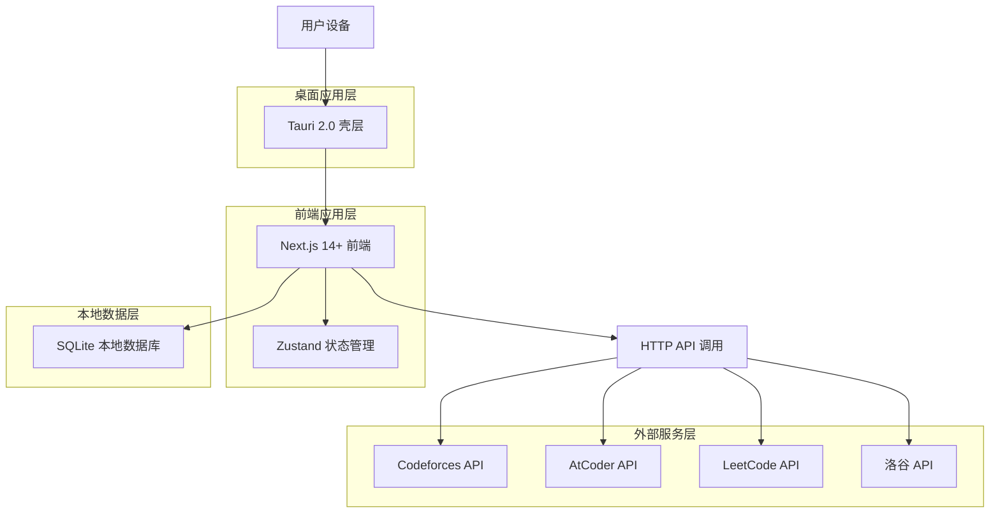
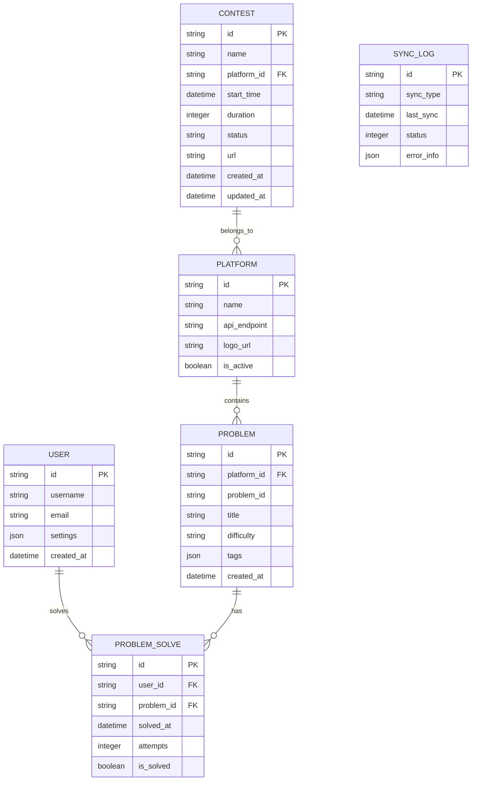
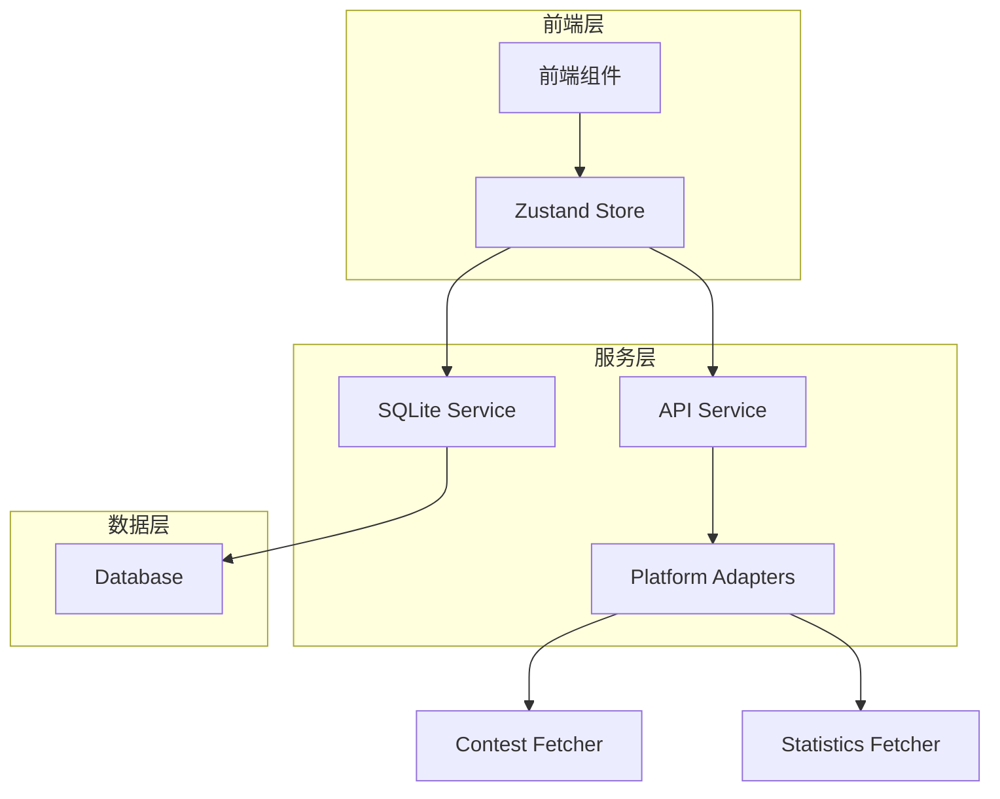

## 1. 架构设计



## 2. 技术描述

* **前端框架**: Next.js 14+ + TypeScript + React 18

* **初始化工具**: create-next-app

* **状态管理**: Zustand 4.x

* **UI组件库**: Tailwind CSS 3.x + Headless UI

* **图表库**: Chart.js 4.x + react-chartjs-2

* **数据库**: SQLite + better-sqlite3

* **桌面打包**: Tauri 2.0

* **构建工具**: Next.js 内置构建

* **测试框架**: Jest + React Testing Library

## 3. 路由定义

| 路由             | 用途              |
| -------------- | --------------- |
| /              | 比赛页面，展示所有平台比赛列表 |
| /statistics    | 统计页面，显示个人做题数据分析 |
| /settings      | 设置页面，应用配置和账号管理  |
| /contest/\[id] | 比赛详情页面，显示具体比赛信息 |

## 4. 数据模型定义



## 5. 数据库表结构

### 比赛表 (contests)

```sql
CREATE TABLE contests (
    id TEXT PRIMARY KEY,
    name TEXT NOT NULL,
    platform_id TEXT NOT NULL,
    start_time DATETIME NOT NULL,
    duration INTEGER NOT NULL,
    status TEXT NOT NULL DEFAULT 'upcoming',
    url TEXT,
    created_at DATETIME DEFAULT CURRENT_TIMESTAMP,
    updated_at DATETIME DEFAULT CURRENT_TIMESTAMP,
    FOREIGN KEY (platform_id) REFERENCES platforms(id)
);

CREATE INDEX idx_contests_start_time ON contests(start_time);
CREATE INDEX idx_contests_platform ON contests(platform_id);
CREATE INDEX idx_contests_status ON contests(status);
```

### 平台表 (platforms)

```sql
CREATE TABLE platforms (
    id TEXT PRIMARY KEY,
    name TEXT NOT NULL UNIQUE,
    api_endpoint TEXT,
    logo_url TEXT,
    is_active BOOLEAN DEFAULT true,
    created_at DATETIME DEFAULT CURRENT_TIMESTAMP
);

-- 初始化数据
INSERT INTO platforms (id, name, api_endpoint, logo_url) VALUES
('codeforces', 'Codeforces', 'https://codeforces.com/api/', '/logos/codeforces.png'),
('atcoder', 'AtCoder', 'https://atcoder.jp/', '/logos/atcoder.png'),
('leetcode', 'LeetCode', 'https://leetcode.com/', '/logos/leetcode.png'),
('luogu', '洛谷', 'https://www.luogu.com.cn/', '/logos/luogu.png');
```

### 用户做题记录表 (problem\_solves)

```sql
CREATE TABLE problem_solves (
    id TEXT PRIMARY KEY,
    user_id TEXT NOT NULL,
    platform_id TEXT NOT NULL,
    problem_id TEXT NOT NULL,
    problem_title TEXT,
    difficulty TEXT,
    solved_at DATETIME,
    attempts INTEGER DEFAULT 1,
    is_solved BOOLEAN DEFAULT true,
    created_at DATETIME DEFAULT CURRENT_TIMESTAMP,
    FOREIGN KEY (platform_id) REFERENCES platforms(id)
);

CREATE INDEX idx_solves_user_platform ON problem_solves(user_id, platform_id);
CREATE INDEX idx_solves_solved_at ON problem_solves(solved_at);
CREATE INDEX idx_solves_difficulty ON problem_solves(difficulty);
```

### 同步日志表 (sync\_logs)

```sql
CREATE TABLE sync_logs (
    id TEXT PRIMARY KEY,
    sync_type TEXT NOT NULL,
    last_sync DATETIME DEFAULT CURRENT_TIMESTAMP,
    status INTEGER DEFAULT 0,
    error_info TEXT,
    created_at DATETIME DEFAULT CURRENT_TIMESTAMP
);

CREATE INDEX idx_sync_logs_type ON sync_logs(sync_type);
CREATE INDEX idx_sync_logs_last_sync ON sync_logs(last_sync);
```

## 6. 核心服务架构



## 7. 状态管理设计

### Zustand Store 结构

```typescript
interface AppStore {
  // 用户设置
  settings: UserSettings
  theme: 'light' | 'dark' | 'system'
  
  // 比赛数据
  contests: Contest[]
  platforms: Platform[]
  contestFilters: ContestFilters
  
  // 统计数据
  statistics: UserStatistics
  userAccounts: UserAccount[]
  
  // UI状态
  loading: boolean
  error: string | null
  
  // 方法
  fetchContests: () => Promise<void>
  updateFilters: (filters: ContestFilters) => void
  syncStatistics: (accountId: string) => Promise<void>
  toggleTheme: () => void
}
```

## 8. 性能优化策略

### 8.1 前端优化

* **组件懒加载**: 使用 Next.js dynamic import

* **虚拟滚动**: 对长列表使用 react-window

* **图片优化**: WebP格式，响应式图片，懒加载

* **代码分割**: 按路由和组件分割代码

* **缓存策略**: SWR 进行数据缓存

### 8.2 数据库优化

* **索引优化**: 为查询字段建立合适索引

* **查询优化**: 使用预编译语句，避免N+1查询

* **数据分页**: 限制单次查询数据量

* **连接池**: 管理数据库连接

### 8.3 打包优化

* **Tree Shaking**: 移除未使用代码

* **资源压缩**: Gzip压缩，图片压缩

* **分片打包**: 按功能模块分片

* **Tauri优化**: 启用UPX压缩，移除调试符号

## 9. 测试策略

### 9.1 单元测试

* **覆盖率目标**: >80%

* **测试范围**: 工具函数、数据转换、状态管理

* **测试框架**: Jest + React Testing Library

### 9.2 集成测试

* **API测试**: 模拟外部API响应

* **数据库测试**: 测试数据操作逻辑

* **端到端测试**: 使用 Playwright 测试核心流程

## 10. 部署配置

### 10.1 Tauri 配置

```json
{
  "tauri": {
    "bundle": {
      "active": true,
      "targets": ["msi", "app", "dmg", "deb", "rpm"],
      "identifier": "com.ojflow.app",
      "icon": [
        "icons/32x32.png",
        "icons/128x128.png",
        "icons/128x128@2x.png",
        "icons/icon.icns",
        "icons/icon.ico"
      ]
    },
    "windows": [
      {
        "fullscreen": false,
        "resizable": true,
        "title": "OJFlow",
        "width": 1200,
        "height": 800,
        "minWidth": 800,
        "minHeight": 600
      }
    ]
  }
}
```

### 10.2 构建命令

```bash
# 开发模式
npm run tauri dev

# 生产构建
npm run build
npm run tauri build

# 运行测试
npm run test
npm run test:coverage
```

