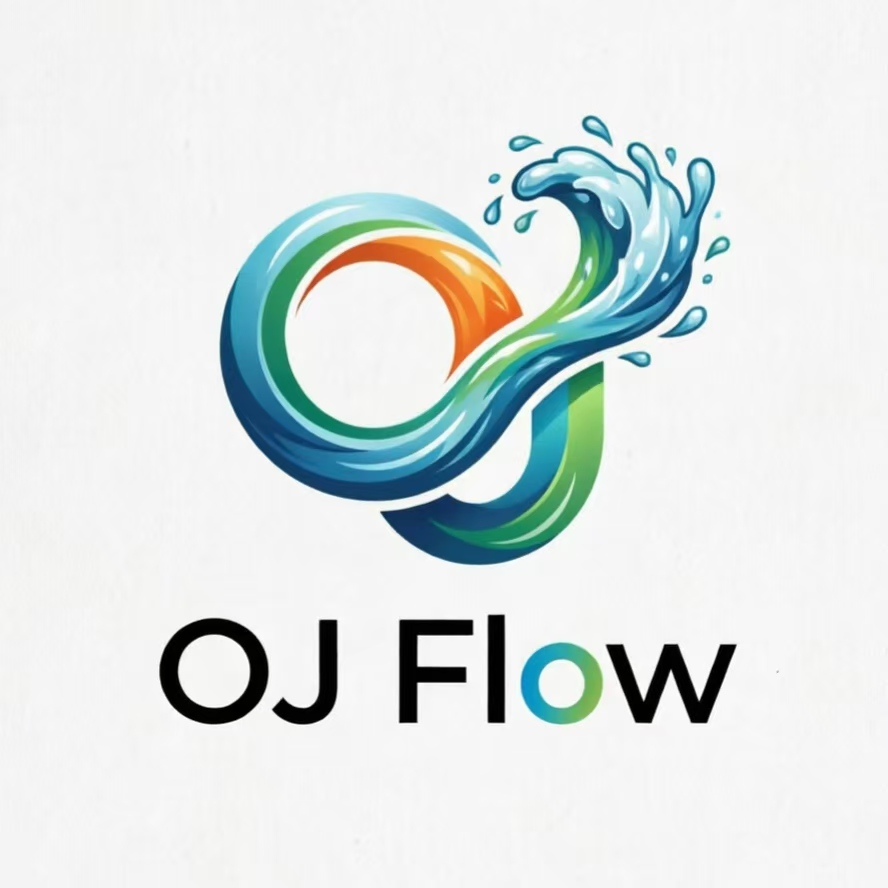

<div align="center">
  
  <h1>OJFlow</h1>
  <p><strong>Stay in the zone, skip the clutter.</strong></p>
  <p>基于 Electron + Vue 3 的现代化算法竞赛辅助工具</p>

  <p>
    <a href="https://github.com/Siborne/OJFlow">
      
    </a>
    <a href="https://github.com/Siborne/OJFlow/releases">
      
    </a>
    <a href="./LICENSE">
      
    </a>
    <br />
    
    
    
    
    
    
  </p>

  <p>
    <a href="./README.md">中文</a>
  </p>
</div>

---

> **致谢**：本项目参考并致敬了 [oj_helper](https://github.com/2754LM/oj_helper) 项目，感谢原作者的开源贡献。

## 📖 项目简介 (Introduction)

**OJFlow** 是一个专为算法竞赛（ACM/ICPC, OI）选手打造的跨平台桌面应用。它致力于解决多平台账号管理混乱、比赛信息分散、数据查看不便等痛点。

通过 **OJFlow**，你可以：

- **一站式管理**：聚合 Codeforces, AtCoder, LeetCode 等主流 OJ 平台。
- **专注训练**：提供沉浸式的刷题体验，减少无关信息的干扰。
- **数据可视化**：直观展示你的 Rating 变化曲线与解题数量统计，助你科学分析训练进度。

## 🛠 技术栈 (Tech Stack)

本项目基于现代化的前端技术栈构建，确保了高性能与良好的开发体验：

| 模块 | 技术选型 | 说明 |
| :--- | :--- | :--- |
| **Core** | [Electron](https://www.electronjs.org/) | 跨平台桌面应用容器 (v30.x) |
| **Framework** | [Vue 3](https://vuejs.org/) | 渐进式 JavaScript 框架 |
| **Language** | [TypeScript](https://www.typescriptlang.org/) | 强类型的 JavaScript 超集 |
| **Build Tool** | [Vite](https://vitejs.dev/) + [Bun](https://bun.sh/) | 极速的构建工具与运行时 |
| **UI Library** | [Naive UI](https://www.naiveui.com/) | Vue 3 组件库，极简风格 |
| **State** | [Pinia](https://pinia.vuejs.org/) | 直观、类型安全的状态管理 |
| **Utils** | [Cheerio](https://cheerio.js.org/) | 服务端 HTML 解析与爬虫 |
| **Charts** | [ECharts](https://echarts.apache.org/) | 强大的数据可视化库 |

## ✨ 功能特性 (Features)

- [x] 📅 **比赛日历**：实时同步各大 OJ 近期比赛信息，支持添加提醒。
- [x] 📈 **Rating 追踪**：可视化展示 Codeforces / AtCoder 等平台的积分变化。
- [x] 📊 **刷题统计**：自动统计各平台 AC 题目数量，生成能力雷达图。
- [x] 🚀 **快捷导航**：内置常用 OJ 平台入口，支持自定义添加。
- [x] 🎨 **现代化 UI**：基于 Naive UI 设计，支持深色模式。
- [ ] 📝 **本地题解**：支持 Markdown 编写与管理本地题解库 (Planned)。
- [ ] 🤖 **虚拟竞赛**：模拟真实比赛环境，支持倒计时与榜单 (Planned)。

## 🚀 快速开始 (Quick Start)

### 环境要求

- **Node.js**: >= 18.0.0
- **Bun**: >= 1.0.0 (推荐) 或 npm/pnpm

### 安装步骤

1. **克隆仓库**

   ```bash
  git clone https://github.com/Siborne/OJFlow.git
   cd OJFlow
   ```

2. **安装依赖**

   ```bash
   bun install
   # 或者
   npm install
   ```

3. **启动开发环境**

   ```bash
   bun run dev
   # 或者
   npm run dev
   ```

   此命令将同时启动 Vite 开发服务器和 Electron 应用窗口。

4. **构建应用**

   ```bash
   # 构建生产环境包
   bun run dist
   
   # 针对特定平台构建
   bun run dist:win   # Windows
   bun run dist:mac   # macOS
   bun run dist:linux # Linux
   ```

### 常用脚本

```bash
# 开发
bun run dev

# 类型检查
bun run type-check

# Lint
bun run lint

# 自动修复 Lint
bun run lint:fix

# 单元测试
bun run test:unit

# E2E 测试
bun run test:e2e
```

## 📺 使用示例 (Usage Examples)

### 1. 个人能力概览

启动应用后，首页直观展示各大平台的刷题数据与 Rating 积分，助你快速了解当前状态。

<div align="center">
  
  <p><em>各平台解题数量统计</em></p>
</div>

### 2. Rating 曲线追踪

进入 Rating 页面，查看你在 Codeforces 和 AtCoder 的积分走势，激励自己不断突破。

<div align="center">
  
  <p><em>Rating 变化趋势图</em></p>
</div>

## 🤝 贡献指南 (Contributing)

我们非常欢迎社区贡献！如果您想参与开发，请遵循以下步骤：

1. **Fork** 本仓库。
2. 创建您的特性分支 (`git checkout -b feature/AmazingFeature`)。
3. 提交您的更改 (`git commit -m 'Add some AmazingFeature'`)。
4. 推送到分支 (`git push origin feature/AmazingFeature`)。
5. 开启一个 **Pull Request**。

请确保在提交前运行代码检查：

```bash
# 运行类型检查与 Lint
bun run type-check
bun run lint
```

## 📚 相关文档

- [版本发布指南](./RELEASE_GUIDE.md)
- [项目产品文档](./docs/PRD.md)
- [Contest Tab 设计说明](./docs/CONTEST_TAB_DESIGN.md)
- [Contest Tab 实现总结](./docs/CONTEST_TAB_IMPLEMENTATION_SUMMARY.md)

## 📄 开源协议 (License)

本项目采用 [GNU General Public License v3.0](./LICENSE) 开源协议。

---

<div align="center">
  <p>Made with ❤️ by OJFlow Team</p>
</div>
